# 1. 컴퓨터 네트워크와 인터넷

## 1.1 인터넷이란 무엇인가?

### 1.1.1 구성요소로 본 인터넷

- 전 세계적으로 수십억 개의 컴퓨팅 장치를 연결하는 `컴퓨터 네트워크`

- **컴퓨팅 장치의 종류**

    - 데스크톱 PC

    - 리눅스 워크스테이션

    - 웹 페이지와 전자메일 메시지 같은 정보를 저장하고 전송하는 서버들

    - 스마트폰과 태블릿

- 오늘날에는 TV, 게임 콘솔, 자동온도조절기, 홈보안시스템, 가전제품, 시계, 안경, 자동차 등 사물들이 인터넷에 연결되고 있다. `(IoT)`

- 때문에 `컴퓨터 네트워크` 대신 `호스트(host) / 종단 시스템(end system)`이라고 부른다.

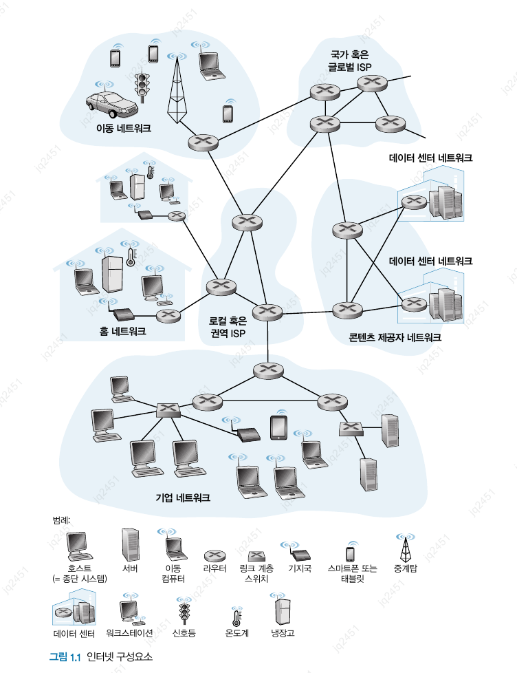
 

- **종단 시스템**

    - `통신 링크(communication link)`와 `패킷 스위치(packet switch)`의 네트워크로 연결된다.

    - **통신 링크의 구성**

        - 동축케이블, 구리선, 광케이블, 라디오 스펙트럼을 포함한 다양한 물리 매체

        - 각각의 링크는 다양한 전송률을 제공하며, 전송률은 `초당 비트 수(bps)` 단위를 사용한다.

    - `패킷(packet)` 
    
        - 한 종단 시스템이 다른 종단 시스템으로 보낼 데이터를 갖고 있을 때, 송신 종단 시스템은 그 데이터를 `세그먼트(segment)`로 나누고 각 세그먼트에 `헤더(header)`를 붙인다.

        - 패킷은 목적지 종단 시스템으로 네트워크를 통해 보내지고 목적지에서 원래의 데이터로 다시 조립된다.

        - `패킷 교환기(packet switch)`

            - 입력 통신 링크의 하나로 도착하는 패킷을 받아서 출력 통신 링크의 하나로 그 패킷을 전달한다.

            - **대표적인 종류**

                - `라우터(router)`

                    - 네트워크 코어에서 사용된다.

                - `링크 계층 스위치(link-layer switch)`

                    - 접속 네트워크에서 사용된다.
    
            - 두 형태의 스위치는 최종 목적지 방향으로 패킷을 전달한다.

            - **네트워크상의 경로** (`route / path`) : 패킷이 송신에서 수신 종단 시스템에 도달하는 동안 거쳐온 일련의 통신 링크와 패킷 스위치

        - 패킷 교환 네트워크는 수송 네트워크와 유사하다.

            - 패킷은 화물이 적재된 트럭

            - 통신 링크는 고속도로, 도로 등의 길

            - 패킷 교환기는 교차로

            - 종단 시스템은 출발지, 목적지

    - `ISP(Internet Service Provider)`
    
        - 종단 시스템은 `ISP(Internet Service Provider)`를 통해 인터넷에 접속한다.

        - 각 ISP는 패킷 스위치와 통신 링크로 이루어진 네트워크다.

        - ISP는 종단 시스템을 서로 연결하는 것이며 ISP끼리도 서로 연결되어야만 한다.

        - 상위 계층이든 하위 계층이든 각 ISP 네트워크는 따로 관리되고 IP 프로토콜을 수행하며 네이밍과 주소배정 방식을 따른다.

    - `프로토콜(protocol)`

        - 종단 시스템, 패킷 스위치를 비롯한 구성요소는 인터넷에서 정보 송수신을 제어하는 여러 프로토콜을 수행한다.

        - `TCP(Transmission Control Protocol) / IP(Internet Protocol)`

            - 인터넷에서 가장 중요한 프로토콜

            - IP 프로토콜은 라우터와 종단 시스템 사이에서 송수신되는 패킷 포맷을 기술한다.

    - `IETF(Internet Engineering Task Force)`

        - 각각의 프로토콜이 무엇을 수행하는지에 대해 합의하는 인터넷 표준

        - `RFC(requests for comment)` : IETF 표준 문서

            - TCP, IP, HTTP, SMTP 같은 프로토콜을 정의하며, 현재 9000개 이상의 RFC가 있다.

### 1.1.2 서비스 측면에서 본 인터넷

- `애플리케이션에 서비스를 제공하는 인프라스트럭처`로서 인터넷을 기술한다.

- 인터넷 애플리케이션은 서로 데이터를 교환하는 많은 종단 시스템을 포함하고 있어 `분산 애플리케이션(distributed application)`이라고 부른다.

- 인터넷 애플리케이션은 종단 시스템에서 수행되며, 패킷 교환기는 `종단 시스템 간의 데이터 교환을 도와줄 뿐` 시작과 끝인 애플리케이션에는 관심을 두지 않는다.

> **질문**  
> 한 종단 시스템에서 수행되는 애플리케이션이 다른 종단 시스템에서 수행되고 있는 프로그램으로 데이터를 보내도록 인터넷에 어떻게 지시할 것인가?

- `소켓 인터페이스(socket interface)`

    - 한 종단 시스템에서 수행되는 프로그램이 어떻게 인터넷 인프라스트럭처에 다른 종단 시스템에서 수행되는 특정 목적지 프로그램으로 데이터를 전달하도록 요구하는지 명시

    - 송신 프로그램이 따라야 하는 규칙의 집합, 인터넷은 이 규칙에 따라 데이터를 목적지 프로그램으로 전달한다.

### 1.1.3 프로토콜이란 무엇인가?

- **사람과의 비교**

    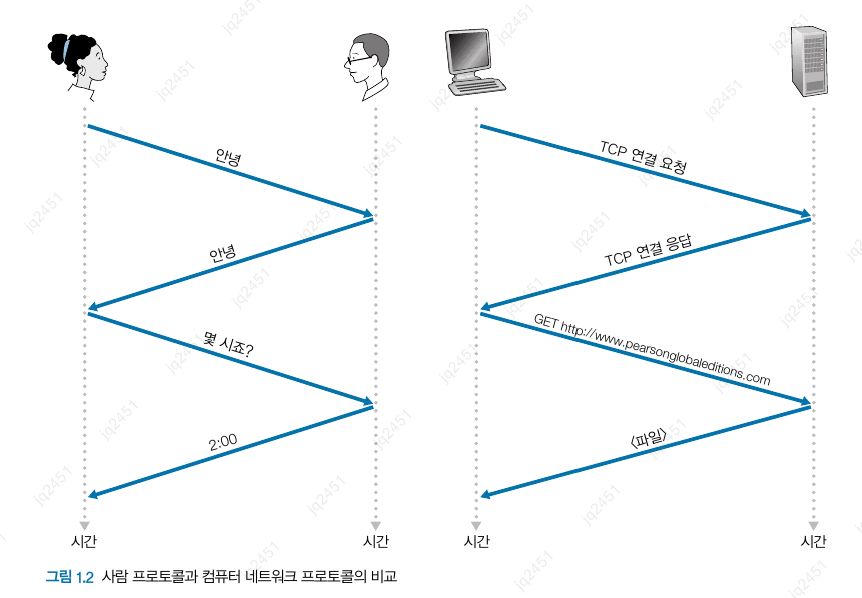
     

    - 사람 프로토콜의 중심 역할 : `명확하게 송수신된 메시지와 이러한 메시지가 송수신될 때나 다른 상황이 발생했을 때 취하는 행동`

    - 어떤 일을 수행하려면 둘 이상의 통신 개체(entity)가 함께 인식하는 프로토콜이 필요하다.

- **네트워크 프로토콜**

    - 네트워크 프로토콜과 사람 간의 프로토콜은 매우 유사하다.

    - 프로토콜은 둘 이상의 통신 개체 간의 교환되는 메시지 포맷과 순서뿐만 아니라, 메시지의 송수신과 다른 이벤트에 따른 행동들을 정의한다.

## 1.2 네트워크의 가장자리

- 네트워크 가장자리에서 네트워크 코어로 이동하고 컴퓨터 네트워크에서의 `스위칭(교환)과 라우팅(경로설정)`에 대해 살펴보자.

- 호스트는 때때로 `클라이언트(client)`와 `서버(server)`로 구분된다.

### 1.2.1 접속 네트워크

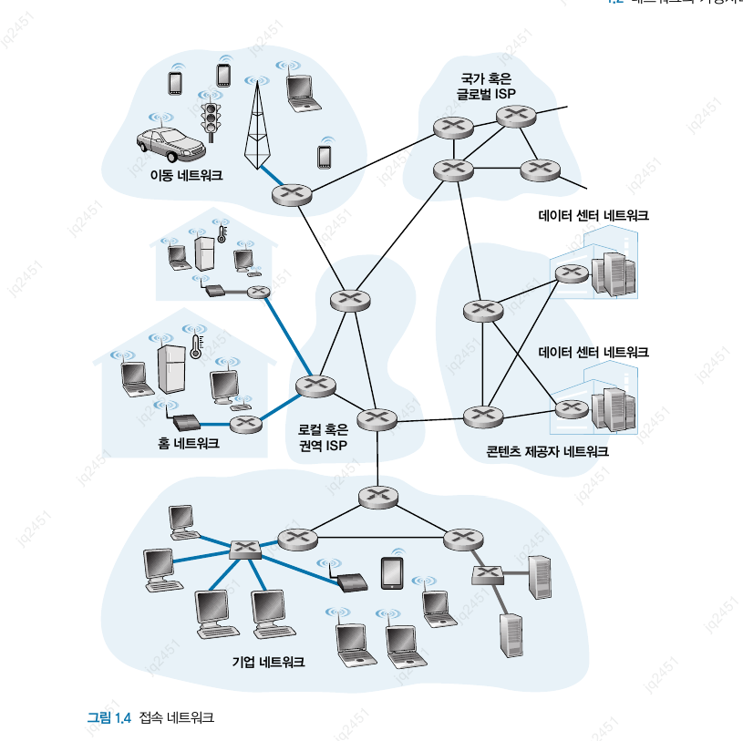
 

- 한 종단 시스템에서부터 먼 거리에 있는 다른 종단 시스템까지의 경로상에 있는 `첫 번쨰 라우터(가장자리 라우터(edge router))`에 연결하는 네트워크

- **가정 접속: DSL, 케이블, FTTH, 5G 고정 무선**

    - 미국에서 가장 널리 보급된 광대역 가정 접속 유형

        - DSL(digital subscriber line)

            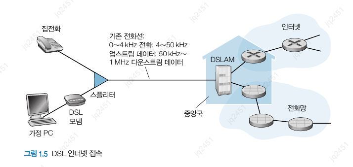
             

            - 최대 전송률은 가정과 CO(지역 중앙국) 간의 거리, 꼬임상선의 규격, 전기적 간섭의 정도에 따라 제한될 수 있다.

            - 초기엔 가정과 CO의 짧은 거리를 고려해서 설계해, 8~16km 내에 있지 않으면 가정은 다른 유형의 인터넷 접속을 고려해야 했다.

        - 케이블

            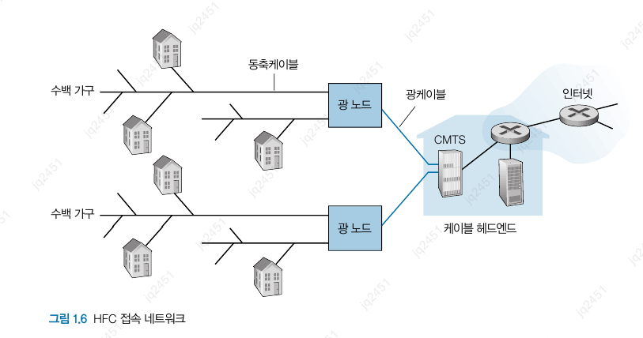
             

            - 공유 방송 매체

                - 헤드엔드가 보낸 모든 패킷이 모든 링크의 다운스트림 채널을 통해 가정으로 전달된다.

        - FTTH

            - CO로부터 가정까지 직접 광섬유 경로를 제공한다.

            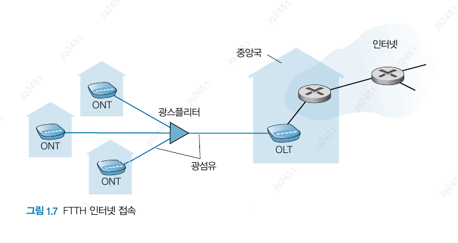
             

        - 5G-FW

            - 빔포밍 기술을 이용해 기지국에서 가정 내의 모뎀으로 데이터를 무선으로 전송한다.

- **기업(그리고 가정) 접속: 이더넷과 와이파이**

    - `LAN(local area nexwork)`은 일반적으로 종단 시스템을 가장자리 라우터에 연결하는 데 사용된다.

    - 이더넷 : 기업, 대학, 홈 네트워크에서 가장 널리 사용되는 접속 기술

    - 와이파이 : 무선 랜 환경에서 사용자들은 기업 네트워크에 연결된 AP(access point)로 패킷을 송수신하고 AP는 다시 유선 네트워크에 연결된다.

- **광역 무선 접속: 3G와 LTE 4G와 5G**

    - 기지국을 통해 패킷을 송수신하는 것과 같은 무선 인프라스트럭처를 채택

### 1.2.2 물리 매체

- 비트가 출발지에서 목적지로 전달될 때, 일련의 송신기-수신기 쌍을 거친다.

- 각 송신기-수신기 쌍에 대해 비트는 물리 매체 상에 전자파나 광 펄스를 전파해 전송하게 된다.

- **물리 매체 유형**

    - 유도 매체(guided media)

        - 케이블과 같은 견고한 매체를 따라 파형을 유도

    - 비유도 매체(unguided media)

        - 무선 랜 혹은 위성 채널의 경우처럼 대기와 야외 공간으로 파형을 전파

- **꼬임상선**

    - 가장 싸고 많이 이용하는 매체

    - 2개의 절연 구리선이며, 각각 1mm의 굵기로 규칙적인 나선 형태로 배열

    - 전송률 : 10 Mbps ~ 10 Gbps

- **동축케이블**

    - 2개의 구리선으로 되어 있으나 두 구리선이 평행하지 않고 동심원 형태를 이룬다.

    - 꼬임상선보다 높은 데이터 전송률을 얻을 수 있다.

- **광섬유**

    - 비트를 나타내는 빛의 파동을 전하는 가늘고 유연한 매체

    - 초당 10~100기가비트를 지원한다.

    - 전자기성 간섭에 영향을 받지 않으며 100km까지 신호 감쇠 현상이 적고 도청이 어렵다.

    - 가격이 고가여서 LAN이나 가정처럼 근거리 전송에는 잘 사용하지 않는다.

    - 표준 링크 속도 : 51.8 Mbps ~ 39.8 Gbps

- **지상 라디오 채널**

    - 전자기 스펙트럼으로 신호를 전달

    - 물리 선로를 설치할 필요가 없고, 벽을 관통할 수 있으며, 이동 사용자에게 연결성을 제공하고 먼 거리까지 신호를 전달할 수 있다.

    - 전파 환경과 신호가 전달되는 거리에 영향을 많이 받는다.

- **위성 라디오 채널**

    - 통신 위성은 지상 스테이션이라는 둘 이상의 지상 기반 마이크로파 송신기/수신기를 연결한다.

    - 위성은 한 주파수 대역으로 전송 신로를 수신, 리피터를 이용해 그 신호를 재생, 그 신호를 다른 주파수 대역으로 전송한다.

    - 초당 기기비트의 전송률을 제공한다.

    - 통신에는 정지 위성, 저궤도 위성 2가지가 사용된다.

## 1.3 네트워크 코어

### 1.3.1 패킷 교환

- 네트워크 애플리케이션에서 종단 시스템들은 서로 메시지를 교환한다.

- 출발지 종단 시스템에서 목적지 종단 시스템으로 메시지를 보내기 위해 송신 시스템은 긴 메시지를 `패킷(packet)`이라는 작은 데이터 덩어리로 분할한다.

- 송신과 수신 측 사이 각 패킷은 통신 링크와 패킷 스위치를 거친다.

- 패킷은 링크의 최대 전송률과 같은 속도로 각각의 통신 링크에서 전송된다.

- 패킷을 전송하는 데 걸리는 시간 : $L/R$

- **저장-후-전달**

    - 대부분의 패킷 스위치는 `저장-후-전달 전송(store-and-forward transmission)` 방식을 이용한다.

        - 스위치가 출력 링크로 패킷의 첫 비트를 전송하기 전에 전체 패킷을 받아야 함을 의미한다.

    - 라우터는 보통 여러 개의 링크를 갖는다.

        - 그 이유는 라우터의 기능이 입력되는 패킷을 출력 링크로 교환하는 것이기 때문이다.

        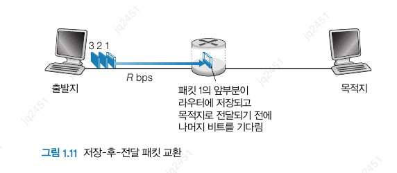
         

        - 출발지로부터 목적지 노트까지 N개의 링크로 구성된다고 치면 종단 간 지연은 다음과 같다.

        $$d_{\space 종단\space 간 \space 지연} = N\frac{L}{R}$$

- **큐잉 지연과 패킷 손실**

    - 각 링크에 대해 패킷 스위치는 출력 버퍼, 출력 큐를 갖고 있으며 그 링크로 송신하려고 하는 패킷을 저장하고 있다.

    - 패킷은 출력 버퍼에서 `큐잉 지연(queuing delay)`을 겪는다.

        - 이 지연은 가변적이고 네트워크의 혼잡 정도에 따라 다르다.

    - 이로 인해 버퍼 공간이 가득 차게 된다면, `패킷 손실(packet loss)`이 발생한다.

    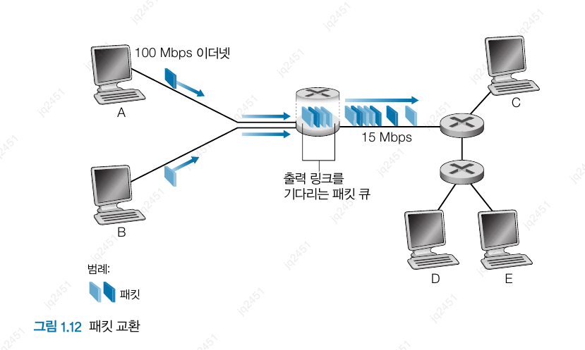
     

    - 만약 패킷이 15 Mbps의 링크를 초과하면 라우터에서 혼잡이 발생하게 되고 링크로 전송되기 전에 링크의 출력 버퍼에 큐잉된다.
        

- **포워딩 테이블과 라우팅 프로토콜**

    > **질문**  
    > 라우터는 어떻게 패킷을 어느 링크로 전달해야 하는지를 결정하는가?

    - 인터넷에서 모든 종단 시스템은 IP 주소를 갖는다.

    - 출빌지 종단 시스템이 패킷을 목적지로 보낼 때, 출발지는 패킷의 헤더에 목적지의 IP 주소를 포함한다.

    - 각 라우터는 목적지 주소(혹은 일부)를 라우터의 출력 링크로 매핑하는 `포워딩 테이블(forwarding table)`을 갖고 있다.
    
    - 라우터는 포워딩 테이블을 통해 올바른 출력 링크로 패킷을 보낸다.

    > **질문**  
    > 포워딩 테이블은 어떻게 설정되는가?

    - 포워딩 테이블은 여러 `라우팅 프로토콜(routing protocol)`에 의해 동적으로 설정된다.

    - 라우팅 프로토콜은 각 라우터로부터 각 목적지까지의 최단 경로를 결정한다.

### 1.3.2 회선 교환

- 링크와 스위치의 네트워크를 통해 데이터를 이동시키는 방식

    - 회선 교환(circuit switching)

    - 패킷 교환(packet switching)

- 회선 교환에서 종단 시스템 간에 통신을 제공하기 위해 경로상에 필요한 자원(버퍼, 링크 전송률)은 통신 세션 동안에 확보 또는 예약된다.

- 패킷 교환에선 자원을 에약하지 않는다.

- 네트워크가 `회선`을 설정할 때, 그 연결이 이루어지는 동안 네트워크 링크에 일정한 전송률을 예약한다.

    - `회선(circuit)` : 송신자와 수신자 간의 경로에 있는 스위치들이 해당 연결 상태를 유지해야 하는 연결

- 에약된 전송률은 송신자가 수신자에게 일정 전송률로 데이터를 보낼 수 있도록 보장한다.

- 패킷 교환일 경우, 링크가 혼잡하면 버퍼에서 기다려야하고 지연이 발생한다.

- 최대한 빠르게 패킷을 전달하려고 최선을 다하지만 일정한 시간에 전달하는 것을 보장할 수 없다.

- **회선 교환 네트워크에서의 다중화**

    - 주파수 분할 다중화(frequency=division multiplexing, FDM)

        - 링크를 통해 설정된 연결은 그 링크의 주파수 스펙트럼을 공유한다.

        - 그 링크는 연결되는 동안 각 연결에 대해 주파수 대역을 고정 제공한다.

        - 이를 `대역폭(bandwidth)`라고 한다.

    - 시분할 다중화(time-division multiplexing, TDM)

        - 시간을 일정 주기의 프레임으로 구분하고 각 프레임은 고정된 수의 시간 슬롯으로 나뉜다.

        - 네트워크가 연결을 설정할 때, 모든 프레임에서 시간 슬롯 1개를 그 연결에 할당한다.

    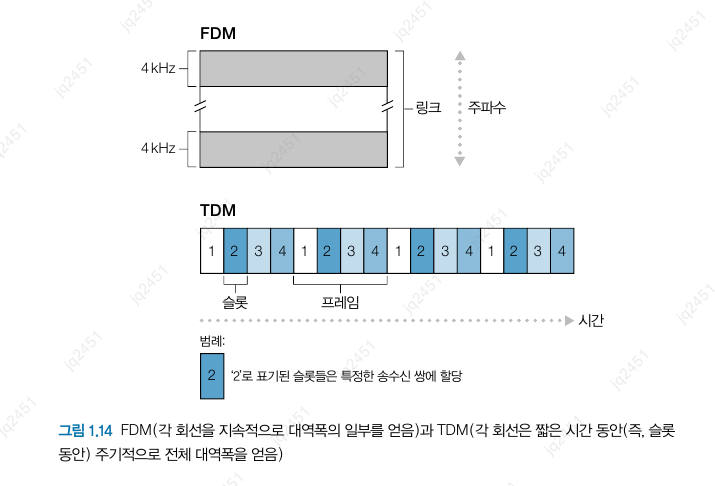
     

    - 패킷 교환 입장에선 회선 교환의 경우 할당된 회선이 `비활용 기간(silent period)`에 놀게 되므로 낭비라고 주장했다.

- **패킷 교환 대 회선 교환**

    - 패킷 교환 반대 
    
        - 가변적이고 예측할 수 없는 종단 간의 지연 떄문에 패킷 교환이 실시간 서비스에 적당하지 않다.

    - 패킷 교환 옹호

        1. 패킷 교환이 회선 교환보다 전송 용량의 공유에서 더 효율적이다.

        2. 패킷 교환이 더 간단하고 효율적이며 회선 교환보다 구현 비용이 적다.

    > **질문**  
    > 패킷 교환이 왜 효율적인가?

    - 활동 시간과 비활동 시간이 반복한다고 했을 때, 회선 교환은 항상 각각의 사용자에게 예약되어야 한다.

    - 일정 수 이상의 동시 사용자가 있다면 패킷 교환은 지연이 발생한다.

    - 그러나 일정 수 이상의 동시 사용자가 있을 확률은 매우 작으므로 패킷 교환은 거의 항상 회선 교환과 대등한 지연 성능을 가지면서도 거의 3배 이상의 사용자 수를 허용한다.

    - 패킷 교환의 경우 패킷을 생성하는데 다른 사용자가 없기에 다중화가 요구되지 않고, 사용자는 링크가 가득 찰 때까지 패킷을 계속 보낼 수 있다.

    - 회선 교환은 요구에 관계없이 전송 링크의 사용을 할당하는 반면 패킷 교환은 요구할 때만 링크의 사용을 할당하는 것이다.

### 1.3.3 네트워크의 네트워크

- **네트워크 구조 1**

    - 모든 접속 ISP를 하나의 `글로벌 통과(transit) ISP`와 연결한다.

        - 글로벌 ISP : 라우터와 전 세계에 이르고 적어도 수십만 개의 접속 ISP와 가까운 곳에 있는 라우터를 갖는 통신 링크의 네트워크

            - 그러한 확장된 네트워크를 구축하는 데 매우 많은 비용이 든다.

            - 이익을 위해 각각의 접속 ISP에 연결을 위한 과금을 하며, 과금은 트래픽의 양을 반영한다.

- **네트워크 구조 2**

    - 수십만 개의 접속 ISP와 다중의 글로벌 ISP로 구성된다.

    - 상위층에 글로벌 제공자가 있고 하위층에 접속 ISP가 있는 2계층구조다.

- **네트워크 구조 3**
    
    - 글로벌 ISP가 없는 지역은 지역 ISP가 따로 있어, 지역 ISP는 1계층 ISP들과 연결된다.

    - 접속 ISP는 지역 ISP에게, 지역 ISP는 1계층 ISP에게 요금을 지불한다.

    - 국가 단위의 경우, 접속 ISP -> 지방 ISP -> 국가 ISP -> 1계층 ISP 이런식으로 다중계층구조를 지닌다.

- **네트워크 구조 4**

    - 고객 ISP는 글로벌 인터넷 연결성을 얻기 위해 서비스 제공 ISP에게 요금을 지불한다.

        - 이 요금은 트래픽의 양을 반영하며, 이 비용을 줄이기 위해 가까운 ISP들끼리 `피어링`할 수 있다.

            - 모든 트래픽을 상위 계층 ISP를 통하지 않고 송수신할 수 있도록 자신들의 네트워크를 서로 직접 연결하는 것이다.

    - `IXP` : 다중의 ISP들이 서로 피어링할 수 있는 만남의 장소같은 곳

- **네트워크 구조 5**

    - 네트워크 구조 4 위에 `콘텐츠 제공자 네트워크`를 추가함으로써 구축한다.

    - 자신만의 사설 네트워크를 구축함으로써 콘텐츠 제공자들은 상위 계층 ISP들에게 지불하는 요금을 줄이고 서비스에 대한 더 많은 통제권을 가질 수 있다.

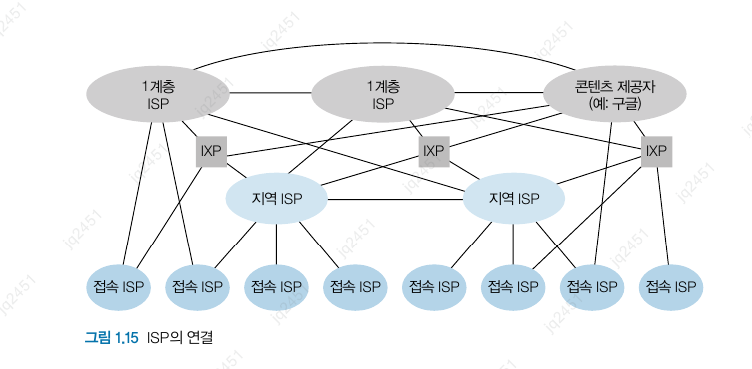
 

## 1.4 패킷 교환 네트워크에서의 지연,손실과 처리율

### 1.4.1 패킷 교환 네트워크에서의 지연 개요

- 패킷이 경로에 따라 한 노드에서 다음 노드로 전달되므로 그 과정에서 다양한 지연을 겪는다.

    1. 노드 처리 지연(nodal processing delay)

    2. 큐잉 지연(queuing delay)

    3. 전송 지연(transmission delay)

    4. 전파 지연(propagation delay)

- 많은 애플리케이션의 성능은 네트워크의 지연에 영향을 받는다.

- **지연 유형**

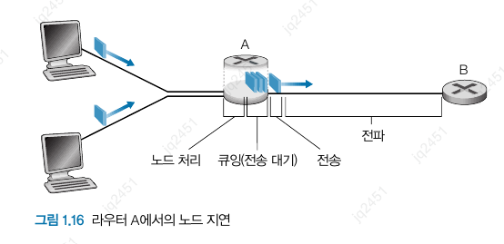
 

- **처리 지연**

    - 패킷 헤더를 조사하고 그 패킷을 어디로 보낼지를 결정하는 시간

    - 업스트림 노드에서 라우터 A로 패킷의 비트를 전송하면서 발생하는 패킷의 비트 레벨 오류를 조사하는 데 필요한 시간과 같은 요소가 포함된다.

    - 처리 이후 링크에 앞선 큐로 보낸다.

- **큐잉 지연**

    - 패킷은 큐에서 링크로 전송되기를 기다리면서 지연을 겪는다.

    -
