# 2. 애플리케이션 계층

- 웹, 전자메일, DNS, P2P(peer-to-peer) 파일 분배, 비디오 스트리밍을 비롯한 여러 네트워크 애플리케이션을 살펴본다.

- TCP와 UDP에서의 네트워크 애플리케이션 개발을 다룬다.

- 소켓 API를 알아본다.

## 2.1 네트워크 애플리케이션의 원리

- 네트워크 애플리케이션 개발의 중심은 다른 위치의 종단 시스템에서 동작하고 네트워크를 통해 서로 통신하는 프로그램을 작성하는 것이다.

    - 웹 애플리케이션에는 서로 통신하는 서버와 클라이언트로 구성된다.

    - ex ) 사용자의 호스트에서 실행되는 브라우저 - 웹 서버 호스트에서 실행되는 웹 서버 프로그램

- 이 같은 새로운 애플리케이션을 개발할 떄는 C, 자바 혹은 파이썬 등으로 작성된다.

- 중요한 점 : 라우터, 링크 계층 스위치처럼 네트워크 코어 장비에서 실행되는 소프트웨어까지 작성할 필요는 없다.

### 2.1.1 네트워크 애플리케이션 구조

- `애플리케이션 구조(application architecture)`

    - 애플리케이션이 다양한 종단 시스템에서 어떻게 조직되어야 하는지 알려준다.

    1. `클라이언트-서버 구조(client-server architecture)`

        - 서버(server) : 항상 동작하고 있는 호스트

        - 클라이언트(client) : 서버한테 서비스를 요청하는 호스트

        - 웹 서버가 클라이언트로부터 객체를 요청받으면 웹 서버는 요청된 객체를 클라이언트 호스트로 보내면서 응답한다.

        - 클라이언트끼리는 서로 직접적으로 통신하지 않는다.

        - 서버는 `고정 IP 주소`를 가지고 있어 언제든 접근할 수 있다.

        - ex ) 웹, 파일 전송, 원격 로그인, 전자메일

        - 하나의 서버로 처리하는 데 한계가 있기 때문에 `데이터센터(data center)`를 가상의 서버를 생성하는 역할로 사용하기도 한다.

    2. `P2P 구조`

        - 항상 켜져 있는 인프라스트럭처 서버에 최소로 의존하거나 의존하지 않는다.

        - 애플리케이션은 `피어(peer)`라는 호스트 쌍이 서로 직접 통신하게 한다.

        - ex ) 비트 토렌트

        - P2P 구조의 특성 : `자가 확장성(self-scalability)`

            - 각 피어들이 파일을 요구함으로써 작업 부하를 만들어내지만 서로 파일을 분배함으로써 그 시스템에 서비스 능력을 추가한다.

            - 클라이언트-서버 구조보다 서버 비용을 요구하지 않기 때문에 비용 효율적이다.

        - 미래 P2P는 이러한 분산 구조 특성 떄문에 보안, 성능, 신뢰성 면에서 커다란 도전을 맞이하고 있다.

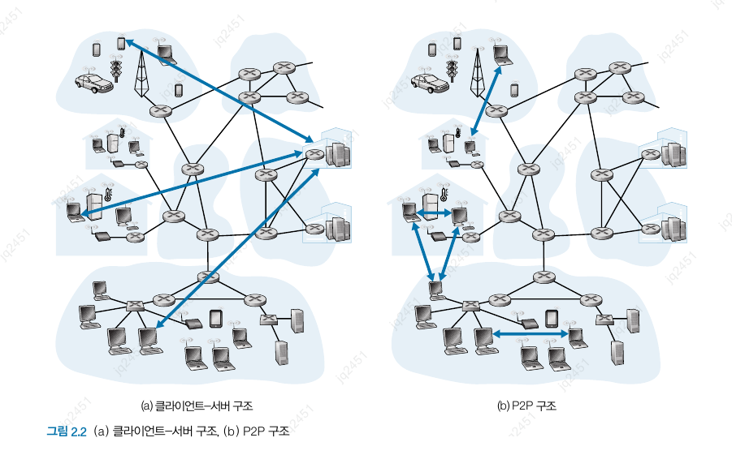
<br>

### 2.1.2 프로세스 간 통신

- `프로세스(process)`

    - 종단 시스템에서 실행되는 프로그램

    - 통신 프로세스가 같은 종단 시스템에서 실행될 때 그들은 서로 프로세스 간에 통신한다.

    - 프로세스간 통신은 종단 시스템의 운영체제에 의해 좌우된다.

    - 프로세스는 네트워크를 통한 메시지 교환으로 서로 통신한다.

    - 송신 프로세스는 메시지를 만들어서 네트워크로 보낸다.

- **클라이언트와 서버 프로세스**

    - 네트워크 애플리케이션은 네트워크에서 서로 메시지를 보내는 두 프로세스로 구성된다.

    - 클라이언트 : 두 프로세스 간의 통신 세션에서 통신을 초기화하는 프로세스

    - 서버 : 세션을 시작하기 위해 접속을 기다리는 프로세스

- **프로세스와 컴퓨터 네트워크 사이의 인터페이스**

    - 프로세스는 `소켓(socket)`을 통해 네트워크로 메시지를 보내고 받는다.

    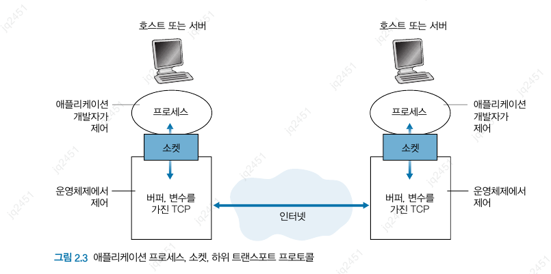
    <br>

    - 프로세스가 사용하는 하위 전송 프로토콜을 TCP 프로토콜로 가정

    - 소켓은 `API(Application Programming Interface)` 라고도 한다.

    - 애플맄케이션 개발자는 소켓의 애플리케이션 계층에 대한 통제권은 가지지만, 트랜스포트 계층은 거의 가지지 않는다.

        1. 트랜스포트 프로토콜의 선택

        2. 최대 버퍼와 최대 세그먼트 크기 등 매개변수 설정

- **프로세스 주소 배정**

    - 한 호스트상에서 수행되고 있는 프로세스가 패킷을 다른 프로세스로 보내기 위해서는 수신 프로세스가 주소를 갖고 있을 필요가 있다.
    
        - 필요한 정보

            1. 호스트 주소

            2. 목적지 호스트 내의 수신 프로세스를 명시하는 식별자

    - `IP 주소`

        - 32비트로 구성

        - 호스트를 유일하게 식별한다.

        - `포트번호` : 수신 프로세스 식별용

### 2.1.3 애플리케이션이 이용 가능한 트랜스포트 서비스

- 송신 측 애플리케이션은 소켓을 통해 메시지를 보낸다.

- 트랜스포트 프로토콜은 네트워크를 통해 그 메시지를 수신 프로세스의 소켓으로 이동시킬 책임이 있다.

- 애플리케이션을 개발할 때는 사용 가능한 트랜스포트 프로토콜 중에서 하나를 선택해야 한다.

- 선택 기준 : 애플리케이션의 요구에 가장 적합한 서비스를 제공하는 프로토콜

- **신뢰적 데이터 전송**

    - 패킷들은 넹트워크 내에서 손실될 수 있어, 이를 보장된 데이터 서비스를 제공하는 방식

    - `손실 허용 애플리케이션(loss-tolerant application)` : 어느 정도의 데이터 손실을 허용하는 애플리케이션

        - ex ) 실시간 오디오/비디오, 저장 오디오/비디오 같은 멀티미디어 애플리케이션

- **처리율**

    - 트랜스포트 프로토콜은 어느 정도 명시된 속도에서 보장된 가용 처리율을 제공한다.

    - `대역폭 민감 애플리케이션(bandwidth-sensitive application)` : 처리율 요구사항을 갖는 애플리케이션

        - ex ) 인터넷 전화, 멀티미디어 애플리케이션

    - `탄력적 애플리케이션(elastic application)` : 처리율 요구사항을 안갖는 애플리케이션

        - ex ) 전자메일, 파일 전송, 웹 전송

- **시간**

    - 트랜스포트 계층 프로토콜은 `시간 보장`을 제공한다.

        - ex) 인터넷 전화, 가상 환경, 원격회의, 다자간 게임 같은 상호작용 애플리케이션

- **보안**

    - 트랜스포트 프로토콜은 애플리케이션에 하나 이상의 보안 서비스를 제공할 수 있다.

        - ex ) 전송하는 모든 데이터의 암/복호화

    - 기밀성 외에도 데이터 무결성, 종단 인증 등이 포함된다.

### 2.1.4 인터넷 전송 프로토콜이 제공하는 서비스

- 전송 프로토콜은 크게 2가지이다.

    1. `TCP 서비스`

        - 연결지향형 서비스

            - `핸드셰이킹` : 메시지 전송 전에 클라이언트와 서버가 서로 전송 제어 정보를 교환한다.

            - 전이중(full-duplex) 연결 : 두 프로세스가 서로에게 동시에 메시지를 보낼 수 있게 연결

        - 신뢰적인 데이터 전송 서비스

            - 애플리케이션의 한쪽이 바이트 스트림을 소켓으로 전달하면 손실되거나 중복되지 않게 수신 소켓으로 전달한다.

        - 혼잡 제어 방식 : 프로세스의 직접 이득보단 인터넷의 전체 성능 향상을 위한 서비스를 포함한다.

            - 네트워크가 혼잡 상태에 이르면 프로세스 속도를 낮춘다.

    2. **UDP 서비스**

        - 비연결형 서비스

            - 두 프로세스가 통신하기 전엔 핸드셰이킹을 하지 않는다.

        - 비신뢰적인 데이터 전송 서비스

            - 메시지를 보내면 수신 소켓에 도착하는 것을 보장하지 않는다.

            - 메시지의 순서가 뒤바뀔 수도 있다.

        - 혼잡 제어 방식을 포함하지 않아 원하는 속도로 하위 계층에 보낼 수 있다.

- **인터넷 트랜스포트 프로토콜이 제공하지 않는 서비스**

    - 처리율 / 시간 보장

        - 시간 민감 애플리케이션에 대한 만족스런 서비스를 제공할 수 있으나 보장을 제공하지는 않는다.

    - 애플리케이션의 성향에 따라 TCP / UDP를 선택해서 사용하고 있다.

    - UDP의 경우, 많은 방화벽이 UDP 트래픽을 차단하기 때문에, 실패 시 TCP를 사용하도록 설계해야 한다.

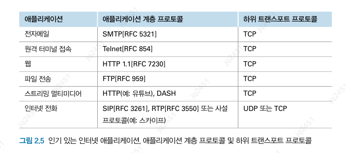
<br>

> **TCP의 보안화**
>
> TCP와 UDP는 암호화를 제공하지 않는다.  
> 이를 위해 TCP를 강화한 **TLS(Transport Layer Security)** 를 개발했다.  
>   - 암호화, 데이터 무결성, 종단 인증을 포함한 프로세스 보안 서비스를 제공
>   - 트랜스포트가 아닌 애플리케이션 계층에서 구현된 것

### 2.1.5 애플리케이션 계층 프로토콜

- 애플리케이션 계층 프로토콜은 다음과 같은 내용을 정의한다.

    - 교환 메시지 타입(예: 요청 메시지와 응답 메시지)

    - 여러 메시지 타입의 문법(예: 메시지 내부의 필드와 필드 간의 구별 방법)

    - 필드의 의미, 필드에 있는 정보의 의미

    - 언제, 어떻게 프로세스가 메시지를 전송하고 메시지에 응답하는지 결정하는 규칙

- 여러 애플리케이션 계층 프로토콜(HTTP 등)은 RFC에 명시되어 있다.

- 물론 독점이며 공중 도메인에서 구할 수 없는 프로토콜도 존재한다.

- 애플리케이션 계층 프로토콜은 네트워크 애플리케이션의 한 요소일 뿐이다.

    - 웹 애플리케이션의 구성

        - HTML

        - 웹 브라우저

        - 웹 서버

        - 애플리케이션 계층 프로토콜

            - HTTP는 브라우저와 웹 서버 사이에서 교환되는 메시지의 포맷과 순서를 정의한다.

## 2.2 웹과 HTTP

### 2.2.1 HTTP 개요

- HTTP(HyperText Transfer Protocol)

    - 클라이언트와 서버 프로그램으로 구성

    - 서로 HTTP 메시지를 교환하여 통신한다.

    - 메시지의 구조 및 클라이언트와 서버가 메시지를 어떻게 교환하는지에 대해 정의한다.

    - **용어정리**

        - 웹 페이지 : 문서, 객체로 구성된다.

            - 객체 : 단일 URL로 지정할 수 있는 하나의 파일(HTML, JPEG, JS, CSS 등)

            - 웹 페이지는 기본 HTML 파일 하나와 여러 참조 객체로 구성된다.

            - 기본 HTML 파일은 페이지 내부의 다른 객체를 URL을 통해 참조한다.

        - 웹 브라우저 : HTTP 클라이언트 측을 구현한 것

            - 요구한 웹 페이지를 사용자에게 보여준다.

        - 웹 서버 : HTTP의 서버 측을 구현한 것

            - URL로 각각을 지정할 수 있는 웹 객체를 갖고 있다.

    - HTTP는 클라이언트가 서버에게 웹 페이지를 어떻게 요청하는지와 서버가 클라이언트로 어떻게 웹 페이지를 전송하는지 정의한다.

    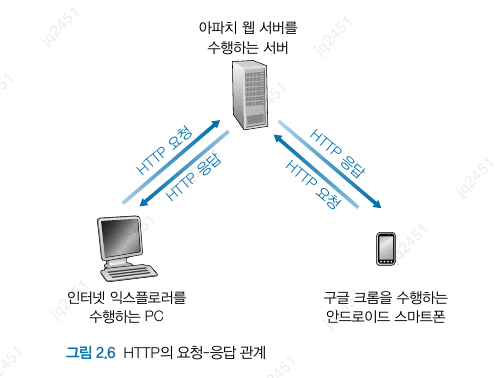
    <br>

    - HTTP는 TCP를 전송 프로토콜로 사용한다.

    - 서버가 클라이언트에게 요청 파일을 보낼 때, 서버는 클라이언트에 관한 어떠한 상태 정보도 저장하지 않는다.

        - 그래서 HTTP는 `비상태적(stateless) 프로토콜`이라고 부른다.

### 2.2.2 비지속 연결과 지속 연결

- 애플리케이션은 그 요구에 따라 주기적으로 혹은 간헐적으로 연결될 수 있다.

- `비지속 연결(non-persistent connection)` : 각 요구/응답 쌍이 분리된 TCP 연결을 통해 보내질 경우

- `지속 연결(persistent connection)` : 모든 요구와 해당하는 응답들이 같은 TCP 연결 상으로 보내질 경우

- HTTP의 디폴트 : 지속 연결

- **비지속 연결 HTTP**

    - 연결 수행 과정

        1. HTTP 클라이언트는 기본 포트 번호를 통해 서버로 TCP 연결 시도.

        2. HTTP 클라이언트는 1단계에서 설정된 TCP 연결 소켓을 통해 서버로 HTTP 요청 메시지를 보낸다.

        3. HTTP 서버는 1단ㄴ계에서 설정된 소켓을 통해 요청 메시지를 수신. 응답 메시지에 객체를 캡슐화한 후 클라이언트로 보낸다.

        4. HTTP 서버는 TCP에게 연결을 끊으라고 한다.

        5. HTTP 클라이언트는 객체를 수신하면 TCP 연결을 닫는다.

        6. 참조되는 각 JPEG 객체에 대해 처음 네 단계를 반복한다.

    - `RTT(round-trip time)` : 작은 패킷이 클라이언트로부터 서버까지 가고, 다시 클라이언트로 되돌아오는 데 걸리는 시간

        - 세 방향 핸드셰이크에서 처음 2부분이 경과하면 RTT가 계산된다.

        - 하지만 세 번쨰 부분이후 클라이언트는 서버로부터 객체 응답 메시지를 수신하기 위해 1RTT를 더 기다려야한다.

        - 그래서 총 응답 시간은 `2 RTT + 객체 전송 시간`이다.

    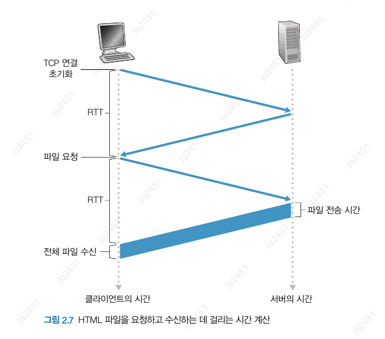
    <br>

- **지속 연결 HTTP**

    - 비지속 연결의 단점

        1. 각 요청 객체에 대한 새로운 결이 설정되고 유지되어야 한다.

        2. 각 객체는 2 RTT를 필요로 한다.

    - 지속 연결 HTTP 특징

        - 서버는 응답을 보낸 후 TCP 연결을 유지

        - 같은 클라이언트와 서버 간의 이후 요청과 응답은 같은 연결을 통한다.

        - 이들 객체에 대한 요구는 진행 중인 요구에 대한 응답을 기다리지 않고 연속해서 만들 수 있다. (`파이프라이닝(pipelining)`)

        - 일정 기간 사용되지 않으면 연결을 닫는다.

### 2.2.3 HTTP 메시지 포맷

- **HTTP 요청 메시지**

    ```
    GET /somedir/page.html HTTP/1.1
    Host: www.someschool.edu
    Connection: close
    User-Agent: Mozilla/5.0
    Accept-language: fr
    ```

    - `요청 라인(request line)` : 요청 메시지의 첫 줄

        - **구성**

            - 방식(method) 필드 : GET / POS /HEAD / PUT / DELETE 등 

            - URL 필드

            - HTTP 버전 필드

    - `헤더 라인(header line) : 이후의 줄

        - 웹 프록시 캐시에서 유용할 수도 있는 정보를 제공한다.

        - Connection은 지속 연결 사용 여부를 나타낸다.

    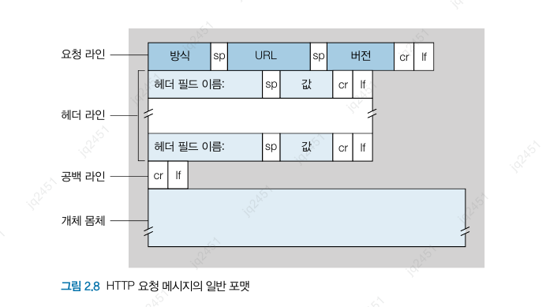
    <br>

    - `개체 몸체(entity body)`

        - POST 방식에서 사용된다.

        - 사용자가 폼 데이터를 채웠을 때 서버에 전달할 정보

    - 폼으로 생성한 요구는 반드시 POST 방식이 아니더라도 GET URL에 필드를 추가하여 보낼 수 있다.

    - `HEAD 방식` : GET 방식과 유사하지만 서버가 요청 객체를 다시 보내지 않고, 요청 헤더만 보낸다.

        - 흔히 개발자가 디버깅할 때 주로 사용된다.

- **HTTP 응답 메시지**

    ```
    HTTP/1.1 200 OK
    Connection: close
    Date: Tue, 18 Aug 2015 15:44:04 GMT
    Server: Apache/2.2.3 (CentOS)
    Last-Modified: Tue, 18 Aug 2015 15:11:03 GMT
    Content-Length: 6821
    Content-Type: text/html
    ```

    - `상태 라인(status line)`

        - HTTP 버전

        - 상태 코드

        - 상태 메시지

    - `헤더 라인(header line)`

    - `개체 몸체(entity body)`

        - 요청한 객체 데이터

    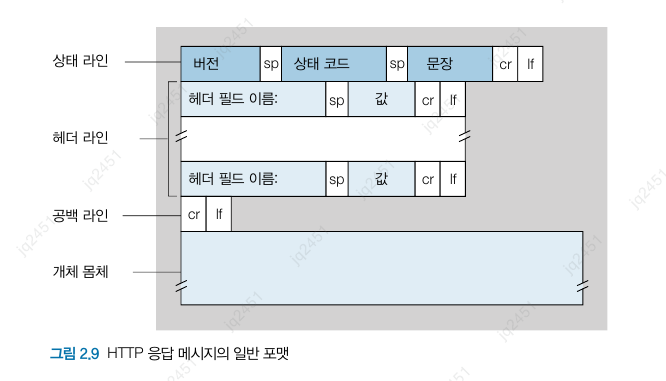
    <br>

    **상태 코드의 종류**

        - 200 OK : 요청 성공, 정보가 응답

        - 301 Moved Permanently : 요청한 객체가 이동되었다.

            - 새로운 URL은 응답 메시지의 Location 헤더에 나와있다.

        - 400 Bad Request : 서버가 요청을 이해할 수 없다.

        - 404 Not Found : 요청 문서가 서버에 존재하지 않는다.

        - 505 HTTP Version Not Supported : 요청 HTTP 프로토콜 버전을 서버가 지원하지 않는다.

### 2.2.4 사용자와 서버 간의 상호작용: 쿠키

- 서버가 아닌 웹 사이트가 사용자를 확인할 떄 사용.

- 쿠키 기술의 4 가지 요소

    1. HTTP 응답 메시지 쿠키 헤더 라인

    2. HTTP 요청 메시지 쿠키 헤더 라인

    3. 사용자의 브라우저에 사용자 종단 시스템과 관리를 지속시키는 쿠키 파일

    4. 웹사이트의 백엔드 데이터베이스

```
Set-cookie : 1678 // 쿠키 식별번호
```

- 사용자가 웹 페이지를 요청할 때 브라우저는 쿠키 파일을 참조하고, 식별번호를 발췌하고, HTTP 요청에 식별번호를 포함하는 쿠키 헤더 파일을 넣는다.

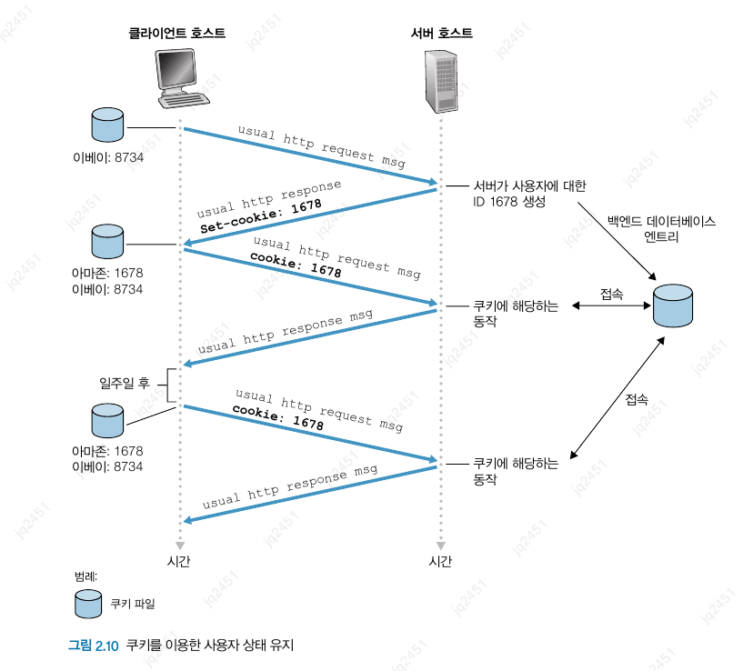
<br>

- 쿠키는 사용자 식별에 사용될 수 있다.

### 2.2.5 웹 캐싱

- `웹 캐시(Web cache = proxy server)`

    - 웹 서버를 대신하여 HTTP 요구를 충족시키는 네트워크 개체

    - 자체의 저장 디스크를 갖고 있어 최근 호출된 객체의 사본을 저장 및 보존한다.

    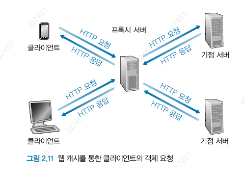
    <br>

    - **캐싱 흐름**

        1. 브라우저가 웹 캐시와 연결 후 객체에 대한 HTTP 요청

        2. 웹 캐시는 객체의 사본이 저장되어 있는지 확인, 저장되어 있다면 HTTP 응답과 함꼐 객체 전송

        3. 없다면, 캐시와 서버 간의 연결로 객체에 대한 HTTP 요청, 서버는 웹 캐시로 HTTP 응답 메시지와 함께 객체 전송

        4. 캐시의 객체를 수신할 때, 객체를 로컬에 복사하고 브라우저에 응답 메시지와 함께 객체의 사본을 전송

    - 웹 캐시는 서버이자 클라이언트이다.

    - 웹 캐시가 자주 사용된 이유

        1. 웹 캐시는 클라이언트 요구에 대한 응답 시간을 줄일 수 있다.

        2. 웹 캐시는 한 기관에서 인터넷으로의 접속하는 링크상의 웹 트래픽을 대폭으로 줄일 수 있다.

    - `콘텐츠 전송 네트워크(Content Distribution Network, CDN)`의 사용을 통해 웹 캐시는 인터넷에서 점진적으로 중요한 역할 을 한다.

- **조건부 GET**

    - 웹 캐싱은 응답 시간을 줄여주지만, 캐시 내부에 있는 객체의 복사본이 새것이 아닐 수 있다는 문제가 있다.

    - 이를 위해 HTTP는 클라이언트가 브라우저로 전달되는 모든 객체가 최신인 것을 확인하면서 캐싱하는 방식을 갖고 있다.

    - **구별 방법**

        1. GET 방식인지

        2. Modified-Since 헤더 라인이 포함되어 있는지

### 2.2.6 HTTP/2

- 2015년에 표준화된 새로운 HTTP 버전

- 2020년 현재 주요 웹사이트의 40%가 지원 중

- 크룸, 익스플로러, 사파리, 오페라, 파이어폭스 등 대부분의 주요 브라우저에서 지원

- **주요 목표**

    - 멀티플렉싱 요청/응답 지연 시간을 줄이는 것

    - 요청 우선순위화

    - 서버 푸시

    - HTTP 헤더 필드의 효율적인 압축 기능

- 클라이언트와 서버 간의 데이터 포맷 방법과 전송 방법은 변경됐다.

- 하나의 TCP 상에서 모든 객체를 전송하면 `HOL(Head of Line)` 블로킹 문제가 발생할 수 있다.

    - HOL(Head of Line) : 앞쪽에 있는 객체의 전송을 기다리는 병목 문제

    - HTTP/1.1은 6개까지 병렬 TCP 연결을 해줬다.

    - HTTP/2의 주요 목표 중 하나는 웹 페이지를 전송하기 위한 병렬 TCP 연결의 수를 줄이거나 제거하는 데 있다.

- **HTTP/2 프레이밍**

    - HOL 블로킹 문제의 해결책

    - 각 메시지를 작은 프레임으로 나누고, 같은 TCP 연결에서의 요청과 응답 메시지를 `인터리빙`힌다.

        - 프레임 인터리빙 : 하나의 프레임을 전송한 후, 각 소형 객체의 첫 번쨰 프레임을 전송하는 방식

    - 이 메커니즘을 사용함으로써 사용자기 인지하는 지연 시간의 상당수가 줄어들었다.

    - 프레이밍은 HTTP/2 프로토콜의 프레임으로 구현된 다른 프레이밍 서브 계층에 의해 이루어진다.

    - 프레이밍 서브 계층은 각 HTTP 메시지를 프레임으로 쪼개는 것 외에도 프레임을 바이너리 인코딩한다.

- **메시지 우선순위화 및 서버 푸싱**

    - `메시지 우선순위화(message prioritization)` : 요청들의 상대적 우선 순위를 조정할 수 있게 함으로 써 애플리케이션 성능을 최적화

        - 프레이밍 서브 계층은 데이터 스트림을 쪼갠 뒤 가중치에 따라 우선순위를 부여한다.

    - `푸시(push)` : 특정 클라이언트 요청에 대해 여러 개의 응답을 보낼 수 있다.

        - 처음 요청에 대한 응답 외에도, 요청 없이 추가적으로 객체를 클라이언트에겍 보낼 수 있다.

        - 이러한 객체의 경우 요청 대신 서버가 HTML 페이지를 분석할 수 있다.

        - 필요한 객체를 식별하고 요청이 도착하기 전에 먼저 클라이언트로 보냄으로, 추가 지연을 없앨 수 있다.

- **HTTP/3**

    - QUIC 기반의 새로운 HTTP 프로토콜

        - `QUIC`

            - UDP 프로토콜 위에 위치하는 애플리케이션 계층에 구현

            - 메시지 멀티플렉싱(인터리빙), 스트림별 흐름제어, 저지연 연결 확립 등의 특징을 가진다.

## 2.3 인터넷 전자메일

- 인터넷 메일 시스템 상위 레벨 개념

    - 사용자 에이전트(user agent)

        - 사용자가 메일을 읽고, 응답하고, 전달하고, 저장하고, 구성하게 해준다.

        - ex ) 아웃룩, 지메일 등

    - 메일 서버(mail server)

        - 각 사용자 에이전트와 통신

        - 메일 서버는 사용자 계정과 비밀번호를 이용하여 인증한다.

        - 메시지를 전달할 수 없다면, `메시지 큐(message queue)`에 보관하고 나중에 재 전송한다.

    - SMTP(Simple Mail Transfer Protocol)

        - 인터넷 전자메일을 위한 애플리케이션 계층 프로토콜

        - TCP의 신뢰적인 데이터 전송 서비스를 이용해 송신자 메일 서버에서 수신자 메일 서버로 메일을 전송한다.

        - SMTP는 클라이언트와 서버를 가지고 있다.

     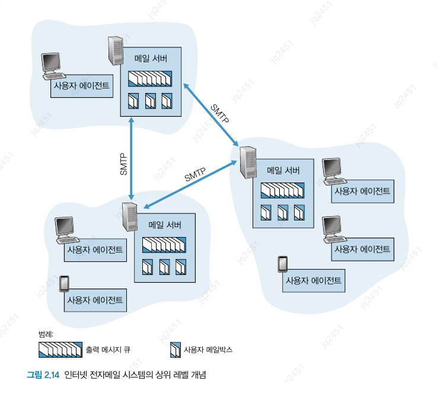
     <br>

### 2.3.1 SMTP

- 송신자의 메일 서버로부터 수신자 메일 서버로 메시지를 전송한다.

- 모든 메일 메시지의 몸체는 단순 7비트 ASCII여야 한다.

    - 현대에 멀티미디어 데이터를 ASCII로 변환하는 것은 문제가 된다.

        - HTTP는 전송 전에 멀티미디어 데이터를 ASCII로 변환하는 것을 요구하지 않는다.

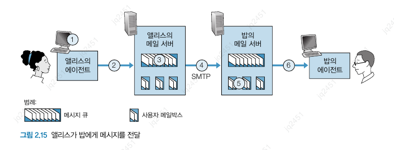
<br>

- SMTP 프로토콜은 사람의 상호작용에 이용되는 프로토콜과 유사함이 많다.

    1. 클라이언트 SMTP는 서버 SMTP로 TCP 연결을 설정한다.

    2. 서버가 죽어 있으면 나중에 다시 시도한다.

    3. 연결이 설정되면, 서버와 클라이언트의 핸드셰이킹을 수행한다.

    4. 핸드셰이킹 과정 동안 자신들의 전자메일 주소를 제공한다.

    5. 소개를 마치면 메시지를 전송한다.

    6. 서버에 보낼 다른 메시지가 있다면 이 과정을 반복한다.

    7. 없으면 TCP에게 연결을 닫을 것을 요청한다.

> **CRLF란?**  
>  CR (carriage return) / LF (line feed) 의 약자로, 빈 줄(줄바꿈)을 의미한다.

### 2.3.2 메일 메시지 포맷

- 전자 메일을 보낼 땐 주변 정보가 포함된 헤더가 메시지 몸체 앞에 오게 된다.

- 모든 헤더는 `From:`, `To:` 헤더 라인을 반드시 가져야 한다.

### 2.3.3 메일 접속 프로토콜

- 만약 메일 서버를 자신의 로컬 PC에 놓게된다면 PC가 꺼져있을 때 메일을 송수신할 수 없게 된다.

- 사용자 에이전트는 수신자의 전자메일을 확인하기 위해서 SMTP가 아닌 HTTP나 IMAP 프로토콜을 사용한다.

## 2.4 DNS: 인터넷의 디렉터리 서비스

- `호스트 이름(hostname)` : 호스트의 식별자 중 하나

    - 사용자들에게 보여지기 쉬운 문자로 이루어진 식별자

    - 호스트 위치에 대한 정보를 거의 제공하지 않늗다.

- `IP 주소(IP address)`

    - 4바이트로 구성되고 계층 구조를 가진다.

    - 호스트가 인터넷의 어디에 위치하는지에 대한 자세한 정보를 얻을 수 있다.

### 2.4.1 DNS가 제공하는 서비스

- `DNS(domain name system)`의 주요 임무

    - 호스트 이름을 IP 주소로 변환해주는 디렉터리 서비스

    1. DNS 서버들의 계층구조로 구현된 분산 데이터베이스

    2. 호스트가 분산 데이터베이스로 질의하도록 허락하는 애플리케이션 계층 프로토콜

- **수행 과정**

    1. 사용자 컴퓨터는 DNS 애플리케이션의 클라이언트 측을 수행

    2. 브라우저는 URL로부터 호스트 이름을 추출하고, 그 이름울 DNS 애플리케이션의 클라이언트 측에 전달

    3. DNS 클라이언트는 DNS 서버로 호스트 이름을 포함하는 질의를 전송

    4. DNS 클라이언트는 호스트 이름에 대한 IP 주소를 가진 응답을 수신

    5. DNS로부터 IP 주소를 받으면, 브라우저는 해당 IP 주소와 그 주소의 80번 포트에 위치한 HTTP 서버 프로세스로 TCP 연결 초기화

- 원하는 IP 주소는 가까운 DNS 서버에 캐싱되어서 DNS 네트워크 트래픽 감소에 도움을 준다.

- **DNS의 추가 서비스**

    - `호스트 에일리어싱(host aliasing)` : 호스트는 하나 이상의 별명을 가질 수 있다.

    - `메일 서버 에일리어싱(mail server aliasing)` : 서버의 호스트 이름은 클라이언트보다 더 복잡한 경우가 많아, 기억하기 쉽게 별명을 붙일 수 있다.

    - `부하 분산(load distribution)` : DNS는 순환 방식을 통해 중복 서버들 사이에서 트래픽을 분산하는 효과를 낸다.

### 2.4.2 DNS 동작 원리 개요

- DNS는 모든 매핑을 포함하는 하나의 인터넷 네임 서버처럼 볼 수도 있다.

- 이런 중앙 집중 방식에는 다음과 같은 문제점이 있다.

    - 서버의 고장

    - 트래픽양

    - 먼 거리의 중앙 집중 데이터베이스

    - 유지관리

- 이러한 단일 DNS 서버에 있는 중앙 집중 데이터베이스는 **확장성이 전혀 없어** , 결과적으로 DNS는 `분산되도록 설계`되었다.

- **분산 계층 데이터베이스**

    - 확장성 문제를 다루기 위해 DNS는 많은 서버를 이용하고 이들을 계층 형태로 구성해서 전 세계에 분산시킨다.

    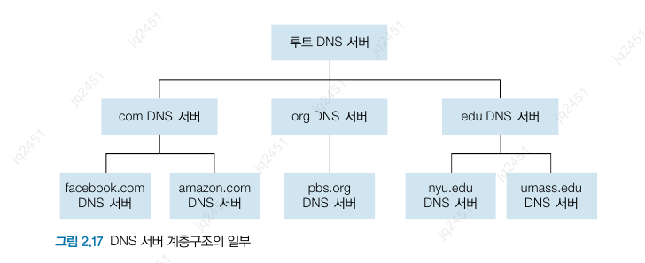
    <br>

    - **루트 DNS 서버(Root DNS Server)** 
        
        - DNS 서버들의 최상위 계층에 위치. 
        
        - TLD 서버의 IP 주소들을 제공

    - **최상위 레벨 도메인(TLD) 서버**
    
        - 기업의 상위 레벨 도메인과 국가의 상위 레벨 도메인에 대한 TLD 서버가 있다.

        - 책임 DNS 서버에 대한 IP 주소를 제공한다.

    - **책임 DNS 서버**

        - 호스트를 가진 모든 기관은 호소트 이름을 IP 주소로 매핑하는 공개적인 DNS 레코드를 제공해야 한다.

        - 기관의 책임 DNS 서버는 해당 DNS 레코드를 갖고 있다.

    - **로컬 DNS 서버**

        - ISP들은 `로컬 DNS 서버`를 가진다.

        - 호스트가 해당 ISP에 연결될 떄, ISP는 로컬 DNS 서버로부터 IP 주소를 호스트에게 제공한다.   

    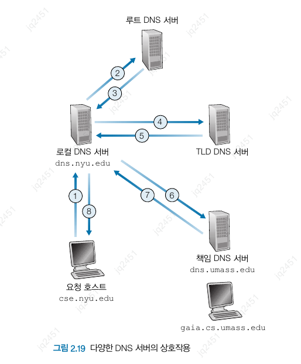
    <br>

    - 요청하는 호스트로부터 로컬 DNS 서버까지의 질의는 재귀적이고, 나머지는 반복적이다.

    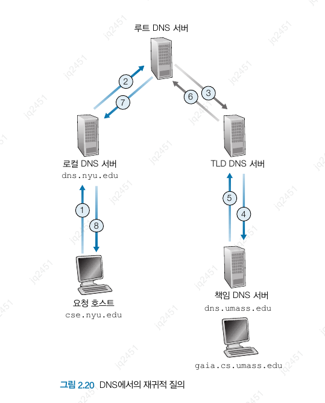
    <br>

- **DNS 캐싱**

    - DNS의 지연 성능 향상과 네트워크의 DNS 메시지 수를 줄이기 위해 사용한다.

    - 질의 사슬에서 DNS 서버가 DNS 응답을 받았을 때, 그것을 로컬 메모리에 저장하는 방식

### 2.4.3 DNS 레코드와 메시지

- DNS 분산 데이터베이스를 구현한 DNS 서버들은 호스트 이름을 IP 주소로 매핑하기 위한 `자원 레코드(resource record, RR)`를 저장한다.

- **자원 레코드의 필드** : (Name, Value, Type, TTL)

- **Type에 따른 의미**

    - `Type = A` : value를 IP 주소로 매핑

    - `Type = NS` : value를 도메인 이름에 대한 권한 있는 책임 DNS 서버의 호스트 이름을 매핑

    - `Type = CNAME` : value는 별칭 호스트 이름에 대한 정식 호스트 이름을 매핑

    - `Type = MX` : value는 별칭 호스트 이름에 대한 메일 서버의 정식 이름을 매핑

- **DNS 메시지**

    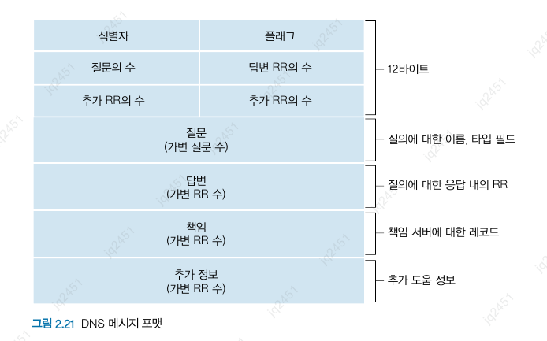
    <br>

    - `헤더 영역(header section)`

        - 처음 12바이트에 대한 영역으로 여러 필드를 가지고 있다.

    - `질문 영역(question section)`

        - 현재 질의에 대한 정보를 포함한다.

        - 질의되는 이름 필드

        - 질문 타입을 나타내는 타입 필드

    - `답변 영역(answer section)`

        - 원래 질의된 이름에 대한 `RR`을 포함한다.

    - `책임 영역(authority section)`

        - 다른 책임 서버의 레코드를 포함한다.

    - `추가 영역(additional section)`

        - 다른 도움이 되는 레코르를 포함한다.

> **DNS 취약점**  
> 
> - DDoS 대역폭 플러딩 공격
>
> - .com 도메인을 다루는 모든 최상위 도메인서버들에 대한 DDoS 공격
>
> - 중간자 공격 : 호스트로부터 질의를 가로채어 가짜 응답을 반환하는 공격
>
> - DNS 중독 공격 : DNS 서버로 가짜 응답을 보내어 그 서버가 자신의 캐시에 가짜 레코드를 받아들이도록 하는 공격

## 2.5 P2P 파일 분배

- **P2P 구조의 확장성**

    - 서버와 피어들은 접속 링크로 인터넷에 연결되어 있다.

    - `분배 시간`은 모든 N개의 피어들이 파일의 복사본을 얻는 데 걸리는 시간을 의미한다.

    $$ D_{cs} >= \max\{\frac{NF}{u_s}, \frac{F}{d_{min}}\}$$

    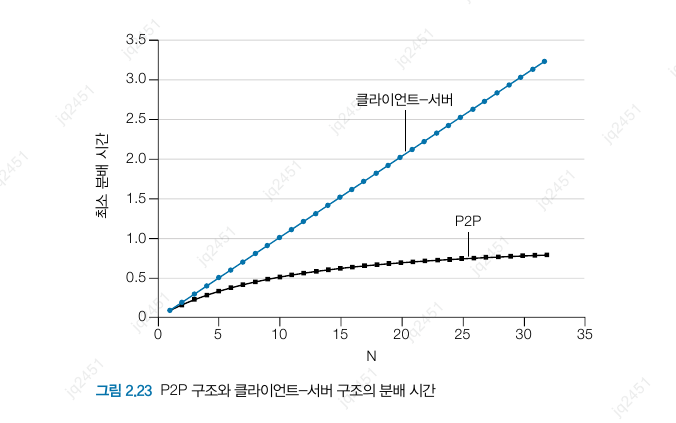
    <br>

    - 클라이언트-서버의 경우, 피어 수가 증가함에 따라 분배 시간이 선형적으로 증가한다.

    - P2P의 경우, 앞선 시간보다 더 작은 시간을 가지는것을 볼 수 있다.

- **비트토렌트**

    - 파일 분배에서 인기 있는 P2P 프로토콜

    - `토렌트` : 특정 파일의 분배에 참여하는 모든 피어의 모임

    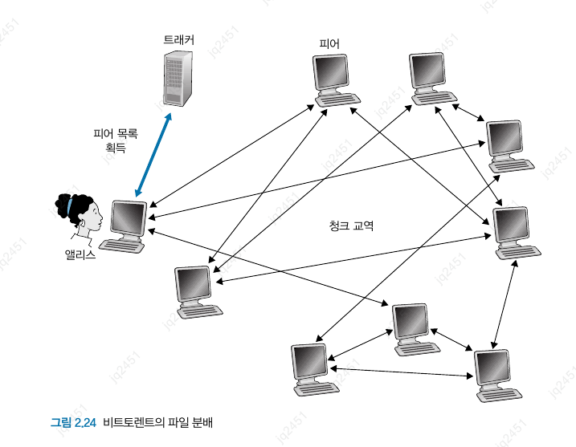
    <br>

    - **동작 흐름**

        - 토렌트에 참여한 피어들은 서로에게서 같은 크기의 청크를 다운로드한다.

        - 피어가 청크를 다운로드할 때 피어는 청크를 다른 피어들에게 업로드한다.

        - 한 피어가 전체 파일을 얻으면, 떠나거나 토렌트에 남아서 다른 피어들로 청크를 계속해서 업로드할 수 있다.

    - `트래커(tracker)` : 한 피어가 토렌트에 가입할 떄 트래커에 자신을 등록하고 주기적으로 토렌트에 있음을 알린다.

        - 이를 통해 토렌트에 참여하는 피어들을 추적할 수 있다.

    - 파일 분배 시 중요한 결정 사항

        1. 이웃으로부터 어느 청크를 먼저 요청할 것인가?

        2. 이웃들 중 어느 피어에게 청크를 요청할 것인가?

    - 이 2가지를 조합해 `가장 드문 것 먼저(rarest first)` 요청한다.

    - **현명한 교역 알고리즘**

        - 가장 빠른 속도로 데이터를 제공하는 이웃에게 우선순위를 줘 서로 좋은 파트너를 만나 교역을 활발히 한다.

        - `TFT(tit-for-tat)` 전략으로, 이웃이 좋은 파트너가 아니라고 생각하면 (느리게 업로드) 그 이웃은 더이상 선택되지 않는다.
        
        - 이를 통해 무임승차를 방지한다.

## 2.6 비디오 스트리밍과 콘텐츠 분배 네트워크

### 2.6.1 인터넷 비디오

- 녹화된 비디오는 서버에 저장되어 사용자가 비디오 시청을 서버에게 **온디맨드** 로 요청한다.

- 비디오는 초당 24~30개의 이미지를 일정한 속도로 표시된다.

- 오늘날 상용 압축 알고리즘은 근본적으로 원하는 모든 비트 전송률로 비디오를 압축할 수 있다.

- 비트 전송률이 높을수록 이미지 품질이 좋아지고 사용자 시청 환경이 향상된다.

- 스트리밍 비디오에서 가장 중요한 성능 척도는 평균 종단 간 처리량이다. 

    - 연속 재생을 제공하기 위해, 네트워크는 압축된 비디오의 전송률 이상의 평균 처리량을 제공해야 한다.

- 압축을 통해 동일한 비디오를 여러 버전의 품질로 만들 수 있다.

### 2.6.2 HTTP 스트리밍 및 DASH
