# 3. 트랜스포트 계층

- 애플리케이션 게층과 네트워크 계층 사이에 존재하는 네트워크 구조의 핵심

    - `중요 기능` : 다른 호스트에서 동작하는 애플리케이션 프로세스에 직접적인 **통신 서비스** 를 제공

## 3.1 트랜스포트 게층 서비스 및 개요

- 트랜스포트 계층 프로토콜은 각기 다른 호스트에서 동작하는 애플리케이션 프로세스 간의 `논리적 통신(logical communication)`을 제공한다.

>    - **논리적 통신** : 애플리케이션의 관점에선 프로세스들이 동작하는 호스트들이 직접 연결된 것처럼 보이는 것을 의미

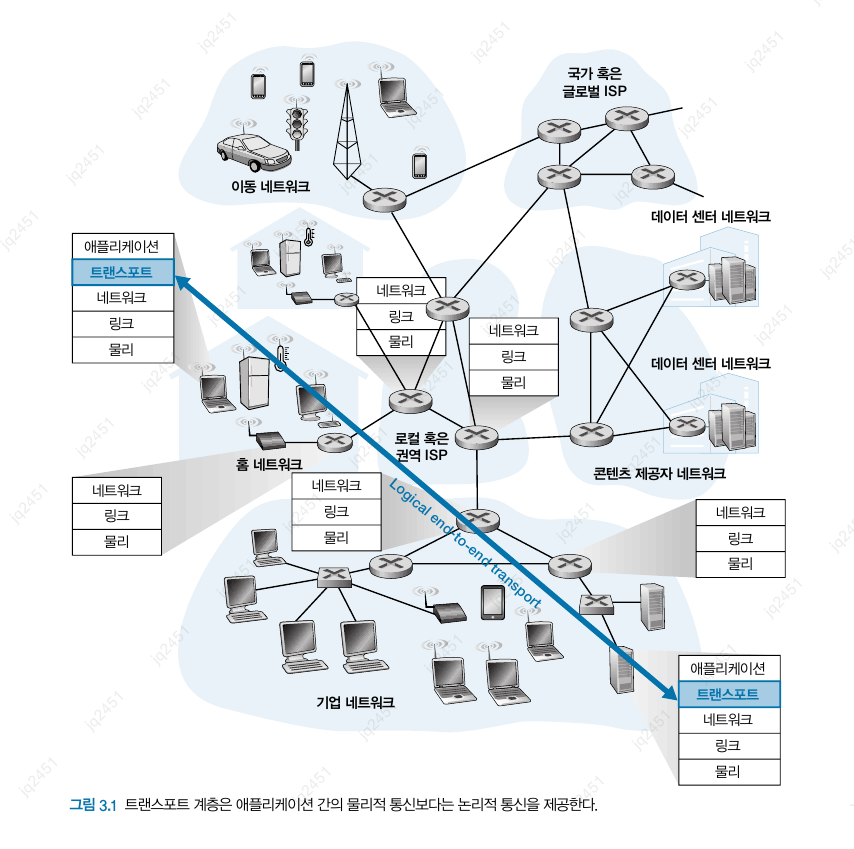
<br>

- 트랜스포트 계층 프로토콜은 **네트워크 라우터가 아닌 종단 시스템** 에서 구현된다.

- 송신 트랜스포트 계층은 송신 애플리케이션 프로세스로부터 수신된 `메시지(애플리케이션 계층 패킷)를 세그먼트(트랜스포트 계층 패킷)로 변환`한다.

    - **메시지를 세그멘트 변환 및 통신하는 과정**

        1. 메시지를 작은 조각으로 분할

        2. 각 조각에 트랜스포트 계층 헤더를 추가

                이때 메시지가 이미 충분히 작다면 조각으로 분할하지 않을 수 있다.

        3. 네트워크 계층으로 세그먼트 전달

                - 세그먼트는 네트워크 계층 패킷(데이터그램) 안에 캡슐화되어 목적지로 전달

                - 네트워크 라우터는 네트워크 게층 필드에서만 동작한다. 즉, 세그멘트 필드를 들여다 보지 않는다.  

        4. 수신 네트워크 계층은 데이터그램으로부터 세그먼트를 추출, 수신 트랜스포트 계층으로 전송

        5. 수신 트랜스포트 계층은 수신 애플리케이션에서 세그먼트 내부의 데이터를 이용할 수 있도록 처리

### 3.1.1 트랜스포트 계층과 네트워크 계층 사이의 관계

- **트랜스포트 계층 프로토콜** : 각기 다른 호스트에서 동작하는 `프로세스들` 사이의 논리적 통신을 제공

- **네트워크 계층 프로토콜** : `호스트들` 사이의 논리적 통신을 제공

     - 네트워크 계층 프로토콜은 호스트까지만 전송해준다.

     - 호스트에 전송된 세그먼트는 트랜스포트 계층 프로토콜이 정리해서 각 애플리케이션 프로세스에게 전달한다.

- 컴퓨터 네트워크는 애플리케이션에서 서로 다른 서비스를 제공할 수 있도록 **다양한 트랜스포트 프로토콜** 을 제공한다.

- 트랜스포트 계층이 제공할 수 있는 서비스는 **하위 네트워크 계층 프로토콜의 서비스 모델에 의해 제약** 받는다.

    - 네트워크 계층 프로토콜이 세그먼트에 대한 지연 보장이나 대역폭 보장을 할 수 없다면, 트랜스포트 계층 프로토콜도 메시지에 대한 지연 보장이나 대역폭 보장을 제공할 수 없다.

        > **예외**  
        > 
        > 1. 하위 네트워크 프로토콜이 비신뢰적일 경우, 애플리케이션에게 신뢰적인 데이터 전송 서비스를 제공할 수 있다.
        >
        > 2. 네트워크 계층이 세그먼트의 기밀성을 보장할 수 없을 때도 침입자가 메시지를 읽지 못하도록 암호화를 사용할 수 있다.

### 3.1.2 인터넷 트랜스포트 계층의 개요

- 애플리케이션 계층에서 제공하는 트랜스포트 계층 프로토콜

    - `UDP(User Datagram Protocol)` : 비신뢰적, 비연결형 서비스

    - `TCP(Transmission Control Protocol)` : 신뢰적, 연결지향형 서비스

            소켓을 생성할 떄는 둘 중 하나를 선택해야 한다.

> 인터넷 문서(RFC)에서는 UDP에 대한 패킷을 데이터그램으로 표현하기도 하니 주의하라.

- `IP(Internet Protocol)` : 인터넷 네트워크 계층 프로토콜

    - IP 서비스 모델은 호스트 간에 논리적 통신을 제공하는 `최선형 전달 서비스(best-effort delivery service)`이다.

        - IP가 통신하는 호스트들 간에 세그먼트를 전달하기 위해 최대한 노력하지만, **어떤 보장도 하지 않는다.**

    - **IP가 비신뢰적 서비스라고 불리는 이유**

            - 세그먼트의 전달을 보장하지 않고 세그먼트가 순서대로 전달되는 것을 보장하지 않는다.

            - 세그먼트 내부 데이터의 무결성을 보장하지 않는다.

    - **각 호스트는 적어도 하나의 IP 주소를 갖는다.**

- **UDP와 TCP의 기본적인 기능**

    - 종단 시스템 사이의 IP 전달 서비스를 종단 시스템에서 동작하는 두 프로세스 간의 전달 서비스로 확장하는 것

        - `트랜스포트 계층 다중화(transport-layer multiplexing)` / `역다중화(demultiplexing)`

                "호스트 대 호스트 전달"을 "프로세스 대 프로세스 전달"로 확장

    - UDP와 TCP는 헤더에 **오류 검출 필드** 를 포함함으로써 `무결성 검사`를 제공한다.

    - **TCP의 추가적인 서비스**

        - `신뢰적인 데이터 전송(reliable data transfer)`

            - **흐름 제어, 순서 번호, 확인 응답, 타이머** 를 사용함으로써 데이터가 순서대로 정확하게 전달되도록 한다.

        - `혼잡 제어(congestion control)`

            - 한 TCP 연결이 과도한 양의 트래픽으로 모든 통신하는 호스트들 사이의 스위치와 링크를 혼잡하게 하는 것을 방지하는 것

            - 혼잡한 네트워크 링크에서 각 TCP 연결이 **링크의 대역폭을 공평하게 공유하여 통과** 하도록 해준다.

            - 송신 측의 TCP가 네트워크에 보낼 수 있는 트래픽을 조절함으로써 수행

## 3.2 다중화와 역다중화

- 목적지 호스트의 트랜스포트 계층은 네트워크 게층으로부터 세그먼트를 수신한다.

- 트랜스포트 계층은 애플리케이션 프로세스에게 세그먼트 데이터를 전달하는 의무가 있다.

- `소켓(socket)`은 네트워크에서 프로세스로 데이터를 전달하고, 프로세스로부터 네트워크로 데이터를 전달하는 출입구 역할을 한다.

    - 수신 측 호스트에 하나 이상의 소켓이 있을 수 있으므로, 각각의 소켓은 `하나의 유일한 식별자`를 갖는다.

    - 식별자 포멧은 UDP, TCP에 따라 달라진다.

- 수신 측 호스트가 수신한 트랜스포트 계층 세그먼트를 어떻게 적절한 소켓으로 향하게 하는가?

    - 수신 측 트랜스포트 계층은 소켓을 식별하기 위해 이러한 필드를 검사한다.

    - `역다중화` : 세그먼트의 데이터를 올바른 소켓으로 전달하는 작업

    - `다중화` : 출발 호스트에서 **소켓으로 데이터를 모으고** , 세그먼트를 생성하기 위해 각 데이터의 **헤더 정보로 캡슐화** 하고, 그 세그먼트들을 **네트워크로 전달** 하는 작업

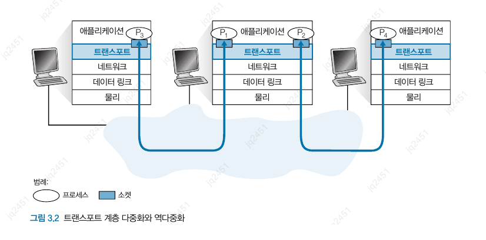
<br>

- 중간 호스트의 트랜스포트 계층은 네트워크 계층 아래로부터 수신한 세그먼트를 P1 또는 P2로 반드시 `역다중화`해야한다.

- 중간 호스트의 트랜스포트 계층은 네트워크 계층으로 전달하기 위해 반드시 `다중화`를 해야한다.

- **실제 호스트에서의 수행과정**

    - **다중화의 요구사항**

        1. 소켓은 유일한 식별자를 갖는다.

        2. 각 세그먼트는 `세그먼트가 전달될 적절한 소켓을 가리키는 특별한 필드`를 갖는다.

            - 출발지 포트 번호 필드(source port number field) / 목적지 포트 번호 필드(destination port number field)

            - 각 포트 번호는 0~65535까지의 16비트 정수

            - 0~1023 포트 번호는 사용이 엄격하게 제한된다.(`잘 알려진 포트 번호(well-known port number)`)

            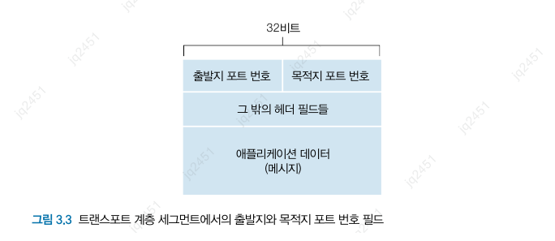
            <br>

    - 호스트의 각 소켓은 포트 번호를 할당받는다.

    - 세그먼트가 호스트에 도착하면, 트랜스포트 계층은 목적지 포트 번호를 검사하고 상응하는 포켓으로 전송한다.

- **비연결형 다중화와 역다중화**

    - 파이썬 명령어로 UDP 소켓이 생성될 때, 트랜스포트 계층은 포트 번호를 소켓에게 자동으로 할당한다.

    - 일반적으로 서버 측이 특정 포트 번호를 할당하는 것에 반해, 클라이언트 측은 트랜스포트 계층이 포트 번호를 자동으로 할당한다.

    - **UDP 소켓 흐름**

            - 호스트 A 프로세스가 호스트 B 프로세스로 데이터 전송(UDP 소켓을 통해)을 원한다고 가정

            - 호스트 A 트랜스포트 계층은 애플리케이션 데이터, 출발지 포트 번호, 목적지 포트 번호 등 포함된 세그먼트를 생성

            - 만들어진 세그먼트를 네트워크 계층으로 전달

            - 네트워크 계층은 세그먼트를 IP 데이터그램으로 캡슐화하고 최선형 전달 서비스로 세그먼트를 수신 호스트 B로 전달

            - 수신 호스트 B에 도착하면, 세그먼트 안의 목적지 포트 번호를 검사하고 해당 포트로 식별되는 소켓으로 전달

        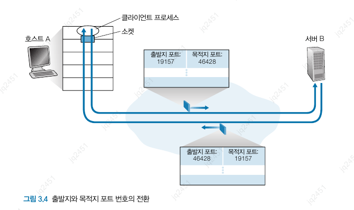
        <br>

        - UDP 소켓은 목적지 `IP 주소와 포트 번호로 구성된 두 요소로 식별`된다.

        - **출발지 포트 번호 사용 목적**

            - '회신 주소'의 한 부분으로 사용된다.

- **연결지향형 다중화와 역다중화**

    - **TCP 소켓이 UDP 소켓이랑 다른점**

        - TCP 소켓은 `4개의 요소 집합(출발지 IP 주소, 출발지 포트 번호, 목적지 IP 주소, 목적지 포트 번호)`에 의해 식별된다.

        - UDP와 달리 다른 출발지 주소와 포트 번호를 가지고 도착하는 2개의 세그먼트는 다른 소켓으로 향하게 된다.

    - **TCP 소켓 흐름**

        - TCP 서버 애플리케이션은 '환영 소켓'을 갖고 있다.

        - TCP 클라이언트는 소켓을 생성하고 연결 설정 요청 세그먼트를 보낸다.

            - 연결 설정 요청 : 목적지 포트 번호, 출발지 포트 번호, TCP 헤더에 설정된 특별한 연결 설정 비트 등을 가진 세그먼트

        - 서버가 연결 요청 세그먼트를 수신하면, 이 세그먼트를 연결 수락을 기다리는 서버 프로세스로 보낸다.

        - 서버는 연결 요청 세그먼트가 보낸 4가지 필드에 의해 연결 소켓을 식별한다.

        - 그 다음에 도착하는 세그먼트의 4가지 값과 일치하면, 세그먼트는 이 소켓으로 역다중화된다.

        - 적절한 TCP 연결과 함꼐 클라이언트와 서버는 데이터를 주고 받을 수 있게 된다.

        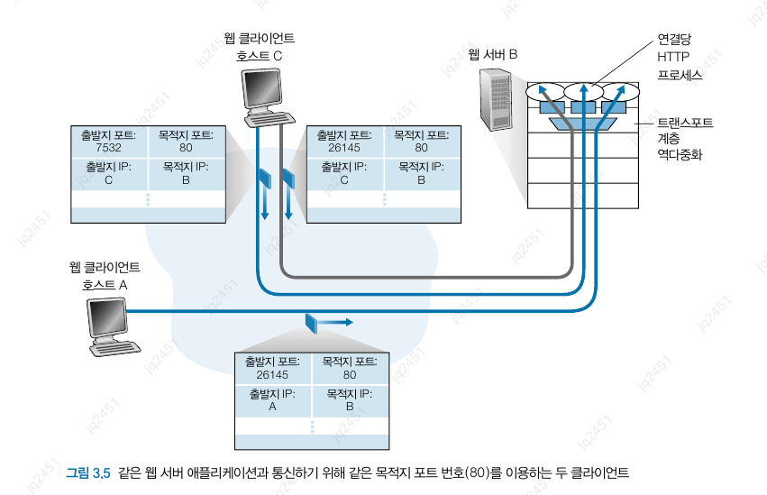
        <br>

- **웹 서버와 TCP**

    - 아파치 같은 경우 모든 세그먼트들이 목적지 포트 번호 80을 가질 것이다.

    - 서버는 각기 다른 클라이언트가 보낸 세그먼트를 출발지 IP 주소와 포트 번호로 구별한다.

    - 이들 프로세스는 각자 연결 소켓을 가지며, 이 연결 소켓은 HTTP 요청을 수신하고, 응답을 전송한다.

    - 연결 소켓과 프로세스 사이에 항상 일대일 대응이 이뤄지는 것은 아니다.

    - 각각 새로운 클라이언트 연결을 위해 새로운 연결 소켓과 함께 새로운 `스레드(서브 프로세스)`를 생성할 수도 있다.

    - 이처럼 같은 프로세스에 많은 연결 소켓들이 동시에 존재할 수 있다.

    - **지속 연결 vs 비지속 연결 HTTP**

        - **지속 연결** : 존속 기간에 클라이언트와 서버는 같은 서버 소켓을 통해 HTTP 메시지를 교환할 것이다.

        - **비지속 연결** : 모든 요청/응답마다 새로운 TCP 연결이 생성되고 종료되며 웹 서버에 심한 부담을 준다.

## 3.3 비연결형 트랜스포트: UDP

- UDP는 트랜스포트 계층 프로토콜이 할 수 있는 `최소 기능으로 동작`한다.

- UDP는 `다중화/역다중화 기능과 간단한 오류 검사 기능`을 제외하면 IP에 아무것도 추가하지 않는다.

- **UDP 흐름**

        - 애플리케이션 프로세스로부터 메시지를 가져온다.

        - 다중화/역다중화 서비스에 대한 출발지 포트 번호, 목적지 포트 번호 필드를 첨부하고 다른 두 필드를 추가한 후 세그먼트를 네트워크 게층에 넘겨준다.

        - 네트워크 계층은 세그먼트를 IP 데이터그램으로 캡슐화하고, 세그먼트를 수신 호스트에게 전달하기 위해 최선을 다한다.

        - 세그먼트가 수신 호스트에 도착하면, UDP는 세그먼트의 데이터를 해당하는 애플리케이션 프로세스로 전달하기 위해 목적지 포트 번호를 사용한다.

- UDP는 세그먼트를 송신히기 전에 송신 트랜스포트 계층 개체들과 수신 트랜스포트 계층 개체들 사이에 `핸드셰이크를 사용하지 않는다.`

- `DNS` : 전형적인 UDP를 사용한 애플리케이션 계층 프로토콜

    - 만약 질의 호스트가 응답을 수신하지 못하면, 질의는 다른 네임 서버로 송신하거나 애플리케이션에게 응답을 수신할 수 없음을 통보한다.

- **많은 애플리케이션에서 UDP가 적합한 이유**

    - `무슨 데이터를 언제 보낼지에 대해 애플리케이션 레벨에서 더 정교한 제어` : UDP는 애플리케이션이 메시지를 전달하자 마자 전송하는 반면, TCP는 **혼잡 제어 매커니즘**  때문에 전송이 지연되어 요구와 맞지 않을 수도 있다.

    - `연결 설정이 없음` : TCP는 **세 방향 핸드셰이크** 를 사용하는 반면 UDP는 사전 준비 없이 전송해서 연결을 설정하기 위한 **어떤 지연도 없다.**

    - `연결 상태가 없음` : TCP는 종단 시스템에서 연결 상태를 유지하지만, UDP는 연결 상태를 유지하지 않고 파라미터를 기록하지 않아 **좀 더 많은 액티브 클라이언트를 수용할 수 있다.**

    - `작은 패킷 헤더 오버헤드` : TCP는 세그먼트마다 **20바이트의 헤더 오버헤드** 를 가지만, UDP는 **8바이트의 헤더 오버헤드** 를 갖는다.

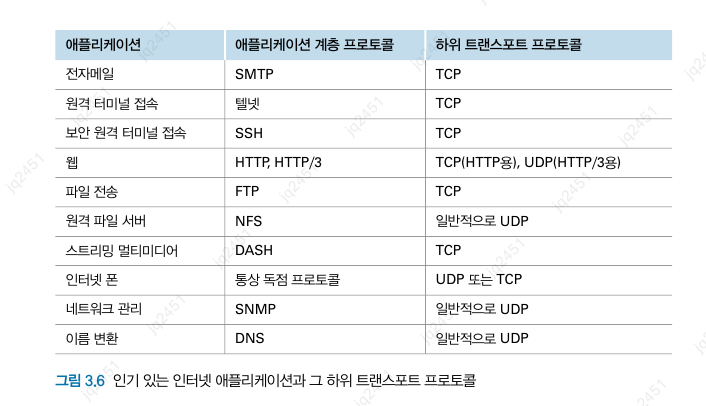
<br>

- 실시간 통신이 중요한 애플리케이션들은 TCP 혼잡 제어가 나쁜 영향을 미친다.

- 그러나 패킷 손상률이 낮고, 보안 측면의 이유로 일부 기관(UDP 트래픽을 막는)은 TCP를 좀 더 주시하고 있는 편이다.

- 최신 버전의 HTTP는 UDP를 통해 실행되어 애플리케이션 게층에서 `자체 오류 제어 및 혼잡 제어를 제공`한다.

- UDP의 혼잡 제어 결여는 송신자와 수신자 간의 높은 손실률을 초래하거나 다른 잠재적인 문제점이 야기할 수 있었다.

- 이를 해결하기 위해 UDP 출발지를 포함한 `모든 출발지에서 적응 혼잡 제어를 수행하는 매커니즘`이 제안되었다.

- `QUIC 프로토콜`을 통해 UDP 상에서 애플리케이션 계층에 신뢰성을 구현할 수 있게 되었다.

- 이를 통해 애플리케이션이 UDP를 사용할 때도 신뢰적인 데이터 전송을 가능케 되었다.

### 3.3.1 UDP 세그먼트 구조

- 애플리케이션 데이터는 UDP 데이터그램의 데이터 필드에 위치한다.

    - `DNS` : 질의 메시지, 응답 메시지

    - `스트리밍 오디오` : 오디오 샘플

- UDP 헤더는 **2바이트씩 구성된 4개의 필드** 를 갖는다.

- `포트 번호` : 목적지 호스트가 종단 시스템에서 동작하는 프로세스에게 애플리케이션 데이터를 정확하게 넘기게 한다.

- `체크섬` : 세그먼트에 오류가 발생했는지를 검사하기 위해 수신 호스트를 사용한다.

### 3.3.2 UDP 체크섬

- **오류 검출을 위한 것** , 세그먼트가 출발지로부터 목적지로 이동했을 때, `UDP 세그먼트 안의 비트에 대한 변경사항이 있는지 검사`한다.

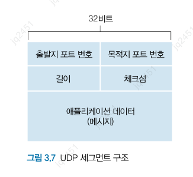
<br>

- 송신자 측에서 세그먼트 안에 있는 모든 16비트 워드의 합산에 대해 다시 `1의 보수`를 수행하며, 합산 과정에 발생하는 오버플로는 `윤회식 자리올림(wrap around)`을 한다.

    > **1의 보수** : 이진수의 각 자리 비트를 반대로 뒤집어 얻는 값

    > **윤회식 자리올림** : 정해진 비트 수를 초과하여 발생한 오버플로우를 맨 아래 자리로 돌려보내 더해주는 방식


- **예시** 

    ```
    0110011001100000
    0101010101010101
    1000111100001100

    // 16비트 워드에서 처음 2개의 워드 합
    0110011001100000
    0101010101010101
    ----------------
    1011101110110101

    // 앞 계산 합에 3번쨰 워드를 더한 합
    1011101110110101
    1000111100001100
    ----------------
    0100101011000010 (오버플로우 발생)

    // 합의 1의 보수
    1011010100111101 (체크섬 값)
    ```

        - 수신자에게는 체크섬을 포함한 4개의 모든 워드를 더해진다.

        - 패킷에 오류가 없다면, 수신자의 합은 1111111111111111 이 된다.

        - 만약 비트 중 하나라도 0이 있다면 패킷에 오류가 발생했음을 알 수 있다.

- `UDP가 체크섬을 제공하는 이유` : 출발지와 목적지 사이의 **모든 링크가 오류 검사를 제공한다는 보장이 없기 때문** 이다.

- `종단과 종단의 원칙(end-end principle)`의 한 예시

    - 주어진 링크 간의 신뢰성과 메모리의 오류 검사가 보장되지 않으면, **종단 간의 데이터 전송 서비스가 오류 검사를 제공해야 한다.**

- IP는 어떠한 2계층 프로토콜에서도 동작해야 하므로, 트랜스포트 계층은 안전장치로서 오류 검사를 제공하는 것이 유용하다.

- UDP는 **오류 검사는 하지만 오류 회복을 하기 위한 어떤 일도 하지 않는다.**

## 3.4 신뢰적인 데이터 전송의 원리

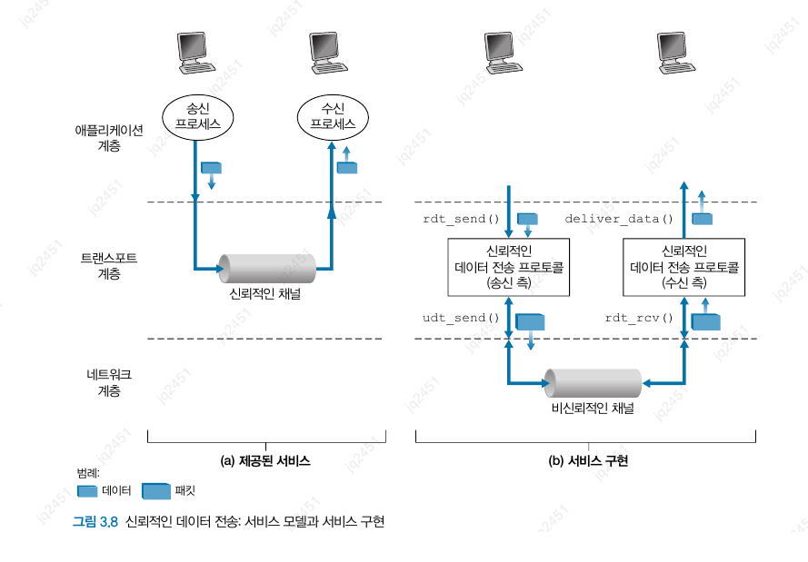
<br>

- **TCP가 애플리케이션에게 제공하는 서비스 모델**

        - 신뢰적인 채널에서는 전송된 데이터가 손상(0->1 또는 1->0)되거나 손실되지 않는다.

        - 모든 데이터는 전송된 순서 그대로 전달된다.

- **신뢰적인 데이터 전송 프로토콜(reliable data transfer protocol)**

    - 신뢰적인 전송 프로토콜의 아래에 있는 계층이 신뢰적이지 않을 수 있어서 작업이 어려워진다.

    - 하위 채널에서 비트나 패킷이 손실하는 경우 어떠한 프로토콜 매커니즘이 필요할지를 고려하는 것이 핵심이다.

    - **단방향 데이터 전송(unidirectional data transfer)**

        - 송신 측으로부터 수신 측까지의 데이터 전송만을 고려한다.

        - 단방향 데이터 전송만 하더라도 프로토콜의 송신 측과 수신 측이 양방향으로 패킷을 전달할 필요가 있다.

            -> 전송 데이터를 포함하는 패킷을 교환하는 것 외에 `제어 패킷을 양쪽으로 전송`해야 한다.

            - rdt의 송신 측과 수신 측 모두 `udt_send()`를 호출함으로써 다른 쪽에 패킷을 전송한다.

                    udt : 비신뢰적인 데이터 전송(unreliable data transfer)

### 3.4.1 신뢰적인 데이터 전송 프로토콜의 구축

- **완벽하게 신뢰적인 채널상에서의 신뢰적인 데이터 전송: rdt1.0**

    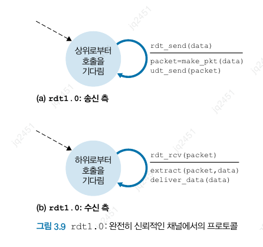
    <br>

        - rdt1.0 송신자와 수신자에 대한 유한상태 머신(finite-state machine, FSM) 정리

        - 송신자와 수신자 FSM은 각각 하나의 상태만을 갖는다.

        - 화살표는 한 상태로부터 다른 상태로의 전이를 나타낸다.

        - 가로선 위 : 전이를 일의키는 이벤트

        - 가로선 아래 : 이벤트 발생 시 취하는 액션

    - `rdt_send(data) 이벤트`는 상위 계층으로부터 데이터를 받아들이고 패킷을 생성해 채널로 송신한다.

    -`rdt_rcv(packet) 이벤트`에 의해 하위 채널로부터 패킷을 수신하고, 데이터를 추출한 후 데이터를 상위 계층에 전달한다.

- 완전히 신뢰적인 채널에서는 오류가 생길 수 없으므로 수신 측이 송신 측에게 어떤 피드백을 제공할 필요가 없다.

- **비트 오류가 있는 채널상에서의 신뢰적 데이터 전송: rdt2.0**

    - `모델` : 패킷 안의 비트들이 하위 채널에서 손상되는 모델

        - 패킷이 `전송 또는 전파되거나 버퍼링`될 때 네트워크의 물리적 구성요소에서 일반적으로 발생한다.

    - `자동 재전송 요구(Automatic Repeat reQuest, ARQ) 프로토콜`

        - 제어 메시지를 통해 정확하게 수신되었는지 또는 잘못 수신되어 반복이 필요한지를 수신자가 송신자에게 전달함으로써 신뢰적인 데이터 전송 프로토콜을 구현한다.

        - **3가지 부가 프로토콜 기능**

            1. `오류 검출`

                - 비트 오류가 발생했을 때 수신자가 검출할 수 있는 기능이 필요하다.

                - 수신자가 패킷 비트 오류를 검출하고 복구할 수 있게 한다.

            2. `수신자 피드백`

                - 송신자가 수신자의 상태를 알기 위해 `긍정 확인응답(ACK)` 또는 `부정 확인응답(NAK)`과 같은 제어 메시지를 전송한다.

            3. `재전송`

                - 수신자에서 오류를 가지고 수신된 패캣은 송신자에 의해 재전송된다.

    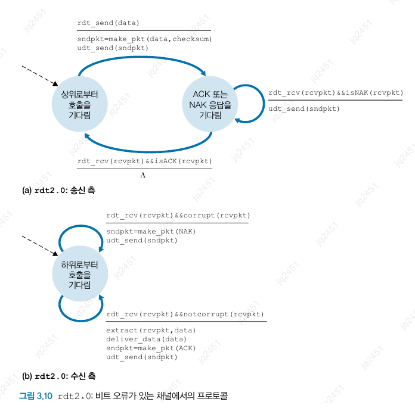
    <br>

        - NAK가 수신되면 프로토콜은 마지막 패킷을 재전송하고 재전송된 데이터 패킷에 대한 응답을 기다린다.

        - 송신자가 ACK 또는 NAK를 기다리는 상태에 있을 때, 상위 계층으로부터 더 이상의 데이터를 전달받을 수 없다.

    - `전송 후 대기(stop-and-wait) 프로토콜` : 송신자는 수신자가 현재의 패킷을 정확하게 수신했음을 확인하기 전까지 새로운 데이터를 전달하지 않는다.

    - **rdt2.0의 치명적인 결함**

        - rdt2.0은 ACK와 NAK 패킷이 손상되는 경우를 고려하지 않았다.

        - **손상된 ACK 또는 NAK를 처리하기 위한 3가지 가능성**

                1. 말하는 사람이 수신자로부터 ACK나 NAK 응답을 이해하지 못한 경우, '뭐라고 하셨죠?'라는 질문을 하는 방법(새로운 송신자-수신자 패킷을 도입한다는 것)

                2. 송신자가 검출뿐만 아니라 비트 오류로부터 회복할 수 있도록 충분한 체크섬 비트들을 추가하는 것

                3. 송신자가 왜곡된 ACK 또는 NAK 패킷을 수신할 떄 현재 데이터 패킷을 단순히 다시 송신하는 것

        - **해결책**

            - 데이터 패킷에 새로운 필드를 추가하여 이 필드 안에 `순서 번호(sequence number)`를 삽입하는 방식

            - `한 비트 순서 번호`이면 송신자가 이전에 전송된 패킷을 다시 전송한 것인지, 아니면 새로운 패킷을 전송한 것인지를 알 수 있다.

            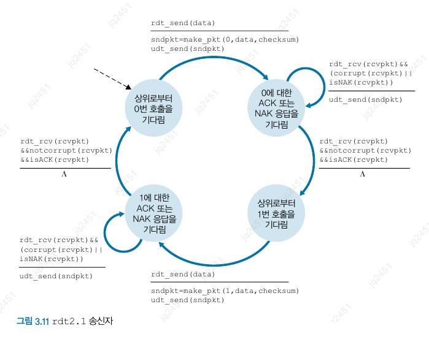
            <br>

            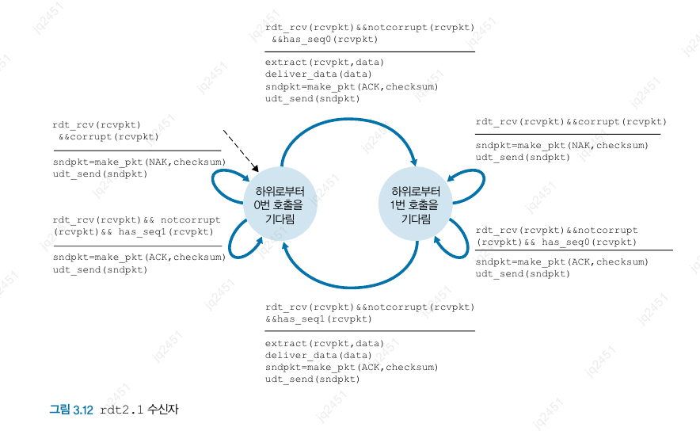
            <br>

            - rdt 2.1은 2.0보다 2배 더 많은 상태를 가지고 있다.

                - 0번 송신, 기다림 상태

                - 1번 송신, 기다림 상태

            - NAK를 송신하는 것 대신, `가장 최근에 수신 성공한 패킷의 번호를 ACK에 포함`해서 보내면 같은 효과를 얻을 수 있다.

        - **rdt 2.2**

            - 비트 오류를 갖는 채널을 위한 `NAK 없는` 신뢰적인 데이터 전송 프로토콜

            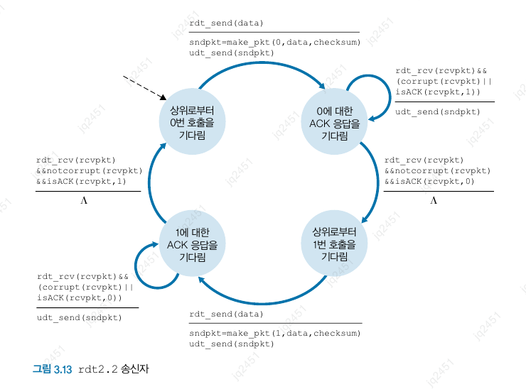
            <br>

            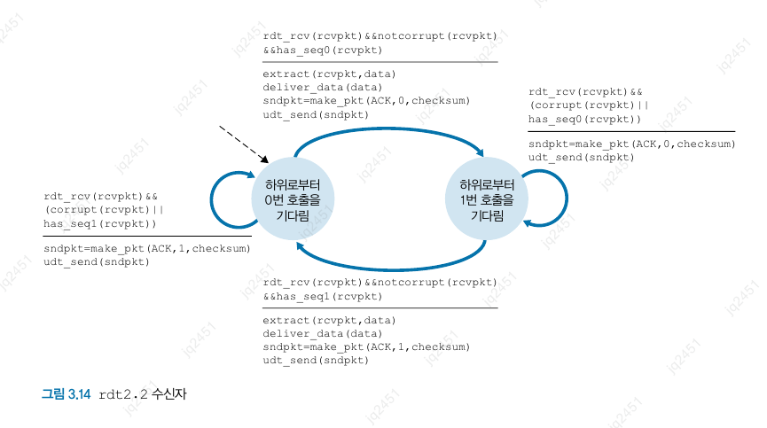
            <br>

            - rdt2.2와 rdt2.1의 차이점

                - 수신자는 반드시 ACK 메시지에 의해 확인 응답되는 패킷의 순서 번호를 포함해야 한다.

                - 송신자는 수신된 ACK 메시지에 의해 확인응답된 패킷의 순서 번호를 반드시 검사해야 한다.

- **비트 오류와 손실 있는 채널상에서의 신뢰적인 데이터 전송: rdt3.0**

        - 하위 채널이 패킷을 손실하는 경우, 어떻게 패킷 손실을 검출할 것인가?

        - 패킷 손실이 발생했을 때, 어떤 행동을 할 것인가?

    - 송신자 측은 손실된 패킷의 검출과 회복 책임이 있다.

    - 송신자가 어떤 패킷을 손실했다는 것을 확신하기 위해 얼마나 오랫동안 기다려야 할까?

    - 송신자에게 있어 손실 시 행동은 `재전송`으로 정해져있다.

    - 시간 기반의 재전송 매커니즘을 구현하기 위해 `인터럽트를 위한 카운트다운 타이머(countdown timer)`가 필요하다.

    - **송신자의 동작방식**

        1. 매 패킷이 송신된 시간에 타이머를 시작

        2. 타이머 인터럽트에 반응함

        3. 타이머를 멈춤

    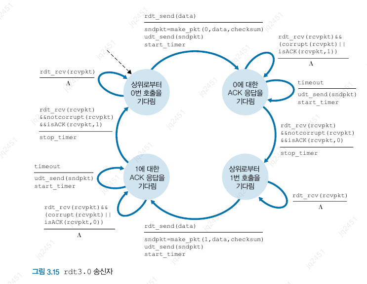
    <br>

    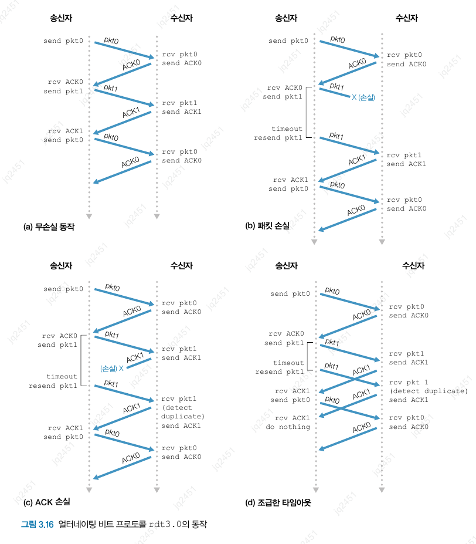
    <br>

    - 패킷 손실 또는 지연 없이 어떻게 동작하는지와 손실된 데이터 패킷을 어떻게 처리하는지를 보여준다.

### 3.4.2 파이프라이닝된 신뢰적인 데이터 전송 프로토콜

- **rdt 3.0의 성능 문제** : 전송 후 대기(stop-and-wait) 프로토콜

    - 이는 지연에 영향을 많이 받아 지연이 증가할 수록 나쁜 성능이 두드러진다.

- **해결책** : `파이프라이닝(pipelining)`

    - 확인응답을 기다리지 않고 여러 패킷을 전송하도록 허용하는 방식

    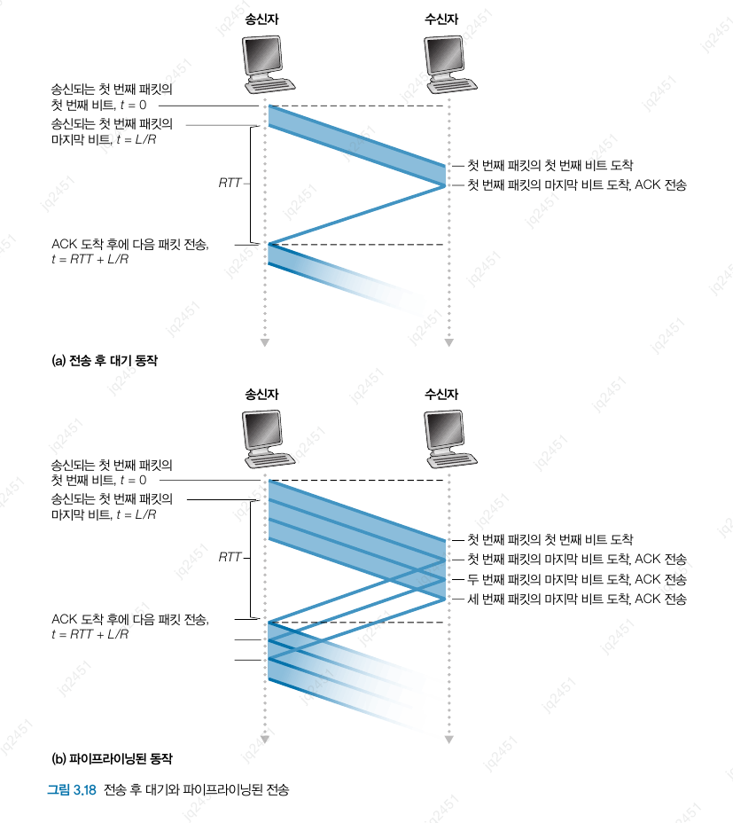
    <br>

    - **파이프 라이닝의 중요성**

        - **순서 번호의 범위** 가 커져야 한다.

            - 각각 전송 중인 패킷은 유일한 순서 번호를 가져야하며 ACK가 안된 패킷이 여럿 있을 수 있기 때문이다.

        - 프로토콜의 **송신 측과 수신 측은 패킷 하나 이상을 버퍼링** 해야한다.

            - 최소한 송신자는 ACK 안된 패킷을 버퍼링해야 한다.

            - 정확하게 수신된 패킷도 수신자 측에서 버퍼링해야 한다.

        - 필요한 순서 번호의 범위와 버퍼링 조건은 **데이터 전송 프로토콜이 손실 패킷과 손상 패킷 그리고 지연된 패킷들에 대해 응답하는 방식에 의존** 한다.

            - 파이프라인 오류 회복 방법

                1. `GBN(Go-Back-N)`

                2. `SR(Selective Repeat)`

### 3.4.3 GBN

- GBN 프로토콜에서 송신자는 확인응답을 기다리지 않고 여러 패킷을 `최대 허용 수 N을 넘지 않도록 전송`할 수 있다.

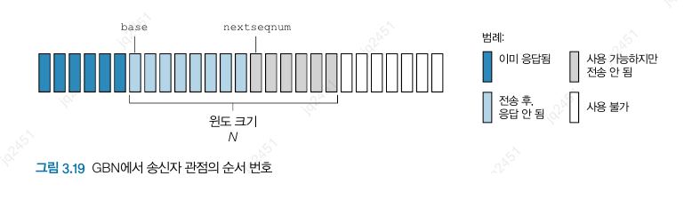
<br>

    - 확인응답 안된 가장 오래된 패킷 : base

    - 사용되지 않은 가장 작은 순서 번호 : nextseqnum

- `윈도`는 순서 번호 공간에서 오른쪽으로 슬라이드되서 `슬라이딩 윈도 프로토콜`이라고도 불린다. 

    - `윈도` : 허용할 수 있는 순서 번호의 범위 N

- 패킷의 순서 번호는 패킷 헤더 안의 고정된 길이 필드에 포함된다.

- TCP 순서 번호는 패킷 단위보단 바이트 스트림에서 바이트를 세는 수다.

- base와 nextseqnum 변수와 변수에서의 동작, 변수를 포함하는 조건부 동작을 추가했으므로 `확장된 FSM`이라고도 한다.

- GBN 송신자는 3가지 이벤트에 반응한다.

    1. `상위로부터의 호출`

        - rdt_send()가 위로 호출되면, 우선 윈도가 가득 찼는지(N개의 확인되지 않은 패킷이 있는지) 확인한다.

        - 가득 차 있지 않다면 패킷을 생성되고 송신된다.

        - 윈도가 가득 차있으면 데이터를 상위 계층으로 반환하고 상위 계층은 나중에 다시 시도한다.

    2. `ACK의 수신`

        - 순서 번호 n을 가진 패킷에 대한 확인응답은 **누적 확인응답(cumulative acknowledgment)** 으로 인식된다.

        - **누적 확인응답** : 올바르게 수신된 n을 포함하여, n까지의 순서 번호를 가진 모든 패킷에 대한 확인응답

    3. `타임아웃 이벤트`

        - 타임아웃이 발생한다면, 송신자는 이전에 전송되었지만 아직 확인응답되지 않은 모든 패킷을 다시 송신한다.

        - 만약 한 ACK가 수신되었지만, 뒤에 확인안된 패킷이 아직 존재한다면, 타이머는 다시 시작한다.

- **GBN에서 수신자의 행동**

    - 만약 순서 번호 n을 가진 패킷이 오류 없이 순서대로 수신된다면, 수신자는 **패킷 n에 대한 ACK를 송신하고 상위 계층에 패킷의 데이터 부분을 전달** 한다.

    - 그 외의 경우, 수신자는 **패킷을 버리고 가장 최근에 수신된 문서의 패킷 ACK를 재전송** 한다.

    - 수신자는 어떤 순서가 잘못된 패킷에 대해 버퍼링할 필요가 없으며, 단지 다음 패킷의 순서 번호만 유지하면 된다.

    - 이로 인해 올바르게 수신된 패킷을 버리게 되면, 수많은 재전송이 필요할 수도 있다는 단점이 있다.

    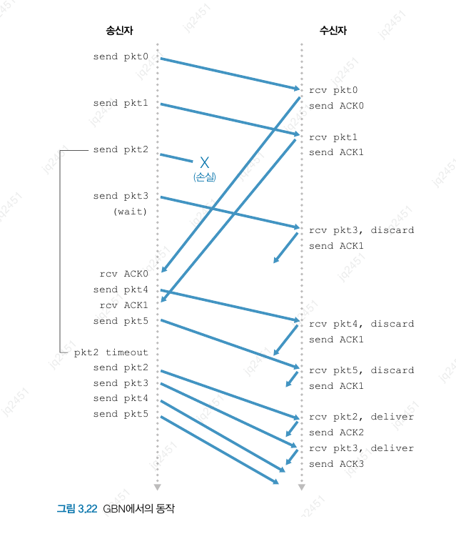
    <br>

### 3.4.4 SR

- GBN은 `패킷 하나의 오류 때문에 많은 패킷을 재전송하므로 많은 패킷을 불필요하게 재전송`하는 경우가 발생한다.

- `SR(Selective Repeat) 프로토콜`은 **오류가 발생한 패킷을 수신했다고 의심되는 패킷만 재전송** 하여 불필요한 재전송을 피한다.

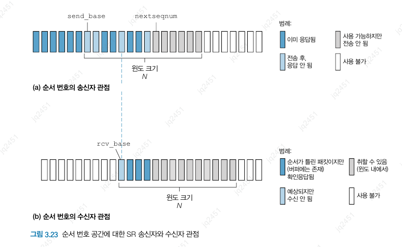
<br>

- 순서가 바뀐 패킷은 빠진 패킷이 수신될 때까지 **버퍼에 저장**하고, 빠진 패킷이 수신된 시점에서 일련의 패킷을 **순서대로 상위 계층에 전달**한다.

- **SR 송신자의 이벤트와 행동**

    1. `상위로부터 데이터 수신`
    
        - SR 송신자는 패킷의 다음 순서 번호를 검사한다.

        - 순서 번호가 송신자 윈도 내에 있으면 패킷으로 송신된다.

        - 아니면 버퍼에 나중에 전송하기 위해 되돌려진다.

    2. `타임아웃`

        - 타임아웃 시 오직 한 패킷만 전송되기 때문에, 각 패킷은 자신의 논리 타이머가 있어야 한다.

    3. `ACK 수신`

        - 수신되었을때, SR 송신자는 그 ACK가 윈도 내에 있다면 패킷을 수신된 것으로 표기한다.

        - 패킷 순서 번호가 `send_base`와 같다면, **윈도 베이스는 가장 작은 순서 번호를 가진 아직 확인응답되지 않은 패킷으로 옮겨진다.**

- **SR 수신자의 이벤트와 행동**

    1. `[rcv_base, rcv_base+N-1] 내의 순서 번호를 가진 패킷이 손상 없이 수신된다.`

        - 선택적인 ACK 패킷이 송신자에게 회신된다.

        - 이전에 수신되지 않았던 패킷이라면 버퍼에 저장한다.

        - 수신 윈도의 base와 같은 순서 번호를 가졌다면, **이 패킷과 버퍼에 저장되어 연속적인 번호를 가진 패킷들은 상위 계층으로 전달** 된다.

    2. `[rcv_base-N, rcv_base-1] 내의 순서 번호를 가진 패킷이 수신된다.`

        - 패킷이 수신자가 이전에 확인응답한 것이라도 ACK가 생성되어야 한다.

    3. `그 외의 경우`

        - 패킷을 무시

    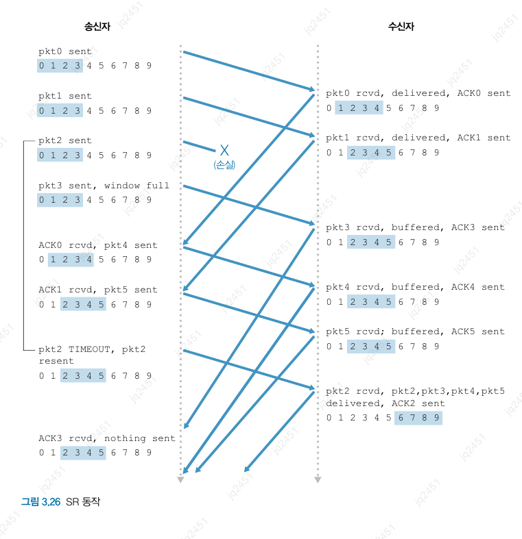
    <br>

- 수신자가 현재의 윈도 base보다 작은 특정 순서 번호를 가진 패킷을 무시하지 않고 `재확인응답`을 하는 것이 중요하다.

    - **SR 프로토콜에서 송신자와 수신자의 윈도가 항상 같지 않기 때문이다.**

    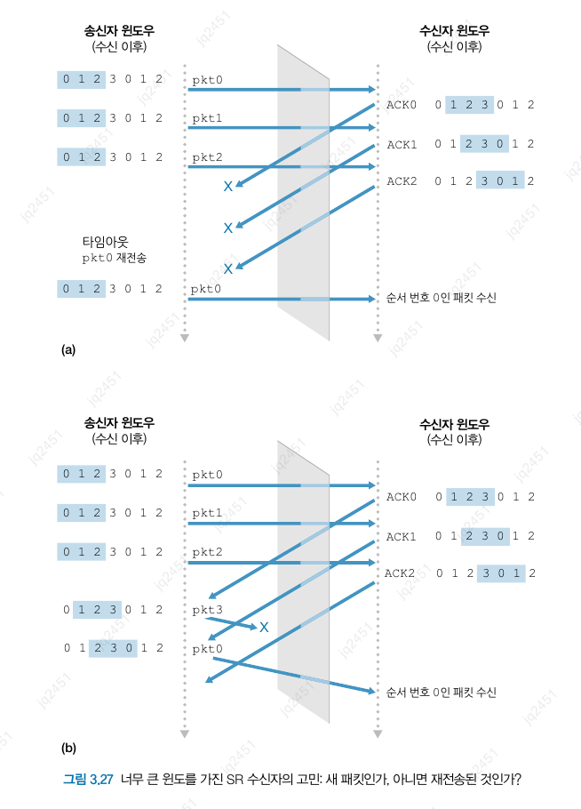
    <br>

    - 수신자는 송신자의 행동을 볼 수 없으므로, 채널을 통해 보낸 **메시지의 순서가 똑같으면 구별할 방법이 없다.**

    - 때문에 윈도 크기는 `순서 번호 공간 크기의 절반보다 작거나 같아야 한다.`

- **채널이 네트워크일 때 패킷 순서 바뀜이 일어날 수 있다.**

    - 순서가 바뀌는 채널이란 패킷들이 버퍼에 저장하고 나중에 어느 때나 임의로 내본다고 볼 수 있다.

    - 이전에 송신된 순서 번호 x를 가진 패킷들이 더는 네트워크상에 없1음을 확신할 때까지 순서 번호가 재사용되지 않아야 한다.

    - 이는 대략 3분의 최대 패킷 수명이 고속 네트워크에 대한 TCP 확장에 가정되어 있다.

- **신뢰적인 데이터 전송 메커니즘과 사용 요약**

| 메커니즘 | 사용 설명 |
| -- | -- |
| 체크섬 | 전송된 패킷 안의 비트 오류 발견에 사용 |
| 타이머 | 채널 안에서 패킷이 손실되었기 때문에 발생되는 패킷의 타임아웃/재전송에 사용 |
| 순서 번호 | 송신자에게 수신자로 가는 데이터 패킷의 순서 번호를 붙이기 위해 사용 |
| 확인응답 | 수신자가 한 패킷 또는 패킷 집합이 정확히 수신되었다는 응답을 송신자에게 하기 위해 사용 |
| 부정 확인응답 | 수신자가 패킷이 정확히 수신되지 않았다는 응답을 송신자에게 하기 위해 사용 |
| 윈도, 파이프라이닝 | 송신자는 주어진 범위에 있는 순서 번호를 가진 패킷만 전송하도록 제한 |

## 3.5 연결지향형 트랜스포트: TCP

- 신뢰적인 데이터 전송을 제공하기 위해 TCP는 **헤더 필드(오류 검출, 재전송, 누적 확인응답, 타이머, 순서 번호, 확인응답 번호)를 포함해 앞에서 논의했던 원칙들** 을 따르고 있다.

### 3.5.1 TCP 연결

- TCP는 애플리케이션 프로세스가 데이터를 다른 프로세스에 보내기 전에, 두 프로세스는 서로 `핸드셰이크`를 먼저 해야 하므로 `연결지향형(connection-oriented)`이다.

- 데이터 전송을 보장하는 파라미터들을 각자 설정하기 위한 어떤 사전 세그먼트들을 보내야 한다.

- TCP 연결 설정의 일부로서, 연결의 양단은 TCP 연결과 연관된 많은 TCP 상태 변수를 초기화한다.

- TCP 연결은 회선 교환 네트워크와 같은 **종단 간 TDM이나 FDM이 아니다.**

- 연결은 두 통신 종단 시스템의 TCP에 존재하는 상태를 공유하는 **논리적인 것** 이다.

- TCP 프로토콜은 **오직 종단 시스템에서만 동작** 하고, 중간의 네트워크 요소들(라우터, 링크 계층 스위치)은 TCP 연결 상태를 유지하지 않는다.

- TCP는 `전이중 서비스(full-duplex service)`를 제공한다.

    - 양방향으로 데이터가 흐를 수 있다.

- TCP는 `점대점(point-to-point)`이다.

    - 항상 단일 송신자와 단일 수신자 사이의 1 대 1 통신만 가능하며, 멀티캐스팅은 불가능하다.

- **연결 설정(세 방향 핸드셰이크)**

    - 클라이언트 프로세스 : 연결을 요청하는 프로세스

    - 서버 프로세스 : 연결 요청을 기다리는 프로세스

    1. 클라이언트는 서버와의 연결을 설정하기 원한다고 TCP 클라이언트에게 알린다.

    2. 클라이언트 트랜스포트 계층은 서버의 TCP와 TCP 연결 설정을 진행한다.

    3. 서버는 2번째 특별한 TCP 세그먼트로 응답한다.

    4. 클라이언트가 3번째 특별한 세그먼트로 다시 응답한다.

    - 처음 2개의 세그먼트에는 **페이로드(애플리케이션 계층 데이터)가 없고, 3번째 세그먼트는 페이로드를 포함할 수 있다.**

- **클라이언트에서 서버로의 데이터 송신**

    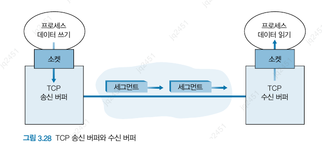
    <br>

    - 클라이언트는 `소켓을 통해 데이터의 스트림을 전달`한다.

    - 세 방향 핸드셰이크 동안 `준비된 버퍼(송신 버퍼)`로 데이터를 보낸다.

        - TCP는 때때로 송신 버퍼에서 데이터 묶음을 만들어 네트워크로 보낸다.

    - 세그먼트로 모아 담을 수 있는 최대 데이터의 양은 보통 `최대 세그먼트 크기(maximum segment size, MSS)`로 제한된다.

        - MSS는 일반적으로 로컬 송신 호스트에 의해 전송될 수 있는 가장 큰 링크 게층 프레임의 길이(`최대 전송 단위(maximum transmission unit, MTU)`)에 의해 결정되고, 그 후 TCP 세그먼트와 TCP/IP 헤더 길이가 단일 링크 계층 프레임에 맞도록 히여 정해진다.

        - 이더넷과 PPP 링크 계층 프로토콜은 모두 1500바이트의 MTU를 가진다. 따라서 MSS의 일반적인 값은 **1460바이트** 이다.

        - **주의** : MSS가 헤더를 포함하는 TCP세그먼트의 최대 크기가 아니라, `세그먼트에 있는 애플리케이션 계층 데이터에 대한 최대 크기`이다.

- TCP는 **TCP 헤더와 클라이언트 데이터** 를 하나로 묶어 `TCP 세그먼트`를 구성한다.

- TCP 연결은 한쪽 호스트에서 버퍼, 변수, 프로세스에 대한 소켓 연결과 다른 쪽 호스트에서의 버퍼, 변수, 프로세스에 대한 `소켓 연결의 집합`으로 이루어진다.

    - 버퍼와 변수는 호스트 간에 있는 네트워크 요소의 연결에 할당되지 않는다.

### 3.5.2 TCP 세그먼트 구조

- TCP 세그먼트는 헤더 필드와 데이터 필드로 구성되어 있다.

    - 데이터 필드는 애플리케이션 데이터의 일정량을 담는다.

    - MSS는 데이터 필드의 크기를 제한한다.

        - TCP는 웹 문서 같은 이미지가 큰 파일을 전송할 떄 MSS 크기로 파일을 분절한다.

- **TCP 세그먼트의 구조**

    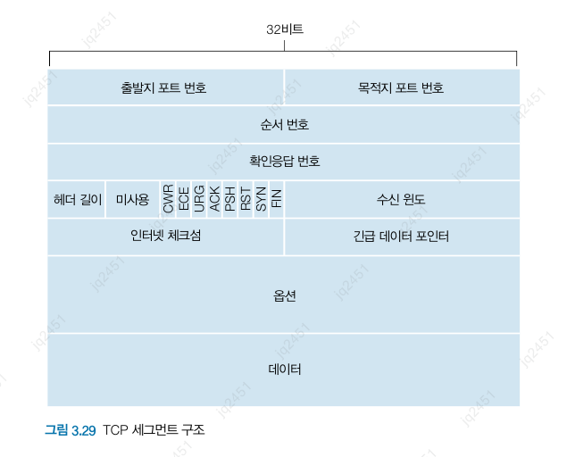
    <br>

    - **헤더**

        - `출발지 / 목적지 포트 번호`

            - 다중화 / 역다중화

        - `체크섬`

            - 오류 검출

        - `순서 번호 필드(sequence number field)`

            - 신뢰적인 데이터 전송 서비스 구현

        - `확인응답 번호 필드(acknowledgement number field)`

            - 신뢰적인 데이터 전송 서비스 구현

        - `수신 윈도 필드(receive window)`

            - 흐름 제어 : 수신자가 받아들이려는 바이트의 크기를 나타내는데 사용

        - `헤더 길이 필드(header length)`

            - 32비트 워드 단위로 TCP 헤더의 길이를 표시

        - `옵션 필드(option field)`

            - MSS를 협상하거나 윈도 확장 요소로 이용

            - 타임스탬프 옵션 또한 정의된다.

            - 일반적을 옵션 필드는 TCP 길이가 20바이트가 되도록 비어있다.

        - `플래그 필드(flag field)`

            - 6개의 비트를 포함

            1. `ACK` : 확인응답 필드 값이 유용함을 가리키는 데 사용

            2. `RST, SYN, FIN` : 연결 설정 / 해제에 사용    

            3. `PSH` : 수신자가 데이터를 상위 게층에 즉시 전달해야함을 가리키는데 사용

            4. `URG` : 상위 계층 개체가 '긴급'으로 표시된 데이터임을 가리킴.

                - 긴급 데이터의 마지막 바이트 위치는 16비트의 `긴급 데이터 포인터 필드`가 가리킨다.

                - 긴급 데이터 존재 시 수신 측 상위 게층 개체에게 통지하고 긴급 데이터 끝에 포인터에 전달한다.

            > **참고** : PSH, URG 그리고 긴급 데이터 포인터는 실제 사용되진 않는다.

- **순서 번호와 확인응답 번호**

    - 순서 번호와 확인응답 번호는 헤더에서 가장 중요한 필드들이며, 신뢰적인 데이터 전송에서 필요하다.

    - TCP는 데이터를 구조화되어 있지 않고 **순서대로 정렬되어 있는 바이트 스트림** 으로 본다.

        - 순서 번호는 `세그먼트에 있는 첫 번쨰 바이트의 바이트 스트림 번호`이다.

        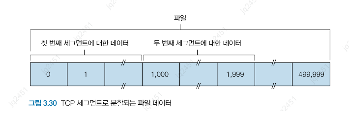
        <br>

            그림과 같이 MSS가 1000이고 데이터 스트림이 500000이라면, 첫 번째 세그먼트의 첫 번째 바이트가 순서번호가 된다.

        - TCP는 전이중 방식임이며 호스트 B로부터 도착한 세그먼트는 **B로부터 A로 들어온 데이터에 대한 순서 번호** 를 갖는다. 

            - 호스트 A가 자신의 세그먼트에 삽입하는 확인응답 번호는 `A가 B로부터 기대하는 다음 바이트의 순서번호`이다.

            - **예시**

                - 호스트 A가 B로부터 0~535 번호가 붙은 바이트를 수신받았다면, 확인응답 번호 필드를 536으로 삽입한다.

                - 만약 A가 0~535의 바이트와 900~1000의 바이트를 수신했다면, B에 대한 A의 다음 확인응답 번호는 여전히 536이다.

                    - TCP는 스트림에서 잃어버린 바이트에 대해 `누적 확인응답(cumulative acknowledgment)`을 제공한다.

                - 만약 900~1000의 바이트가 536~899의 바이트 보다 일찍 수신했을 경우, **개발자의 선택** 에 맡긴다.
    
                    1. 수신자가 순서가 바뀐 세그먼트를 **즉시 버린다.**

                    2. 수신자는 순서가 바뀐 데이터를 보유하고, **빈 공간에 잃어버린 데이터를 채우기 위해 기다린다.** (실제로 사용하는 방식)

    - 그림에선 시작 순서 번호가 0이였지만, 실제론 **임의의 숫자를 시작 순서 번호로 선택** 한다.

        - 네트워크에 아직 남아 있던 세그먼트와 나중 연결에서 유효한 세그먼트로 `오인될 확률을 최소화`하기 위해서이다.

- **텔넷: 순서 번호와 응답확인 번호 사례연구**

    - `텔넷` : 원격 로그인을 위해 사용되는 대표적인 애플리케이션 프로토콜

        - TCP상에서 실행되며, 한 쌍의 호스트 사이에서 동작하도록 설계되었다.

        - `에코 백(echo back)` : 사용자가 입력한 한번 입력한 키 값을 서버로 보내고, 서버가 에코하면 화면에 표시된다. 

    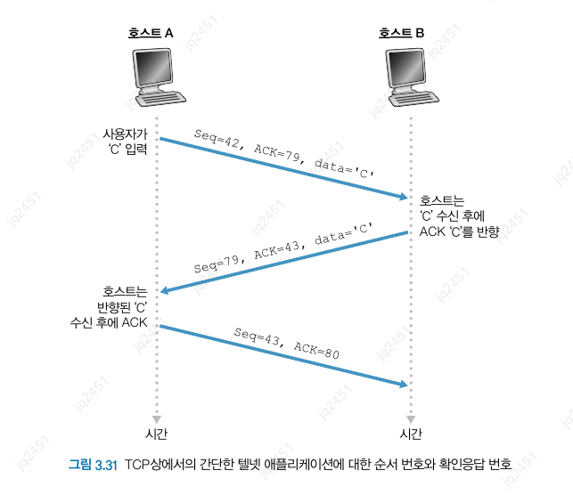
    <br>

    - 2번쨰 세그먼트는 2 가지 목적을 갖는다.

        1. 수신하는 서버에게 데이터에 대한 확인응답을 제공한다.

        2. 입력받은 문자를 반대로 반향되도록 한다.

    - 이러한 확인응답은 서버-클라이언트 데이터 세그먼트상에서 `피기백(piggybacked)`된다고 한다.

### 3.5.3 왕복 시간(RTT) 예측과 타임아웃

- TCP가 손실 세그먼트를 발견하기 위해 타임아웃/재전송 메커니즘을 사용한다는 것을 알아보자.

    - 타임아웃은 세그먼트가 전송된 시간부터 긍정 확인응답될 때까지의 시간인 `RTT`보다 커야 한다.

    - RTT는 처음에 어떻게 측정할까?

- **왕복 시간 예측**

    - `SampleRTT` : **세그먼트가 송신된 시간(IP에게 넘겨진 시간)으로부터 그 세그먼트에 대한 긍정응답이 도착한 시간** 까지의 시간 길이이다.

        - 대부분의 TCP는 한 번에 하나의 SampleRTT 측정만 시행한다.

        - TCP는 재전송한 세그먼트에 대한 SampleRTT는 계산하지 않는다.

        - SampleRTT 값은 **라우터에서의 혼잡, 종단 시스템에서의 부하 변화** 떄문에 세그먼트마다 다르다.

            - 이떄문에 `평균값`을 채택한다.

        $EstimatedRTT = (1 - \alpha) * EstimatedRTT + \alpha * SampleRTT$  
        (권장값 $\alpha = 0.125$)

        - EstimatedRTT는 SampleRTT 값의 가중평균

        - **지수적 가중 이동 평균(Exponential Weighted Moving Average, EWMA)**

            - 이 가중평균은 예전 샘플보다 최근 샘플에 높은 가중치를 준다.

        $DevRTT = (1 - \beta) * DevRTT + \beta * |SampleRTT - EstimatedRTT|$  
        (권장값 $\beta = 0.25$)

        - DevRTT는 **SampleRTT와 EstimatedRTT 값 차이의 EWMA** 이다.

- **재전송 타임아웃 주기의 설정과 관리**

    - TCP 타임아웃 주기에는 어떤 값이 사용되어야 하는가?

        - 주기는 EstimatedRTT보다 크거나 같아야 한다.

        - 너무 크면 세그먼트를 잃었을 떄, TCP는 세그먼트의 즉각적인 재전송을 하지 않게 되어 **데이터 전송 지연이 나타난다.**

        - EstimatedRTT에 **약간의 여윳값을 더한 값** 으로 설정하는 것이 바람직하다.
        
        $TimeoutInterval = EstimatedRTT + 4 * DevRTT$

        - 초기 TimeoutInterval 값은 1초로 설정하며, 타임아웃 발생 시 값을 2배로 늘려 조기 타임아웃을 피한다.

### 3.5.4 신뢰적인 데이터 전송

- IP 서비스는 비신뢰적이다. 

    - 데이터그램 전달은 보장되지 않고, 순서대로 전달된다는 보장도 없으며, 데이터그램에 포함된 데이터의 무결성을 보장하지 않는다.

    - 데이터그램은 라우터의 버퍼를 오버플로 상태로 만들 수도 있으며, 목적지에 도달하지 않거나, 데이터그램의 순서가 틀리게 도달하거나, 데이터그램의 비트가 손상될 수도 있다.

    - TCP는 IP 서비스위에 `신뢰적인 데이터 전송 서비스`를 제공한다.

        - 프로세스가 자신의 수신 버퍼로부터 읽은 데이터 스트림이 **손상되지 않았으며, 손실이나 중복 없이 순서가 유지된다는 것을 보장** 한다.

        - 확인응답을 받지 못한 세그먼트는 개별적인 타이머와 한 쌍이 되어 동작하는 것이 가장 **간단한 방법**이지만, TCP는 오직 `단일 재전송 타이머`만 사용한다.

- **TCP 송신자의 데이터 전송/재전송에 관련된 세 가지 주요 이벤트**

    1. **상위 애플리케이션으로부터 수신된 데이터**

        - TCP는 애플리케이션으로부터 데이터를 받고, 세그먼트로 이 데이터를 캡슐화하고, IP에게 넘긴다.

        - 이 세그먼트가 IP로 넘어갈 때 타이머가 시작한다.

    2. **타이머 타임아웃**

        - 타임아웃 이벤트에 대해 타임아웃을 일으킨 세그먼트를 재전송하여 응답한다.

        - 이 떄 TCP 타이머를 다시 시작한다.

    3. **ACK 수신**

        - TCP는 변수 SendBase(수신 확인응답이 확인되지 않은 가장 오래된 바이트 순서 번호)와 ACK 값 y를 비교한다.

        - y > SendBase이면, ACK는 이전에 확인응답 안된 하나 이상의 세그먼트들을 확인해준다.

            - 송신자는 SendBase 변수를 갱신하고, 확인응답 안된 세그먼트들이 존재한다면 타이머를 다시 시작한다.

- **몇 가지 흥미로운 시나리오**

    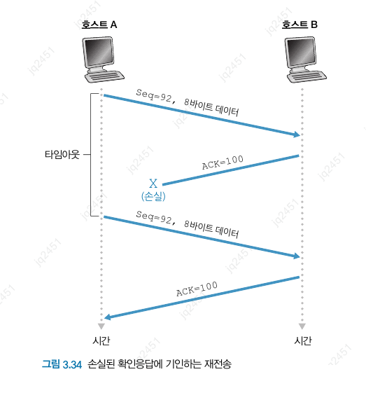
    <br>

        재전송 시 호스트 B는 세그먼트의 순서 번호로부터 이미 수신된 데이터임을 알고 바이트를 버린다.

    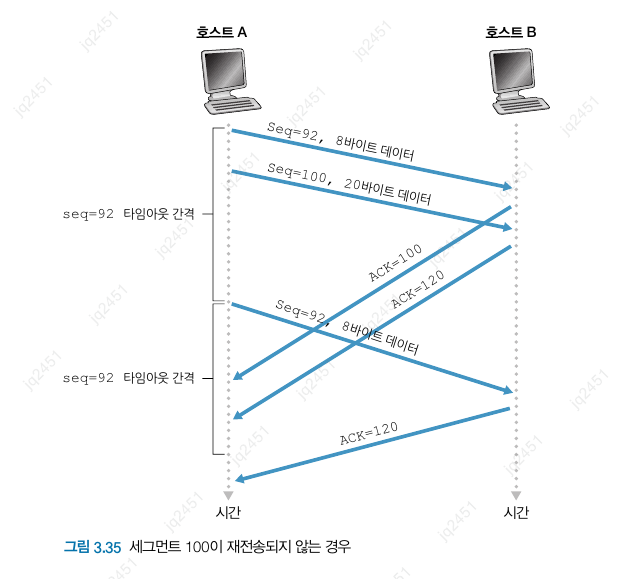
    <br>

        타임아웃 이벤트 발생 시, 첫 번쨰 세그먼트를 재전송하고 타이머를 다시 시작한다. 새로운 타임아웃 이전에 두 번쨰 세그먼트에 대한 ACK가 도착하면 두 번째 세그먼트는 재전송하지 않는다.

    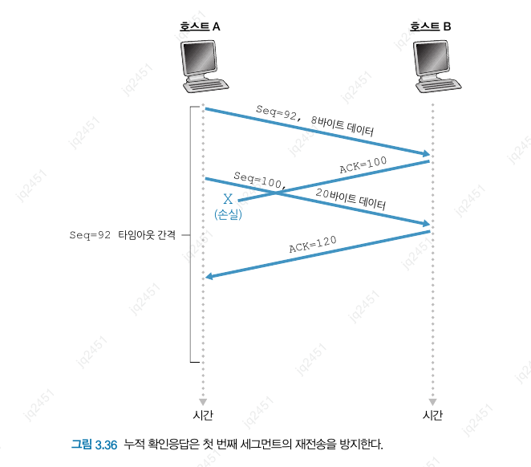
    <br>

        첫 번째 세그먼트의 확인응답은 손실됐지만 긍정 응답번호 120번을 받아 119번까지 모두 수신했음을 알게 된다. 따라서 첫 번째 세그먼트를 재전송하지 않는다.

- **타임아웃 주기의 두 배로 설정**

    - TCP는 재전송 때마다 타임아웃값이 아닌 **타임아웃 주기를 이전 값의 2배** 로 설정한다.

    - 다른 2가지 이벤트(상위 애플리케이션으로부터 데이터 수신, ACK 수신) 이후 타이머가 시작될 때, TimeoutInterval은 **EstimatedRTT와 DevRTT의 가장 최근의 값** 에서 가져온다.

    - 이 수정은 **제한된 형태의 혼잡 제어를 제공** 한다.

        - 타이머 종료는 주로 네트워크의 혼잡에 의해 발생한다.

        - 혼잡할 떄 출발지에서 지속해서 패킷 재전송을 고집하면 혼잡은 악화된다.

        - 대신 TCP는 송신자각 더 긴 간격으로 재전송하도록 한다.

- **빠른 재전송**

    - 타임아웃이 유발하는 재전송의 문제는 **타임아웃의 주기가 때떄로 비교적 길다** 는 점이다.

        - 긴 타임아웃은 송신자를 오랫동안 기다리게 해서 종단 간의 지연을 증가시킨다.

        - 종종 **중복 ACK에 의한 타임아웃이 일어나기 전에 패킷 손실을 발견** 한다.

    - **중복 ACK(duplicate ACK)** 는 송신자가 이미 이전에 받은 확인응답에 대한 재확인응답 세그먼트 ACK이다.

        - 수신자가 기다리는 다음 것보다 큰 순서 번호를 가진 세그먼트를 받았을 때, 수신자는 데이터 스트림에서의 간격을 찾아낸다.

        - 이 간격은 네트워크 안에서 세그먼트를 잃어버리거나 순서가 바뀐 결과일 수 있다.

        - TCP는 부정 확인응답을 사용하지 않으므로, **마지막으로 수신된 순차적인 바이트를 갖는 데이터** 를 다시 확인응답으로 보낸다.

    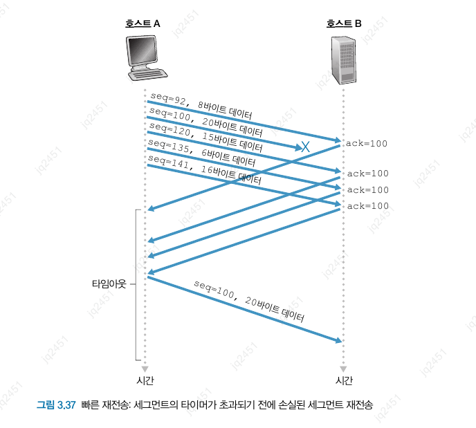
    <br>

    > TCP 송신자가 같은 데이터에 대해 3개의 중복 확인응답을 수신한다면, 세그먼트가 분실되었다고 판단하고 세그먼트의 타이머가 만료되기 전에 손실 세그먼트를 재전송하는 `빠른 재전송(fast retransmit)`을 한다.

- **GBN인가 SR인가?**

    - **GBN과 유사한 점**

        - TCP 확인응답은 누적되고, 순서가 잘못된 세그먼트는 **수신자가 개별적으로 ACK를 받지 않는다.**

        - TCP 송신자는 전송했지만 확인응답 안된 바이트의 가장 작은 순서 번호(SendBase)와 전송될 다음 바이트의 순서 번호(NextSeqNum)를 유지해야 한다.

    - **SR과 유사한 점**

        - TCP는 올바르게 수신되었지만 순서가 바뀐 세그먼트들을 **버퍼링** 한다.

        - 패킷 n에 대해서 긍정 확인응답이 손실되었을 경우, TCP는 **세그먼트 n 하나만 재전송한다.**

    - TCP는 이러한 점에 있어서 **SR(Selective Repeat)** 과 유사하지만, `선택적 확인응답(selective acknowledgement)`라고 하며 GBN과 SR 프로토콜의 혼합으로 분류한다.

### 3.5.5 흐름 제어

- TCP 연결이 순서대로 올바르게 바이트를 수신할 때 TCP는 데이터를 수신 버퍼에 저장한다.

- 애플리케이션 프로세스는 버퍼에서 데이터를 읽지만, 데이터가 도달한 시점에 읽을 필요는 없다.

- 송신자가 점점 더 많은 데이터를 빠르게 전송하면 연결의 수신 버퍼에 쉽게 **오버플로가 발생** 한다.

- TCP는 송신자가 수신자의 버퍼를 오버플로시키는 것을 방지하기 위해 애플리케이션에게 `흐름 제어 서비스(flow-control service)`를 제공한다.

    - 수신하는 애플리케이션이 읽는 속도와 송신자가 전송하는 속도를 같게 한다.

- `혼잡 제어(congestion control)` : TCP 송신자는 IP 네트워크에서 혼잡 때문에 억제될 수 있다.

    - 혼잡 제어는 흐름 제어와 다른 목적으로 수행된다.

- TCP는 송신자가 `수신 윈도(receive window)`라는 변수를 유지하여 흐름 제어를 제공한다.

    - `수신 윈도` : 수신 측에서 가용한 버퍼 공간이 얼마나 되는지를 송신자에게 알려주는 역할

    - TCP는 전이중이기 때문에 각 송신자마다 별도의 수신 윈도를 유지한다.

            - LastByteRead : 애플리케이션 프로세스에 의해 버퍼로부터 읽힌 데이터 스트림의 마지막 바이트 번호

            - LastByteRcvd : 네트워크로부터 도착하여 수신 버퍼에 저장된 데이터 스트림의 마지막 바이트 번호

    $LastByteRcvd - LastByteRead <= RcvBuffer$

        - TCP는 할당된 버퍼의 오버플로를 허용하지 않으므로 해당 수식이 적용된다.

    $rwnd = RcvBuffer - [LastByteRcvd - LastByteRead]$

        - 수신 윈도는 버퍼의 여유 공간으로 설정된다.

    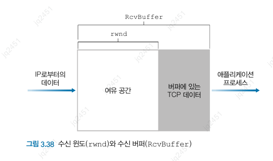
    <br>

    - 호스트 B는 호스트 A에게 세그먼트의 윈도 필드에 rwnd를 명시함으로써 **연결 버퍼에 얼만큼의 여유 공간이 있는지 알려준다.**

    - 호스트 A는 rwnd의 값보다 작은 확인응답 안된 데이터의 양을 유지함으로써 **수신 버퍼에 오버플로가 발생하지 않았다는 것을 확신** 한다.

    $LastByteSent - LastByteAcked <= rwnd$

- **기술적인 문제**

    - 호스트 B의 수신 버퍼는 rwnd = 0으로 가득찼다고 가정하자.

    - 호스트 B에서 **버퍼를 비우더라도 TCP는 호스트 A에서 새로운 rwnd로 새로운 세그먼트를 전송하지 않는다.**

    - TCP는 전송할 데이터가 있거나 전송해야 할 확인응답을 가진 경우에만 세그먼트를 전송하기 때문에, **호스트 A는 호스트 B의 버퍼가 비었다는 사실을 알 수 없다.**

    - 해결하기 위해 TCP 명세서는 호스트 A가 호스트 B의 수신 윈도가 0일 때, 1바이트 데이터로 세그먼트를 계속해서 전송하도록 한다.

- **UDP는 흐름 제어를 제공하지 않는다.**

    - UDP는 대응하는 소켓에 위치한 유한 크기 버퍼에 세그먼트를 쌓는다.

    - 버퍼로부터 빠르게 세그먼트를 읽지 못하면, 버퍼는 오버플로가 발생하고 세그먼트를 잃어버린다.

### 3.5.6 TCP 연결 관리

- 지연(예: 웹 서핑할때)과 SYN 플러드 공격을 비롯한 네트워크 공격은 대부분은 **TCP 연결 관리와 관련해서 일어난다.**

- **TCP를 이용한 클라이언트-서버 연결**

    1. 클라이언트 TCP는 서버 TCP에게 **특별한 TCP 세그먼트(SYN 세그먼트)** 를 보낸다.

        - 이 세그먼트는 애플리케이션 계층 데이터를 포함하지 않으며, 헤더에는 `SYN 비트`를 1로 설정한다.

        - 추가로 클라이언트는 **최초의 순서 번호(client_isn)** 를 임의로 선택하고, 최초의 TCP SYN 세그먼트의 순서 번호 필드에 넣는다. 이 세그먼트는 IP 데이터그램 안에 캡슐화되어 서버로 전송된다.

            - 특정 보안 공격을 피하기 위해 순서 번호를 임의로 추출한다.


    2. TCP SYN 세그먼트를 포함하는 IP 데이터그램이 서버 호스트에 도착하면, 서버는 데이터그램으로부터 TCP SYN 세그먼트를 추출한다. 그리고 클라이언트로 **연결 승인 세그먼트(SYNACK 세그먼트)** 를 송신한다.

        - 세그먼트 헤더 안의 정보

            - SYN 비트 = 1

            - 확인응답 필드 : `client_isn + 1`

            - 서버 최초 순서 번호(`server_isn`)을 선택하고 TCP 세그먼트 헤더의 순서 번호 필드에 넣는다.

    3. 연결 승인 세그먼트(SYNACK 세그먼트)를 수신하면, 클라이언트는 서버로 또 다른 세그먼트를 송신한다.

        - 서버의 연결 승인 세그먼트를 확인하는 용도

        - 헤더의 확인응답 필드에 `server_isn+1`, 연결이 설정되었기 때문에 **SYN 비트 = 0**

    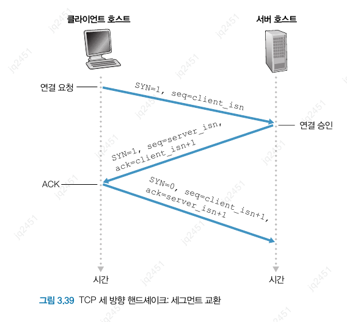
    <br>

    - 3단계가 완료되면 클라이언트와 서버 호스트들은 각각 서로에게 데이터를 포함하는 세그먼트를 보낼 수 있다.

        - 연결 설정되었으니 다음 세그먼트부터 **SYN 비트 = 0**

        - 두 호스트 사이에 3개의 패킷이 송신되어 `세 방향 핸드셰이크(three-way handshake)`라고 불린다.

- **TCP 연결 종료**

    - TCP 연결에 참여하는 두 프로세스 중 하나가 연결을 끝낼 수 있다.

    - 연결이 끝날 때, **호스트의 자원(버퍼와 변수)는 회수된다.**

    - 종료시 헤더에 FIN 비트 = 1로 설정된 세그먼트를 전송한다.

    - 이 세그먼트를 수신하면 확인응답 세그먼트를 보낸다.

    - 그 다음 FIN 비트 = 1로 설정된 자신의 종료 세그먼트를 송신한다.

    - 마지막으로 상대방은 종료 세그먼트에 대한 확인응답을 한다. 이후 두 호스트 사이의 모든 자원은 회수된다.

    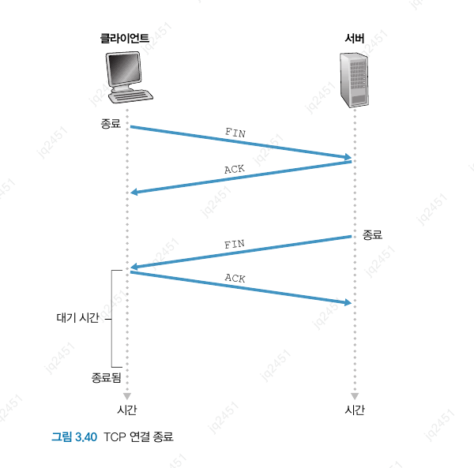
    <br>

- **클라이언트 TCP에서 TCP 상태 변이**

    - `CLOSED` : 클라이언트 TCP의 시작점

    - `SYN-SENT` : 클라이언트 TCP는 서버 TCP로부터 **1로 설정된 SYN 비트** 와 **클라이언트의 이전 세그먼트에 대한 확인응답을 가진 세그먼트** 를 기다린다.

    - `ESTABLISHED` : TCP 클라이언트는 페이로드 데이터를 포함하는 TCP 세그먼트를 송수신할 수 있다.

    - `FIN-WAIT-1` : FIN 비트가 1로 설정된 세그먼트를 송신하고 상대방의 확인응답을 기다린다.

    - `FIN-WAIT-2` : 확인응답을 받은 후, FIN 비트를 포함하는 다른 세그먼트를 기다린다.

    - `TIME-WAIT` : 세그먼트를 수신받으면, 확인응답을 보내고 ACK가 손실될 것을 대비해 일정 시간 대비

        - 대체로 30초, 1분,, 2분이다.

    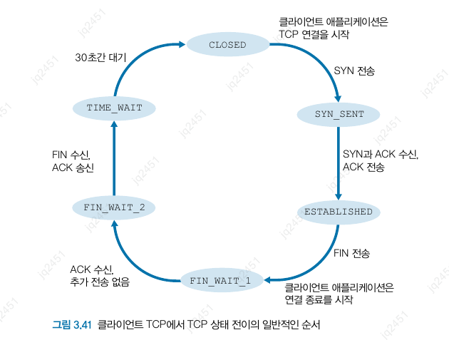
    <br>

    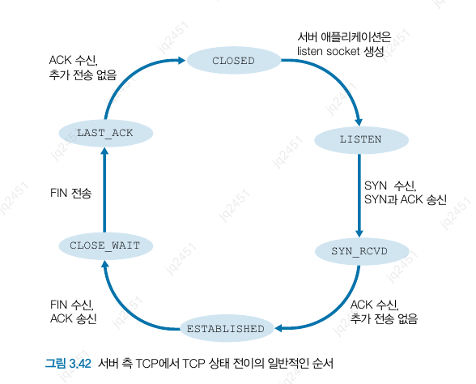
    <br>

- 소켓과 관계없는 세그먼트를 수신받아, 연결이 수락되지 않고 있다면(웹 서버가 동작하지 않고 있다.), 호스트는 출발지로 `RST 플래그 비트가 1인 리셋 세그먼트`를 보낸다.

    - 출발지에게 세그먼트를 더이상 **재전송하지 말라는 것** 을 알려주는 역할

> **보안 초점** : SYN 플러드 공격  
>
> - 클라이언트가 세뱡향 핸드셰이크의 세 번쨰 단계를 완료하기 위한 ACK를 보내지 않고 서버가 절반만 열린 상태를 계속 유지시키는 공격
>
> - 세 번째 단계를 완료하지 않은 상태에서 무수한 TCP SYN 세그먼트를 보내 서버의 연결 자원을 소진시킨다.
> 
> - 대부분의 운영체제는 `SYN 쿠키`라는 대응책이 있다.
> 
> - 동작 방식
>
>        - 서버는 SYN 세그먼트 출발지, 목적지 IP 주소들과 포트 번호들을 "해시 함수로 처리하여 TCP 순서 번호(쿠키)"를 생성한다. 이것을 SYNACK 패킷으로 보낸다.
>
>       - 서버는 동일한 해시 함수를 실행해 함수의 결과가 1을 더한 값인지 확인한다.
>
>       - 맞으면 완전하게 열린 연결을 만들고 아니면 어떠한 자원도 할당하지 않았으므로 서버에 해를 끼치지 못한다.

## 3.6 혼잡 제어의 원리

- 네트워크 혼잡 원인을 처리하기 위해 혼잡을 일으키는 송신자들을 억제하는 메커니즘이 필요하다.

### 3.6.1 혼잡의 원인과 비용

- **시나리오 1: 2개의 송신자와 무한 버퍼를 갖는  하나의 라우터**

    - 출발지와 목적지 사이에 단일 홉을 공유하는 연결을 갖는다고 가정하자.

    - 호스트 A와 호스트 B가 전송되는 패킷은 라우터와 용량 R의 공유 출력 링크를 통과한다.

    - 라우터는 패킷 도착률이 출력 링크의 용량을 초과하여 입력되는 패킷들을 저장하는 버퍼가 있다.

    - 처리량은 R/2 이상을 초과할 수 없다.

    - 만약 전송률이 R/2를 근접하면 **평균 지연이 커지며** , 초과하면 **평균 지연이 무제한** 이 된다.

    - `패킷 도착률이 링크 용량에 근접함에 따라 큐잉 지연이 커진다.`

    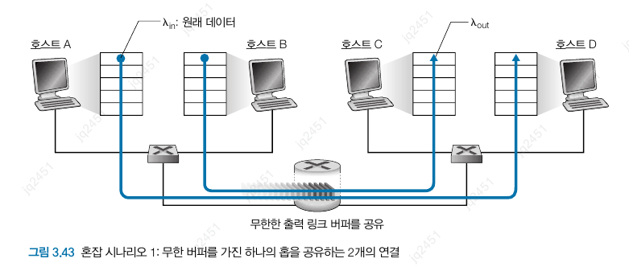
    <br>

- **시나리오 2: 2개의 송신자, 유한 버퍼를 가진 하나의 라우터**

    - **가정**

        - 시나리오 1과 다르게 라우터 버퍼의 양이 유한하다.

        - 버퍼가 가득 찼을 때 도착하는 패킷은 버려진다.

        - 각 연결은 신뢰적이라 패킷이 버려지면 송신자에 의해 재전송될 것이다.

    - 송신자는 버퍼 오버플로 때문에 버려진 패킷을 보상하기 위해 **재전송을 수행** 해야 한다.

    - 커다란 지연으로 인한 송신자의 불필요한 재전송은 라우터가 패킷의 불필요한 복사본들을 전송하는데 **링크 대역폭을 사용하는 원인** 이 된다.

- **시나리오 3: 4개의 송신자와 유한 버퍼를 갖는 라우터, 그리고 멀티홉 경로**

    - **가정**

        - 겹쳐지는 2홉 경로를 통해 패킷을 전송한다.

        - 각 호스트가 안정적인 데이터 전송 서비스를 실행하기 위해 타임아웃/재전송 메커니즘을 사용한다.

        - 모든 호스트는 동일한 데이터 값을 갖고 라우터 링크는 R로 통일한다.

    - 트래픽이 많은 경우, 종단 간 처리율이 0이 된다.

    - 제공된 부하와 처리량 간의 **트레이드오프가 발생함** 을 알려준다.

    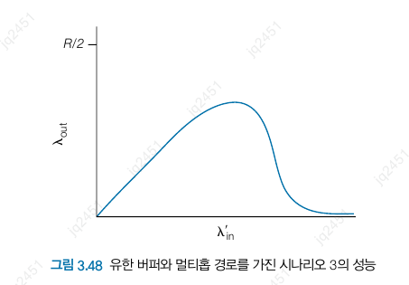
    <br>

    - **제공된 부하를 증가시키면 처리량이 궁극적으로 감소하는 이유**

        - 패킷이 2번째 홉 라우터에서 버려질 때마다, 1번쨰 홉 라우터가 수행한 작업은 **헛된 것** 이 된다.

        - 첫 번쨰 라우터가 간단하게 그 패킷을 포기했다면, 다른 패킷을 전송하는데 유익하게 사용할 수 있지만 안된다.

        - 패킷이 경로상에서 버려질 때, 버려지는 지점까지 패킷을 전송하는 데 **사용된 전송 용량은 낭비된 것이다.**

    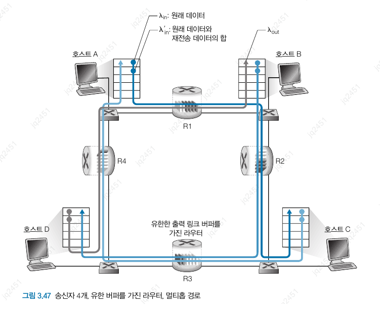
    <br>

### 3.6.2 혼잡 제어에 대한 접근법

- 네트워크 계층이 혼잡 제어를 목적으로 트랜스포트 게층에게 **어떤 직접적인 도움을 제공하는지** 에 따라 혼잡 제어 접근을 구별한다.

    - `종단 간의 혼잡 제어`

        - 네트워크 계층은 혼잡 제어 목적을 위해 트랜스포트 계층에게 어떤 **직접적인 지원을 제공하지 않는다.**

        - 혼잡의 존재는 관찰된 네트워크 동작(패킷 손실 및 지연)에 기초해 **종단 시스템이 추측** 해야 한다.

        - IP 계층이 내트워크 혼잡에 대해 종단 시스템에게 어떠한 피드백 제공도 요구받지 않아 **TCP가 혼잡 제어를 위해 해당 방식을 채택한다.**

        - TCP 세그먼트 손실은 **네트워크 혼잡의 발생 표시로 간주하고 그에 따라 윈도 크기를 줄인다.**

    - `네트워크 지원 혼잡 제어`

        - 네트워크 지원 혼잡 제어에서 라우터들은 네트워크 안에서 혼잡 상태와 관련하여 송신자, 수신자 모두에게 **직접적인 피드백을 제공**한다.

        - 피드백은 하나의 비트로 표현하거나, 송신자에게 전송률을 알려주는 등 정교하게 피드백하는게 가능하다.

        - 최근엔 TCP와 IP가 네트워크 혼잡 제어를 선택적으로 구현할 수 있게 됐다.

    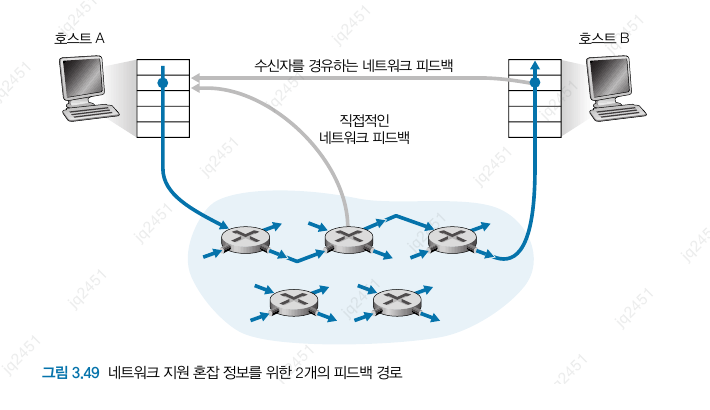
    <br>

    - **혼잡 정보를 송신자에게 피드백하는 2가지 방법**

        1. 직접 피드백 : 라우터에서 송신자에게 보내는 것. 전형적으로 **초크 패킷(choke packet)의 형태** 를 갖는다.

        2. 경유 피드백 : 송신자에서 수신자에게로 흐르는 패킷 안의 특정 필드에 **표시/수정하는 것.**

            - 수신자가 패킷을 수신했을 때, 혼잡 상태를 송신자에 알린다.(왕복 시간이 걸린다.)

## 3.7 TCP 혼잡 제어

- **TCP에서 중요한 요소**

    - 신뢰적인 전송 서비스

    - TCP 혼잡 제어 메커니즘

### 3.7.1 전통적인 TCP의 혼잡 제어

- **TCP가 취한 접근방식** : 네트워크 혼잡에 따라 연결에 트래픽을 보내는 전송률을 각 송신자가 제한하도록 하는 것

- **3가지 의문**

    1. TCP 송신자는 자신의 연결에 송신자 전송 **트래픽 전송률을 어떻게 제한** 하는가?

        - TCP 혼잡 제어 메커니즘은 추가적으로 **혼잡 윈도(congestion window)** 를 추적한다.

            - 혼잡 윈도는 TCP 송신자가 네트워크로 **트래픽을 전송할 수 있는 속도에 제약**을 가한다.

        - 송신하는 쪽에서 확인응답이 안 된 데이터의 양은 `cwnd`와 `rwnd`의 **최솟값을 초과하지 않을 것이다.**

        - `송신자의 송신 속도` : 대략 cwnd / RTT (바이트/초)

        - `cwnd`의 값을 조절하여, 송신자는 링크에 데이터를 전송하는 속도를 **조절할 수 있다.**

    2. TCP 송신자는 자신과 목적지 사이 **경로의 혼잡을 어떻게 감지** 하는가?

        - 버려진 데이터그램은 송신 측에서 손실 이벤트(타임아웃 / 3개의 중복된 ACK의 수신)를 발생시키고, 송신자는 **이벤트를 통해** 경로상의 혼잡이 발생했음을 알 수 있다.

        - TCP는 `확인응답` 속도에 맞춰 혼잡 **윈도 크기를 조절** 한다.

            - **확인응답** : 트리거 / 클록

            - **TCP** : 자체 클로킹

        - **TCP의 처리 원칙**

            - 손실된 세그먼트는 혼잡을 의미, 전송률은 손실했을 때 줄인다.

            - 이전에 확인응답되지 않은 세그먼트에 대해 ACK가 도착하면 송신자의 전송률은 증가할 수 있다.

            - 대역폭 탐색 : 비동기적으로 로컬 정보에 근거해 동작한다. 

    3. 송신자는 종단 간의 혼잡을 감지함에 따라 **송신율을 변화시키기 위해 어떤 알고리즘을 사용** 해야 하는가?

        1. **슬로 스타트**

        2. **혼잡 회피**

        3. 빠른 회피

        - 슬포 스타트와 혼잡 회피는 TCP의 필수 요소, 빠른 회복은 권고된다.

- **슬로 스타트**

    - TCP 연결이 시작될 때, `cwnd` 값은 일반적으로 **1 MSS** 로 초기화, 초기 전송률은 **MSS/RTT**가 된다.

    - TCP 송신자의 가용 대역폭은 **MSS/RTT보다 훨씬 클 것** 이므로, 확인응답을 받을 때마다 **하나의 MSS씩 증가** 시켜 가용 대역폭 양을 찾는다.

        - 전송률은 작은 값으로 시작하지만 **지수적으로 증가**하게 된다. 

    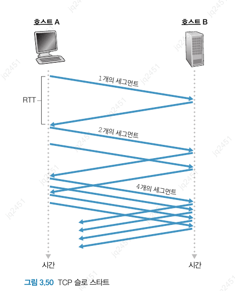
    <br>

    - **지수적 증가가 끝나는 경우**

        1. 타임아웃으로 표시되는 손실 이벤트가 있을 경우

            - TCP 송신자는 `cwnd` 값을 1로 설정하고 새로 시작한다.

        2. **임계값(ssthresh)** 에 도달했을 때

            - ssthresh의 값 : `cwnd / 2(혼잡 윈도 값의 반)`

            - ssthresh는 혼잡이 마지막으로 검출된 시점에서의 cwnd 값의 반이므로, **값에 도달하거나 지나쳐 계속 2배로 증가시키는 것은 좋지 않다.**

        3. 3개의 중복 ACK 검출됐을 경우

            - **빠른 재전송** 을 수행하여 빠른 회복 상태로 들어간다.

    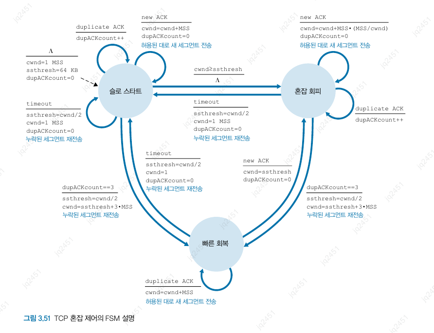
    <br>

- **혼잡 회피**

    - 혼잡 회피 상태로 들어가는 시점에서 `cwnd` 값은 혼잡이 마지막으로 발견된 시점 값의 반이다.

    - RTT마다 `cwnd` 값을 두 배로 하기보단  보수적인 접근법을 채택하여 **RTT마다 하나의 MSS씩 증가시킨다.**

    - **언제 혼잡 회피의 선형 증가가 끝나는가?**

        - 타임아웃이 발생했을 때

            - 슬로 스타트와 마찬가지로 `cwnd` 값을 1로 설정하고 다시 시작

        - 3개의 중복된 ACK 이벤트가 발생했을 때

            - 수신한 시점에서 `cwnd` 값을 반으로 줄이고 `ssthresh` 값을 **cwnd 값의 반** 으로 기록한다. 이후 빠른 회복으로 전환한다.

- **빠른 회복**

    - `cwnd` 값을 손실된 세그먼트에 대해 수신된 모든 중복된 ACK에 대해 **1 MSS만큼씩 증가** 시킨다.

    - 손실된 세그먼트에 대한 ACK가 도착하면 TCP는 **cwnd 혼잡 회피 상태** 로 들어간다.

    - 타임아웃이 발생하면, 슬로 스타트 및 혼잡 회피에서와 같은 동작을 수행한 후 **슬로 스타트로 전이** 한다.

    - **TCP 타호(TCP Tahoe)**

        - 초기 TCP 버전으로 타임아웃이 표기되거나 손실 이벤트가 발생하면 무조건 혼잡 윈도를 1 MSS로 줄이고, 슬로 스타트로 들어간다.

    - **TCP 리노(TCP Reno)**

        - 빠른 회복을 채택했다.

- **TCP 혼잡 제어: 복습**

    - TCP 혼잡 제어의 구성

        - RTT마다 1 MSS씩 `cwnd`의 선형 증가

        - 3개 중복 ACK 이벤트에서 `cwnd`의 절반화

    - 이러한 이유로 `가법적 증가, 승법적 감소(additive increase, multiplicative decrease, AIMD)`의 혼잡 제어 방식이라고 불린다.

    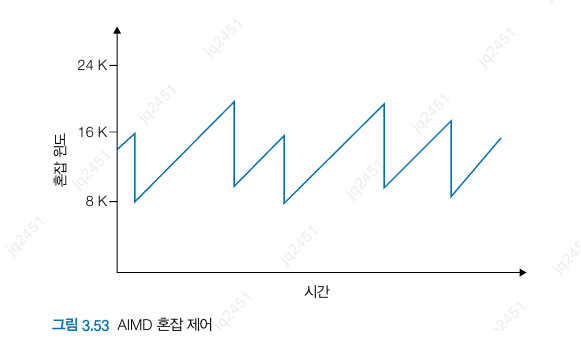
    <br>

- **TCP 큐빅**

    - AMID 방식을 고려해볼 때, 이것이 패킷 손실 발생 임곗값보다 바로 아래의 패킷 전송 속도를 '탐색'하는 가장 좋은 방법인지 궁금해질 수 있다.

    - 혼잡한 링크 상태가 많이 변경되지 않을 경우 **전송 속도를 더 빠르게 높여 손실 전 전송 속도에 근접한 다음 대역폭을 신중하게 조사** 하는 게 효율적일 수 있다.

    - **큐빅의 단계**

        1. 손실이 마지막으로 감지되었을 때 **TCP의 혼잡 제어 윈도 크기** 를 $W_{max}$, $W_{max}$에 도달한 **미래 시점**을 $K$라고 기억하고 `큐빅 매개변수들`이 $K$ 값에 얼마나 빨리 도달하는가를 결정한다. 

        2. 큐빅은 혼잡 윈도를 현재 시각 $t$가 $K$ 시각 사이 거리의 **세제곱 함수** 로 증가 시킨다.

        3. $t$가 $K$에 가까울수록 **증가율은 점차 느려지며** , 크게 초과함에 따라 급격하게 증가한다. 이로 인해 손실을 유발한 링크의 정체 수준이 크게 변경될 경우, 큐빅이 새 작동 지점을 더 빨리 찾을 수 있다.

    - TCP 큐빅은 최근 널리 보급되고 있다.

- **TCP 리노 처리율의 거시적 설명**

    - 톱니 모양의 TCP 리노 동작이 주어지면, 장시간 연결된 **TCP 연결의 평균 처리율** 을 생각해보는 것은 당연하다.

    - **TCP 안정 상태 동작에 대한 거시 모델**

        - $W/RTT$까지 증가할 때, 네트워크는 연결로 온 패킷을 버린다.

        - 비율은 반을 줄어들고 혼잡 윈도가 다시 $W/RTT$ 에 도달할 때까지 왕복 시간 당 $MSS/RTT$ 만큼 증가한다. 
        
        - 이 과정이 반복되면 처리량이 양 극값 사이에서 선형적으로 증가해 0.75를 얻는다.

        - **연결의 평균 처리율**
        
         $$\frac{0.75*W}{RTT}$$

### 3.7.2 네트워크 지원 명시적 혼잡 알림과 지연 기반 혼잡 제어

- TCP는 네트워크에서 명시적인 혼잡 표시를 수신하지 않는 대신, **관찰된 패킷 손실을 통해 혼잡을 추론** 한다.

- 최근에는 네트워크가 TCP 송신자, 수신자에게 명시적으로 혼잡 신호를 전달할 수 있도록 확장됐다.

- **명시적 혼잡 알림 (Explicit Congestion Notification, ECN)**

    - 네트워크 지원 혼잡 제어의 한 형태

    - IP 데이터그램 **헤더의 서비스 유형 필드에 있는 2비트** 가 ECN에 사용된다.

        - ECN 비트의 설정

            1. 라우터가 **정체를 겪고 있음을 나타내기 위해 사용**

                - **손실이 발생하기 전에 혼잡 시작을 송신자에게 알리기 위해** 혼잡 알림 비트를 설정할 수 있다.

            2. 발신 호스트가 라우터에게 송신자, 수신자가 **ECN을 사용할 수 있음**을 알리고, **네트워크 혼잡에 대한 응답으로 조치를 취할 수 있음** 을 알리는 데 사용

    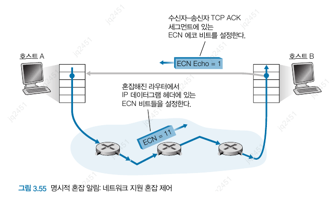
    <br>

        - 수신 데이터그램을 통해 혼잡 알림 표시를 수신하면 수신자는 TCP ACK 세그먼트의 ECE(Explicit Congestion Experienced, 명시적 혼잡 알림 비트)를 설정해 송신 호스트에게 알림
        
        - 송신자는 빠른 재전송을 사용하여 손실된 세그먼트에 반응하는 것처럼 혼잡 윈도를 절반으로 줄여 혼잡 알림 ACK에 반응하고 다음 전송되는 TCP 수신자 세그먼트 헤더에 CWR(Congestion Window Reduced) 비트를 1로 설정

    - `데이터그램 혼잡 제어 프로토콜(DCCP)`는 ECN을 활용하여 **적은 오버헤드, 혼잡 제어되는 UDP와 같은 신뢰할 수 없는 서비스** 를 제공한다.

    - ECN 기능의 배포는 점차 증가하고 있다.

- **지연 기반 혼잡 제어**

    - 패킷 **손실이 발생하기 전** 에 혼잡 시작을 사전에 감지하는 것이다.

    - `TCP 베가스(TCP Vegas)` : 모든 확인응답된 패킷에 대한 출발지에서 목적지까지의 경로의 RTT를 측정

        - 처리량이 이 값에 가까울 경우

            - 경로가 아직 정체되지 않았고, TCP 전송 속도를 증가할 수 있다.

        - 처리량이 현저히 낮을 경우

            - TCP 베가스 송신자는 전송 속도를 낮추게 된다.

        - **원칙** : 파이프를 가득 채우되 그 이상으로 채우지 않도록 해야 한다.

### 3.7.3 공평성

- 각 연결의 평균 전송률이 $R/K$에 가깝다면 혼잡 제어 메커니즘이 공평해 **링크 대역폭을 동등하게 공유한다** 고 볼 수 있다.

- TCP 연결들이 서로 다른 시점에 시작하고, 다른 윈도 크기를 갖는다면 TCP의 AIMD 알고리즘은 공평한가?

    - 양 연결은 TCP 혼잡 회피 알고리즘의 결과로서 RTT당 1 MSS씩 이들의 윈도를 증가시킨다.

    - 윈도가 증가해 손실이 발생하면 자신의 윈도를 반으로 줄이고 다시 증가 시키면서 결국 수렴하게 된다.

- 여러 연결이 공통의 병목 링크를 공유할 때, 더 작은 RTT를 갖는 세션은 대역폭이 좀 더 빠르게 비워지므로 링크에서 더 많은 가용 대역폭을 점유할 수 있고, **큰 RTT를 갖는 연결보다 더 높은 처리율을 갖는다.**

- **공평성과 UDP**

    - 멀티미디어 애플리케이션은 네트워크가 혼잡하더라도 자신의 전송률이 조절되는 것을 원하지 않는다.

        - 혼잡 시 공평한 레벨로 그들의 등급을 낮추고 어떠한 패킷도 손실하지 않기보다는 일정한 속도로 네트워크에 데이터를 계속 전송하는 것이 더 낫다고 판단한다.

    - TCP 혼잡 제어는 혼잡 증가에 대한 전송률을 감소시키므로 UDP 송신자들이 TCP 트래픽을 밀어낼 수 도 있다.

    - 오늘날 연구의 주요 분야는 **UDP 트래픽으로  인해 인터넷이 마비되는 것을 방지하는 혼잡 제어 방식** 을 개발하는 것이다.

- **공평성과 병렬 TCP 연결**

    - UDP 트래픽을 막더라도, TCP 기반 다중 병렬 연결의 사용을 막을 수 없어 공평성 문제는 해결되지 않을 것이다.

    - 만약 9개의 TCP 연결이 있고 새로운 애플리케이션이 11개의 병렬 TCP 연결을 사용한다면, 새로운 애플리케이션은 R/2보다 많은 **불공평한 할당** 을 얻는다.

## 3.8 트랜프포트 계층 기능의 발전

- TCP 타호와 리노 같은 고전적인 TCP 버전 외에도 최신 버전의 TCP가 있다.

    - **TCP 큐빅, DCTCP, CTCP, BBR 등** 이 포함된다.

    - 공통 특징 : **TCP 세그먼트 포켓을 사용하고 혼잡에 직면** 하여 서로 **공정하게 경쟁** 해야 한다는 점

- **QUIC: 빠른 UDP 인터넷 연결**

    - QUIC은 **보안 HTTP를 위한 트랜스포트 계층 서비스의 성능을 향상하기 위해 처음부터 새롭게 설계된 애플리케이션 계층 프로토콜** 이다.

    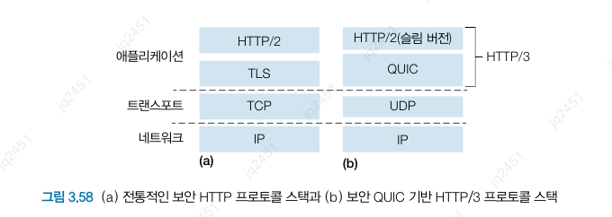
    <br>

    - **QUIC의 주요 기능**

        - `연결지향적이고 안전함` 
        
            - QUIC은 TCP처럼 **종단 간 연결지향 프로토콜** 이며 **핸드셰이크** 가 필요하다.

            - 모든 QUIC 패킷은 **암호화** 되며, 연결 상태를 설정하는 데 필요한 핸드셰이크와 인증 정보 또한 암호화된다.

            - TCP 연결을 설정한 다음 TCP 연결을 통해 TLS 연결을 설정해 **여러 RTT의 더 빠른 설정을 제공한다.**
        
        - `스트림`

            - 단일 QUIC 연결을 통해 여러 애플리케이션 레벨의 **스트림들을 다중화** 할 수 있으며, QUIC 연결이 설정되면 **새 스트림을 빠르게 추가** 할 수 있다.

            - 2개의 QUIC 종단 간에 데이터를 순서대로 안정적으로 전달하기 위한 **추상화** 이다.

                - 웹 페이지의 각 개체에 대해 다른 스트림이 있다.

                - 각 연결에는 **연결 ID가 있고 연결 내 스트림에는 스트림 ID가 있다.** 이 ID들은 QUIC 패킷 헤더에 포함된다. 

        - `신뢰적이고 TCP 친화적인 혼잡 제어 데이터 전송`

            - 각 QUIC 스트림에 대해 **독립적이고 신뢰적인 데이터 전송을 제공** 한다.

            - QUIC은 스트림별로 신뢰적이고 순서대로 전달하기 때문에 **손실된 UDP 세그먼트는 데이터가 전달된 스트림에만 영향을 준다.**

            - TCP와 유사한 확인응답 메커니즘을 사용하여 **신뢰적인 데이터 전송을 제공** 한다.

            - 혼잡 제어는 **TCP 리노 프로토콜을 약간 수정한 뉴리노** 를 기반으로 한다.

        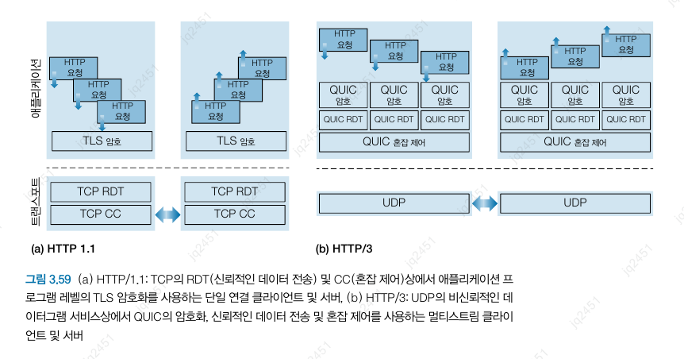
        <br>

        


    


    

    


    


    


    


    


        


        


