# 1장. 컴퓨터 네트워크와 인터넷

## 1. 인터넷이란 무엇인가?

인터넷은 두 가지 관점에서 설명할 수 있다.

- **구성요소 관점**: 인터넷을 이루는 기본적인 하드웨어와 소프트웨어를 기술하는 것
- **서비스 관점**: 분산 애플리케이션에 서비스를 제공하는 네트워킹 인프라스트럭처로 기술하는 것

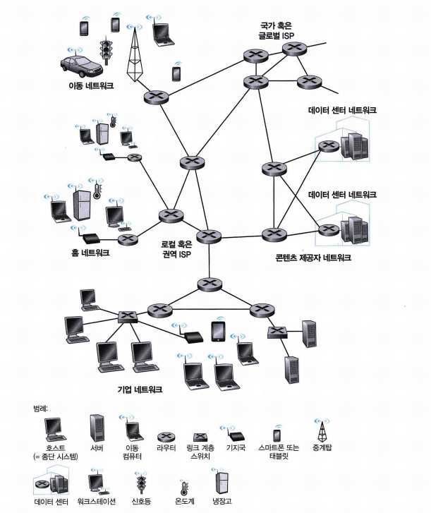

### 1) 구성요소로 본 인터넷

- 인터넷은 컴퓨팅 장치들을 연결하는 컴퓨터 네트워크다.
- 인터넷에 연결된 모든 장치를 **호스트(host)** 또는 **종단 시스템(end system)** 이라고 부른다.
- 종단 시스템은 **통신 링크(communication link)** 와 **패킷 스위치(packet switch)** 로 연결된다.
  - 링크는 동축케이블, 구리선 등 다양한 물리 매체로 구성된다.
  - 각 링크는 서로 다른 전송률로 데이터를 전송하며, 전송률의 단위는 초당 비트 수(bps)이다.

**패킷(packet)**

- 한 종단 시스템이 다른 종단 시스템으로 데이터를 보낼 때, 송신 측은 데이터를 세그먼트로 나누고 각 세그먼트에 헤더를 붙인다.
- 이렇게 만들어진 정보 묶음을 **패킷**이라고 한다.
- 패킷은 네트워크를 통해 목적지 종단 시스템으로 전달되고, 목적지에서 원래의 데이터로 다시 조립된다.

**패킷 스위치(packet switch)**

- 입력 통신 링크로 도착한 패킷을 받아 출력 통신 링크로 전달하는 장치다.
- 대표적인 패킷 스위치로 **라우터(router)** 와 **링크 계층 스위치(link-layer switch)** 가 있으며, 두 형태 모두 최종 목적지 방향으로 패킷을 전달한다.

**ISP와 프로토콜**

- 종단 시스템은 **ISP(Internet Service Provider)** 를 통해 인터넷에 접속한다. 각 ISP는 패킷 스위치와 통신 링크로 이루어진 네트워크다.
- ISP는 웹사이트나 비디오 서버 같은 콘텐츠 제공자(CP)에게도 인터넷 접속을 제공한다.
- 인터넷은 종단 시스템들을 서로 연결하는 것이므로, 종단 시스템에 접속을 제공하는 ISP들도 서로 연결되어야 한다.
- 인터넷의 정보 송수신은 여러 **프로토콜(protocol)** 로 제어된다.
  - 그중 **TCP/IP** 가 가장 중요한 프로토콜이다.
  - **IP** 는 라우터와 종단 시스템 사이에서 송수신되는 패킷의 포맷을 규정한다.
- 인터넷 표준은 **IETF** 가 개발하며, 그 표준 문서를 **RFC** 라고 한다.

### 2) 서비스 측면에서 본 인터넷

- 인터넷 애플리케이션은 웹 서핑 같은 전통적인 것뿐만 아니라 메시징, 실시간 교통 정보 지도, 음악 스트리밍 등으로 넓어졌다.
- 이러한 애플리케이션은 서로 데이터를 교환하는 여러 종단 시스템에 걸쳐 실행되기 때문에 **분산 애플리케이션(distributed application)** 이라고 부른다.
- 서로 다른 종단 시스템의 프로그램이 데이터를 주고받으려면, 인터넷은 **소켓 인터페이스(socket interface)** 를 제공한다.
  - 소켓 인터페이스는 송신 프로그램이 따라야 하는 규칙의 집합이다.
  - 인터넷은 이 규칙에 따라 데이터를 목적지 프로그램으로 전달한다.

### 3) 프로토콜이란 무엇인가

- 사람의 의사소통에 정해진 절차가 있듯, 통신하는 둘 이상의 원격 개체가 참여하는 인터넷의 모든 활동은 프로토콜이 제어한다.
  - 예를 들어 혼잡 제어 프로토콜은 송신자와 수신자 사이의 패킷 전송률을 조절한다.
- 인터넷과 일반 컴퓨터 네트워크는 이처럼 수많은 프로토콜을 이용한다.

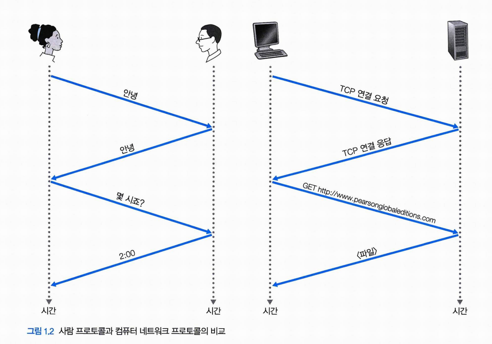

## 2. 네트워크의 가장자리

- 인터넷에 연결되는 컴퓨터와 그 밖의 장치를 **종단 시스템**이라 부른다. 인터넷의 가장자리에 위치하기 때문이다.
- 종단 시스템은 웹 브라우저, 웹 서버 같은 프로그램을 실행하므로 **호스트**라고도 부른다.
- 호스트는 **클라이언트(client)** 와 **서버(server)** 로 구분된다.

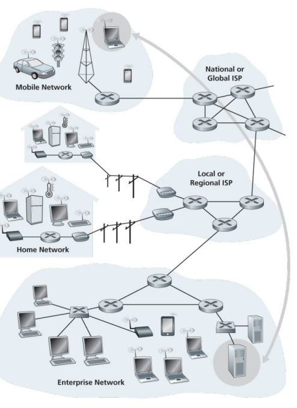

### 1) 접속 네트워크

- **접속 네트워크(access network)** 는 종단 시스템을 그 경로상의 첫 번째 라우터(가장자리 라우터)에 연결하는 네트워크다.
- **가정 접속: DSL, 케이블, FTTH, 5G 고정 무선**
- 오늘날 유럽과 미국에서 가장 널리 보급된 광대역 가정 접속 유형은 **DSL** 과 **케이블**이다.

#### 1. DSL(Digital Subscriber Line)
- 일반적으로 가정은 유선 전화 서비스를 제공하는 지역 전화 회사(텔코)로부터 DSL 접속 서비스를 받는다.
  - 따라서 DSL을 사용할 때는 고객의 텔코가 곧 ISP가 된다.

DSL의 동작 과정은 다음과 같다.

1. 각 고객의 DSL 모뎀은 기존 전화 회선을 이용해, 텔코의 지역 중앙국(CO)에 위치한 **DSLAM** 과 데이터를 교환한다.
2. 가정의 DSL 모뎀은 디지털 데이터를 받아 전화선으로 전송하기 위해 고주파 신호로 변환한다.
3. 이 아날로그 신호는 DSLAM에서 다시 디지털 포맷으로 변환된다.
4. 고객 쪽 스플리터는 가정에 도착하는 데이터 신호와 전화 신호를 분리하고, 데이터 신호를 DSL 모뎀으로 전송한다.

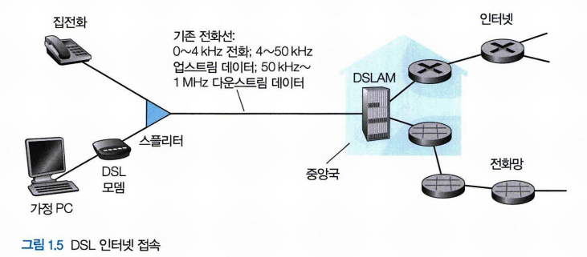

#### 2. 케이블 인터넷 접속

- 케이블 TV 회사의 기존 케이블 TV 인프라스트럭처를 이용하며, 가정은 케이블 TV 회사로부터 인터넷 접속 서비스를 받는다.
- 광케이블이 케이블 헤드엔드를 이웃 레벨 정션에 연결하고, 정션에서 개별 가정·아파트까지는 전통적인 동축케이블이 사용된다.
  - 광케이블과 동축케이블을 함께 사용하기 때문에 **HFC(Hybrid Fiber Coax)** 라고 부른다.
- 케이블 인터넷 접속에는 **케이블 모뎀**이라는 특별한 모뎀이 필요하다.
  - 보통 외장형 장치이며, 이더넷 포트를 통해 가정 PC에 연결된다.
- 케이블 헤드엔드의 **CMTS** 는 DSL 네트워크의 DSLAM과 유사한 기능을 한다.
  - 케이블 모뎀은 HFC 네트워크를 **다운스트림**과 **업스트림** 두 채널로 나눈다.
  - 접속은 비대칭이어서 다운스트림 채널에 더 빠른 전송률이 할당된다.
  - DSL과 마찬가지로 낮은 전송 속도 계약이나 매체 손실로 인해 최대 속도가 실현되지 않을 수 있다.
- 케이블 접속의 중요한 특성은 **공유 방송 매체**라는 점이다.
  - 헤드엔드가 보낸 모든 패킷은 다운스트림 채널을 통해 모든 가정으로 전달된다.
  - 각 가정이 보낸 모든 패킷은 업스트림 채널을 통해 헤드엔드로 전달된다.
  - 따라서 여러 사용자가 동시에 다운스트림 채널로 비디오 파일을 수신하면 실제 수신율은 상당히 낮아질 수 있다.

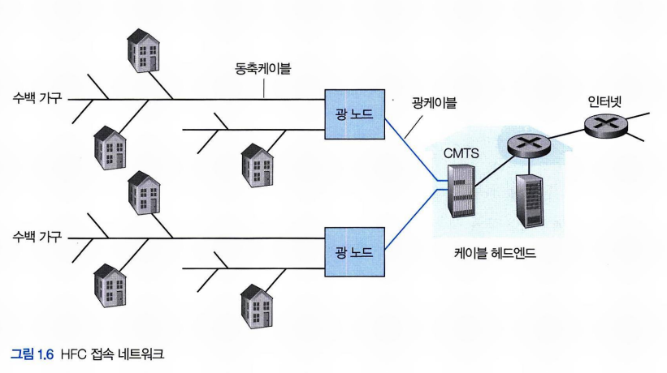

#### 3. FTTH(Fiber To The Home)

- CO로부터 가정까지 **직접 광섬유 경로**를 제공하며, 잠재적으로 Gbps급 접속 속도를 낼 수 있다.
- CO에서 가정까지 광신호를 분배하는 방식은 여러 가지가 있다.
  - **다이렉트 광섬유(direct fiber)**: 각 가정에 하나의 광섬유를 그대로 제공하는 가장 단순한 방식
  - 좀 더 일반적으로는 하나의 광섬유를 여러 가정이 공유하며, 이 분배를 수행하는 두 가지 경쟁 구조가 **AON** 과 **PON** 이다.

**PON 분배 구조 (버라이즌 FiOS 예시)**

- 각 가정은 **ONT** 를 갖고, 지정된 광섬유로 이웃 스플리터에 연결된다.
- 스플리터는 여러 가정을 하나의 공유 광섬유로 결합하여 텔코 CO에 있는 **OLT** 에 연결한다.
- OLT는 광신호와 전기신호 간 변환을 담당하며, 텔코 라우터를 통해 인터넷에 연결된다.
- 가정에서는 홈 라우터를 ONT에 연결하고, 이 홈 라우터를 통해 인터넷에 접속한다.
- OLT에서 스플리터로 송신된 모든 패킷은 스플리터에서 복제되어 각 가정으로 전달된다.

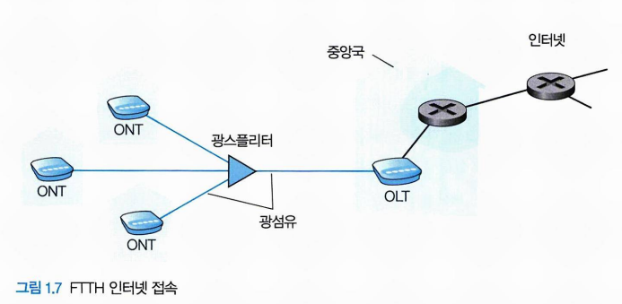

#### 4. 5G 고정 무선(5G Fixed Wireless)

- DSL, 케이블, FTTH 외에 **5G 고정 무선 기술(5G-FW)** 도 구축되고 있다.
- 빔포밍 기술을 이용해 서비스 제공자의 기지국에서 가정 내 모뎀으로 데이터를 무선으로 전송한다.
- 케이블이나 DSL에서 와이파이 무선 라우터가 모뎀에 연결되듯, 5G-FW에서도 와이파이 무선 라우터가 모뎀에 연결된다.

#### 5. 기업(및 가정) 접속: 이더넷과 와이파이

- 기업, 대학 캠퍼스, 그리고 점차 가정 환경에서도 **LAN** 을 이용해 종단 시스템을 가장자리 라우터에 연결한다.
- 여러 LAN 기술 중 **이더넷**이 가장 널리 쓰인다.
  - 이더넷은 꼬임쌍선을 이용해 종단 시스템을 이더넷 스위치에 연결한다.
  - 이더넷 스위치(또는 상호 연결된 스위치들의 네트워크)는 다시 더 큰 인터넷으로 연결된다.
- 최근에는 랩톱, 스마트폰 등 다양한 기기에서 무선으로 인터넷에 접속하는 경우가 늘고 있다.
  - 무선 랜에서 사용자는 유선 네트워크에 연결된 **AP(Access Point)** 와 패킷을 주고받는다.
  - 무선 랜 사용자는 일반적으로 AP로부터 수십 미터 반경 내에 있어야 한다.
  - 이 무선 랜 기술이 **와이파이(IEEE 802.11)** 이며, 오늘날 거의 모든 곳에 존재한다.

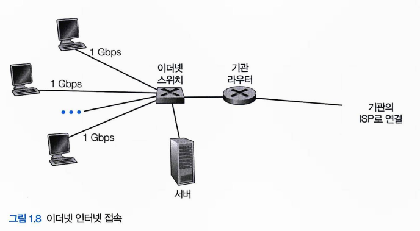

#### 6. 광역 무선 접속: 3G, LTE 4G, 5G

- 스마트폰 같은 장치는 이동 전화망 사업자가 운영하는 기지국을 통해 패킷을 송수신하며, 이동 전화망과 동일한 무선 인프라스트럭처를 이용한다.
- 와이파이와 달리 기지국의 수십 킬로미터 반경 내에만 있으면 접속할 수 있다.

### 2. 물리 매체

- 물리 매체는 앞서 살펴본 네트워크 접속 기술의 바탕이 된다.
  - HFC는 광섬유와 동축케이블을 함께 사용하고, DSL과 이더넷은 구리선을 사용하며, 이동 접속 네트워크는 라디오 스펙트럼을 이용한다.

**비트는 어떻게 전달되는가**

- 한 비트가 출발지 종단 시스템에서 여러 링크와 라우터를 거쳐 목적지 종단 시스템으로 전달되는 과정을 생각해 보자.
  - 이 비트는 여러 라우터를 거치며 여러 번에 걸쳐 전송된다.
  - 출발지가 비트를 전송하면 다음 라우터가 그 비트를 수신하고, 이 과정이 반복된다.
  - 따라서 비트는 출발지에서 목적지까지 일련의 **송신기-수신기 쌍**을 거친다.
  - 각 송신기-수신기 쌍에서 비트는 물리 매체상의 전자파나 광 펄스로 전파되어 전송된다.
  - 물리 매체는 여러 형태이며, 경로상의 각 쌍이 반드시 같은 유형일 필요는 없다.

**유도 매체와 비유도 매체**

- 물리 매체는 크게 유도 매체와 비유도 매체로 나뉜다.
  - **유도 매체**: 광섬유, 꼬임쌍선, 동축케이블처럼 견고한 매체를 따라 파형을 유도한다.
  - **비유도 매체**: 무선 랜이나 디지털 위성 채널처럼 대기와 야외 공간으로 파형을 전파한다.
- 물리 매체의 실제 매체 비용은 다른 네트워킹 비용에 비해 상대적으로 매우 적다.
  - 오히려 매체 설치에 드는 인건비가 매체 자체 비용보다 훨씬 크다.
  - 그래서 처음에 여유 있게 선을 포설해 두면, 나중에 추가로 포설하지 않아도 되어 경비를 절약할 수 있다.

**한눈에 보는 물리 매체**

| 매체 | 유형 | 대표 용도 | 특징 |
|---|---|---|---|
| 꼬임쌍선 | 유도 | 전화선, LAN | 가장 싸고 흔함, 10Mbps~10Gbps |
| 동축케이블 | 유도 | 케이블 TV/인터넷 | 꼬임쌍선보다 고속, 공유 매체로 사용 가능 |
| 광섬유 | 유도 | 인터넷 백본, 해저 링크 | 초고속(10~100Gbps), 감쇠·간섭에 강함, 고가 |
| 지상 라디오 | 비유도 | 무선 랜, 셀룰러 | 선로 불필요·이동성, 전파 환경에 민감 |
| 위성 라디오 | 비유도 | 광역·오지 통신 | 넓은 커버리지, 정지 궤도는 지연 큼(~280ms) |

아래에서 각 매체를 하나씩 살펴본다.

#### 1. 꼬임쌍선

- 가장 싸고 가장 널리 쓰이는 전송 매체로, 전화기에서 전화국 스위치까지의 유선 연결 중 99%가 꼬임쌍선이다.
- 이웃한 쌍들 간의 전기 간섭을 줄이기 위해 두 선이 서로 꼬여 있으며, 한 쌍의 선이 하나의 통신 링크를 구성한다.
  - 보통 여러 쌍이 보호물에 싸여 하나의 케이블 안에 함께 묶인다.
  - **UTP(Unshielded Twisted Pair)** 는 빌딩 내 네트워크, 즉 LAN에서 가장 많이 쓰이며, 전송률은 10Mbps ~ 10Gbps에 이른다.
- 광섬유가 등장한 뒤에도 꼬임쌍선은 고속 LAN 네트워킹의 주요 솔루션으로 자리 잡았다.

#### 2. 동축케이블

- 두 개의 구리선이 평행이 아니라 **동심원 형태**로 배치되어 있다.
- 이 구조와 특수 절연·차폐 덕분에 꼬임쌍선보다 더 높은 전송률을 얻을 수 있다.
- 케이블 TV 시스템에 흔히 쓰이며, 수십 Mbps의 인터넷 접속을 제공하도록 케이블 모뎀과 연결된다.
  - 송신기는 디지털 신호를 특정 주파수 대역으로 옮기고, 이 아날로그 신호는 송신기에서 하나 이상의 수신기로 전송된다.
- 동축케이블은 **유도 공유 매체**로도 쓸 수 있다.
  - 여러 종단 시스템이 케이블에 직접 연결될 수 있고, 각 종단 시스템은 다른 종단 시스템이 전송하는 모든 것을 수신한다.

#### 3. 광섬유

- 비트를 나타내는 빛의 파동을 전달하는 가늘고 유연한 매체로, 단일 광섬유가 초당 10~100Gbps의 속도를 지원한다.
- 전자기 간섭에 영향을 받지 않고, 100km까지 신호 감쇠가 매우 적으며, 도청(태핑)이 어렵다.
- 이런 특성 덕분에 광역 유도 전송 매체로 널리 쓰이며, 특히 해저 링크와 인터넷 백본에 많이 보급되어 있다.
- 다만 고가이므로 LAN이나 가정 같은 근거리 전송에는 이용하기 어렵다.

#### 4. 지상 라디오 채널

- 전자기 스펙트럼으로 신호를 전달한다.
- 물리 선로가 필요 없고, 벽을 관통할 수 있으며, 이동 사용자에게 연결성을 제공하고 먼 거리까지 신호를 보낼 수 있어 매력적인 매체다.
- 다만 라디오 채널의 특성은 전파 환경과 전달 거리에 크게 좌우된다.
  - 주변 환경이 경로 손실, 섀도 페이딩, 다중경로 페이딩, 간섭을 결정한다.
- 무선 랜 기술은 로컬 라디오 채널을, 셀룰러 접속 기술은 광역 라디오 채널을 사용한다.

#### 5. 위성 라디오 채널

- 통신 위성은 **지상 스테이션**이라 불리는 둘 이상의 지상 기반 마이크로파 송수신기를 연결한다.
- 위성은 한 주파수 대역으로 신호를 수신하고, 리피터로 그 신호를 재생한 뒤 다른 주파수 대역으로 전송한다.
- 초당 기가비트급 전송률을 제공할 수 있다.
- 통신에는 두 종류의 위성이 이용된다.
  - **정지 궤도 위성**: 지상 스테이션 → 위성 → 지상 스테이션에 이르는 먼 거리 때문에 약 280ms의 긴 전파 지연이 발생한다.
  - **저궤도 위성**: 지연은 작지만, 지속적인 서비스를 위해서는 많은 위성이 궤도에 떠 있어야 한다.

## 3. 네트워크 코어

### 1. 패킷 교환

- 네트워크 애플리케이션에서 종단 시스템들은 서로 **메시지**를 교환한다.
  - 메시지는 제어 기능이나 전자메일, JPEG 이미지, MP3 오디오 파일 같은 데이터를 담는다.
- 송신 시스템은 긴 메시지를 **패킷(packet)** 이라는 작은 데이터 덩어리로 분할해 전송한다.
- 각 패킷은 송신 측과 수신 측 사이에서 통신 링크와 패킷 스위치(라우터, 링크 계층 스위치)를 거친다.
- 패킷은 링크의 최대 전송률과 같은 속도로 전송된다.
  - 링크 전송률이 R비트/초일 때 L비트의 패킷을 전송하는 데 걸리는 시간은 **L/R** 이다.

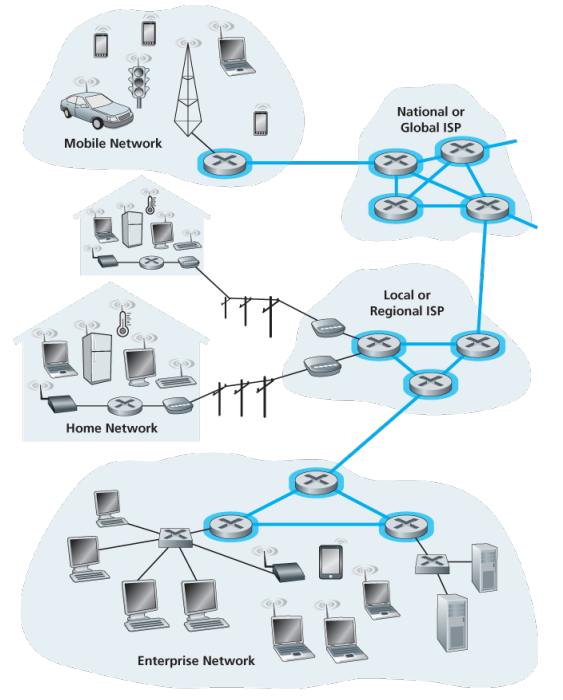

#### 1. 저장 후 전달(Store-and-Forward)

- 대부분의 패킷 스위치는 **저장 후 전달** 방식을 사용한다.
- 저장 후 전달이란, 스위치가 패킷의 첫 비트를 출력 링크로 내보내기 전에 **패킷 전체**를 먼저 받아야 한다는 뜻이다.
- 예를 들어 출발지가 각각 L비트로 이루어진 3개의 패킷을 목적지로 보낸다고 하자.
  - 패킷 1의 앞부분이 라우터에 도착했더라도 곧바로 전송할 수는 없다.
  - 라우터는 패킷의 모든 비트를 수신해 저장한 뒤에야 출력 링크로 그 패킷을 전송한다.
- 전송률이 모두 R인 N개의 링크로 이루어진 경로에서 하나의 패킷을 보낼 때 걸리는 지연은 **d = N × L/R** 이다.

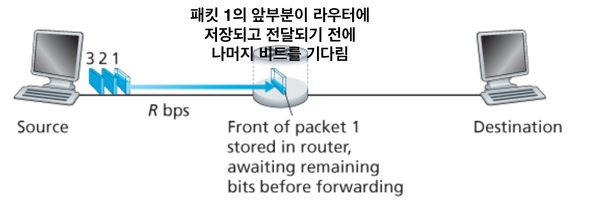

#### 2. 큐잉 지연과 패킷 손실

- 각 패킷 스위치는 접속된 각 링크마다 **출력 버퍼**를 갖고, 그 링크로 내보낼 패킷을 저장한다.
- 도착한 패킷이 나가야 할 링크가 이미 다른 패킷을 전송 중이라면, 그 패킷은 출력 버퍼에서 대기해야 한다.
  - 따라서 저장 후 전달 지연에 더해 **큐잉 지연**이 발생한다.
- 버퍼 공간은 유한하므로, 버퍼가 대기 중인 패킷으로 꽉 차 있으면 도착한 패킷을 담을 수 없다.
  - 이 경우 **패킷 손실**이 발생한다.
- 예를 들어 호스트 A와 B가 라우터를 거쳐 호스트 E로 패킷을 보낸다고 하자.
  - 라우터는 이 패킷들을 15Mbps 이더넷 링크로 전달한다.
  - 짧은 시간 동안 라우터에 도착하는 패킷의 전송률이 15Mbps를 초과하면 혼잡이 발생하고, 패킷은 링크로 나가기 전에 출력 버퍼에서 큐잉된다.
  - A와 B가 동시에 5개씩 연속으로 패킷을 보내면 대부분의 패킷은 큐에서 대기하는 데 시간을 쓰게 된다.

#### 3. 포워딩 테이블과 라우팅 프로토콜

- 라우터는 한 통신 링크로 도착한 패킷을 받아 다른 링크로 전달한다. 그렇다면 **어느 링크로 보낼지**는 어떻게 결정할까?
- 인터넷에서는 다음과 같이 동작한다.
  - 모든 종단 시스템은 **IP 주소**를 가지며, 패킷 헤더에 목적지의 IP 주소가 담긴다.
  - 각 라우터는 목적지 주소를 출력 링크로 매핑하는 **포워딩 테이블(forwarding table)** 을 갖는다.
  - 패킷이 도착하면 라우터는 목적지 주소로 포워딩 테이블을 검색해 알맞은 출력 링크로 패킷을 내보낸다.
- 이 종단 간 라우팅 과정은, 지도를 보는 대신 가는 곳마다 길을 물어보는 운전자에 비유할 수 있다.
- 그렇다면 포워딩 테이블은 어떻게 설정될까?
  - 인터넷에는 여러 **라우팅 프로토콜**이 있다.
  - 라우팅 프로토콜은 각 라우터에서 각 목적지까지의 최단 경로를 계산하고, 그 결과로 포워딩 테이블을 설정한다.

### 2. 회선 교환

- 링크와 스위치의 네트워크로 데이터를 이동시키는 방식에는 **회선 교환**과 **패킷 교환**이 있다.
  - **회선 교환**: 통신 세션 동안 경로상에 필요한 자원(버퍼, 링크 전송률)을 미리 확보·예약한다.
  - **패킷 교환**: 자원을 예약하지 않고, 세션 메시지가 필요할 때(온디맨드) 자원을 요청해 사용한다. 그래서 링크 접속을 위해 대기할 수도 있다.
- 회선 교환의 대표적인 예는 전통적인 **전화망**이다.
  - 정보를 보내기 전에, 네트워크는 송신자와 수신자 사이의 연결을 먼저 설정해야 한다.
  - 이때 경로상의 스위치들은 연결 상태를 유지하며, 전기통신 용어로 이 연결을 **회선(circuit)** 이라고 부른다.
- 네트워크는 회선을 설정할 때 그 연결에 일정한 전송률을 예약한다.
  - 전송률이 예약되므로 송신자는 수신자에게 **보장된 일정 전송률**로 데이터를 보낼 수 있다.

**예시**

- 아래 그림은 4개의 회선 스위치와 링크로 연결된 회선 교환 네트워크이며, 각 호스트는 스위치 중 하나에 직접 연결된다.
- 두 호스트가 통신하려 할 때 네트워크는 둘 사이에 지정된 종단 간 연결을 설정한다.
  - 각 링크가 1Mbps이고 이를 4개 회선으로 나눈다면, 각 연결은 250kbps를 얻는다.
- 반면 패킷 교환은 자원을 예약하지 않고 곧바로 네트워크로 패킷을 보낸다.
  - 이때 링크가 혼잡하면 송신 쪽 버퍼에서 대기해야 하므로 지연이 발생하고, 일정 시간 내 전달을 보장하지 않는다.

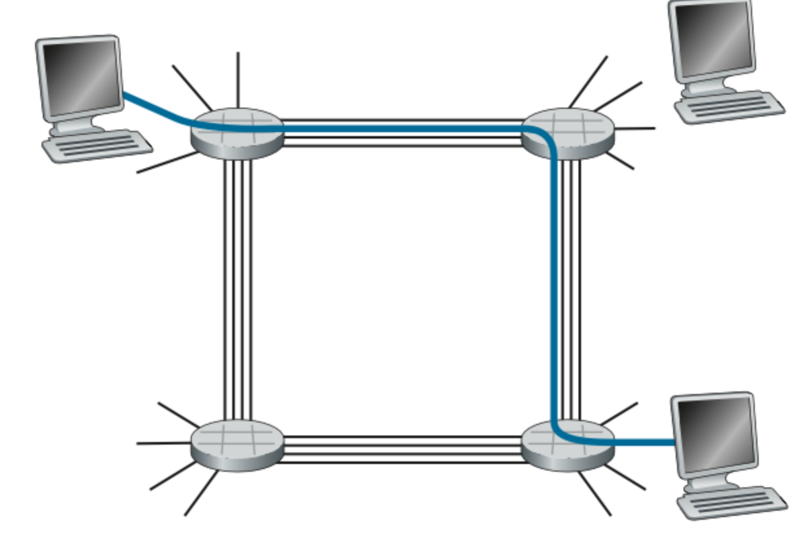

#### 3. 회선 교환 네트워크에서의 다중화

회선 교환 링크에서 하나의 회선은 두 가지 방식으로 여러 연결이 나눠 쓴다. **주파수를 쪼개면 FDM, 시간을 쪼개면 TDM** 이라고 기억하면 쉽다.

| 구분 | FDM (주파수 분할) | TDM (시분할) |
|---|---|---|
| 나누는 기준 | 주파수 스펙트럼 | 시간 |
| 각 연결이 받는 것 | 고정된 주파수 대역 | 프레임마다 시간 슬롯 1개 |
| 비유 | 여러 채널이 각자 다른 주파수를 계속 점유 | 모두 같은 대역을 시간을 번갈아 사용 |
| 예시 | 전화망(대역 4kHz), FM 라디오(88~108MHz) | 초당 8,000프레임 × 8비트 슬롯 = 64kbps |

- **대역폭(bandwidth)**: FDM에서 각 연결에 할당되는 주파수 대역의 폭. 전화망에서는 보통 4kHz다.
- **TDM 전송률 공식**: (한 슬롯의 비트 수) × (프레임 전송률). 위 그림처럼 4개 회선을 지원하는 링크라면 FDM은 주파수를 4개 대역으로, TDM은 프레임을 4개 슬롯으로 나눈다.

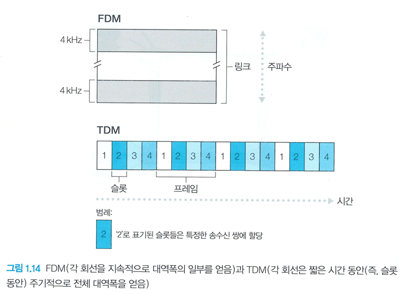

**회선 교환의 낭비 문제**

회선 교환은 연결이 유지되는 동안 자원을 통째로 예약해 둔다. 그래서 통화 중 말을 멈춰 회선이 놀더라도, 예약된 자원을 다른 곳에서 쓸 수 없다. 패킷 교환 옹호자들이 "회선 교환은 낭비"라고 지적하는 지점이 바로 이것이다.

**전송 시간 예시**

회선 교환으로 호스트 A → B에 640,000비트 파일을 보낸다고 하자. 모든 링크가 24슬롯 TDM(총 1.536Mbps)이라고 가정하면 계산은 다음과 같다.

- 각 회선의 전송률 = 1.536Mbps ÷ 24 = **64kbps**
- 파일 전송 시간 = 640,000비트 ÷ 64kbps = **10초** (+ 회선 설정 0.5초)

> 전송 시간은 링크 수와 무관하다. 회선이 1개를 지나든 100개를 지나든 똑같이 10초다.

#### 4. 패킷 교환 대 회선 교환

| 구분 | 회선 교환 | 패킷 교환 |
|---|---|---|
| 자원 예약 | 세션 동안 미리 예약 | 예약 없이 온디맨드 사용 |
| 전송률 | 일정하게 보장 | 혼잡 시 지연, 보장 없음 |
| 효율성 | 놀고 있는 회선은 낭비 | 용량 공유로 더 효율적 |
| 수용 인원 | 적음 | 비슷한 지연으로 약 3배 이상 |
| 약점 | 낮은 자원 활용률 | 예측 불가능한 종단 간 지연 |

- **회선 교환 옹호론**: 패킷 교환은 지연이 가변적이고 예측 불가능해 실시간 서비스에 부적합하다.
- **패킷 교환 옹호론**: 전송 용량을 더 효율적으로 공유하고, 구현이 간단하며 비용도 적게 든다.
- 두 방식 모두 쓰이지만 추세는 **패킷 교환**으로 옮겨가고 있으며, 전화망에서도 비싼 해외 통화 구간은 패킷 교환을 이용한다.

### 3. 네트워크의 네트워크

- 접속 ISP는 반드시 텔코나 케이블 회사일 필요는 없으며, 대학이나 회사도 접속 ISP가 될 수 있다.
- 종단 사용자와 콘텐츠 제공자를 접속 ISP에 연결하는 것은 퍼즐의 일부일 뿐이다. 퍼즐을 완성하려면 이 **접속 ISP들이 서로 연결**되어야 하며, 그 결과가 바로 **네트워크의 네트워크**다.

인터넷 구조는 아래처럼 단계적으로 발전해 왔다. 각 단계는 앞 단계 위에 새 개념을 **누적**한다.

| 단계 | 새로 더해지는 것 | 핵심 |
|---|---|---|
| 그물망 | (출발점) | 모든 ISP를 직접 연결 → 링크가 너무 많아 비현실적 |
| 구조 1 | 글로벌 통과 ISP | 모든 접속 ISP를 하나의 글로벌 ISP에 연결 |
| 구조 2 | 다중 글로벌 ISP | 여러 글로벌 ISP가 경쟁·상호 연결 (2계층) |
| 구조 3 | 지역 ISP + 1계층 ISP | 지역별 계층이 생긴 다중 계층 구조 |
| 구조 4 | PoP·멀티홈·피어링·IXP | 연결 지점과 우회 경로를 추가 |
| 구조 5 | 콘텐츠 제공자 네트워크 | 구글 등 사설망이 상위 계층을 우회 (오늘날 인터넷) |

**그물망(mesh) 방식의 한계**

- 가장 단순한 방법은 각 접속 ISP를 다른 모든 접속 ISP와 직접 연결하는 것이다.
- 하지만 이 그물망 설계는 각 접속 ISP가 전 세계의 다른 ISP들과 수십만 개의 개별 링크를 유지해야 하므로 비용이 너무 크다.

**구조 1: 글로벌 통과 ISP**

- 모든 접속 ISP를 하나의 **글로벌 통과 ISP** 에 연결하는 방식이다.
- 글로벌 ISP는 전 세계에 걸친 라우터와 통신 링크의 네트워크로, 각 접속 ISP 가까이에 라우터를 둔다.
- 접속 ISP는 글로벌 ISP에 요금을 지불하므로 **고객**이고, 글로벌 ISP는 **제공자**다. 요금은 교환하는 트래픽 양을 반영한다.

**구조 2: 다중 글로벌 ISP (2계층)**

- 하나의 글로벌 ISP가 수익을 내면 다른 회사들이 경쟁적으로 글로벌 ISP를 구축하는 것이 자연스럽다.
- 이렇게 여러 글로벌 ISP가 생기면, 서로 통신할 수 있도록 **글로벌 ISP들끼리도 연결**되어야 한다.
- 상위층에 글로벌 통과 제공자, 하위층에 접속 ISP가 있는 2계층 구조다.

**구조 3: 지역 ISP와 1계층 ISP (다중 계층)**

- 전 세계 모든 도시에 존재하는 ISP는 없다. 대신 각 지역에는 그 지역의 접속 ISP들을 묶는 **지역 ISP** 가 있다.
- 각 지역 ISP는 글로벌 ISP에 해당하는 **1계층(Tier-1) ISP** 와 연결된다.
  - 1계층 ISP는 대략 12개 정도이며, 레벨3 커뮤니케이션즈, AT&T 등이 포함된다.
- 요금은 계층을 따라 위로 지불된다.
  - 접속 ISP → 지역 ISP에 요금 지불
  - 지역 ISP → 1계층 ISP에 요금 지불
  - **1계층 ISP는 누구에게도 요금을 지불하지 않는다.**
- 지역 안에 다시 여러 계층이 생길 수도 있다. 예를 들어 중국에서는 도시별 접속 ISP → 지방 ISP → 국가 ISP → 1계층 ISP 순으로 연결된다.

**구조 4: PoP, 멀티홈, 피어링, IXP**

오늘날 인터넷에 더 가까워지려면 구조 3에 다음 요소들을 더해야 한다.

- **PoP(Point of Presence)**: 제공자 네트워크 안의 라우터 그룹으로, 고객 ISP가 제공자 ISP에 연결되는 지점이다. 최하위 계층을 제외한 모든 계층에 존재한다.
  - 고객은 자신의 라우터를 PoP의 라우터에 직접 연결하기 위해, 제3자 통신 사업자로부터 고속 링크를 임대할 수 있다.
- **멀티홈(multi-homing)**: 하나의 ISP가 둘 이상의 제공자 ISP에 연결하는 것이다. 예를 들어 한 접속 ISP가 두 개의 지역 ISP에 연결할 수 있다.
- **피어링(peering)**: 같은 계층의 가까운 ISP들이 서로 직접 연결해, 트래픽을 상위 계층 ISP를 거치지 않고 주고받는 것이다. 비용을 줄일 수 있으며, 1계층 ISP끼리도 피어링할 수 있다.
- **IXP(Internet Exchange Point)**: 여러 ISP가 함께 피어링할 수 있는 만남의 장소로, 제3의 회사가 구축한다. 현재 인터넷에는 600개 이상의 IXP가 있다.

**구조 5: 콘텐츠 제공자 네트워크**

- 구조 4 위에 **콘텐츠 제공자 네트워크**를 추가한 형태로, 구글이 대표적인 예다.
- 구글의 데이터 센터들은 IXP 안에 위치하며, 모두 구글 **사설 TCP/IP 네트워크**로 연결되어 있다.
  - 이 사설 네트워크는 구글 서버로 오가는 트래픽만 전달한다.
- 구글은 하위 계층 ISP들과 피어링함으로써 인터넷 상위 계층을 우회한다.
  - 다만 여전히 1계층 네트워크를 통해서만 도달할 수 있는 접속 ISP가 많아, 그 부분에는 요금을 지불한다.

**요약**

- 오늘날의 인터넷은 약 12개의 1계층 ISP와 수십만 개의 하위 계층 ISP로 이루어진 복잡한 구조다.
- ISP마다 서비스 영역이 다양하며, 여러 대륙과 대양에 걸쳐 서비스하는 곳도 있다.
- 하위 계층 ISP는 상위 계층 ISP와 연결되고, 상위 계층 ISP들은 서로 연결된다.
- 사용자와 콘텐츠 제공자는 하위 계층 ISP의 고객이고, 하위 계층 ISP는 상위 계층 ISP의 고객이다.

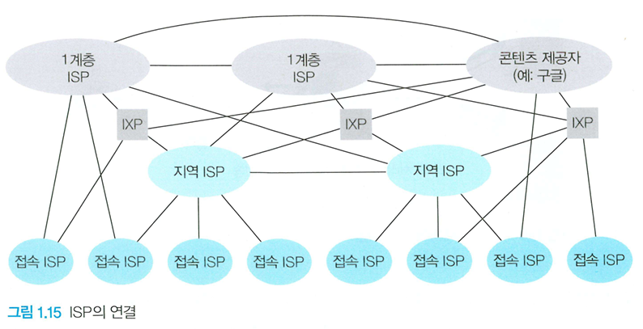