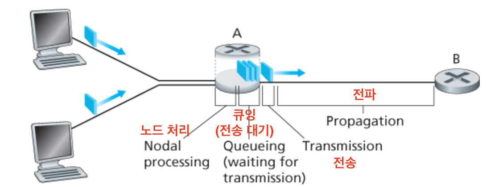
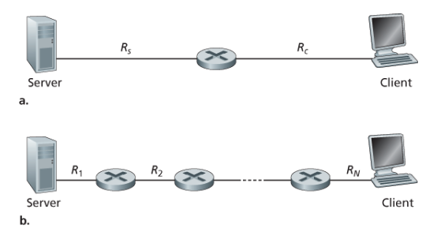
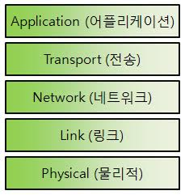
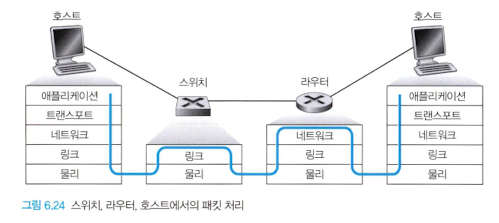
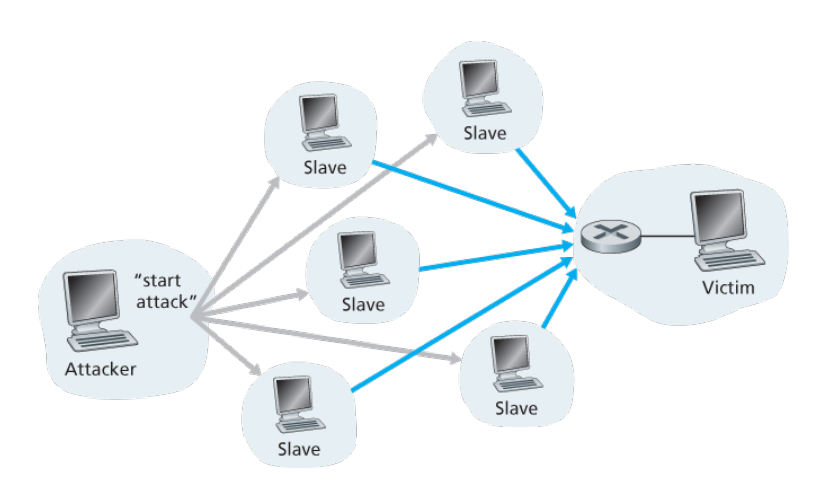

## 4. 패킷 교환 네트워크에서의 지연, 손실과 처리율

컴퓨터 네트워크는 이상적으로라면 원하는 만큼 빠르고 손실 없이 데이터를 전달해야 하지만, 현실의 물리 법칙은 그것을 허용하지 않는다. 네트워크는 **처리율을 제한**하고, **지연을 만들며**, 실제로 **패킷을 잃어버리기도** 한다.

### 1. 패킷 교환 네트워크에서의 지연 개요

패킷은 호스트에서 출발해 여러 라우터를 거쳐 다른 호스트에 도착한다. 이때 패킷은 경로상의 **각 노드마다** 여러 종류의 지연을 겪고, 이 지연들이 쌓여 전체 **노드 지연**이 된다. 많은 인터넷 애플리케이션이 이 지연에 크게 영향을 받는다.

#### 1. 패킷이 라우터를 통과하는 과정

지연이 어디서 생기는지 보려면, 패킷 하나가 라우터 A를 거쳐 라우터 B로 가는 상황을 따라가 보면 된다. 라우터 A는 B로 향하는 출력 링크를 하나 갖고 있고, 그 링크 앞에는 **큐(버퍼)** 가 있다.

1. 패킷이 업스트림 노드에서 라우터 A에 도착한다.
2. 라우터 A는 패킷 헤더를 조사해 어느 출력 링크로 보낼지 결정한다.
3. 링크가 비어 있고 큐에 앞선 패킷도 없으면 즉시 전송한다.
4. 링크가 이미 사용 중이거나 대기 중인 패킷이 있으면 **큐에 들어가 기다린다**.

이 과정에서 생기는 지연이 아래 네 가지다.

**한눈에 보는 4가지 지연**

| 지연 | 언제 생기나 | 공식 | 크기를 결정하는 것 |
|---|---|---|---|
| 처리 지연 (dproc) | 헤더를 조사하고 보낼 링크를 결정할 때 | — | 라우터의 처리 속도 (보통 마이크로초 이하) |
| 큐잉 지연 (dqueue) | 큐에서 전송 순서를 기다릴 때 | — | 앞에 대기 중인 패킷 수 (**패킷마다 다름**) |
| 전송 지연 (dtrans) | 패킷의 모든 비트를 링크로 밀어낼 때 | L / R | 패킷 길이와 링크 전송률 |
| 전파 지연 (dprop) | 비트가 링크를 타고 다음 라우터까지 갈 때 | d / s | 링크의 물리적 길이와 전파 속도 |

> L = 패킷 길이(비트), R = 링크 전송률(bps), d = 링크 길이(m), s = 전파 속도(m/s)

#### 2. 처리 지연

패킷 헤더를 조사해 어디로 보낼지 결정하는 시간이다. 여기에는 업스트림 노드에서 전송되는 동안 생긴 **비트 레벨 오류를 검사하는 시간** 도 포함된다. 이 처리가 끝나면 라우터는 패킷을 출력 링크 앞의 큐로 보낸다.

#### 3. 큐잉 지연

패킷이 큐에서 자기 차례를 기다리며 겪는 지연이다. 길이는 **앞에 몇 개의 패킷이 대기 중인지**로 결정된다. 트래픽이 많아 대기 패킷이 쌓이면 큐잉 지연은 매우 길어지고, 큐가 비어 있으면 0이다. 네 가지 지연 중 **패킷마다 편차가 가장 큰** 지연이다.

#### 4. 전송 지연

패킷은 선입선출(FIFO) 방식으로 전송되므로, 앞선 패킷이 모두 나간 뒤에 자기 차례가 온다. 자기 차례가 되면 패킷의 **모든 비트를 링크로 밀어내는 데** 걸리는 시간이 전송 지연이다.

- **dtrans = L / R**
- 예: 1,000비트 패킷을 10Mbps 링크로 보내면 1,000 ÷ 10,000,000 = **0.1ms**

#### 5. 전파 지연

비트가 링크에 실리면 라우터 B까지 물리적으로 **이동**해야 한다. 링크의 처음부터 라우터 B까지 도달하는 데 걸리는 시간이 전파 지연이다.

- **dprop = d / s**
- 전파 속도 s는 물리 매체에 따라 다르며, 대체로 **2×108 ~ 3×108 m/s** (빛의 속도에 근접)
- 비트가 B에 도착하면 앞선 비트들과 함께 라우터 B에 저장되고, B에서 다시 같은 과정이 반복된다

#### 6. 전송 지연과 전파 지연 비교

두 지연은 이름이 비슷하지만 **완전히 다른 것**이다. 헷갈리기 쉬우니 확실히 구분해 두는 게 좋다.

| 구분 | 전송 지연 | 전파 지연 |
|---|---|---|
| 무엇에 걸리는 시간인가 | 라우터가 패킷을 링크로 **내보내는** 시간 | 비트가 링크를 **건너가는** 시간 |
| 공식 | L / R | d / s |
| 무엇에 의존하나 | 패킷 길이 L, 전송률 R | 링크 길이 d, 전파 속도 s |
| 무엇과 무관한가 | 두 라우터 사이의 **거리** | 패킷의 **길이**와 링크의 **전송률** |

고속도로 요금소에 빗대면 감이 잡힌다. 고속도로 구간이 링크, 요금소가 라우터, 자동차 10대로 이루어진 행렬이 패킷, 자동차 한 대가 비트에 해당한다. 자동차가 시속 100km로 도로를 달리는 것이 **전파**이고, 요금소가 자동차 한 대를 통과시키는 데 12초가 걸리는 것이 **전송**이다(10대면 120초). 그리고 요금소가 10대를 모두 내보내야 행렬 전체가 다음 구간으로 출발하는 것이 바로 **저장 후 전달(store-and-forward)** 이다.

> 요금소가 자동차를 내보내는 속도(전송)와 자동차가 도로를 달리는 속도(전파)는 서로 아무 상관이 없다. 전송 지연과 전파 지연의 관계도 똑같다.

### 2. 큐잉 지연과 패킷 손실

큐잉 지연은 다른 세 지연과 달리 **패킷마다 값이 달라진다**. 예를 들어 비어 있는 큐에 10개의 패킷이 동시에 도착하면, 첫 패킷은 지연 없이 바로 나가지만 마지막 패킷은 앞선 9개가 모두 나갈 때까지 기다려야 한다.

그래서 큐잉 지연은 하나의 값으로 말하지 않고 **평균 큐잉 지연**, **분산**, **특정 값을 넘을 확률** 같은 통계로 묘사한다.

#### 1. 트래픽 강도 (La / R)

큐잉 지연의 크기는 결국 **얼마나 들어오는지 대비 얼마나 내보낼 수 있는지**로 정해진다. 이를 좌우하는 요소는 다음과 같다.

| 요소 | 기호 | 의미 |
|---|---|---|
| 도착률 | a | 트래픽이 큐에 도착하는 비율 |
| 전송률 | R | 링크가 비트를 내보내는 속도 |
| 패킷 길이 | L | 패킷 하나의 비트 수 |
| 도착 패턴 | — | 일정한 간격인지, **버스트하게** 몰려서 오는지 |

이 값들을 하나로 묶은 지표가 **트래픽 강도 = La / R** 이다. 큐잉 지연의 규모를 한눈에 가늠하는 핵심 지표다.

| 트래픽 강도 | 상황 | 큐잉 지연 |
|---|---|---|
| 0에 가까움 | 패킷이 드물게, 간격을 두고 도착 | 거의 0 (큐에서 다른 패킷을 만나지 않음) |
| 1에 가까움 | 도착량이 전송 용량에 근접 | 급격히 증가 |
| 1보다 큼 | 도착량이 전송 용량을 **초과** | 큐가 무한히 늘어남 |

> 트래픽 공학의 대원칙: **트래픽 강도가 1을 넘지 않도록 시스템을 설계하라.**

#### 2. 패킷 손실

현실의 큐는 스위치 설계와 비용의 제약을 받아 **유한한 용량**을 갖는다. 따라서 트래픽 강도가 1에 가까워져도 큐잉 지연이 무한히 커지지는 않는다. 대신 다른 일이 벌어진다.

- 큐가 가득 찬 상태에서 패킷이 도착하면 라우터는 그 패킷을 **버린다**
- 즉, 패킷을 **잃어버린다(loss)**
- 손실 패킷의 비율은 트래픽 강도가 클수록 증가한다

> 종단 시스템 입장에서 보면, 패킷은 네트워크 코어로 들어간 뒤 그냥 사라진 것처럼 보인다. 그래서 성능은 지연만이 아니라 **손실 확률**로도 측정해야 한다.

### 3. 종단 간 지연

지금까지는 **라우터 하나**에서의 지연을 봤다. 이제 출발지에서 목적지까지의 전체 지연을 생각해 보자.

출발지 호스트와 목적지 호스트 사이에 N-1개의 라우터가 있고, 모든 링크의 전송률이 R이며 각 노드의 처리 지연이 dproc으로 같다고 가정하면 (네트워크에 혼잡이 없어 큐잉 지연은 무시):

> **d종단 간 = N × (dproc + L/R + dprop)**

N개의 링크를 지나므로, 한 노드에서 겪는 지연에 **N을 곱하면** 된다.

#### 1. 종단 시스템, 애플리케이션 그리고 그 밖의 지연

위 네 가지 말고도 실제로는 다른 지연이 더 있다.

- **매체 접속 지연**: 공유 매체(예: 와이파이)로 보낼 때, 다른 종단 시스템과 매체를 나눠 쓰기 위해 프로토콜이 **의도적으로 전송을 늦추는** 시간
- **패킷화 지연**: VoIP처럼 미디어를 보낼 때, 인코딩된 디지털 음성으로 패킷을 **채우고 나서야** 보낼 수 있기 때문에 생기는 시간. 이 지연은 통화 품질에 체감될 만큼 커질 수 있다

### 4. 컴퓨터 네트워크에서의 처리율

지연과 손실에 이은 또 하나의 주요 성능 지표가 **종단 간 처리율**이다. 호스트 A에서 B로 큰 파일을 보내는 상황으로 정의하면 이렇다.

| 구분 | 정의 |
|---|---|
| 순간 처리율 | 어느 한 순간에 호스트 B가 파일을 수신하는 비율 (비트/초) |
| 평균 처리율 | F비트짜리 파일을 T초에 걸쳐 모두 받았다면 **F / T** 비트/초 |

파일 전송처럼 지연이 크게 중요하지 않은 애플리케이션에서는, 가능한 한 **높은 처리율**을 갖는 것이 중요하다.

**병목 링크**

서버와 클라이언트가 라우터 하나를 사이에 두고 2개의 링크로 연결된 경우를 보자. 서버 쪽 링크의 전송률이 Rs, 클라이언트 쪽 링크가 Rc라면, 비트를 유체로, 링크를 파이프로 생각하면 이해가 쉽다. **굵기가 다른 파이프 두 개를 이어 붙이면, 전체 흐름은 가장 가는 파이프에 의해 결정된다.**

> **처리율 = min(Rs, Rc)**
>
> 전송률이 가장 낮은 링크, 즉 **병목 링크(bottleneck link)** 의 전송률이 곧 처리율이 된다.

**간섭 트래픽**

처리율은 경로상 링크들의 전송률뿐 아니라 **간섭 트래픽**에도 영향을 받는다. 전송률이 아무리 높은 링크라도 수많은 데이터 흐름이 그 링크를 함께 지나간다면, 각 흐름이 나눠 갖는 몫은 작아진다. 그 결과 **전송률이 높은 링크가 오히려 병목이 될 수도 있다.**

## 5. 프로토콜 계층과 서비스 모델

인터넷은 수많은 하드웨어와 소프트웨어가 얽힌 복잡한 시스템이다. 이 복잡함을 다루기 위해 네트워크는 기능을 **계층(layer)** 으로 나눠 조직한다.

### 1. 계층구조

시스템을 계층으로 나누면, 각 계층은 **바로 아래 계층이 제공하는 서비스만 사용**하고 자기 위 계층에는 서비스를 제공한다. 덕분에 한 계층의 내부 구현을 바꿔도 다른 계층은 영향을 받지 않아 **유지·보수가 쉬워진다**.

> 비유: 편지를 부치는 사람은 우체국이 편지를 트럭으로 옮기든 비행기로 옮기든 신경 쓸 필요가 없다. "편지를 넣으면 배달된다"는 서비스만 알면 된다.

#### 1. 프로토콜 계층화

- 각 프로토콜은 하나의 계층에 속하고, 그 계층이 상위 계층에 제공하는 기능을 **서비스 모델**이라 한다.
- 각 계층은 (1) 자기 계층 안에서 어떤 동작을 수행하거나, (2) 바로 아래 계층의 서비스를 사용해 동작한다.
- 계층은 소프트웨어, 하드웨어 또는 둘의 조합으로 구현된다.
- 여러 계층의 프로토콜을 모두 합쳐 **프로토콜 스택(protocol stack)** 이라 하며, 인터넷 프로토콜 스택은 **5개 계층**으로 이루어진다.

계층화에는 장점만 있는 것은 아니다. 반대하는 시각도 있다.

| 구분 | 내용 |
|---|---|
| 장점 | 모듈화 → 특정 계층만 독립적으로 갱신·교체 가능, 복잡한 시스템을 이해하기 쉬움 |
| 단점 1 (기능 중복) | 예를 들어 오류 복구를 링크 계층과 종단 시스템 양쪽에서 중복 수행할 수 있다 |
| 단점 2 (계층 위반) | 어떤 계층이 다른 계층에만 있는 정보를 필요로 할 수 있어, 계층을 나눈 취지에 어긋난다 |

#### 2. 인터넷 프로토콜 스택 5계층

각 계층이 무슨 일을 하고, 그 계층에서 다루는 데이터 단위가 무엇인지 정리하면 다음과 같다.

| 계층 | 하는 일 | 대표 프로토콜 | 데이터 단위 |
|---|---|---|---|
| 애플리케이션 | 네트워크 응용과 프로토콜이 동작 (웹, 메일 등) | HTTP, SMTP, FTP, DNS | 메시지(message) |
| 트랜스포트 | 애플리케이션 메시지를 종단 간 전송 | TCP, UDP | 세그먼트(segment) |
| 네트워크 | 출발지 → 목적지로 데이터그램 라우팅 | IP, 라우팅 프로토콜 | 데이터그램(datagram) |
| 링크 | 이웃한 노드 사이로 프레임 전달 | 이더넷, 와이파이, DOCSIS | 프레임(frame) |
| 물리 | 프레임의 비트를 실제 매체로 이동 | (매체·전송 방식에 종속) | 비트(bit) |

위 표를 계층별로 조금 더 풀어 두면 다음과 같다.

- **애플리케이션 계층**: 여러 종단 시스템에 분산되어 동작하며, 서로 **메시지**를 주고받는다. 이름을 주소로 바꿔 주는 DNS도 이 계층에 속한다.
- **트랜스포트 계층**: 인터넷에는 두 프로토콜이 있다.
  - **TCP** — 연결지향형. 전달 보장, 흐름 제어, 혼잡 제어를 제공하고 긴 메시지를 짧게 나눈다.
  - **UDP** — 비연결형. 보장 없이 최소한의 기능만 제공한다.
- **네트워크 계층**: **IP 프로토콜은 단 하나**뿐이며, 네트워크 계층을 갖는 모든 인터넷 요소가 이를 따라야 한다. 반면 라우팅 프로토콜은 여러 종류가 있다.
- **링크 계층**: 프레임을 다음 노드로 전달한다. 같은 데이터그램이라도 경로의 링크마다 다른 링크 계층 프로토콜(이더넷 → 와이파이 등)로 처리될 수 있다.

### 2. 캡슐화

패킷 교환기라고 해서 모든 계층을 구현하는 것은 아니다.

| 장비 | 구현하는 계층 |
|---|---|
| 호스트(종단 시스템) | 5개 계층 전부 |
| 라우터 | 1~3계층 (물리·링크·네트워크) |
| 링크 계층 스위치 | 1~2계층 (물리·링크) |

송신 호스트에서 메시지는 계층을 내려가며 각 계층의 **헤더가 덧붙는다**. 이렇게 상위 계층의 것을 통째로 페이로드로 감싸고 헤더를 붙이는 과정이 **캡슐화(encapsulation)** 다.

- 애플리케이션 메시지 → (트랜스포트 헤더 추가) → **세그먼트**
- 세그먼트 → (네트워크 헤더 추가) → **데이터그램**
- 데이터그램 → (링크 헤더 추가) → **프레임**

각 계층의 패킷은 **헤더 필드 + 페이로드 필드**로 구성되며, 페이로드는 보통 바로 위 계층에서 내려온 패킷 전체다. 헤더에는 목적지로 올바르게 전달·복원하기 위한 정보(주소, 오류 검출 비트 등)가 담긴다.

## 6. 공격받는 네트워크

인터넷은 서로 연결된 것이 많은 만큼, 악의적으로 이용하려는 위협도 많다. 대표적인 공격 유형은 다음과 같다.

| 공격 유형 | 무엇을 하나 | 방어 |
|---|---|---|
| 멀웨어 | 호스트에 악성코드를 침투시켜 정보 탈취·파일 삭제·봇넷 편입 | 백신, 최신 업데이트 |
| DoS / DDoS | 서버·인프라를 마비시켜 정상 사용자가 못 쓰게 함 | 트래픽 필터링, 탐지 |
| 패킷 스니핑 | 지나가는 패킷을 몰래 복사해 훔쳐봄 | 암호화 |
| IP 스푸핑 | 출발지 주소를 위조해 다른 사람인 척함 | 종단 인증 |

#### 1. 멀웨어(malware)

- 인터넷으로 데이터를 주고받을 때 악성코드가 함께 침투할 수 있다.
- 하는 일: 파일 삭제, 주민번호·비밀번호 등 개인정보 수집(스파이웨어), 수집한 정보 유출 등.
- 감염된 호스트들은 **봇넷(botnet)** 으로 묶여 스팸 발송·공격에 동원될 수 있다.
- 오늘날 멀웨어는 대부분 **자기복제**를 한다.

#### 2. 서버·인프라 공격 (DoS)

**DoS(Denial-of-Service)** 는 네트워크·호스트·인프라를 정상 사용자가 쓸 수 없게 만드는 공격이다. 크게 세 가지로 나뉜다.

| 종류 | 방식 |
|---|---|
| 취약성 공격 | 대상의 취약한 애플리케이션·OS에 교묘한 메시지를 보내 서비스를 멈추게 함 |
| 대역폭 플러딩 | 수많은 패킷을 보내 접속 링크를 막아 정상 패킷이 도달하지 못하게 함 |
| 연결 플러딩 | 반열림/전열림 TCP 연결을 대량으로 만들어 대상이 정상 연결을 못 받게 함 |

> 수천 대의 봇넷을 이용하는 **DDoS(분산 DoS)** 는 출처가 분산돼 있어 단일 DoS보다 탐지·방어가 훨씬 어렵다.

#### 3. 패킷 스니핑

- 전송 매체 근처에 **수동적 수신자**를 두면 지나가는 모든 패킷의 사본을 얻을 수 있다. 이런 장치를 **패킷 스니퍼(packet sniffer)** 라 한다.
- 무선뿐 아니라 이더넷 LAN 같은 유선 방송 환경에서도 가능하다.
- 스니퍼는 채널에 아무것도 삽입하지 않는 **수동적** 장치라 **탐지하기 어렵다**.
- 가장 좋은 방어는 **암호화**다.

#### 4. 위장 (IP 스푸핑)

- 가짜 출발지 주소를 단 패킷을 보내 다른 사용자인 척하는 것을 **IP 스푸핑**이라 한다.
- 인터넷은 원래 상호 신뢰하는 그룹을 전제로 설계돼, 이런 위장에 취약하다.
- 해결책은 **종단 인증(end-point authentication)** — 메시지가 실제로 와야 할 곳에서 왔는지 확인하는 방법이다.

## 7. 컴퓨터 네트워킹과 인터넷 역사

인터넷이 오늘에 이르기까지의 흐름을 간단히 짚으면 다음과 같다.

| 시기 | 시대 | 핵심 사건 |
|---|---|---|
| 1961~1972 | 패킷 교환의 태동 | 패킷 교환 이론 정립, ARPANET 최초 가동 |
| 1972~1980 | 네트워크 상호 연결 | 여러 네트워크를 잇는 인터네트워킹, TCP/IP 개념 등장 |
| 1980~1990 | 네트워크 확산 | 프로토콜 표준화, 여러 기관으로 확산, DNS 등장 |
| 1990년대 | 인터넷 급증 | 월드 와이드 웹(WWW) 등장으로 대중화 폭발 |
| 2000년대~ | 새 천 년 | 광대역·무선·모바일·소셜·클라우드로 확장 |

## 8. 요약

이 장에서 다룬 내용을 정리하면 다음과 같다.

- **네트워크 코어**: 데이터 전송의 두 가지 기본 방식인 **패킷 교환**과 **회선 교환**을 살펴봤다.
- **인터넷 구조**: 상·하위 계층 ISP로 이루어진 계층 구조가 수천 개의 네트워크를 아우르며 확장된다는 것을 보았다.
- **성능**: 전송률뿐 아니라 **전송 지연·전파 지연·큐잉 지연**, 그리고 손실과 처리율에 대한 간단한 양적 모델을 세웠다.
- **계층화**: 프로토콜을 5계층으로 나누는 계층 구조와 **캡슐화** 개념을 배웠다.
- **보안**: 멀웨어, DoS/DDoS, 스니핑, 스푸핑 등 네트워크가 받는 공격과 방어의 필요성을 확인했다.
