## 1. 네트워크 애플리케이션의 원리

네트워크 애플리케이션 개발의 핵심은 **서로 다른 종단 시스템에서 실행되며 통신하는 프로그램을 작성하는 것**이다. 중요한 점은, 라우터나 링크 계층 스위치 같은 **네트워크 코어 장비용 소프트웨어까지 작성할 필요는 없다**는 것이다. 코어 장비는 애플리케이션 계층에서 동작하지 않고 네트워크 계층 및 그 하위 계층에서만 동작하기 때문이다.

### 1. 네트워크 애플리케이션 구조

애플리케이션 구조는 네트워크 구조와 다르며, **애플리케이션 개발자가 설계**한다. 현대 애플리케이션은 대개 다음 두 구조 중 하나를 따른다.

| 구분 | 클라이언트-서버 | P2P (peer-to-peer) |
|---|---|---|
| 서버 | 항상 켜져 있는 호스트가 요청을 처리 | 항상 켜진 서버에 최소한만 의존 |
| 통신 방식 | 클라이언트끼리 직접 통신하지 않음 | 피어끼리 직접 통신 |
| 주소 | 서버가 고정된 IP 주소를 가짐 | 피어는 사용자가 제어(고정 주소 아님) |
| 확장성 | 요청이 몰리면 데이터 센터로 확장 | **자가 확장성** (피어가 곧 서비스 능력) |
| 비용 | 서버 인프라·대역폭 비용 큼 | 서버 인프라가 적어 비용 효율적 |
| 예시 | 웹, 전자메일 | 비트토렌트(파일 공유) |

- **클라이언트-서버**: 서버는 항상 동작하므로 클라이언트는 언제든 서버 주소로 접속할 수 있다. 한 대로 모든 요청을 감당하기 어려워, 많은 호스트를 갖춘 **데이터 센터**가 강력한 가상 서버 역할을 한다.
- **P2P**: 간헐적으로 연결되는 피어(가정·학교·사무실의 데스크톱·랩톱)들이 직접 통신한다. 서버 인프라가 거의 필요 없어 비용 효율적이지만, 고도로 분산된 특성 탓에 **보안·성능·신뢰성** 면에서 다루기 어렵다.

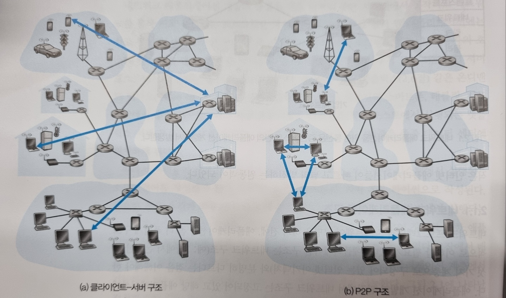

### 2. 프로세스 간 통신

운영체제 관점에서 실제로 통신하는 주체는 프로그램이 아니라 **프로세스(process)** 다. 서로 다른 두 종단 시스템의 프로세스가 네트워크를 통해 **메시지를 교환**하며 통신한다.

#### 1. 클라이언트와 서버 프로세스

통신하는 프로세스 쌍은 보통 한쪽을 **클라이언트**, 다른 쪽을 **서버**로 부른다. 예를 들어 웹에서는 접속을 먼저 시작하는 브라우저 프로세스가 클라이언트, 응답하는 웹 서버 프로세스가 서버다. (P2P에서도 파일을 요청하는 쪽이 클라이언트, 보내는 쪽이 서버 역할을 한다.)

#### 2. 프로세스와 네트워크 사이의 인터페이스: 소켓

프로세스는 **소켓(socket)** 을 통해 네트워크로 메시지를 보내고 받는다.

> 비유: 프로세스가 **집**이라면 소켓은 **출입구**다. 프로세스는 출입구(소켓) 밖 네트워크로 메시지를 밀어내고, 목적지 프로세스는 자기 출입구로 들어온 메시지를 받아 처리한다.

- 소켓은 애플리케이션과 네트워크 사이의 인터페이스, 즉 **API**다.
- 개발자는 소켓의 **애플리케이션 계층 쪽은 모두 제어**할 수 있지만, **트랜스포트 계층 쪽 제어권은 거의 없다.** 가능한 제어는 (1) 트랜스포트 프로토콜 선택, (2) 최대 버퍼·최대 세그먼트 크기 등 일부 매개변수 설정뿐이다.

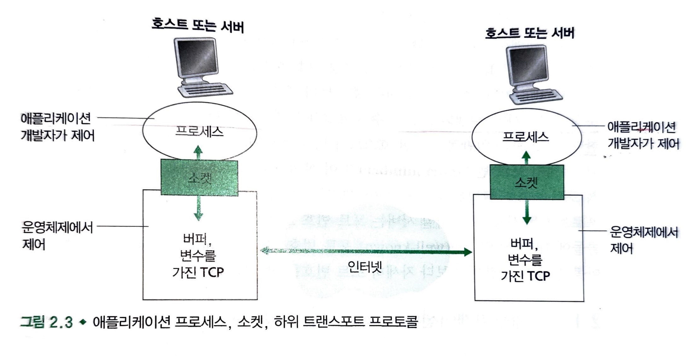

#### 3. 프로세스 주소 배정

한 프로세스가 다른 프로세스로 메시지를 보내려면 목적지를 식별할 두 가지 정보가 필요하다.

| 정보 | 역할 |
|---|---|
| IP 주소 | 목적지 **호스트**를 식별 |
| 포트 번호 | 그 호스트 안의 **수신 프로세스**를 식별 |

한 호스트가 여러 네트워크 애플리케이션을 동시에 실행하므로, 호스트 주소만으로는 부족하고 **포트 번호**로 어느 프로세스인지까지 지정해야 한다.

### 3. 애플리케이션이 이용 가능한 트랜스포트 서비스

소켓은 애플리케이션과 트랜스포트 프로토콜 사이의 인터페이스다. 송신 애플리케이션이 소켓으로 메시지를 보내면, 트랜스포트 프로토콜이 그 메시지를 수신 프로세스의 소켓까지 옮길 책임을 진다. 인터넷은 하나 이상의 트랜스포트 프로토콜을 제공하므로, **애플리케이션 요구에 가장 맞는 것**을 골라야 한다.

트랜스포트 서비스는 다음 네 가지 차원으로 분류할 수 있다.

| 차원 | 무엇을 보장/제공하나 | 필요로 하는 예 |
|---|---|---|
| 신뢰적 데이터 전송 | 데이터가 손실·오류 없이 도착 | 파일 전송, 웹, 전자메일 |
| 처리율 | 초당 일정 비트 이상 전달 | 인터넷 전화, 스트리밍 |
| 시간(지연) | 낮은 종단 간 지연(예: 100ms 이내) | 실시간 게임, 영상회의 |
| 보안 | 암호화·무결성·종단 인증 | 로그인, 결제 등 민감 통신 |

#### 1. 신뢰적 데이터 전송

패킷은 버퍼 오버플로나 비트 오류로 **손실될 수 있다**. **신뢰적 데이터 전송(reliable data transfer)** 은 데이터가 오류 없이 목적지에 도착함을 보장한다.

- 이 서비스가 있으면 송신 프로세스는 데이터가 정확히 도착할 것을 확신할 수 있다.
- 반대로 오디오·비디오 같은 **손실 허용 애플리케이션**은 어느 정도의 손실을 견딜 수 있어, 반드시 필요하지는 않다.

#### 2. 처리율

**처리율(throughput)** 은 초당 전달 가능한 비트 수다. 경로의 대역폭을 여러 세션이 나눠 쓰고 세션이 생기고 사라지므로 시간에 따라 변동한다.

| 유형 | 특징 | 예시 |
|---|---|---|
| 대역폭 민감 애플리케이션 | **특정 처리율**을 요구 | 인터넷 전화 |
| 탄력적 애플리케이션 | 주어지는 만큼 이용, 요구치 없음 | 전자메일, 웹 전송 |

#### 3. 시간

트랜스포트 서비스는 **시간(지연) 보장**을 제공할 수 있다. 예를 들어 "모든 비트가 100ms 이내에 도착"처럼 엄격한 제한이 필요한 경우다. 인터넷 전화, 가상 환경, 원격 회의처럼 **상호작용이 실시간**인 애플리케이션에 특히 중요하다.

#### 4. 보안

트랜스포트 프로토콜은 여러 **보안 서비스**를 제공할 수 있다.

- **기밀성**: 송신 측에서 데이터를 암호화하고 수신 측에서 복호화해 두 프로세스 사이의 내용을 보호한다.
- 그 밖에 **무결성**(변조 여부 확인), **종단 인증**(상대가 진짜인지 확인) 등도 포함된다.

### 4. 인터넷 전송 프로토콜이 제공하는 서비스

인터넷은 애플리케이션에 **TCP**와 **UDP** 두 가지 트랜스포트 프로토콜을 제공한다. 개발자가 가장 먼저 내려야 할 결정이 이 둘 중 무엇을 쓸지다.

| 구분 | TCP | UDP |
|---|---|---|
| 연결 | 연결지향형 (핸드셰이킹 후 연결 성립) | 비연결형 (핸드셰이킹 없음) |
| 신뢰성 | 신뢰적 — 손실·중복 없이 순서대로 전달 | 비신뢰적 — 도착·순서 보장 없음 |
| 혼잡 제어 | 있음 (혼잡하면 전송 속도를 낮춤) | 없음 (원하는 속도로 전송) |
| 방향성 | 전이중(양방향 동시 전송) | — |

#### 1. TCP 서비스

- **연결지향형 서비스**: 메시지 전송 전에 제어 정보를 교환하는 **핸드셰이킹**을 거친다. 이후 두 소켓 사이에 TCP 연결이 성립하며, 양쪽이 동시에 보낼 수 있는 **전이중(full-duplex)** 연결이다.
- **신뢰적 데이터 전송**: 바이트 스트림을 손실·중복 없이 **올바른 순서로** 상대 소켓에 전달한다.
- **혼잡 제어**: 개별 프로세스의 이득보다 **인터넷 전체 성능**을 위한 기능으로, 네트워크가 혼잡해지면 프로세스의 전송 속도를 낮춘다.

#### 2. UDP 서비스

- **최소 서비스 모델**을 가진 가벼운 프로토콜이다.
- 비연결형이라 핸드셰이킹이 없다.
- **비신뢰적**: 메시지의 도착을 보장하지 않으며, 도착하더라도 순서가 뒤바뀔 수 있다.
- **혼잡 제어가 없어** 송신 측이 원하는 속도로 하위 계층에 데이터를 보낼 수 있다.

#### 3. 인터넷 트랜스포트 프로토콜이 제공하지 *않는* 서비스

네 가지 차원 중 TCP·UDP가 실제로 다루는 것은 신뢰성과 (TCP의) 혼잡 제어 정도다.

- **보안**: TCP는 애플리케이션 계층에서 **TLS**로 손쉽게 강화해 보안을 더할 수 있다.
- **처리율·시간 보장**은 둘 다 제공하지 않는다.
- 그렇다고 인터넷 전화 같은 **시간 민감 애플리케이션이 불가능한 것은 아니다.** 다만 지연이 과도할 때는 한계가 있어, 만족스러운 서비스는 가능해도 **대역폭·지연을 보장하지는 못한다.**

### 5. 애플리케이션 계층 프로토콜

**애플리케이션 계층 프로토콜**은 서로 다른 종단 시스템의 프로세스가 어떻게 메시지를 주고받는지를 정의한다. 구체적으로 다음을 규정한다.

- 교환하는 **메시지 타입** (요청 메시지 / 응답 메시지)
- 각 메시지 타입의 **문법** (어떤 필드로 이루어지는가)
- 각 **필드의 의미**
- 프로세스가 **언제, 어떻게** 메시지를 보내고 응답하는지에 대한 규칙

프로토콜에는 두 부류가 있다.

- **공개(public)**: RFC에 명시되어 공중 도메인에서 구할 수 있다. 예를 들어 HTTP RFC를 따르면 어떤 웹 서버에서든 웹 페이지를 가져올 수 있다.
- **독점(proprietary)**: 공개되지 않는다. 예: 스카이프의 비개방 프로토콜.

> **애플리케이션 계층 프로토콜 ≠ 네트워크 애플리케이션.** 프로토콜은 애플리케이션의 **한 요소**일 뿐이다. 예컨대 웹은 네트워크 애플리케이션이고, HTTP는 그 안에서 브라우저와 서버가 주고받는 메시지의 포맷·순서를 정의하는 요소다. 넷플릭스도 저장·전송 서버, 클라이언트, DASH 프로토콜 등 여러 요소로 이루어진다.

### 6. 이 책에서 다루는 네트워크 애플리케이션

이 장에서는 5개 주요 애플리케이션 분야를 다룬다 — **웹, 전자메일, 디렉터리 서비스(DNS), 비디오 스트리밍, P2P 애플리케이션**.

## 2. 웹과 HTTP

1990년대 초 등장한 **월드 와이드 웹**은 대중의 눈길을 사로잡은 인터넷 애플리케이션이다. 가장 큰 매력은 **온디맨드(on-demand)** 방식으로 동작한다는 점, 그리고 누구나 매우 낮은 비용으로 정보를 발행할 수 있다는 점이다.

### 1. HTTP 개요

웹의 애플리케이션 계층 프로토콜이 **HTTP(HyperText Transfer Protocol)** 다.

- **클라이언트-서버 프로그램**으로 구현되며, 둘은 HTTP 메시지를 교환해 통신한다.
- **웹 페이지(문서)** 는 여러 **객체(object)** 로 구성된다. 객체는 하나의 URL로 지정되는 파일(HTML, JPEG 이미지 등)이다. 보통 기본 HTML 파일이 다른 객체들을 그 URL로 참조한다.
- **URL** 은 두 부분으로 이루어진다.
  ```
  http://www.someSchool.edu/someDepartment/picture.gif
         └──── 호스트 이름 ────┘└──── 경로 이름 ─────┘
  ```
- HTTP는 **TCP**를 전송 프로토콜로 사용한다.
- HTTP 서버는 클라이언트에 대한 상태 정보를 저장하지 않으므로 **비상태(stateless) 프로토콜**이다.

### 2. 비지속 연결과 지속 연결

각 요청/응답 쌍을 **별도의 TCP 연결**로 보낼지, 아니면 **하나의 TCP 연결**로 모두 보낼지에 따라 두 방식으로 나뉜다.

| 구분 | 비지속 연결 | 지속 연결 |
|---|---|---|
| TCP 연결 | 객체마다 새로 맺고 끊음 | 하나를 유지하며 재사용 |
| 객체당 비용 | 매번 연결 설정 → 객체당 2 RTT | 연결 1회 설정 후 재사용 |
| 버전 | HTTP/1.0의 기본 | HTTP/1.1의 기본 |
| 파이프라이닝 | 불가 | 가능(응답을 기다리지 않고 연속 요청) |

#### 1. 비지속 연결 HTTP

HTML 파일 1개와 JPEG 이미지 10개, 총 11개 객체가 같은 서버에 있다고 하자. 각 객체마다 다음 과정을 반복한다.

1. 클라이언트가 서버의 **80번 포트**로 TCP 연결을 맺는다(양쪽에 소켓 생성).
2. 그 연결로 **HTTP 요청 메시지**를 보낸다.
3. 서버가 요청을 받아 객체를 꺼내 **응답 메시지**에 담아 보낸다.
4. 서버가 TCP 연결을 끊으라고 한다(단, 응답이 올바르게 수신될 때까지는 끊지 않는다).
5. 클라이언트가 응답을 받으면 TCP 연결이 종료된다. 받은 HTML을 해석해 10개의 JPEG 참조를 찾는다.
6. 참조된 각 JPEG에 대해 1~5단계를 반복한다.

- HTTP/1.0이 이 방식을 쓰며, 위 예에서는 **11개의 TCP 연결**이 만들어진다.
- 작은 패킷 하나가 왕복하는 데 걸리는 시간을 **RTT(round-trip time)** 라 한다. 비지속 연결에서는 객체당 연결 설정 1 RTT + 요청/응답 1 RTT = **2 RTT**가 든다.

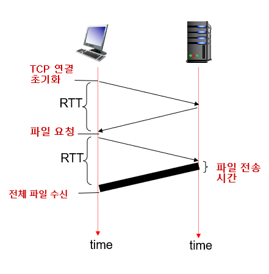

#### 2. 지속 연결 HTTP

비지속 연결의 단점은 다음과 같다.

- 객체마다 새 연결을 설정·유지해야 한다.
- 연결마다 TCP 버퍼와 변수를 클라이언트·서버 양쪽에서 관리해야 한다.
- 객체당 **2 RTT**가 든다.

**지속 연결(HTTP/1.1)** 은 하나의 TCP 연결을 그대로 유지한 채 여러 객체를 주고받는다. 응답을 기다리지 않고 요청을 연속해서 보내는 **파이프라이닝**도 가능하다. 일정 시간(타임아웃) 동안 사용되지 않으면 연결을 닫는다. HTTP의 기본 모드는 **파이프라이닝을 이용한 지속 연결**이다.

### 3. HTTP 메시지 포맷

#### 1. HTTP 요청 메시지

```
GET /somedir/page.html HTTP/1.1
Host: www.someschool.edu
Connection: close
User-agent: Mozilla/5.0
Accept-language: fr
```

- 각 줄은 **CR(carriage return) + LF(line feed)** 로 구분된다.
- 첫 줄은 **요청 라인(request line)**, 이후 줄들은 **헤더 라인(header line)** 이다.
- 요청 라인은 3개 필드로 구성된다.

| 필드 | 위 예시 | 의미 |
|---|---|---|
| 방식(method) | `GET` | 요청 동작 (GET/POST 등) |
| URL | `/somedir/page.html` | 요청 객체의 경로 |
| HTTP 버전 | `HTTP/1.1` | 사용하는 HTTP 버전 |

- 주요 헤더: `Host`(웹 프록시 캐시에 필요), `Connection: close`(지속 연결 여부), `User-agent`(브라우저 종류), `Accept-language`(선호 언어).
- 헤더 라인 뒤의 **개체 몸체(entity body)** 는 POST 방식에서 폼 데이터를 담는 데 쓰인다.

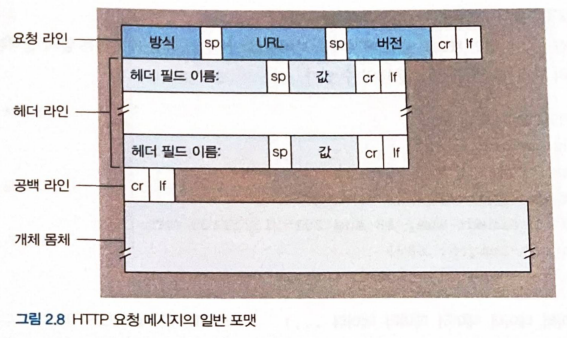

#### 2. HTTP 응답 메시지

```
HTTP/1.1 200 OK                              ← 상태 라인
Connection: close                            ← 헤더 라인 시작
Date: Tue, 18 Aug 2015 15:44:04 GMT
Server: Apache/2.2.3 (CentOS)
Last-Modified: Tue, 18 Aug 2015 15:11:03 GMT
Content-Length: 6821
Content-Type: text/html                      ← 헤더 라인 끝

(데이터 데이터 데이터 ...)                     ← 개체 몸체
```

- 3개 부분으로 이루어진다 — **상태 라인**, **헤더 라인(위 예시는 6줄)**, **개체 몸체**(요청한 객체).
- 상태 라인의 **상태 코드**는 요청 결과를 나타낸다.

| 상태 코드 | 문장 | 의미 |
|---|---|---|
| 200 | OK | 요청 성공, 객체를 함께 보냄 |
| 301 | Moved Permanently | 객체가 다른 곳으로 이동(새 URL 안내) |
| 400 | Bad Request | 서버가 요청을 이해하지 못함 |
| 404 | Not Found | 요청한 객체가 서버에 없음 |
| 505 | HTTP Version Not Supported | 지원하지 않는 HTTP 버전 |

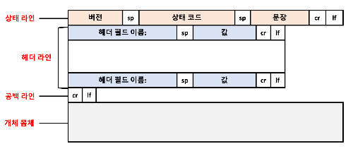

### 4. 사용자와 서버 간의 상호작용: 쿠키

HTTP는 비상태 프로토콜이지만, 서버가 사용자를 **식별·추적**해야 할 때가 있다. 이를 위해 **쿠키(cookie)** 를 사용한다. 쿠키 기술은 네 가지 요소로 이루어진다.

1. HTTP **응답** 메시지의 쿠키 헤더 라인(`Set-cookie`)
2. HTTP **요청** 메시지의 쿠키 헤더 라인(`Cookie`)
3. 사용자 브라우저에 저장·관리되는 **쿠키 파일**
4. 웹사이트의 **백엔드 데이터베이스**

동작 흐름: 브라우저가 응답의 `Set-cookie`로 받은 식별 번호를 쿠키 파일에 저장하고, 이후 요청마다 그 번호를 함께 보낸다. 서버는 이 번호로 **세션 기간 동안 사용자를 식별**한다.

> 쿠키는 편리하지만 **사생활 침해** 소지가 있다. 쿠키와 사용자가 제공한 계정 정보를 결합하면 웹사이트가 사용자에 대해 많은 것을 알 수 있고, 그 정보를 판매할 수도 있다.

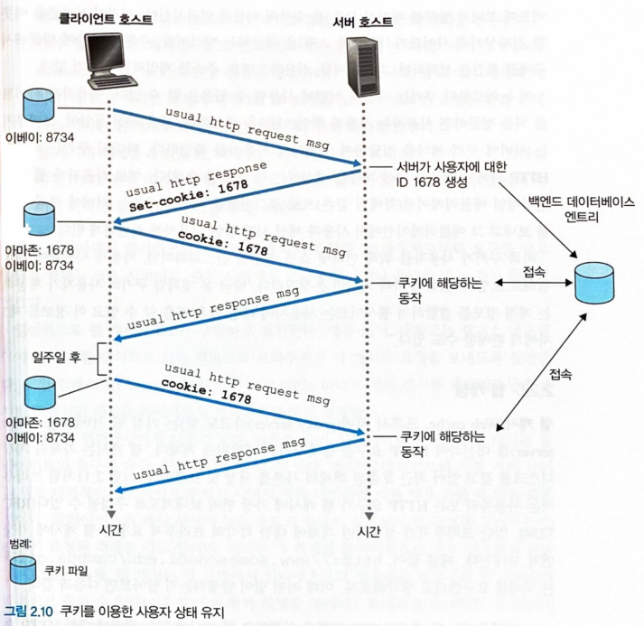

### 5. 웹 캐싱

**웹 캐시(프록시 서버)** 는 웹 서버를 대신해 HTTP 요청을 처리하는 네트워크 개체다. 자체 저장 디스크에 최근 요청된 객체의 사본을 보관해 둔다.

- 캐시는 브라우저에게는 **서버**이면서, 원 서버에게는 **클라이언트** 역할을 동시에 한다.
- 보통 ISP가 구입·설치한다.
- 효과: **응답 시간 단축**, **링크상의 웹 트래픽 대폭 감소**.

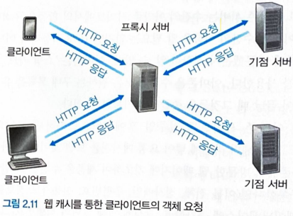

이런 효과 덕분에 웹 캐시는 인터넷에서 점점 중요한 역할을 하게 되었고, 특히 **콘텐츠 전송 네트워크(CDN)** 로 확장되었다. CDN 회사는 지역적으로 분산된 캐시를 설치해 많은 트래픽을 **지역화**한다.

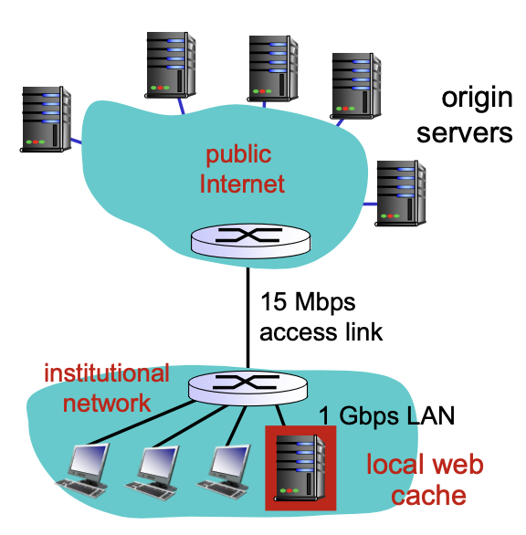

#### 1. 조건부 GET

웹 캐싱은 응답 시간을 줄이지만, **캐시에 저장된 사본이 오래된(최신이 아닌) 것일 수 있다**는 새로운 문제를 낳는다. **조건부 GET(conditional GET)** 은 객체가 최신인지 확인하며 캐싱하게 해 준다.

**① 캐시가 객체를 저장할 때** — 원 서버는 응답에 `Last-Modified` 헤더로 마지막 수정 날짜를 함께 보낸다.

```
HTTP/1.1 200 OK
Date: Wed, 09 Sep 2015 09:23:24 GMT
Last-Modified: Tue, 18 Aug 2015 15:11:03 GMT
Content-Type: image/jpeg

(객체 데이터 ...)
```

**② 캐시가 최신 여부를 물을 때** — 이후 요청에서 `If-Modified-Since`에 그 날짜를 넣어 보낸다.

```
GET /fruit/kiwi.gif HTTP/1.1
Host: www.exotiquecuisine.com
If-Modified-Since: Tue, 18 Aug 2015 15:11:03 GMT
```

- 객체가 그 뒤로 **바뀌지 않았으면**, 서버는 객체를 보내지 않고 **`304 Not Modified`** 만 응답한다(트래픽 절약).
- 바뀌었으면 `200 OK`와 함께 새 객체를 보낸다.

### 6. HTTP/2

HTTP/2의 주요 목표는 **여러 요청/응답을 하나의 TCP 연결에서 멀티플렉싱**해 지연을 줄이는 것이다. 요청 우선순위화, 서버 푸시, HTTP 헤더 압축 등도 제공한다.

**왜 필요했나 — HOL 블로킹**

- HTTP/1.1은 하나의 지속 TCP 연결로 페이지의 모든 객체를 보낸다. 연결이 하나면 서버 소켓 수가 줄고 대역폭도 공정하게 나뉜다.
- 그러나 큰 객체가 앞에 있으면, 뒤의 작은 객체들이 그것이 다 지나갈 때까지 기다려야 한다. 이것이 **HOL(Head-of-Line) 블로킹**이다. (앞이 안 끝나면 뒤도 계속 기다린다.)
- HTTP/1.1은 이를 **병렬 TCP 연결**(브라우저당 보통 6개까지)로 우회했지만, 연결 수가 늘어나는 부작용이 있다. HTTP/2는 **병렬 연결 수를 줄이거나 없애는 것**을 목표로 한다.

#### 1. HTTP/2 프레이밍

HOL 블로킹의 해결책은 각 메시지를 **작은 프레임(frame)** 으로 쪼개고, 같은 TCP 연결에서 여러 메시지의 프레임을 **인터리빙(교차 전송)** 하는 것이다.

- 예: 큰 비디오 클립 1개와 작은 객체 8개로 된 페이지에서, 비디오를 여러 프레임으로 쪼개 작은 객체들의 프레임과 번갈아 보낸다. 그러면 작은 객체들이 비디오 뒤에서 오래 기다리지 않아 **체감 지연이 크게 줄어든다.**
- 메시지를 독립된 프레임으로 쪼개고 인터리빙한 뒤 반대편에서 재조립하는 것이 핵심 개선이며, 이는 **프레이밍 서브 계층**이 담당한다.
- 프레임은 **바이너리로 인코딩**된다. 바이너리 프로토콜은 파싱이 효율적이고 프레임 크기가 작으며 오류에 더 강하다.

#### 2. 메시지 우선순위화 및 서버 푸시

- **우선순위화**: 클라이언트가 한 서버에 여러 요청을 보낼 때 각 요청에 **가중치**를 부여해 우선순위를 매기고, 의존 관계도 지정할 수 있다. 이를 통해 애플리케이션 성능을 최적화한다.
- **서버 푸시**: 서버가 하나의 요청에 대해 **여러 응답**을 보낼 수 있다. 즉 클라이언트가 요청하기도 전에, 필요할 객체들을 미리 **푸시**해 보낸다.

#### 3. HTTP/3

- **QUIC**은 **UDP 위에** 구현된 애플리케이션 계층 프로토콜로, 멀티플렉싱(인터리빙), 스트림별 흐름 제어, 저지연 연결 확립 등의 특징을 갖는다.
- **HTTP/3**은 이 QUIC 위에서 동작하도록 설계된 새 프로토콜이다(아직 완전히 표준화되지는 않았다).

## 3. 인터넷 전자메일

인터넷 전자메일은 세 가지 주요 요소로 이루어진다 — **사용자 에이전트, 메일 서버, SMTP**.

| 요소 | 역할 |
|---|---|
| 사용자 에이전트 | 메시지를 읽고·쓰고·응답·저장·관리 (예: 아웃룩, 애플 메일, 지메일) |
| 메일 서버 | 전자메일 인프라의 중심. 각 수신자의 **메일박스**를 두어 메시지를 보관·관리 |
| SMTP | 메일을 송신자 서버에서 수신자 서버로 전송하는 애플리케이션 계층 프로토콜 |

일반적인 흐름은 이렇다. 앨리스가 메시지를 작성하면 사용자 에이전트가 이를 **앨리스의 메일 서버**로 보내 출력 큐에 넣는다. 그러면 앨리스의 서버가 **밥의 메일 서버**로 전달하고, 밥의 메일박스에 저장된다. 밥은 자신의 사용자 에이전트로 메일박스에서 메시지를 가져와 읽는다. 만약 앨리스의 서버가 밥의 서버로 전달하지 못하면, 메시지를 큐에 보관하고 **재시도**한다. SMTP는 이 전송에 **TCP의 신뢰적 전송 서비스**를 이용한다.

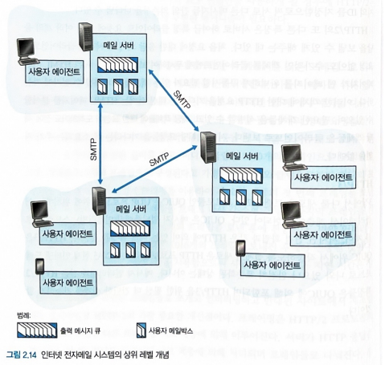

### 1. SMTP

SMTP는 인터넷 전자메일의 중심이지만, **오래된 기술**이라 낡은 특성도 있다.

- 대표적 제약: 모든 메일 **몸체는 7비트 ASCII**여야 한다.
- 이 제약은 멀티미디어 시대에 문제를 일으킨다. 이진 멀티미디어 데이터를 보내려면 **ASCII로 변환해 보낸 뒤, 받는 쪽에서 다시 원래대로 되돌려야** 한다.

**전송 시나리오** (앨리스 → 밥)

1. 앨리스가 사용자 에이전트에 밥의 주소와 메시지를 주고 전송을 명령한다.
2. 사용자 에이전트가 메시지를 앨리스의 메일 서버로 보내 큐에 넣는다.
3. 앨리스 서버의 **SMTP 클라이언트**가 큐의 메시지를 보고, 밥 서버의 **SMTP 서버**로 TCP 연결(포트 **25**)을 맺는다.
4. 초기 SMTP 핸드셰이킹에서 송신자·수신자 주소를 주고받는다.
5. SMTP 클라이언트가 메시지를 보내고, 밥의 서버가 이를 받아 밥의 메일박스에 넣는다.

> SMTP는 사람의 대면 상호작용과 닮은 명령/응답 구조를 쓰며, **지속 연결**을 사용한다.

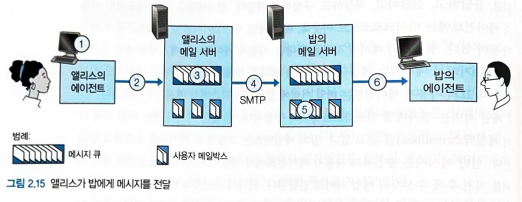

### 2. 메일 메시지 포맷

전자메일에도 몸체 앞에 **헤더**가 온다. 헤더 라인의 형식은 RFC 5322에 정의되어 있으며, 헤더와 몸체는 **빈 줄(CRLF)** 로 구분된다.

```
From: alice@crepes.fr
To: bob@hamburger.edu
Subject: Searching for the meaning of life.

(메시지 몸체 — ASCII 문자 ...)
```

- 헤더 다음에 빈 줄이 오고, 이어서 ASCII 문자로 된 메시지 몸체가 나온다.

### 3. 메일 접속 프로토콜

메일을 **보내는** 경로와 **가져오는** 경로는 프로토콜이 다르다.

- **보내기**: 앨리스의 사용자 에이전트 → 앨리스의 메일 서버(SMTP 또는 HTTP), 이후 앨리스 서버 → 밥의 서버는 **SMTP**로 중계.
- **가져오기**: 문제는 밥이 자기 ISP의 메일 서버에 있는 메시지를 어떻게 **가져오느냐**다. SMTP는 **푸시(push)** 프로토콜이라 서버에서 메일을 끌어올(pull) 수 없다. 그래서 별도의 **메일 접속 프로토콜**이 필요하다.

가져오는 대표적인 두 가지 방법은 다음과 같다.

| 방법 | 접속 방식 | 특징 |
|---|---|---|
| 웹 기반 메일 / 스마트폰 앱 | HTTP | 밥의 메일 서버가 SMTP는 물론 HTTP 인터페이스도 제공해야 함 |
| 전형적인 메일 클라이언트(예: 아웃룩) | IMAP | 인터넷 메일 접근 프로토콜로 서버의 메시지를 가져옴 |

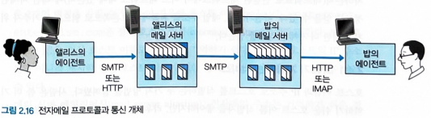