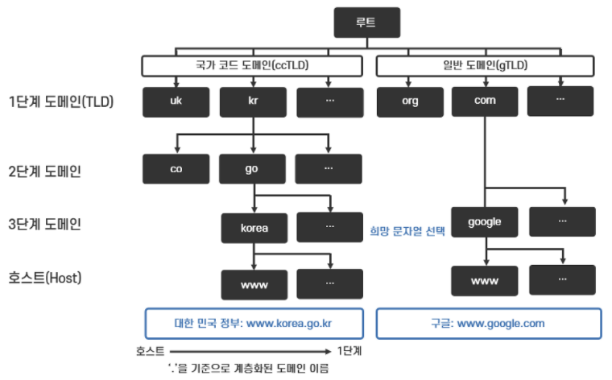
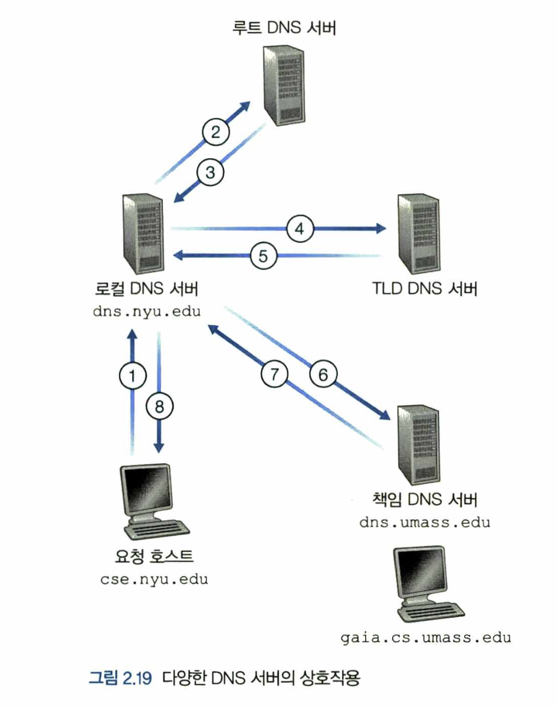
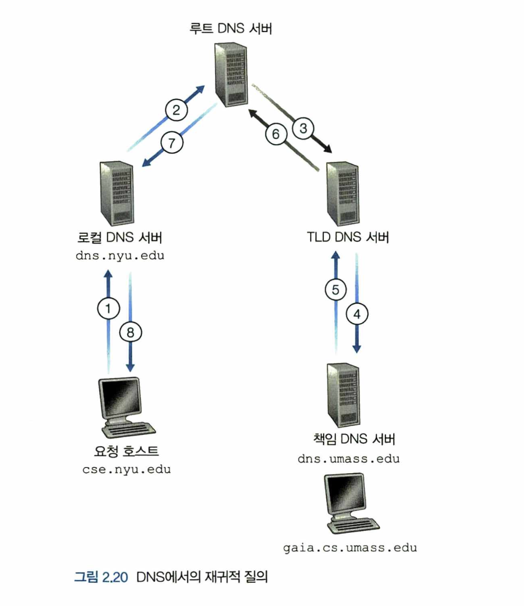
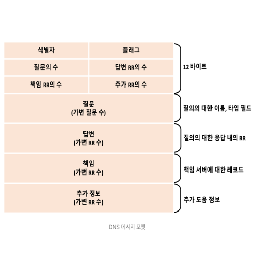
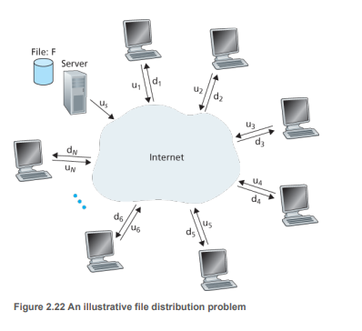
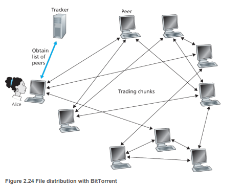
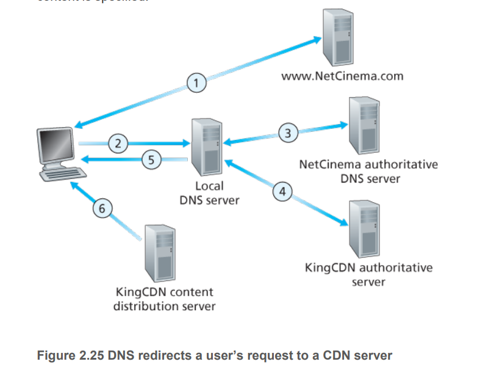
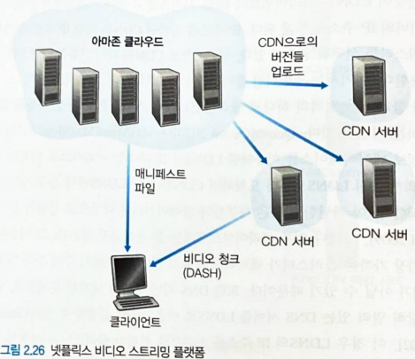
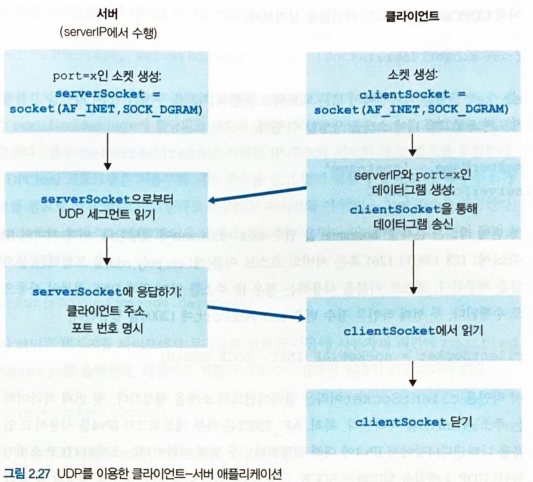
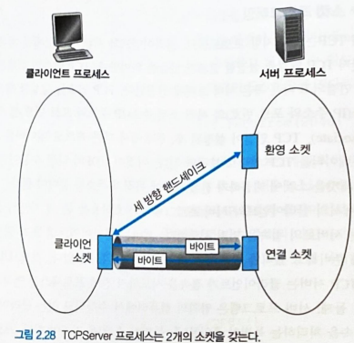

## 4. DNS: 인터넷의 디렉터리 서비스

사람은 `www.facebook.com` 같은 **호스트 이름(hostname)** 을 기억하기 쉬워 선호하지만, 이 이름만으로는 호스트가 인터넷 어디에 있는지 알 수 없다. 게다가 호스트 이름은 가변 길이의 알파뉴메릭 문자로 되어 있어 라우터가 처리하기에 불편하다. 그래서 호스트는 **IP 주소(IP address)** 로도 식별된다. IP 주소는 4바이트로 구성되며, 왼쪽에서 오른쪽으로 갈수록 세부 지역을 가리키는 **계층 구조**를 가진다.

### 1. DNS가 제공하는 서비스

사람은 기억하기 쉬운 호스트 이름을 좋아하지만, 라우터는 고정 길이의 계층 구조를 가진 IP 주소를 좋아한다. 이 둘의 차이를 절충하려면 호스트 이름을 IP 주소로 변환해 주는 **디렉터리 서비스**가 필요하고, 그 역할을 하는 것이 인터넷 **DNS(Domain Name System)** 다.

DNS는 두 가지 성격을 함께 가진다.

- DNS 서버들의 계층 구조로 구현된 **분산 데이터베이스**다.
- 호스트가 그 분산 데이터베이스에 질의할 수 있게 해 주는 **애플리케이션 계층 프로토콜**이다.

DNS 서버는 대체로 **BIND** 소프트웨어를 수행하는 유닉스 컴퓨터이며, DNS 프로토콜은 포트 53의 UDP 위에서 동작한다.

**URL을 요청할 때 벌어지는 일**을 따라가 보면 DNS의 위치가 분명해진다.

1. 사용자 컴퓨터에서 DNS 애플리케이션의 클라이언트 측이 동작한다.
2. 브라우저가 URL에서 호스트 이름 `www.someschool.edu`를 추출해 DNS 클라이언트에 넘긴다.
3. DNS 클라이언트는 그 호스트 이름을 담은 질의를 DNS 서버로 보낸다.
4. DNS 서버는 해당 호스트 이름의 IP 주소를 담아 응답한다.
5. 브라우저는 받은 IP 주소의 80번 포트에 있는 HTTP 서버 프로세스로 TCP 연결을 시작한다.

DNS는 이 이름-주소 변환 외에도 다음 서비스를 제공한다.

| 서비스 | 내용 |
|---|---|
| 호스트 에일리어싱(host aliasing) | 복잡한 정식 이름을 가진 호스트가 기억하기 쉬운 하나 이상의 별칭 이름을 갖게 한다 |
| 메일 서버 에일리어싱 | 별칭 메일 주소로부터 정식 호스트 이름과 IP 주소를 찾아 준다 (메일 애플리케이션이 이용) |
| 부하 분산(load distribution) | 하나의 이름에 여러 IP 주소를 매핑해, 중복 서버들 사이로 트래픽을 분산시킨다 |

### 2. DNS 동작 원리 개요

애플리케이션 입장에서 DNS는 호스트 이름을 IP 주소로 바꿔 주는 **간단한 블랙박스**처럼 보인다. 사용자 호스트의 DNS가 질의 메시지를 보내면 응답으로 IP 주소가 돌아오고, 모든 DNS 질의·응답은 **포트 53의 UDP 데이터그램**으로 오간다.

그런데 이 블랙박스를 "모든 매핑을 담은 단 하나의 네임 서버"로 구현하면 곤란하다.

| 단일 서버의 문제 | 내용 |
|---|---|
| 단일 고장점 | 그 서버가 죽으면 인터넷 전체의 이름 변환이 멈춘다 |
| 트래픽 집중 | 전 세계의 모든 질의를 한 서버가 감당해야 한다 |
| 먼 거리 | 지리적으로 먼 질의는 심한 지연을 겪는다 |
| 유지관리 부담 | 하나의 데이터베이스에 모든 호스트를 담아 갱신해야 한다 |

즉 중앙 집중식 데이터베이스는 **확장성이 전혀 없다.** 그래서 DNS는 처음부터 **분산되도록** 설계되었다.



#### 1. 분산 계층 데이터베이스

확장성 문제를 풀기 위해 DNS 서버는 계층 형태로 구성되어 전 세계에 분산되어 있다. 크게 세 유형의 서버가 있다.

| 서버 유형 | 역할 |
|---|---|
| 루트 DNS 서버(root) | TLD 서버들의 IP 주소를 알려 준다. 13개의 루트 서버(복제본)로 이루어지며 여러 기관이 관리하고 IANA가 조정한다 |
| 최상위 도메인 서버(TLD) | `com`, `org`, `net` 및 `kr`, `uk`, `jp` 같은 국가 도메인을 담당하며, 해당 도메인의 책임 서버 IP 주소를 알려 준다 |
| 책임 DNS 서버(authoritative) | 특정 기관이 보유하며, 그 기관 호스트 이름을 IP 주소로 매핑하는 공개 DNS 레코드를 직접 갖고 있다 |

세 유형은 위에서 아래로 이어지며 질의를 안내한다. 예를 들어 `www.amazon.com`을 찾을 때, 클라이언트는 먼저 루트 서버에 접속해 `com`을 담당하는 TLD 서버 주소를 받고, 그 TLD 서버로부터 `amazon.com`을 담당하는 책임 서버 주소를 받는다.

이 셋 외에 계층에 엄격히 속하지는 않지만 실제 동작의 중심에 있는 **로컬 DNS 서버(local DNS server)** 가 있다. 호스트가 ISP에 연결되면 ISP가 로컬 DNS 서버 주소를 알려 주고, 호스트의 모든 질의는 먼저 이 가까운 로컬 서버로 향한다. 로컬 서버는 일종의 대리인(프록시)처럼 질의를 계층 위로 전달한다.

**질의가 흐르는 예시** — `cse.nyu.edu`가 `gaia.cs.umass.edu`의 IP 주소를 원한다고 하자. `cse.nyu.edu`의 로컬 서버는 `dns.nyu.edu`, 목적지의 책임 서버는 `dns.umass.edu`라고 가정한다.

1. `cse.nyu.edu`가 자신의 로컬 서버 `dns.nyu.edu`에 `gaia.cs.umass.edu`를 담은 질의를 보낸다.
2. `dns.nyu.edu`가 루트 서버에 질의하고, 루트 서버는 `edu`를 담당하는 TLD 서버 주소를 돌려준다.
3. `dns.nyu.edu`가 TLD 서버에 질의하고, TLD 서버는 `umass.edu`의 책임 서버 주소를 돌려준다.
4. `dns.nyu.edu`가 책임 서버 `dns.umass.edu`에 질의해 최종 IP 주소를 받아, 이를 `cse.nyu.edu`에 돌려준다.



실제로는 책임 서버가 한 단계 더 나뉘기도 한다. TLD 서버가 목적지 호스트의 책임 서버를 곧바로 아는 경우는 드물고, 대신 **중간 DNS 서버**만 아는 경우가 많다. 예컨대 매사추세츠대학교가 학교 전체 DNS 서버 `dns.umass.edu`를 두고, 각 학과가 다시 자기 학과 서버(`dns.cs.umass.edu` 등)를 두는 식이다. 이때 `dns.umass.edu`는 `cs.umass.edu`로 끝나는 호스트 질의를 받으면 학과 서버 `dns.cs.umass.edu`의 주소를 알려 주고, 로컬 서버는 그 학과 서버에 질의해 최종 매핑을 얻는다.

DNS 질의는 **재귀적 질의**와 **반복적 질의**를 섞어 쓴다.

| 질의 종류 | 의미 | 위 예시에서 |
|---|---|---|
| 재귀적(recursive) | 질의를 받은 서버가 "대신" 매핑을 끝까지 알아내 돌려준다 | `cse.nyu.edu` → `dns.nyu.edu` 질의 |
| 반복적(iterative) | 응답이 "다음에 물어볼 서버 주소"이고, 질의자가 직접 그다음을 물어본다 | `dns.nyu.edu`가 루트·TLD·책임 서버에 보내는 질의 |

이론상 모든 질의를 재귀적으로 할 수도, 반복적으로 할 수도 있지만, 실무에서는 위처럼 호스트→로컬 서버 구간은 재귀적으로, 로컬 서버→상위 서버 구간은 반복적으로 두는 방식이 흔하다.



#### 2. DNS 캐싱

DNS는 지연을 줄이고 네트워크에 오가는 DNS 메시지 수를 줄이기 위해 **캐싱**을 적극 사용한다.

- DNS 서버는 질의 사슬에서 알게 된 호스트 이름–IP 주소 쌍을 로컬 메모리에 저장해 둔다.
- 이후 같은 호스트 이름에 대한 질의가 오면, 그 이름의 책임 서버가 아니더라도 캐시에서 바로 IP 주소를 돌려줄 수 있다.
- 이름–주소 매핑은 영구적이지 않으므로, 각 레코드는 일정 시간(보통 **2일**) 뒤에 캐시에서 제거된다.

> 캐싱 덕분에 로컬 DNS 서버는 많은 경우 **루트 서버를 거치지 않고** 곧바로 응답할 수 있어, 질의 사슬을 크게 단축한다.

### 3. DNS 레코드와 메시지

DNS 서버들은 호스트 이름과 IP 주소의 매핑을 **자원 레코드(Resource Record, RR)** 형태로 저장한다. 하나의 DNS 응답에는 하나 이상의 RR이 담긴다. 각 RR은 다음 네 요소로 이루어진 튜플이다.

```
(Name, Value, Type, TTL)
```

TTL은 이 레코드가 캐시에서 언제 제거될지를 정하는 값이고, `Name`과 `Value`의 의미는 **`Type`에 따라 달라진다.**

| Type | Name | Value | 예시 `(Name, Value, Type)` |
|---|---|---|---|
| A | 호스트 이름 | 그 호스트 이름의 IP 주소 | `(relay1.bar.foo.com, 145.37.93.126, A)` |
| NS | 도메인 | 그 도메인 호스트들의 IP 주소를 알아낼 수 있는 책임 DNS 서버의 호스트 이름 | `(foo.com, dns.foo.com, NS)` |
| CNAME | 별칭 호스트 이름 | 그 별칭에 대응하는 정식(canonical) 호스트 이름 | `(foo.com, relay1.bar.foo.com, CNAME)` |
| MX | 별칭 메일 서버 이름 | 그 별칭에 대응하는 메일 서버의 정식 이름 | `(foo.com, mail.bar.foo.com, MX)` |

레코드가 어느 서버에 담기는지는 **책임 서버인지 아닌지**로 갈린다.

- 어떤 DNS 서버가 특정 호스트 이름의 **책임 서버**이면, 그 호스트 이름에 대한 **Type A** 레코드를 갖는다.
- 책임 서버가 아니면, 그 호스트 이름이 속한 도메인에 대한 **Type NS** 레코드(및 그 책임 서버의 A 레코드)를 갖는다.

> MX 레코드가 별도로 있는 덕분에, 회사의 메일 서버와 웹 서버가 같은 별칭 이름(예: `foo.com`)을 쓰면서도 서로 다른 정식 이름을 가질 수 있다.

#### 1. DNS 메시지

DNS에는 **질의**와 **응답** 두 가지 메시지 유형만 있으며, 둘은 같은 형식을 공유한다. 메시지의 각 영역은 다음과 같다.

| 영역 | 내용 |
|---|---|
| 헤더(첫 12바이트) | 질의를 식별하는 16비트 번호, 질의/응답 플래그(1비트), 재귀 요구 플래그(1비트), 그리고 아래 네 영역의 개수를 나타내는 4개의 개수 필드 |
| 질문(question) 영역 | 질의되는 이름(Name 필드)과 그 이름에 대해 묻는 질의 타입(Type 필드) |
| 답변(answer) 영역 | 원래 질의된 이름에 대한 RR들. 각 RR에 Type(A, NS, CNAME 등)이 있으며 여러 개가 올 수 있다 |
| 책임(authority) 영역 | 다른 책임 서버들의 레코드 |
| 추가(additional) 영역 | 도움이 되는 그 밖의 레코드. 예를 들어 MX 질의 응답에서는 메일 서버의 정식 호스트 이름에 대한 A 레코드가 여기 담긴다 |



#### 2. DNS 데이터베이스에 레코드 삽입

새 도메인을 만들면 그 레코드가 DNS에 어떻게 들어가는지 정리하면 다음과 같다.

1. 도메인 이름을 **등록기관(registrar)** 에 등록한다. 등록기관은 이름의 유일성을 확인하고 DNS 데이터베이스에 넣는다.
2. 등록기관에 **주 책임 서버와 부 책임 서버**의 이름과 IP 주소를 제공한다. 등록기관은 이 두 서버에 대한 **Type NS · Type A 레코드**를 TLD 서버에 넣는다.
3. 자신의 책임 서버에는 웹 서버에 대한 **Type A 레코드**와 메일 서버에 대한 **Type MX 레코드**가 들어가 있는지 확인한다.

## 5. P2P 파일 분배

지금까지 본 애플리케이션은 항상 켜져 있는 서버에 의존하는 **클라이언트-서버 구조**였다. 이와 달리 **P2P 구조**에서는 간헐적으로 연결되는 호스트 쌍, 즉 **피어(peer)** 가 서로 직접 통신한다. 피어는 서비스 제공자가 소유한 장비가 아니라 **사용자가 제어하는 데스크톱·랩톱·스마트폰**이다.

### 1. P2P 구조의 확장성

P2P의 가장 큰 장점은 **확장성(scalability)** 이다. 한 파일을 고정된 수의 피어들에게 나눠 주는 상황을 단순화해 보면 이 특성이 드러난다. 서버와 피어들이 모두 접속 링크로 인터넷에 연결되어 있고, 병목은 코어가 아니라 **각자의 접속 링크**에 있다고 가정한다.

두 구조에서 분배 시간이 어떻게 달라지는지가 핵심이다.

| 구분 | 클라이언트-서버 | P2P |
|---|---|---|
| 누가 업로드하나 | 서버 혼자 | 서버 + 파일을 받은 모든 피어 |
| 피어 수 N이 늘면 | 서버가 N개의 사본을 모두 올려야 해 분배 시간이 **선형적으로 증가** | 피어가 늘수록 **업로드 용량도 함께 늘어** 시간이 폭증하지 않음 |
| 확장성 | 나쁨 | 좋음 (자기 확장) |

> 클라이언트-서버는 피어가 늘수록 서버 부담이 그대로 커지지만, P2P는 새 피어가 **수요자이면서 동시에 공급자**가 되기 때문에 규모가 커져도 잘 버틴다.



### 2. 비트토렌트

**비트토렌트(BitTorrent)** 는 파일 분배에 널리 쓰이는 P2P 프로토콜이다. 하나의 파일 분배에 참여하는 피어들의 모임을 **토렌트(torrent)** 라 하고, 피어들은 서로에게서 같은 크기의 **청크(chunk)** 를 주고받는다.

동작 흐름은 다음과 같다.

1. 새 피어(앨리스)가 토렌트에 가입하면 처음에는 청크가 하나도 없지만, 시간이 지나며 청크를 모은다. **다운로드하는 동안 자신도 다른 피어에게 청크를 업로드한다.**
2. 각 토렌트에는 **트래커(tracker)** 라는 인프라 노드가 있다. 피어는 트래커에 자신을 등록하고, 아직 토렌트에 있음을 주기적으로 알린다.
3. 앨리스가 가입하면 트래커는 참여 피어 집합에서 일부(예: 50개)를 무작위로 골라 그 IP 주소들을 앨리스에게 보낸다. 앨리스는 이들과 TCP 연결을 맺으며, 연결된 피어를 **이웃 피어(neighbor)** 라 한다.

여기서 두 가지 결정이 성능을 좌우한다.

| 결정 | 방식 | 이유 |
|---|---|---|
| 어느 청크를 먼저 받을까 | **가장 드문 것 먼저(rarest first)** — 이웃들 사이에서 가장 희소한 청크부터 요청 | 희소 청크를 빨리 퍼뜨려 특정 청크가 사라지는 것을 막고 분배를 고르게 함 |
| 누구에게 업로드할까 | **현명한 교역(트레이딩)** — 자신에게 가장 빠른 속도로 데이터를 주는 이웃에게 우선 업로드 | 무임승차를 막고 서로 협력하도록 유도 |

앨리스는 자신에게 가장 빠르게 데이터를 주는 이웃 몇(예: 4개)을 골라 그들에게 업로드하는데, 이 상태의 이웃을 **활성화(unchoked)** 되었다고 한다. 여기에 더해 주기적으로 이웃 하나를 무작위로 골라 데이터를 보내 보는데, 이를 **낙관적 활성화(optimistically unchoked)** 라 한다. 새 이웃과의 협력 가능성을 계속 탐색하기 위해서다.

> 이런 "받은 만큼 준다"는 보상 방식을 **TFT(tit-for-tat)** 라 하며, 협력하는 피어끼리 더 빠른 속도를 주고받게 만든다.



## 6. 비디오 스트리밍과 콘텐츠 분배 네트워크

오늘날 인터넷 트래픽의 큰 몫은 비디오 스트리밍이 차지한다. 스트리밍 서비스는 캐시처럼 동작하는 **애플리케이션 레벨 프로토콜과 서버(CDN)** 를 이용해 구현된다.

### 1. 인터넷 비디오

스트리밍에서 비디오는 서버에 저장되어 사용자가 **온디맨드(on-demand)** 로 요청한다. 비디오는 초당 24~30장의 이미지를 일정한 속도로 이어 붙인 것이며, 몇 가지 특성이 네트워크 설계에 중요하다.

- **압축 가능** — 비디오는 압축할 수 있고, 비트 전송률을 높일수록 품질이 좋아진다(품질과 비트율은 비례).
- **높은 비트 전송률** — 네트워킹 관점에서 비디오의 가장 두드러진 특성이다.

> 그래서 네트워크는 스트리밍 애플리케이션에 대해 **압축된 비디오의 전송률 이상의 평균 처리량**을 꾸준히 제공해야 끊김 없이 재생된다.

### 2. HTTP 스트리밍 및 DASH

가장 단순한 방식인 **HTTP 스트리밍**에서는 비디오가 HTTP 서버에 하나의 URL을 가진 일반 파일로 저장된다. 클라이언트는 TCP 연결을 맺고 그 URL로 HTTP GET을 보내 파일을 받는다. 받은 바이트는 **애플리케이션 버퍼**에 쌓이고, 버퍼가 일정 임곗값을 넘으면 재생을 시작한다. 이후에는 버퍼에서 주기적으로 프레임을 꺼내 압축을 풀고 화면에 표시한다.

이 방식은 유튜브 등 많은 시스템이 채택했지만 **약점**이 있다. 가용 대역폭이 제각각인 모든 클라이언트에게 **똑같이 인코딩된 하나의 비디오**를 보낸다는 점이다. 대역폭이 넉넉한 사용자는 더 좋은 품질을 못 받고, 부족한 사용자는 끊긴다.

이 문제를 풀기 위해 **DASH(Dynamic Adaptive Streaming over HTTP)** 가 등장했다.

- 비디오를 **비트율·품질이 다른 여러 버전**으로 미리 인코딩해 둔다.
- 클라이언트는 몇 초 분량의 **조각(chunk) 단위**로, 그때그때 형편에 맞는 버전을 골라 요청한다.
- 덕분에 회선이 다른 클라이언트마다 다른 인코딩률을 고를 수 있고, 세션 도중 대역폭이 변해도 **적응**할 수 있다.

DASH에서 각 버전은 HTTP 서버에 서로 다른 URL로 저장되고, 서버는 각 버전의 URL을 비트율과 함께 알려 주는 **매니페스트 파일(manifest file)** 을 제공한다. 클라이언트는 원하는 버전·구간을 골라 HTTP GET에 URL과 **byte-range**를 지정해 요청한다.

### 3. 콘텐츠 분배 네트워크(CDN)

막대한 스트리밍 트래픽을 전 세계에 안정적으로 제공하는 것은 큰 도전이다. 모든 비디오를 **단일 거대 데이터 센터**에 두고 직접 전송하면 세 가지 문제가 생긴다.

| 문제 | 내용 |
|---|---|
| 먼 거리 지연 | 사용자가 데이터 센터에서 멀수록 종단 간 경로가 길어져 지연이 커진다 |
| 대역폭 낭비 | 인기 비디오가 같은 링크로 반복 전송되어 대역폭이 낭비되고 ISP에 중복 비용이 발생한다 |
| 단일 고장점 | 그 데이터 센터가 장애를 일으키면 전체 서비스가 멈춘다 |

그래서 거의 모든 스트리밍 회사는 **콘텐츠 분배 네트워크(CDN)** 를 쓴다. CDN은 여러 지점에 분산된 서버들을 운영하며 비디오 등 웹 콘텐츠의 사본을 그 서버들에 저장한다. 서버를 어디에 둘지에 대해 CDN은 대체로 두 철학 중 하나를 택한다.

| 방식 | 배치 | 장단점 |
|---|---|---|
| Enter Deep | ISP의 접속 네트워크 **깊숙이** 서버를 분산 배치 | 사용자에 가까워 지연·처리율은 좋아지나, 수많은 클러스터 유지·관리 비용이 큼 |
| Bring Home | 소수 핵심 지점의 **인터넷 교환 지점(IXP)** 에 큰 클러스터 배치 | 관리 비용은 줄지만, 사용자와 멀어 지연·처리율은 나빠짐 |

CDN은 클러스터를 채울 때 미리 밀어 넣는 **푸시(push)** 가 아니라 필요할 때 당겨 오는 **풀(pull)** 방식을 쓴다. 어떤 사용자가 지역 클러스터에 없는 비디오를 요청하면, 클러스터는 중앙 서버나 다른 클러스터에서 그 비디오를 받아 사용자에게 서비스하면서 **사본을 저장**해 둔다. 인터넷 캐시처럼, 저장 공간이 차면 자주 쓰이지 않는 비디오부터 지운다.

#### 1. CDN 동작

사용자가 재생을 요청하면 CDN은 그 요청을 가로채 **가장 적당한 클러스터**로 연결한다. 이 가로채기와 방향 전환에 대부분의 CDN은 **DNS**를 활용한다. NetCinema가 KingCDN을 쓰는 경우를 예로 들면 흐름은 다음과 같다.

1. 사용자가 NetCinema 웹 페이지를 방문한다.
2. 사용자가 링크(예: `video.netcinema.com/6Y7B23V`)를 클릭하면 호스트가 DNS 질의를 보낸다.
3. 사용자의 지역 DNS 서버(LDNS)가 호스트 이름의 `video` 문자열을 감지하고, 질의를 NetCinema의 책임 DNS 서버로 넘긴다. 책임 서버는 IP 주소 대신 **KingCDN의 호스트 이름**을 LDNS에 돌려준다.
4. 이 시점부터 질의는 **KingCDN의 사설 DNS 구조**로 들어간다.
5. KingCDN의 DNS가 콘텐츠를 제공할 **CDN 서버의 IP 주소**를 LDNS를 거쳐 사용자 호스트에 알려 준다.
6. 클라이언트는 그 주소로 직접 TCP 연결을 맺고 비디오에 대한 HTTP GET을 보낸다.



#### 2. 클러스터 선택 정책

**클러스터 선택 정책**은 클라이언트를 어느 클러스터로 연결할지 동적으로 정하는 방법이다. CDN은 DNS 과정에서 알게 된 **LDNS 서버의 IP 주소**를 근거로 최선의 클러스터를 고른다.

- **지리적으로 가장 가까운 클러스터** 할당 — 간단하지만, 지리적 거리가 곧 네트워크상 거리(홉 수)는 아니라서 일부 클라이언트에는 잘 맞지 않는다.
- **실시간 측정 기반 선택** — 클러스터와 클라이언트 사이의 지연·손실을 주기적으로 측정해, 현재 네트워크 상황에 맞는 최선의 클러스터를 고른다.

### 4. 사례 연구: 넷플릭스, 유튜브

#### 1. 넷플릭스

넷플릭스의 비디오 배포는 **아마존 클라우드**와 **자체 CDN 인프라** 두 축으로 이루어진다. 웹사이트 운영 전반은 아마존 클라우드에서 돌아가며, 콘텐츠 준비는 다음 단계를 거친다.

1. **콘텐츠 수집** — 영화의 스튜디오 마스터 버전을 받아 아마존 클라우드의 호스트에 업로드한다.
2. **콘텐츠 처리** — 다양한 재생 기기에 맞는 여러 형식을 만들고, DASH 적응적 스트리밍을 위해 형식마다 **여러 비트율 버전**을 생성한다.
3. **CDN 업로드** — 생성된 버전들을 자체 CDN 서버로 올린다.

넷플릭스는 **풀 캐싱**으로 IXP 및 ISP에 설치한 자체 CDN 서버를 채운다.



#### 2. 유튜브

- 구글은 자체 CDN을 운영하며, 클러스터 선택은 **RTT가 가장 작은 곳**으로 연결하는 정책을 쓴다.
- 유튜브는 DASH 같은 적응적 스트리밍 대신 **HTTP 스트리밍**을 채택하고, 사용자가 직접 화질(버전)을 고르게 한다.
- 대역폭과 서버 자원 낭비를 줄이기 위해, **HTTP byte-range 헤더**로 목표 분량만큼만 선인출하고 그 이후 데이터 흐름을 제한한다.

## 7. 소켓 프로그래밍: 네트워크 애플리케이션 생성

네트워크 애플리케이션을 만들 때 개발자의 주 업무는 **클라이언트와 서버 프로그램 코드**를 작성하는 것이다. 두 프로그램을 실행하면 클라이언트·서버 프로세스가 생기고, 이들은 **소켓(socket)** 을 통해 읽고 쓰며 통신한다.

클라이언트-서버 애플리케이션은 두 형태로 나뉜다.

| 형태 | 특징 |
|---|---|
| 개방형(RFC 표준 구현) | RFC에 정의된 표준 프로토콜을 구현한다. 규칙이 공개되어 있어 그 규칙을 따라야 하며, 다른 구현과도 상호 운용된다 |
| 독점형(proprietary) | RFC로 공개되지 않은 자체 프로토콜을 쓴다. 개발자가 규칙을 정하며 다른 개발자의 구현과 호환되지 않는다 |

개발 초기에 내려야 할 중요한 결정 하나는 애플리케이션이 **TCP를 쓸지 UDP를 쓸지**이다. 애플리케이션 개발자는 소켓의 애플리케이션 계층 쪽은 제어할 수 있지만, 트랜스포트 계층 쪽은 거의 제어하지 못한다.

### 1. UDP를 이용한 소켓 프로그래밍

UDP는 연결을 미리 설정하지 않는다. 그래서 보내는 쪽이 매 패킷마다 스스로 목적지를 지정해야 한다.

- 패킷을 소켓으로 내보내기 전에, 애플리케이션이 **목적지 주소(IP + 포트)** 를 패킷에 직접 붙여야 한다.
- 소켓이 생성될 때 그 소켓에 **포트 번호**가 할당된다.
- 연결이 없으므로 전달 보장·순서 보장이 없다. 대신 오버헤드가 작고 단순하다.



### 2. TCP 소켓 프로그래밍

UDP와 달리 TCP는 데이터를 주고받기 전에 **연결을 먼저 설정**해야 한다.

- 서버는 들어오는 초기 접속을 받아들이는 특별한 소켓, 즉 **환영 소켓(welcoming socket)** 을 미리 열어 둔다.
- 클라이언트 프로세스가 서버로 **TCP 연결을 시도**하면, 서버는 그 클라이언트 전용의 **연결 소켓**을 새로 만든다.
- 이후 클라이언트 소켓과 서버의 연결 소켓은 마치 **파이프로 직접 이어진 것**처럼 데이터를 주고받는다.



## 8. 요약

이 장에서 다룬 애플리케이션 계층의 핵심을 정리하면 다음과 같다.

- **애플리케이션 구조**: 클라이언트-서버와 P2P라는 두 가지 기본 구조, 그리고 프로세스가 소켓을 통해 통신한다는 것을 배웠다.
- **웹과 HTTP**: 비지속/지속 연결, 요청·응답 메시지, 쿠키, 웹 캐싱과 조건부 GET, HTTP/2·HTTP/3의 개선을 살펴봤다.
- **전자메일과 DNS**: SMTP 기반 메일 전송과, 호스트 이름을 IP 주소로 바꾸는 분산 디렉터리 서비스 DNS의 계층 구조·캐싱·레코드를 다뤘다.
- **P2P와 스트리밍**: 비트토렌트의 확장성과 TFT, 그리고 DASH·CDN을 이용한 대규모 비디오 스트리밍 방식을 정리했다.
- **소켓 프로그래밍**: TCP·UDP 소켓으로 실제 네트워크 애플리케이션을 만드는 기본 틀을 확인했다.
