## 1. 트랜스포트 계층 서비스 및 개요

트랜스포트 계층 프로토콜은 서로 다른 호스트에서 동작하는 애플리케이션 프로세스 간에 **논리적 통신(logical communication)** 을 제공한다. 여기서 논리적 통신이란, 애플리케이션 관점에서 보면 프로세스가 동작하는 호스트들이 마치 직접 연결된 것처럼 보인다는 뜻이다. 실제로는 호스트들이 라우터와 여러 형태의 링크를 통해 연결되어 지구 반대편처럼 서로 멀리 떨어진 지역에 있을 수 있다.

- 프로세스는 서로 메시지를 주고받기 위해 트랜스포트 계층이 제공하는 논리적 통신을 사용한다.
- 송신 측 트랜스포트 계층은 송신 애플리케이션 프로세스로부터 받은 메시지를 **트랜스포트 계층 세그먼트(segment)** 로 변환한다.
  - 메시지를 작은 조각으로 분할하고 각 조각에 트랜스포트 계층 헤더를 붙여 세그먼트를 만든다.
- 이 세그먼트는 네트워크 계층 패킷(데이터그램) 안에 캡슐화되어 목적지로 전달된다.
- 네트워크 라우터는 데이터그램의 네트워크 계층 필드만 처리하며, 안에 캡슐화된 세그먼트는 들여다보지 않는다.
- 네트워크 애플리케이션은 하나 이상의 트랜스포트 계층 프로토콜을 사용할 수 있다(TCP, UDP).

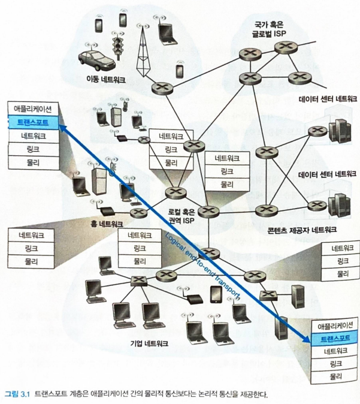

### 1. 트랜스포트 계층과 네트워크 계층 사이의 관계

두 계층의 차이는 "누구 사이의 통신을 책임지느냐"에 있다.

| 계층 | 논리적 통신의 주체 |
|---|---|
| 트랜스포트 계층 | 호스트에서 동작하는 **프로세스** 사이 |
| 네트워크 계층 | **호스트** 사이 |

즉 네트워크 계층은 호스트에서 호스트까지 데이터를 나르고, 트랜스포트 계층은 그 위에서 호스트 내부의 특정 프로세스까지 데이터를 이어 준다.

### 2. 인터넷 트랜스포트 계층의 개요

인터넷은 두 가지 트랜스포트 프로토콜을 제공하며, 애플리케이션 개발자는 이 중 하나를 명시해서 사용한다.

| 프로토콜 | 서비스 성격 |
|---|---|
| UDP | 비신뢰적(unreliable), 비연결형(connectionless) |
| TCP | 신뢰적(reliable), 연결지향형(connection-oriented) |

- 인터넷에서는 트랜스포트 계층 패킷을 **세그먼트**라고 부른다.
  - 다만 RFC에서는 TCP 패킷은 세그먼트, UDP 패킷은 데이터그램(datagram)으로 구분해 부르기도 한다.
- 인터넷 네트워크 계층 프로토콜은 **IP(Internet Protocol)** 라는 이름을 갖는다.
  - IP 서비스 모델은 호스트 간 논리적 통신을 제공하는 **최선형 전달(best-effort delivery) 서비스**다.
  - IP는 세그먼트를 전달하기 위해 최선을 다하지만 어떤 것도 보장하지 않는다. 세그먼트의 전달 자체도, 순서대로의 전달도 보장하지 않는다.
  - 이런 이유로 IP를 비신뢰적인 서비스라고 부른다.

#### UDP와 TCP가 하는 일

UDP와 TCP의 가장 기본적인 기능은, 종단 시스템 사이의 IP 전달 서비스를 종단 시스템에서 동작하는 두 **프로세스** 간의 전달 서비스로 확장하는 것이다. 이렇게 호스트 대 호스트 전달을 프로세스 대 프로세스 전달로 확장하는 작업을 **트랜스포트 계층 다중화(multiplexing)와 역다중화(demultiplexing)** 라고 한다.

| 서비스 | UDP | TCP |
|---|---|---|
| 다중화 / 역다중화 | O | O |
| 오류 검출(무결성 검사) | O | O |
| 신뢰적 데이터 전송 | X | O (순서 번호, 확인 응답, 타이머, 재전송) |
| 흐름 제어(flow control) | X | O |
| 혼잡 제어(congestion control) | X | O |

- UDP가 제공하는 서비스는 다중화/역다중화와 오류 검출, 이 두 가지뿐이다. 그래서 UDP는 IP와 마찬가지로 비신뢰적인 서비스다.
- TCP는 여기에 몇 가지를 더한다.
  - 흐름 제어, 순서 번호, 확인 응답, 타이머를 사용해 데이터가 송신 프로세스에서 수신 프로세스로 **순서대로 정확하게** 전달되도록 보장한다(신뢰적 데이터 전송).
  - **혼잡 제어**를 사용한다. 이는 특정 연결만을 위한 것이 아니라 인터넷 전체의 안정을 위한 일반 서비스다.

> TCP 혼잡 제어는 과도한 트래픽이 통신 경로상의 스위치와 링크를 혼잡하게 만드는 것을 방지한다. 각 TCP 연결이 링크 대역폭을 공평하게 나눠 쓰도록 한다.

## 2. 다중화와 역다중화

이 절은 네트워크 계층이 호스트까지 배달한 세그먼트를, 트랜스포트 계층이 어떻게 그 호스트 안의 올바른 프로세스(소켓)까지 이어 주는지를 다룬다.

목적지 호스트의 트랜스포트 계층은 바로 아래 네트워크 계층으로부터 세그먼트를 받아, 호스트에서 동작하는 애플리케이션 프로세스에게 그 데이터를 전달할 의무를 진다. 예를 들어 한 컴퓨터에서 FTP 세션 1개, 텔넷 세션 2개를 실행하면서 웹 페이지를 다운로드하고 있다면, 텔넷 프로세스 2개 + FTP 프로세스 1개 + HTTP 프로세스 1개, 총 4개의 네트워크 애플리케이션 프로세스가 데이터를 기다리고 있는 셈이다.

- 프로세스는 네트워크 애플리케이션의 한 부분으로서 **소켓(socket)** 을 갖는다.
  - 소켓은 네트워크에서 프로세스로, 또 프로세스에서 네트워크로 데이터를 전달하는 출입구 역할을 한다.
  - 트랜스포트 계층은 데이터를 프로세스에 직접 주는 게 아니라 중간 매개자인 소켓에게 전달한다.
- 각 소켓은 유일한 식별자를 가지며, 그 형식은 소켓이 UDP 소켓인지 TCP 소켓인지에 따라 달라진다.

세그먼트가 어떻게 올바른 소켓을 찾아가는지 보면, 트랜스포트 계층 세그먼트는 이 목적을 위해 몇 개의 필드를 갖고 있다. 수신 측은 이 필드를 검사해 세그먼트를 해당 소켓으로 보낸다.

| 용어 | 의미 |
|---|---|
| 역다중화(demultiplexing) | 수신한 세그먼트의 데이터를 **올바른 소켓으로 전달**하는 작업 |
| 다중화(multiplexing) | 출발지 호스트에서 여러 소켓의 데이터를 모아 각각 헤더 정보로 캡슐화해 세그먼트를 만들고 네트워크 계층으로 넘기는 작업 |

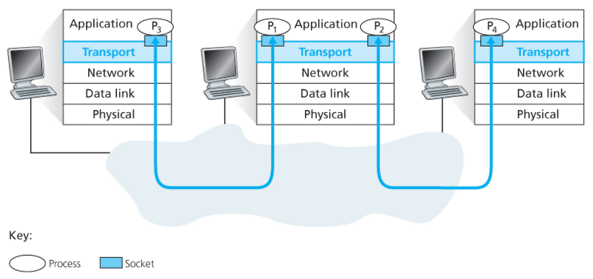

- 트랜스포트 계층은 네트워크 계층으로부터 받은 세그먼트를 반드시 역다중화해야 한다.
- 각 세그먼트는 자신이 전달될 소켓을 가리키는 특별한 필드를 갖는데, 이것이 **출발지 포트 번호(source port number)** 필드와 **목적지 포트 번호(destination port number)** 필드다.
  - 호스트의 각 소켓은 포트 번호를 할당받고, 세그먼트는 그에 상응하는 소켓으로 보내진다.

#### 1. 비연결형 다중화와 역다중화 (UDP)

- 잘 알려진 프로토콜의 서버 측을 구현한다면, 개발자는 그에 상응하는 **잘 알려진 포트 번호(well-known port number)** 를 할당해야 한다.
- 예를 들어 UDP 소켓 19157을 가진 프로세스가 UDP 소켓 46428을 가진 프로세스에게 데이터를 보내려 한다고 하자.
  - 출발지는 세그먼트를 생성·캡슐화해 전달한다.
  - 이때 출발지 포트 번호는 **회신 주소**의 일부로 사용된다(수신 측이 응답을 되돌려 보낼 곳).

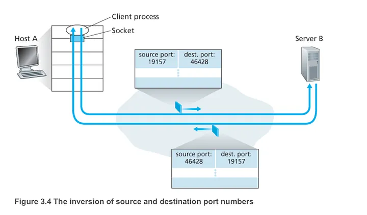

#### 2. 연결지향형 다중화와 역다중화 (TCP)

TCP 역다중화를 이해하려면 TCP 소켓과 연결 설정을 함께 봐야 한다. UDP 소켓과의 결정적 차이는 **식별에 쓰이는 값의 개수**다.

| 구분 | 소켓 식별 방식 |
|---|---|
| UDP 소켓 | (목적지 IP 주소, 목적지 포트 번호) 2-튜플 |
| TCP 소켓 | (출발지 IP 주소, 출발지 포트 번호, 목적지 IP 주소, 목적지 포트 번호) 4-튜플 |

- 호스트는 세그먼트를 올바른 소켓으로 역다중화하기 위해 이 4개 값을 모두 사용한다.
- 그래서 UDP와 달리, 출발지 주소나 출발지 포트 번호가 서로 다른 2개의 TCP 세그먼트는 (목적지가 같아도) 서로 다른 소켓으로 향한다.
- TCP 서버 애플리케이션은 **환영 소켓(welcoming socket)** 을 갖는다.
  - 이 소켓은 특정 포트(예: 12000)에서 TCP 클라이언트의 연결 설정 요청을 기다린다.
- TCP 클라이언트는 소켓을 생성하고 연결 설정 요청 세그먼트를 서버로 보낸다.
- 도착한 세그먼트의 (출발지 포트, 출발지 IP, 목적지 포트, 목적지 IP) 네 값이 어떤 소켓의 4-튜플과 일치하면, 세그먼트는 그 소켓으로 역다중화된다.
- 따라서 서버 호스트는 많은 TCP 소켓을 동시에 지원할 수 있다.

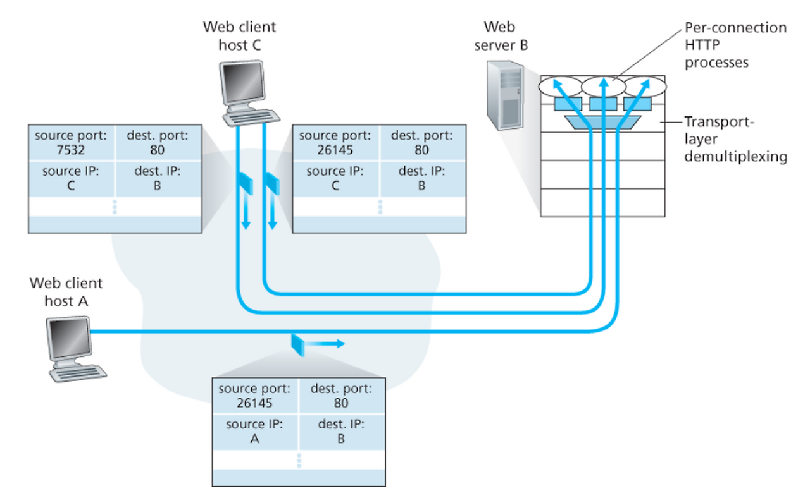

#### 3. 웹 서버와 TCP

- 웹 서버(예: 아파치)는 연결 소켓을 통해 HTTP 요청을 수신하고 응답을 전송한다.
- 다만 연결 소켓과 프로세스가 항상 일대일로 대응하는 것은 아니다.
  - 고성능 웹 서버는 하나의 프로세스만 사용하면서, 각 연결마다 새로운 **스레드**를 생성하기도 한다.
  - 이 경우 같은 프로세스 안에 많은 연결 소켓이 동시에 존재한다.
- HTTP 버전에 따라 TCP 연결 사용 방식이 다르다.

| HTTP 방식 | TCP 연결 |
|---|---|
| 지속(persistent) HTTP | 하나의 연결에서 여러 HTTP 메시지를 주고받음 |
| 비지속(non-persistent) HTTP | 요청/응답마다 새 TCP 연결을 생성·종료 → 서버에 심한 부담 |

## 3. 비연결형 트랜스포트: UDP

UDP는 트랜스포트 프로토콜이 할 수 있는 최소한만 한다. 다중화/역다중화와 간단한 오류 검사를 제외하면 IP에 아무것도 더하지 않으므로, UDP를 선택하는 것은 거의 IP와 직접 통신하는 것과 같다.

- UDP는 애플리케이션 프로세스로부터 메시지를 받아 출발지·목적지 포트 번호 필드와 다른 두 필드(길이, 체크섬)를 붙인 뒤, 완성된 세그먼트를 네트워크 계층으로 넘긴다.
- UDP는 핸드셰이크(handshake)를 하지 않으며, 이런 이유로 **비연결형**이라고 부른다.
- DNS는 UDP를 사용하는 대표적인 애플리케이션 계층 프로토콜의 예다.

### 왜 UDP를 쓰는가

TCP가 있는데도 UDP를 선택하는 이유는 다음과 같다.

#### 무슨 데이터를 언제 보낼지에 대한 정교한 제어

- 애플리케이션이 데이터를 UDP에 넘기면 UDP는 즉시 세그먼트로 만들어 바로 네트워크 계층으로 전달한다.
- 반면 TCP는 혼잡 제어 메커니즘 때문에, 신뢰적 전달이 끝날 때까지 세그먼트 전송이 지연될 수 있다.

#### 연결 설정이 없음

- TCP는 데이터 전송에 앞서 3-way 핸드셰이크를 하지만 UDP는 하지 않으므로 연결 설정에 따른 지연이 없다.
- 크롬 브라우저에서 사용하는 QUIC은 기본 트랜스포트로 UDP를 사용하고, 그 위에 애플리케이션 계층에서 신뢰성을 구현한다.

#### 연결 상태가 없음

- TCP는 종단 시스템에서 연결 상태(수신·송신 버퍼, 혼잡 제어 파라미터, 순서 번호 등)를 유지한다.
- UDP는 이런 파라미터를 전혀 기록하지 않는다. 그래서 서버가 더 많은 클라이언트를 동시에 감당할 수 있다.

#### 작은 패킷 헤더 오버헤드

- TCP는 세그먼트마다 20바이트의 헤더 오버헤드를 갖지만, UDP는 8바이트뿐이다.

### 그 밖의 특성

- 네트워크 관리 애플리케이션(예: SNMP)은 네트워크가 혼잡한 상황에서도 동작해야 하므로 UDP가 더 바람직하다.
- 적은 양의 패킷 손실을 허용할 수 있는 실시간 애플리케이션은 UDP를 사용한다. TCP의 혼잡 제어는 이런 애플리케이션에 오히려 나쁜 영향을 준다.
- 다만 모두가 혼잡 제어 없이 높은 비트율의 비디오 스트림을 쏟아내면 라우터에서 많은 패킷 오버플로가 발생할 수 있다. 이를 우려해, UDP 출발지도 적응적 혼잡 제어를 수행하게 하는 새로운 메커니즘이 제안되기도 했다.
- UDP를 쓰면서도 신뢰적인 데이터 전송은 가능하다. 신뢰성 보장 기능을 애플리케이션 자체에 구현하면 된다. 구현이 어렵지만, 신뢰성과 UDP의 장점을 모두 취하는 방법이다.

### 1. UDP 세그먼트 구조

- UDP 헤더는 각 2바이트씩 구성된 4개의 필드만을 갖는다(출발지 포트, 목적지 포트, 길이, 체크섬).
- 포트 번호는 역다중화 기능을 수행해, 데이터를 올바른 애플리케이션 프로세스로 넘기게 해 준다.
- 체크섬은 세그먼트에 오류가 발생했는지 검사하기 위해 수신 호스트가 사용한다.

### 2. UDP 체크섬

UDP 체크섬은 오류 검출을 위한 것으로, 세그먼트가 출발지에서 목적지로 이동하는 동안 내용이 변경되었는지를 검사한다.

- **계산 방법**: 세그먼트의 모든 16비트 워드를 합산한 뒤 그 결과에 1의 보수(complement)를 취한다. 이때 합산 과정에서 발생한 오버플로는 되돌려 더한다(윤회식 자리올림, wraparound). 이렇게 얻은 값을 UDP 세그먼트의 체크섬 필드에 삽입한다.
- **링크 계층이 오류 검사를 하는데도 UDP가 체크섬을 두는 이유**:
  - 모든 링크가 오류 검사를 제공한다는 보장이 없다.
  - 경로상의 어떤 링크가 오류 검사를 제공하지 않는 프로토콜을 사용할 수도 있기 때문이다.
- 따라서 UDP는 **종단 간(end-to-end) 기반**으로 트랜스포트 계층에서 오류 검사를 제공해야 한다. 이것이 **종단 간 원칙(end-to-end principle)** 의 한 예다.
- 단, UDP는 오류를 **검출**만 할 뿐 회복하기 위한 어떤 일도 하지 않는다(손상된 세그먼트를 버리거나 경고와 함께 애플리케이션에 넘긴다).

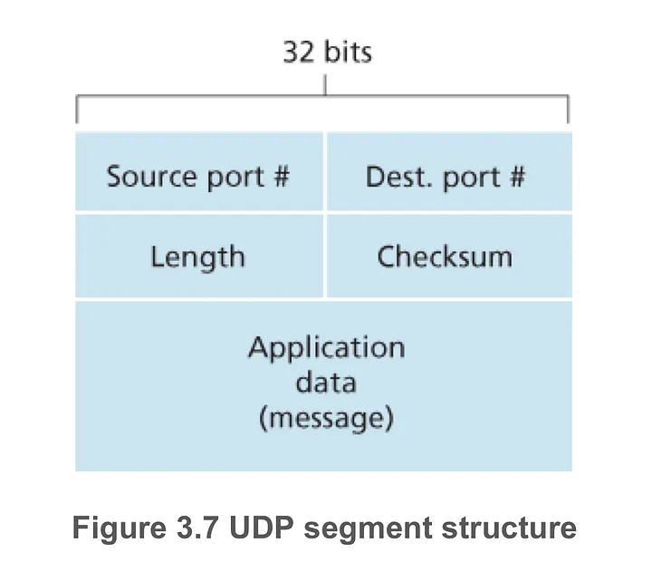

## 4. 신뢰적인 데이터 전송의 원리

신뢰적인 데이터 전송(rdt, reliable data transfer)은 트랜스포트 계층이 상위 계층에 제공하는 서비스 추상화다. 신뢰적인 채널에서는 전송된 데이터가 **손상되지도, 손실되지도 않으며, 보낸 순서대로 전달**된다. TCP가 인터넷 애플리케이션에게 제공하는 서비스 모델이 바로 이것이며, 이 추상화를 구현하는 것이 신뢰적인 데이터 전송 프로토콜의 임무다.

- 문제는 그 아래 계층(하위 채널)이 신뢰적이지 않다는 데 있다. 두 종단점 바로 아래 계층은 단일 물리적 링크일 수도 있고, 전 세계를 잇는 인터넷 네트워크일 수도 있으며, 이들은 비트 오류·패킷 손실을 일으킬 수 있다.
- 이 절은 **하위 채널이 점점 더 비신뢰적**이라고 가정을 강화해 가며, 그 위에서 신뢰적 전송을 보장하는 프로토콜을 단계적으로(rdt1.0 → rdt2.x → rdt3.0) 만들어 간다.

#### 인터페이스 용어

| 프로시저 | 호출 주체 / 의미 |
|---|---|
| `rdt_send()` | 송신 측 상위 계층이 호출. rdt에게 데이터를 넘겨 전송을 요청 |
| `udt_send()` | rdt가 호출. 비신뢰적(unreliable) 하위 채널로 패킷을 실제 전송 |
| `rdt_rcv()` | 하위 채널에 패킷이 도착하면 호출됨. 수신 측 rdt를 깨움 |
| `deliver_data()` | 수신 측 rdt가 호출. 추출한 데이터를 상위 계층으로 전달 |

- 여기서는 **단방향(unidirectional) 데이터 전송**, 즉 송신 측에서 수신 측으로의 데이터 흐름만 고려한다.
  - 양방향(전이중, full-duplex) 전송도 개념은 어렵지 않지만 설명이 복잡하다.
  - 단방향이라 해도, 송·수신 측은 데이터 패킷뿐 아니라 **제어 패킷(ACK/NAK 등)을 양방향으로** 주고받아야 한다.

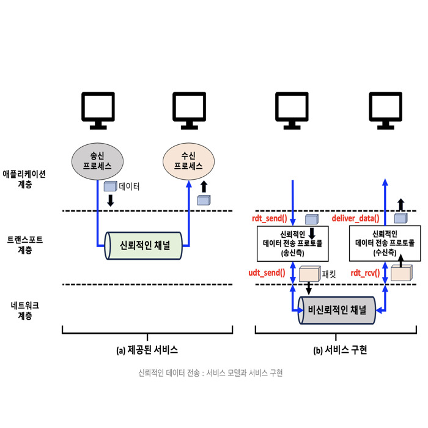

### 1. 신뢰적인 데이터 전송 프로토콜의 구축

각 프로토콜의 동작은 송신자와 수신자에 대해 **각각 분리된 유한 상태 머신(FSM, Finite State Machine)** 으로 정의한다. FSM에서 전이를 일으키는 **이벤트**는 전이 화살표의 **가로선 위**에, 그때 취하는 **액션**은 **가로선 아래**에 표기하며, 초기 상태는 점선 화살표로 나타낸다.

#### 1. 완벽하게 신뢰적인 채널에서의 전송: rdt1.0

가장 단순한 경우로, 하위 채널이 완전히 신뢰적이라고 가정한다.

- 송신자·수신자 FSM은 각각 **상태를 하나만** 갖는다.
- 송신 측: `rdt_send` 이벤트로 상위 계층에서 데이터를 받아 패킷을 만들고(`make_pkt`) 채널로 보낸다(`udt_send`).
- 수신 측: `rdt_rcv` 이벤트로 하위 채널에서 패킷을 받아 데이터를 추출한 뒤(`extract`) 상위 계층으로 전달한다(`deliver_data`).
- 채널이 완전히 신뢰적이라 오류가 생길 수 없으므로, **수신 측이 송신 측에게 어떤 피드백도 줄 필요가 없다.**

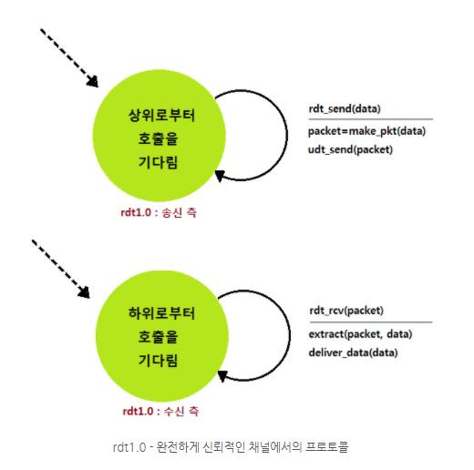

#### 2. 비트 오류가 있는 채널에서의 전송: rdt2.0

이제 하위 채널에서 패킷의 **비트가 손상될 수 있다**고 가정을 강화한다(패킷은 여전히 보낸 순서대로 도착한다고 가정). 비트 오류는 패킷이 전송·전파·버퍼링되는 물리적 구성요소에서 흔히 발생한다.

이를 해결하려면 받아쓰기(dictation)에서처럼 긍정/부정 확인응답이 필요하다. 이렇게 **재전송을 기반으로 하는 프로토콜을 자동 재전송 요구(ARQ, Automatic Repeat reQuest) 프로토콜**이라 하며, ARQ에는 세 가지 기능이 요구된다.

| 기능 | 설명 |
|---|---|
| 오류 검출(error detection) | 비트 오류를 수신자가 검출할 수 있어야 한다. 인터넷 체크섬 필드를 사용한다 |
| 수신자 피드백(receiver feedback) | 긍정 확인응답(ACK)과 부정 확인응답(NAK)으로 수신 상태를 송신자에게 알린다 |
| 재전송(retransmission) | 오류가 있는 채로 수신된 패킷은 송신자가 다시 보낸다 |

- **송신 측 FSM은 상태가 2개**다.
  - `rdt_send`가 발생하면 체크섬을 포함한 패킷을 만들어 전송하고, 수신자로부터의 **ACK/NAK를 기다리는 상태**로 넘어간다.
  - 이 대기 상태에서는 상위 계층에서 새 데이터를 받아들일 수 없다. 이런 성질 때문에 rdt2.0을 **전송 후 대기(stop-and-wait) 프로토콜**이라 부른다.
- 수신 측 FSM은 여전히 단일 상태이며, 수신 패킷의 손상 여부에 따라 ACK 또는 NAK로 응답한다.

**결정적 결함**: rdt2.0은 **ACK/NAK 패킷 자체가 손상될 가능성**을 고려하지 않았다. 이를 해결하려면 ACK/NAK에도 체크섬을 붙이고, 데이터 패킷에 **순서 번호(sequence number)** 필드를 추가한다. 수신자는 순서 번호만 보면 그 패킷이 새 패킷인지 재전송인지 구분할 수 있다.

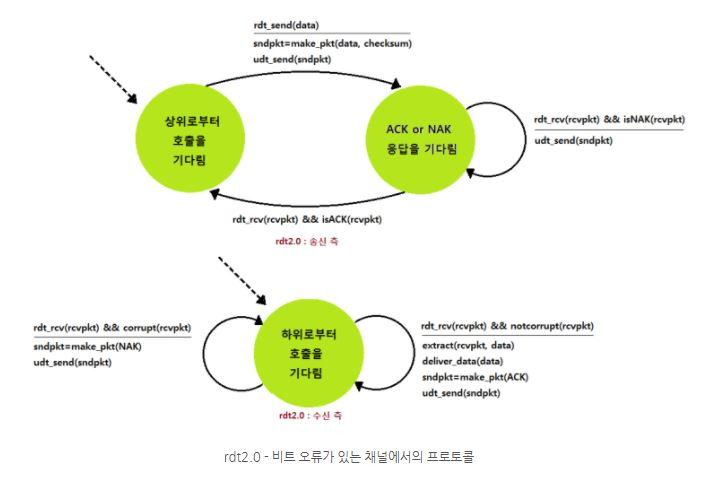

#### 3. rdt2.1과 rdt2.2

**rdt2.1** 은 순서 번호를 도입해 rdt2.0의 결함을 보완한 버전이다.

- 상태 수가 이전의 **두 배**가 된다. 지금 다루는 패킷의 순서 번호가 0인지 1인지를 프로토콜 상태가 반영해야 하기 때문이다.
- 순서 번호 0을 다루는 상태와 1을 다루는 상태는 순서 번호만 다를 뿐 서로 **거울상(mirror image)** 이다.
- 수신자는 순서가 어긋난(손상된) 패킷을 받으면, 방금 받은 것이 아니라 **직전에 정확히 받은 패킷에 대한 ACK를 다시 보낸다.** 이렇게 하면 NAK를 따로 두지 않고도 NAK와 같은 효과를 낸다.
- 같은 패킷에 대해 ACK를 **두 번** 받은 송신자는, 수신자가 그 다음 패킷을 제대로 받지 못했음을 알 수 있다.

**rdt2.2** 는 rdt2.1에서 **NAK를 완전히 없앤(NAK-free)** 버전이다. 차이는 다음과 같다.

- 수신자는 ACK 메시지에 **확인응답 대상 패킷의 순서 번호를 반드시 포함**해야 한다.
- 송신자는 받은 ACK가 어떤 순서 번호에 대한 것인지 **반드시 검사**해야 한다.

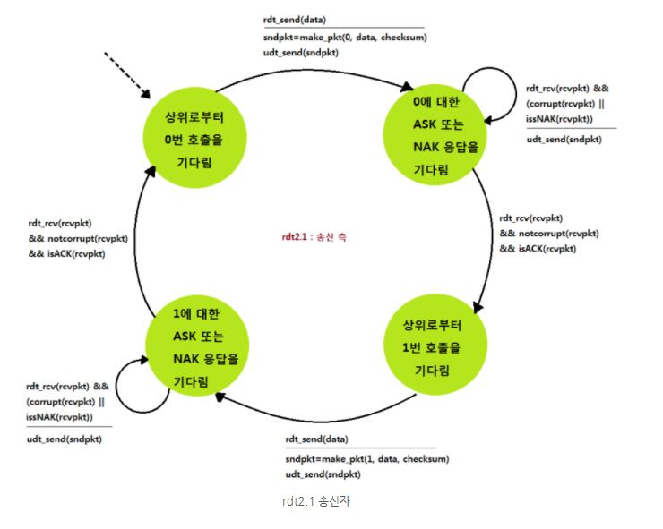
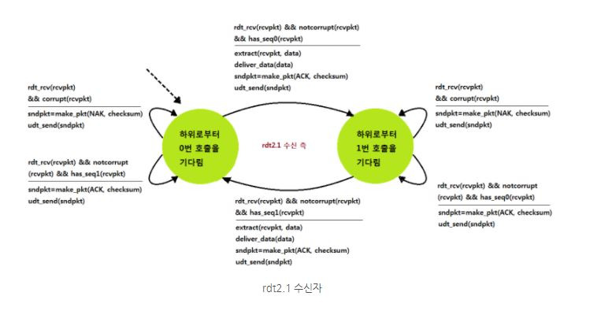

#### 4. 비트 오류와 손실이 있는 채널에서의 전송: rdt3.0

마지막으로 채널이 비트 손상뿐 아니라 **패킷을 손실**할 수도 있다고 가정한다. 두 가지 새 물음이 생긴다 — (1) 손실을 어떻게 검출하고, (2) 손실이 발생하면 무엇을 할 것인가. 체크섬·순서 번호·ACK·재전송은 (2)를 해결해 주지만, (1)을 위해서는 새로운 메커니즘이 필요하다.

- **손실 검출은 송신자에게 맡긴다.** 송신자는 패킷을 보낸 뒤 왕복 시간(RTT)보다 충분히 긴 시간을 기다렸는데도 ACK가 오지 않으면, 패킷(또는 그 ACK)이 손실됐다고 보고 **재전송**한다.
  - 이 방식은 중복 패킷을 만들 수 있지만, 이미 도입한 **순서 번호**로 처리할 수 있다.
- 이를 위해 송신자는 **카운트다운 타이머(countdown timer)** 를 사용한다. 매 패킷을 보낼 때 타이머를 시작하고, 타이머 인터럽트에 반응해 재전송하며, ACK가 오면 타이머를 멈춘다.
- rdt3.0은 순서 번호가 0과 1을 오가므로 **얼터네이팅 비트 프로토콜(alternating-bit protocol)** 이라고도 부른다.

> 체크섬, 순서 번호, 타이머, 긍정/부정 확인응답 패킷 — 이들이 각각 필수적인 역할을 맡아 비로소 비신뢰적 채널 위에서 신뢰적 전송이 완성된다.

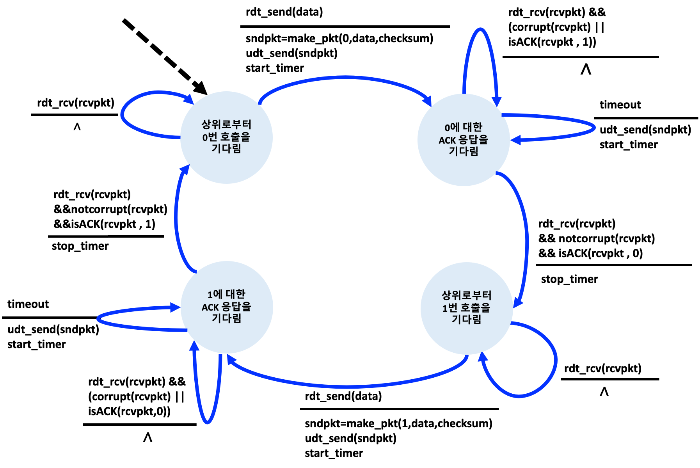

### 2. 파이프라이닝된 신뢰적인 데이터 전송 프로토콜

rdt3.0은 기능적으로는 정확하지만, **전송 후 대기 방식**이라는 근본적인 성능 문제가 있다. 송신자가 패킷 하나를 보낸 뒤 ACK가 올 때까지 다음 패킷을 못 보내기 때문에, 고속 네트워크에서 링크를 거의 놀린다.

**(보충) 왜 전송 후 대기가 비효율적인가 — 수치 예시**

교재의 예를 들면, 대륙을 잇는 다음과 같은 링크를 생각한다.

- 링크 속도 R = 1 Gbps(109 bps), 편도 전파 지연 15 ms(→ RTT ≈ 30 ms), 패킷 크기 L = 8000비트(1 KB)
- 전송 지연 dtrans = L / R = 8000 / 109 = 0.008 ms
- 송신자 이용률(utilization):

> Usender = (L / R) / (RTT + L / R) = 0.008 / (30 + 0.008) ≈ **0.00027**

즉 1 Gbps 링크에서 실제로는 약 267 kbps의 처리율밖에 못 낸다. 30 ms마다 겨우 1 KB만 보내는 셈이라, 값비싼 링크가 거의 낭비된다.

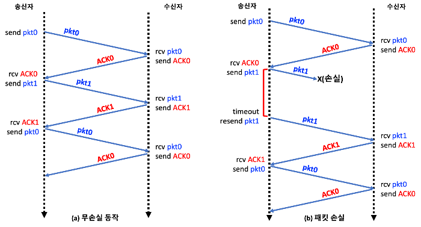

**해결책: 파이프라이닝(pipelining)** — 확인응답을 기다리지 않고 여러 패킷을 연이어 전송하도록 허용한다. 아직 확인응답되지 않은 패킷들이 송신자→수신자 경로(파이프라인)를 채우게 되며, 이는 다음과 같은 파급 효과를 낳는다.

- 순서 번호의 범위가 **커져야 한다**(더 이상 0/1로는 부족하다).
- 송·수신 양측이 패킷을 **하나 이상 버퍼링**해야 한다. 최소한 송신자는 전송했지만 확인응답되지 않은 패킷을 버퍼에 갖고 있어야 한다.
- 필요한 순서 번호 범위와 버퍼링 조건은, 프로토콜이 손실·손상·지연 패킷에 **어떻게 대응하느냐**에 따라 달라진다.

파이프라인 오류 회복의 두 가지 기본 접근이 **GBN(N부터 반복, Go-Back-N)** 과 **SR(선택적 반복, Selective Repeat)** 이다.

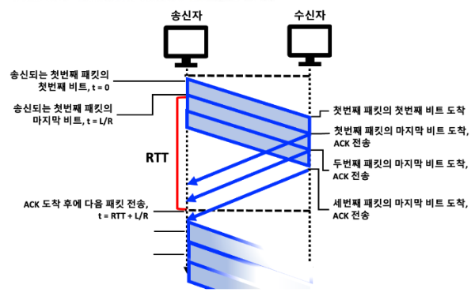

### 3. GBN(Go-Back-N)

GBN에서 송신자는 확인응답을 기다리지 않고 여러 패킷을 전송하되, **확인응답되지 않은 패킷 수가 최대 N을 넘지 않도록** 제한한다. 이 N을 **윈도우 크기(window size)** 라 하고, 윈도우가 순서 번호 공간을 미끄러지듯 이동하므로 GBN을 **슬라이딩 윈도우(sliding-window) 프로토콜**이라 부른다.

`base`(확인응답되지 않은 가장 오래된 패킷의 순서 번호)와 `nextseqnum`(전송될 다음 패킷의 순서 번호)를 기준으로, 순서 번호 공간은 네 구간으로 나뉜다.

| 구간 | 의미 |
|---|---|
| `[0, base-1]` | 이미 전송되고 확인응답까지 완료된 패킷 |
| `[base, nextseqnum-1]` | 전송됐지만 아직 확인응답되지 않은 패킷 |
| `[nextseqnum, base+N-1]` | 상위 계층에서 데이터가 오면 즉시 전송 가능한 패킷(윈도우의 여유분) |
| `base+N 이상` | 파이프라인의 확인응답이 도착하기 전까지는 사용 불가 |

- 순서 번호는 패킷 헤더의 고정 길이 필드에 담긴다. 필드가 k비트면 순서 번호 범위는 `[0, 2``k`` - 1]`이고, 관련 계산은 모두 모듈러 2k 연산을 쓴다.
- 참고로 TCP는 32비트 순서 번호 필드를 가지며, 순서 번호는 패킷 단위가 아니라 **바이트 스트림에서의 바이트를 세는 수**다.

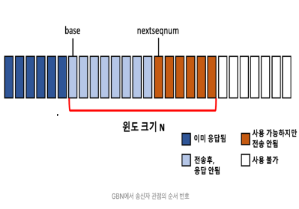

`base`와 `nextseqnum` 변수 및 이를 참조하는 조건부 동작이 추가되어, GBN의 FSM을 **확장된 FSM(extended FSM)** 이라 한다. GBN 송신자는 세 종류의 이벤트에 반응한다.

| 이벤트 | 동작 |
|---|---|
| 상위로부터의 호출(`rdt_send`) | 윈도우가 가득 찼는지(확인응답 안 된 패킷이 N개인지) 확인. 여유가 있으면 패킷을 만들어 전송하고 변수를 갱신, 가득 찼으면 데이터를 상위로 되돌린다 |
| ACK 수신 | 순서 번호 n에 대한 ACK를 **누적 확인응답(cumulative ACK)** 으로 해석한다. 즉 n을 포함해 n까지의 모든 패킷이 정확히 수신됐다는 뜻 |
| 타임아웃 | 타임아웃이 나면 **확인응답되지 않은 모든 패킷을 다시 보낸다.** 프로토콜 이름 "Go-Back-N"이 여기서 유래한다 |

- **수신자 동작은 단순하다.** 순서 번호 n인 패킷이 오류 없이 **순서대로** 오면 상위로 전달하고 n에 대한 ACK를 보낸다. 그 외(순서가 어긋나거나 손상)에는 **패킷을 버리고**, 가장 최근에 순서대로 받은 패킷에 대한 ACK를 재전송한다.
- 따라서 GBN 수신자는 **순서가 어긋난 패킷을 버퍼링하지 않는다.**

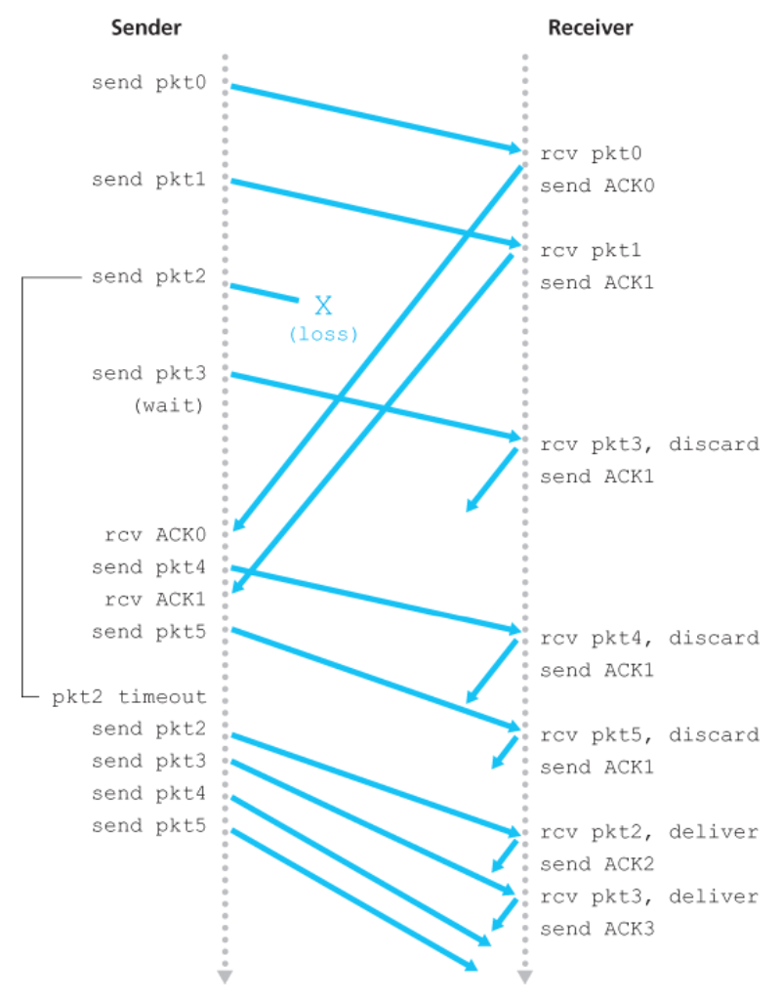

### 4. SR(Selective Repeat)

GBN은 파이프라이닝으로 이용률 문제를 해결하지만, **하나의 오류 때문에 그 뒤 패킷들까지 모두 재전송**하는 약점이 있다. 윈도우 크기와 대역폭·지연 곱이 모두 커서 파이프라인에 패킷이 많을수록 이 불필요한 재전송이 심해진다.

SR은 이를 개선해, **오류가 난 패킷만 골라서 재전송**한다. 개별 재전송에는 개별 확인응답이 따르며, 수신자는 순서가 어긋난 패킷도 **버퍼에 저장**해 두었다가 빠진 패킷이 채워지는 순간 일련의 패킷을 순서대로 상위 계층에 올린다.

> 예: 패킷 2가 빠지고 3, 4, 5가 먼저 도착하면, 수신자는 3·4·5를 버퍼에 담아 두고 2가 도착한 시점에 2, 3, 4, 5를 한꺼번에 상위 계층으로 전달한다.

#### SR 송신자 동작

| 이벤트 | 동작 |
|---|---|
| 상위로부터 데이터 수신 | 다음 순서 번호가 송신자 윈도우 안이면 패킷으로 전송, 아니면 (GBN처럼) 버퍼에 두거나 나중에 전송하기 위해 되돌린다 |
| 타임아웃 | 각 패킷마다 **자신의 논리 타이머**가 있어야 한다. 타임아웃 시 그 패킷 하나만 재전송하기 때문 |
| ACK 수신 | 해당 패킷을 수신됨으로 표시. 그 순서 번호가 `send_base`와 같으면, 윈도우 베이스를 아직 확인응답되지 않은 가장 작은 순서 번호로 옮긴다(윈도우 전진) |

#### SR 수신자 동작

| 수신 패킷의 순서 번호 | 동작 |
|---|---|
| `[rcv_base, rcv_base+N-1]` (윈도우 내) | 선택적 ACK를 회신. 처음 받은 패킷이면 버퍼에 저장(순서가 맞으면 이어서 상위로 전달하고 윈도우 전진) |
| `[rcv_base-N, rcv_base-1]` (이미 확인응답한 범위) | 이전에 확인응답했더라도 **ACK를 다시 생성**해 보낸다 |
| 그 외 | 패킷을 무시한다 |

이미 확인응답한 패킷에 대해 **재확인응답(re-ACK)** 하는 것이 SR의 핵심이다. 이 ACK가 없으면 송신자 윈도우가 앞으로 나아가지 못하기 때문이다. 그래서 **SR에서는 송신자 윈도우와 수신자 윈도우가 항상 같지 않다.**

**(보충) 윈도우 크기의 제약 — 순서 번호 재사용 문제**

SR에는 미묘한 함정이 있다. 순서 번호 공간이 유한하고 재사용되기 때문에, 윈도우 크기를 잘못 잡으면 수신자가 **새 패킷과 재전송된 옛 패킷을 구분하지 못한다.**

> 예: 순서 번호가 {0, 1, 2, 3}(k=2, 4개)뿐인데 윈도우 크기를 3으로 잡았다고 하자. 송신자가 0·1·2를 보내 수신자가 모두 ACK했지만 그 ACK가 전부 손실되면, 송신자는 0·1·2를 재전송한다. 한편 ACK가 잘 도착한 다른 시나리오에서는 송신자가 새 패킷 3·0·1을 보낸다. 두 경우 모두 수신자에게는 순서 번호 0인 패킷이 도착하는데, 수신자는 이것이 **재전송된 옛 0인지, 한 바퀴 돈 새 0인지** 알 방법이 없다.

이 때문에 **SR의 윈도우 크기는 순서 번호 공간 크기의 절반 이하**여야 한다(N ≤ 2k-1).

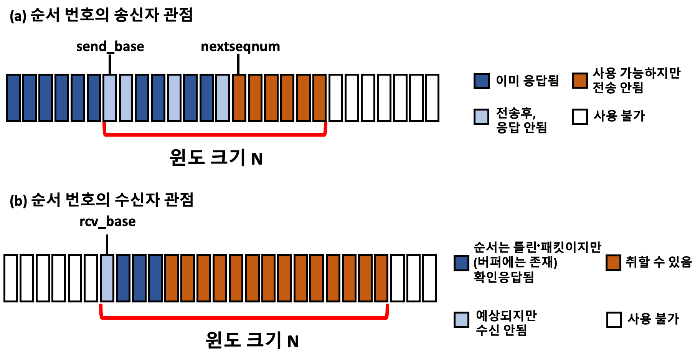

#### 순서가 바뀌는 채널

지금까지는 "패킷이 채널 안에서 순서가 뒤바뀌지 않는다"고 가정했다. 이는 송·수신자가 단일 물리 회선으로 연결될 때는 타당하지만, 둘을 잇는 것이 **네트워크**일 때는 성립하지 않는다 — 패킷이 버퍼에 저장됐다가 임의의 시점에 나올 수 있어 순서가 바뀔 수 있다.

- 순서가 바뀌면 같은 순서 번호가 **너무 이르게 재사용**되어 옛 패킷이 새 패킷으로 오인될 수 있다.
- 따라서 순서 번호 x인 패킷이 네트워크에 더 이상 남아 있지 않다고 확신하기 전에는 그 번호를 재사용하지 않아야 한다.
- 실제로 TCP 확장에서는 패킷의 최대 수명(maximum packet lifetime)을 약 3분으로 가정한다.

### 5. 신뢰적 데이터 전송 메커니즘 요약

지금까지 등장한 메커니즘과 그 용도를 정리하면 다음과 같다.

| 메커니즘 | 용도 |
|---|---|
| 체크섬(checksum) | 전송된 패킷의 비트 오류를 검출한다 |
| 순서 번호(sequence number) | 데이터 패킷에 순번을 매겨 손실·중복을 검출하고 순서를 확인한다 |
| 타이머(timer) | 패킷(또는 ACK) 손실 시 타임아웃으로 재전송을 유발한다. 지연이 크면 불필요한 중복 재전송이 생길 수 있다 |
| 확인응답(ACK) | 패킷(또는 패킷 집합)이 정확히 수신됐음을 송신자에게 알린다. 개별 ACK와 누적 ACK가 있다 |
| 부정 확인응답(NAK) | 패킷이 잘못 수신됐음을 송신자에게 알린다 |
| 윈도우·파이프라이닝 | 송신자가 확인응답되지 않은 여러 패킷을 동시에 전송하도록 허용해 이용률을 높인다. 윈도우 크기는 처리율·흐름 제어·혼잡 제어에 따라 정해진다 |

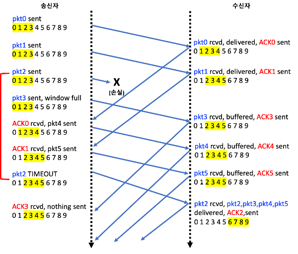