## 5. 연결지향형 트랜스포트: TCP

TCP는 앞 절에서 다룬 신뢰적 데이터 전송의 원리들을 실제로 구현한 프로토콜이다. 오류 검출, 재전송, 누적 확인응답, 타이머, 그리고 순서 번호·확인응답 번호를 위한 헤더 필드를 모두 포함한다.

### 1. TCP 연결

TCP는 데이터를 주고받기 전에 두 프로세스가 먼저 **핸드셰이크(handshake)** 를 해야 하므로 연결지향형(connection-oriented)이라 부른다. 이때 데이터 전송을 보장하기 위한 파라미터를 서로 설정하는 사전 세그먼트들을 주고받고, 연결의 양단은 연결과 관련된 여러 TCP 상태 변수를 초기화한다.

- TCP 연결은 회선 교환 네트워크의 TDM/FDM 같은 물리적 회선이 **아니다.**
  - 연결은 두 종단 시스템의 TCP가 **상태를 공유하는 논리적인 것**이다.
  - TCP 프로토콜은 오직 종단 시스템에서만 동작하고 중간 네트워크 요소(라우터, 스위치)에서는 동작하지 않으므로, 중간 요소들은 TCP 연결의 존재를 전혀 알지 못한다.

TCP 연결의 성질은 다음 두 가지로 요약된다.

| 성질 | 의미 |
|---|---|
| 전이중(full-duplex) | A→B, B→A 양방향으로 동시에 데이터 전송이 가능하다 |
| 점대점(point-to-point) | 항상 단일 송신자와 단일 수신자 사이의 연결이다. 한 번의 송신으로 여러 수신자에게 보내는 **멀티캐스팅은 불가능**하다 |

#### 연결 설정 과정

연결을 먼저 시작하는 프로세스를 클라이언트, 상대를 서버 프로세스라 부른다.

1. 클라이언트 애플리케이션이 "서버와 연결하고 싶다"고 자신의 TCP에게 알리면, 클라이언트 트랜스포트 계층이 서버 TCP와의 연결 설정을 진행한다(첫 번째 특별한 세그먼트).
2. 서버가 두 번째 특별한 세그먼트로 응답한다.
3. 클라이언트가 세 번째 특별한 세그먼트로 다시 응답한다.

- 처음 2개의 세그먼트에는 페이로드(애플리케이션 계층 데이터)가 없고, **세 번째 세그먼트는 페이로드를 포함할 수 있다.**
- 이 설정 절차를 **세 방향 핸드셰이크(three-way handshake)** 라 부른다.

#### 버퍼와 MSS

연결이 설정되면 양쪽은 서로 데이터를 보낼 수 있다. 이때 데이터는 곧바로 네트워크로 나가지 않고 **송신 버퍼**를 거친다.

- 애플리케이션이 소켓으로 넘긴 데이터는 세 방향 핸드셰이크 동안 준비된 **송신 버퍼**에 쌓인다.
- TCP는 때때로 송신 버퍼에서 데이터 묶음을 꺼내 세그먼트로 만들어 네트워크로 보낸다.
- 하나의 세그먼트에 담을 수 있는 최대 데이터 양은 **최대 세그먼트 크기(MSS, Maximum Segment Size)** 로 제한된다.
  - MSS는 보통 가장 큰 링크 계층 프레임의 길이인 **MTU(Maximum Transmission Unit)** 로부터 결정된다. TCP 세그먼트와 TCP/IP 헤더를 합친 길이가 단일 링크 계층 프레임에 딱 맞도록 정한다.
  - 이더넷과 PPP 링크 계층 프로토콜은 MTU가 1,500바이트이므로, **MSS의 일반적인 값은 1,460바이트**다(1500 − IP 헤더 20 − TCP 헤더 20).

> 주의: MSS는 세그먼트 전체 크기가 아니라 **세그먼트에 담기는 애플리케이션 데이터의 최대 크기**다.

- 수신 측에 도착한 세그먼트의 데이터는 **수신 버퍼**에 놓이고, 애플리케이션은 이 버퍼에서 바이트 스트림을 읽는다.
- 연결의 양 끝은 각각 자신의 송신 버퍼와 수신 버퍼를 갖는다.
- 결국 TCP 연결이란 **양쪽 호스트의 버퍼·변수·소켓의 집합**이며, 중간 네트워크 요소에는 어떤 버퍼나 변수도 할당되지 않는다.

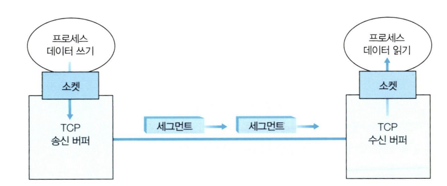

### 2. TCP 세그먼트 구조

TCP 세그먼트는 헤더 필드와 데이터 필드로 구성된다. 데이터 필드에는 애플리케이션 데이터가 담기며, 그 크기는 MSS로 제한된다.

- 큰 파일을 전송할 때는 파일을 MSS 크기로 분절한다.
- 반면 대화형 애플리케이션은 MSS보다 훨씬 작은 데이터를 보낸다. 예를 들어 텔넷이나 SSH 같은 원격 로그인에서는 데이터 필드가 **1바이트**뿐일 수도 있다.
- TCP 헤더는 일반적으로 20바이트(UDP 헤더보다 12바이트 크다)이므로, 텔넷이 보내는 세그먼트는 겨우 21바이트짜리가 된다.

헤더의 주요 필드는 다음과 같다.

| 필드 | 크기 | 용도 |
|---|---|---|
| 출발지 / 목적지 포트 번호 | 각 16비트 | 다중화·역다중화 (UDP와 동일) |
| 순서 번호(sequence number) | 32비트 | 신뢰적 데이터 전송 |
| 확인응답 번호(acknowledgment number) | 32비트 | 신뢰적 데이터 전송 |
| 수신 윈도우(receive window) | 16비트 | 흐름 제어. 수신자가 받아들일 수 있는 바이트 수 |
| 헤더 길이 | 4비트 | 32비트 워드 단위의 TCP 헤더 길이(옵션 때문에 가변) |
| 옵션(option) | 가변 | MSS 협상, 고속 네트워크용 윈도우 확장 요소 등 |
| 플래그(flag) | 6비트 | 아래 표 참고 |
| 체크섬(checksum) | 16비트 | 오류 검출 (UDP와 동일) |

#### 플래그 비트

| 비트 | 의미 |
|---|---|
| ACK | 확인응답 번호 필드가 유효함을 나타낸다 |
| SYN | 연결 설정에 사용 |
| FIN | 연결 해제에 사용 |
| RST | 연결 재설정(리셋)에 사용 |
| PSH | 설정되면 수신자가 데이터를 즉시 상위 계층으로 전달해야 함 |
| URG | 긴급 데이터가 있음을 표시. 긴급 데이터의 마지막 바이트 위치는 16비트 **긴급 데이터 포인터** 필드가 가리킨다 |

> 실제로 PSH, URG와 긴급 데이터 포인터는 오늘날 거의 사용되지 않는다.

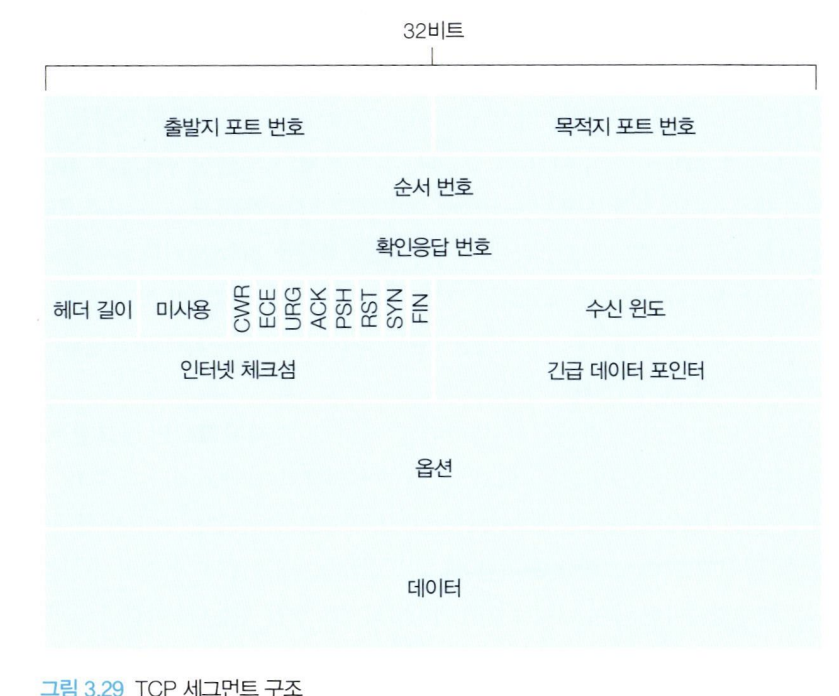

#### 1. 순서 번호와 확인응답 번호

헤더에서 가장 중요한 두 필드는 순서 번호와 확인응답 번호이며, 이는 신뢰적 데이터 전송 서비스의 핵심이다.

**순서 번호**를 이해하는 열쇠는, TCP가 데이터를 **구조 없이 순서대로 정렬된 바이트 스트림**으로 본다는 점이다. 순서 번호는 전송된 *세그먼트*를 세는 번호가 아니라 *바이트 스트림*에 매겨진 번호이며, 한 세그먼트의 순서 번호는 **그 세그먼트에 담긴 첫 번째 바이트의 바이트 스트림 번호**다.

**(보충) 순서 번호 예시**

> 호스트 A가 500,000바이트 파일을 MSS 1,000바이트로 전송한다고 하자. 첫 바이트의 번호를 0이라 하면 TCP는 500개의 세그먼트를 만든다.
>
> | 세그먼트 | 담긴 바이트 | 순서 번호 |
> |---|---|---|
> | 1번째 | 0 ~ 999 | 0 |
> | 2번째 | 1000 ~ 1999 | 1000 |
> | 3번째 | 2000 ~ 2999 | 2000 |
> | … | … | … |
>
> 즉 각 세그먼트의 순서 번호는 그 안의 첫 바이트 번호이고, 이 값이 헤더의 순서 번호 필드에 들어간다.

**확인응답 번호**는 조금 더 까다롭다. TCP가 전이중이므로, 호스트 A가 B에게 보내는 세그먼트에는 **A가 B로부터 받은 데이터**에 대한 확인응답이 실린다. 확인응답 번호는 "지금까지 잘 받았으니 **다음에 기대하는 바이트**의 번호"다.

**(보충) 확인응답 번호 예시**

> 호스트 A가 B로부터 0~535번 바이트를 모두 받았다면, A는 B에게 보내는 세그먼트의 확인응답 번호를 **536**으로 채운다.
>
> 만약 A가 0~535번과 900~1000번은 받았지만 536~899번을 아직 못 받았다면, 확인응답 번호는 여전히 **536**이다. TCP는 **누적 확인응답(cumulative acknowledgment)** 을 제공하기 때문에, 스트림에서 빠짐없이 이어진 부분까지만 확인응답한다.

그렇다면 순서가 어긋난 세그먼트를 받은 호스트는 어떻게 해야 할까? TCP RFC는 이에 대해 어떤 규칙도 정해 두지 않고 **개발자의 선택**에 맡긴다.

| 선택지 | 설명 |
|---|---|
| 즉시 버린다 | 구현이 단순하지만 재전송이 늘어난다 |
| 버퍼에 보유하고 빈 부분을 기다린다 | 대역폭 면에서 효율적이며, **실제로 사용되는 방식**이다 |

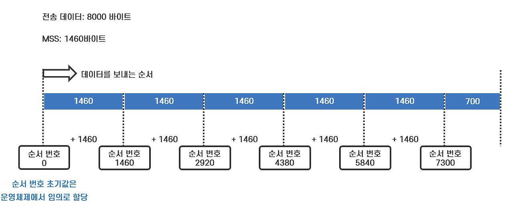

#### 2. 텔넷: 순서 번호와 확인응답 번호 사례 연구

텔넷(Telnet)은 원격 로그인에 사용되는 애플리케이션 계층 프로토콜로, TCP 위에서 한 쌍의 호스트 사이에 동작한다. 사용자가 키를 하나 누를 때마다 그 문자가 서버로 전송되고, 서버는 받은 문자를 다시 클라이언트로 되돌려 보내(에코) 화면에 표시하는 **대화형 애플리케이션**이다.

**(보충) 전체 시나리오** — 클라이언트의 초기 순서 번호를 42, 서버의 초기 순서 번호를 79라 하고, 사용자가 문자 `C` 하나를 입력한 상황을 따라가 보자.

| 순서 | 방향 | Seq | Ack | 데이터 | 설명 |
|---|---|---|---|---|---|
| 1 | 클라이언트 → 서버 | 42 | 79 | `C` | 사용자가 입력한 `C` 1바이트를 전송. 아직 서버로부터 받은 데이터가 없으므로 79번 바이트를 기다린다는 뜻으로 Ack=79 |
| 2 | 서버 → 클라이언트 | 79 | 43 | `C` | 두 가지 목적을 겸한다 — (1) 받은 `C`를 에코해 돌려주고, (2) 42번 바이트를 잘 받았으니 다음은 43번을 기다린다고 알린다 |
| 3 | 클라이언트 → 서버 | 43 | 80 | (없음) | 서버가 보낸 에코 `C`(79번 바이트)를 잘 받았으므로 다음으로 80번을 기다린다는 확인응답 |

2번 세그먼트가 핵심이다. 서버는 확인응답만 담은 세그먼트를 따로 보내지 않고, **자신이 보낼 데이터(에코 문자)에 확인응답을 얹어서** 함께 보냈다. 이렇게 데이터 세그먼트에 확인응답을 실어 보내는 것을 **피기백(piggyback)** 이라 한다.

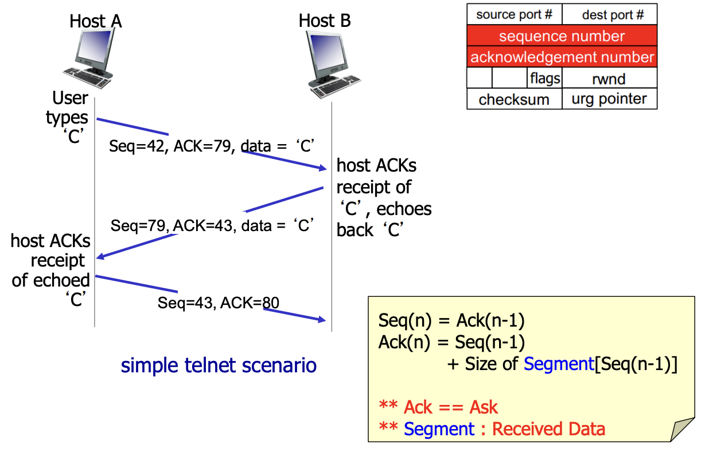

### 3. 왕복 시간(RTT) 예측과 타임아웃

TCP는 손실 세그먼트를 발견하기 위해 타임아웃/재전송 메커니즘을 사용한다. 타임아웃 주기는 세그먼트를 보낸 시점부터 확인응답을 받을 때까지 걸리는 **왕복 시간(RTT, Round-Trip Time)** 보다 커야 한다. 문제는 RTT가 고정값이 아니라는 점이다.

#### 1. 왕복 시간 예측

- `SampleRTT`는 세그먼트를 보낸 시각부터 그 확인응답을 받은 시각까지의 실측 시간이다.
  - 대부분의 TCP는 **모든** 세그먼트가 아니라 **한 번에 하나의 세그먼트에 대해서만** SampleRTT를 측정한다. 결과적으로 대략 RTT마다 새로운 SampleRTT 값을 하나씩 얻는다.
  - **재전송된 세그먼트에 대해서는 SampleRTT를 측정하지 않는다.**
- SampleRTT는 라우터의 혼잡, 종단 시스템의 부하 변화 때문에 세그먼트마다 들쭉날쭉하다. 그래서 개별 값이 아니라 **평균값**으로 RTT를 추정한다.

이때 쓰는 것이 **지수적 가중 이동 평균(EWMA, Exponential Weighted Moving Average)** 이다.

> EstimatedRTT = (1 − α) × EstimatedRTT + α × SampleRTT   (권장값 α = 0.125)

새 표본에 작은 가중치를 주므로 최근 값을 반영하면서도 급격한 요동에 흔들리지 않는다. 과거 표본의 영향력이 지수적으로 감소하기 때문에 "지수적 가중"이라 부른다.

RTT의 **변동 폭**도 함께 추정한다.

> DevRTT = (1 − β) × DevRTT + β × | SampleRTT − EstimatedRTT |   (권장값 β = 0.25)

#### 2. 재전송 타임아웃 주기의 설정과 관리

타임아웃 주기 `TimeoutInterval`을 정하는 원칙은 다음과 같다.

- EstimatedRTT보다 **크거나 같아야** 한다. 그렇지 않으면 아직 도착하지도 않은 확인응답 때문에 불필요한 재전송이 계속 일어난다.
- 그렇다고 너무 크면 안 된다. 세그먼트를 잃었을 때 즉각 재전송하지 못해 종단 간 지연이 커진다.
- 따라서 EstimatedRTT에 **여윳값(안전 여유)** 을 더한다. RTT 변동이 클수록 여유도 커야 하므로 DevRTT를 이용한다.

> TimeoutInterval = EstimatedRTT + 4 × DevRTT
>
> 초기 권장값은 1초이며, 타임아웃이 발생하면 그 값을 두 배로 늘린다.

### 4. 신뢰적인 데이터 전송

IP는 비신뢰적이다. 데이터그램의 전달도, 순서도, 무결성도 보장하지 않는다. IP 서비스만으로는 데이터그램이 라우터 버퍼를 오버플로시켜 목적지에 도달하지 못하거나, 순서가 뒤바뀌어 도착하거나, 비트가 손상될 수 있다. **TCP는 이 위에 신뢰적인 데이터 전송 서비스를 얹어**, 수신 프로세스가 읽는 바이트 스트림이 송신자가 보낸 것과 정확히 같도록 보장한다.

- 앞 절의 rdt 프로토콜들과 달리, TCP는 **단일 재전송 타이머**만 사용한다(패킷마다 타이머를 두면 오버헤드가 크기 때문).

TCP 송신자에서 데이터 전송·재전송과 관련된 주요 이벤트는 세 가지다.

| 이벤트 | 동작 |
|---|---|
| 상위 애플리케이션으로부터 데이터 수신 | 데이터를 세그먼트로 캡슐화해 IP로 넘긴다. 이때 세그먼트의 **첫 번째 데이터 바이트의 바이트 스트림 번호**를 순서 번호로 넣는다. 다른 세그먼트 때문에 타이머가 이미 돌고 있지 않다면 타이머를 시작한다 |
| 타이머 타임아웃 | 타임아웃을 일으킨 세그먼트를 재전송하고 타이머를 다시 시작한다 |
| ACK 수신 | 확인응답 값 y를 상태 변수 `SendBase`(확인응답되지 않은 가장 오래된 바이트의 번호)와 비교한다. y > SendBase면 SendBase를 y로 갱신하고, 아직 확인응답 안 된 세그먼트가 남아 있으면 타이머를 다시 시작한다 |

#### 1. 몇 가지 흥미로운 시나리오

| 시나리오 | 상황 | 결과 |
|---|---|---|
| 1. ACK 손실 | A가 순서 번호 92, 데이터 8바이트인 세그먼트를 보냄. B는 잘 받고 ACK 100을 보내지만 **ACK가 손실**됨 | 타임아웃 후 A가 세그먼트를 재전송. B는 순서 번호를 보고 이미 받은 데이터임을 알고 해당 바이트를 버린다 |
| 2. 조기 타임아웃 | A가 연속으로 두 세그먼트(Seq=92, 8바이트 / Seq=100, 20바이트) 전송. 둘 다 B에 도착해 ACK 100과 ACK 120이 돌아오지만, **타임아웃 전에 도착하지 못함** | A는 Seq=92 세그먼트만 재전송하고 타이머를 재시작. 재전송 대기 중 ACK 120이 도착하면 두 번째 세그먼트는 재전송하지 않는다 |
| 3. 누적 ACK의 효과 | 같은 두 세그먼트를 보냈는데 **첫 번째 ACK 100이 손실**됨. 다만 타임아웃 전에 ACK 120이 도착 | A는 B가 119번 바이트까지 모두 받았음을 알게 되어 **어느 것도 재전송하지 않는다** |

> 시나리오 3이 누적 확인응답의 힘을 보여준다. 뒤의 ACK 하나가 앞의 손실된 ACK를 대신해 준다.

#### 2. 타임아웃 주기를 두 배로

타임아웃이 발생하면 TCP는 확인응답되지 않은 가장 작은 순서 번호의 세그먼트를 재전송하는데, 이때 **타임아웃 주기를 직전 값의 두 배로 늘린다.**

- 다만 다른 두 이벤트(상위로부터 데이터 수신, ACK 수신)로 타이머가 시작될 때는, EstimatedRTT와 DevRTT의 최신 값으로부터 TimeoutInterval을 다시 계산한다.
- 이 수정은 **제한된 형태의 혼잡 제어**를 제공한다. 타이머 종료는 주로 네트워크 혼잡 때문에 발생하는데, 이때 계속 짧은 간격으로 재전송을 고집하면 혼잡이 더 악화되기 때문이다. 대신 점점 긴 간격으로 재전송하게 한다.

#### 3. 빠른 재전송(fast retransmit)

타임아웃 기반 재전송의 문제는 **타임아웃 주기가 비교적 길다**는 점이다. 송신자를 오래 기다리게 만들어 종단 간 지연을 키운다. 다행히 송신자는 타임아웃 전에 **중복 ACK**로 손실을 먼저 알아챌 수 있다.

- **중복 ACK(duplicate ACK)** 란 송신자가 이미 받았던 확인응답과 같은 값을 다시 확인응답하는 세그먼트다.
- 수신자가 중복 ACK를 보내는 이유: 기대하던 것보다 **더 큰 순서 번호**의 세그먼트가 도착하면, 수신자는 데이터 스트림에 **간격(gap)** 이 생겼음을 알게 된다. 이 간격은 세그먼트 손실이거나 순서 바뀜의 결과다. 이때 수신자는 마지막으로 순서대로 받은 바이트에 대한 ACK를 다시 보낸다.
- 송신자는 보통 세그먼트를 연달아 많이 보내므로, 하나가 손실되면 **연속된 중복 ACK가 여러 개** 돌아온다.

> 같은 데이터에 대해 **3개의 중복 ACK**(즉 같은 ACK를 총 4번)를 받으면, TCP는 그 세그먼트가 손실됐다고 판단하고 타임아웃을 기다리지 않고 즉시 재전송한다. 이를 **빠른 재전송**이라 한다.

#### 4. GBN인가 SR인가?

TCP는 두 방식을 섞어 놓은 형태다.

| GBN을 닮은 점 | SR을 닮은 점 |
|---|---|
| 확인응답이 **누적 확인응답**이다 | 순서가 어긋난 세그먼트를 **버퍼링**한다 |
| 송신자가 "확인응답 안 된 가장 작은 순서 번호(SendBase)"와 "보낼 다음 순서 번호(NextSeqNum)"만 유지한다 | 타임아웃 시 GBN처럼 전부 재전송하지 않고 **문제의 세그먼트 하나만** 재전송한다 |

- 여기에 더해, **선택적 확인응답(SACK, Selective Acknowledgment)** 을 쓰면 순서가 어긋난 세그먼트에 대해서도 선택적으로 확인응답할 수 있어 SR에 더 가까워진다.

> 결론적으로 TCP의 오류 회복 메커니즘은 **GBN과 SR의 혼합**이다.

### 5. 흐름 제어

TCP 연결이 순서대로 데이터를 받으면 그 데이터는 수신 버퍼에 저장되고, 애플리케이션 프로세스는 원할 때 이 버퍼에서 데이터를 읽는다. 문제는 애플리케이션이 다른 작업으로 바빠 읽는 속도가 느릴 때다. 송신자가 계속 빠르게 보내면 수신 버퍼는 쉽게 오버플로된다.

**흐름 제어(flow control)** 는 송신자가 수신자의 버퍼를 넘치게 하는 것을 막아 주는 서비스, 즉 **송신 속도와 수신 애플리케이션의 읽기 속도를 맞춰 주는 서비스**다.

TCP 송신자는 혼잡 때문에 억제되기도 하는데, 이는 **혼잡 제어(congestion control)** 로 흐름 제어와는 목적이 다르다.

| 구분 | 억제하는 주체 | 목적 |
|---|---|---|
| 흐름 제어 | 수신자 | 수신 버퍼 오버플로 방지 |
| 혼잡 제어 | 네트워크(라우터 등) | 네트워크 내부의 혼잡 완화 |

#### 수신 윈도우(rwnd)

TCP는 송신자가 **수신 윈도우(receive window)** 라는 변수를 유지하도록 해 흐름 제어를 제공한다. rwnd는 **수신 측에 남아 있는 가용 버퍼 공간이 얼마인지**를 송신자에게 알려 준다.

- 수신자 B는 자신이 A에게 보내는 세그먼트의 수신 윈도우 필드에 현재 rwnd 값을 담아 알린다.
- 송신자 A는 확인응답되지 않은 데이터의 양이 rwnd를 넘지 않도록 전송을 억제한다.

**사소하지만 중요한 문제**: rwnd가 0이 되어 A가 전송을 멈춘 상황을 생각해 보자. 이후 B의 애플리케이션이 버퍼를 비워 여유가 생겨도, **TCP는 보낼 데이터나 보낼 확인응답이 있을 때만 세그먼트를 보내므로** A는 버퍼에 공간이 생겼다는 사실을 영영 알 수 없다. 그래서 TCP는 rwnd가 0일 때 A가 **1바이트짜리 세그먼트를 계속 보내도록** 규정한다. 이 세그먼트에 대한 확인응답에 갱신된 rwnd가 실려 오면서 교착이 풀린다.

한편 **UDP는 흐름 제어를 제공하지 않는다.** 소켓 앞의 유한 크기 버퍼에 세그먼트가 쌓이는데, 프로세스가 충분히 빠르게 읽지 못하면 버퍼가 오버플로되어 세그먼트를 잃어버린다.

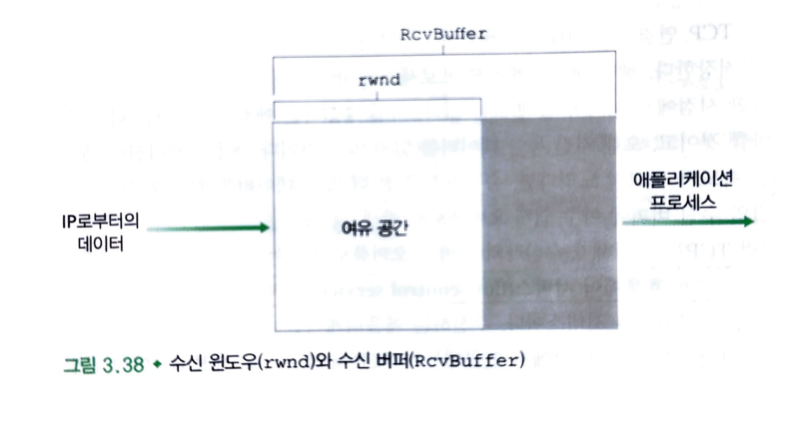

### 6. TCP 연결 관리

TCP 연결을 설정하고 해제하는 절차는 성능 면에서도(웹 서핑 시 체감되는 지연) 보안 면에서도(SYN 플러드 공격 등 여러 네트워크 공격이 연결 관리의 취약점을 노린다) 중요하다.

#### 연결 설정: 세 방향 핸드셰이크

| 단계 | 방향 | 세그먼트 | 내용 |
|---|---|---|---|
| 1 | 클라이언트 → 서버 | **SYN** | SYN 비트 = 1, 순서 번호 필드에 임의로 고른 초기 순서 번호 `client_isn`. 애플리케이션 데이터 없음 |
| 2 | 서버 → 클라이언트 | **SYNACK** | SYN 비트 = 1, 확인응답 필드 = `client_isn + 1`, 순서 번호 필드에 서버의 초기 순서 번호 `server_isn`. 애플리케이션 데이터 없음 |
| 3 | 클라이언트 → 서버 | **ACK** | SYN 비트 = 0(연결이 설정됐으므로), 확인응답 필드 = `server_isn + 1`. 페이로드를 실을 수 있다 |

1. **1단계** — 클라이언트 애플리케이션이 연결을 원한다고 알리면, 클라이언트 TCP가 서버에게 SYN 세그먼트를 보낸다. `client_isn`은 **적절히 무작위로** 골라야 한다. 예측 가능하면 특정 보안 공격에 노출되기 때문이다.
2. **2단계** — SYN 세그먼트가 도착하면 서버는 연결을 위한 **TCP 버퍼와 변수를 할당**하고 연결 승인(SYNACK) 세그먼트를 보낸다.
3. **3단계** — SYNACK를 받은 클라이언트도 연결에 버퍼와 변수를 할당하고, 서버의 연결 승인을 확인하는 세그먼트를 보낸다.

세 단계가 끝나면 양쪽은 자유롭게 데이터를 주고받을 수 있고, 이후의 모든 세그먼트는 SYN 비트가 0이다. 세 개의 세그먼트를 주고받으므로 **세 방향 핸드셰이크**라 부른다.

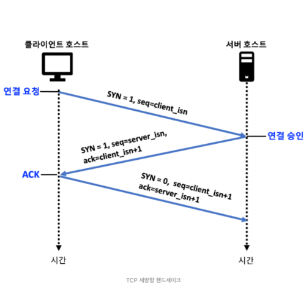

#### 연결 해제

연결에 참여한 두 프로세스 중 **어느 쪽이든** 연결을 끝낼 수 있다.

1. 클라이언트가 종료 명령을 내리면 **FIN 비트 = 1** 인 세그먼트를 서버로 보낸다.
2. 서버가 이에 대한 확인응답 세그먼트를 보낸다.
3. 서버도 자신의 종료 세그먼트(FIN 비트 = 1)를 보낸다.
4. 클라이언트가 서버의 종료 세그먼트에 확인응답한다.

#### 클라이언트 TCP의 상태 전이

| 상태 | 상황 |
|---|---|
| CLOSED | 초기 상태 |
| SYN_SENT | SYN 세그먼트를 보낸 뒤, SYN 비트가 1이고 확인응답을 담은 세그먼트(SYNACK)를 기다리는 상태 |
| ESTABLISHED | SYNACK를 받은 뒤. 데이터를 송수신할 수 있다 |
| FIN_WAIT_1 | FIN 비트가 1인 세그먼트를 보낸 뒤, 상대의 확인응답을 기다리는 상태 |
| FIN_WAIT_2 | 확인응답을 받은 뒤, 상대의 FIN 세그먼트를 기다리는 상태 |
| TIME_WAIT | 상대의 FIN에 확인응답을 보낸 뒤 일정 시간 대기. 확인응답이 손실됐을 경우 재전송하기 위함이다 |

- 연결을 받아 줄 프로세스가 없는 포트로 SYN 세그먼트가 도착하면, 호스트는 **RST 비트가 1인 리셋 세그먼트**를 보내 "재전송하지 말라"고 알린다.

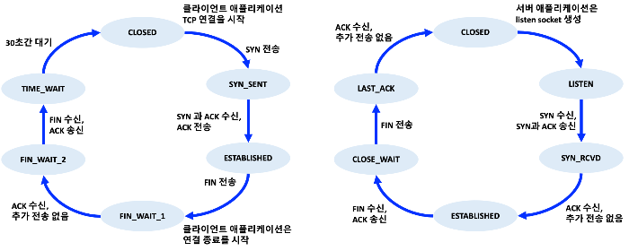

## 6. 혼잡 제어의 원리

혼잡(congestion)은 **너무 많은 출발지가 너무 높은 속도로 데이터를 보내려 할 때** 발생한다. 이 절은 혼잡이 왜 문제이고 어떤 비용을 치르게 하는지를 세 가지 시나리오로 살펴본다.

### 1. 혼잡의 원인과 비용

#### 1. 시나리오 1: 2개의 송신자와 무한 버퍼를 갖는 하나의 라우터

- 두 호스트 A, B가 용량 R인 링크 하나를 공유하는 단일 홉 연결을 갖는다고 가정한다.
- 라우터는 무한 버퍼를 가지므로 도착률이 출력 링크 용량을 넘어도 패킷을 버리지 않고 저장한다.
- 그러나 안정 상태에서 각 연결은 **R/2를 초과해서 전달할 수 없다.**

> **혼잡의 비용 1** — 도착률이 R/2에 가까워질수록 큐 대기 시간이 급격히 증가해 **지연이 무한대로 커진다.**

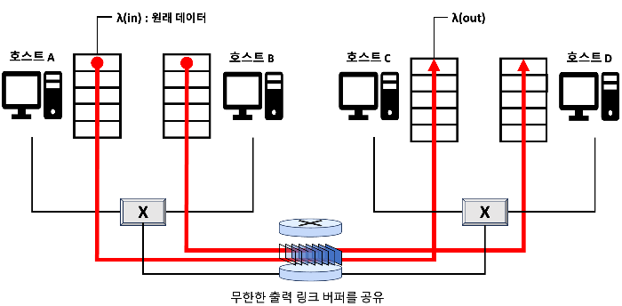

#### 2. 시나리오 2: 2개의 송신자와 유한 버퍼를 가진 하나의 라우터

이번에는 현실적으로 버퍼가 유한하고, 버퍼가 가득 찬 상태에서 도착한 패킷은 **버려진다**고 가정한다. 또 각 연결이 신뢰적이어서 손실된 패킷은 재전송된다고 하자.

- 이때 송신자가 원래 데이터를 보내는 속도와 **재전송까지 포함한 속도**는 다르며, 후자를 **제공된 부하(offered load)** 라 부른다.
- 송신자가 손실 여부를 완벽히 안다고 가정해도, 조금이라도 이르게 타임아웃되면 불필요한 중복 재전송이 생긴다.

> **혼잡의 비용 2** — 송신자는 버퍼 오버플로로 버려진 패킷을 보상하기 위해 **재전송을 수행해야 한다.** 불필요한 재전송은 라우터가 같은 데이터를 여러 번 나르게 만들어 유효 처리율을 떨어뜨린다.

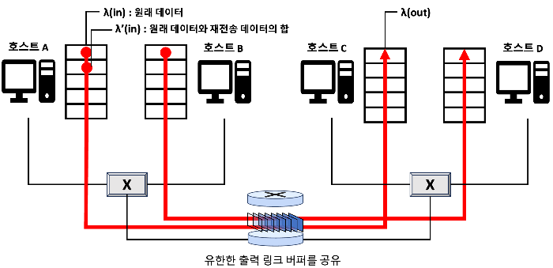

#### 3. 시나리오 3: 4개의 송신자와 유한 버퍼를 갖는 라우터, 그리고 멀티홉 경로

각 연결이 2홉 경로를 통해 패킷을 전송하는 상황이다. 여기서는 제공된 부하를 늘리면 처리율이 **오히려 감소하는** 현상이 나타난다.

- 이유는 네트워크가 수행한 **헛된 작업**의 양을 보면 분명해진다. 패킷이 두 번째 홉 라우터에서 버려질 때마다, 첫 번째 홉 라우터가 그 패킷을 나르는 데 쓴 작업은 모두 헛수고가 된다.

> **혼잡의 비용 3** — 패킷이 경로 도중에 버려지면, 버려지는 지점까지 그 패킷을 전송하는 데 사용된 **상위 라우터들의 전송 용량이 모두 낭비된다.**

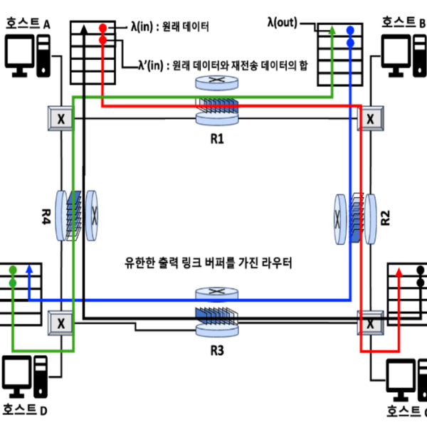

### 2. 혼잡 제어에 대한 접근법

혼잡 제어 방식은 **네트워크 계층이 트랜스포트 계층에게 직접적인 도움을 주는가**를 기준으로 크게 둘로 나뉜다.

| 접근법 | 특징 |
|---|---|
| 종단 간(end-to-end) 혼잡 제어 | 네트워크 계층은 아무 지원도 하지 않는다. 혼잡의 존재는 관찰된 네트워크 동작(패킷 손실, 지연 증가)으로부터 **추측**해야 한다 |
| 네트워크 지원(network-assisted) 혼잡 제어 | 라우터가 송신자·수신자에게 혼잡 상태에 대한 **직접적인 피드백**을 제공한다 |

- **종단 간 방식**: IP 계층이 혼잡에 관한 피드백을 제공할 의무가 없으므로, TCP는 이 방식을 취한다. 세그먼트 손실을 혼잡의 표시로 간주해 그에 따라 윈도우 크기를 줄인다.
- **네트워크 지원 방식**: 피드백은 "이 링크가 혼잡하다"는 **1비트**처럼 단순할 수도 있고, 송신자에게 전송률을 명시적으로 알려 줄 수도 있다. 최근에는 IP와 TCP가 이를 선택적으로 구현할 수 있게 되었다(→ ECN).

네트워크 지원 방식에서 혼잡 정보가 전달되는 경로는 두 가지다.

1. **직접 피드백** — 라우터가 송신자에게 직접 알린다. 전형적으로 **초크 패킷(choke packet)** 형태다.
2. **경유 피드백** — 라우터가 수신자로 흐르는 패킷의 특정 필드를 표시(수정)하고, 표시된 패킷을 받은 수신자가 그 사실을 송신자에게 알린다. 한 번의 왕복이 필요하다.

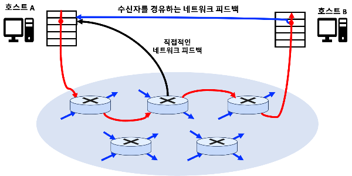

## 7. TCP 혼잡 제어

TCP는 신뢰적 전송뿐 아니라 **혼잡 제어 메커니즘**이라는 매우 중요한 요소를 갖는다.

### 1. 전통적인 TCP의 혼잡 제어

TCP의 접근 방식은 네트워크 혼잡 정도에 따라 **각 송신자가 스스로 전송률을 제한하는 것**이다. 여기서 세 가지 질문이 나온다.

1. 송신자는 트래픽 전송률을 어떻게 제한하는가?
2. 혼잡은 어떻게 감지하는가?
3. 송신율을 바꾸기 위해 어떤 알고리즘을 사용하는가?

#### 전송률을 어떻게 제한하는가 — 혼잡 윈도우(cwnd)

- TCP 송신자는 **혼잡 윈도우(congestion window)**, 즉 `cwnd`를 추적한다.
- 확인응답되지 않은 데이터의 양은 `cwnd`와 `rwnd`의 **최솟값을 넘지 않는다.**

> 송신 속도 ≈ cwnd / RTT (바이트/초)
>
> 따라서 `cwnd` 값을 조절하면 전송 속도를 조절할 수 있다.

- TCP는 **확인응답의 도착**을 혼잡 윈도우를 키우는 트리거(클록)로 사용하므로 **자체 클로킹(self-clocking)** 된다고 말한다.

#### 혼잡을 어떻게 감지하고 대응하는가

| 신호 | 해석 | 대응 |
|---|---|---|
| 세그먼트 손실(타임아웃 또는 3개의 중복 ACK) | 네트워크가 혼잡하다 | 전송률을 **줄인다** |
| 이전에 확인응답되지 않은 세그먼트에 대한 ACK 도착 | 네트워크가 잘 전달하고 있다 | 전송률을 **올린다** |

- 이렇게 ACK가 오면 올리고 손실이 나면 내리며 가용 대역폭을 더듬어 찾는 방식을 **대역폭 탐색(bandwidth probing)** 이라 한다.

TCP 혼잡 제어 알고리즘은 세 가지 구성요소로 이루어진다. 이 중 **슬로 스타트와 혼잡 회피는 필수**이고, 빠른 회복은 권고사항이다.

#### 1. 슬로 스타트(slow start)

- 연결이 시작되면 `cwnd`는 보통 **1 MSS**로 초기화되고, 초기 전송률은 대략 MSS/RTT가 된다(MSS 500바이트, RTT 200ms면 약 20 kbps).
- 확인응답을 받을 때마다 `cwnd`를 1 MSS씩 늘린다. 결과적으로 **RTT마다 `cwnd`가 두 배**가 되어 1 → 2 → 4 → 8 …로 **지수적으로 증가**한다.

이 지수적 증가가 끝나는 경우는 세 가지다.

| 종료 조건 | 동작 |
|---|---|
| 타임아웃으로 표시되는 손실 이벤트 | `ssthresh`(슬로 스타트 임곗값)를 `cwnd/2`로 정하고, `cwnd`를 1 MSS로 되돌려 슬로 스타트를 다시 시작한다 |
| `cwnd`가 `ssthresh`에 도달 | 슬로 스타트를 끝내고 **혼잡 회피** 모드로 전환한다. `ssthresh`는 혼잡이 마지막으로 검출된 시점의 `cwnd` 절반이므로, 그 근처에서는 두 배씩 늘리는 것이 위험하다 |
| 3개의 중복 ACK 검출 | **빠른 재전송**을 수행하고 **빠른 회복** 상태로 들어간다 |

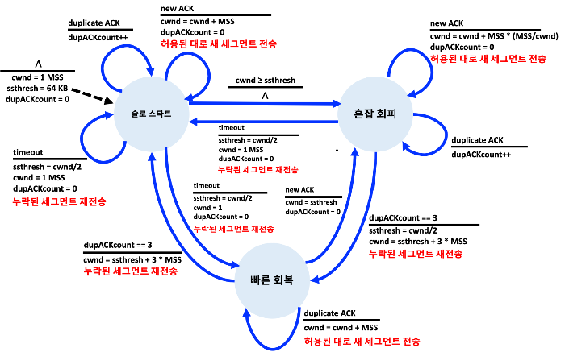

#### 2. 혼잡 회피(congestion avoidance)

혼잡 회피 상태에 들어서는 시점의 `cwnd`는 혼잡이 마지막으로 발견된 시점 값의 절반이다. 즉 혼잡이 멀지 않았을 수 있으므로, 두 배씩 늘리는 대신 **보수적으로 RTT당 1 MSS씩만** 늘린다.

- 구현은 보통 새로운 확인응답이 올 때마다 `cwnd`를 `MSS × (MSS / cwnd)` 바이트만큼 증가시키는 방식이다. RTT 동안 모든 세그먼트가 확인응답되면 총 증가량이 대략 1 MSS가 된다.

혼잡 회피 상태에서 손실이 발생하면 다음과 같이 대응한다.

| 손실 신호 | 동작 |
|---|---|
| 타임아웃 | `ssthresh` = `cwnd`/2, `cwnd` = 1 MSS → 슬로 스타트로 |
| 3개의 중복 ACK | `ssthresh` = `cwnd`/2, `cwnd` = `cwnd`/2 + 3 MSS → 빠른 회복으로 |

> 타임아웃과 3개의 중복 ACK에 대한 반응이 다른 이유는, 중복 ACK가 온다는 것 자체가 **뒤따르는 세그먼트들은 잘 도착하고 있다**는 뜻이기 때문이다. 네트워크가 완전히 막힌 것은 아니므로 덜 과격하게 대응한다.

#### 3. 빠른 회복(fast recovery)

- 손실된 세그먼트에 대해 중복 ACK를 받을 때마다 `cwnd`를 **1 MSS씩 증가**시킨다.
- 손실됐던 세그먼트에 대한 ACK가 마침내 도착하면 `cwnd`를 줄이고 **혼잡 회피 상태**로 들어간다.
- 도중에 타임아웃이 발생하면 슬로 스타트·혼잡 회피에서와 같은 동작을 한 뒤 **슬로 스타트로 전이**한다.
- 빠른 회복은 **권고사항이며 필수는 아니다.** 빠른 회복이 없는 초기 버전이 **TCP 타호(Tahoe)**, 포함한 버전이 **TCP 리노(Reno)** 다.

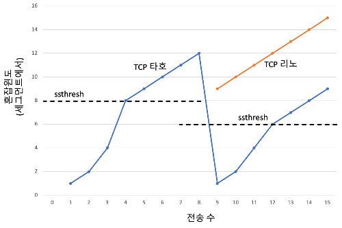

#### 4. TCP 혼잡 제어: 복습

손실이 타임아웃이 아니라 3개의 중복 ACK로 나타난다고 가정하면, TCP의 혼잡 제어는 다음 두 동작으로 요약된다.

- RTT마다 `cwnd`를 1 MSS씩 **선형 증가**시킨다.
- 3개의 중복 ACK 이벤트에서 `cwnd`를 **절반으로** 줄인다.

> 이 때문에 TCP 혼잡 제어를 **가법적 증가, 승법적 감소(AIMD, Additive-Increase Multiplicative-Decrease)** 방식이라 부른다. 그래프로 그리면 특유의 **톱니 모양(saw-tooth)** 이 된다.

#### 5. TCP 큐빅(CUBIC)

AIMD 방식이 "패킷 손실이 발생하는 임곗값 바로 아래"를 찾는 최선의 방법인지는 자연스러운 의문이다. RTT마다 1 MSS씩 늘리는 것은 지나치게 신중할 수 있다.

- **TCP 큐빅**은 리노와 달리, 손실이 마지막으로 감지됐을 때의 혼잡 윈도우 크기 W를 기억하고, 그 지점(시각 K)에 **얼마나 빨리 도달할지**를 조절한다.
- 혼잡 윈도우를 현재 시각 t와 K 사이 거리의 **세제곱 함수**로 증가시킨다. K에서 멀면 빠르게 늘리고, K에 가까워지면 천천히 늘린다.
- 결과적으로 혼잡 임곗값 바로 아래에서 **가능한 한 오래 머무르려** 시도하므로, 혼잡 수준을 눈에 띄게 높이지 않으면서 높은 전송 속도를 얻는다.
- 슬로 스타트 단계와 빠른 회복 단계는 리노와 동일하게 유지되고, **혼잡 회피 단계만 수정**됐다.
- 현재 널리 보급되어 있으며, **리눅스의 기본 TCP 버전**이기도 하다.

#### 6. TCP 리노 처리율의 거시적 설명

톱니 모양의 동작을 전제로 장시간 유지되는 TCP 연결의 **평균 처리율**을 생각해 볼 수 있다. 윈도우가 W/2에서 W까지 선형 증가한 뒤 절반으로 떨어지는 것을 반복하므로, 평균 윈도우는 0.75W다.

> 연결의 평균 처리율 ≈ 0.75 × W / RTT

### 2. 네트워크 지원 명시적 혼잡 알림과 지연 기반 혼잡 제어

최근에는 네트워크가 TCP 송신자·수신자에게 **명시적으로** 혼잡 신호를 보낼 수 있도록 IP와 TCP에 대한 확장이 제안·구현·배포되었다.

#### 1. 명시적 혼잡 알림(ECN, Explicit Congestion Notification)

ECN은 네트워크 지원 혼잡 제어의 한 형태로, **IP와 TCP가 모두 관여**한다.

- **IP 쪽** — IP 데이터그램 헤더의 서비스 유형(ToS) 필드에 있는 **2비트**를 사용한다.
  - 하나의 설정은 **라우터가 혼잡을 겪고 있음**을 표시하는 데 쓴다. 이 표시는 IP 데이터그램에 실려 목적지까지 전달된다. 어떤 상황에서 표시할지는 라우터 공급업체가 지원하고 네트워크 운영자가 결정하는 구성 문제다.
  - 다른 설정은 **송신 호스트가 라우터에게** "이 연결의 송·수신자는 ECN을 지원하며 혼잡 표시에 반응할 수 있다"고 알리는 데 쓴다.
- **TCP 쪽** — 수신 측 TCP가 혼잡 표시가 붙은 데이터그램을 받으면, 송신자에게 보내는 ACK 세그먼트의 **ECE 비트**를 1로 설정해 알린다.
  - 송신 측 TCP는 ECE 비트가 설정된 ACK에 반응해 **혼잡 윈도우를 반으로 줄이고**, 다음에 보내는 세그먼트 헤더의 **CWR 비트**를 1로 설정해 "혼잡 알림을 받아 조치했다"고 응답한다.
- TCP 외의 트랜스포트 프로토콜도 ECN을 활용한다. **DCCP(데이터그램 혼잡 제어 프로토콜)** 는 ECN을 이용해, 오버헤드가 적으면서 혼잡 제어되는 UDP 같은 비신뢰적 서비스를 제공한다.

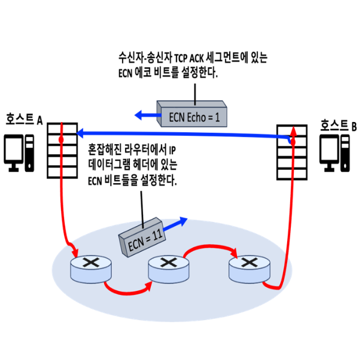

#### 2. 지연 기반 혼잡 제어

패킷 손실이 **발생하기 전에** 혼잡의 시작을 미리 감지하려는 접근이다.

- 혼잡이 없을 때의 처리율을 기준으로 삼아, 송신자가 측정한 실제 처리량이 그 값에 가까우면 경로가 아직 혼잡하지 않다고 보고 전송 속도를 올린다. 값이 뒤처지기 시작하면 큐가 쌓이는 중이므로 속도를 낮춘다.
- **TCP 베가스(Vegas)** 는 "파이프를 가득 채우되 그 이상으로는 채우지 않는다"는 원칙 아래 동작한다.
- **BBR** 혼잡 제어 프로토콜은 베가스의 아이디어를 기반으로 하되, 지연 기반이 아닌 기존 TCP와도 **공정하게 경쟁할 수 있는 메커니즘**을 통합했다.

### 3. 공평성

혼잡 제어의 공평성은 다음 기준으로 판단한다.

> 대역폭 R인 링크를 K개의 연결이 공유할 때, 각 연결의 평균 전송률이 **R/K에 가깝다면** 그 혼잡 제어 메커니즘은 공평하다.

- 이상적인 조건(같은 RTT, 링크를 지나는 TCP 연결만 존재)에서 TCP의 **AIMD 알고리즘은 공평**하다. 두 연결의 윈도우 크기가 처음에 달라도, 가법적 증가와 승법적 감소를 반복하면서 균등 대역폭 분배 지점으로 수렴한다.

**(보충) RTT가 다르면 왜 불공평해지는가**

작은 RTT를 갖는 연결이 큰 RTT를 갖는 연결보다 더 높은 처리율을 얻는다. AIMD의 증가 단위가 "RTT마다 1 MSS"이기 때문이다.

> 같은 병목 링크를 공유하는 두 연결이 있고, 연결 A의 RTT는 20 ms, 연결 B의 RTT는 200 ms라 하자.
>
> - 1초 동안 A는 윈도우를 약 50회 늘릴 기회를 얻지만(1000 / 20), B는 5회뿐이다(1000 / 200).
> - 또한 처리율 자체가 cwnd/RTT이므로, 같은 윈도우 크기라도 RTT가 10배 작은 A가 10배 높은 처리율을 낸다.
>
> 결과적으로 A가 여유 대역폭을 훨씬 빠르게 채워 가며 링크를 더 많이 차지한다.

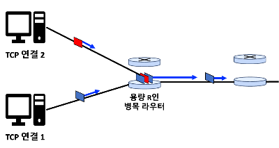

#### 1. 공평성과 UDP

- 멀티미디어 애플리케이션은 네트워크가 혼잡하다는 이유로 자신의 전송률이 조절되는 것을 원하지 않기 때문에 TCP를 쓰지 않는 경우가 많다.
- 이들은 일정한 속도로 UDP 트래픽을 밀어 넣고 이따금 패킷을 잃는 편을 택한다. 문제는 이 트래픽이 **TCP 트래픽을 밀어내** 버린다는 점이다.
- 그래서 **UDP 트래픽으로 인터넷이 마비되는 것을 막을 혼잡 제어 방식**을 개발하는 것이 오늘날 연구의 주요 분야다.

#### 2. 공평성과 병렬 TCP 연결

- 애플리케이션이 **여러 개의 병렬 TCP 연결**을 열어 버리면 공평성 문제는 해결되지 않는다.
- 예를 들어 R 대역폭 링크를 9개의 클라이언트가 각각 1개 연결로 쓰고 있을 때, 새 클라이언트가 11개의 병렬 연결을 열면 그 클라이언트 혼자 R/2 이상을 가져간다.
- 웹 브라우저가 여러 병렬 연결을 사용하는 것이 흔하므로, 이런 **불공평한 할당**이 실제로 일어난다.

## 8. 트랜스포트 계층 기능의 발전

UDP와 TCP는 계속 발전해 왔다. TCP 타호와 리노 같은 고전적인 버전 외에도 최신 버전이 여럿 있다.

- **TCP 큐빅, DCTCP, CTCP, BBR** 등이 여기 포함되며, 큐빅과 그 이전 버전인 BIC, 그리고 CTCP는 기존 TCP 리노보다 **더 널리 배포**되었다.
- 무선 링크, RTT가 매우 긴 고대역폭 경로, 패킷을 재정렬하는 경로 등 특수한 환경을 위해 설계된 TCP 버전들도 있다.
- 이 프로토콜들의 거의 유일한 공통점은 **TCP 세그먼트 포맷을 사용한다는 것**, 그리고 네트워크 혼잡 상황에서 **서로 공정하게 경쟁해야 한다는 것**이다.

한편, 트랜스포트 계층 자체를 바꾸는 대신 **애플리케이션 계층에서 기능을 확장**하는 길도 있다. QUIC이 바로 그 접근이다.

### 1. QUIC: 빠른 UDP 인터넷 연결(Quick UDP Internet Connections)

QUIC은 보안 HTTP를 위한 트랜스포트 서비스의 성능을 향상시키려고 **처음부터 새롭게 설계된 애플리케이션 계층 프로토콜**이다. UDP를 하위 트랜스포트 프로토콜로 사용하며, HTTP/2 위에서 인터페이스되도록 설계됐다.

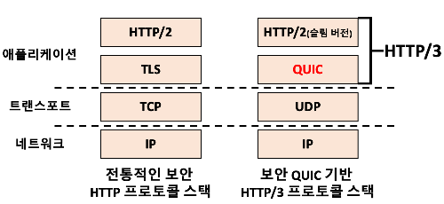

QUIC의 주요 특징은 다음과 같다.

| 특징 | 내용 |
|---|---|
| 연결지향적이고 안전함 | TCP처럼 연결지향 프로토콜이라 핸드셰이크가 필요하다. 모든 QUIC 패킷은 암호화되며, 연결 설정과 인증을 하나로 합쳐 **여러 RTT가 필요한 기존 스택(TCP + TLS)보다 빠르게** 설정된다 |
| 스트림(stream) | 하나의 QUIC 연결에 여러 애플리케이션 레벨 **스트림을 다중화**할 수 있고, 연결이 설정된 뒤 새 스트림을 빠르게 추가할 수 있다. 스트림은 두 종단 간에 데이터를 순서대로 안정적으로 전달하기 위한 추상화다 |
| 신뢰적·혼잡 제어되는 데이터 전송 | 각 스트림에 **독립적으로** 신뢰적 전달을 제공한다. 스트림별로 순서를 보장하므로, **손실된 UDP 세그먼트는 그 데이터가 속한 스트림에만 영향을 준다**(HOL 블로킹 완화). TCP와 유사한 확인응답 메커니즘을 사용한다 |
| 혼잡 제어 | TCP 리노를 약간 수정한 **TCP 뉴리노(NewReno)** 를 기반으로 한다 |

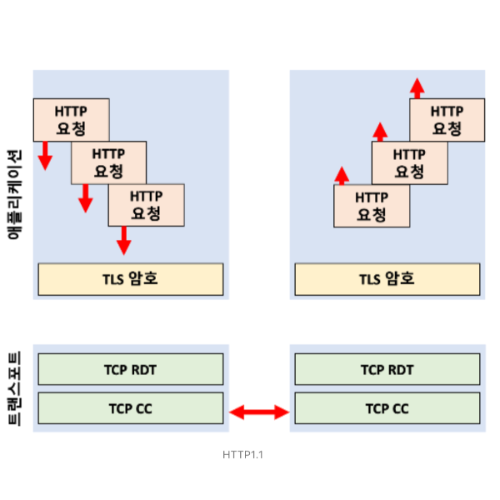
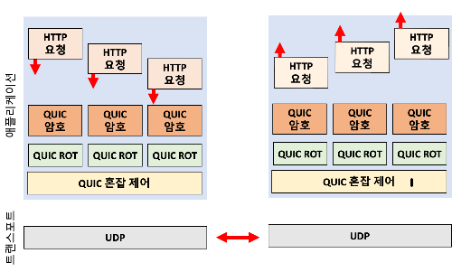

## 9. 요약

- **트랜스포트 계층의 역할** — 네트워크 계층의 호스트 대 호스트 전달을 **프로세스 대 프로세스 전달**로 확장한다. 이를 위해 다중화·역다중화를 수행하며, 포트 번호(UDP는 2-튜플, TCP는 4-튜플)로 올바른 소켓을 찾는다.
- **UDP** — 다중화·역다중화와 체크섬만 더한 최소한의 프로토콜이다. 연결 설정 지연이 없고 헤더가 8바이트로 작으며 연결 상태를 유지하지 않아, DNS나 실시간 애플리케이션처럼 속도와 제어권이 중요한 곳에 쓰인다.
- **신뢰적 데이터 전송의 원리** — 체크섬(오류 검출), 순서 번호(손실·중복 검출), 확인응답, 타이머(손실 회복), 파이프라이닝(이용률 향상)이 핵심 도구다. 파이프라인 오류 회복 방식으로 GBN과 SR이 있다.
- **TCP** — 연결지향·전이중·점대점 프로토콜로, 바이트 스트림 기준의 순서 번호와 누적 확인응답을 사용한다. 오류 회복은 **GBN과 SR의 혼합**이며, 빠른 재전송(3개의 중복 ACK)으로 타임아웃을 기다리지 않고 손실을 복구한다.
- **흐름 제어와 혼잡 제어** — 흐름 제어는 `rwnd`로 **수신 버퍼 오버플로**를 막고, 혼잡 제어는 `cwnd`로 **네트워크 혼잡**에 대응한다. 둘은 목적이 다르며, 송신 가능한 양은 두 윈도우의 최솟값으로 제한된다.
- **TCP 혼잡 제어** — 슬로 스타트(지수 증가), 혼잡 회피(선형 증가), 빠른 회복으로 구성된 **AIMD** 방식이다. 이상적인 조건에서는 공평하지만, RTT가 다르거나 병렬 연결·UDP 트래픽이 섞이면 공평성이 깨진다.
- **발전 방향** — TCP 큐빅·BBR 같은 새로운 혼잡 제어, 네트워크가 직접 신호를 주는 ECN, 그리고 UDP 위에 트랜스포트 기능을 재구축한 **QUIC**으로 트랜스포트 계층은 계속 진화하고 있다.
