## 1. 네트워크 계층 개요

호스트 H1이 H2에게 정보를 보내는 상황으로 네트워크 계층의 역할을 살펴보자.

- 송신 측 네트워크 계층은 트랜스포트 계층에서 세그먼트를 받아 각 세그먼트를 **데이터그램(datagram)** 으로 캡슐화하고, 인접한 라우터 R1에게 보낸다.
- 각 라우터는 데이터그램이 목적지 호스트까지 잘 도착하도록 **라우터별로 다음에 보낼 출력 링크를 결정**해 준다.
- 수신 측 네트워크 계층은 데이터그램에서 세그먼트를 꺼내 상위 트랜스포트 계층으로 올린다.
- 라우터는 **잘린 프로토콜 스택**을 갖는다. 트랜스포트·애플리케이션 계층 없이 네트워크 계층 아래만 구현한다.

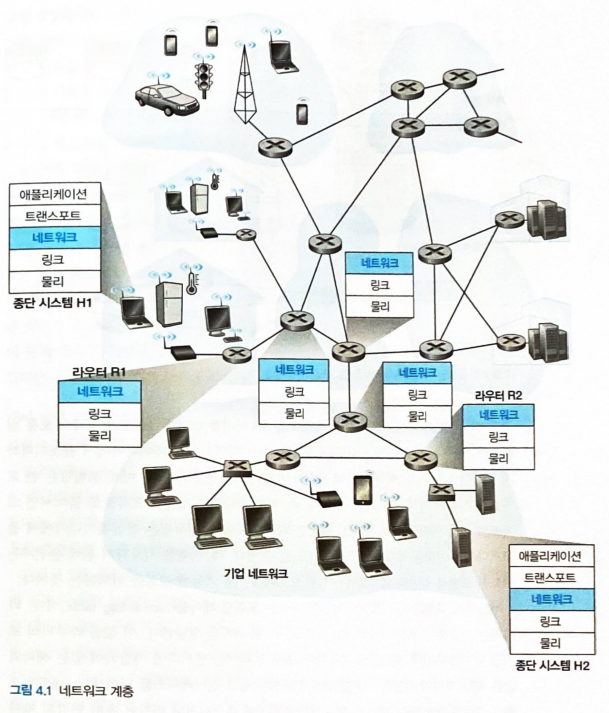

### 1. 포워딩과 라우팅: 데이터 평면과 제어 평면

네트워크 계층의 근본적인 역할은 매우 단순하다 — **송신 호스트에서 수신 호스트로 패킷을 전달하는 것**이다. 이를 위한 중요한 기능이 두 가지 있는데, 이 둘은 자주 혼용되지만 시간 척도와 구현 위치가 다르다.

| 구분 | 포워딩(forwarding, 전달) | 라우팅(routing) |
|---|---|---|
| 하는 일 | 도착한 패킷을 적절한 출력 링크로 이동시킨다 | 데이터그램의 종단 간 경로를 결정한다 |
| 시간 척도 | 짧다(나노초 단위) | 길다(밀리초 이상) |
| 구현 | 주로 **하드웨어** | 주로 **소프트웨어** |
| 평면 | 데이터 평면(data plane) | 제어 평면(control plane) |

- 경로를 계산하는 알고리즘을 **라우팅 알고리즘**이라 한다.
- 비유하자면 **포워딩은 하나의 교차로를 지나는 과정**이고, **라우팅은 여행 전체의 경로를 계획하는 과정**이다.
- 라우터에서 포워딩을 담당하는 필수 요소는 **포워딩 테이블(forwarding table)** 이다. 라우터는 도착한 패킷 헤더의 필드값을 조사하고, 그 값으로 포워딩 테이블을 찾아 해당 패킷의 출력 링크 인터페이스를 결정한다.

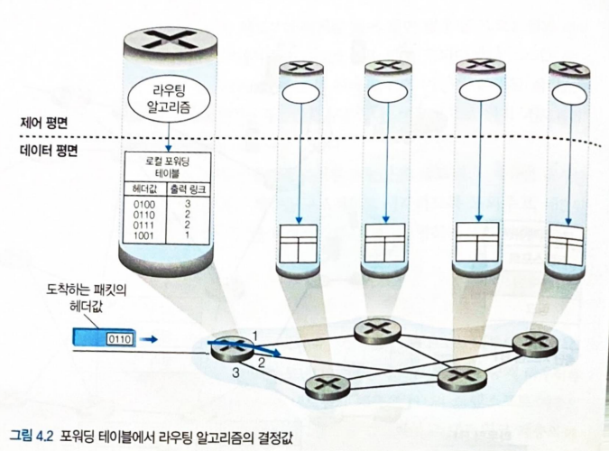

#### 1. 제어 평면: 전통적인 접근 방법

포워딩 테이블은 라우팅(제어 평면)과 포워딩(데이터 평면) 사이의 중요한 상호작용을 보여준다.

- **라우팅 알고리즘이 포워딩 테이블의 내용을 결정한다.**
- 전통적인 방식에서는 라우팅 알고리즘이 **모든 라우터 각각에서 실행**되며, 따라서 라우터는 포워딩과 라우팅 기능을 모두 갖고 있어야 한다.
- 포워딩 테이블을 사람이 직접 구성하는 것도 가능하지만, 라우팅 프로토콜에 의한 방법보다 오류가 많고 네트워크 변화에 늦게 대처한다.

#### 2. 제어 평면: SDN 접근 방법

라우팅 기능을 각 라우터에 두는 방식은 지금까지 라우터 공급업체들이 지속적으로 채택해 온 접근이다. 이와 달리 **라우팅 계산을 라우터에서 떼어내 물리적으로 분리된 원격 컨트롤러에 두는** 접근도 있다.

- 원격 컨트롤러가 각 라우터에서 사용할 포워딩 테이블을 계산해 **분배**한다.
- 컨트롤러는 높은 신뢰성과 중복성을 갖춘 원격 데이터 센터에 설치될 수 있고, ISP나 제3자가 관리할 수 있다.
- 라우터와 컨트롤러는 포워딩 테이블과 그 밖의 라우팅 정보를 담은 메시지를 교환해 소통한다.
- 이렇게 제어 평면을 분리하는 접근 방법이 **소프트웨어 정의 네트워킹(SDN, Software-Defined Networking)** 의 중심 아이디어다.

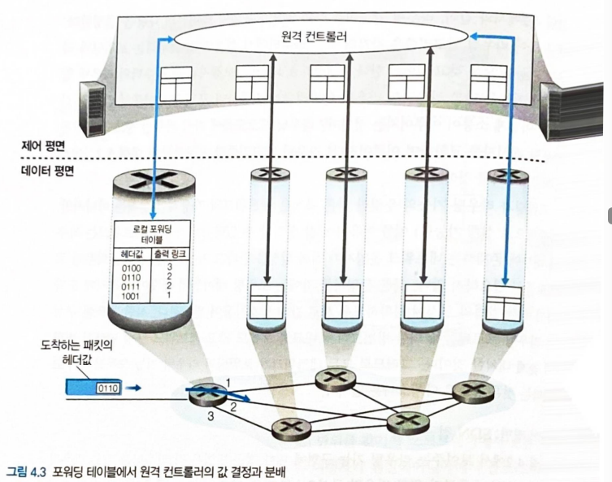

### 2. 네트워크 서비스 모델

송신 호스트의 트랜스포트 계층이 패킷을 네트워크에 넘길 때, 네트워크 계층이 목적지까지 잘 전달해 줄 것이라고 믿을 수 있을까? 이 답은 **네트워크 서비스 모델**, 즉 송수신 호스트 간 패킷 전송 특성을 어떻게 정의하느냐에 달려 있다.

네트워크 계층이 제공할 수 있는 서비스로는 다음과 같은 것들이 있다.

| 서비스 | 내용 |
|---|---|
| 보장된 전달 | 패킷이 목적지에 반드시 도착함을 보장한다 |
| 지연 제한 이내의 보장된 전달 | 전달을 보장하면서, 호스트 간 특정 지연 한계(예: 100 ms) 안에 전달한다 |
| 순서화 패킷 전달 | 패킷이 송신된 순서대로 목적지에 도착함을 보장한다 |
| 최소 대역폭 보장 | 송수신 호스트 사이에 특정 비트율의 전송 링크를 에뮬레이트한다. 송신 호스트가 그 비트율 이하로 보내는 한 모든 패킷이 전달된다 |
| 보안 서비스 | 네트워크 계층이 모든 세그먼트를 암호화하고 목적지에서 해독해 기밀성을 유지한다 |

- 그러나 **인터넷 네트워크 계층은 이 중 어느 것도 제공하지 않고, 최선형 서비스(best-effort service)** 만 제공한다. 패킷의 순서도, 전달 자체도, 지연 한계도, 대역폭도 보장하지 않는다.
- 그럼에도 최선형 모델은 충분히 잘 작동한다. 적절한 대역폭 공급과 DASH 같은 **적응형 애플리케이션 레벨 프로토콜**을 결합하면 넷플릭스 같은 서비스도 충분히 좋은 품질을 낼 수 있음이 입증되었다.

#### 1. 4장의 개요

- 4장에서는 네트워크 계층의 **데이터 평면** 구성요소를 다룬다(제어 평면은 5장).
- 포워딩 외의 기능을 수행하는 **미들박스(middlebox)** 도 함께 살펴본다.
- 패킷을 전달하는 일반적인 패킷 교환 장비를 **패킷 스위치**라 부르며, 어떤 계층의 필드값으로 포워딩을 결정하는지에 따라 구분된다.

| 장비 | 포워딩 근거 | 계층 |
|---|---|---|
| 링크 계층 스위치 | 링크 계층 프레임의 필드값 | 링크 계층 장치 |
| 라우터 | 네트워크 계층 필드값 | 네트워크 계층 장치 |

## 2. 라우터 내부에는 무엇이 있을까?

라우터 구조는 네 가지 요소로 정의된다.

| 요소 | 역할 |
|---|---|
| 입력 포트(input port) | 링크 계층과 상호 운용하기 위한 링크 계층 기능을 수행하고, 포워딩 테이블을 참조해 도착 패킷이 스위치 구조를 통해 나갈 **출력 포트를 결정**한다. 제어 패킷은 여기서 라우팅 프로세서로 전달된다 |
| 스위치 구조(switching fabric) | 라우터의 입력 포트와 출력 포트를 연결한다. 라우터 내부에 완전히 포함되어 있다 |
| 출력 포트(output port) | 스위치 구조에서 받은 패킷을 저장하고 출력 링크로 전송한다 |
| 라우팅 프로세서(routing processor) | 라우팅 테이블과 링크 상태 정보를 유지·관리하며 포워딩 테이블을 계산한다. SDN 라우터에서는 원격 컨트롤러와 통신해 계산된 포워딩 테이블 엔트리를 받아 입력 포트에 설치한다 |

- 라우터가 지원하는 포트 수는 소수의 포트만 갖는 기업용 라우터부터 ISP 가장자리 라우터까지 다양하다.
- **입력 포트, 출력 포트, 스위치 구조는 거의 항상 하드웨어로 구현된다.** 데이터 평면이 **나노초** 단위로 동작해야 하기 때문이다.
- 반면 제어 평면 기능은 **밀리초** 단위로 동작하므로 일반적으로 **소프트웨어**로 구현되어 라우팅 프로세서에서 실행된다.

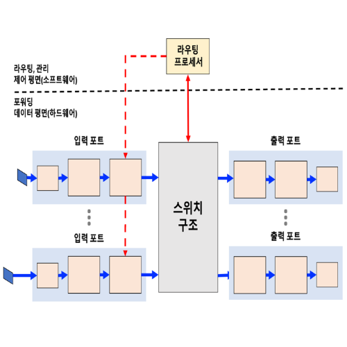

### 1. 입력 포트 처리 및 목적지 기반 전송

입력 포트의 라인 종단 기능과 링크 계층 처리는 개별 입력 링크에 대응하는 물리 계층과 데이터 링크 계층을 구현한다. 그다음 이루어지는 **검색(lookup)** 이 라우터 동작의 핵심이다.

- 라우터는 포워딩 테이블을 사용해, 도착 패킷이 스위치 구조를 통해 나갈 출력 포트를 검색한다.
- 포워딩 테이블은 라우팅 프로세서가 계산·갱신하거나 원격 SDN 컨트롤러로부터 받는다. 이때 각 입력 포트에 포워딩 테이블의 **섀도 복사본(shadow copy)** 을 두면, 패킷 단위로 중앙 라우팅 프로세서를 호출할 필요가 없어 **병목 현상을 피할 수 있다.**

#### 프리픽스 매치

목적지 주소마다 엔트리를 하나씩 두면 32비트 IP 주소에 대해 40억 개 이상의 엔트리가 필요하므로 불가능하다. 그래서 포워딩 테이블은 주소 전체가 아니라 **프리픽스(prefix)** 형태의 엔트리와 매치한다.

- 하드웨어 로직이 포워딩 테이블을 검색해 **가장 긴 프리픽스와 매치되는 것(longest prefix matching)** 을 찾는다.
- 검색에는 **TCAM(Ternary Content Addressable Memory)** 도 자주 쓰인다. 32비트 IP 주소를 메모리에 넣으면 **일정한 시간 안에** 해당 주소에 대한 포워딩 테이블 엔트리의 내용을 반환한다.

검색으로 출력 포트가 결정되면 패킷을 스위치 구조로 보낼 수 있다. 다만 그전에 입력 포트에서 처리해야 할 일들이 더 있다.

- 패킷의 버전 번호, 체크섬, TTL 필드를 확인하고, 뒤의 두 필드는 값을 갱신해 다시 써야 한다.
- 네트워크 관리에 사용되는 카운터를 갱신해야 한다.

#### 매치 플러스 액션

"헤더를 특정 기준과 맞춰 보고(match) 그에 따라 조치한다(action)"는 발상은 포워딩에만 쓰이지 않는다.

- **방화벽**: 헤더가 주어진 기준과 매치되는 수신 패킷을 걸러내 삭제한다.
- **네트워크 주소 변환(NAT)**: 트랜스포트 계층 포트 번호가 주어진 값과 매치되는 입력 패킷은 포워딩 전에 포트 번호를 다시 쓴다.

> 이처럼 **매치 플러스 액션(match plus action)** 은 매우 효과적이고 일반적인 개념이며, 뒤에서 다룰 일반화된 포워딩과 SDN의 기초가 된다.

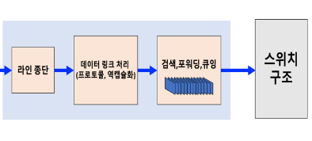

### 2. 스위칭

스위치 구조는 패킷이 입력 포트에서 출력 포트로 실제로 옮겨지는 통로이므로 라우터의 심장이다. 스위칭을 수행하는 방법은 세 가지다.

| 방식 | 동작 | 한계 |
|---|---|---|
| 메모리를 통한 교환 | 도착한 패킷이 입력 포트에서 라우팅 프로세서로 인터럽트를 보내고, 패킷을 프로세서 메모리로 복사한 뒤 다시 출력 포트로 복사한다 | CPU가 모든 패킷을 만지므로 속도가 메모리 대역폭에 묶인다. 가장 단순한 초기 라우터의 방식이며 일부 최근 라우터도 사용한다 |
| 버스를 통한 교환 | 라우팅 프로세서의 개입 없이 입력 포트가 공유 버스를 통해 직접 출력 포트로 패킷을 전송한다. 입력 포트가 붙인 내부 레이블을 모든 출력 포트가 수신하지만 **레이블과 매치되는 포트만 패킷을 유지**한다 | 모든 패킷이 하나의 버스를 지나므로 교환 속도가 **버스 속도로 제한**된다 |
| 상호연결 네트워크를 통한 교환 | 프로세서 상호연결에 쓰이는 것과 같은 복잡한 상호연결 네트워크를 사용한다. **크로스바 스위치**는 N개 입력 포트와 N개 출력 포트를 잇는 2N개의 버스로 구성된다 | 구현이 복잡하다. 대신 공유 버스의 대역폭 한계를 극복한다 |

- 시스코 CRS 같은 고성능 라우터는 **3단계 논블로킹(non-blocking) 스위칭 전략**을 사용한다.
- 라우터의 스위칭 용량은 **다중 스위치 구조를 병렬로 실행**하여 확장할 수 있다.

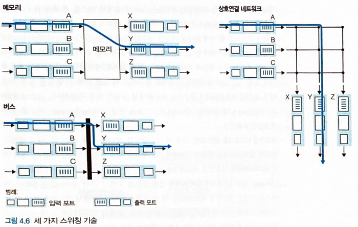

### 3. 출력 포트 처리

출력 포트 처리는 출력 포트의 메모리에 저장된 패킷을 꺼내 출력 링크로 전송하는 일이다. 여기에는 전송할 패킷을 선택하고 큐에서 제거하는 일, 그리고 필요한 링크 계층·물리 계층 전송 기능을 수행하는 일이 포함된다.

### 4. 어디에서 큐잉이 일어날까?

패킷 큐는 **입력 포트와 출력 포트 양쪽 모두에서** 형성될 수 있다. 큐가 계속 커지면 라우터의 메모리가 소진되고, 도착한 패킷을 저장할 메모리가 없으면 **패킷 손실**이 발생한다. 그래서 큐가 어디서 왜 생기는지 살펴볼 필요가 있다.

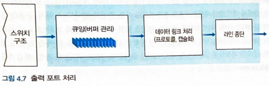

#### 1. 입력 큐잉

도착하는 모든 패킷을 지연 없이 통과시킬 만큼 스위치 구조가 빠르지 않다면, 패킷은 스위치 구조를 통해 출력 포트로 갈 차례를 **입력 큐에서 기다려야** 한다.

- 패킷은 보통 **FCFS(선입선출)** 방식으로 입력 큐에서 출력 큐로 옮겨진다.
- 향하는 출력 포트가 서로 다르면 여러 패킷이 병렬로 전달될 수 있다. 그러나 두 패킷이 **같은 출력 포트**로 향하면 하나는 차단되어 입력 큐에서 기다려야 한다.
- 이때 큐의 맨 앞 패킷이 막히면서 **뒤에 있는 패킷들까지** 함께 기다리게 되는 현상을 **HOL 차단(Head-Of-the-Line blocking)** 이라 한다.

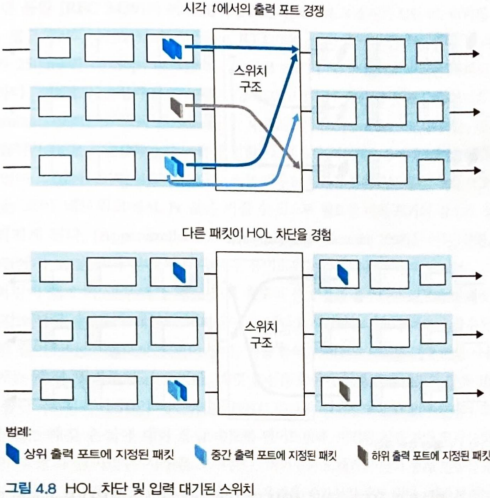

#### 2. 출력 큐잉

출력 포트에서는 여러 입력 포트에서 온 패킷이 같은 출력 링크를 두고 경쟁한다.

- 들어오는 패킷을 저장할 메모리가 부족하면, 도착한 패킷을 삭제하거나(drop-tail) 이미 큐에 있는 패킷을 삭제해 공간을 확보한다.
- 어떤 경우에는 **버퍼가 가득 차기 전에 미리 패킷을 삭제하거나 표시해** 송신자에게 혼잡 신호를 주는 것이 바람직하다.
- 이런 정책들을 통칭 **AQM(Active Queue Management, 능동적 큐 관리) 알고리즘**이라 하며, 가장 널리 연구된 것이 **RED(Random Early Detection)** 다.
- 여러 패킷이 전송을 기다리므로, 출력 포트의 **패킷 스케줄러**가 그중 하나를 골라야 한다.

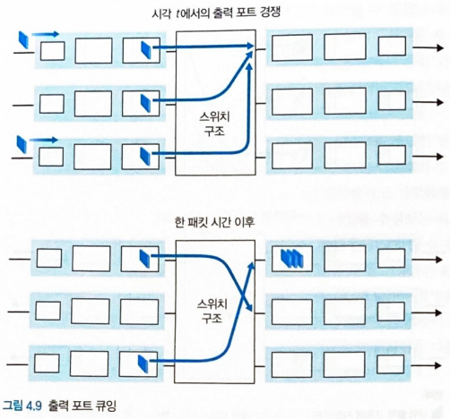

#### 3. 얼마나 많은 버퍼가 요구되는가?

버퍼는 클수록 좋은 것이 아니다. 버퍼가 지나치게 크면 패킷을 버리지 않는 대신 **큐에서 오래 대기하게 되어 지연이 길어진다.**

> 지속적인 버퍼링 때문에 긴 지연이 생기는 이 현상을 **버퍼블로트(bufferbloat)** 라 한다. 이는 처리율뿐 아니라 **최소 지연도 중요하다**는 점, 그리고 네트워크 가장자리의 송신자와 네트워크 내부 큐 사이의 상호작용이 실제로는 복잡하고 미묘하다는 점을 보여준다.

### 5. 패킷 스케줄링

출력 링크에서 다음에 보낼 패킷을 고르는 규칙이 패킷 스케줄링이다. 흔히 FCFS 방식을 사용하지만 여러 대안이 있다.

#### 1. FIFO

**FIFO(선입선출, First-In-First-Out)** 는 링크가 비면 **큐에 가장 먼저 도착한 패킷을 먼저 보내는** 가장 단순한 규칙이다. FCFS와 같은 뜻이다.

- 패킷 사이에 어떤 우선순위도 두지 않으므로 구현이 가장 간단하다.
- 반면 지연에 민감한 트래픽(예: 음성)이 대용량 파일 전송 패킷 뒤에 갇혀도 먼저 나갈 방법이 없다.

#### 2. 우선순위 큐잉

**우선순위 큐잉(priority queuing)** 은 도착한 패킷을 **우선순위 클래스로 분류**해 각각 별도의 큐에 넣는다.

- 링크가 비면 **가장 높은 우선순위 클래스의 큐**에서 패킷을 꺼내 전송한다.
- 우선순위가 동일한 패킷들 사이에서는 FIFO 방식으로 처리한다.
- **비선점(non-preemptive) 우선순위 큐잉**에서는 어떤 패킷의 전송이 일단 시작되면, 더 높은 우선순위 패킷이 도착해도 전송을 중단하지 않는다.

#### 3. 라운드 로빈과 WFQ

**라운드 로빈(round robin) 큐잉**에서도 패킷을 클래스로 분류하지만, 클래스 간에 **엄격한 서비스 우선순위가 없다.**

- 스케줄러가 클래스 사이를 **번갈아 가며** 서비스한다(클래스 1에서 하나, 클래스 2에서 하나, …).
- **작업 보존(work-conserving)** 큐잉 규칙은 전송할 패킷이 하나라도 있으면 링크가 유휴 상태가 되는 것을 허용하지 않는다. 어떤 클래스의 큐가 비어 있으면 곧바로 다음 클래스를 확인한다.

라우터에 널리 구현된 라운드 로빈의 일반화된 형태가 **WFQ(Weighted Fair Queuing, 가중 공정 큐잉)** 다.

- 각 클래스는 **가중치**를 할당받고, 그 가중치에 비례하는 만큼의 서비스(대역폭)를 받는다.
- 클래스 i의 가중치를 wi라 하면, 클래스 i가 받는 대역폭의 비율은 wi / Σwj가 된다.

## 3. 인터넷 프로토콜(IP): IPv4, 주소체계, IPv6 등

현재 사용 중인 IP는 IPv4와 IPv6, 두 가지 버전이 있다.

### 1. IPv4 데이터그램 포맷

IPv4 데이터그램의 주요 필드는 다음과 같다.

| 필드 | 크기 | 용도 |
|---|---|---|
| 버전 번호 | 4비트 | 데이터그램의 IP 프로토콜 버전을 명시한다. 버전마다 데이터그램 포맷이 다르므로 이 필드로 나머지를 해석한다 |
| 헤더 길이 | 4비트 | 헤더에 가변 길이 옵션이 포함될 수 있으므로, 이 값으로 **실제 페이로드가 시작되는 위치**를 정한다. 대부분 옵션이 없어 헤더는 20바이트다 |
| 서비스 타입(TOS) | 8비트 | 서로 다른 유형의 데이터그램을 구별한다. 실시간 트래픽과 비실시간 트래픽을 구분하는 데 유용하다 |
| 데이터그램 길이 | 16비트 | 헤더와 데이터를 합한 전체 길이(바이트). 이론상 최대 65,535바이트지만 실제로 1,500바이트를 넘는 경우는 드물다 |
| 식별자, 플래그, 단편화 오프셋 | 16 + 3 + 13비트 | **IP 단편화(fragmentation)** 에 사용된다 |
| TTL(Time-To-Live) | 8비트 | 데이터그램이 네트워크를 무한히 순환하지 않게 한다. 라우터가 처리할 때마다 1씩 줄고 **0이 되면 폐기**한다 |
| 프로토콜 | 8비트 | 데이터 필드를 넘겨줄 트랜스포트 계층 프로토콜을 지정한다(예: 6=TCP, 17=UDP). **최종 목적지에 도착했을 때만 사용**되고 중간 라우터는 보지 않는다 |
| 헤더 체크섬 | 16비트 | 라우터가 수신한 데이터그램의 비트 오류를 탐지하도록 돕는다. 헤더를 2바이트 단위 수로 보고 1의 보수 합으로 계산한다 |
| 출발지 / 목적지 IP 주소 | 각 32비트 | 출발지가 데이터그램을 만들 때 자신의 주소와 목적지 주소를 각각 채운다 |
| 옵션 | 가변 | IP 헤더를 확장한다. 아래 설명 참고 |
| 데이터(페이로드) | 가변 | **데이터그램이 존재하는 이유.** 보통 트랜스포트 계층 세그먼트가 들어가지만 ICMP 메시지 같은 다른 유형도 담긴다 |

#### 단편화와 옵션에 대한 보충

- **IP 단편화**: 큰 IP 데이터그램을 여러 개의 작은 데이터그램으로 분할해 목적지까지 독립적으로 전달하고, 트랜스포트 계층으로 올리기 전에 다시 모은다. **IPv6는 단편화를 허용하지 않는다.**
- **옵션**: 헤더를 확장하는 필드지만 거의 사용되지 않는다. 모든 데이터그램이 옵션 필드를 갖되 대부분 비워 두는 방식은 오버헤드를 낳고, 무엇보다 **가변 길이 헤더는 고성능 라우터와 호스트의 IP 처리 속도를 떨어뜨린다.** 이런 이유로 IP 옵션은 IPv6에 포함되지 않았다.

> IPv4 헤더는 옵션이 없으면 20바이트다. 따라서 TCP 세그먼트를 실은 (단편화되지 않은) 데이터그램은 애플리케이션 메시지에 총 **40바이트의 헤더**(IP 20 + TCP 20)를 덧붙여 전송하게 된다.

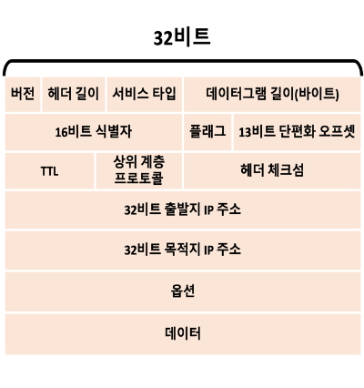

### 2. IPv4 주소체계

주소체계를 보기 전에 호스트와 라우터가 인터넷에 연결되는 방식에 관한 용어를 정리할 필요가 있다.

- 호스트는 일반적으로 네트워크와 연결되는 링크를 **하나** 갖고, 데이터그램을 보낼 때 이 링크로 내보낸다.
- 호스트(또는 라우터)와 물리적 링크 사이의 경계를 **인터페이스(interface)** 라 부른다.
- 호스트는 보통 인터페이스가 하나지만, **라우터는 여러 개의 인터페이스**를 갖는다(링크마다 하나).
- 모든 호스트와 라우터가 IP 데이터그램을 송수신하므로, IP는 **각 인터페이스가 IP 주소를 갖도록** 요구한다.

> 기술적으로 정확히 말하면, **IP 주소는 호스트나 라우터가 아니라 인터페이스에 결합된다.**

- 각 IP 주소는 **32비트** 길이이므로 232개(약 40억 개)를 사용할 수 있다.
- 표기는 각 바이트를 십진수로 쓰고 점(`.`)으로 구분하는 **점진 십진 표기법(dotted-decimal notation)** 을 쓴다.
- 각 인터페이스의 IP 주소는 고유해야 하지만 마음대로 고를 수 없다. **연결된 서브넷이 주소의 앞부분을 결정한다.**

#### 서브넷

세 호스트의 인터페이스와 하나의 라우터 인터페이스가 하나의 링크로 연결되어 있다면, 이들은 **서브넷(subnet)** 을 구성한다.

- IP 주소체계는 이 서브넷에 `223.1.1.0/24`라는 주소를 할당한다. 여기서 `/24`를 **서브넷 마스크(subnet mask)** 라 부르며, **32비트 주소의 왼쪽 24비트가 서브넷 주소**임을 뜻한다.
- 즉 서브넷 `223.1.1.0/24`는 세 호스트 인터페이스(223.1.1.1, 223.1.1.2, 223.1.1.3)와 하나의 라우터 인터페이스(223.1.1.4)로 구성된다.
- 서브넷의 정의가 "여러 호스트를 라우터 인터페이스에 연결하는 이더넷 세그먼트"만을 의미하는 것은 아니다. 두 라우터를 잇는 링크도 서브넷이 된다.

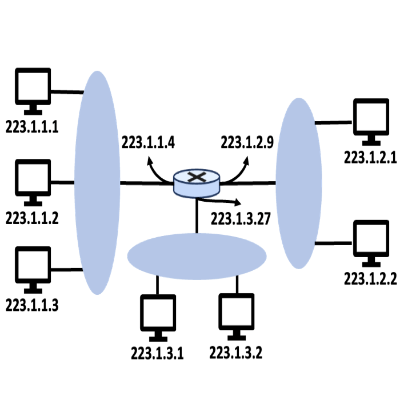

#### CIDR

인터넷의 주소 할당 방식을 **CIDR(Classless InterDomain Routing)** 라 하며, 서브넷 주소체계 표기를 일반화한 것이다.

- 32비트 IP 주소를 두 부분으로 나누고 `a.b.c.d/x` 형태로 쓴다. 여기서 `x`는 주소 첫 부분의 비트 수다.
- 상위 `x`비트가 IP 주소의 **네트워크 부분**을 구성하며, 이를 그 주소의 **프리픽스(prefix)** 또는 **네트워크 프리픽스**라 부른다.
- 나머지 `32 − x`비트는 같은 서브넷 안에서 장치를 구분하는 데 쓰인다.
- BGP 라우팅 프로토콜을 다룰 때, 해당 기관 네트워크 **외부의 라우터는 프리픽스만 고려한다**는 사실을 알게 된다. 덕분에 외부 라우터의 포워딩 테이블 크기가 크게 줄어든다.

**CIDR 이전의 클래스 주소체계** — CIDR가 채택되기 전에는 IP 주소의 네트워크 부분을 8, 16, 24비트로만 제한하고 각각 A, B, C 클래스 네트워크로 분류했다.

| 클래스 | 네트워크 부분 | 문제 |
|---|---|---|
| A | 8비트 | — |
| B | /16 | 65,534개 호스트를 담을 수 있어 대부분 조직에게 **너무 크다** |
| C | /24 | 254개 호스트뿐이라 많은 조직에게 **턱없이 부족하다** |

- C 클래스와 B 클래스 사이의 간격이 너무 커서 주소 공간이 급속히 낭비되었고, 이것이 CIDR 도입의 배경이다.

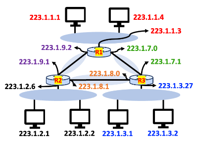

#### 브로드캐스트 주소

- IP 주소의 또 다른 형태로 **브로드캐스트 주소 `255.255.255.255`** 가 있다.
- 이 주소로 데이터그램을 보내면 **같은 서브넷의 모든 호스트**에게 전달된다.
- 라우터는 선택적으로 이웃 서브넷에도 이 메시지를 전달할 수 있다.

#### 1. 주소 블록 획득

기관이 서브넷에서 쓸 IP 주소 블록을 얻으려면 네트워크 관리자가 먼저 **ISP와 접촉**해야 한다.

- 예를 들어 ISP가 `200.23.16.0/20` 블록을 갖고 있다면, 이를 8개의 동일 크기 블록(`/23`)으로 나누어 8개 조직에게 나눠 줄 수 있다.
- 그 위에 ISP 자신이 주소 블록을 얻는 경로도 있다. **ICANN(Internet Corporation for Assigned Names and Numbers)** 이 IP 주소 할당과 DNS 루트 서버 관리를 맡으며, 지역 인터넷 레지스트리(RIR)에게 해당 지역 내 주소의 할당·관리를 위임한다.

#### 2. 호스트 주소 획득: 동적 호스트 구성 프로토콜(DHCP)

기관은 ISP로부터 받은 주소 블록에서 내부의 호스트와 라우터 인터페이스에 개별 IP 주소를 할당한다.

- **라우터 인터페이스**는 시스템 관리자가 라우터에 직접 주소를 설정한다.
- **호스트**도 수동 설정이 가능하지만, 일반적으로 **DHCP(Dynamic Host Configuration Protocol)** 를 사용한다.
  - DHCP는 호스트가 항상 동일한 IP 주소를 받도록 설정할 수도 있고, 접속할 때마다 다른 **임시 IP 주소**를 할당하도록 설정할 수도 있다.
  - 호스트를 네트워크에 자동으로 연결해 주는 능력 때문에 DHCP를 **플러그 앤 플레이(plug-and-play) 프로토콜**이라 부른다.
- DHCP는 **클라이언트-서버 프로토콜**이며, 클라이언트는 IP 주소를 포함한 네트워크 설정 정보를 얻고자 하는 **새로 도착한 호스트**다.
  - 가장 간단한 경우 각 서브넷이 자신의 DHCP 서버를 갖는다.
  - 서버가 해당 서브넷에 없다면, 그 네트워크의 DHCP 서버 주소를 알려 줄 **DHCP 중계 에이전트(relay agent)** 가 필요하다.

새로 도착한 호스트에 대해 DHCP 프로토콜은 네 단계로 진행된다.

| 단계 | 메시지 | 내용 |
|---|---|---|
| 1 | **DHCP 서버 발견(discover)** | 클라이언트가 상호작용할 서버를 찾는다. 목적지 IP를 브로드캐스트 주소 `255.255.255.255`, 출발지 IP를 `0.0.0.0`으로 설정해 포트 **67번**으로 UDP 패킷을 보낸다 |
| 2 | **DHCP 서버 제공(offer)** | 발견 메시지를 받은 서버가 응답한다. 이때도 브로드캐스트 주소를 사용해 모든 노드에게 보낸다. 메시지에는 발견 메시지의 **트랜잭션 ID**, 제공하는 IP 주소, 네트워크 마스크, **IP 주소 임대 기간**이 담긴다 |
| 3 | **DHCP 요청(request)** | 클라이언트가 하나 이상의 서버 제공 중 하나를 선택하고(여러 서버가 응답했다면 가장 적절한 것을 고른다), 선택한 제공의 파라미터를 되돌려 보내며 응답한다 |
| 4 | **DHCP ACK** | 서버가 요청된 파라미터를 확인해 준다 |

- 클라이언트가 ACK를 받으면 상호작용이 종료되고, 클라이언트는 **임대 기간 동안** 할당된 IP 주소를 사용할 수 있다.
- DHCP는 임대를 **갱신**하는 메커니즘도 제공한다.

**DHCP의 큰 결점** — 노드가 새 서브넷에 연결할 때마다 새 IP 주소를 받으므로, **이동 노드가 서브넷 사이를 옮겨 다니면 TCP 연결을 유지할 수 없다.**

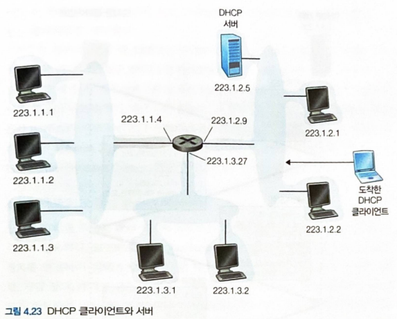

### 3. 네트워크 주소 변환(NAT)

홈 네트워크 소유자가 주소를 어떻게 관리하는지 보면 **NAT(Network Address Translation)** 를 만나게 된다.

- 홈 네트워크의 인터페이스들은 모두 같은 네트워크 주소 `10.0.0.0/24`를 갖는다.
- `10.0.0.0/8`은 홈 네트워크 같은 **사설망(private network)** 용으로 예약된 세 개의 IP 주소 공간 중 하나다. 이 주소는 그 사설망 안에서만 의미를 가진다.
- **NAT 기능 라우터는 외부 세계에게 라우터로 보이지 않는다.** 대신 **하나의 IP 주소를 갖는 하나의 장비**처럼 동작한다.
  - 예를 들어 홈에서 나가는 트래픽은 출발지 IP가 `138.76.29.7`이고, 홈으로 들어오는 트래픽은 목적지 IP가 `138.76.29.7`이다.
  - 즉 NAT 라우터는 **외부에서 볼 때 IP 주소 하나만 쓰면서** 내부의 여러 장치를 숨긴다. 내부 주소는 NAT 라우터가 DHCP 서버로 동작해 나눠 준다.

그렇다면 같은 목적지 IP 주소를 가진 데이터그램이 WAN에서 몰려 도착할 때, 라우터는 그것을 **어느 내부 호스트에게** 전달해야 할지 어떻게 알까? 답은 IP 주소와 **포트 번호**를 함께 기록하는 **NAT 변환 테이블(NAT translation table)** 이다.

**(보충) NAT 동작 예시**

> 내부 호스트 `10.0.0.1`이 포트 3345를 써서 외부 웹 서버 `128.119.40.186:80`에 접속하는 상황이다. NAT 라우터의 WAN 측 주소는 `138.76.29.7`이다.
>
> | 방향 | 출발지 | 목적지 |
> |---|---|---|
> | ① 홈 → NAT 라우터 | 10.0.0.1 : 3345 | 128.119.40.186 : 80 |
> | ② NAT 라우터 → 서버 | **138.76.29.7 : 5001** | 128.119.40.186 : 80 |
> | ③ 서버 → NAT 라우터 | 128.119.40.186 : 80 | **138.76.29.7 : 5001** |
> | ④ NAT 라우터 → 홈 | 128.119.40.186 : 80 | **10.0.0.1 : 3345** |
>
> ②에서 라우터는 출발지를 자신의 WAN 주소로 바꾸면서 **새로운 출발지 포트 번호 5001**을 배정하고, 변환 테이블에 다음 항목을 기록한다.
>
> | WAN 측 (IP, 포트) | LAN 측 (IP, 포트) |
> |---|---|
> | 138.76.29.7, 5001 | 10.0.0.1, 3345 |
>
> ③에서 응답이 포트 5001로 돌아오면, 라우터는 테이블을 조회해 목적지를 `10.0.0.1:3345`로 되돌려 쓴 뒤 내부로 전달한다. 포트 번호 필드가 16비트이므로 NAT는 **6만 개 이상의 동시 연결**을 하나의 WAN 주소로 지원할 수 있다.

**(보충) NAT에 대한 반대 의견**

NAT는 널리 쓰이지만 순수주의자들의 비판도 많다.

| 비판 | 내용 |
|---|---|
| 계층 침범 | 포트 번호는 **프로세스를 지정하기 위한** 트랜스포트 계층의 것인데, NAT는 이를 **호스트를 지정하는 데** 사용한다. 계층 구조를 어긴다 |
| 종단 간 원칙 위반 | 호스트가 서로 직접 대화하고 중간 노드는 데이터그램을 변경하지 않아야 한다는 **종단 간 원칙(end-to-end principle)** 을 깨뜨린다 |
| 주소 부족의 근본 해결 아님 | 주소 부족 문제는 NAT 같은 임시방편이 아니라 **IPv6로 해결해야 한다**는 주장이다 |
| 서버 운영·P2P의 어려움 | 외부에서 내부 호스트로 먼저 연결을 시작할 수 없다. 그래서 홈 네트워크에서 서버를 돌리거나 P2P 애플리케이션을 쓰기 어렵고, **NAT 통과(NAT traversal)** 나 **연결 반전(connection reversal)**, 릴레이 같은 우회 기법이 필요해진다 |

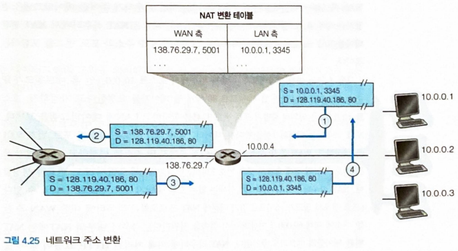 

### 4. IPv6

IPv6는 32비트 IPv4 주소 공간이 고갈될 것이라는 판단에서 만들어졌다.

#### 1. IPv6 데이터그램 포맷

IPv6에 도입된 가장 중요한 변화는 다음 세 가지다.

| 변화 | 내용 |
|---|---|
| 확장된 주소 기능 | 주소 크기를 32비트에서 **128비트**로 확장해 주소가 고갈될 일이 없게 했다. 유니캐스트·멀티캐스트 외에 **애니캐스트(anycast) 주소**가 새로 도입되어, 애니캐스트 주소로 보낸 데이터그램은 **호스트 그룹 중 아무 하나**에게 전달될 수 있다 |
| 간소화된 40바이트 고정 헤더 | 여러 IPv4 필드를 버리거나 옵션으로 남겨 **고정 길이 40바이트** 헤더를 만들었다. 새로운 옵션 인코딩은 더 유연한 옵션 처리를 가능하게 한다 |
| 흐름 레이블링 | 특정 "흐름(flow)"에 속하는 패킷에 표시를 달 수 있게 했다. 흐름의 정의 자체는 명확히 규정하지 않았으며, 높은 우선순위로 전달되어야 하는 트래픽도 흐름처럼 취급할 수 있다 |

IPv6 데이터그램의 필드는 다음과 같다.

| 필드 | 크기 | 용도 |
|---|---|---|
| 버전 | 4비트 | IP 버전 번호. 값은 **6**이다. 이 값을 4로 바꿔도 IPv4 데이터그램이 되지는 않는다(포맷이 다르다) |
| 트래픽 클래스 | 8비트 | IPv4의 TOS 필드와 비슷하다. 흐름 안에서 SMTP 이메일보다 VoIP 같은 애플리케이션에 우선순위를 주는 데 사용된다 |
| 흐름 레이블 | 20비트 | 데이터그램의 흐름을 식별한다 |
| 페이로드 길이 | 16비트 | 고정 40바이트 헤더 **뒤에 오는** 바이트 수(부호 없는 정수) |
| 다음 헤더 | 8비트 | 데이터그램의 내용을 넘겨줄 프로토콜을 지정한다(IPv4의 프로토콜 필드와 같은 역할) |
| 홉 제한 | 8비트 | 라우터가 전달할 때마다 1씩 감소한다(IPv4의 TTL과 같은 역할). 0이 되면 폐기한다 |
| 출발지 / 목적지 주소 | 각 128비트 | — |
| 데이터 | 가변 | 페이로드 |

**IPv4에는 있었지만 IPv6에서 사라진 필드**

| 사라진 필드 | 이유 |
|---|---|
| 단편화 / 재결합 관련 필드 | IPv6는 라우터에서 단편화하지 않는다. 데이터그램이 너무 크면 라우터가 폐기하고 **"패킷이 너무 큼"** ICMP 오류를 되돌려 보낸다. 라우터의 처리 속도를 높일 수 있다 |
| 헤더 체크섬 | 트랜스포트 계층과 링크 계층에서 이미 검사하므로 중복이다. IPv4는 TTL이 바뀔 때마다 라우터가 체크섬을 재계산해야 해서 비용이 컸다 |
| 옵션 | 고정 40바이트 헤더를 만들기 위해 빼냈다. 대신 "다음 헤더"가 가리키는 **확장 헤더**로 처리한다 |

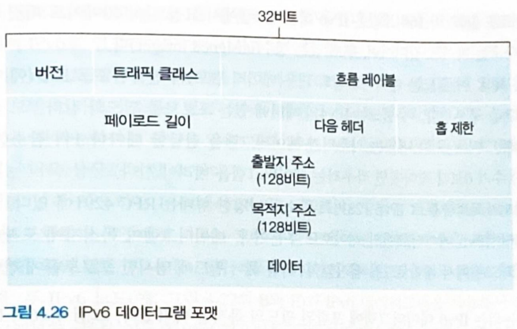

#### 2. IPv4에서 IPv6로의 전환

이미 IPv4로 구축된 시스템은 IPv6 데이터그램을 처리할 수 없다. 전환 방법으로는 두 가지가 논의되었다.

1. **플래그 데이(flag day)** — 모든 인터넷 장비를 끄고 업그레이드할 시간과 날짜를 정하는 방식이다. 오늘날의 인터넷 규모에서는 현실적으로 불가능하다.
2. **터널링(tunneling)** — 실제로 널리 사용되는 방법이다.

**터널링의 동작** — IPv4 라우터들로 이루어진 구간(터널)의 양쪽 끝에 IPv6/IPv4 겸용 노드를 두고, 그 구간을 지날 때 **IPv6 데이터그램 전체를 IPv4 데이터그램의 페이로드에 넣어** 보낸다.

- 터널 입구의 노드는 IPv6 데이터그램을 통째로 IPv4 데이터그램의 데이터 필드에 담고, 목적지 주소를 **터널 출구 노드**로 설정해 전송한다.
- 중간의 IPv4 라우터들은 이것을 평범한 IPv4 데이터그램으로 보고 전달한다. 안에 IPv6 데이터그램이 있다는 것은 전혀 알지 못한다.
- 터널 출구 노드는 IPv4 데이터그램에서 IPv6 데이터그램을 꺼내 원래 목적지로 계속 보낸다.

> 네트워크 계층 프로토콜을 바꾸는 일이 얼마나 어려운지를 IPv6 전환이 보여준다. 애플리케이션 계층 프로토콜은 새로 만들고 배포하기 쉽지만, 네트워크 계층은 인터넷의 모든 장비가 관여하기 때문이다.

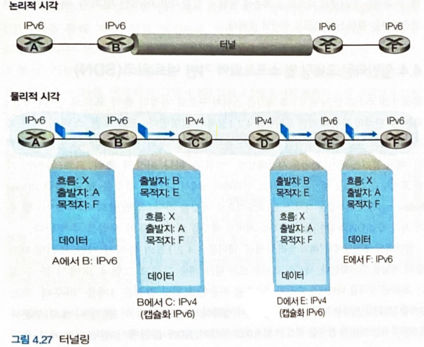

## 4. 일반화된 포워딩 및 소프트웨어 정의 네트워킹(SDN)

지금까지는 **목적지 기반 포워딩**, 즉 목적지 IP 주소를 찾아 지정된 출력 포트로 패킷을 보내는 두 단계 절차를 설명했다. **일반화된 포워딩**에서는 이 포워딩 테이블 개념을 **매치 플러스 액션 테이블**로 확장한다.

- 이 문맥에서는 장치를 "라우터"나 "스위치"보다 **패킷 스위치**라고 부르는 것이 더 정확하다. 포워딩 결정이 네트워크 계층 필드에만 근거하지 않기 때문이다.
- 각 패킷 스위치가 매치 플러스 액션 테이블을 가지며, 이 테이블은 **원격 컨트롤러가 계산·설치·갱신**한다.
- 현재 널리 쓰이는 구현은 **OpenFlow** 에서 찾을 수 있다.

OpenFlow에서 매치 플러스 액션 포워딩 테이블은 **플로우 테이블(flow table)** 이라 불리며, 각 엔트리는 다음 세 가지를 포함한다.

| 구성요소 | 내용 |
|---|---|
| 헤더 필드값 세트 | 들어오는 패킷과 매치될 값들. 하드웨어 기반 매치는 TCAM 메모리에서 매우 신속하게 수행되며 백만 개가 넘는 목적지 주소도 다룰 수 있다. 어떤 엔트리와도 매치되지 않은 패킷은 추가 처리를 위해 **원격 컨트롤러로 보낼 수 있다** |
| 카운터 세트 | 이 엔트리와 매치된 패킷들에 의해 갱신된다(매치된 패킷 수, 마지막 갱신 시각 등) |
| 액션 세트 | 매치된 패킷에 취할 조치. 지정된 출력 포트로 전달, 삭제, 복사본을 만들어 여러 출력 포트로 보내기, 선택한 헤더 필드 다시 쓰기 등 |

> 플로우 테이블은 본질적으로 **API**다. 개별 패킷 스위치의 동작을 프로그래밍할 수 있게 해 주는 것이 그 핵심 의의다.

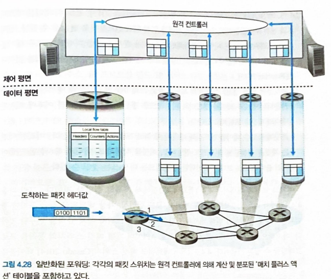

### 1. 매치

OpenFlow는 **11개의 패킷 헤더 필드와 수신 포트 ID**에 대해 매치를 허용한다. 여기서 눈여겨볼 점은 매치 대상이 **프로토콜 헤더의 세 계층에 걸쳐 있다**는 것이다.

| 계층 | 매치 가능한 필드(예) |
|---|---|
| 링크 계층 | 출발지·목적지 MAC 주소, 이더넷 타입, VLAN 필드 |
| 네트워크 계층 | 출발지·목적지 IP 주소, IP 프로토콜, TOS |
| 트랜스포트 계층 | 출발지·목적지 포트 번호 |

- **MAC 주소**는 프레임의 송신·수신 인터페이스와 연관된 링크 계층 주소다. IP 주소가 아닌 이더넷 주소를 기반으로 전달할 수 있다는 것은, OpenFlow 지원 장치가 **2계층 스위치처럼 프레임을 전달하는 일과 3계층 라우터처럼 데이터그램을 전달하는 일을 모두** 할 수 있음을 뜻한다.
- **이더넷 타입 필드**는 프레임의 페이로드를 역다중화할 상위 계층 프로토콜에 해당하고, **VLAN 필드**는 가상 로컬 영역 네트워크와 관련된다.
- 다만 **IP 헤더의 모든 필드가 매치 대상은 아니다.** 예를 들어 TTL 필드나 데이터그램 길이 필드에 기반한 매치는 허용되지 않는다.

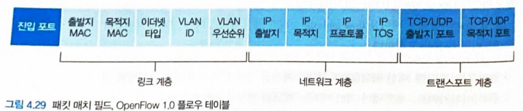

### 2. 액션

각 플로우 테이블 엔트리는 매치된 패킷을 어떻게 처리할지 결정하는 **0개 이상의 액션 목록**을 갖는다. 가장 중요한 액션은 다음과 같다.

| 액션 | 내용 |
|---|---|
| 포워딩 | 특정 출력 포트로 전달하거나, 모든 포트로 브로드캐스트하거나, 선택된 포트 세트로 멀티캐스트한다. 또는 패킷을 캡슐화해 **원격 컨트롤러로 전송**할 수 있다. 컨트롤러는 새 플로우 테이블 엔트리를 설치하고 해당 패킷을 직접 처리하거나, 갱신된 규칙에 따라 전달하도록 패킷을 장치로 되돌려 보낸다 |
| 삭제 | **아무 액션이 없는** 엔트리는 매치된 패킷을 삭제해야 함을 뜻한다 |
| 필드 수정 | 패킷이 선택된 출력 포트로 전달되기 전에 **10개의 패킷 헤더 필드값을 다시 쓸 수 있다** |

### 3. 매치 플러스 액션 작업의 OpenFlow 예

**(보충)** 세 예시 모두 원문에 제목만 있어 교재의 표준 예를 바탕으로 채웠다. 아래 예들은 스위치 s1, s2, s3가 있고 호스트 h1(10.1.0.1)~h4(10.2.0.4)가 연결된 구성을 가정한다.

#### 1. 첫 번째 예: 간단한 포워딩

s2에 도착한, **h5(10.3.0.5)에서 h6(10.3.0.6)으로 가는** 패킷을 s3 방향으로 보내려는 상황이다. 경로상의 각 스위치에 다음과 같은 엔트리를 설치하면 된다.

| 스위치 | 매치 | 액션 |
|---|---|---|
| s1 | IP 출발지 = 10.3.0.5, IP 목적지 = 10.3.0.6 | 포트 2로 포워딩 |
| s2 | 수신 포트 = 1, IP 출발지 = 10.3.0.5, IP 목적지 = 10.3.0.6 | 포트 4로 포워딩 |
| s3 | 수신 포트 = 2, IP 목적지 = 10.3.0.6 | 포트 3으로 포워딩 |

목적지 IP 하나만 보고 결정하지 않고 **출발지 주소와 수신 포트까지 함께 매치**할 수 있다는 점이 목적지 기반 포워딩과의 차이다. 특정 출발지의 트래픽만 다른 경로로 보내는 것이 가능해진다.

#### 2. 두 번째 예: 로드 밸런싱

같은 목적지로 향하는 트래픽을 **출발지에 따라 서로 다른 경로로 분산**시킬 수 있다.

| 매치 | 액션 |
|---|---|
| IP 출발지 = 10.3.\*.\*, IP 목적지 = 10.4.\*.\* | 포트 3으로 포워딩 |
| IP 출발지 = 10.1.\*.\*, IP 목적지 = 10.4.\*.\* | 포트 4로 포워딩 |

10.4.\*.\*로 가는 트래픽이라도 출발지가 10.3 서브넷이면 한 경로로, 10.1 서브넷이면 다른 경로로 나간다. 라우팅 프로토콜을 바꾸지 않고 **컨트롤러가 정책만 내려보내** 부하를 나눌 수 있다.

#### 3. 세 번째 예: 방화벽

특정 트래픽만 통과시키고 나머지는 버리는 규칙이다.

| 매치 | 액션 |
|---|---|
| IP 출발지 = 10.3.\*.\*, TCP 목적지 포트 = 22 | 포트 3으로 포워딩 |
| (그 외 모든 패킷) | 액션 없음 → **삭제** |

s2는 10.3 서브넷에서 오는 SSH(포트 22) 트래픽만 통과시키고, 나머지 패킷은 매치되는 엔트리가 없으므로 폐기한다. **엔트리 부재 자체가 차단 규칙으로 동작**한다.

> 매치 플러스 액션 플로우 테이블은 **제한된 형태의 프로그래밍 가능성**을 제공한다. 임의의 프로그램을 돌릴 수는 없지만, 이 정도만으로도 포워딩·로드 밸런싱·방화벽·NAT를 하나의 틀로 표현할 수 있다.

## 5. 미들박스

라우터가 네트워크 계층의 대표 작업자이지만, 실제 네트워크에는 데이터 평면에서 다른 일을 하는 장비들도 놓여 있다. 이런 장비를 **미들박스(middlebox)** 라 하며, 제공하는 서비스는 크게 세 유형으로 식별할 수 있다.

| 유형 | 내용 |
|---|---|
| NAT 변환 | NAT 박스는 사설 네트워크 주소체계를 구현하며, 데이터그램 헤더의 **IP 주소와 포트 번호를 다시 쓴다** |
| 보안 서비스 | 방화벽은 헤더 필드값을 기준으로 트래픽을 차단하고, **DPI(Deep Packet Inspection)** 같은 추가 처리를 위해 패킷을 리다이렉션한다 |
| 성능 향상 | 캐싱, 압축 같은 서비스를 수행한다. 또한 동일한 서비스를 제공할 수 있는 여러 서버 중 하나로 요청을 분배하는 **로드 밸런싱**의 주체가 된다 |

미들박스가 확산되면서 새로운 문제도 생겼다.

- 운영자는 이 장비들을 **운영·관리·업그레이드**해야 한다.
- **별도의 특수 하드웨어 상자 + 별도의 소프트웨어 스택 + 별도의 관리·운영 기술**이 필요해, 상당한 운영 비용과 자본 비용으로 이어진다.
- 그래서 이런 기능들을 전용 하드웨어에서 떼어내 **범용 서버 위의 소프트웨어로 구현**하려는 접근이 등장했고, 이를 **네트워크 기능 가상화(NFV, Network Function Virtualization)** 라 부른다.

> 미들박스는 계층 구조에도 영향을 준다. 라우터와 호스트 사이에 놓인 NAT 박스는 네트워크 계층의 IP 주소와 **트랜스포트 계층의 포트 번호를 함께 다시 쓴다.** 계층 사이의 깔끔한 경계가 현실에서는 그렇게 유지되지 않는다는 뜻이다.

## 6. 요약

- **네트워크 계층의 두 기능** — 라우팅(제어 평면, 종단 간 경로 결정, 소프트웨어, 긴 시간 척도)과 포워딩(데이터 평면, 출력 링크로 이동, 하드웨어, 짧은 시간 척도)으로 나뉜다. 전통적으로는 라우팅이 각 라우터에서 실행되지만, **SDN**은 이를 원격 컨트롤러로 분리한다.
- **인터넷의 서비스 모델** — 전달도 순서도 지연도 대역폭도 보장하지 않는 **최선형 서비스**다. 그럼에도 충분한 대역폭 공급과 적응형 애플리케이션(DASH 등)의 결합으로 잘 작동해 왔다.
- **라우터 내부** — 입력 포트, 스위치 구조, 출력 포트, 라우팅 프로세서로 구성된다. 입력 포트는 **가장 긴 프리픽스 매치**로 출력 포트를 찾고, 스위칭은 메모리·버스·상호연결 네트워크 세 방식으로 수행된다.
- **큐잉과 스케줄링** — 큐는 입력 포트(HOL 차단)와 출력 포트(패킷 손실, AQM/RED) 양쪽에 생긴다. 버퍼가 지나치게 크면 **버퍼블로트**로 지연이 커진다. 스케줄링 규칙으로 FIFO, 우선순위 큐잉, 라운드 로빈, **WFQ**가 있다.
- **IPv4** — 20바이트 헤더에 TTL, 프로토콜, 헤더 체크섬, 단편화 필드 등을 갖는다. 주소는 **인터페이스에 결합**되는 32비트 값이며, **CIDR**의 `a.b.c.d/x` 표기로 프리픽스와 호스트 부분을 나눈다. 주소 블록은 ISP·ICANN에서 받고, 호스트 주소는 **DHCP**로 자동 할당한다.
- **NAT** — 하나의 공인 IP로 사설망 전체를 대표하며, 포트 번호를 담은 변환 테이블로 내부 호스트를 구분한다. 주소 부족을 완화하지만 계층 침범과 종단 간 원칙 위반이라는 비판을 받는다.
- **IPv6** — 주소를 **128비트**로 확장하고 헤더를 **40바이트 고정 길이**로 간소화했다(단편화·체크섬·옵션 제거). 전환은 플래그 데이가 아니라 **터널링**으로 점진적으로 이루어진다.
- **일반화된 포워딩** — OpenFlow의 **플로우 테이블**은 링크·네트워크·트랜스포트 세 계층의 필드에 매치하고 포워딩·삭제·필드 수정 액션을 취한다. 하나의 틀로 라우터, 스위치, 로드 밸런서, 방화벽을 모두 표현할 수 있다.
- **미들박스** — NAT, 방화벽·DPI, 캐싱·로드 밸런싱을 수행하는 장비들이다. 운영 비용 문제 때문에 범용 서버의 소프트웨어로 옮기는 **NFV** 로 향하고 있다.
