## 1. 개요

4장에서 포워딩 테이블과 플로우 테이블은 네트워크 계층의 데이터 평면과 제어 평면을 연결하는 주요 요소였다. 이 테이블들이 라우터의 로컬 데이터 평면에서의 포워딩을 지정했다.

일반화된 포워딩의 경우 라우터가 취하는 행동은 다양한 형태로 나타날 수 있다. 라우터의 출력 포트로 패킷을 전달하는 것뿐만 아니라 패킷을 버리거나 복제하거나, 2·3·4 계층의 헤더 필드를 재작성할 수도 있다. 그래서 이번 장에서는 **포워딩 테이블과 플로우 테이블이 어떻게 만들어지고 유지·설치되는지**를 알아본다.

제어 평면을 구축하는 방식은 크게 두 가지다.

| 구분 | 라우터별 제어 | 논리적 중앙 집중형 제어 |
|---|---|---|
| 계산 주체 | 모든 라우터 각각에서 라우팅 알고리즘이 동작 | 중앙 집중형 컨트롤러가 계산 |
| 정보 교환 | 각 라우터가 다른 라우터의 라우팅 구성요소와 통신 | 컨트롤러가 계산 결과를 개별 라우터에 배포 |
| 라우터의 역할 | 자신의 포워딩 테이블 값을 스스로 계산하는 라우팅 구성요소를 가짐 | 제어 에이전트(CA)가 컨트롤러의 명령을 수행 |
| 대표 사례 | OSPF, BGP | SDN |

논리적 중앙 집중형 제어에서는 **매치 플러스 액션 추상화**를 통해 라우터가 전통적인 IP 포워딩뿐만 아니라, 기존에는 별도의 장치로 구현되었던 다양한 기능까지 수행할 수 있다.

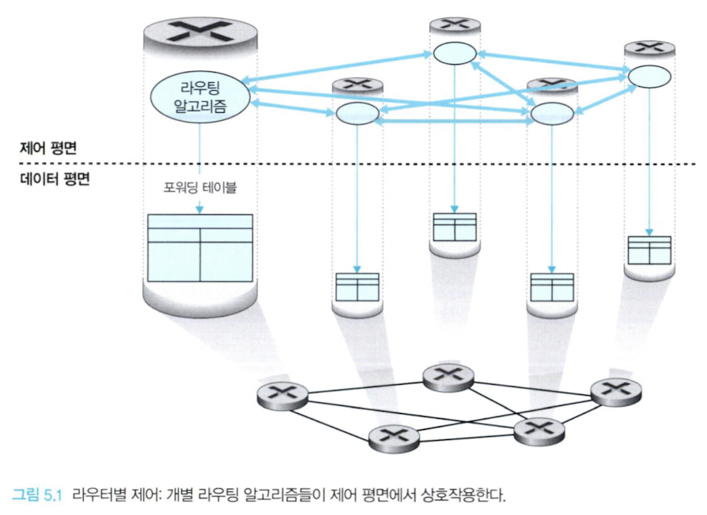
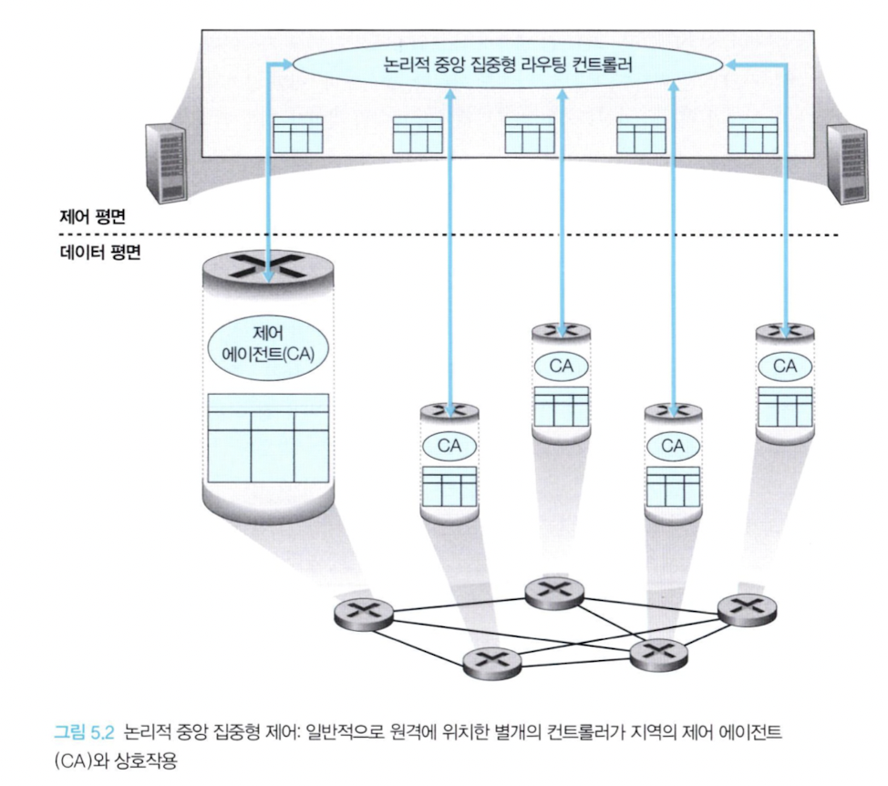

컨트롤러는 잘 정의된 프로토콜을 통해 각 라우터의 **제어 에이전트(CA)** 와 상호작용하여 라우터의 플로우 테이블을 구성 및 관리한다. CA는 컨트롤러와 통신하고 명령을 수행하는 최소한의 기능만 갖는다. 라우팅 알고리즘과 달리 CA는 서로 직접 상호작용하지 않으며 포워딩 테이블을 계산하는 데도 적극적으로 참여하지 않는다.

> 이것이 라우터별 제어와 논리적 중앙 집중형 제어의 주요 차이점이다.

논리적 중앙 집중형 제어는 고장 또는 참여 호스트 수의 증가에 따른 성능 저하 문제에 대응하기 위해 여러 개의 서버에 라우팅 서비스가 구현된다. SDN은 이 논리적 중앙 집중형 컨트롤러 개념을 채택했으며, SDN 제어는 4G/5G 셀룰러 네트워킹에서도 핵심 기술이다.

## 2. 라우팅 알고리즘

라우팅 알고리즘의 목표는 송신자부터 수신자까지 라우터의 네트워크를 통과하는 **좋은 경로**를 결정하는 것이다. 여기서 좋은 경로란 최소 비용 경로를 말한다. 패킷이 전송 호스트에서 수신 호스트로 이동하기 위한 잘 정의된 일련의 라우터가 항상 존재해야 하며, 이러한 경로를 계산하는 라우팅 알고리즘은 네트워킹의 기본이다.

### 그래프 모델

라우팅 문제를 나타내는 데는 그래프가 사용된다. 그래프는 G(N, E)로 나타내는데 N과 E는 각각 노드와 엣지의 집합이고, 하나의 엣지는 집합 N에 속하는 한 쌍의 노드로 표시된다.

엣지는 그 비용을 나타내는 값을 갖는다. 비용은 일반적으로 해당 링크의 물리적인 거리, 링크 속도, 링크와 관련된 금전 비용 등을 반영한다. 여기서는 모든 엣지가 방향성을 갖지 않는 무방향성 그래프만을 고려하지만, 살펴볼 알고리즘들은 양방향으로 서로 다른 비용을 갖는 방향성 링크의 경우로 쉽게 확장할 수 있다.

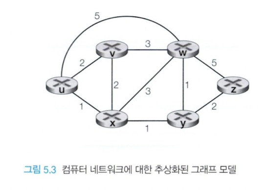

- 최소 비용 경로는 여러 개일 수도 있다.
- 모든 엣지가 같은 비용을 갖는다면 최소 비용 경로가 바로 최단 경로가 된다.

### 라우팅 알고리즘의 분류

| 분류 축 | 유형 | 특징 |
|---|---|---|
| 정보의 범위 | 중앙 집중형(링크 상태) | 네트워크 전체에 대한 완전한 정보를 갖고 계산 |
| | 분산형(거리 벡터) | 직접 연결된 링크 비용만 알고 시작해 반복적으로 계산 |
| 변화 대응 | 정적(static) | 아주 느리게 변하며, 종종 사람이 개입한 결과다 |
| | 동적(dynamic) | 트래픽 부하나 토폴로지 변화에 따라 경로를 바꾼다 |
| 부하 반영 | 부하에 민감 | 링크 비용이 현재 혼잡 수준에 따라 동적으로 변한다 |
| | 부하에 둔감 | 링크 비용이 현재 혼잡을 반영하지 않는다 |

#### 중앙 집중형 라우팅 알고리즘

네트워크 전체에 대한 완전한 정보를 가지고 출발지와 목적지 사이의 최소 비용 경로를 계산한다. 즉 모든 노드 사이의 연결 상태와 링크 비용을 입력값으로 한다. 계산 자체는 한 장소에서 수행되거나 모든 라우터 각각의 모듈로 복사될 수 있는데, 핵심적인 특징은 **연결과 링크 비용에 대한 완전한 정보를 갖는다**는 점이다. 이렇게 전체 상태 정보를 갖는 알고리즘을 **링크 상태(LS) 알고리즘**이라 하는데, 네트워크 내 각 링크의 비용을 알고 있어야 하기 때문이다.

#### 분산 라우팅 알고리즘

최소 비용 경로의 계산이 라우터들에 의해 반복적이고 분산된 방식으로 수행된다. 모든 링크의 비용에 대한 완전한 정보를 갖고 있지 않고, 직접 연결된 링크에 대한 비용 정보만을 가지고 시작한다. 이를 **거리 벡터(DV) 알고리즘**이라 하는데, 모든 노드끼리 비용(거리)의 추정값을 벡터 형태로 유지하기 때문이다.

#### 부하에 민감한 알고리즘

링크 비용은 해당 링크의 현재 혼잡 수준을 나타내기 위해 동적으로 변한다. 현재 혼잡한 링크에 높은 비용을 부과한다면 라우팅 알고리즘은 혼잡한 링크를 우회하는 경로를 택하는 경향을 보일 것이다. 다만 오늘날 인터넷 라우팅 알고리즘(RIP, OSPF, BGP 등)은 링크 비용이 현재의 혼잡을 반영하지 않기 때문에 부하에 민감하지 않다.

### 1. 링크 상태(LS) 라우팅 알고리즘

링크 상태 알고리즘에서는 네트워크 토폴로지와 모든 링크 비용이 알려져 있어서 알고리즘의 입력값으로 사용될 수 있다. 이는 각 노드가 자신과 직접 연결된 링크의 식별자와 비용 정보를 담은 **링크 상태 패킷**을 네트워크상의 다른 모든 노드로 브로드캐스트함으로써 가능하다. OSPF에서는 이 작업이 링크 상태 브로드캐스트 알고리즘에 의해 수행된다.

링크 상태 라우팅 알고리즘으로는 **다익스트라(Dijkstra) 알고리즘**을 사용하며, 밀접하게 관련된 알고리즘으로 **프림(Prim) 알고리즘**이 있다.

#### 1. 다익스트라 알고리즘 동작 예시

위 그래프 모델에서 출발지를 u로 두고, 링크 비용이 다음과 같다고 하자.

| 링크 | 비용 | 링크 | 비용 |
|---|---|---|---|
| u–v | 2 | w–x | 3 |
| u–w | 5 | w–y | 1 |
| u–x | 1 | w–z | 5 |
| v–w | 3 | x–y | 1 |
| v–x | 2 | y–z | 2 |

D(n)은 u에서 노드 n까지의 현재 최소 비용, p(n)은 그 경로에서 n 직전의 노드, N'은 최소 비용 경로가 확정된 노드 집합이다. 매 단계에서 **N'에 속하지 않은 노드 중 D(n)이 가장 작은 노드**를 N'에 추가하고, 그 노드의 이웃들의 D 값을 갱신한다.

| 단계 | N' | D(v), p(v) | D(w), p(w) | D(x), p(x) | D(y), p(y) | D(z), p(z) |
|---|---|---|---|---|---|---|
| 0 | u | 2, u | 5, u | 1, u | ∞ | ∞ |
| 1 | ux | 2, u | 4, x | — | 2, x | ∞ |
| 2 | uxy | 2, u | 3, y | — | — | 4, y |
| 3 | uxyv | — | 3, y | — | — | 4, y |
| 4 | uxyvw | — | — | — | — | 4, y |
| 5 | uxyvwz | — | — | — | — | — |

링크 상태 알고리즘이 종료된 후에는 각 목적지에 대해 **최소 비용 경로상의 직전 노드**를 알게 된다. 예를 들어 z의 직전 노드는 y, y의 직전 노드는 x, x의 직전 노드는 u이므로 u에서 z까지의 경로는 u → x → y → z(비용 4)로 역추적된다. 이렇게 테이블을 구축해 전체 경로를 구축할 수 있고, 첫 홉이 x이므로 u의 포워딩 테이블에는 "목적지 z → 링크 (u, x)"가 들어간다.

계산 복잡도는 최악의 경우 **O(n<sup>2</sup>)** 이다. (매 단계에서 아직 확정되지 않은 노드를 모두 훑어 최솟값을 찾기 때문이며, 힙 등의 자료구조를 쓰면 더 줄일 수 있다.)

#### 2. 링크 상태 알고리즘에서 발생하는 문제: 경로 진동

링크 비용이 **링크에 실린 트래픽 양**을 반영하도록(부하에 민감하게) 설정하면 **경로 진동(oscillation)** 이 발생할 수 있다.

1. 모든 라우터가 동시에 LS 알고리즘을 수행해 최소 비용 경로를 계산한다.
2. 트래픽이 비용이 낮은 쪽 링크로 한꺼번에 몰린다.
3. 다음 계산 주기에서는 그 링크의 비용이 높아졌으므로 트래픽이 통째로 반대쪽 링크로 옮겨간다.
4. 다시 반대쪽이 혼잡해지고, 이 과정이 무한히 반복된다.

즉 링크가 번갈아 가며 "비었다가 꽉 찼다가"를 반복하고, 경로도 매 주기 뒤집힌다. 해결책은 다음과 같다.

- 링크 비용이 트래픽 양에 의존하지 않도록 한다. 다만 라우팅의 목적 중 하나가 혼잡 회피이므로 완전한 해법은 아니다.
- 모든 라우터가 동시에 LS 알고리즘을 수행하지 않도록 한다. 실제로는 각 라우터가 링크 상태 알림을 보내는 시점을 **무작위화**하여 자기 동기화(self-synchronization)를 막는다.

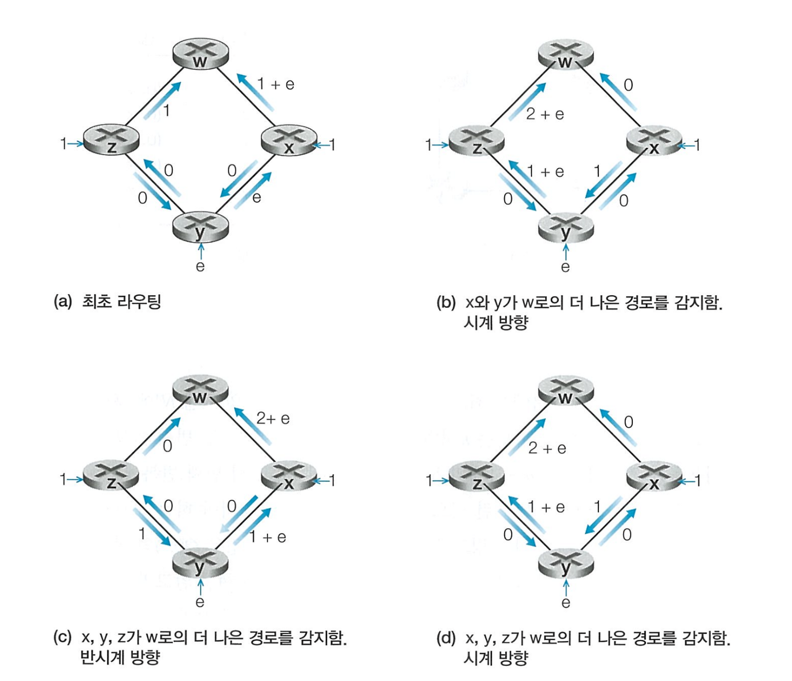

### 2. 거리 벡터(DV) 라우팅 알고리즘

거리 벡터 알고리즘의 성격은 세 가지로 요약된다.

| 성격 | 의미 |
|---|---|
| 분산적(distributed) | 직접 연결된 이웃으로부터 정보를 받고, 계산을 수행하며, 계산된 결과를 다시 그 이웃들에게 알린다 |
| 반복적(iterative) | 이웃끼리 더 이상 정보를 교환하지 않을 때까지 이 과정을 지속한다 |
| 비동기적(asynchronous) | 모든 노드가 서로 정확히 맞물려 동작할 필요가 없다 |

최소 비용은 유명한 **벨만-포드(Bellman-Ford) 식**에 의해 다음과 같이 나타낼 수 있다.

> d<sub>x</sub>(y) = min<sub>v</sub> { c(x, v) + d<sub>v</sub>(y) }
>
> x에서 y까지의 최소 비용은, x의 각 이웃 v에 대해 "x에서 v까지의 링크 비용 + v에서 y까지의 최소 비용"을 계산했을 때의 최솟값이다.

각 노드 x는 자신의 거리 벡터 D<sub>x</sub> = [D<sub>x</sub>(y) : y ∈ N]와 이웃들의 거리 벡터를 유지한다. 어떤 이웃으로부터 새 거리 벡터를 받으면 위 식으로 자신의 D<sub>x</sub>를 갱신하고, 값이 바뀌었다면 그 결과를 다시 이웃들에게 알린다. 이 과정을 반복하면 D<sub>x</sub>(y)는 실제 최소 비용 d<sub>x</sub>(y)로 수렴한다.

DV 계열 알고리즘은 인터넷의 RIP, BGP, ISO IDRP, Novell IPX, 초기의 ARPAnet 등 많은 라우팅 알고리즘에서 사용된다.

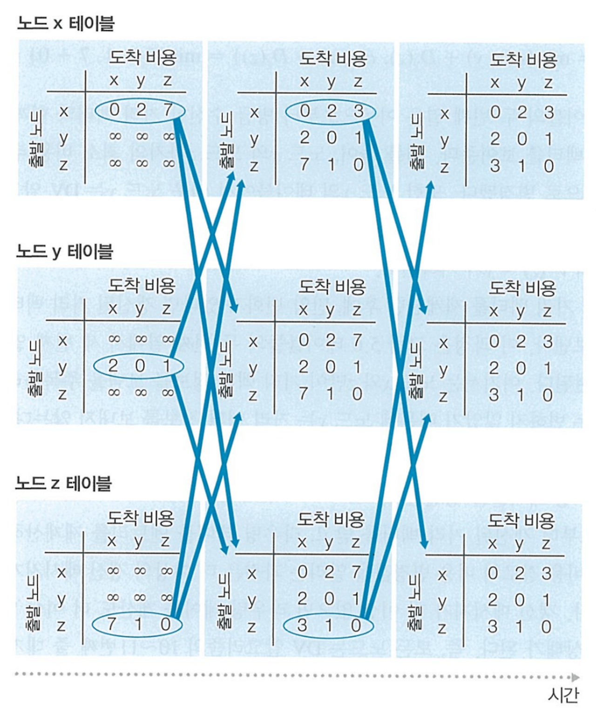

#### 1. 거리 벡터(DV) 알고리즘: 링크 비용 변경과 링크 고장

노드는 자신과 직접 연결된 링크 비용의 변화를 감지하면 거리 벡터를 갱신하고, 최소 비용 경로가 바뀌었다면 이웃에게 알린다. 그런데 비용이 줄어들 때와 늘어날 때의 전파 양상이 크게 다르다.

| 상황 | 별칭 | 전파 양상 |
|---|---|---|
| 링크 비용 **감소** | 좋은 소식은 빨리 퍼진다 | 몇 번의 교환만으로 곧바로 새로운 최소 비용에 수렴한다 |
| 링크 비용 **증가**(또는 링크 고장) | 나쁜 소식은 느리게 퍼진다 | **무한 계수(count-to-infinity)** 문제로 수렴까지 매우 많은 반복이 필요하다 |

**무한 계수 문제** — x, y, z 세 노드가 있고 c(x, y) = 4, c(y, z) = 1, c(x, z) = 50이라고 하자. 여기서 c(x, y)가 4에서 60으로 올랐다고 하면,

1. y는 x로 가는 직접 링크 비용이 60이 되었음을 알지만, 이전에 z가 알려준 D<sub>z</sub>(x) = 5를 기억하고 있다.
2. 그래서 y는 "z를 거치면 1 + 5 = 6"이라고 판단하고 D<sub>y</sub>(x) = 6으로 갱신한다. 하지만 **z가 x로 가는 경로는 실제로는 y를 거치는 경로**다. 즉 y와 z 사이에 라우팅 루프가 생긴다.
3. z는 y의 갱신을 받고 D<sub>z</sub>(x) = 7로 올리고, y는 다시 8로 올리고… 이 과정이 값이 50(z–x 직접 링크 비용)을 넘길 때까지 반복된다.

결국 올바른 경로를 찾기까지 44번의 반복이 필요하다. 값이 천천히 무한대를 향해 올라간다는 뜻에서 무한 계수 문제라고 부른다.

#### 2. 거리 벡터 알고리즘: 포이즌 리버스 추가

**포이즌 리버스(poisoned reverse)** 는 위의 루프를 막기 위한 기법이다.

> z가 x로 가기 위해 y를 거친다면, z는 y에게 "나는 x까지 가는 거리가 무한대(∞)"라고 알린다.

y는 z를 통한 x 경로 비용이 ∞라고 믿게 되므로 z 쪽으로 우회하려 하지 않는다. 따라서 c(x, y)가 60으로 오르면 y는 곧바로 직접 링크(비용 60)를 택하고, 무한 계수 없이 수렴한다.

다만 이 기법은 **두 노드로 이루어진 루프만 해결**한다. 세 개 이상의 노드가 얽힌 루프는 포이즌 리버스로 감지되지 않는다.

#### 3. 링크 상태 알고리즘과 거리 벡터 라우팅 알고리즘의 비교

| 비교 축 | 링크 상태(LS) | 거리 벡터(DV) |
|---|---|---|
| 메시지 복잡도 | 모든 노드가 모든 링크 비용을 알아야 하므로 O(\|N\|·\|E\|)개의 메시지를 브로드캐스트한다. 링크 비용 하나만 바뀌어도 전체에 알려야 한다 | 직접 연결된 이웃하고만 교환한다. 다만 링크 비용 변화가 최소 비용 경로를 바꾸면 그 변화가 계속 전파될 수 있다 |
| 수렴 속도 | O(\|N\|<sup>2</sup>)의 계산으로 비교적 빠르지만 **경로 진동**이 생길 수 있다 | 수렴이 느릴 수 있고 **라우팅 루프·무한 계수** 문제가 있다 |
| 견고성(robustness) | 라우터가 잘못된 링크 비용을 브로드캐스트해도 각 노드는 자기 테이블만 계산하므로 영향이 어느 정도 국지적이다 | 잘못된 경로 비용이 이웃에게, 다시 그 이웃에게 전파되어 네트워크 전체로 퍼질 수 있다 |

> 어느 한쪽이 명백히 우월하지는 않다. 실제로 인터넷에서는 두 방식이 모두 쓰인다 — OSPF는 LS, BGP는 DV 계열이다.

## 3. 인터넷에서의 AS 내부 라우팅: OSPF

지금까지는 네트워크를 **동일한 라우팅 알고리즘을 수행하는 동종의 라우터 집합**으로 간주했다. 이 관점은 두 가지 이유에서 지나치게 단순하다.

| 문제 | 내용 |
|---|---|
| 확장(scale) | 라우터 수가 증가함에 따라 라우팅 정보의 통신·계산·저장에 필요한 오버헤드가 걷잡을 수 없이 증가한다. 라우팅 정보를 저장하기 위해 막대한 양의 메모리가 필요하다 |
| 관리 자율성 | 인터넷은 ISP들의 네트워크이며 각 ISP는 자신의 네트워크를 스스로 관리하고, 네트워크 내부 구성을 외부에 감추기를 원한다 |

이 두 가지 문제는 라우터들을 **자율 시스템(AS, Autonomous System)** 으로 조직화하여 해결할 수 있다.

- 각 AS는 동일한 관리 제어하에 있는 라우터의 그룹으로 구성된다.
- 한 ISP의 라우터와 그들을 연결하는 링크가 종종 하나의 AS를 이루며, 어떤 ISP들은 자신의 네트워크를 여러 개의 AS로 나누기도 한다.
- 자율 시스템은 고유한 **AS 번호(ASN)** 로 식별되며, ICANN의 등록 기관에 의해 할당된다.
- 같은 AS 안에 있는 라우터들은 동일한 라우팅 알고리즘을 사용하고 상대방에 대한 정보를 갖고 있다.
- 자율 시스템 내부에서 동작하는 라우팅 알고리즘을 **AS 내부 라우팅 프로토콜**이라고 한다.

### 1. 개방형 최단 경로 우선(OSPF) 프로토콜

OSPF와 그 사촌 격인 IS-IS는 인터넷에서 AS 내부 라우팅에 널리 사용된다. OSPF는 링크 상태 정보를 플러딩하고 다익스트라 최소 비용 경로 알고리즘을 사용하는 **링크 상태 알고리즘**이다.

- OSPF를 이용해 각 라우터는 전체 AS에 대한 완벽한 토폴로지 지도를 얻는다.
- 개별 링크들의 비용은 네트워크 관리자가 구성한다.
- OSPF를 사용하는 라우터는 인접한 라우터만이 아니라 **자율 시스템 내의 다른 모든 라우터**에게 라우팅 정보를 브로드캐스트한다.
- 링크 상태가 변경될 때마다 브로드캐스트하며, 변경되지 않아도 정기적으로 링크 상태를 브로드캐스트한다.

OSPF에 구현된 개선사항들은 다음과 같다.

#### 1. 보안

OSPF 라우터들 간의 정보 교환을 인증할 수 있다. 인증을 통해 신뢰할 수 있는 라우터들만이 AS 내부의 OSPF 프로토콜에 참여할 수 있고, 악의적인 침입자가 잘못된 정보를 라우팅 테이블에 삽입하는 것을 막게 된다.

| 인증 방식 | 동작 |
|---|---|
| 단순 인증 | 라우터가 OSPF 패킷을 보낼 때 패스워드를 평문 그대로 포함한다 |
| MD5 인증 | OSPF 패킷에 대해 비밀키를 첨부한 후 MD5 해시를 계산해 함께 보낸다 |

#### 2. 복수 동일 비용 경로

동일한 비용을 가진 여러 개의 경로가 존재할 때 OSPF는 그 여러 개의 경로를 모두 사용할 수 있도록 한다.

#### 3. 유니캐스트와 멀티캐스트 라우팅의 통합 지원

**MOSPF**는 멀티캐스트 라우팅 기능을 제공하기 위해 OSPF를 단순 확장한 것이다. 기존 OSPF 링크 데이터베이스를 그대로 사용하고, OSPF 링크 상태 브로드캐스트 메커니즘에 새로운 형태의 링크 상태 알림을 추가한다.

#### 4. 단일 AS 내에서의 계층 지원

OSPF의 자율 시스템은 계층적인 **영역(area)** 으로 구성될 수 있다.

- 각 영역은 자신의 OSPF 링크 상태 라우팅 알고리즘을 수행하는데, 한 영역 내의 라우터는 같은 영역 내의 라우터들에게만 링크 상태를 브로드캐스트한다.
- **영역 경계 라우터**가 영역 외부로의 패킷 라우팅을 책임진다.
- AS에서 오직 하나의 OSPF 영역만이 **백본 영역**으로 설정된다. 백본 영역의 주요 역할은 AS 내 영역 간의 트래픽을 라우팅하는 것이다.
- 백본은 항상 AS 내 모든 영역 경계 라우터를 포함하고, 일부 비경계 라우터도 포함할 수 있다.

AS 내 영역 간 라우팅은 다음 순서로 이루어진다.

1. 먼저 영역 경계 라우터로 패킷을 라우팅한다.
2. 백본을 통과하여 목적지 영역의 영역 경계 라우터로 라우팅한다.
3. 그 영역 내에서 최종 목적지로 라우팅한다.

## 4. 인터넷 서비스 제공업자(ISP) 간의 라우팅: BGP

패킷이 여러 AS를 통과하도록 라우팅할 때는 **AS 간(inter-AS) 라우팅 프로토콜**이 필요하다. AS 간 라우팅에는 여러 AS 간의 협력이 수반되므로, 통신하는 AS들은 같은 AS 간 라우팅 프로토콜을 수행해야만 한다.

실제로 인터넷의 모든 AS는 **경계 게이트웨이 프로토콜(BGP, Border Gateway Protocol)** 이라고 불리는 동일한 AS 간 라우팅 프로토콜을 사용한다.

> BGP는 인터넷에 있는 수천 개의 ISP들을 연결하는 프로토콜이므로 인터넷 프로토콜들 중에서 가장 중요하다고 말할 수 있다.

BGP는 거리 벡터 라우팅과 같은 줄기에서 나왔다고 볼 수 있는 분산형 비동기식 프로토콜이다.

### 1. BGP의 역할

어떤 AS와 그 AS 내의 임의의 라우터를 가정해보자. 모든 라우터는 포워딩 테이블을 갖고 있고, 도착한 패킷을 출력 링크로 내보내는 과정에서 중추적인 역할을 한다. 목적지가 같은 AS 안에 있다면 포워딩 테이블 엔트리들은 그 AS의 AS 내부 라우팅 프로토콜(OSPF 등)에 의해 결정된다.

그렇다면 **목적지가 AS 외부에 있는 경우**는 어떻게 되는가? 이럴 때 BGP가 필요하다.

BGP에서는 패킷이 특정한 목적지 주소를 향해서가 아니라 **CIDR 형식으로 표현된 주소의 앞쪽 프리픽스**를 향해 전달된다. 각 프리픽스는 하나의 서브넷 또는 서브넷의 집합을 나타낸다.

AS 간 라우팅 프로토콜로서 BGP는 각 라우터에서 다음과 같은 수단을 제공한다.

| 역할 | 설명 |
|---|---|
| 도달 가능성 정보 획득 | 이웃 AS를 통해 도달 가능한 서브넷 프리픽스 정보를 얻는다. BGP는 각 서브넷이 자신의 존재를 인터넷 전체에 알릴 수 있도록 한다. BGP가 없다면 각 서브넷들은 고립된 섬이 될 것이다 |
| 최고의 경로 결정 | 서브넷 주소 프리픽스로 가는 가장 좋은 경로를 결정한다. 라우터는 특정 프리픽스를 향한 2개 이상의 경로를 알 수도 있는데, 이때 BGP의 경로 결정 프로시저를 수행한다. 최고의 경로는 도달 가능성 정보뿐만 아니라 **정책**에 기반해서 결정된다 |

### 2. BGP 경로 정보 알리기

3개의 자율 시스템 AS1, AS2, AS3로 이루어진 단순한 네트워크를 생각해보자. AS3는 주소 프리픽스가 x인 서브넷을 포함한다. 각 AS에서 라우터들은 게이트웨이 라우터이거나 내부 라우터다.

| 라우터 종류 | 연결 대상 |
|---|---|
| 게이트웨이 라우터 | AS의 경계에 있는 라우터로서, 다른 AS들에 있는 여러 개의 라우터와 직접 연결된다 |
| 내부 라우터 | 자신의 AS 내에 있는 호스트 및 라우터와만 연결된다 |

AS3가 AS2에게 BGP 메시지를 보내 "x가 존재하고 AS3 내에 있다"고 알린다. 이어서 AS2가 AS1에게 "x는 AS2를 거쳐 AS3로 갈 수 있다"고 알리는 식으로, 각 AS는 목적지 프리픽스뿐만 아니라 **거쳐 가는 자율 시스템의 경로**까지 알게 된다.

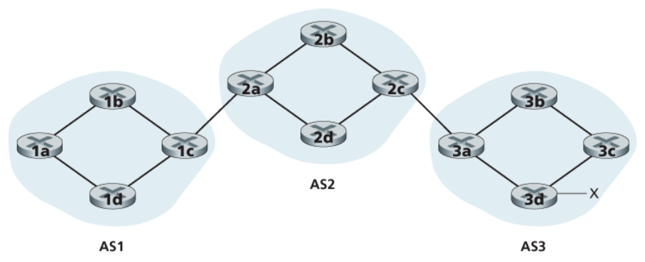

BGP 라우터 쌍은 **TCP 연결**을 통해 라우팅 정보를 교환한다. 이 연결을 통해 모든 BGP 메시지가 전송되므로 이 연결을 **BGP 연결**이라고 한다.

| BGP 연결 종류 | 범위 |
|---|---|
| 외부 BGP(eBGP) 연결 | 2개의 서로 다른 AS를 연결하는 BGP 연결 |
| 내부 BGP(iBGP) 연결 | 같은 AS 내의 라우터 간 BGP 연결 |

도달 가능성 정보를 전파하기 위해서는 iBGP와 eBGP 연결이 모두 사용된다.

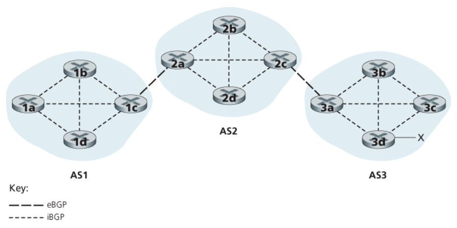

### 3. 최고의 경로 결정

주어진 라우터에서 목적지 서브넷까지는 많은 경로가 있을 수 있다. 이런 경로들 중에서 라우터는 어떻게 선택을 할까? 먼저 BGP 관련 용어를 좀 더 알아보자.

BGP 연결을 통해 주소 프리픽스를 알릴 때는 몇몇 **BGP 속성**을 함께 포함한다. 프리픽스와 그것의 속성을 합쳐 **경로(route)** 라고 한다. 특히 중요한 속성 두 가지는 AS-PATH와 NEXT-HOP이다.

| 속성 | 의미 |
|---|---|
| AS-PATH | 알림 메시지가 통과하는 AS들의 리스트를 담는다. 프리픽스가 어떤 AS로 전달되었을 때 그 AS는 자신의 ASN을 AS-PATH 내 현재 리스트에 추가한다 |
| NEXT-HOP | AS-PATH가 시작되는 라우터 인터페이스의 IP 주소다. AS 간 프로토콜과 AS 내부 라우팅 프로토콜 사이의 중요한 연결을 제공한다 |

BGP 라우터는 AS-PATH 속성을 **메시지의 루프를 감지하고 방지하는 데** 활용한다. 어떤 라우터가 자신의 AS가 이미 경로 리스트에 포함되어 있는 것을 발견하면 그 알림 메시지를 버린다.

정리하면 각 BGP 경로는 **NEXT-HOP, AS-PATH, 목적지 주소 프리픽스** 이렇게 세 구성요소의 리스트로 구성된다(실제로는 다른 속성들도 포함된다).

NEXT-HOP 속성이 자신의 AS(예: AS1)에 속하지 않은 라우터의 IP 주소라는 점을 알아야 한다. 그러나 이 IP 주소를 포함하는 서브넷은 AS1에 직접적으로 연결된다.

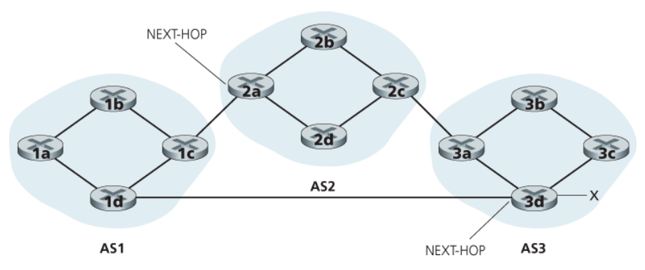

#### 1. 뜨거운 감자 라우팅

가장 단순한 경로 선택 알고리즘 중 하나가 **뜨거운 감자 라우팅(hot potato routing)** 이다. 이 방식에서는 경로 각각의 시작점인 NEXT-HOP 라우터까지의 **AS 내부 경로 비용이 최소가 되는 경로**가 선택된다.

즉 라우터는 AS 내부 라우팅 정보(OSPF 등)를 조사한 후 가장 적은 비용을 가진 경로를 선택한다. 예를 들어 라우터 1b는 자신의 포워딩 테이블을 관찰하여 라우터 2a로 가기 위한 인터페이스 l을 찾아내고, 엔트리 (x, l)을 자신의 포워딩 테이블에 추가한다.

> 뜨거운 감자 라우팅의 기본 아이디어는, 라우터가 목적지까지의 경로 중 자신의 AS 바깥에 있는 부분의 비용은 신경 쓰지 않고 최대한 신속하게 패킷을 자신의 AS 밖으로 내보내는 것이다. 전체 경로 중 자신의 AS 외부에서 얼마의 비용이 들지는 생각하지 않고 자신의 AS 내부 비용만 줄이려는 **이기적인 알고리즘**이다.

#### 2. 경로 선택 알고리즘

실제로 BGP의 경로 선택 알고리즘은 뜨거운 감자 라우팅을 한 단계로 포함하고 있다. 목적지 주소의 프리픽스가 주어지면 지금까지 라우터가 알아낸 해당 목적지까지의 모든 경로가 경로 선택 알고리즘의 입력으로 주어진다. 2개 이상의 경로가 존재한다면 BGP는 하나의 경로가 남을 때까지 다음의 제거 규칙을 순서대로 계속 수행한다.

| 순서 | 규칙 | 설명 |
|---|---|---|
| 1 | 최고 지역 선호도(local preference) | 지역 선호도는 경로에 할당되는 속성이며, 그 값은 온전히 AS 네트워크 관리자에 의한 **정책적인 결정**이다 |
| 2 | 최단 AS-PATH | 지역 선호도가 같다면 통과하는 AS의 수가 가장 적은 경로를 택한다 |
| 3 | 뜨거운 감자 라우팅 | 그래도 남으면 NEXT-HOP 라우터까지의 AS 내부 비용이 가장 작은 경로를 택한다 |
| 4 | BGP 식별자 | 그래도 하나보다 많은 경로가 남아 있다면 라우터는 BGP 식별자를 사용하여 경로를 선택한다 |

> BGP는 인터넷 AS 간 라우팅의 사실상(de facto) 표준이다.

### 4. IP 애니캐스트

BGP는 AS 간 라우팅 외에도 종종 **IP 애니캐스트(anycast)** 서비스를 구현하는 데 활용된다.

많은 애플리케이션에서는 같은 콘텐츠를 지리적으로 분산된 다른 많은 서버에 복제해두고, 각 사용자를 가장 가까운 서버의 콘텐츠로 접근하게 하려고 한다. CDN은 자료를 각기 다른 나라의 서버들에 복제해두며, DNS도 마찬가지다. 이때 BGP 경로 선택 알고리즘이 "가장 가까운 서버"를 알려주는 데 바람직하게 쓰인다.

동작 과정은 다음과 같다.

1. IP 애니캐스트 설정 단계에서 CDN 사업자가 자신의 서버 여러 대에 **동일한 IP 주소**를 할당하고, 표준 BGP를 활용하여 이 주소를 서버 각각으로부터 알린다.
2. BGP 라우터가 이 IP 주소에 대한 복수 개의 경로 알림 메시지를 받으면, 이를 **동일한 물리적 위치로의 서로 다른 경로**에 대한 정보를 제공받고 있는 것으로 생각한다.
3. 각 라우터는 라우팅 테이블을 설정하면서 BGP 경로 선택 알고리즘을 수행하여 해당 IP 주소로의 최고의 경로를 골라낸다.
4. 사용자가 그 주소로 요청을 보내면 인터넷 라우터는 그 요청 패킷을 BGP 경로 선택 알고리즘이 정의한 가장 가까운 서버로 전달한다.

다만 실제로 CDN은 IP 애니캐스트를 잘 사용하지 않는다. BGP 라우팅이 변경되면 같은 TCP 연결의 패킷이 서로 다른 복제 웹 서버로 도착할 수 있기 때문이다.

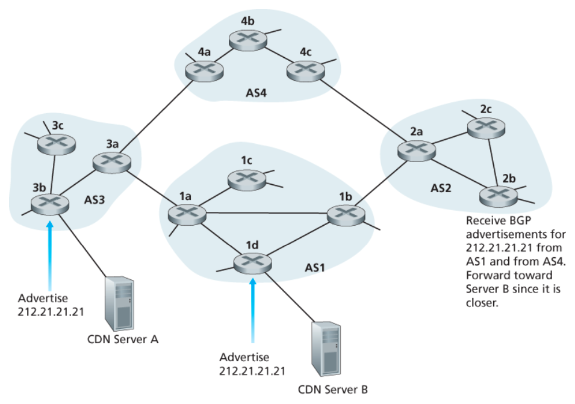

### 5. 라우팅 정책

라우터가 목적지까지의 경로를 선택하려 할 때, **AS의 라우팅 정책은 최단 AS-PATH나 뜨거운 감자 라우팅 등의 다른 모든 고려사항보다 우선시된다.** 경로 선택 알고리즘에서도 맨 먼저 지역 선호도 속성에 따라 경로가 걸러지는데, 이 속성의 값이 각 AS의 정책에 의해 결정되기 때문이다.

간단한 예제를 통해 BGP 라우팅 정책의 기본 개념을 살펴보자.

**다중 홈 접속 ISP** — 제공자 네트워크 A, B, C와 고객 접속 ISP W, X, Y가 있다고 하자. W와 Y는 각각 하나의 제공자에만 연결된 단일 홈이고, X는 B와 C 두 곳에 연결된 **다중 홈(multi-homed)** 접속 ISP다.

| 상황 | 판단 | 이유 |
|---|---|---|
| X가 B에서 배운 경로를 C에게 알려야 하는가 | 알리지 않는다 | 알리면 B와 C 사이의 트래픽이 X를 통과하게 된다. 접속 ISP는 **중계(transit) 트래픽을 나르지 않는 것**이 원칙이다 |
| B가 A에게 "B–C–Y" 경로를 알려야 하는가 | 알리지 않는다 | Y는 B의 고객이 아니다. A가 Y로 가는 트래픽을 B에 흘려보내면 B는 아무런 대가 없이 중계 부담만 지게 된다 |
| B가 A에게 자신의 고객으로 가는 경로를 알려야 하는가 | 알린다 | 고객에게 도달 가능성을 제공하는 것이 B가 대가를 받고 파는 서비스다 |

> 일반 원칙: **AS는 자신이 트래픽을 날라주고 싶은 경로만 이웃에게 알린다.** 어떤 프리픽스를 누구에게 알릴지(그리고 받은 경로에 어떤 지역 선호도를 줄지)가 곧 라우팅 정책이다.

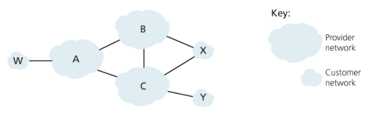

### 6. 조각 맞추기: 인터넷 존재 확인하기

앞의 내용을 종합해, 어떤 회사가 인터넷에 새로 존재를 드러내는 과정을 따라가 보자. 직원과 잠재적인 고객들이 메일을 주고받게 하고 웹 페이지를 볼 수 있게 하고 싶다고 하자.

1. **지역 ISP와 계약해 인터넷에 연결한다.** 회사는 게이트웨이 라우터를 갖게 되고 이는 지역 ISP의 라우터와 연결된다.
2. **IP 주소 범위를 받는다.** 지역 ISP가 특정 범위의 IP 주소(예: /24 프리픽스)를 제공한다. 물리적 연결과 IP 주소 범위를 가지면 회사 내 네트워킹 장치들에 IP 주소를 할당할 수 있다.
3. **도메인 이름을 등록한다.** ISP와의 계약 외에도 도메인 이름을 얻기 위한 인터넷 등록 기관과 계약을 해야 한다. 그러면 DNS 시스템이 도메인 이름에 대응하는 IP 주소를 알아낸 후 제공한다.

이제 외부 사용자가 회사의 웹 서버 IP 주소를 알아낸 다음 IP 데이터그램을 보낼 때 어떤 일이 발생할지 생각해보자. 데이터그램은 여러 자율 시스템의 라우터들을 거친 후 웹 서버로 도착하게 된다. 그러려면 그 라우터들이 **회사의 주소 범위에 해당하는 /24 프리픽스의 존재를 알고 있어야 한다.**

라우터는 이를 어떻게 알게 되는가? 바로 BGP를 통해서다. 회사가 지역 ISP와 계약하고 주소 프리픽스를 할당받을 때, 지역 ISP는 BGP를 사용하여 자신과 연결되어 있는 ISP들에게 그 주소 프리픽스를 알린다. 이 알림이 인터넷 전체로 퍼지면서 라우터들은 목적지로 데이터그램을 적절하게 전달할 수 있게 된다.

## 5. 소프트웨어 정의 네트워크(SDN) 제어 평면

여기서는 네트워크 포워딩 장비들을 **패킷 스위치**라고 부른다. 스위치들에서의 포워딩 결정은 네트워크 계층의 출발지/목적지 주소나 링크 계층의 출발지/목적지 주소 외에도, 트랜스포트·네트워크·링크 계층 패킷 헤더의 많은 값에 기반하여 이루어지기 때문이다.

SDN 구조의 네 가지 특징은 다음과 같다.

### 1. 플로우 기반 포워딩

SDN으로 제어되는 스위치에서의 패킷 전달은 트랜스포트 계층, 네트워크 계층 또는 링크 계층 헤더의 **어떤 값을 기반으로 하든** 이뤄질 수 있다. OpenFlow 1.0은 11가지의 헤더값을 기반으로 포워딩할 수 있도록 허용한다.

이는 IP 데이터그램의 포워딩이 온전히 목적지 주소 기반으로만 이루어진 전통적인 라우터 기반 포워딩과는 매우 대조적인 특성이다. 패킷 전달 규칙은 스위치의 **플로우 테이블**에 기록되며, 모든 네트워크 스위치의 플로우 테이블 항목들을 계산하고 관리·설치하는 일은 모두 SDN 제어 평면의 임무다.

### 2. 데이터 평면과 제어 평면의 분리

| 평면 | 구성 | 역할 |
|---|---|---|
| 데이터 평면 | 네트워크의 스위치들 | 상대적으로 단순한 장치들로서, 자신의 플로우 테이블 내용을 기반으로 **매치 플러스 액션**을 수행한다 |
| 제어 평면 | 서버와 소프트웨어 | 스위치들의 플로우 테이블을 결정·관리한다 |

### 3. 네트워크 제어 기능이 데이터 평면 스위치 외부에 존재

SDN의 S가 software를 의미한다는 점에서 알 수 있듯 제어 평면은 소프트웨어로 구성되어 있으며, 네트워크 스위치와는 별도의 서버에서 수행된다. 제어 평면은 **SDN 컨트롤러**와 **네트워크 제어 애플리케이션 집합**으로 이루어진다.

컨트롤러는 정확한 네트워크 상태 정보를 유지하고, 이 정보를 제어 평면에서 동작하고 있는 네트워크 제어 애플리케이션들에 제공하며, 애플리케이션들이 하부 네트워크 장치들을 모니터하고 프로그램하고 제어까지 할 수 있도록 수단을 제공한다. 컨트롤러는 **단지 논리적으로만 중앙 집중 형태**다.

### 4. 프로그램이 가능한 네트워크

제어 평면에서 수행 중인 네트워크 제어 애플리케이션을 통해 네트워크를 프로그램할 수 있다. 이 애플리케이션들은 SDN 제어 평면의 두뇌인 SDN 컨트롤러가 제공하는 API를 이용하여 네트워크 장치들에 있는 데이터 평면을 명세하고 제어한다. 예를 들어 라우팅 네트워크 제어 애플리케이션은 다익스트라 알고리즘을 이용하여 출발지와 목적지 사이의 종단 간 경로를 결정한다.

---

SDN은 네트워크 기능들의 획기적인 분리를 의미한다. 즉 데이터 평면 스위치와 SDN 컨트롤러, 그리고 네트워크 제어 애플리케이션들 각각이 서로 다른 제조사나 기관에서 제공하는 분리된 개체다. 이러한 분리는 세 분야 모두에서 혁신을 일으켜 풍성하고 개방된 생태계를 이뤘다고 평가된다.

또한 SDN으로 제어되는 장치들에서 발생하는 사건들의 일관성을 유지하도록 조율하는 등 여러 기능을 제공하는 일도 SDN 제어 평면의 역할이다.

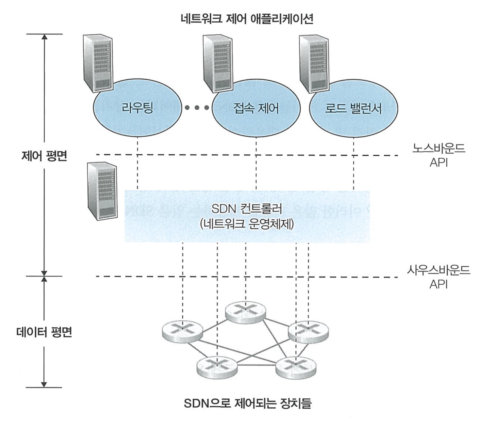

### 1. SDN 제어 평면: SDN 컨트롤러와 SDN 네트워크 제어 애플리케이션

SDN 제어 평면은 크게 **SDN 컨트롤러**와 **SDN 네트워크 제어 애플리케이션** 두 가지 구성요소로 나뉜다. 컨트롤러 내부는 다시 여러 계층으로 나뉜다.

#### 1. 통신 계층

SDN 컨트롤러와 제어받는 네트워크 장치들 사이의 통신을 담당한다. SDN 컨트롤러가 원격의 SDN 기능이 가능한 스위치, 호스트 또는 장치들의 동작을 제어하려면 컨트롤러와 그 장치들 사이에 정보를 전달하는 프로토콜이 필요하다.

또한 장치는 주변에서 관찰한 이벤트를 컨트롤러에 알릴 수 있어야 한다. 이러한 이벤트들은 SDN 컨트롤러에게 네트워크 상태에 대한 최신의 정보를 제공한다.

컨트롤러와 제어받는 장치들 간의 통신은 **사우스바운드(southbound)** 라고 알려진 컨트롤러 인터페이스를 넘나든다. OpenFlow는 대부분의 SDN 컨트롤러에 구현되어 있는 사우스바운드 프로토콜이다.

#### 2. 네트워크 전역 상태 관리 계층

컨트롤러는 **노스바운드(northbound)** 인터페이스를 통해 네트워크 제어 애플리케이션과 상호작용한다. 이 API는 네트워크 제어 애플리케이션이 상태 관리 계층 내의 네트워크 상태 정보와 플로우 테이블을 읽고 쓸 수 있도록 해준다.

애플리케이션은 상태 변화 이벤트가 발생하면 알려달라고 미리 등록해두고, SDN으로 제어되는 장치에서 네트워크 이벤트 알림이 오면 적절한 조치를 취할 수 있다. 여러 타입의 API가 제공될 수 있는데, 여기서는 REST 인터페이스로 통신하는 두 가지 SDN 컨트롤러를 살펴본다.

---

컨트롤러는 외부에서 볼 때 하나의 서비스로 보일 수 있지만, 상태 정보를 보관하기 위한 데이터베이스는 장애 허용성과 높은 가용성, 또 다른 성능상의 이유로 실제로는 **분산된 서버의 집합**에 구현된다. 이렇게 서버 집합에 구현되는 컨트롤러 기능들 때문에 컨트롤러 내부 동작들의 의미가 함께 고려되어야 한다.

근래의 컨트롤러는 **논리적으로는 중앙 집중이지만 물리적으로는 분리된** 컨트롤러 플랫폼 구조에 상당한 강조를 둔다. 이런 구조는 제어되는 장치와 네트워크 제어 애플리케이션에게, 늘어나는 장치 수에 따라 확장 가능한 서비스와 높은 가용성을 제공한다.

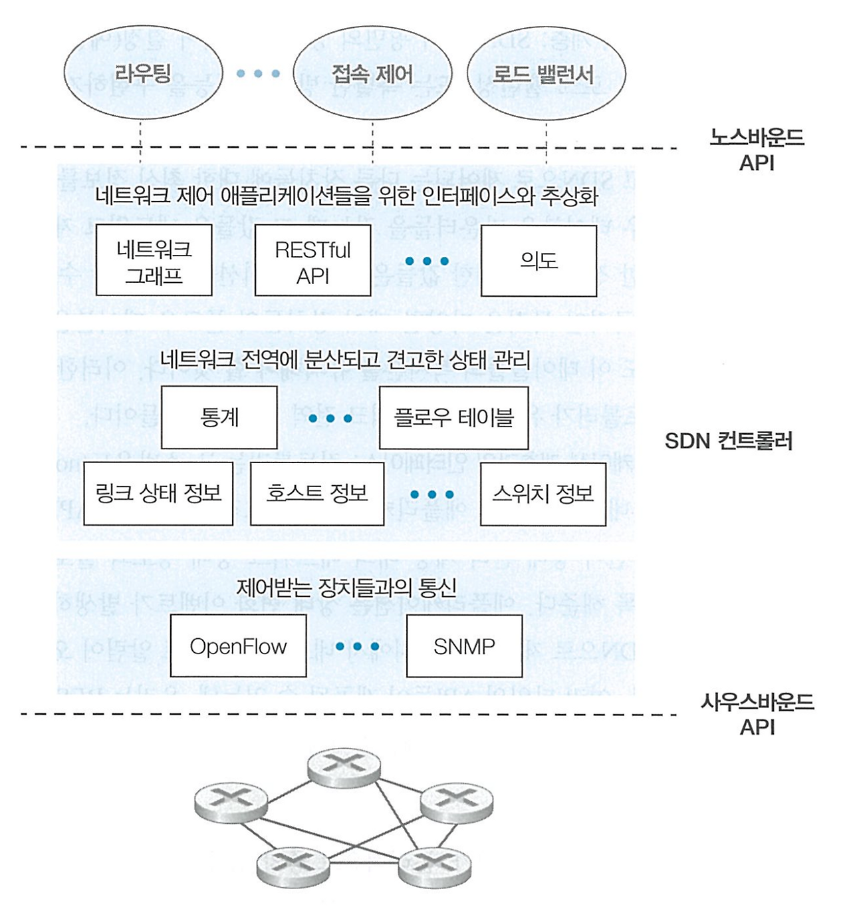

### 2. OpenFlow 프로토콜

OpenFlow는 SDN 컨트롤러와 제어 장치 사이의 통신에 사용되는 프로토콜로, TCP상에서 디폴트 포트 번호 **6653**을 가지고 동작한다.

#### 1. 컨트롤러 → 스위치 메시지

| 메시지 | 용도 |
|---|---|
| 설정(configuration) | 컨트롤러가 스위치의 설정 파라미터들을 문의하거나 설정한다 |
| 상태 수정(modify-state) | 컨트롤러가 스위치 플로우 테이블의 엔트리를 추가/제거/수정하거나 스위치 포트의 특성을 설정한다 |
| 상태 읽기(read-state) | 컨트롤러가 스위치 플로우 테이블과 포트로부터 통계정보와 카운터값을 얻는다 |
| 패킷 전송(send-packet) | 컨트롤러가 제어하는 스위치의 지정된 포트에서 특정 패킷을 내보낸다. 이 메시지 자체가 페이로드 부분에 보낼 패킷을 포함한다 |

#### 2. 스위치 → 컨트롤러 메시지

| 메시지 | 용도 |
|---|---|
| 플로우 제거(flow-removed) | 어떤 플로우 테이블 엔트리가 시간이 만료되었거나 상태 수정 메시지를 수신한 결과로 삭제되었음을 컨트롤러에게 알린다 |
| 포트 상태(port-status) | 스위치가 컨트롤러에게 포트의 상태 변화를 알린다 |
| 패킷 전달(packet-in) | 스위치 포트에 도착한 패킷 중 플로우 테이블의 어떤 엔트리와도 일치하지 않는 패킷을 처리를 위해 컨트롤러에게 전달한다. 어떤 엔트리와 일치한 패킷 중에서도 일부는 그에 대한 작업을 수행하기 위해 컨트롤러에게 보내지기도 한다 |

### 3. 데이터 평면과 제어 평면의 상호작용: 예제

여기서는 다익스트라 알고리즘이 최단 경로를 결정하기 위해 사용된다고 하자. 이 SDN 시나리오는, 다익스트라 알고리즘이 모든 개별 라우터에 구현되고 링크 상태 갱신 정보가 모든 네트워크 라우터 사이에서 플러딩되는 **라우터별 제어 시나리오와 두 가지 중요한 차이**가 있다.

- 다익스트라 알고리즘이 패킷 스위치 외부에서 별도의 애플리케이션으로 수행된다.
- 패킷 스위치들이 링크 갱신 정보를 서로 간이 아닌 SDN 컨트롤러에게 전송한다.

**가정** — 스위치 s1과 s2 사이의 링크가 단절되었다. 최단 경로 알고리즘이 사용되고 있으며 따라서 s1, s3, s4로 들어오고 나가는 플로우 포워딩 규칙은 변경이 되었으나 s2의 동작은 바뀌지 않았다. 통신 계층 프로토콜로는 OpenFlow가 사용되며, 제어 평면은 링크 상태 라우팅 외의 기능은 수행하지 않는다.

1. 스위치 s2와의 링크 단절을 감지한 s1은 OpenFlow의 **포트 상태 메시지**를 사용하여 링크 상태 변화를 SDN 컨트롤러에게 알린다.
2. 링크 상태 변화를 알리는 OpenFlow 메시지를 받은 SDN 컨트롤러는 **링크 상태 관리자**에게 알리고, 링크 상태 관리자는 링크 상태 데이터베이스를 갱신한다.
3. 다익스트라 링크 상태 라우팅을 담당하는 네트워크 제어 애플리케이션은 링크 상태의 변화가 있을 경우 알려달라고 이전에 등록해두었으므로, 상태 변화에 대한 알림을 받게 된다.
4. 링크 상태 라우팅 애플리케이션이 링크 상태 관리자에게 요청하여 갱신된 링크 상태를 가져온다. 그 후 새로운 최소 비용 경로를 계산한다.
5. 링크 상태 라우팅 애플리케이션은 갱신되어야 할 플로우 테이블을 결정하는 **플로우 테이블 관리자**와 접촉한다.
6. 플로우 테이블 관리자는 OpenFlow 프로토콜을 사용하여 링크 상태 변화에 영향을 받는 스위치들(s1, s2, s4)의 플로우 테이블을 갱신한다.

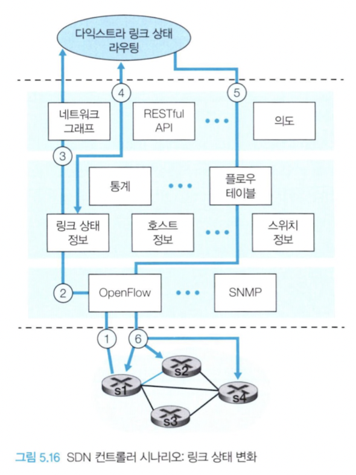

### 4. SDN: 과거와 미래

SDN이 많은 관심을 받게 된 것은 비교적 최근이지만, SDN의 기술적인 뿌리 — 특히 데이터 평면과 제어 평면의 분리 — 는 상당히 거슬러 올라간다.

**에탄(Ethane) 프로젝트**는 다음 세 가지 개념을 개척했다.

- 매치 플러스 액션 플로우 테이블이 있는 간단한 플로우 기반 이더넷 스위치
- 플로우 수용 및 라우팅을 관리하는 중앙 집중식 컨트롤러
- 플로우 테이블의 어떤 엔트리와도 일치하지 않는 패킷을 스위치에서 컨트롤러로 전달하는 방식

미래의 SDN 아키텍처와 기능을 개발하기 위한 노력도 계속되고 있다. SDN 혁명은 **모든 기능이 하나로 통합되어 있던 스위치와 라우터를, 단순한 상용 스위칭 하드웨어와 정교한 소프트웨어 제어 평면으로 대체한 것**이었다. 이를 더 일반화하면 단순한 상용 서버·스위칭·저장소를 가지고 복잡한 미들박스를 혁신적으로 교체하는 방향(NFV)이 된다. 연구의 중요한 두 번째 영역은 SDN 개념을 AS 내부 설정에서 AS 간 설정으로 확장하려는 것이다.

## 6. 인터넷 제어 메시지 프로토콜(ICMP)

ICMP는 호스트와 라우터가 서로 간에 네트워크 계층 정보를 주고받기 위해 사용된다. 가장 전형적인 사용 형태는 **오류 보고**다. 예를 들어 HTTP 연결을 수행할 때 나타나는 "목적지 네트워크에 도달할 수 없음" 같은 메시지가 ICMP가 만든 것이다.

ICMP는 종종 IP의 한 부분으로 간주되지만, ICMP 메시지가 IP 데이터그램에 담겨 전송되므로 구조적으로는 **IP 바로 위**에 있다. IP 데이터그램을 받았을 때 상위 프로토콜이 TCP나 UDP이면 그쪽으로 역다중화하는 것처럼, 상위 프로토콜이 ICMP이면 그 내용을 ICMP로 역다중화한다.

ICMP 메시지에는 **타입(type)** 과 **코드(code)** 필드가 있고, ICMP 메시지의 발생 원인이 된 IP 데이터그램의 헤더와 첫 8바이트를 함께 담는다(그래야 송신자가 어떤 패킷 때문에 오류가 났는지 알 수 있다).

ICMP 메시지가 오류 상태를 나타내기 위함만은 아니다. 잘 알려진 예로 **출발지 억제(source quench) 메시지**가 있는데, 원래 목적은 혼잡 제어를 수행하기 위한 것이었으나 실제로는 잘 사용되지 않는다.

### 1. Traceroute의 구현

**Traceroute는 ICMP 메시지로 구현된다.** 출발지에서 목적지까지 경로상의 라우터 이름과 주소, 왕복 시간을 알아내는 원리는 다음과 같다.

1. 출발지는 목적지를 향해 **TTL을 1로 설정한** IP 데이터그램(도착할 가능성이 없는 포트 번호를 가진 UDP 세그먼트)을 보낸다.
2. 첫 번째 라우터가 이를 받아 TTL을 하나 줄이면 0이 되므로 데이터그램을 폐기하고, 출발지에게 **ICMP 타입 11 코드 0(TTL 만료)** 메시지를 보낸다. 이 메시지에 라우터의 이름과 IP 주소가 담긴다.
3. 출발지는 TTL을 2, 3, 4… 로 하나씩 늘려가며 같은 작업을 반복해 경로상의 라우터를 순서대로 알아낸다.
4. 데이터그램이 마침내 목적지 호스트에 도달하면, 목적지는 그 포트에서 대기 중인 프로세스가 없으므로 **ICMP 타입 3 코드 3(목적지 포트 도달 불가)** 을 보낸다. 이를 받은 출발지는 더 보낼 필요가 없음을 알고 종료한다.

각 TTL 값마다 보통 3개의 데이터그램을 보내며, 응답이 돌아오기까지의 왕복 시간을 함께 출력한다.

```
$ traceroute www.example.com
traceroute to www.example.com (93.184.216.34), 30 hops max, 60 byte packets
 1  192.168.0.1        1.204 ms  1.118 ms  1.302 ms   <- TTL=1, 홈 라우터가 ICMP 11/0 회신
 2  10.20.0.1          8.451 ms  8.377 ms  8.502 ms   <- TTL=2
 3  61.72.x.x         12.019 ms 11.884 ms 12.230 ms   <- TTL=3
 4  * * *                                             <- 응답하지 않는 라우터(타임아웃)
 5  203.xx.xx.xx      31.552 ms 31.410 ms 31.688 ms
 6  93.184.216.34     35.101 ms 34.980 ms 35.223 ms   <- 목적지가 ICMP 3/3 회신 → 종료
```

참고로 자주 보게 되는 ICMP 타입/코드는 다음과 같다.

| 타입 | 코드 | 의미 | 쓰이는 곳 |
|---|---|---|---|
| 0 | 0 | 에코 응답 | ping |
| 3 | 0 / 1 / 2 / 3 | 목적지 네트워크 / 호스트 / 프로토콜 / 포트 도달 불가 | 오류 보고, traceroute 종료 |
| 4 | 0 | 출발지 억제 | (거의 사용 안 함) |
| 8 | 0 | 에코 요청 | ping |
| 11 | 0 | TTL 만료 | traceroute |
| 12 | 0 | 잘못된 IP 헤더 | 오류 보고 |

IPv6를 위한 새로운 ICMP 버전(ICMPv6)도 정의되었다. 기존 ICMP 타입 및 코드 정의를 재구성하는 것 외에도 새로운 타입과 코드가 추가됐다.

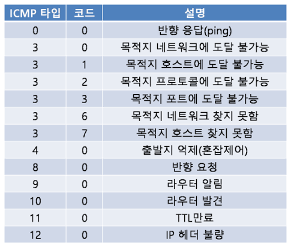

## 7. 네트워크 관리와 SNMP, NETCONF/YANG

SDN 환경에서는 논리적 중앙 집중형 컨트롤러가 관리 프로세스에 도움이 된다. 하지만 네트워크 관리의 어려움은 SDN 이전에도 있었으며, 그만큼 풍부한 네트워크 관리 도구와 접근법을 예전부터 가지고 있었다.

**네트워크 관리란 무엇인가?**

> 네트워크 관리는 하드웨어·소프트웨어·인적 자원을 배치하고 통합·조정하여, 실시간성·운용 성능·서비스 품질 등의 요구사항을 합리적인 비용으로 만족시키면서 네트워크 자원을 모니터링·시험·폴링·설정·분석·평가·제어하는 것을 포함한다.

### 1. 네트워크 관리 프레임워크

네트워크 관리의 핵심 요소들은 다음과 같다.

#### 1. 관리 서버

네트워크 운영 센터(NOC)의 중앙 집중형 네트워크 관리 스테이션에서 동작하며, 일반적으로 네트워크 관리자와 상호작용하는 애플리케이션이다. 관리 서버는 네트워크 관리 활동이 일어나는 장소로서 네트워크 관리 정보의 수집·처리·분석·발송을 제어한다. 여기서 네트워크 피관리 장치를 설정·감시·제어하기 위한 작업이 시작된다. 하나의 네트워크는 여러 개의 관리 서버를 가질 수 있다.

#### 2. 피관리 장치

관리 대상 네트워크에 존재하는 네트워크 장비들이다. 호스트, 라우터, 스위치, 미들박스, 모뎀 등이 포함된다.

#### 3. 데이터

각 피관리 장치는 **상태**라고 불리는, 장치와 관련된 데이터를 갖는다.

| 데이터 종류 | 내용 | 예 |
|---|---|---|
| 설정 데이터 | 관리자가 할당 및 설정한 장치 정보 | 장치 인터페이스의 IP 주소, 인터페이스 속도 |
| 동작 데이터 | 장치가 동작하면서 획득하는 정보 | OSPF 프로토콜의 인접 항목 목록 |
| 장치 통계 | 장치가 운영되면서 갱신되는 상태 표시기 및 계수기 | 인터페이스에서 삭제된 패킷 수, 장치의 냉각 팬 속도 |

#### 4. 네트워크 관리 에이전트

관리 서버와 통신하는, 피관리 장치상의 소프트웨어 프로세스다. 관리 서버의 명령과 제어에 따라 피관리 장치에 국한되는 행동을 취한다.

#### 5. 네트워크 관리 프로토콜

관리 서버와 피관리 장치들 사이에서 동작하면서, 관리 서버가 피관리 장치의 상태에 대해 질의하고 에이전트를 통해 피관리 장치에 행동을 취할 수 있도록 해준다. 반대로 에이전트는 예외적인 사건을 관리 서버에게 알리기 위해 네트워크 관리 프로토콜을 사용할 수 있다.

#### 6. 네트워크를 관리하는 세 가지 방법

위의 구성요소들을 활용하여 네트워크를 관리하는 방법은 크게 세 가지다.

**CLI(명령줄 인터페이스)** — 관리자가 장치에 직접 명령을 보낼 수 있다. 대체로 오류가 발생하기 쉽고, 대규모 네트워크를 자동화하거나 효율적으로 관리하기 어렵다. 무선 홈 라우터와 같은 소비자 지향 네트워크 장치는 HTTP를 통해 장치에 접근하여 설정을 할 수 있도록 제공하기도 한다.

**SNMP/MIB** — SNMP를 사용하여 장치의 MIB에 있는 데이터를 질의하거나 설정할 수 있다. 일부 MIB 데이터는 장치 및 공급업체에 따라 다르지만, 다른 MIB 데이터는 장치에 종속되지 않고 추상성과 일반성을 갖는다. 일반적으로 네트워크 운영자는 이 방식으로 동작 상태 및 장치 통계 정보를 질의·모니터링한 다음, 명령줄 인터페이스를 사용하여 장치를 실제로 제어하고 설정한다. 유의할 점은 이 방식이 **장치를 개별적으로 관리한다**는 점이다. 이 단점이 논의되면서 NETCONF와 YANG을 사용하는 네트워크 관리 방식이 나타났다.

**NETCONF/YANG** — 네트워크 관리에 좀 더 추상적이고 네트워크 전체를 아우르는 전체론적인 관점을 취하면서도, 정확성의 제약 정도를 구체화하고 여러 장치에 대한 세세한 관리 작업을 제공하는 등 **설정 관리에 훨씬 더 중점**을 둔다. YANG은 설정 및 동작 데이터를 모델링하는 데 사용되는 데이터 모델링 언어이고, NETCONF 프로토콜은 원격 장치와 YANG 호환 작업 및 데이터를 주고받거나 원격 장치 간에 통신하는 데 사용된다.

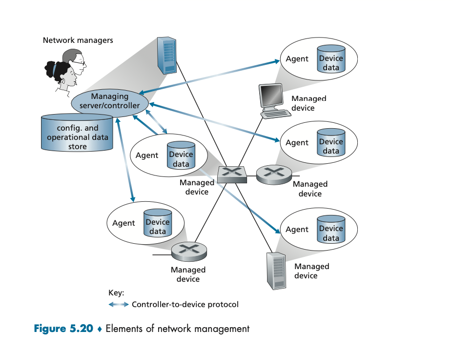

### 2. SNMP와 MIB

**SNMPv3**는 관리 서버와, 그 관리 서버를 대표하여 실행되고 있는 에이전트 사이에서 네트워크 관리 제어 및 정보 메시지를 전달하기 위해 사용된다. 사용 형태는 크게 두 가지다.

| 사용 형태 | 동작 |
|---|---|
| 요청-응답 모드 | SNMP 관리 서버가 에이전트에게 요청을 송신하고, 이를 받은 SNMP 에이전트는 이를 수행한 후 요청에 대한 응답을 보낸다. 일반적으로 요청은 피관리 장치와 관련된 MIB 객체 값들을 질의 또는 수정하기 위해 이용된다 |
| 트랩 메시지 | 에이전트가 요구받지 않았더라도 트랩 메시지를 관리 서버에게 전송한다. MIB 객체 값들을 변화시킨 예외 상황의 발생을 통지하기 위해 이용된다 |

MIB 객체는 **SMI**라고 하는 데이터 기술 언어로 명세되는데, SMI라는 이름은 그 기능에 대한 아무런 힌트를 주지 않는 다소 엉뚱한 이름의 네트워크 관리 프레임워크 구성요소다. 관련된 MIB 객체들은 **MIB 모듈**에 모아진다.

SNMP는 일반적으로 **PDU**로 알려진 일곱 가지 타입의 메시지를 정의하고 있다.

| PDU 타입 | 방향 | 용도 |
|---|---|---|
| GetRequest | 관리 서버 → 에이전트 | MIB 객체 값을 요청 |
| GetNextRequest | 관리 서버 → 에이전트 | 리스트·테이블의 다음 MIB 객체 값을 요청 |
| GetBulkRequest | 관리 서버 → 에이전트 | 큰 데이터 블록을 한 번에 요청 |
| SetRequest | 관리 서버 → 에이전트 | MIB 객체 값을 설정 |
| InformRequest | 관리 서버 → 원격 관리 서버 | 원격 관리 서버에 MIB 값을 통지 |
| Response | 에이전트 → 관리 서버(또는 서버 간) | 위 요청들에 대한 응답 |
| SNMPv2-Trap | 에이전트 → 관리 서버 | 예외 상황을 통지 |

SNMP의 요청-응답 특성을 감안할 때, 비록 SNMP PDU들이 다른 많은 전송 프로토콜에 의해 운반될 수 있기는 하지만 일반적으로는 **UDP 데이터그램의 페이로드** 부분에 실린다. PDU의 요청 ID 필드는 관리 서버가 에이전트에 보내는 요청에 번호를 매기기 위해 사용된다(응답을 요청과 짝짓는 데 쓰인다).

SNMP는 세 가지 버전으로 발전했으며, 특히 보안의 역할이 중요하게 다뤄졌다.

#### 1. MIB

피관리 장치의 동작 상태 데이터는 해당 장치를 위한 **MIB(관리 정보 베이스)** 에 수집된 객체들로 표현된다. MIB 객체는 다음과 같은 것들이 될 수 있다.

- **카운터**: IP 데이터그램 헤더의 오류로 인해 라우터에서 버려지는 데이터그램 개수, 이더넷 인터페이스 카드의 반송파 감지 오류 횟수
- **설명 정보**: DNS 서버에서 실행되는 소프트웨어 버전
- **상태 정보**: 특정 장치가 올바르게 작동하는지 여부
- **프로토콜에 특정된 정보**: 어떤 목적지로의 라우팅 경로

관련된 MIB 객체들은 MIB 모듈로 합쳐진다.

### 3. 네트워크 설정 프로토콜(NETCONF)과 YANG

NETCONF 프로토콜은 관리 서버와 피관리 네트워크 장치 사이에서 동작하면서 다음과 같은 메시지 전송 기능을 제공한다.

- 피관리 장치의 **설정 데이터를 검색·셋업·수정**
- 피관리 장치의 **동작 데이터 및 통계를 질의**
- 피관리 장치에서 생성된 **알림을 구독**

관리 서버는 피관리 장치를 제어하기 위해 구조화된 **XML 문서** 형식의 설정 내용을 보내 피관리 장치에서 활성화한다. NETCONF는 원격 프로시저 호출(RPC) 패러다임을 사용하고, XML로 인코딩된 프로토콜 메시지는 **TCP상의 TLS 프로토콜**을 통해 관리 서버와 피관리 장치 사이에서 교환된다.

세션의 진행은 다음과 같다.

1. 관리 서버는 피관리 장치와 보안 연결을 설정한다.
2. 보안 연결이 설정되면 관리 서버와 피관리 장치는 `<hello>` 메시지를 교환하고, 기본 NETCONF 명세를 보완하는 어떠한 추가 기능이 있는지 서로 알린다.
3. 이후 관리 서버와 피관리 장치 간의 상호작용은 `<rpc>`와 `<rpc-reply>` 메시지를 사용하는 원격 프로시저 호출 형식을 갖는다.

이러한 메시지는 장치 설정 데이터와 동작 데이터 및 통계를 검색·설정·질의·수정하고 알림을 구독하는 데 사용된다. SNMP에서처럼 NETCONF에도 동작 상태 데이터를 가져오는 작업 `<get>`과 이벤트 알림을 위한 작업 `<notification>`이 있다. 또한 이들을 조합하여 정교한 네트워크 관리 트랜잭션들의 집합을 만드는 것도 가능하다.

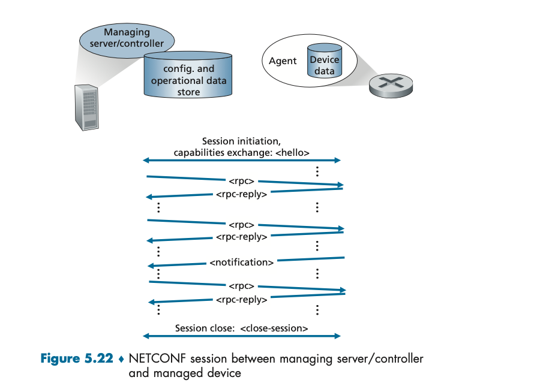

#### 1. YANG

YANG은 SMI가 SNMP의 MIB를 기술하는 데 사용되는 것과 거의 동일한 방식으로, NETCONF가 사용하는 **네트워크 관리 데이터의 구조·구문·의미를 정확하게 표현**하는 데 사용되는 데이터 모델링 언어다.

- 모든 YANG 정의는 **모듈**에 포함되고, 장치와 해당 기능을 설명하는 XML 문서는 YANG 모듈에서 생성할 수 있다.
- YANG은 SMI와 마찬가지로 몇 개의 내장 데이터 유형을 제공하며, 데이터 모델링을 하는 사람이 **유효한 NETCONF 설정이 충족해야만 하는 제약 조건**을 표현할 수 있도록 한다. 이는 NETCONF 설정에서 요구되는 정확성과 일관성 제약을 충족시키는 데 큰 도움이 된다.
- YANG은 NETCONF 알림을 지정하는 데도 사용된다.

## 8. 요약

- 네트워크 계층의 **제어 평면**을 구축하는 데는 크게 두 가지 방법이 있다. 기존의 **라우터별 제어**와 **소프트웨어 정의 네트워킹(SDN) 제어**다.
- 최소 비용 경로를 결정하는 두 가지 기본 라우팅 알고리즘은 **링크 상태(LS) 라우팅**과 **거리 벡터(DV) 라우팅**이다. 두 알고리즘 모두 라우터별 제어와 SDN 제어 양쪽에서 사용되며, 각각 인터넷의 두 가지 주요 라우팅 프로토콜인 **OSPF와 BGP**의 기반이 된다.
- 확장성과 관리 자율성 문제 때문에 인터넷은 라우터들을 **자율 시스템(AS)** 으로 조직화한다. AS 내부에서는 OSPF 같은 AS 내부 라우팅 프로토콜이, AS 사이에서는 BGP가 동작한다.
- BGP의 경로 선택은 순수한 최단 경로가 아니라 **정책**에 지배된다. 지역 선호도 → 최단 AS-PATH → 뜨거운 감자 라우팅 → BGP 식별자 순으로 경로를 걸러낸다.
- SDN은 데이터 평면과 제어 평면을 분리하고, 플로우 기반 포워딩과 프로그램 가능한 네트워크를 가능하게 한다. 컨트롤러는 사우스바운드(OpenFlow)로 스위치를, 노스바운드(REST 등)로 네트워크 제어 애플리케이션을 잇는다.
- **ICMP**는 호스트와 라우터가 오류 보고 등 네트워크 계층 정보를 주고받는 데 사용되며, ping과 traceroute의 바탕이 된다.
- **네트워크 관리**의 대표적인 접근으로 SNMP/MIB와 NETCONF/YANG이 있다. 전자는 장치를 개별적으로 모니터링하는 데, 후자는 네트워크 전체의 설정을 일관되게 관리하는 데 강점이 있다.
