## 1. 링크 계층 소개

링크 계층은 데이터그램을 **하나의 링크 위에서 인접한 노드로** 옮기는 일을 맡는다. 네트워크 계층이 출발지에서 목적지까지의 전체 경로를 결정한다면, 링크 계층은 그 경로를 이루는 개별 구간 하나하나를 책임진다.

| 용어 | 의미 |
|---|---|
| 노드(node) | 링크 계층 프로토콜을 실행하는 장치. 호스트, 라우터, 스위치, 와이파이 AP 등 |
| 링크(link) | 통신 경로상에서 인접한 노드들을 연결하는 통신 채널 |
| 프레임(frame) | 링크로 전송하기 위해 데이터그램을 캡슐화한 링크 계층 패킷 |

데이터그램을 출발지에서 목적지로 이동시키려면 개별 링크들을 차례로 거쳐야 하며, 각 링크에서 전송 노드는 데이터그램을 링크 계층 프레임으로 캡슐화하여 링크로 전송한다.

> 여행에 비유하면 여행객은 데이터그램, 교통편은 링크, 운송 방식은 링크 계층 프로토콜, 여정을 짜주는 여행사 직원은 라우팅 프로토콜에 해당한다.

### 1. 링크 계층이 제공하는 서비스

기본 서비스는 단일 통신 링크상으로 데이터그램을 한 노드에서 인접 노드로 이동시키는 것이지만, 서비스의 세부 사항은 링크에 적용되는 특정 링크 계층 프로토콜을 따른다. 링크 계층 프로토콜이 제공할 수 있는 서비스는 다음과 같다.

#### 1. 프레임화(framing)

거의 모든 링크 계층 프로토콜은 네트워크 계층 데이터그램을 링크상으로 전송하기 전에 링크 계층 프레임으로 캡슐화한다. 프레임은 네트워크 계층 데이터그램이 들어 있는 데이터 필드와 여러 개의 헤더 필드로 구성되며, 그 구조는 링크 계층 프로토콜에 의해 명시된다.

#### 2. 링크 접속(link access)

매체 접속 제어(MAC, Medium Access Control) 프로토콜은 링크상으로 프레임을 전송하는 규칙을 명시한다.

| 링크 종류 | MAC 프로토콜의 역할 |
|---|---|
| 점대점 링크 | 단순하다. 링크가 사용되지 않을 때마다 프레임을 전송하면 된다 |
| 브로드캐스트 링크 | 하나의 링크를 여러 노드가 공유하므로, 여러 노드로부터의 프레임 전송을 조정해야 한다 |

#### 3. 신뢰적 전달(reliable delivery)

링크 계층 프로토콜이 신뢰적 전달 서비스를 제공하는 경우, 각 네트워크 계층 데이터그램이 오류 없이 전달됨을 보장한다. 트랜스포트 계층과 마찬가지로 **확인응답과 재전송**을 통해 구현된다.

- 무선 링크처럼 오류율이 높은 링크에서 주로 사용된다. 오류가 발생한 **링크에서 바로** 오류를 정정하므로, 종단 간 재전송보다 훨씬 효율적이다.
- 광섬유, 동축 케이블처럼 비트 오류율이 낮은 링크에서는 불필요한 오버헤드가 될 수 있어 제공하지 않는 경우가 많다.

#### 4. 오류 검출과 정정(error detection and correction)

링크 계층 하드웨어는 신호 감쇠나 전자기 잡음 때문에 1을 0으로, 또는 그 반대로 오인할 수 있다. 오류가 있는 데이터그램은 전달할 필요가 없으므로, 많은 링크 계층 프로토콜이 오류를 검출하는 방법을 제공한다.

- 송신 노드가 프레임에 오류 검출 비트를 설정하고, 수신 노드가 오류 검사를 수행함으로써 가능해진다.
- 오류 검출은 링크 계층 프로토콜에서 아주 일반적인 서비스다.
- 링크 계층의 오류 검출은 트랜스포트/네트워크 계층의 것보다 일반적으로 더 정교하며, **하드웨어로 구현**된다.

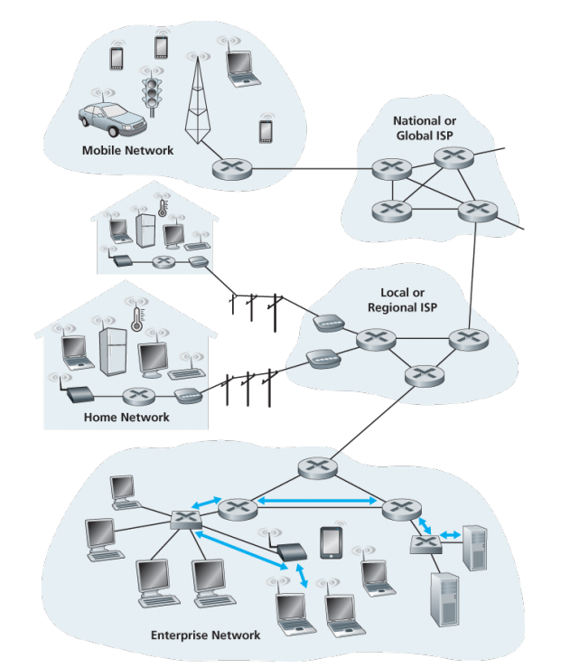

### 2. 링크 계층이 구현되는 위치

대부분의 경우 링크 계층은 **네트워크 인터페이스 컨트롤러(NIC)** 로 알려진 네트워크 어댑터에 구현된다. 이더넷 기능은 마더보드 칩셋에 통합되거나 저가의 이더넷 전용 칩으로 구현된다.

네트워크 어댑터의 중심에는 **링크 계층 컨트롤러**가 있다. 이는 앞 절에서 설명한 링크 계층 서비스의 대다수가 구현되어 있는 단일의 특수 용도 칩으로, 그 기능 대부분은 하드웨어로 구현된다.

| 구분 | 구현 위치 | 담당하는 일 |
|---|---|---|
| 하위 기능 | 어댑터(하드웨어) | 프레임화, 링크 접속, 오류 검출, 실제 비트 송수신 |
| 상위 기능 | 호스트 CPU(소프트웨어) | 링크 계층 주소 정보 조립, 컨트롤러 하드웨어 활성화, 인터럽트 응답, 오류 조건 처리, 데이터그램을 네트워크 계층으로 전달 |

송신 측의 컨트롤러는 프로토콜 스택의 상위 계층에 의해 생성되어 호스트 메모리에 저장된 데이터그램을 링크 계층 프레임으로 캡슐화한 후 전송한다. 수신 측의 링크 계층 소프트웨어는 컨트롤러로부터의 인터럽트에 응답하고, 오류 조건을 처리하며, 데이터그램을 네트워크 계층으로 전달한다.

> 링크 계층은 하드웨어와 소프트웨어의 조합이며, 프로토콜 스택에서 이 둘이 만나는 지점이라고 할 수 있다.

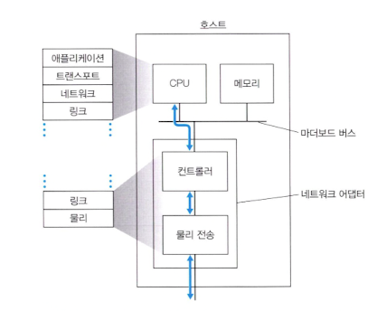

---

## 2. 오류 검출 및 정정 기술

비트 레벨 오류 검출 및 정정은 링크 계층이 제공하는 대표적인 두 가지 서비스 중 하나다. 기본 구도는 다음과 같다.

1. 송신 노드는 데이터 D에 **오류 검출 및 정정 비트(EDC)** 를 첨가한다.
2. 보호되는 데이터 D에는 링크로 전송할 네트워크 계층 데이터그램뿐만 아니라, 링크 프레임 헤더에 있는 링크 레벨 주소 정보와 순서 번호 및 기타 필드도 포함된다.
3. D와 EDC는 링크 레벨 프레임에 담겨 수신 노드로 전송되고, 수신 노드는 비트열 D'과 EDC'을 수신한다.
4. 수신자는 자신이 수신한 D'과 EDC'만으로 원래의 D와 D'이 동일한지 판정한다.

> 오류 검출 비트를 사용하더라도 **미검출 비트 오류**는 여전히 남을 수 있다. 따라서 오류를 감지하지 못할 확률이 충분히 낮은 기법을 선택해야 한다.

전송 데이터의 오류를 검출하는 세 가지 기술 — 패리티 검사, 체크섬, 순환 중복 검사(CRC) — 를 살펴본다.

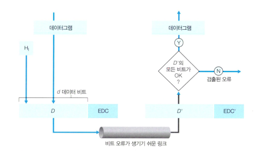

### 1. 패리티 검사

가장 단순한 형태의 오류 검출 방식이다. 정보 D가 d개의 비트를 갖고 있다고 가정한다.

| 기법 | 패리티 비트 선택 기준 |
|---|---|
| 짝수 패리티 | d + 1개 비트에서 1의 총 개수가 **짝수**가 되도록 한 비트를 추가 |
| 홀수 패리티 | d + 1개 비트에서 1의 총 개수가 **홀수**가 되도록 한 비트를 추가 |

단일 패리티 비트의 경우 수신자의 동작도 단순하다. d + 1개 비트에서 1의 개수를 세기만 하면 되며, 개수가 규약과 어긋나면 **홀수 개의 비트 오류**가 발생했음을 알 수 있다. 반대로 짝수 개의 비트 오류가 발생하면 검출하지 못한다. 다만 오류가 서로 독립적으로 드물게 발생한다면 패킷 안에 다중 오류가 있을 확률은 극히 작으므로, 이 경우에는 단일 패리티 비트만으로 충분하다.

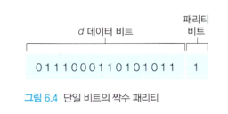

#### 1. 2차원 패리티

실제로 오류는 홀로 발생하기보다 **버스트(burst) 형태**로 한꺼번에 몰려서 발생한다. 이를 감당하기 위해 단일 패리티 기법을 2차원으로 일반화한다.

- d개의 비트를 i행 j열로 나누고, 각 행과 각 열에 대해 패리티 값을 계산한다. 이렇게 하면 i + j + 1개의 패리티 비트가 만들어진다.
- d비트들에 단일 비트 오류가 발생하면 **그 비트가 속한 행과 열의 패리티가 동시에 어긋난다.**
- 따라서 수신자는 오류 발생을 검출할 뿐만 아니라, 어긋난 행·열의 인덱스값으로 잘못된 비트를 **식별해서 정정**할 수 있다.
- 2차원 패리티는 패킷에 있는 임의의 2개 비트 오류도 검출할 수 있다.

> 오류를 검출할 뿐만 아니라 정정까지 하는 수신자의 능력을 **순방향 오류 정정(FEC, Forward Error Correction)** 이라고 한다.

FEC 기술은 단독으로 쓰이거나 ARQ(재전송) 기술과 함께 사용될 수 있으며, 송신자에게 요구하는 재전송 횟수를 줄여 왕복 지연을 줄인다는 점에서 의의가 있다.

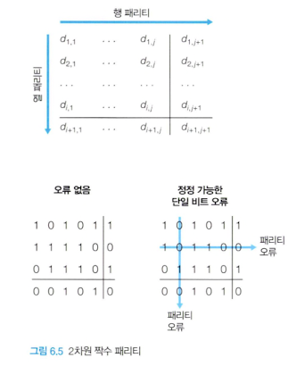

### 2. 체크섬 방법

데이터를 구성하는 d비트들을 일련의 k비트 정수처럼 다루는 방식이다. 가장 간단한 방법은 이 k비트 정수들을 모두 더해서 그 결과값을 오류 검출 비트로 사용하는 것으로, **인터넷 체크섬**이 이 방법을 쓴다. 더한 값의 1의 보수가 인터넷 체크섬이 되며, 이것을 세그먼트 헤더에 넣는다.

체크섬은 패킷 오버헤드가 상대적으로 적지만, CRC와 비교하면 오류 검출 능력이 상대적으로 약하다. 그렇다면 왜 트랜스포트 계층은 체크섬을 쓰고 링크 계층은 CRC를 쓸까?

| 계층 | 구현 방식 | 그래서 선택한 기법 |
|---|---|---|
| 트랜스포트 계층 | 소프트웨어 | 간단하고 빠른 **체크섬** |
| 링크 계층 | 어댑터 안의 전용 하드웨어 | 연산이 복잡해도 빠르게 처리 가능한 **CRC** |

### 3. 순환 중복 검사(CRC)

컴퓨터 네트워크에서 오늘날 널리 사용되는 오류 검출 기술은 **순환 중복 검사(CRC, Cyclic Redundancy Check)** 코드다. CRC 코드는 **다항식 코드**로도 알려져 있는데, 전송되는 비트열의 0과 1을 계수로 갖는 다항식처럼 비트열을 생각할 수 있고, 비트열에 적용되는 연산을 다항식 연산으로 이해할 수 있기 때문이다.

CRC는 다음과 같이 동작한다.

1. d비트로 이루어진 데이터 D를 송신 노드가 수신 노드로 전송하려 한다고 가정한다.
2. 송신자와 수신자는 **생성자(generator)** 로 알려진 r + 1 비트 패턴 G에 먼저 합의한다. G의 최상위 비트는 1이어야 한다.
3. 송신자는 r개의 추가 비트 R을 선택해서 D 뒤에 덧붙인다. 이때 만들어지는 d + r 비트 패턴은 모듈로 2 연산으로 G에 의해 **정확히 나누어떨어져야** 한다.
4. 수신자는 수신한 d + r개 비트를 G로 나눈다. 나머지가 0이 아니면 오류가 발생한 것이고, 0이면 데이터가 정확한 것으로 판정한다.

모든 CRC 계산은 덧셈의 올림이나 뺄셈의 빌림이 없는 **모듈로 2 연산**을 사용하며, 이는 피연산자를 비트별로 XOR 한 것과 같다.

#### 1. CRC 계산 예시

D = `101110` (d = 6), G = `1001` (r = 3)일 때 R을 구해 보자. 먼저 D를 왼쪽으로 r비트 시프트한 D · 2<sup>r</sup> = `101110000`을 G로 나눈다.

```
            1 0 1 0 1 1        <- 몫 (버린다)
        ┌──────────────────
1 0 0 1 │ 1 0 1 1 1 0 0 0 0     <- D · 2^r
          1 0 0 1
          ───────
            0 1 0 1
              0 0 0 0
              ───────
              1 0 1 0
              1 0 0 1
              ───────
                0 1 1 0
                  0 0 0 0
                  ───────
                  1 1 0 0
                  1 0 0 1
                  ───────
                    1 0 1 0
                    1 0 0 1
                    ───────
                        0 1 1   <- 나머지 R
```

- 나머지 R = `011`이므로 실제로 링크로 전송되는 비트열은 D와 R을 이어붙인 `101110011`이 된다.
- 수신자가 `101110011`을 G = `1001`로 나누면 나머지가 0이므로 오류 없음으로 판정한다.
- 만약 전송 중 어느 한 비트라도 뒤집히면 나머지가 0이 아니게 되어 오류가 검출된다.

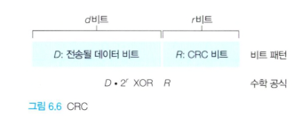

주어진 D와 R에 대해 `D · 2`<sup>`r`</sup> `XOR R`은 그림에 나타낸 것처럼 d + r 비트 패턴을 만든다. 각각의 CRC 표준은 **r + 1 비트보다 짧은 모든 버스트 오류**를 검출할 수 있다.

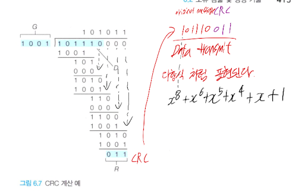

---

## 3. 다중 접속 링크와 프로토콜

네트워크 링크는 크게 두 종류로 나뉜다.

| 종류 | 구성 | 예 |
|---|---|---|
| 점대점 링크(point-to-point) | 링크 한쪽 끝에 송신자 하나, 다른 쪽 끝에 수신자 하나 | PPP, HDLC |
| 브로드캐스트 링크(broadcast) | 하나의 공유된 브로드캐스트 채널에 다수의 송신·수신 노드가 연결 | 이더넷, 무선 랜 |

브로드캐스트 링크에서는 한 노드가 프레임을 전송하면 **연결된 모든 노드가 그 복사본을 수신**한다. 이런 채널은 하나의 건물이나 캠퍼스에 지리적으로 집중된 네트워크, 즉 랜(LAN)에서 주로 쓰인다.

### 다중 접속 문제

데이터 링크 계층에서 가장 중요한 문제는 **다중 접속 문제**, 즉 다수의 송수신 노드들이 공유하는 브로드캐스트 채널로의 접속을 어떻게 조정할 것인가이다.

- 2개 이상의 노드가 동시에 프레임을 전송하면 **충돌(collision)** 이 발생한다.
- 충돌이 일어나면 신호가 뒤엉켜 프레임의 의미를 파악할 수 없게 되고, 관련된 모든 프레임이 손실되며 충돌 기간만큼 채널이 낭비된다.
- 이 조정 작업을 담당하는 것이 **다중 접속 프로토콜**이다.

다중 접속 프로토콜은 채널 분할 프로토콜, 랜덤 접속 프로토콜, 순번 프로토콜의 세 가지로 분류할 수 있다.

### 1. 채널 분할 프로토콜

채널을 공유하는 모든 노드가 브로드캐스트 채널의 대역폭을 나눠 쓰게 하는 방식이다.

| 방식 | 분할 기준 | 각 노드가 얻는 것 |
|---|---|---|
| TDM(시분할 다중화) | 시간 | 시간 프레임을 N개 슬롯으로 나눠 슬롯 하나씩 할당 |
| FDM(주파수 분할 다중화) | 주파수 | R bps 채널을 나눠 R/N bps 채널 하나씩 할당 |
| CDMA(코드 분할 다중 접속) | 코드 | 노드마다 서로 다른 유일한 코드 할당 |

#### 1. TDM과 FDM

TDM은 시간을 시간 프레임으로 나누고, 다시 각 시간 프레임을 N개의 시간 슬롯으로 나눈 뒤 각 슬롯을 N개 노드에 하나씩 할당한다. FDM은 R bps 채널을 여러 주파수 대역으로 나눠 각 주파수를 노드 하나에 할당하며, 결과적으로 하나의 큰 R bps 채널로부터 N개의 R/N bps 채널을 만든다.

두 방식 모두 **충돌을 완전히 제거하고 대역폭을 공정하게 나눈다**는 장점이 있지만, 동일한 단점도 공유한다.

| 장점 | 단점 |
|---|---|
| 충돌이 발생하지 않는다 | 전송할 패킷을 가진 노드가 단 하나뿐일 때도 전송률이 R/N으로 제한된다 |
| N개 노드에게 대역폭을 균등하게 분할한다 | (TDM의 경우) 노드가 자신의 전송 차례를 항상 기다려야 한다 |

> 아무도 말하지 않는데 내 차례를 기다려야 하는 파티처럼, TDM/FDM은 트래픽이 몰렸다 비었다 하는 환경에는 부적합하다.

#### 2. CDMA

CDMA는 서로 다른 코드를 각 노드에 할당하고, 노드는 전송할 데이터 비트들을 자신의 유일한 코드로 인코딩한다. 코드들을 신중하게 선택하면 여러 노드가 **동시에 전송해도** 각 수신자가 자신이 원하는 송신자의 인코딩된 데이터 비트를 정확하게 복원할 수 있다는 훌륭한 특성이 있다. CDMA는 오랫동안 군사 시스템에서 사용되어 왔으며, 오늘날에는 무선 채널과 밀접하게 연관되어 쓰인다.

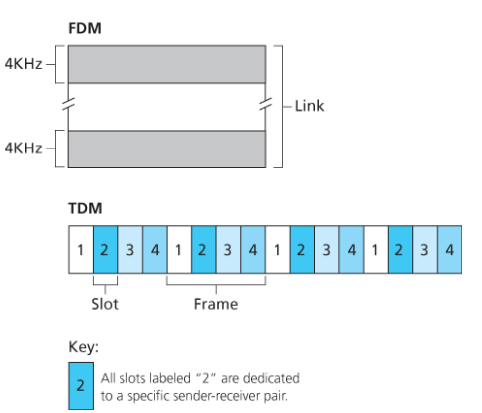

### 2. 랜덤 접속 프로토콜

랜덤 접속 프로토콜에서 전송 노드는 항상 채널의 최대 전송률인 R bps로 전송한다.

- 충돌이 발생하면, 충돌과 관련된 각 노드는 프레임이 충돌 없이 전송될 때까지 자신의 프레임을 계속해서 재전송한다.
- 단, 충돌했을 때 해당 프레임을 **즉시** 재전송하지 않는다. 재전송 전에 각자 **랜덤한 지연 시간**을 기다림으로써 같은 충돌이 반복되는 것을 막는다.

이더넷에서 널리 쓰이는 CSMA 계열 프로토콜이 여기에 속한다.

#### 1. 슬롯 알로하(slotted ALOHA)

가장 단순한 랜덤 접속 프로토콜 중 하나로, 다음을 가정한다.

- 모든 프레임은 정확히 L비트로 구성된다.
- 시간은 L/R초 길이의 **슬롯**들로 나뉘고, 노드는 슬롯의 시작점에서만 전송을 시작한다.
- 각 노드는 언제 슬롯이 시작하는지 알 수 있도록 동기화되어 있다.
- 한 슬롯에서 2개 이상의 프레임이 충돌하면, 모든 노드가 그 슬롯이 끝나기 전에 충돌 발생을 알게 된다.

동작은 간단하다. 전송할 프레임이 있으면 다음 슬롯 시작점에서 전송하고, 충돌이 없었으면 성공이다. 충돌이 있었으면 각 노드는 **독립적으로 동전을 던져** 확률 p로 다음 슬롯에 재전송하고, 그렇지 않으면 또 다음 슬롯을 기다린다.

| 장점 | 한계 |
|---|---|
| 활성 노드가 하나일 때 채널 전속력 R로 계속 전송할 수 있다 | 노드가 많아지면 충돌 슬롯과 빈 슬롯이 늘어난다 |
| 각 노드가 스스로 충돌을 감지하고 재전송 시점을 정하므로 완전히 분산적이다 | 슬롯 동기화가 필요하다 |
| 구현이 매우 단순하다 | 최대 효율이 약 37%(1/e)에 그친다 |

정확히 한 노드만 전송한 슬롯을 **성공한 슬롯**이라 하고, 항상 전송할 프레임이 많은 상황에서 성공한 슬롯이 차지하는 비율을 프로토콜의 **효율**로 정의한다.

#### 2. 순수 알로하(pure ALOHA)

순수 알로하는 슬롯 알로하에서 동기화를 없앤 형태다. 프레임이 도착하면 슬롯 시작을 기다리지 않고 **곧바로** 프레임 전체를 브로드캐스트 채널로 전송한다.

- 동기화가 필요 없어 더 단순하지만, 충돌 위험 구간이 두 배로 늘어난다. 어떤 프레임이 전송되는 시간 앞뒤로 한 프레임 시간씩, 총 2배의 구간 동안 다른 전송이 없어야 성공한다.
- 그 결과 최대 효율은 슬롯 알로하의 절반인 약 18%(1/2e)로 떨어진다.

> 완전한 분산과 단순성을 얻는 대가로 채널 효율을 희생한 구조다.

#### 3. CSMA(반송파 감지 다중 접속)

사람들의 대화 예절에 빗대면 CSMA 계열의 두 규칙은 이렇다.

| 규칙 | 대응하는 기술 |
|---|---|
| 말하기 전에 듣는다 — 다른 사람의 말이 끝날 때까지 기다린다 | **반송파 감지(carrier sensing)** |
| 다른 사람이 동시에 말하기 시작하면 말을 중단한다 | **충돌 검출(collision detection)** |

이 두 규칙이 각각 CSMA와 CSMA/CD 프로토콜에 포함되어 있다. 반송파 감지를 하는데도 충돌이 발생하는 이유는 **채널 전파 지연** 때문이다. 어떤 노드가 전송을 시작해도 그 신호가 다른 노드에 도달하기까지 시간이 걸리므로, 그 사이에 다른 노드는 채널이 유휴 상태라고 판단하고 전송을 시작할 수 있다. 따라서 전파 지연은 CSMA의 성능을 결정하는 데 결정적인 역할을 한다.

#### 4. CSMA/CD(충돌 검출 기능이 있는 CSMA)

CSMA/CD는 CSMA에 **전송 도중에도 채널을 계속 감시하는 충돌 검출** 기능을 더한 것이다. 충돌이 감지되면 즉시 전송을 포기하므로, 충돌로 낭비되는 채널 시간을 크게 줄일 수 있다. 어댑터의 동작은 다음과 같다.

1. 어댑터는 네트워크 계층으로부터 데이터그램을 받아서 링크 계층 프레임을 만든 후 어댑터의 버퍼에 저장한다.
2. 어댑터가 채널이 유휴 상태임을 감지하면 프레임 전송을 시작한다. 채널이 바쁜 상태임을 감지하면 유휴 상태가 될 때까지 기다렸다가 전송을 시작한다.
3. 전송하는 동안 어댑터는 브로드캐스트 채널을 사용하는 다른 어댑터로부터 신호 에너지가 있는지 계속 감시한다.
4. 프레임 전체를 전송하는 동안 다른 어댑터로부터의 신호 에너지가 감지되지 않으면 프레임 전송을 완료한다.
5. 전송 도중에 다른 어댑터의 신호 에너지를 감지하면 **프레임 전송을 즉시 취소**한다.
6. 전송을 취소한 후 임의의 랜덤 시간을 기다린 뒤 2단계로 돌아간다.

6단계의 대기 시간을 어떻게 정하느냐가 관건이다. 너무 짧으면 같은 노드들끼리 다시 충돌하고, 너무 길면 채널이 놀게 된다. 이더넷과 DOCSIS 케이블 네트워크의 다중 접속 프로토콜이 사용하는 **이진 지수적 백오프(binary exponential backoff)** 알고리즘이 이 문제를 효율적으로 해결한다. n번째 충돌 후에는 {0, 1, 2, …, 2<sup>n</sup> − 1} 중 하나를 임의로 골라 그만큼의 시간을 기다리므로, 충돌이 반복될수록 대기 구간이 넓어져 경합이 자연스럽게 완화된다.

#### 5. CSMA/CD의 효율

CSMA/CD의 효율은 **전파 지연이 프레임 전송 시간에 비해 얼마나 짧은가**로 결정된다.

- 전파 지연 d<sub>prop</sub>이 0에 가까워지면 충돌을 즉시 감지하고 즉시 포기하므로 효율은 1에 가까워진다.
- 프레임 전송 시간 d<sub>trans</sub>가 매우 커지면, 한 번 채널을 잡았을 때 오래 쓰므로 충돌 비용이 상대적으로 작아져 역시 효율이 1에 접근한다.

> 랜의 물리적 거리가 짧고 프레임이 충분히 길면, CSMA/CD는 채널을 거의 모든 시간 동안 유용하게 쓸 수 있다.

### 3. 순번 프로토콜

다중 접속 프로토콜에 요구되는 두 가지 바람직한 특성은 다음과 같다.

1. 단 하나의 노드만 활성이면 그 노드가 R bps의 처리율을 갖는다.
2. M개의 노드가 활성이면 각 노드가 거의 R/M bps의 처리율을 갖는다.

알로하와 CSMA 계열 프로토콜은 첫 번째 특성은 지니고 있으나 두 번째 특성은 갖지 못한다. 이것이 **순번 프로토콜**을 개발하게 된 동기다.

#### 1. 폴링 프로토콜(polling protocol)

노드 중 하나를 **마스터 노드**로 지정하고, 마스터 노드가 각 노드를 라운드 로빈 방식으로 폴링한다. 마스터는 노드 1에게 "최대 몇 개의 프레임까지 보낼 수 있다"는 정보를 담은 메시지를 전송하고, 노드 1이 전송을 마치면 노드 2에게 같은 방식으로 알리며 순회한다.

| 장점 | 단점 |
|---|---|
| 충돌과 빈 슬롯을 모두 제거해 훨씬 높은 효율을 낸다 | 폴링 지연 — 노드 하나만 활성이어도 폴링 메시지를 기다려야 한다 |
| | 마스터 노드가 고장 나면 전체 채널이 동작하지 못한다 |

#### 2. 토큰 전달 프로토콜(token-passing protocol)

마스터 노드가 없고, **토큰**이라 불리는 특수 목적의 짧은 프레임이 정해진 순서대로 노드 간에 전달된다. 노드는 토큰을 수신했을 때 전송할 프레임이 있으면 최대 개수까지 전송한 뒤 토큰을 다음 노드로 넘기고, 없으면 곧바로 토큰을 넘긴다.

- 토큰 전달은 완전히 분산된 방식이며 효율이 매우 높다.
- 다만 한 노드가 고장 나거나 토큰을 놓아주지 않으면 채널 전체가 멈추므로, 이를 감지하고 토큰을 되살리는 **회복 절차**가 반드시 필요하다.

### 4. DOCSIS: 케이블 인터넷 접속을 위한 링크 계층 프로토콜

DOCSIS는 케이블 데이터 네트워크의 구조와 프로토콜들을 정의하며, 앞서 살펴본 세 부류의 다중 접속 기법을 실제로 조합해 쓰는 좋은 사례다.

- **FDM**을 사용해 하향 및 상향 네트워크 세그먼트를 다수의 주파수 채널로 나눈다.
- **하향**: CMTS(케이블 모뎀 종단 시스템)가 하향 채널로 전송한 프레임은 그 채널로 수신하는 모든 케이블 모뎀이 받는다. 송신자가 CMTS 하나뿐이므로 충돌이 없다.
- **상향**: 다수의 케이블 모뎀이 CMTS로 향하는 동일한 상향 채널을 공유하므로 충돌이 발생할 수 있어 기술적으로 더 까다롭다.

상향 채널은 **TDM**으로 시간 간격들이 나뉘어 있고, 각 시간 간격은 케이블 모뎀이 전송할 수 있는 일련의 **미니슬롯**들로 구성된다.

1. CMTS는 하향 채널로 **MAP 메시지**라는 제어 메시지를 보내, 어떤 케이블 모뎀이 어떤 미니슬롯으로 전송할 수 있는지 알려준다.
2. 미니슬롯이 명시적으로 할당되므로, 해당 미니슬롯 동안에는 충돌이 발생하지 않음을 보장할 수 있다.
3. 다만 모뎀이 "전송할 것이 있다"고 알리는 **미니슬롯 요청** 자체는 여러 모뎀이 경쟁하는 구간에서 이뤄지므로 여기서는 충돌이 가능하며, 이때는 이진 지수적 백오프로 재시도한다.

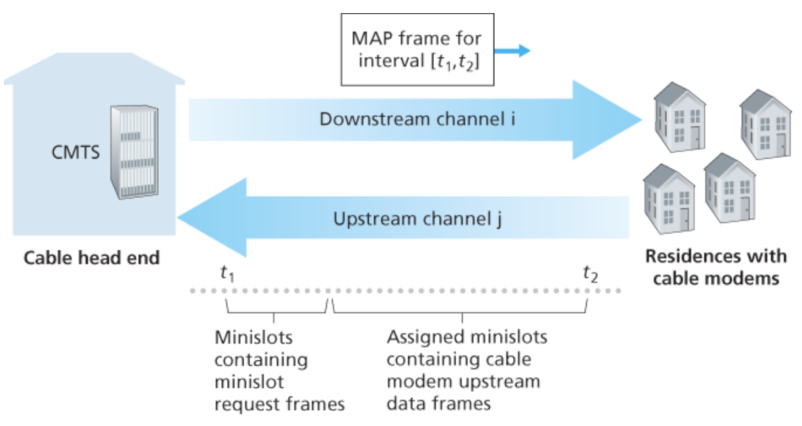

---

## 4. 스위치 근거리 네트워크

링크 계층 스위치는 **링크 계층에서 동작**하기 때문에 링크 계층 프레임을 교환하고, 네트워크 계층 주소를 인식하지 않는다. 따라서 2계층 스위치들로 구성된 네트워크에서는 경로를 결정하는 데 OSPF 같은 라우팅 프로토콜을 사용하지 않으며, 프레임을 전달할 때 IP 주소가 아닌 **링크 계층 주소**를 사용한다.

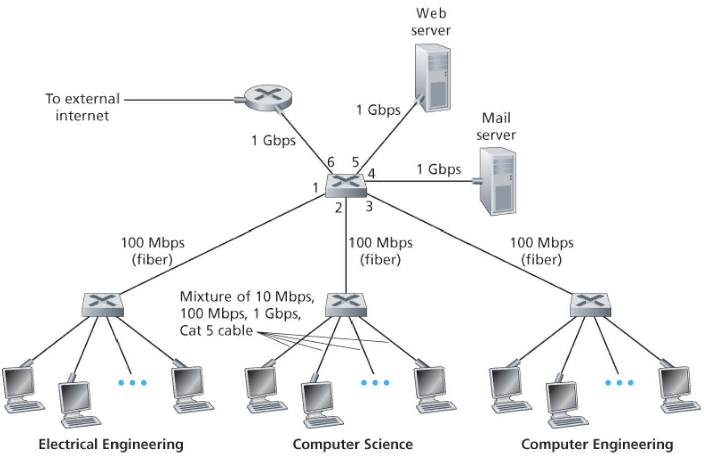

### 1. 링크 계층 주소체계와 ARP

호스트와 라우터는 네트워크 계층 주소(IP)뿐만 아니라 링크 계층 주소도 갖는다.

#### 1. MAC 주소

정확히 말하면 링크 계층 주소를 가진 것은 호스트나 라우터 자체가 아니라 **호스트나 라우터의 어댑터**다.

- 다수의 네트워크 인터페이스를 갖고 있는 호스트나 라우터는 여러 개의 링크 계층 주소를 갖게 된다.
- 반면 링크 계층 스위치는 호스트나 라우터를 연결해주는 인터페이스에 링크 계층 주소를 할당받지 않는다. 스위치는 호스트나 라우터 **사이에서** 데이터그램을 전달하는 일만 하며, 그 과정에서 자신이 프레임의 목적지가 될 일이 없기 때문이다.

링크 계층 주소는 랜 주소, 물리 주소, 또는 **MAC 주소**라고도 불린다.

| 특성 | 내용 |
|---|---|
| 길이 | 대부분의 랜에서 6바이트 |
| 표기 | 16진수 표기법. 각 바이트를 2개의 16진수로 표시 (예: `5C-66-AB-90-75-B1`) |
| 유일성 | 어떤 두 어댑터도 동일한 주소를 갖지 않는다 |
| 관리 주체 | IEEE가 MAC 주소 공간을 관리한다 |

주소 공간은 다음과 같이 분배된다. 회사가 어댑터를 제조하려면 주소 영역을 구매해야 하는데, IEEE는 앞 24비트를 그 회사 값으로 고정하고 나머지 24비트는 회사가 자유롭게 부여하게 하는 방식으로 2<sup>24</sup>개의 주소를 한 번에 할당한다.

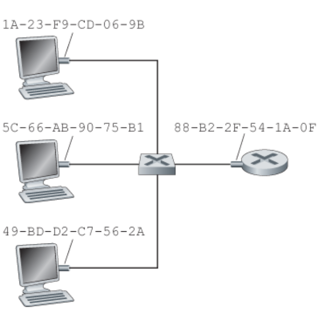

어댑터의 MAC 주소는 **평면(flat) 구조**를 가지며, 어댑터가 어디로 옮겨가든 주소는 바뀌지 않는다. 계층구조를 갖고 네트워크 위치에 따라 달라지는 IP 주소와 대비되는 지점이다.

어댑터가 프레임을 목적지 어댑터로 전송할 때, 송신 어댑터는 프레임에 목적지 어댑터의 MAC 주소를 넣고 그 프레임을 랜상으로 전송한다. 스위치는 필요하면 프레임을 자신의 모든 인터페이스로 브로드캐스트하기도 한다. 어댑터는 프레임을 받으면 목적지 MAC 주소가 자신의 것인지 검사해, 일치할 때만 상위 계층으로 올려보낸다.

때때로 어떤 송신 어댑터는 랜상의 다른 **모든** 어댑터가 자신의 프레임을 수신하고 처리하기를 원한다. 이때는 목적지 주소 필드에 특수한 **MAC 브로드캐스트 주소**(`FF-FF-FF-FF-FF-FF`)를 넣는다.

#### 2. ARP(주소 변환 프로토콜)

네트워크 계층 주소(IP)와 링크 계층 주소(MAC)가 모두 존재하므로 이 둘 사이의 변환이 필요하다. 이 일을 하는 것이 **ARP(Address Resolution Protocol)** 이다. ARP는 **같은 서브넷 안에 있는** 호스트와 라우터 인터페이스에 대해서만 IP 주소를 MAC 주소로 변환해준다.

각 호스트와 라우터는 자신의 메모리에 **ARP 테이블**을 갖고 있으며, 여기에는 `IP 주소 → MAC 주소` 매핑과 그 항목의 **TTL(수명)** 값이 저장된다. TTL이 만료된 항목은 테이블에서 지워진다.

송신 노드가 같은 서브넷의 어떤 IP 주소로 데이터그램을 보내려 할 때의 동작은 다음과 같다.

1. 송신 노드가 자신의 ARP 테이블에서 목적지 IP 주소를 찾는다. **있으면** 그 MAC 주소를 프레임의 목적지 주소로 넣고 곧바로 전송한다.
2. **없으면** ARP 질의 패킷을 만든다. 이 패킷에는 송신자의 IP·MAC 주소와 찾고자 하는 목적지 IP 주소가 들어 있다.
3. ARP 질의 메시지는 **브로드캐스트 프레임**(목적지 MAC `FF-FF-FF-FF-FF-FF`)에 실려 전송되므로 서브넷의 모든 어댑터가 받는다.
4. 각 어댑터는 질의 안의 목적지 IP가 자신의 IP와 일치하는지 확인한다. 일치하는 노드만이 자신의 MAC 주소를 담은 **ARP 응답**을 만든다.
5. ARP 응답은 브로드캐스트가 아니라 질의를 보낸 노드를 향한 **표준(유니캐스트) 프레임**으로 전송된다.
6. 질의한 노드는 응답을 받아 자신의 ARP 테이블에 `IP → MAC` 항목을 추가하고, 원래 보내려던 데이터그램을 전송한다.

> ARP는 **플러그 앤 플레이**다. 관리자가 손대지 않아도 노드의 ARP 테이블이 통신 과정에서 자동으로 구축되고, TTL로 자동으로 정리된다.

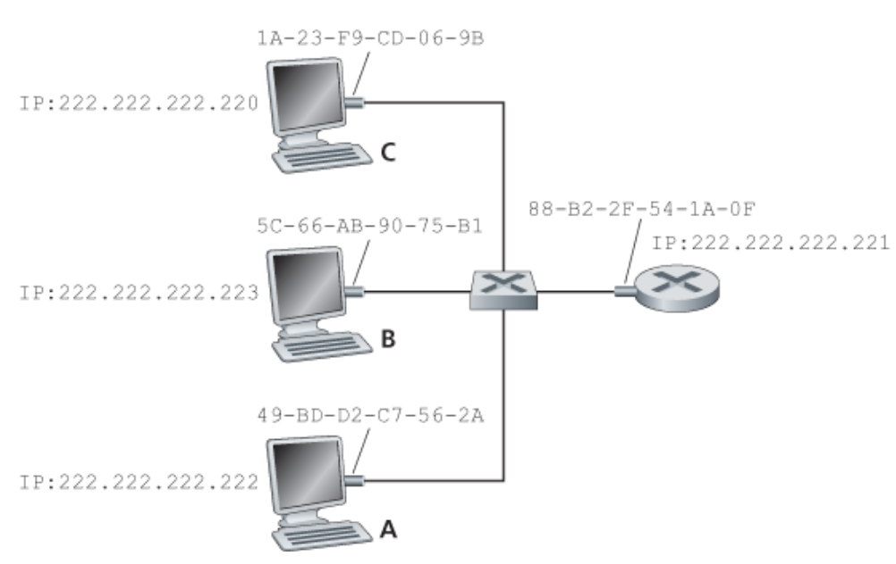

#### 3. 서브넷에 없는 노드로의 데이터그램 전송

호스트가 **같은 서브넷**의 다른 호스트로 데이터그램을 전송할 때 ARP가 어떻게 동작하는지는 위에서 살펴봤다. 이제 서브넷 밖의 호스트로 네트워크 계층 데이터그램을 전송하는 더 복잡한 상황을 보자. 서브넷이 라우터로 연결되어 있고, 출발지 호스트가 다른 서브넷의 호스트에게 데이터그램을 보내려 한다고 가정한다.

핵심은 **IP 주소와 MAC 주소가 서로 다른 범위를 가리킨다**는 점이다.

| 주소 | 무엇을 가리키는가 | 경로 중에 바뀌는가 |
|---|---|---|
| 출발지·목적지 IP 주소 | 최종 종단 호스트 | 바뀌지 않는다 (종단 간 유지) |
| 출발지·목적지 MAC 주소 | 현재 링크의 양 끝 어댑터 | **링크마다 바뀐다** |

전달 과정은 다음과 같다.

1. 출발지 호스트는 목적지 IP가 자신의 서브넷 밖임을 알고, 데이터그램을 **디폴트 게이트웨이 라우터**로 먼저 보내기로 한다.
2. 그러려면 라우터의 그쪽 인터페이스 MAC 주소가 필요하다. ARP 테이블에 없으면 ARP로 알아낸다.
3. 프레임을 만든다. **IP 헤더**의 목적지는 여전히 최종 목적지 호스트의 IP지만, **이더넷 헤더**의 목적지 MAC은 라우터 인터페이스의 MAC이다.
4. 라우터가 프레임을 받아 데이터그램을 꺼내고, 포워딩 테이블을 조회해 어느 인터페이스로 내보낼지 결정한다.
5. 라우터는 그 인터페이스 쪽 서브넷에서 다음 홉(또는 최종 목적지)의 MAC 주소를 ARP로 알아낸 뒤, **새 이더넷 프레임**에 데이터그램을 다시 캡슐화해 내보낸다. 이때 출발지 MAC은 라우터의 해당 인터페이스 MAC이 된다.
6. 목적지 서브넷에 도달할 때까지 4~5단계가 반복되고, 마지막 링크에서 목적지 호스트의 MAC이 목적지 주소로 채워진다.

> 데이터그램은 **IP 주소로 종단까지 길을 찾고**, 프레임은 **MAC 주소로 한 링크만 건넌다.** 링크를 건널 때마다 캡슐화가 새로 이뤄진다.

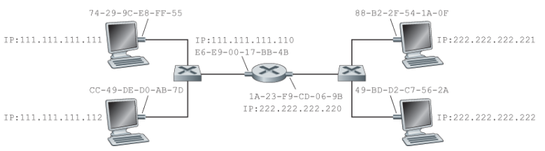

### 2. 이더넷

이더넷은 처음으로 널리 사용된 고속 랜이며, 오늘날 유선 랜 시장을 사실상 독점하고 있다. 경쟁 기술이었던 토큰링, FDDI, ATM은 이더넷보다 복잡하고 비쌌다. 일반적으로 랜 기술을 다른 것으로 바꾸는 가장 중요한 이유는 더 높은 데이터율인데, 이더넷은 스위치 이더넷으로 진화하며 데이터율을 계속 끌어올려 그 이유마저 없앴다.

이더넷의 토폴로지는 다음과 같이 변해 왔다.

| 세대 | 토폴로지 | 중심 장치 | 특징 |
|---|---|---|---|
| 초기 | 버스 | 없음(동축 케이블 공유) | 이진 지수적 백오프를 쓰는 CSMA/CD 다중 접속 프로토콜 |
| 1990년대 | 스타 | **허브** | 호스트가 꼬임쌍선으로 허브에 직접 연결. 허브는 프레임이 아닌 **개별 비트**를 처리하는 물리 계층 장치 |
| 현재 | 스타 | **스위치** | 링크 계층 장치. 충돌 자체가 사라진다 |

허브 기반 스타 토폴로지의 이더넷은 여전히 브로드캐스트 랜이었다. 허브가 한 인터페이스로 받은 비트를 나머지 모든 인터페이스로 그대로 재생하기 때문에 충돌이 여전히 발생했다. 이후 중앙의 허브가 스위치로 대체되면서 이 문제가 해소되었다.

#### 1. 이더넷 프레임 구조

송신 어댑터 A가 MAC 주소 `AA-AA-AA-AA-AA-AA`를 가지며, 수신 어댑터 B가 `BB-BB-BB-BB-BB-BB`를 갖는다고 하자. 어댑터 A는 IP 데이터그램을 이더넷 프레임에 캡슐화해 랜으로 보내고, 수신 어댑터는 그 프레임을 물리 계층으로부터 받아 IP 데이터그램을 추출한 뒤 네트워크 계층으로 전달한다.

| 필드 | 크기 | 역할 |
|---|---|---|
| 프리앰블(preamble) | 8바이트 | 수신 어댑터를 깨우고 클록을 동기화한다. 첫 7바이트는 `10101010`, 마지막 바이트는 `10101011`로 끝의 두 1이 프레임 시작을 알린다 |
| 목적지 주소 | 6바이트 | 목적지 어댑터의 MAC 주소 |
| 출발지 주소 | 6바이트 | 프레임을 랜으로 전송하는 어댑터의 MAC 주소 |
| 타입(type) | 2바이트 | 상위 네트워크 계층 프로토콜을 구분한다 |
| 데이터 | 46~1,500바이트 | IP 데이터그램을 운반한다 |
| CRC | 4바이트 | 프레임에 오류가 생겼는지 검출한다 |

각 필드에 대해 조금 더 살펴보자.

- **데이터 필드**: 이더넷의 최대 전송 단위(MTU)는 1,500바이트다. IP 데이터그램이 이보다 크면 분할해야 하고, 46바이트보다 작으면 채움(padding)으로 46바이트를 맞춰야 한다.
- **타입 필드**: 이더넷이 여러 네트워크 계층 프로토콜을 **다중화**할 수 있게 해준다. 호스트는 다수의 네트워크 계층 프로토콜을 지원할 수 있고, 애플리케이션마다 다른 프로토콜을 쓸 수 있다. IP를 비롯한 각 프로토콜은 자신만의 표준 타입 번호를 갖고 있어, 수신 측이 데이터 필드의 내용을 어느 프로토콜에 넘길지 판단한다.
- **CRC 필드**: 수신 어댑터가 오류를 검출하면 그 프레임을 **그냥 폐기**한다. 재전송을 요청하지는 않는다.

이 마지막 점 때문에 이더넷의 서비스 성격이 결정된다.

> 모든 이더넷 기술은 네트워크 계층에게 **비연결형이며 비신뢰적인** 서비스를 제공한다. 손실 복구는 상위 계층(TCP)의 몫이다.

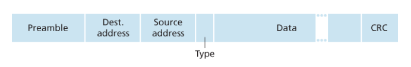

#### 2. 이더넷 기술

이더넷 표준은 `10BASE-T`, `100BASE-TX`, `1000BASE-LX`처럼 표기되며, 앞 숫자는 속도(Mbps), 뒤 문자는 물리 매체를 뜻한다.

- 이더넷은 초기에 동축 케이블 기반이었으며, 신호가 감쇠하면 **리피터**를 사용해 물리적인 길이를 확장할 수 있었다. 리피터는 한쪽에서 받은 신호를 증폭해 다른 쪽으로 보내는 물리 계층 장치다.
- 버스·허브 시절에는 CSMA/CD 프로토콜이 다중 접속 문제를 해결해 주었다.
- 그러나 **스위치 기반 이더넷 랜에는 충돌이 없으며, 따라서 MAC 프로토콜 자체가 필요 없다.** 오늘날 널리 쓰이는 기가비트 이더넷은 이런 전이중 스위치 환경을 전제로 한다.

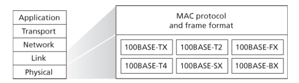

### 3. 링크 계층 스위치

스위치의 가장 중요한 성질은 **투명성(transparency)** 이다. 스위치는 서브넷의 호스트와 라우터에게 보이지 않는다. 호스트나 라우터는 프레임을 스위치가 아니라 다른 호스트/라우터를 목적지로 해서 랜상으로 보낼 뿐이며, 중간에 스위치가 그 프레임을 받아 다른 노드로 전달한다는 사실을 알지 못한다.

스위치는 저장 후 전달 방식으로 동작하므로 입출력 인터페이스마다 버퍼를 갖는다. 프레임이 어떤 출력 인터페이스에 도착하는 속도가 그 인터페이스의 링크 용량을 일시적으로 초과할 수 있기 때문이다.

#### 1. 포워딩과 필터링

| 기능 | 정의 |
|---|---|
| 필터링(filtering) | 프레임을 어떤 인터페이스로 전달할지, 아니면 그냥 폐기할지 결정하는 기능 |
| 포워딩(forwarding) | 프레임이 전송될 인터페이스를 결정하고 실제로 그 인터페이스로 내보내는 기능 |

스위치의 필터링과 포워딩은 모두 **스위치 테이블**을 이용한다. 스위치 테이블에는 랜상의 모든 호스트와 라우터가 아니라 **일부 노드**에 대한 엔트리만 들어 있으며, 각 엔트리는 다음 세 가지로 구성된다.

1. 노드의 MAC 주소
2. 그 MAC 주소로 가게 하는 스위치 인터페이스
3. 해당 엔트리가 테이블에 놓인 시각

프레임이 인터페이스 x로 도착했을 때 스위치의 동작은 목적지 MAC 주소로 테이블을 조회한 결과에 따라 갈린다.

| 조회 결과 | 동작 |
|---|---|
| 엔트리 없음 | 인터페이스 x를 제외한 모든 인터페이스로 **브로드캐스트**한다 |
| 엔트리의 인터페이스 = x | 목적지가 이미 같은 세그먼트에 있으므로 프레임을 **폐기(필터링)** 한다 |
| 엔트리의 인터페이스 = y (≠ x) | 인터페이스 y의 버퍼에 넣어 **포워딩**한다 |

한편 다수의 최신 패킷 스위치들은 2계층 MAC 주소를 기반으로 전달하는 스위치로도, 3계층 IP 주소를 기반으로 전달하는 라우터로도 동작하도록 설정할 수 있다.

#### 2. 자가학습

스위치 테이블의 강점은 관리자가 채워 넣지 않아도 된다는 것이다. 스위치는 자신의 테이블을 **자동으로, 동적으로, 자치적으로** 구축하는 자가학습(self-learning) 특징이 있다.

1. 스위치 테이블은 초기에 비어 있다.
2. 어떤 인터페이스로 프레임을 수신할 때마다, 스위치는 프레임의 **출발지 주소** 필드에 있는 MAC 주소, 프레임이 도착한 인터페이스, 현재 시각을 테이블에 저장한다.
3. 이런 식으로 스위치는 송신 노드가 어느 랜 세그먼트에 상주하는지를 기록해 나간다. 랜에 있는 모든 호스트가 한 번씩 프레임을 송신하면, 결국 모든 호스트에 대한 정보가 테이블에 기록된다.
4. 일정 시간(에이징 타임)이 지나도록 해당 주소를 출발지로 하는 프레임을 받지 못하면, 스위치는 테이블에서 그 주소를 삭제한다. 호스트가 다른 인터페이스로 옮겨가거나 랜에서 제거되는 경우에 대응하기 위해서다.

스위치는 네트워크 관리자나 사용자의 개입을 요구하지 않으므로 **플러그 앤 플레이 장치**다. 또한 전이중(full-duplex)이므로, 노드와 스위치는 둘을 연결하는 링크로 서로 동시에, 충돌 없이 전송할 수 있다.

#### 3. 링크 계층 스위치의 특성

버스나 허브 기반 스타 토폴로지 같은 브로드캐스트 링크 대신 스위치를 쓰면 다음과 같은 장점이 있다.

| 장점 | 내용 |
|---|---|
| 충돌 제거 | 스위치는 프레임을 버퍼링하며 어느 시점에도 한 세그먼트에 하나 이상의 프레임을 전송하지 않는다. 충돌로 낭비되는 대역폭이 없으므로 최대 총 처리율이 **모든 스위치 인터페이스 속도의 합**이 된다 |
| 이질적인 링크 | 스위치가 링크들을 서로 분리해 주므로, 랜의 각 링크는 서로 다른 속도로 동작하고 서로 다른 매체를 사용할 수 있다 |
| 관리 | 어댑터가 오작동해 이더넷 프레임을 계속 보내는 경우 이를 감지해 그 어댑터의 연결을 의도적으로 끊을 수 있다. 향상된 보안과 함께 네트워크 관리를 쉽게 해준다 |

#### 4. 스위치 대 라우터

라우터와 스위치는 모두 **저장 후 전달 패킷 스위치**지만, 라우터는 네트워크 계층 주소를, 스위치는 MAC 주소를 사용해 패킷을 전달한다는 점에서 근본적으로 다르다. 다만 매치 플러스 액션 기능을 사용하는 최신 스위치들은 목적지 MAC 주소를 기반으로 하는 2계층 전달뿐 아니라 목적지 IP 주소를 기반으로 하는 3계층 전달도 수행할 수 있고, OpenFlow 표준을 사용하는 스위치라면 프레임·데이터그램·트랜스포트 계층 헤더의 11개 필드를 사용해 일반화된 패킷 전달까지 수행할 수 있다.

**스위치의 장단점**

| 장점 | 단점 |
|---|---|
| 플러그 앤 플레이 장치다 | 브로드캐스트 프레임의 순환을 막기 위해 실제 사용 가능한 토폴로지가 **스패닝 트리**로 제한된다 |
| 상대적으로 높은 패킷 필터링·전달률을 갖는다 | 대규모 스위치 네트워크에서는 호스트와 라우터가 커다란 ARP 테이블을 갖게 되고 상당한 양의 ARP 트래픽이 생성·처리된다 |
| | 브로드캐스트 트래픽의 폭주(broadcast storm)에 대한 방안을 제공하지 않는다 |

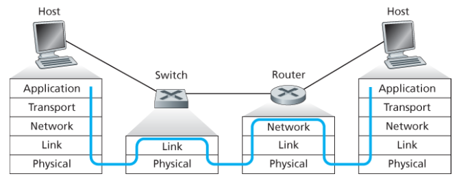

**라우터의 장단점**

| 장점 | 단점 |
|---|---|
| 네트워크 주소체계는 MAC 주소체계처럼 평면적이지 않고 계층구조이므로, 중복 경로가 있어도 패킷이 순환하지 않는다 | 플러그 앤 플레이가 아니다. 라우터와 호스트가 IP 주소 구성을 필요로 한다 |
| 패킷이 스패닝 트리에 제한받지 않고 출발지와 목적지 사이의 최상의 경로를 사용할 수 있어, 인터넷 토폴로지를 자유롭게 구축할 수 있다 | 3계층 필드까지 처리해야 하므로 스위치보다 패킷당 처리 시간이 더 크다 |
| 2계층에서의 브로드캐스트 폭풍을 차단한다 | |
| 방화벽 보호 기능을 제공한다 | |

그래서 어느 쪽을 쓰는가는 규모의 문제다.

- 수백 개의 호스트로 구성된 **소규모 네트워크**는 몇 개의 랜 세그먼트만 가지므로 스위치로 충분하다. 트래픽이 지역적으로 제한되고, IP 주소 구성을 요구하지 않으면서 총 처리율을 높여준다.
- **큰 네트워크**에서는 라우터도 함께 사용한다. 라우터는 트래픽을 좀 더 확실히 격리시키고, 브로드캐스트 트래픽의 폭주를 제어하며, 네트워크 내 호스트들 사이에 더 좋은 경로를 사용한다.

### 4. 가상 근거리 네트워크(VLAN)

현대 기관의 랜은 작업그룹별로 별도의 스위치 랜을 갖고, 부서들 간의 스위치 랜은 스위치 계층구조로 연결되는 형태로 구성된다. 이론적으로는 잘 동작하지만 실제로는 다음 세 가지 문제가 생긴다.

| 문제 | 내용 |
|---|---|
| 트래픽 격리의 부족 | 계층구조는 트래픽을 단일 그룹 스위치 내로 격리해 주지만, 브로드캐스트 트래픽은 여전히 전체 네트워크로 전달되어야 한다. 성능뿐 아니라 **보안·개인정보 보호** 측면에서도 브로드캐스트 범위를 제한할 필요가 있다 |
| 스위치의 비효율적인 사용 | 그룹이 3개가 아니라 10개면 첫 단계 스위치가 10개 필요하다. 그룹마다 인원이 10명 미만이라면 96포트 스위치 하나로 전원을 수용할 수 있지만, 스위치 하나로는 트래픽 격리를 할 수 없다 |
| 사용자 관리 | 사원이 한 그룹에서 다른 그룹으로 이동하면 다른 스위치에 연결하기 위해 **물리적 케이블 연결을 변경**해야 한다 |

이런 어려움은 **가상 근거리 네트워크(VLAN)** 를 지원하는 스위치로 해결할 수 있다. 이름 그대로 하나의 물리적 랜 인프라스트럭처 위에서 여러 개의 가상 랜을 정의할 수 있게 되며, 같은 VLAN에 속한 호스트들은 마치 그 스위치에 자신들만 연결된 것처럼 통신한다.

**포트 기반 VLAN**에서는 네트워크 관리자가 스위치 포트를 그룹으로 나눈다. 예를 들어 포트 2~8은 EE VLAN에, 포트 9~15는 CS VLAN에 속하게 한다(포트 1과 16은 할당하지 않는다). 이렇게 하면 한 스위치가 두 개의 독립된 스위치처럼 동작하며, VLAN 간의 브로드캐스트는 서로 넘어가지 않는다.

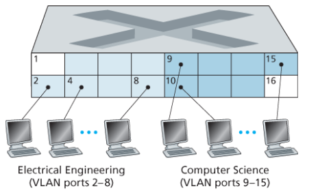

#### 1. VLAN 간 통신과 트렁킹

VLAN을 완벽하게 격리하고 나면 새로운 문제가 생긴다. EE 학과의 트래픽을 어떻게 CS 학과로 보낼 것인가?

- 해법 자체는 간단하다. VLAN 스위치의 한 포트를 외부 라우터에 연결하고, 그 포트를 EE VLAN과 CS VLAN 양쪽에 모두 속하게 구성하면 된다. 그러면 두 VLAN은 라우터를 거쳐 통신한다.
- 실제로 스위치 생산자들은 단일 장치 안에 VLAN 스위치와 라우터를 모두 넣어, 관리자가 이런 구성을 쉽게 할 수 있게 해준다.

여러 대의 VLAN 스위치를 연결해야 할 때 더 확장성 있는 방법이 **VLAN 트렁킹**이다.

1. 스위치마다 하나의 특수 포트를 두 VLAN 스위치를 연결하는 **트렁크 포트**로 구성한다.
2. 트렁크 포트는 모든 VLAN에 속하며, 한 VLAN에서 전송한 프레임들을 트렁크 링크를 통해 다른 스위치로 전달한다.
3. 문제는 건너편 스위치가 그 프레임이 어느 VLAN 소속인지 알아야 한다는 것이다. 이를 위해 **802.1Q 프레임**을 사용한다. 표준 이더넷 프레임 헤더에 4바이트의 **VLAN 태그**를 끼워 넣은 형태다.
4. VLAN 태그는 트렁크 링크의 송신 측 스위치가 프레임에 **추가**하고, 수신 측 스위치가 파싱한 뒤 **제거**한다. 따라서 일반 호스트는 태그의 존재를 알지 못한다.

VLAN 태그는 태그 프로토콜 식별자(TPID) 필드와 2바이트의 태그 제어 정보 필드로 구성되며, 태그 제어 정보 필드 안에 12비트의 VLAN 식별자와 3비트의 우선순위 필드가 들어 있다.

한편 포트 기반 VLAN 외에 **MAC 기반 VLAN**도 있다. 이 경우 네트워크 관리자가 각 VLAN에 속하는 MAC 주소들을 명시하며, 호스트가 어느 포트에 꽂히든 그 MAC이 속한 VLAN으로 자동 분류된다.

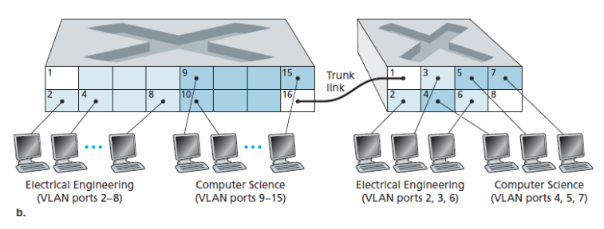

---

## 5. 링크 가상화: 링크 계층으로서의 네트워크

이 장은 서로 통신하는 2개의 호스트를 연결하는 물리적인 선을 링크로 간주하며 시작했다. 하지만 링크는 선보다 **채널**로 더 추상화해서 볼 수 있다. 예를 들어 두 호스트 사이의 다이얼업 모뎀 연결에서, 두 호스트를 연결한 링크는 실제로는 전화 네트워크 전체다. 이런 관점에서 인터넷은 전화 네트워크를 "두 인터넷 호스트 사이에 링크 계층 연결을 제공하는 링크 계층 기술"로 간주하여 **가상화**한 셈이다.

여기서는 그런 링크 가상화의 대표적인 사례인 다중 프로토콜 레이블 스위칭(MPLS) 네트워크를 살펴본다. 회선 교환 전화 네트워크와 달리 MPLS는 **패킷 교환 방식의 가상 회선 네트워크**이며, 자체적인 패킷 형식과 전달 방식을 사용하기 때문에 네트워크 계층과 링크 계층 사이에 있는 **2.5계층** 프로토콜로 불린다.

### 1. 다중 프로토콜 레이블 스위칭(MPLS)

MPLS는 가상 회선 네트워크의 주요 개념인 **고정 길이 레이블**을 도입함으로써 IP 라우터의 전달 속도를 향상하려는 시도에서 발전했다.

> MPLS의 목표는 목적지 기반 IP 데이터그램 전달 인프라스트럭처를 **포기하는 것이 아니라**, 가능한 경우에 데이터그램을 선택적으로 레이블링해서 라우터가 고정 길이 레이블만 보고 데이터그램을 전달할 수 있도록 **기존 구조를 확장**하는 것이다.

즉 MPLS는 IP 주소체계와 라우팅을 사용하는 기존 IP와 조화롭게 공존한다는 점이 중요하다.

#### 1. MPLS 헤더와 레이블 스위치 라우터

MPLS 기능 장치들 사이에서 전달되는 링크 계층 프레임은 **2계층 헤더와 3계층 헤더 사이**에 작은 MPLS 헤더를 갖는다. MPLS 헤더는 다음으로 구성된다.

| 필드 | 역할 |
|---|---|
| 레이블 | 전달의 기준이 되는 고정 길이 식별자 |
| 예약 비트 3개 | 실험용으로 예약 |
| S 비트 | 스택으로 쌓인 일련의 MPLS 헤더들의 끝을 나타냄 |
| TTL | IP의 TTL과 같은 역할 |

이렇게 확장된 프레임은 **MPLS 가능 라우터들 사이에서만** 전송된다. MPLS 가능 라우터는 MPLS 레이블을 포워딩 테이블에서 찾아 적절한 출력 인터페이스로 데이터그램을 전달하므로, 종종 **레이블 스위치 라우터(LSR)** 라고 부른다. 이 과정에서 라우터는 목적지 IP 주소를 꺼내볼 필요도, 최장 프리픽스 대응을 찾을 필요도 없다.

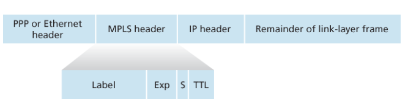

#### 2. MPLS의 활용

MPLS 네트워크는 MPLS 기능이 있는 라우터(R1~R4)와 표준 IP 라우터(R5, R6)가 섞여 있는 형태로 운용될 수 있다.

- 레이블과 경로를 설정하려면 시그널링 프로토콜이 필요하다. IETF의 MPLS 워킹그룹은 MPLS 시그널링을 위해 RSVP 프로토콜을 확장한 **RSVP-TE**를 사용하는 것을 RFC에 명시하고 있다.
- 링크 상태 정보를 MPLS 가능 라우터들 간에 플러딩할 수 있도록 기존의 링크 상태 라우팅 알고리즘(OSPF, IS-IS)도 확장되었다.

> MPLS의 진정한 장점은 전달 속도보다 **트래픽 관리 기능**에 있다.

- **트래픽 엔지니어링**: 목적지가 같더라도 서로 다른 MPLS 경로로 트래픽을 나눠 보낼 수 있다. 목적지 기반 IP 전달만으로는 불가능한 일이다.
- **가상 사설 네트워크(VPN)**: MPLS는 VPN을 구현하는 데에도 사용될 수 있다.

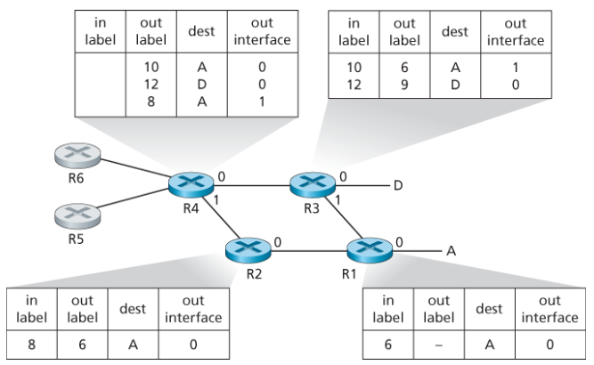

---

## 6. 데이터 센터 네트워킹

인터넷 대기업들은 내부 호스트들 간 상호연결을 위해 자체 데이터 센터 네트워크를 갖고 있다. 데이터 센터는 세 가지 목적을 수행한다.

1. 웹 페이지 검색 결과, 전자메일, 스트리밍 비디오와 같은 **콘텐츠를 사용자에게 제공**한다.
2. 검색 엔진을 위한 분산 인덱스 계산과 같은 특정 데이터 처리 작업이 가능한 **대량 병렬 컴퓨팅 인프라스트럭처** 역할을 한다.
3. 다른 회사에게 **클라우드 컴퓨팅**을 제공한다.

### 1. 데이터 센터 구조

데이터 센터에서 실제 작업을 수행하는 것은 **호스트**들이다.

| 구성요소 | 설명 |
|---|---|
| 블레이드(blade) | 피자 박스 모양의 호스트. CPU, 메모리, 디스크 저장장치를 가진 범용 호스트다 |
| 랙(rack) | 블레이드 20~40대를 적재하는 단위 |
| TOR 스위치 | 랙 맨 위에 있는 스위치. 랙 안의 호스트들을 서로 연결하고, 데이터 센터의 다른 스위치들과도 연결된다 |
| 경계 라우터 | 데이터 센터 네트워크를 공중 인터넷으로 연결한다 |

랙의 호스트들은 네트워크 인터페이스 카드를 통해 TOR 스위치에 연결되며, TOR 스위치는 다른 스위치로 연결될 수 있는 포트를 추가로 갖고 있다. 데이터 센터 네트워크는 **외부 클라이언트와 내부 호스트 사이의 트래픽**과 **내부 호스트 간의 트래픽** 두 종류를 모두 지원해야 하며, 최근 데이터 센터 네트워크 설계는 컴퓨터 네트워킹 연구의 중요한 분야가 되고 있다.

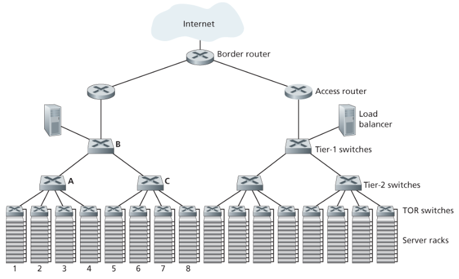

#### 1. 로드 밸런싱

데이터 센터는 외부로부터 요청이 들어오면 이를 **로드 밸런서**로 보낸다. 로드 밸런서는 요청을 호스트들에 분배하며, 각 호스트의 부하 상태를 보고 호스트 간 부하를 균등하게 맞춘다.

- 로드 밸런서는 패킷의 목적지 IP 주소뿐만 아니라 **목적지 포트 번호**까지 보고 결정하기 때문에 **4계층 스위치**라고도 불린다.
- 또한 호스트의 공용 외부 IP 주소를 내부 IP 주소로 변환하고, 클라이언트로 돌아가는 패킷의 내부 IP 주소를 다시 공용 외부 IP 주소로 되돌리는 **NAT와 유사한 기능**도 제공한다.

#### 2. 계층적 구조

수십만 대의 호스트까지 확장하기 위해 데이터 센터는 라우터와 스위치의 **계층구조**를 채택한다.

1. 계층구조의 최상단에서 경계 라우터가 접속 라우터들에 연결된다.
2. 접속 라우터 아래에는 세 단(tier)의 스위치들이 있다. 접속 라우터는 1단(최상단) 스위치에 연결되고, 1단 스위치는 여러 개의 2단 스위치 및 로드 밸런서에 연결된다.
3. 2단 스위치는 랙의 TOR 스위치를 통해 여러 랙으로 연결된다.

일반적으로 모든 링크는 링크 계층 및 물리 계층 프로토콜로 이더넷을 사용하며, ARP 브로드캐스트 트래픽을 지역 내로 한정하기 위해 서브넷은 다시 작은 **VLAN 서브넷들**로 분할된다.

기존의 계층적 구조는 확장성 문제는 해결하지만 **호스트-호스트 간 용량을 제한하는 문제**가 있다. 여러 플로우가 동시에 흐르면 상위 단의 링크가 병목이 되어, 다른 랙에 있는 두 호스트 간 최대 전송률이 훨씬 작아질 수 있다. 가능한 해결 방안은 세 가지다.

| 해결 방안 | 내용 | 한계 |
|---|---|---|
| 고속 스위치·라우터 사용 | 상위 단의 링크 용량 자체를 키운다 | 고속 포트를 갖는 장비가 비싸 데이터 센터 비용이 크게 증가한다 |
| 서비스·데이터 지역화 | 서로 관련된 서비스와 데이터를 가능한 한 같은 랙에 배치해, 2단·1단 스위치를 경유하는 랙 간 통신을 최소화한다 | 호스트들이 여러 랙에 퍼져 있으면 앞의 병목 때문에 성능이 나빠진다 |
| 단 간 연결성 증가 | TOR–2단, 2단–1단 사이의 링크 수를 늘린다. 예컨대 TOR 스위치 하나를 2개의 2단 스위치에 연결하면 랙 간에 링크·스위치가 겹치지 않는 여러 경로가 생긴다 | 배선과 장비 수가 늘어난다 |

단 간 연결성이 증가하면서 **다중 경로 라우팅**이 자연스럽게 적용될 수 있게 되었다. 이를 실현하는 가장 단순한 방법은 **ECMP(Equal Cost Multi Path)** 로, 출발지와 목적지 사이의 스위치들을 따라가며 동일 비용 경로 중 하나를 임의로 골라 다음 홉을 선택한다.

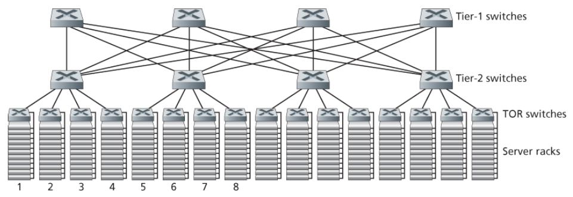

### 2. 데이터 센터 네트워크 동향

데이터 센터 네트워킹은 비용 감소, 가상화, 물리적 제약사항, 모듈화, 커스터마이징 등을 고려하면서 빠르게 발전하고 있다.

#### 1. 비용 감소

인터넷 클라우드 회사들은 확장 및 배치의 수월성뿐만 아니라 데이터 센터 비용을 줄이면서 동시에 지연과 처리율 성능을 향상하기 위해, 계속해서 새로운 형태의 데이터 센터 네트워크 설계를 적용하고 있다.

- 계층적으로 단을 구성해 데이터 센터 호스트들을 상호연결하는 구조는 개념적으로는 대규모 단일 **크로스바 스위치** 하나와 동일하다.
- 그러나 단을 구성해 상호연결한 네트워크는 단일 크로스바 스위치와 비교했을 때 출발지에서 목적지로의 **다중 경로**를 갖는다는 점, 그리고 **용량 증가와 신뢰성 증가**라는 여러 장점이 있다.
- 이런 데이터 센터 상호연결 네트워크는 값비싼 대형 스위치 하나가 아니라 **다수의 소규모 스위치들**로 구성된다. 예를 들어 구글 주피터(Jupiter) 데이터 센터 패브릭의 한 형태는 TOR 스위치와 하단 서버들 간에 48개 링크가 있고 최대 8개의 2단 스위치와 연결되며, 각 2단 스위치는 256개 TOR 스위치로의 링크와 최대 16개 1단 스위치로의 링크를 갖는다.

> 이렇게 다수의 소규모 스위치로 다단계 상호연결 네트워크를 만드는 구조는 전화 교환 방식에서 유래한 것으로 **클로 네트워크(Clos network)** 라고 부른다.

#### 2. 중앙 집중형 SDN 제어 및 관리

데이터 센터 네트워크는 **단일 기관에 의해 관리**되기 때문에, SDN과 같은 논리적 중앙 집중형 제어라는 개념을 쉽게 받아들이게 된다. SDN이 강조하는 데이터 평면과 소프트웨어 기반 제어 평면의 명확한 분리가 데이터 센터 구조에도 그대로 반영되어 있다.

#### 3. 가상화

가상화는 클라우드 컴퓨팅과 데이터 센터 네트워크의 발전에 많은 영향을 주었다. 가상 머신은 실행되는 소프트웨어를 물리 하드웨어로부터 분리시켰고, 그 결과 VM을 다른 물리 서버로 옮기는 일이 가능해졌다.

문제는 **표준 이더넷과 IP 프로토콜이 네트워크 연결을 유지한 채로 VM을 이동시키는 것을 제한한다**는 점이다. VM이 옮겨가면 IP 주소가 속한 서브넷도 달라지기 때문이다.

모든 데이터 센터 네트워크가 단일 관리 기관에 의해 관리되므로, 이 문제를 효율적으로 해결하는 방법은 전체 데이터 센터 네트워크를 **단일 평면 2계층 네트워크**로 구성하는 것이다.

- 일반 이더넷 네트워크에서 ARP 프로토콜은 인터페이스의 IP 주소와 하드웨어 주소 간 바인딩을 관리한다.
- 모든 호스트가 하나의 거대한 스위치에 연결된 것과 유사한 효과를 얻기 위해, ARP를 수정해 브로드캐스트 대신 **DNS 형태의 질의 시스템**을 사용하도록 한다.
- 그리고 디렉터리 서비스가 VM에 할당된 IP 주소와, 그 VM이 현재 연결되어 있는 물리 스위치 간의 매핑 정보를 관리한다.

#### 4. 물리적 제약사항

데이터 센터 네트워크는 광역 인터넷과는 정반대의 환경, 즉 **고용량·초저지연** 환경에서 동작한다.

- 스위치의 버퍼 크기가 작고 지연이 극히 짧아 TCP 같은 기존 혼잡 제어 프로토콜이 효율적으로 동작하지 못한다.
- 손실 복구와 타임아웃은 데이터 센터를 매우 비효율적으로 만들기 때문에, 프로토콜은 반응이 빠르고 초저지연으로 동작해야 한다.
- 이를 위해 TCP를 변형한 방법부터 표준 이더넷 위에 **RDMA**를 구현한 방법까지 다양한 접근이 제안·적용되었다.

#### 5. 하드웨어 모듈화와 커스터마이징

주요 동향 중 하나는 선박 컨테이너 기반의 **모듈화된 데이터 센터(MDC)** 다. 표준 12m 선박 컨테이너에 미니 데이터 센터를 구축한 후 컨테이너째로 데이터 센터 위치로 이동시키는 방식이다.

- 미리 제작된 컨테이너를 설치한 뒤에는 컨테이너에 대한 서비스(수리·교체)를 하기 어려울 수 있다.
- 네트워킹 측면에서도 새로운 이슈가 생긴다. MDC에는 각 컨테이너의 **내부 네트워크**와 컨테이너들을 연결하는 **코어 네트워크**, 두 종류의 네트워크가 존재한다.

또 다른 주요 동향은 대규모 클라우드 제공자가 네트워크 어댑터, 스위치, 라우터, TOR, 소프트웨어, 네트워킹 프로토콜 등 데이터 센터에 있는 **모든 것을 직접 구축하거나 커스터마이징**한다는 것이다. 아울러 근처 건물들에 데이터 센터를 복제해 **가용 구역(availability zone)** 을 확보함으로써 신뢰성을 높이는 방식도 널리 쓰인다.

---

## 7. 총정리: 웹페이지 요청에 대한 처리

지금까지 배운 프로토콜들이 실제로 어떻게 맞물려 동작하는지, 학생 밥이 학교의 이더넷 스위치에 랩톱을 연결하고 웹 페이지를 다운로드하는 하나의 시나리오로 정리한다.

가정하는 환경은 다음과 같다.

| 요소 | 설정 |
|---|---|
| 밥의 랩톱 | 학교 이더넷 스위치에 케이블로 연결. 아직 IP 주소 없음 |
| 학교 라우터 | ISP(comcast.net)에 연결. **DHCP 서버가 이 라우터에서 실행 중** |
| DNS 서버 | 학교 네트워크가 아닌 **컴캐스트 네트워크**에 위치 |

### 1. 시작하기: DHCP, UDP, IP 그리고 이더넷

밥의 랩톱은 아직 IP 주소가 없으므로 아무것도 할 수 없다. 가장 먼저 DHCP로 주소를 받아와야 한다.

1. 랩톱 OS가 **DHCP 요청** 메시지를 만들고, 목적지 포트 67·출발지 포트 68의 **UDP 세그먼트**에 넣는다.
2. UDP 세그먼트는 **IP 데이터그램**에 담긴다. 아직 자기 주소도 서버 주소도 모르므로 목적지 IP는 브로드캐스트 주소 `255.255.255.255`, 출발지 IP는 `0.0.0.0`이 된다.
3. 이 데이터그램이 **이더넷 프레임**에 캡슐화된다. 출발지 MAC은 랩톱 어댑터의 MAC, 목적지 MAC은 브로드캐스트 주소 `FF-FF-FF-FF-FF-FF`다.
4. 스위치는 브로드캐스트 프레임이므로 들어온 포트를 제외한 모든 포트로 내보내고, 라우터 인터페이스가 이를 수신한다. 라우터는 데이터그램을 역다중화해 DHCP 서버로 올린다.
5. DHCP 서버는 **DHCP ACK** 메시지를 만들어 밥에게 할당할 IP 주소, DNS 서버의 IP 주소, 디폴트 게이트웨이 라우터의 IP 주소, 서브넷 블록(서브넷 마스크)을 담는다.
6. 이 응답은 UDP → IP → 이더넷 프레임으로 캡슐화되어 되돌아간다. 이때 목적지 MAC은 랩톱의 MAC이며, 스위치는 **자가학습**으로 이미 랩톱이 어느 포트에 있는지 알고 있으므로 해당 포트로만 전달한다.
7. 밥의 랩톱은 DHCP ACK를 받아 자신의 IP 주소, DNS 서버 주소, 디폴트 게이트웨이 주소를 설정하고 ARP 테이블을 초기화한다.

> 이 단계 하나에 DHCP · UDP · IP · 이더넷 · 스위치 자가학습이 모두 동원된다.

### 2. 여전히 시작하기: DNS와 ARP

밥이 브라우저에 `www.google.com`을 입력한다. HTTP 요청을 보내려면 먼저 그 이름에 해당하는 IP 주소를 알아야 한다.

1. 랩톱은 **DNS 질의** 메시지를 만들어 목적지 포트 53의 UDP 세그먼트에 넣고, 목적지 IP를 DHCP로 받은 DNS 서버 주소로 하는 IP 데이터그램을 만든다.
2. 이 데이터그램을 이더넷 프레임에 넣어 학교 네트워크의 첫 홉인 **디폴트 게이트웨이 라우터**로 보내야 하는데, 랩톱은 그 라우터 인터페이스의 **MAC 주소를 모른다.**
3. 그래서 **ARP 질의**를 만든다. 목적지 IP를 게이트웨이 라우터의 IP로 지정하고, 브로드캐스트 MAC `FF-FF-FF-FF-FF-FF`를 목적지로 하는 이더넷 프레임에 실어 보낸다.
4. 게이트웨이 라우터가 ARP 질의를 받아, 자신의 MAC 주소를 담은 **ARP 응답**을 랩톱에게 유니캐스트로 돌려준다.
5. 이제 랩톱은 게이트웨이 라우터의 MAC 주소를 알게 되었으므로, 1단계에서 만든 DNS 질의 데이터그램을 그 MAC을 목적지로 하는 프레임에 실어 전송할 수 있다.

> 여기서 IP 헤더의 목적지는 **DNS 서버**지만 이더넷 헤더의 목적지는 **게이트웨이 라우터**다. §4.1.3에서 본 "IP는 종단까지, MAC은 한 링크만"의 실제 사례다.

### 3. 여전히 시작하기: DNS 서버로의 인트라 도메인 라우팅

1. 게이트웨이 라우터가 프레임을 받아 IP 데이터그램을 추출하고, 목적지 IP(DNS 서버)로 **포워딩 테이블**을 조회한다.
2. 이 포워딩 테이블은 학교 AS 내부에서는 **RIP, OSPF, IS-IS 같은 AS 내부 라우팅 프로토콜**로, AS 밖의 목적지에 대해서는 **BGP**로 채워진 것이다.
3. 데이터그램은 학교 라우터를 떠나 컴캐스트 네트워크의 라우터들을 거쳐 DNS 서버에 도달한다. 이 과정에서 링크를 건널 때마다 프레임은 새로 캡슐화되지만, IP 헤더의 출발지·목적지는 그대로다.
4. DNS 서버는 `www.google.com`에 대응하는 IP 주소를 담은 **DNS 응답**을 만들어 반환한다(중간의 DNS 캐싱 덕분에 실제로는 최상위 서버까지 가지 않는 경우가 많다).
5. 응답은 역순으로 학교 라우터와 스위치를 거쳐 밥의 랩톱에 도착한다. 이제 랩톱은 웹 서버의 IP 주소를 알게 되었다.

### 4. 웹 클라이언트-서버 상호작용: TCP와 HTTP

1. 랩톱은 웹 서버와 통신하기 위해 **TCP 소켓**을 생성한다.
2. 먼저 **3-way 핸드셰이크**가 일어난다. 목적지 포트 80으로 **SYN** 세그먼트를 보내고, 웹 서버가 **SYNACK**으로 응답하며, 랩톱이 **ACK**을 보내 연결이 확립된다.
3. 브라우저가 **HTTP GET** 메시지를 만들어 TCP 소켓에 쓴다. 이 메시지는 TCP 세그먼트 → IP 데이터그램 → 이더넷 프레임 순으로 캡슐화되어 전송된다.
4. 웹 서버는 GET을 받아 요청한 웹 페이지를 담은 **HTTP 응답** 메시지를 만들어 보낸다.
5. 브라우저는 응답을 받아 HTML을 파싱하고 페이지를 화면에 렌더링한다. 이미지나 스크립트 같은 참조 객체가 있으면 같은 과정을 반복해 추가로 가져온다.

> 웹 페이지 하나를 여는 데 애플리케이션 계층(HTTP, DNS), 트랜스포트 계층(TCP, UDP), 네트워크 계층(IP, DHCP, 라우팅 프로토콜), 링크 계층(이더넷, ARP, 스위치 자가학습)이 모두 동원된다.

---

## 8. 요약

- **링크 계층의 역할**: 데이터그램을 하나의 링크 위에서 인접 노드로 옮긴다. 프레임화, 링크 접속, 신뢰적 전달, 오류 검출·정정 등의 서비스를 제공하며, 대부분 네트워크 어댑터(NIC)의 하드웨어로 구현된다.
- **오류 검출·정정**: 패리티 검사, 체크섬, CRC 세 가지 기법이 있다. 소프트웨어로 구현되는 트랜스포트 계층은 가벼운 체크섬을, 전용 하드웨어를 쓰는 링크 계층은 검출력이 강한 CRC를 쓴다. 2차원 패리티처럼 오류 위치까지 찾아내는 기법은 FEC로 이어진다.
- **다중 접속 프로토콜**: 브로드캐스트 채널 공유 문제를 푸는 세 부류 — 채널 분할(TDM/FDM/CDMA), 랜덤 접속(알로하, CSMA/CD), 순번(폴링, 토큰 전달). 각각 충돌 회피와 채널 효율 사이에서 다른 절충을 택한다.
- **MAC 주소와 ARP**: 링크 계층 주소는 어댑터에 붙는 6바이트 평면 주소로, 위치에 따라 바뀌지 않는다. ARP는 같은 서브넷 안에서 IP 주소를 MAC 주소로 변환해 주며 플러그 앤 플레이로 동작한다.
- **이더넷과 스위치**: 이더넷은 비연결형·비신뢰적 서비스를 제공하며, 오류가 검출된 프레임은 그냥 버린다. 스위치는 자가학습으로 테이블을 스스로 만들고, 호스트에게 투명하며, 충돌을 없애 총 처리율을 인터페이스 속도의 합까지 끌어올린다.
- **스위치 대 라우터**: 스위치는 플러그 앤 플레이에 빠르지만 스패닝 트리와 브로드캐스트 폭주라는 한계가 있고, 라우터는 계층적 주소로 확장성과 격리를 얻는 대신 구성이 필요하고 처리 비용이 크다. VLAN은 하나의 물리 인프라 위에 논리적으로 분리된 랜을 만들어 이 절충을 완화한다.
- **링크 가상화와 MPLS**: 네트워크 전체를 하나의 링크로 볼 수 있다. MPLS는 고정 길이 레이블 기반의 2.5계층 기술로, 전달 속도보다 트래픽 엔지니어링과 VPN 같은 **트래픽 관리 능력**에 진정한 가치가 있다.
- **데이터 센터 네트워킹**: 계층적(클로) 상호연결, 로드 밸런싱, 다중 경로 라우팅(ECMP), SDN 기반 중앙 집중 제어, 가상화와 초저지연 환경에 맞춘 프로토콜 변형이 핵심 주제다.
- **총정리**: 웹 페이지 하나를 여는 데 DHCP, ARP, DNS, 라우팅 프로토콜, TCP, HTTP가 순서대로 맞물려 동작한다. IP 주소는 종단까지 유지되고 MAC 주소는 링크마다 바뀐다는 점이 전체 그림을 꿰는 열쇠다.
