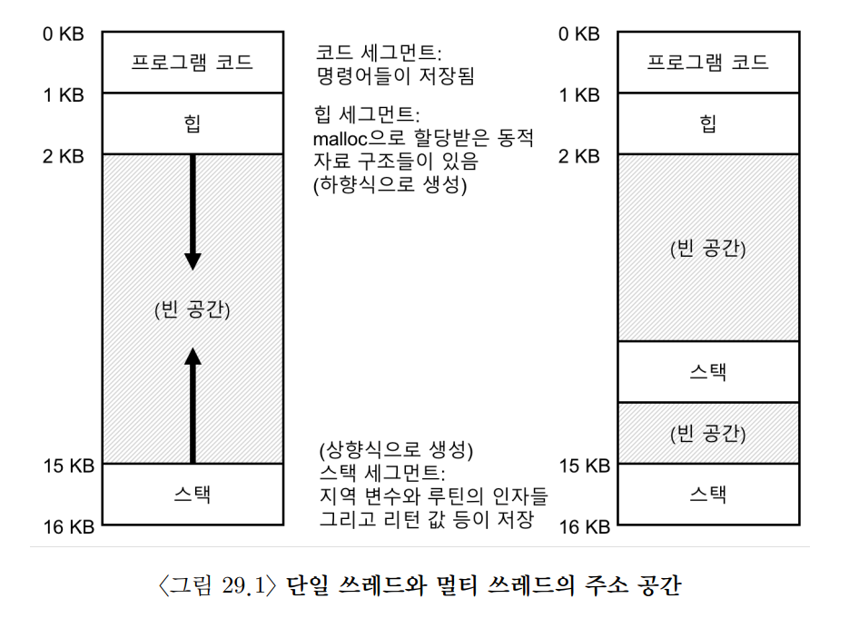
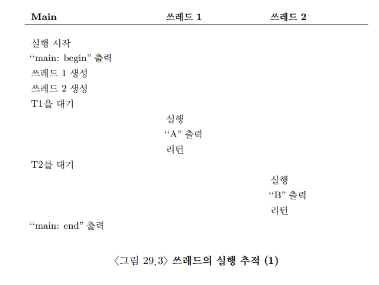
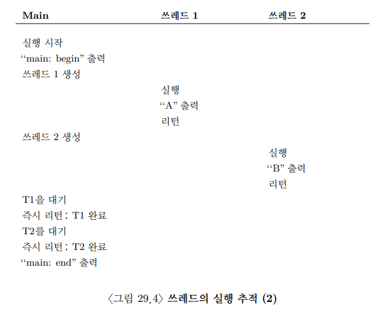
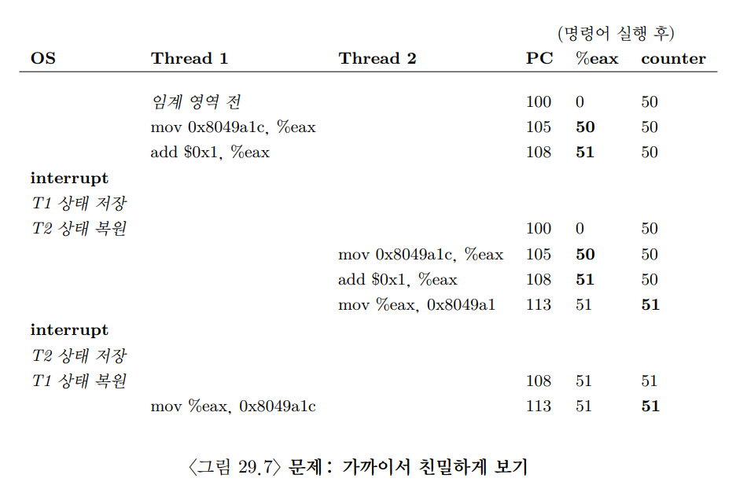
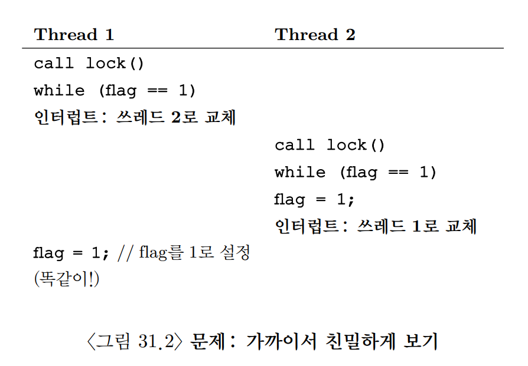
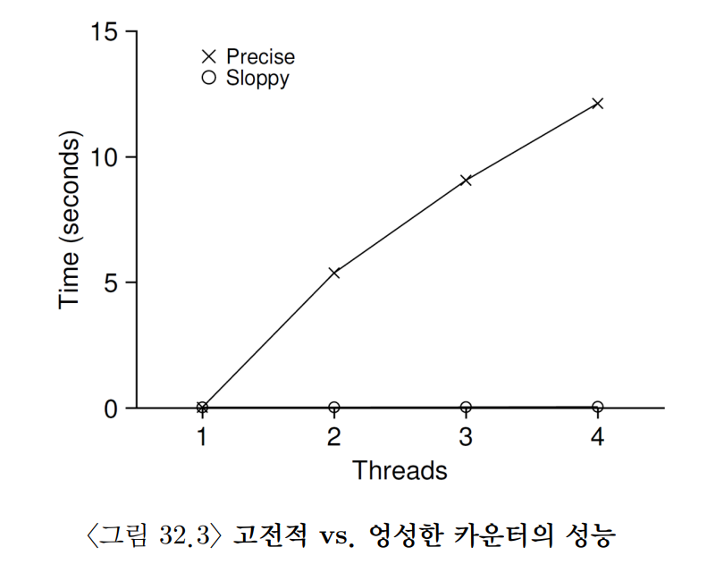
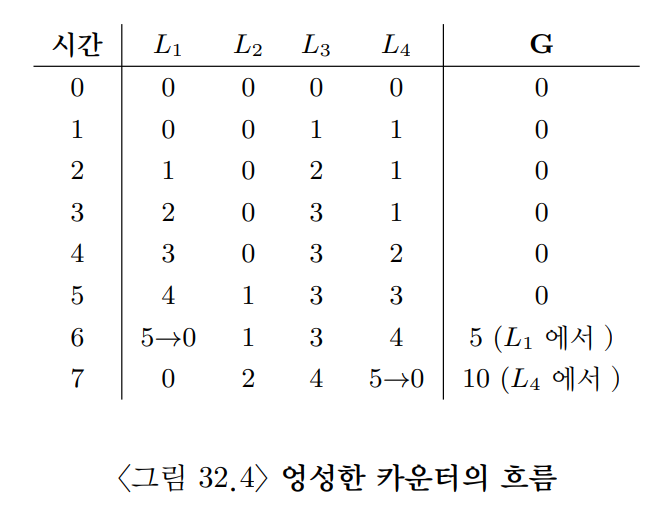
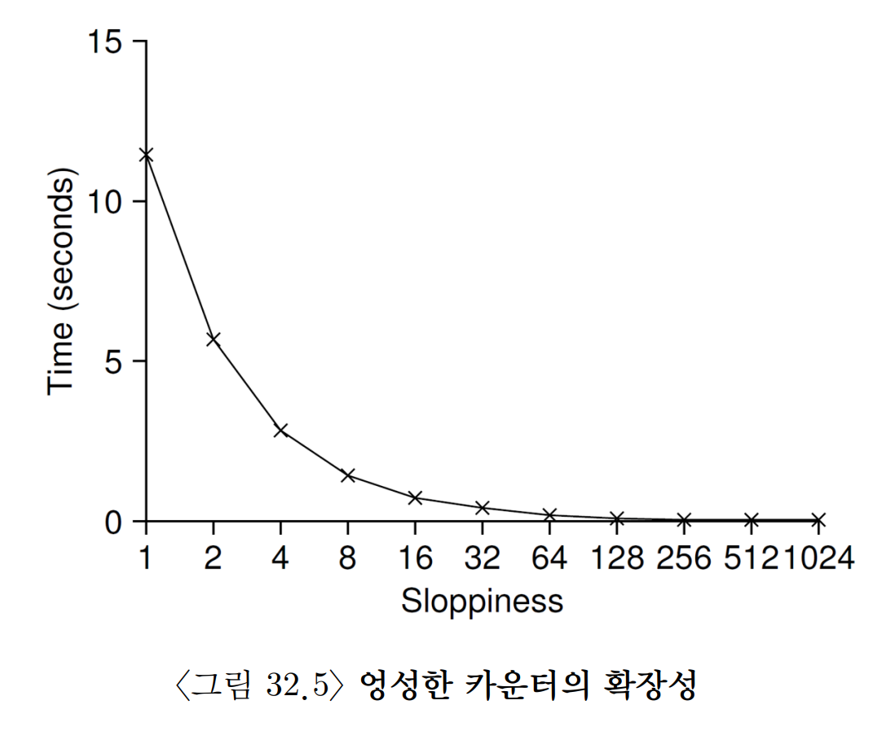
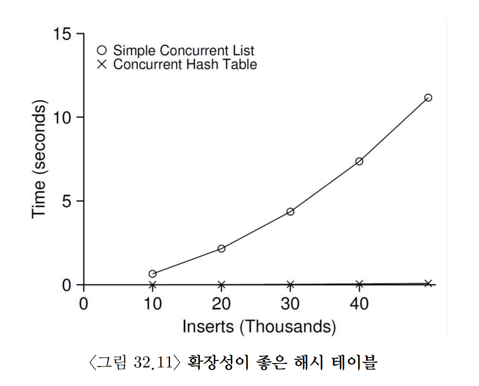

# 병행성(Concurrency)

## 29. 병행성: 개요

- `쓰레드(thread)`

    - 하나 이상의 실행 지점(독립적으로 불러 들여지고 실행될 수 있는 여러 개의 PC값)을 가지고 있다.

    - 각 쓰레드가 프로세스와 유사하지만, 쓰레드들은 주소 공간을 공유하기 때문에 동일한 값에 접근할 수 있다.

    - 쓰레드 간의 문맥 교환은 T1이 사용하던 레지스터들을 저장하고 T2가 사용하던 레지스터의 내용을 복원한다는 점에서 프로세스의 문맥 교환과 유사하다.

    - `쓰레드 제어 블럭(thread control block, TCB)`

        - 프로세스 상태를 저장하는 PCB와 마찬가지로 쓰레드들의 상태를 저장하기 위한 자료 구조

    - **프로세스와의 차이점**

        - 프로세스와 달리 쓰레드 간의 문맥 교환에서는 주소 공간을 그대로 사용한다.

        - 단일의 경우 스택이 하나만 있지만, 멀티일 경우 쓰레드마다 스택이 할당된다.

        
        <br>

        - **쓰레드-로컬 저장소(thread-local storage)** : 스택에 할당되는 변수, 매개변수, 리턴 값 등을 저장하는 쓰레드의 스택

### 29-1. 예제: 쓰레드 생성


<br>


<br>

- 쓰레드의 실행순서는 스케줄러에 따라 달라져서 보장되지 않는다.

### 29-2. 훨씬 더 어려운 이유: 데이터의 공유

- 쓰레드의 공유 변수를 통해 counter를 천만 번 반복해서 증가시키는 예제가 있다고 가정하자.

- 이를 2개의 쓰레드로 실행했을 때 기댓값은 2천만일 것이다.

```
1 prompt> ./main
2 main: begin (counter = 0)
3 A: begin
4 B: begin
5 A: done
6 B: done
7 main: done with both (counter = 19345221)
```

- 하지만 실제 실행 결과는 다르며, 실행할 때마다 결과값이 다르다.

### 29-3. 제어 없는 스케줄링

- counter 증가시키는 컴파일러 코드

```cpp
mov 0x8049a1c, %eax     // eax레지스터에 메모리 주소의 값 저장

add $0x1, %eax          // eax레지스터 값에 1(0x1) 더하는 연산

mov %eax, 0x8049a1c     // eax레지스터에 저장된 값을 메모리 원래 주소에 다시 저장
```

- 멀티 쓰레드 환경에서 실행 중 타이머 인터럽트 등의 이유로 실행 도중에 문맥 교환이 일어나면 증가시키는 코드가 2번 실행되도 1만 증가할 수 있다.


<br>

- 문맥 교환이 때에 맞지 않게 실행되는 운이 없는 경우 잘못된 결과를 얻게 된다.

    - `경쟁 조건(race condition)` : 명령어의 실행 순서에 따라 결과가 달라지는 상황

- `임계 영역(critical section)` : 공유 변수(자원)를 접근하고 하나 이상의 쓰레드에서 동시에 실행되면 안 되는 코드

    - 이런 임계 영역에는 **상호 배제** 가 필요하다.

        - `상호 배제(mutual exclusion)` : 하나의 쓰레드가 임계 영역 내의 코드를 실행 중일 때는 다른 쓰레드가 실행할 수 없도록 보장해주는 속성

### 29-4. 원자성에 대한 바람

- 임계 영역 문제에 대한 해결 방법 중 하나는 강력한 명령어 한 개로 의도한 동작을 수행하여, 인터럽트 발생 가능성을 차단하는 것이다.

    - **memory−add** : 메모리 상의 위치에 값을 더하는 명령어

- 그러나 하드웨어적으로는 `동기화 함수(synchronization primitives)` 구현에 필요한 것은 **memory−add** 와 같은 명령어가 아니라 **기본적인 명령어 몇 개** 이다.

### 29-5. 또 다른 문제: 상대 기다리기

- 실제로 하나의 쓰레드가 다른 쓰레드가 어떤 동작을 끝낼 때까지 대기해야 하는 상황도 빈번히 있다.

### 29-6. 정리: 왜 운영체제에서?

- 2개의 프로세스가 실행 중인 경우를 가정하자.

- 두 프로세스 모두 하나의 파일에 데이터를 덧붙이려고 한다면, 각각 새로운 블럭을 할당받고 블럭의 위치와 변경된 크기를 저장할 것이다.

    - 즉, 갱신하는 코드가 임계 영역이 된다.

- 이런 인터럽트가 발생하지 않도록 적절한 동기화 함수들을 사용하여 조심스럽게 다루어져야 한다.

> **여담: 원자적 연산(atomic operation)을 사용하자.**
> 
> 시스템 오류가 발생하더라도 올바르게 동작하기 위해선 원자적으로 상태를 전이시키는 것이 필수다.

## 30. 막간: 쓰레드 API

> **핵심 질문**  
> 쓰레드를 생성하고 제어하는 방법

### 30-1. 쓰레드 생성

```cpp
int pthread_create(..., // 처음 두 인자는  동일함
void * (*start_routine)(int) ,
void * arg);
```

### 30-2. 쓰레드 종료

```cpp
int pthread_join(pthread_t thread, void **value_ptr);
```

- 모든 멀티 쓰레드 코드가 조인 루틴을 사용하지는 않는다.

    - ex : 멀티 쓰레드 웹서버의 경우 여러 개의 작업자 쓰레드 생성하고 메인 쓰레드를 이용하여 요청을 받으면 작업자에게 전달하는 작업을 무한히 진행한다.

### 30-3. 락

```cpp
int pthread_mutex_lock(pthread_mutex_t *mutex);

int pthread_mutex_unlock(pthread_mutex_t *mutex);
```

- 락 코드를 호출했을 때 락이 풀려있다면 해당 쓰레드가 락을 얻어 임계 영역에 진입할 수 있다.

    - 락이 걸려있다면 해당 쓰레드는 락이 풀릴 때까지 대기한다.

- 주의점

    1. 올바른 값을 가지고 시작했다는 것을 보장하기 위해 모든 락은 초기화되야 한다.

    2. 락과 언락을 호출할 때는 에러 코드르 확인하지 않는다는 것을 인지하자.

### 30-4. 컨디션 변수

- 한 쓰레드가 계속 진행하기 전에 다른 쓰레드가 뭔가를 해야한다면 쓰레드 간의 시그널 교환 메커니즘이 필요하다.

- `컨디션 변수(condition variable)`

    - 컨디션 변수를 사용하기 위해선 반드시 `락(lock)`을 사용해야 한다.

        - 락을 통해 경쟁 조건이 발생하지 않는다는 것을 보장

    - 시그널 대기 함수는 호출 쓰레드를 재우는 것 외에 락도 반납해야한다.

        - 대기 함수는 반납한 뒤 깨어나서 리턴하기 직전에 락을 다시 획득한다.

    - 대기하는 쓰레드가 조건을 검사할 땐 **if문** 대신 **while문** 을 사용한다.

        - 간단한 플래그를 통해서 조건을 설정하면 안된다.

### 30-6. 요약

- 쓰레드에 대한 간단한 예시 코드를 설명하는 장이다. 간단하게 훑어보고 가면 된다.

> **여담: 쓰레드 API의 지침**
>
> 1. 간단하게 작성하라.
>
> 2. 쓰레드 간의 상호 동작을 최소로 하라.
>
> 3. 락과 컨디션 변수를 초기화하라.
>
> 4. 반환 코드를 확인하라.
>
> 5. 쓰레드 간에 인자를 전달하고 반환받을 때는 조심해야 한다.
>
> 6. 각 쓰레드는 개별적인 스택을 가진다.
>
> 7. 쓰레드 간에 시그널을 보내기 위해 항상 컨디션 변수를 사용하라.
>
> 8. 매뉴얼을 사용하라.

## 31. 락

### 31-1. 락: 기본 개념

- 락은 하나의 변수이므로 락을 사용하기 위해서는 락 변수를 먼저 선언해야 한다.

    - `락 변수`

        - **락의 상태**

            - 사용 가능(available)

            - 해제(unlocked) 또는 free

            - 사용 중(acquired)

        - 락 자료 구조에 락이 보유한 쓰레드에 대한 정보나 대기하는 쓰레드들에 대한 정보를 저장할 수 있다.

    - `lock()`

        - 락 획득을 시도하는 루틴

        - 어떤 쓰레드도 락을 갖고 잇지 않으면, 락을 획득하여 임계 영역에 진입

        - `락 소유자(owner)` : lock()을 호출해 락을 획득한 쓰레드

        - 락이 사용중이라면 다른 쓰레드가 lock()을 호출해도 리턴하지 않는다.

            - 이를 통해 임계 영역에 진입한 상태엔 다른 쓰레드들이 임계 영역에 진입할 수 없다.

    - `unlock()`

        - 락 소유자가 호출하면 락이 다시 사용 가능 상태가 된다.

        - 대기 쓰레드가 있다면 해당 스레드가 락을 획득해 임계 영역에 진입한다.

        - 대기 쓰레드가 없다면 그대로 사용 가능 상태를 유지한다.

- 락은 프로그래머에게 스케줄링에 대한 최소한의 제어권을 제공한다.

- 락을 통해 프로세스들의 혼란스런 실행 순서에 어느 정도 질서를 부여할 수 있다.

### 31-2. Pthread 락

- `mutex` : **상호 배제(mutual exclusion)** 에서 이름을 따온 POSIX 라이브러리의 락

    - `상호 배제(mutual exclusion)` : 한 쓰레드가 임계 영역 내에 잇다면 이 쓰레드의 동작이 끝날 때까지 다른 쓰레드가 임계 영역에 들어 올 수 없도록 제한

- POSIX 방식에서는 변수 명을 지정해 락을 여러 개 사용할 수 있다. (=세밀한 락 사용 전략)

    - `거친(coarse-grained) 락 사용 전략`

        - 하나의 락이 임의의 임계 영역에 진입할 때마다 사용되는 전략

    - `세밀한(fine-grained) 락 사용 전략`

        - 서로 다른 데이터와 자료 구조를 보호하기 위해 여러 락을 사용하여 한 번에 여러 쓰레드가 서로 다른 락으로 보호된 코드 내에 진입 가능하도록 하는 전략

### 31-3. 락 구현

> **핵심 질문**  
> 락은 어떻게 만들까

- 락은 하드웨어와 운영체제의 도움이 필요하다.

### 31-4. 락의 평가

- **락의 평가하는 기준**

    1. **상호 배제** 를 제대로 지원하는가
    
        - 락이 동작하여 임계 영역 내로 다수의 쓰레드가 진입을 막을 수 있는지 검사해야 한다.

    2. **공정성**

        - 쓰레드들이 락 획득에 대한 공정한 기회가 주어지는가

    3. **성능**

        - 경쟁이 전혀 없는 경우의 성능

            - 락을 획득하고 해제하는 과정에서 발생하는 부하

        - 여러 쓰레드가 락을 획득하려고 경쟁할 때의 성능

        - 멀티 CPU 상황에서 락 경쟁 시 성능

### 31-5. 인터럽트 제어

- 초창기 단일 프로세스에선 상호 배제 지원을 위해 임계 영역 내에서는 **인터럽트를 비활성화하는 방법** 을 사용

    - 인터럽트를 막음으로 임계 영역 내 코드가 원자적으로 실행 가능

    - **장점**

        - 단순하다

        - 코드 실행 중 다른 쓰레드가 중간에 끼어들지 않는다고 보장

    - **단점**

        - 요청을 하는 쓰레드가 **특권(privileged) 연산** 을 실행할 수 있도록 허가해야한다.

            - 프로세스를 독점하거나 무한 반복문으로 들어가면 운영체제가 제어권을 다시 얻을 수 없다.

        - 멀티프로세서에서는 적용이 불가능

        - 중요한 인터럽트 시점을 놓칠 수 있다.

            - ex : CPU가 저장 장치에서 읽기 요청을 마친 사실을 모르고 지났을 경우

        - 인터럽트를 비활성화하는 코드는 느리게 실행되는 경향이 있어 비효율적이다.

    - 일부에서만 사용가능하다.

        - ex : 운영체제가 내부 자료 구조에 대한 원자적 연산을 할 때

### 31-6. Test-And-Set (Atomic Exchange)

```cpp
// 간단한 플래그 변수로 락 구현

typedef struct _ _lock_t { int flag; } lock_t;

void init(lock_t *mutex) {
    // 0 -> 락 사용가능. 1 -> 락 사용중
    mutex->flag = 0;
}
void lock(lock_t *mutex) {
    while (mutex->flag == 1) // flag 변수를 검사(Test)
    ; // spin−wait (do nothing)
    mutex->flag = 1; // 설정(Set)
}
void unlock(lock_t *mutex) {
    mutex->flag = 0;
}
```

- 만약 쓰레드가 임계 영역 내에 있을 때 다른 쓰레드가 lock()을 호출한다면?

    - while 문으로 **spin_wait** 하며 쓰레드의 락이 해제되길 기다린다.

    - 쓰레드가 초기화하면 대기하던 쓰레드가 진입한다.

- **단점**

    - 정확성

        
        <br>

        - 인터럽트가 발생하면 두 플래그 모두 1로 설정하는 경우가 생길 수 있다. (`상호 배제 제공 실패`)

    - 성능

        - **spin-wait** 방법은 플래그 값을 무한히 검사해, 다른 쓰레드가 락을 해제할 때까지 시간을 낭비한다.

### 31-7. 진짜 돌아가는 스핀 락의 구현

```cpp
// TestAndSet의 동작
int TestAndSet(int *old_ptr, int new) {
    int old = *old_ptr; // old_ptr 의 이전 값을 가져옴
    *old_ptr = new; // old_ptr 에 'new'의 값을 저장함
    return old; // old의 값을 반환함
}
```

- `test and set`라고 부르는 이유는 이전 값을 검사하는 동시에 메모리에 새로운 값을 설정하기 때문이다.

- 핵심은 동작들이 원자적으로 수행된다는 것이다.


```cpp
typedef struct __lock_t {
    int flag;
} lock_t;

void init(lock_t *lock) {
    // 0은 락이 획득 가능한 상태, 1은 락을 획득했음을 표시
    lock−>flag = 0;
}

void lock(lock_t *lock) {
    while (TestAndSet(&lock−>flag, 1) == 1); // 스핀(아무 일도 하지 않음)
}

void unlock(lock_t *lock) {
    lock−>flag = 0;
}
```

- 스핀 락

    - 가장 기초적인 형태의 락으로, 락을 획득할 때까지 CPU 사이클을 소모하면서 회전한다.

    - 단일 프로세서에서 사용 시 선점형 스케줄러를 사용하여야 한다.

        - 선점형이 아니면 while문이 회전하며 대기하는 쓰레드가 CPU를 영원히 독점해서 사용이 불가능하다.

### 31-8. 스핀 락 평가

- 락에서 중요한 항목

    - 상호 배제의 정확성

    - 공정성

        - 대기 중인 쓰레드들에 있어서 스핀 락은 얼마나 공정한가?

            - 스핀 락은 어떠한 공정성도 보장해줄 수 없다.

    

    - 성능

        - 스핀 락을 사용할 때 지불해야 하는 비용은 무엇인가?
        
            - 상황의 가정

            1. 단일 프로세서를 사용할 때 락을 획득하기 위해 경쟁하는 경우

                - 스케줄러는 락을 획득하려고 시도하는 나머지 쓰레드들을 하나씩 깨운다.

                - 이 과정에서 스핀 락은 성능 오버헤드가 상당히 클 수 있다.

            2. 여러 프로세서에 쓰레드가 퍼져 있는 경우 

                - 임계 영역의 구간이 매우 짧다고 하면 하나의 CPU에 락이 걸리더라도 다른 CPU에서 락을 곧 획득 가능한 상태가 될 것이다.

                - 이 과정에서 스핀 락은 그렇게 많은 사이클을 낭비하지 않기 때문에 효율적이다.

### 31-9. Compare-And-Swap

```cpp
// Compare-And-Swap 의사코드
int CompareAndSwap(int *ptr났 int expected났 int new) {
    int actual = *ptr;
    if (actual == expected)
        *ptr = new;
    return actual;
}
```

- `Compare-And-Swap` 기법의 기본 개념은 ptr이 가리키고 있는 주소의 값이 expected 변수와 일치하는지 검사하는 것이다.

- Compare-And-Swap 방법을 사용하면 Test-And-Set 방법과 같은 방식으로 락을 만들 수 있다.

- CompareAndSwap 명령어는 TestAndSet 명령어보다 더 나은 성능을 제공한다.

    - 대기없는 동기화(wait_free synchronization)에서 이 루틴이 갖는 능력이 있다.

### 31-10. Load-Linked 그리고 Store-Conditional

- 어떤 플랫폼은 임계 영역 진입 제어 함수를 제작하기 위한 명령어 쌍을 제공한다.

    - `load-linked`와 `store-conditional` 명령어를 앞뒤로 사용하여 락이나 기타 병행 연산을 위한 자료 구조를 만들 수 있다.
    
```cpp
// Load-Linked 와 Store-Conditional 의사코드
// 메모리 값 레지스터에 저장
int LoadLinked(int *ptr) {
    return *ptr;
}

int StoreConditional(int *ptr, int value) {
    if (no one has updated *ptr since the LoadLinked to this address) {
        *ptr = value;
        return 1; // 성공
    } else { 
        return 0; // 실패
    }
}
```

```cpp
void lock(lock_t *lock) {
    while (1) {
        while (LoadLinked(&lock−>flag) == 1)
        ; // 0이 될 때까지 스핀
        if (StoreConditional(&lock−>flag, 1) == 1) 
            return; // 1로 변경하는 것 성공 : 완료
                    // 아니라면 : 처음부터 다시 시도
    }
}

void unlock(lock_t *lock) {
    lock−>flag = 0;
}
```

- store-conditional 명령어를 시도하기 전에 쓰레드가 인터럽트에 걸렸고 다른 쓰레드가 락 코드를 호출해 0을 반환 받은 후를 가정하자.

    - 이 시점에서 두 쓰레드는 모두 load-linked 명령어를 실행하였고 각자 store-conditional을 호출하려는 상황이다.

    - 이 떄 두 번쨰로 실행하는 쓰레드는 락 획득을 실패하고 다음 기회를 기다려야 한다.

        - flag의 값을 갱신하였기 때문이다.

### 31-11. Fetch-And-Add

- `Fetch-And-Add` : 원자적으로 특정 주소의
예전 값을 반환하면서 값을 증가시킨다.

```cpp
int FetchAndAdd(int *ptr) {
    int old = *ptr;
    *ptr = old + 1;
    return old;
}

// 티켓 락
typedef struct _ _lock_t {
    int ticket;
    int turn;
} lock_t;

void lock_init(lock_t *lock) {
    lock−>ticket = 0;
    lock−>turn = 0;
}

void lock(lock_t *lock) {
    int myturn = FetchAndAdd(&lock−>ticket);
    while (lock−>turn != myturn)
    ; // 회전
}

void unlock(lock_t *lock) {
    FetchAndAdd(&lock−>turn);
}
```

- 한 쓰레드가 myturn == turn 이라는 조건에 부합하면 그 쓰레드가 임계 영역에 진입할 차례인 것이다.

- 해법의 차이

    - 모든 쓰레드들이 각자의 순서에 따라 진행한다는 것

    - 쓰레드가 티켓 값을 할당받음으로 어느정도 스케줄되어 있다는 것을 의미

### 31-12. 요약: 과도한 스핀

- 여태 소개했던 하드웨어 기반의 락은 간단하고 제대로 동작한다.

- 그러나 모종의 이유로 계속 회전을 하게 되면 낭비가 발생한다.

> **핵심 질문**  
> 회전을 피하는 방법

### 31-13. 간단한 접근법: 무조건 양보!

- 하드웨어 지원을 받아 많은 부분을 해결했다.

- `문제점` : 문맥 교환이 되어 쓰레드가 실행되었지만 이전 쓰레드가 인터럽트에 걸리기 전에 락을 이미 획득한 상태라서 그 쓰레드가 락을 해제하기를 기다리며 스핀만 무한히 하는 경우

- `가장 단순한 방법` : 스핀하는 경우 자신에게 할당된 CPU를 다른 쓰레드에게 **무조건 양보** 하는 방법

```cpp
// 양보 예시
void init() {
    flag = 0;
}

void lock() {
    while (TestAndSet(&flag, 1) == 1)
    yield(); // CPU 양보
}

void unlock() {
    flag = 0;
}
```

- `운영체제의 yield() 기법`이랑 유사하다.

- 멀티 환경에서 RR 스케줄러를 사용하는 경우라면 락을 갖지고 있는 쓰레드가 다시 실행되기까지 N-1 번의 문맥 교환 비용이 발생한다.

### 31-14. 큐의 사용: 스핀 대신 잠자기

- 어떤 쓰레드가 다음으로 락을 획득할지를 명시적으로 제어할 필요가 있다.

    - 운영체제로부터 적절한 지원

    - 큐를 이용한 대기 쓰레드들의 관리

- **핵심**

    1. 앞서 배운 Test-And-Set 개념을 락 대기자 전용 큐와 함꼐 사용해 좀 더 효율적인 락을 만든다.

    2. 큐를 사용하여 다음으로 락을 획득할 대상을 제어, 기아 현상을 회피한다.

- Solaris 방법 인용

    - `park()` : 호출하는 쓰레드를 재우는 함수

    - `unpark(threadID)` : threadID로 명시된 특정 쓰레드를 꺠우는 함수

```cpp
typedef struct _ _lock_t {
    int flag;
    int guard;
    queue_t *q;
} lock_t;

void lock_init(lock_t *m) {
    m−>flag = 0;
    m−>guard = 0;
    queue_init(m−>q);
}

void lock(lock_t *m) {
    while (TestAndSet(&m−>guard, 1) == 1)
    ; // 회전하면서 guard 락을 획득
    if (m−>flag == 0) {
        m−>flag = 1; // 락 획득
        m−>guard = 0;
    } else {
        queue_add(m−>q, gettid());
        setpark();
        m−>guard = 0;
        park();
    }
}

void unlock(lock_t *m) {
    while (TestAndSet(&m−>guard났 1) == 1)
    ; // 회전하면서 guard 락을 획득
    if (queue_empty(m−>q))
        m−>flag = 0; // 락을 포기: 누구도 락을 원치 않음.
    else
        unpark(queue_remove(m−>q)); // 락 획득(다음 쓰레드를 위해)
    m−>guard = 0;
}
```

- 회전 대기를 완전히 배제하진 못했지만, 대기 시간을 대폭 줄였다.

- 락을 획득할 수 없다면, 쓰레드 ID를 큐에 추가 후 guard 변수를 0으로 설정한 뒤 CPU를 양보한다.

- 락을 소유한 쓰레드가 자체적으로 락을 해제해버리면, park()를 수행해 꺠어날 방법이 없다.

    - 이 문제를 해결하기 위해 park() 호출 직전에 `setpark()`를 추가해 해결했다.

        - `setpark()` : park()가 실제로 호출되기 전에 다른 쓰레드가 unpark()를 먼저 호출한다면 park()는 바로 리턴이 된다.

### 31-15. 다른 운영체제, 다른 지원

- 다른 운영체제들에서의 유사한 기능

    - Linux : futex

        - 각 futex는 특정 물리 메모리 주소와 연결, 커널 내부의 큐를 갖고 있다.

        - 호출자는 futex를 호출하여 필요에 따라 잠을 자거나 꺠어날 수 있다.

        - futex의 2가지 명령어

            - `futex_wait(address, expected)` : address 값과 expected 값이 동일한 경우, 쓰레드를 잠재운다.

            - `futex_wake(address)` : 큐에서 대기하고 있는 쓰레드 하나를 깨운다.

### 31-16. 2단계 락

- `2단계 락` : Linux 기법으로 락이 곧 해제될 것 같은 경우라면 회전 대기가 유용할 수 있다는 것에서 착안.

    - 곧 락을 획득할 수 있을 것이라는 기대로 회전하며 기다린다.

    - 만약 첫 회전에서 락을 획득하지 못하면, 2번째 단계로 진입하여 호출자는 잠에 빠지고 락이 해제된 후에 꺠어나도록 한다.

    - 한 번만 회전하기에 비용이 싸게 먹힐 수 있다.

## 32. 락 기반의 병행 자료 구조

> **핵심 질문**  
> 자료 구조에 락을 추가하는 방법

### 32-1. 병행 카운터

- **간단하지만 확장성이 없음**

    ```cpp
    // 락이 있는 카운터
    typedef struct _ _counter_t {
        int value;
        pthread_mutex_t lock;
    } counter_t;

    void init(counter_t *c) {
        c−>value = 0;
        Pthread_mutex_init(&c−>lock, NULL);
    }

    void increment(counter_t *c) {
        Pthread_mutex_lock(&c−>lock);
        c−>value++;
        Pthread_mutex_unlock(&c−>lock);
    }

    void decrement(counter_t *c) {
        Pthread_mutex_lock(&c−>lock);
        c−>value−−;
        Pthread_mutex_unlock(&c−>lock);
    }

    int get(counter_t *c) {
        Pthread_mutex_lock(&c−>lock);
        int rc = c−>value;
        Pthread_mutex_unlock(&c−>lock);
        return rc;
    }
    ```

    - **가장 간단하고 기본적인 병행 자료 구조의 보편적인 디자인 패턴을 따른다.**

        - 자료구조를 조작하는 루틴을 호출할 때 락을 추가

        - 호출문이 리턴될 때 락이 해제되도록 구현

    - **성능**

        
        <br>

- **확장성 있는 카운팅**

    - 확장 가능한 카운터가 없으면 Linux의 몇몇 작업은 멀티코어 기기에서 심각한 확장성 문제를 겪을 수 있다.

    - `엉성한 카운터(sloppy counter)`

        - 하나의 논리적 카운터로, CPU 코어마다  하나의 물리적인 `지역 카운터`와 `전역 카운터`로 구성되어 있다.

        - 카운터 외에 지역 카운터와 전역 카운터를 위한 락이 존재한다.

        - **개념**

            - 쓰레드는 지역 카운터를 증가시킨다.

            - 지역 카운터는 지역 락에 의해 보호된다.

            - 각 CPU는 저마다 지역 카운터를 갖기 때문에 쓰레드들은 지역 카운터를 경쟁 없이 갱신할 수 있다.

            - 쓰레드가 카운터 값을 읽을 수 있기 때문에 전역 카운터를 최신을 갱신해야 한다.

        - **최신 값 갱신 방법**

            - 전역 락을 사용

            - 지역 카운터의 값을 전역 카운터의 값에 더한다.

            - 그 지역 카운터의 값은 0으로 초기화한다.

            - `S(sloppiness)` : 지역에서 전역으로 값을 전달하는 빈도

                - S가 클수록 전역 값과 실제 값에 차이가 있으며, 작을수록 확장성 없는 카운터처럼 동작한다.
            
            
            <br>

            
            <br>

            - S 값이 낮다면 성능이 낮은 대신 전역 카운터의 값이 매우 정확해진다.

            - S 값이 크다면 성능은 탁월하겠지만 전역 카운터의 값은 CPU의 개수와 S의 곱만큼 뒤처지게 된다.

### 32-2. 병행 연결 리스트

- 삽입 연산이 병행하여 진행되는 상황에서 실패를 하더라도 락 해제를 호출하지 않으면서 삽입과 검색이 올바르게 동작하도록 수정할 수 있을까?

    - **해결방법**

        - 삽입 코드에서 임계 영역을 처리하는 부분만 락으로 감싸도록 코드 순서를 변경

        - 검색 코드의 종료는 검색과 삽입 모두 동일한 코드 패스를 사용하도록 할 수 있다.

        - 공유 리스트 갱신 때에만 락을 획득하면 된다.

- **확장성 있는 연결 리스트**

    - **문제** : 병행이 가능한 연결 리스트를 갖게 되었지만 확장성이 떨어진다.

    - **해결방법**

        - `hand-over-hand locking`, `lock coupling`

            - 전체 리스트에 하나의 락이 있는 것이 아니라 개별 노드마다 락을 추가하는 것

            - 리스트를 순회할 때 다음 노드의 락을 먼저 획득하고 지금 노드의 락을 해제하도록 한다.

    - 개념적으로 연산에 병행성이 높아지기 때문에 괜찮아 보이지만, 리스트 순회 시 각 노드에 락을 획득하고 해제하는 오버헤드가 크기 때문에 성능이 좋치 않다.

> **팁 : 병행성이 늘어난다고 더 빠른 것은 아니다.**
>    
> 락을 많이 추가하고 복잡도가 증가하면 큰 단점으로 다가온다.

> **팁 : 락과 제어 흐름을 경계하자**  
>
> 많은 함수들이 락 획득, 메모리 할당, 또는 상태를 변경하는 연산들을 실행하는 데 에러가 발생하면 리턴하기 전에 이전 상태로 복구해야 한다.  
>
> 이 과정에서 에러가 발생하기 쉽다.

### 32-3. 병행 큐

```cpp
typedef struct _ _node_t {
    int value;
    struct _ _node_t *next;
} node_t;

typedef struct _ _queue_t {
    node_t *head;
    node_t *tail;
    pthread_mutex_t headLock;
    pthread_mutex_t tailLock;
} queue_t;

void Queue_Init(queue_t *q) {
    node_t *tmp = malloc(sizeof(node_t));
    tmp−>next = NULL;
    q−>head = q−>tail = tmp;
    pthread_mutex_init(&q−>headLock, NULL);
    pthread_mutex_init(&q−>tailLock, NULL);
}

void Queue_Enqueue(queue_t *q, int value) {
    node_t *tmp = malloc(sizeof(node_t));
    assert(tmp != NULL);
    tmp−>value = value;
    tmp−>next = NULL;

    pthread_mutex_lock(&q−>tailLock);
    q−>tail−>next = tmp;
    q−>tail = tmp;
    pthread_mutex_unlock(&q−>tailLock);
}

int Queue_Dequeue(queue_t *q, int *value) {
    pthread_mutex_lock(&q−>headLock);
    node_t *tmp = q−>head;
    node_t *newHead = tmp−>next;
    if (newHead == NULL) {
        pthread_mutex_unlock(&q−>headLock);
        return −1; // ⒱a እᨕ ᯩᮭ
    }
    *value = newHead−>value;
    q−>head = newHead;
    pthread_mutex_unlock(&q−>headLock);
    free(tmp);
    return 0;
}
```

- 큐의 헤드와 테일에 사용되는 락이 있다.

- **목적** : 큐의 삽입과 추출 연산에 병행성을 부여

- 초기화 코드의 더미 노드 : 헤드와 테일 연산을 구분하기 위해 존재

- 큐는 멀티 쓰레드에 자주 사용되며, 큐가 비었거나 가득 찬 경우 쓰레드가 대기하도록 하는 기능이 필요하다.

### 32-4. 병행 해시 테이블

- 병행 리스트를 사용하여 구현

```cpp
#define BUCKETS (10)

typedef struct _ _hash_t {
    list_t lists[BUCKETS];
} hash_t;

void Hash_Init(hash_t *H) {
    int i;
    for (i = ; i < BUCKETS; i++) {
        List_Init(&H−>lists[i]);
    }
}

int Hash_Insert(hash_t *H, int key) {
    int bucket = key % BUCKETS;
    return List_Insert(&H−>lists[bucket], key);
}

int Hash_Lookup(hash_t *H, int key) {
    int bucket = key % BUCKETS;
    return List_Lookup(&H−>lists[bucket], key);
}
```

- **성능** : 전체 자료 구조에 하나의 락을 사용한 것이 아닌 **해시 버켓(리스트)** 마다 락을 사용하여서 병행성이 높고 효율적이다.


<br>

- 단일 락을 사용하는 연결 리스트에 비해 확장성 측면에서 효율이 매우 좋은 것을 알 수 있다.

### 32-5. 요약

- 락 획득과 해제 시 코드의 흐름에 주의해야 한다.

- 병행성 개선이 반드시 성능 개선으로 이어지는 것은 아니다.

- 성능 개선은 성능에 문제가 생길 경우에만 해결책을 강구해야 한다. ( **미숙한 최적화** )

## 33. 컨디션 변수

- 락만으로 병행 프로그램을 제대로 작성할 수 없다.

- 부모 쓰레드가 작업을 시작하기 전에 자식 쓰레드가 작업을 끝냈는지 어떻게 알 수 있을까?

    1. 공유 변수를 사용하는 방법

        - 제대로 동작은 하지만 부모 쓰레드가 회전하면서 CPU 시간을 낭비

    2. **부모 쓰레드가 특정 조건이 참이 될 때까지 잠자면서 기다리기**

> **핵심 질문** 
> 조건을 기다리는 법

### 33-1. 정의와 루틴들

- `컨디션 변수`

    - 일종의 큐 자료 구조 
    
    - 어떤 실행의 상태(또는 조건)가 원하는 것과 다를 떄 조건이 참이 되기를 기다리며 쓰레드가 **대기** 할 수 있는 큐

    - 다른 쓰레드가 상태를 변경시켰을 때, 대기중이던 쓰레드를 깨우고 계속 진행할 수 있도록 한다.

    - **2개의 연산**

        1. `wait()` : 쓰레드가 스스로를 잠재우기 위해 호출하는 연산

            - 락을 해제하고 호출한 쓰레드를 재우는 것

            - wait()에서 리턴하기 전에 락을 재획득해야 한다.

            - 쓰레드가 스스로를 재우려고 할 떄, 경쟁 조건의 발생을 방지하기 위해서 복잡하게 해야한다.

        2. `signal()` : 쓰레드가 무엇인가를 변경했기 때문에 조건이 참이 되기를 기다리며 **잠자고 있던 쓰레드를 깨울 떄 호출** 하는 연산

```cpp
// 컨디션 변수의 사용
int done = 0;
pthread_mutex_t m = PTHREAD_MUTEX_INITIALIZER;
pthread_cond_t c = PTHREAD_COND_INITIALIZER;

void thr_exit() {
    Pthread_mutex_lock(&m);
    done = 1;
    Pthread_cond_signal(&c);
    Pthread_mutex_unlock(&m);
}

void *child(void *arg) {
    printf("child\n");
    thr_exit();
    return NULL;
}

void thr_join() {
    Pthread_mutex_lock(&m);
    while (done == 0) {
        Pthread_cond_wait(&c, &m);
    }
    Pthread_mutex_unlock(&m);
}

int main(int argc, char *argv[]) {
    printf("parent: begin\n");
    pthread_t p;
    Pthread_create(&p, NULL, child, NULL);
    thr_join();
    printf("parent: end\n");
    return 0;
}
```


            


    


