# 영속성

## 39. I/O 장치

> **핵심 질문**  
> 어떻게 I/O를 시스템에 통합할까

### 39-1. 시스템 구조

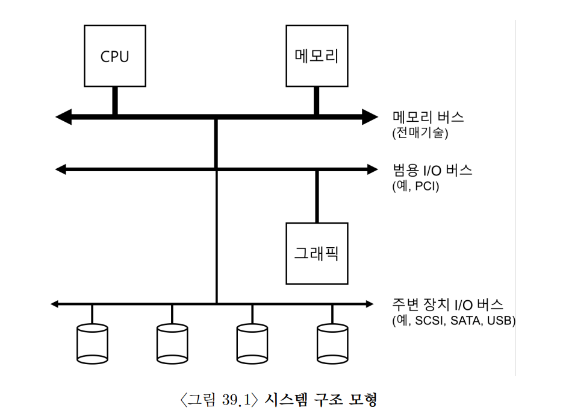
<br>

- CPU와 주메모리는 **메모리 버스** 로 연결되어 있다.

- 범용 I/O 버스에는 고성능 I/O 장치들이 연결된다.

- 주변 장치용 버스 : 디스크, 마우스와 같은 가장 느린 장치를 연결한다.

### 39-2. 표준 장치

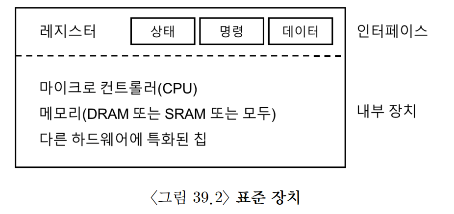
<br>

- **중요한 요소**

    - 하드웨어 인터페이스

        - 소프트웨어와 마찬가지로 하드웨어도 인터페이스를 제공해 시스템 소프트웨어가 동작을 제어할 수 있도록 해야 한다.

    - 내부 구조

        - 시스템에게 제공하는 장치에 대한 추상화를 정의하는 책임을 갖고 있다.

### 39-3. 표준 방식

- 표준 인터페이스 레지스터 구성

    - `상태(status)` : 장치의 현재 상태를 읽음.

    - `명령(command)` : 장치가 특정 동작을 수행하도록 요청

    - `데이터(data)` : 장치에 데이터를 보내거나 받거나 할 때 사용

- 장치가 운영체제 대신 특정 동작을 수행할 때의 상호 동작 과정

    - 반복적으로 장치의 상태 레지스터를 읽어서 명령의 수신 가능 여부를 확인

    - 운영체제가 데이터 레지스터에 어떤 데이터를 전달

        - **programmed I/O** : 데이터 전송에 메인 CPU가 관여되는 경우

    - 운영체제가 명령 레지스터에 명령어를 기록

    - 운영체제는 디바이스가 처리를 완료햇는지 확인하는 폴링 반복문을 돌면서 기다린다.

        - **폴링** : 장치가 동작을 완료하는 동안 계속 루프를 돌면서 장치상태를 체크하는 것.

> **핵심 질문**  
> 폴링 사용 비용을 어떻게 피하는가

### 39-4. 인터럽트를 이용한 CPU 오버헤드 개선

- 디바이스를 폴링하는 대신 운영체제는 입출력 작업을 요청한 프로세스를 블록 시키고 CPU에게 다른 프로세스에게 양도한다.

- 장치가 작업을 끝마치면 CPU는 운영체제가 미리 정의해둔 `인터럽트 서비스 루틴(interrupt service routine(ISR))` 또는 `인터럽트 핸들러(interrupt handler)`를 실행한다.

- 인터럽트를 활용하여 CPU 연산과 I/O를 `중첩`시키는 것도 핵심 방법 중 하나다.

- 인터럽트는 항상 최적의 해법이 아니라는 것을 유의해야 한다.

    - **하이브리드 방식** : 빠른 장치라면 폴링이 최선이고 느리다면 인터럽트를 사용하여 중첩하는 것이 최선이다.

- 인터럽트를 사용하지 않는 이유

    - 네트워크 환경 : 대량 요청을 처리할때 인터럽트만 처리하다가 운영체제가 요청을 처리할 수 없는 **무한반복(livelock)** 에 빠질 가능성이 있다.

- **병합(coalescing) - 인터럽트 기반의 최적화 기법**

    - CPU에 인터럽트를 전달하기 전에 잠시 대기

    - 대기하는 동안 들어오는 다른 인터럽트를 한번에 CPU에 전달

    - 인터럽트 처리의 오버헤드를 줄이는 효과를 얻을 수 있다.

    - 너무 오래 기다리면 요청에 대한 지연 시간이 늘어나니 절충점을 찾아야 한다.

### 39-5. DMA를 이용한 효율적인 데이터 이동

- 많은 양의 데이터를 디스크로 전달하는 작업에 CPU를 사용하면 CPU의 낭비가 발생한다.

> **핵심 질문**  
> 어떻게 PIO의 오버헤드를 줄이는가

- `직접 메모리 접근 방식(Direct Memory Access, DMA)`

    - DMA 엔진은 시스템 내에 있는 특수 장치로 CPU의 간섭없이 메모리와 장치 간의 전송을 담당

    - 동작방식

        - 데이터를 장치로 전송한다고 했을 때 운영체제는 DMA 엔진에 전송할 데이터의 위치, 크기, 대상 장치를 프로그램

        - DMA 동작이 끝나면 DMA 컨트롤러가 인터럽트를 발생시켜 전송이 완료됐음을 운영체제에 알림

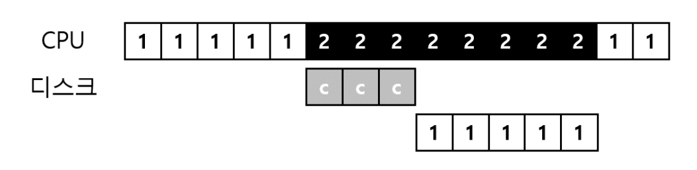
<br>

### 39-6. 디바이스와 상호작용하는 방법

> **핵심 질문**  
> 어떻게 장치와 통신하는가

- 장치와 운영체제가 통신하는 방법

    1. **I/O 명령** 을 명시적을 사용하는 방법

        - 운영체제가 특정 장치 레지스터에 데이터를 전송할 수 있는 방법을 제공

        - 대부분 특권 명령어로, 운영체제가 장치를 제어하는 역할을 한다.

    2. **memory mapped I/O**

        - 장치의 레지스터들이 마치 메모리 상에 존재하는 것처럼 만드는 것.

        - 하드웨어는 운영체제 명령어(load/store)를 주 메모리가 아닌 장치로 연결되도록 한다.

            - 메모리 주소 중 일부를 주변 장치의 레지스터와 매핑시켜 해당 장치로 바로 접근하는 방법

### 39-7. 운영체제에 연결하기: 디바이스 드라이버

> **핵심 질문**  
> 어떻게 장치 중립적인 운영체제를 만드는가

- **해법**

    - **추상화(abstraction)**

        - **디바이스 드라이버(device driver)** : 장치와의 상세한 상호작용을 캡슐화

        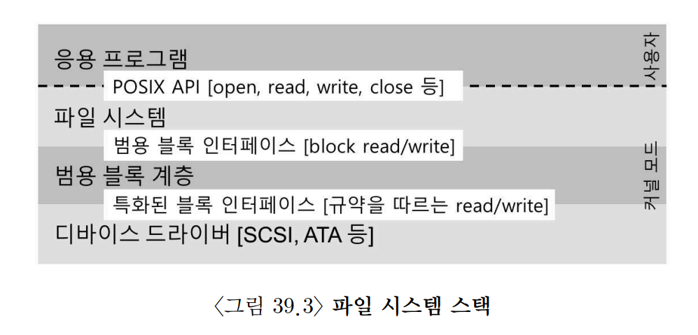
        <br>

        - 디바이스 드리아버는 특정 요청을 장치에 내리기 위해 필요한 일을 처리한다.

        - **단점**

            - 장치에 특수 기능이 달려있다고 해도 범용 인터페이스에 없다면 해당 기능은 사용할 수 없다.

            - 장치에 맞춰 디바이스 드라이버가 필요하기 때문에 커널 코드의 대부분을 디바이스 드라이버 코드가 차지한다.

            - 드라이버 대부분이 커널 전문가가 아닌 사람들이 만들기 때문에 상당한 버그를 포함하고 있다.

### 39-8. 사례 연구: 간단한 IDE 디스크 드라이버

- **IDE 디스크가 제공하는 4개의 레지스터 인터페이스**

    - Control

    - Command block

    - Status

    - Error

- **장치와 상호작용하기 위한 기본 방식**

    - **장치가 준비될 때까지 대기** : 드라이버가 Ready 상태가 될 때까지 Status 레지스터 읽기

    - **Command 레지스터에 인자 값 쓰기** : 섹터 수, 접근할 섹터들의 논리 블럭 주소, 드라이브 번호를 Command 레지스터에 기록

    - **I/O 시작** : Command 레지스터에 읽기/쓰기

    - **(쓰기의 경우) 데이터 전송** : 드라이브 상태가 Ready고 DRQ(drive request for data)일 때까지 대기. 데이터 포트에 데이터 기록

    - **인터럽트 처리** : 각 섹터가 전송되었을 때마다 인터럽트 처리, 혹은 일괄처리해서 모든 전송이 완료했을때 한 번만 인터럽트를 발생

    - **에러 처리** : 각 동작 이후 Status 레지스터 읽기. ERROR 비트가 설정되어있다면 상세 정보 확인

- 대부분의 프로토콜은 4개의 기본 함수로 동작

    - **ide_rw()** : 요청을 큐에 삽입

    - **ide_start_request()** : 요청(쓰기의 경우 데이터도 함께)을 디스크로 전달

    - **ide_wait_ready()** : 요청을 명령하기 전에 드라이브가 준비되었는지 확인

    - **ide_intr()** : 인터럽트가 발생했을 때 호출

        - 장치에서 데이터를 데이터를 읽고 I/O가 종료되기를 기다리는 프로세스 진행

## 40. 하드 디스크 드라이브

> **핵심 질문**  
> 디스크에 있는 데이터를 어떻게 저장하고 접근하는가

### 40-1. 인터페이스

- 드라이브는 많은 수의 섹터(512byte 블럭)들로 이루어져 있다.

    - 섹터들은 0~n-1까지의 논리 블럭 주소(LBA)를 부여받는다.

    - 디스크를 섹터들의 배열로 볼 수 있으며 섹터는 드라이브의 **주소 공간** 이 된다.

- 드라이브는 하나의 512 byte 쓰기만 원자적이라고 보장한다.

- 전력 손실과 같은 예외 상황에선 대량의 쓰기 중 일부만 완료될 수 있다.(= **찢긴 쓰기(torn write)** )

- 디스크 드라이브의 계약 불문율

    - 드라이브의 주소 공간에서 가깝게 배치된 두 개의 블럭을 접근하는 것은 멀리 떨어진 블럭을 접근하는 것보다 빠르다.

    - 연속적인 청크의 블럭을 접근하는 것이 가장 빠르다.

### 40-2. 기본 구조

- **디스크의 주요 요소**

    - 플래터(platter)

        - 2개의 표면을 갖고 있으며, 드라이브의 전원이 나가더라도 데이터를 드라이브에 영구 저장하기 위해 얇은 자성층이 입혀져 있다.

    - 회전축(spindle)

        - 플래터를 일정한 속도로 회전시키는 축

        - 일반적으로 7200 RPM ~ 15000 RPM 으로 돈다.

    - 트랙(track)

        - 디스크의 동심원(트랙)을 따라 배치되어 있는 섹터들 위에 데이터가 부호화된다.

    - 디스크 헤드(disk head)

        - 표면을 읽거나 쓸때 사용하는 기계적 장치

    - 디스크 암(disk arm)

        - 디스크 헤드와 연결된 것으로 헤드가 원하는 트랙 위로 위치하도록 이동시킨다.

### 40-3. 간단한 디스크 드라이브

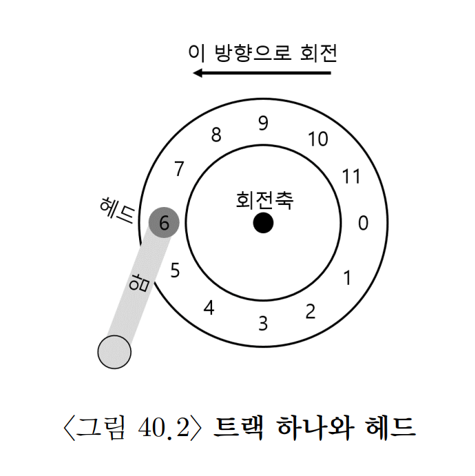

- 디스크 헤드를 통해 섹터에 접근하며, 표면은 시계 반대 방향으로 회전한다.

- **단일 트랙 지연 시간: 회전 지연**

    - `회전 지연(rotation delay)`

        - 디스크 헤드 아래에 원하는 섹터가 위치하기를 기다리는 것

- **멀티 트랙: 탐색 시간**

    - `탐색(seek)`

        - 드라이브가 지정된 섹터들을 접근하는 방식

        - 읽기 요청을 처리하기 위해 디스크 암을 올바른 트랙 위에 위치시키는 것

        - 회전과 더불어 가장 비싼 디스크 동작

    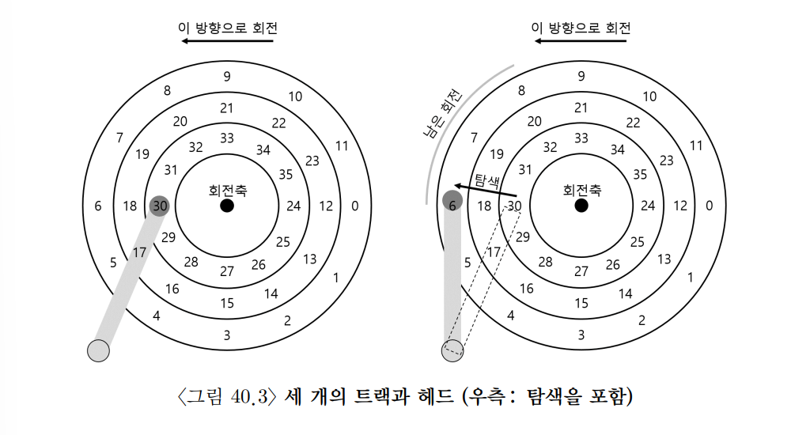
    <br>

- **그 외의 세부 사항**

    - `트랙 비틀림(track skew)`

        - 트랙의 경계를 지나서 순차적으로 존재하는 섹터들을 읽기 위한 기술

        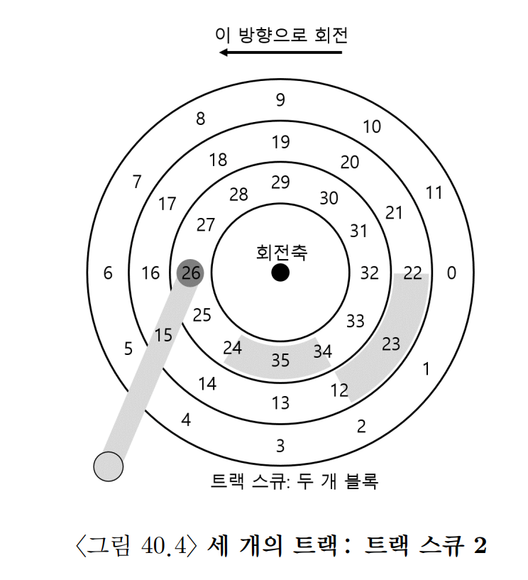
        <br>

    - `멀티 구역(multi-zoned) 디스크 드라이브`

        - 바깥 측 트랙들이 안쪽 트랙들보다 더 많은 섹터들을 갖고 있는 디스크

    - `캐시(cache)`, `트랙 버퍼(track buffer)`

        - 일반적으로 8MB, 16MB 정도의 메모리로 디스크에서 읽거나 쓴 데이터를 보관하는 데 사용

        - 같은 섹터에 대한 요청을 빠르게 응답할 수 있다.

        - 쓰기의 경우 선택할 수 있다

            - **write-back** : 메모리에 데이터가 기록된 시점에 쓰기가 완료했다고 판단

                - 정확성을 필요로 할 때 문제가 될 수 있다.

            - **write-through** : 디스크에 실제로 기록되었을 때를 완료라고 판단

### 40-4. I/O 시간 계산

- **I/O 시간식**

    $$T_{I/O} = T_{seek} + T_{rotation} + T_{transfer}$$

- **I/O 속도식**

    $$R_{I/O} = \frac{Size_{Transfer}}{T_{I/O}}$$

- 디스크 드라이브의 중요한 점

    - 랜덤 워크로드와 순차 워크로드의 드라이브 간 성능 차이는 크다.

    - 동일 금액에서 성능 위주와 용량 위주의 드라이브 간 성능 차이가 상당히 크다. 

### 40-5. 디스크 스케줄링

- 운영체제에서 **디스크 스케줄러** 는 요청을 조사하여 다음에 어떤 I/O를 처리할지 결정했다.

- 디스크 스케줄링의 경우 작업 스케줄링과 다르게 요청 작업이 얼마나 길지 예측할 수 있다.

- 때문에 디스크 스케줄러는 **SJF(shortest job first, 짧은 작업 우선)의 원칙** 을 최대한 따른다.

- **SSTF: 최단 탐색 시간 우선**

    - 초기 디스크 스케줄링 접근 방법

    - 트랙을 기준으로 I/O 요청 큐를 정렬하여 가장 가까운 트랙의 요청이 우선 처리되도록 한다.

    - **문제점**

        1. 드라이브 구조는 운영체제에 공개되지 않아 운영체제는 블럭들의 배열로만 인식한다.

            - 해법 : `가장 가까운 블럭 우선 방식(Nearest-block-first, NBF)`

                - 가장 가까운 블럭 주소에 접근하는 요청을 다음에 처리하도록 스케줄

        2. **기아 현상**

            - 안쪽 트랙에만 지속적으로 요청이 발생되면 다른 트랙에 있는 요청이 무시될 수 있다.

> **핵심 질문**  
> 디스크 요청의 기아 현상을 어떻게 처리할까

- **엘리베이터(SCAN 또는 C-SCAN)**

    - 트랙의 순서에 따라 디스크를 앞뒤로 가로지르며 요청을 서비스하는 알고리즘

    - `sweap` : 디스크를 한 번 가로지르는 것

    - 어떤 요청이 이번 스위프에 이미 지나간 트랙에 대해 들어온다면 다음 번 스위프에 처리되도록 큐에서 대기한다.

    - **C-SCAN(= Circular SCAN)**

        - 디스크를 한 방향으로만 스위프하고 원점으로 돌아온 뒤 반대 방향으로 스위프하는 알고리즘

    - SCAN 방식은 회전을 고려하지 않아 SJF의 원칙을 완전히 지킨다고 보기 어렵다.

> **핵심 질문**  
> 디스크 회전 비용을 고려하려면 어떻게 해야 할까

- **SPTF: 최단 위치 잡기 우선**

    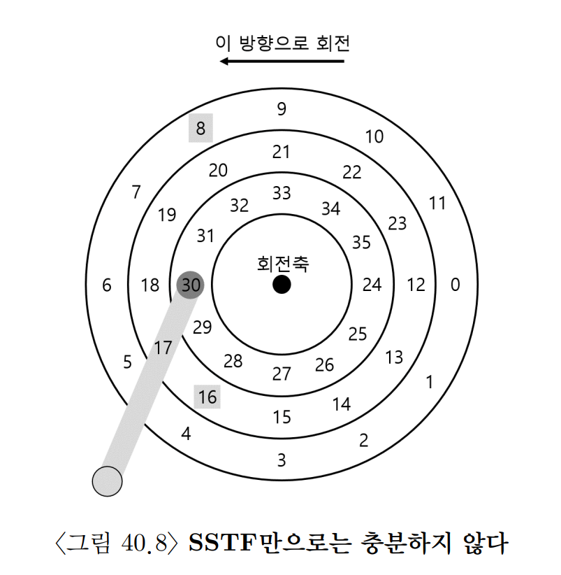
    <br>

    - 탐색에 걸리는 시간, 회전에 걸리는 시간, 요청 등 상황에 따라 빠르게 처리할 수 있는 방법이 다르다.

    - 트랙의 경계가 어디인지, 디스크 헤드가 어디 있는지 운영체제는 정확히 알 수 없기 때문에 SPTF를 구현하는 것은 어렵다.

- **다른 스케줄링 쟁점들**

    - 현대 시스템에서 디스크는 대기 중인 여러 요청들을 수용할 수 있으며, 내부 스케줄러를 자체적으로 갖고 있다.

    - 이를 통해 SPTF 방식을 정밀하게 구현할 수 있다.

        - 운영체제의 스케줄러는 최선이라고 보이는 몇 개의 요청으 디스크에 내려 보낸다.

        - 디스크는 트랙 배치 정보와 헤드 위치 정보를 통해 최선의 (SPTF)순서로 정렬한다.

    - **I/O 병합(I/O merging)**

        - 만약 디스크에서 연속된 섹터를 요구하는 요청이 있다면 2개의 요청을 병합해 2블럭 길이의 요청을 만든다.

    - 디스크로 I/O를 내려보내기 전 시스템은 얼마나 대기해야하나?

        - 작업 보전(work-conserving)

            - 처리할 요청이 있는 디스크를 유휴 상태가 되지 않도록 하는 방식

        - 작업 비보전(non-work-conserving)

            - 처리할 요청이 있는 디스크를 잠시 대기하는 방식

## 41. Redundant Array of Inexpensive Disk(RAID)

> **핵심 질문**  
> 대용량이면서 빠르고 신뢰할 수 있는 디스크를 어떻게 만들까

- **Redundant Array of Inexpensive Disk(RAID)**

    - 여러 개의 디스크를 조화롭게 사용하여 고속이면서 대용량의 신뢰할 수 있는 디스크 시스템

    - 외면적으로 하나의 디스크로 보인다.

    - **내부 구성 요소**

        - 여러 개의 디스크와 메모리

        - 시스템을 관리하기 위한 하나 이상의 프로세서

    - **장점**

        - 성능

            - 디스크 여러 개를 병렬적으로 사용해 I/O 시간이 크게 개선된다.

        - 용량

            - 더 많은 디스크 공간을 제공한다.

        - 신뢰성

            - 디스크 중 하나가 고장나도 **데이터 중복 기술(redundancy)** 덕분에 고장이 없는 것처럼 동작할 수 있다.

        - 투명성

            - 이러한 장점들을 시스템의 별다른 수정없이 바로 사용할 수 있다.

### 41-1. 인터페이스와 RAID의 내부

- 파일 시스템에선 단일 디스크와 마찬가지로 RAID를 선형적인 블록들의 배열로 보이며 각 블럭을 읽거나 쓸 수 있다.

- 파일 시스템이 논리적 I/O를 요청하면 내부에서 어떤 디스크를 접근해야 요청을 완료할 수 있는지 계산한 후, 하나 이상의 물리적 I/O를 발생시킨다.

- RAID의 내부

    - RAID의 작업을 지시하는 펌웨어

    - 펌웨어를 실행하는 마이크로 컨트롤러

    - 블럭을 읽고 쓸 때 버퍼로 사용할 휘발성 메모리

    - 패리티 계산을 위한 전용 논리 회로

### 41-2. 결함 모델

- RAID는 특정 결함을 파악하고 이를 복구하도록 설계되어있다.

    1. **고장 시 멈춤(fail-stop)** 결함 모델

        - 이 모델에서 디스크는 **정상 작동** , **멈춤** 둘중 하나의 상태로 존재한다고 가정.

        - RAID 컨트롤러는 디스크 고장 시 즉시 알 수 있다.
    
- 실제론 디스크 섹터 내용이 망가지거나 한 블럭만 접근할 수 없는 고장 같은것들도 존재한다.

### 41-3. RAID의 평가 방법

- **RAID 설계 평가**

    - **용량**

        - 중복 저장이 없는 경우 : 디스크 수 * 용량

        - 미러링의 경우 : (디스크 수 * 용량) / 2

        - 패리티 기반 : 그 사이의 값

    - **신뢰성**

        - 몇 개의 디스크 결함을 감내할 수 있는가?

    - **성능**

        - 디스크 배열이 처리해야 할 워크로드를 통해 평가

### 41-4. RAID 레벨 0: 스트라이핑

- 중복 저장을 하지 않아 RAID 레벨이라고 하기 어렵다.

- 블럭들을 여러 디스크에 걸쳐서 줄을 긋는 것처럼 저장한다.

- 이 접근법은 연속적인 청크에 대해 요청을 받았을때 병렬성을 가장 잘 활용할 수 있도록 설계됐다.

- `스트라이프(stripe)` : 같은 행에 있는 블럭들

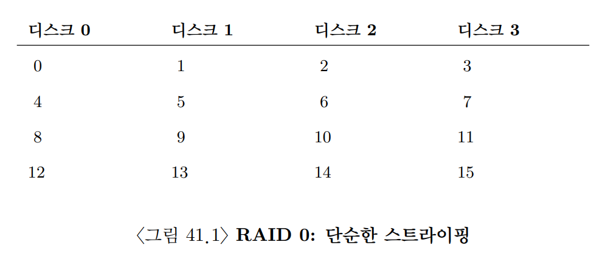
<br>

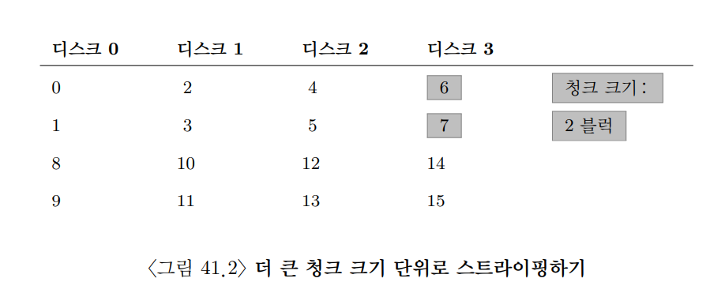
<br>

> **여담: RAID 매핑 문제**  
> - 논리 블록 주소 A를 통한 디스크, 오프셋 계산식(정수 계산)
>
>   Disk = A % number_of_disks  
>   Offset = A / number_of_disks

- **청크 크기**

    - 청크 크기를 줄이면 하나의 파일을 읽고 쓰는데 병렬성이 증가하게 된다.

        - 블럭의 위치를 여러 디스크에서 찾아야 하므로 **위치 찾기 시간** 이 늘어난다.

    - 반대로 청크 크기가 클 경우 병렬성이 줄어든다.

        - 대신 **위치 찾기 시간** 이 줄어든다.

- **RAID-0 분석으로 돌아가서**

    - 용량 : 디스크 수 * 용량이라 완벽하다.

    - 신뢰성 : 어느 디스크 하나라도 고장나면 전체 데이터가 손실되서 최악이다.

    - 성능 : 병렬로 사용자 I/O 요청을 처리할 수 있기 때문에 모든 디스크가 활용된다.

- **RAID의 성능 평가하기**

    - RAID 성능을 분석하기 위한 척도

        - 단일 요청의 지연 시간

        - RAID의 정상 상태에서의 처리 성능

            - **병행 요청의 전체적인 대역폭** 을 의미

    - 워크 로드의 유형

        - 순차 : 연속된 큰 청크의 형태로 요청

        - 랜덤 : 크기가 작은 요청으로 디스크의 여러 불특정 위치를 접근

    - 순차 접근은 랜덤 접근과 반대로 디스크에서 효율적으로 동작한다.

- **RAID-0 분석으로 또 다시 돌아가서**

    - 처리 성능

        - 순차 : $N \cdot S$ 
        
            ($N$ : 디스크 수, $S$ : 순차 접근 대역폭)

        - 랜덤 : $N \cdot R$  

            ($N$ : 디스크 수, $R$ : 랜덤 접근 대역폭)

### 41-5. RAID 레벨 1: 미러링

- 각 블럭에 대해서 하나 이상의 사본을 둔다.

- 각 사본은 서로 다른 디스크에 저장한다.

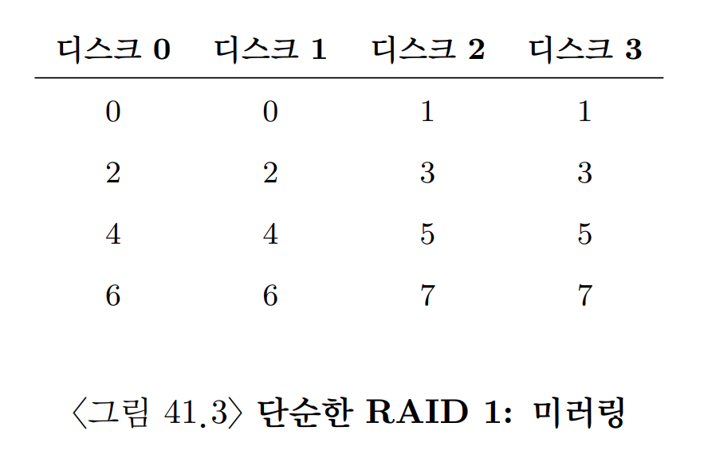
<br>

- 읽기 : RAID는 원본을 읽을 지 사본을 읽을 지 선택할 수 있다.

- 쓰기 : 신뢰성을 위해 원본과 사본 모두 갱신해야 한다.

    - 쓰기 요청은 병렬적으로 처리된다.

- **RAID-1 분석**

    - 용량
    
        - (디스크 수 * 용량) / 2

        - 원본과 사본을 저장하기 때문에 용량이 절반으로 줄어든다.

    - 신뢰성

        - 디스크 중 어느 것에서 고장이 발생하여도 괜찮다.

    - 성능

        - 단일 읽기 요청 지연 시간은 단일 디스크와 동일

        - 2개의 쓰기가 병렬적으로 수행되므로 평균적으로 단일 디스크 쓰기 시간보다 조금 더 길다.

    - 순차에서의 처리성능

        - 쓰기 : 항상 2번의 물리 쓰기가 요구되서 **최대 대역폭의 절반** 만 얻을 수 있다.

        - 읽기 : 최대 대역폭을 얻을 수 있을 거 같지만 쓰기와 마찬가지로 **절반** 만 얻을 수 있다.

            - 읽을 때 하나를 읽고 바로 다른 하나를 읽지 않고 하나 건너뛰고 읽는다.

    - 랜덤에서의 처리성능

        - 읽기 : 모든 디스크에 대해서 읽기를 요청할 수 있어서 최대 대역폭을 얻는다.

        - 쓰기 : 순차와 마찬가지로 두 번의 물리 쓰기가 요구되서 대역폭의 반만 얻을 수 있다.

### 41-6. RAID 레벨 4: 패리티를 이용한 공간 절약

- **패러티 기반의 접근 방법**

    - 저장 공간을 더 적게 사용

    - 성능이라는 비용을 지불

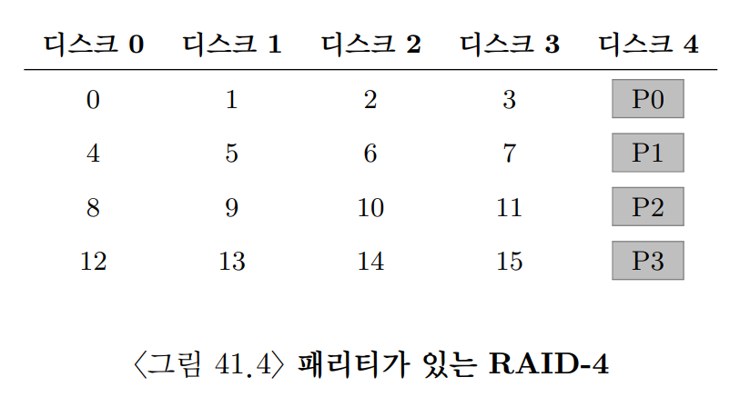
<br>

- 스트라이프마다 해당 스트라이프의 정보를 담고 있는 패리티 블럭을 하나 추가

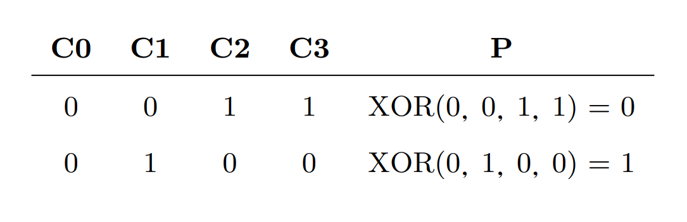
<br>

- **패리티의 불변량** : 어떤 줄이든 그 줄의 1의 개수는 **항상 짝수(0)** 이어야 한다.

    - 깨진 값의 복구 방법 : 불변량에 의거해서 디스크 하나가 깨지면 사라진 데이터 값을 알 수 있다.

    - 이는 각 디스크에 4KB 이상 블럭을 저장할 때도 동일하다.

- **RAID-4 분석**

    - 용량

        - (디스크 수 - 1) * 용량

    - 신뢰성

        - RAID-4는 오직 하나의 디스크 고장만 감내할 수 있다.

    - 성능

        - 순차에서의 처리성능

            - 읽기
            
                - (N-1) * S

            - 쓰기

                - `스트라이프 전부 쓰기(full-stripe write)`

                    - 패리티 블럭을 포함한 모든 블럭을 병렬로 쓰기

                - (N-1) * S

        - 랜덤에서의 처리성능

            - 읽기

                - (N-1) * R

            - 쓰기

                1. `가산적 패리티(additive parity)`

                    - 새로운 패리티 블럭 값을 계산하기 위해 스트라이프 내 다른 모든 데이터 블럭을 병렬적으로 읽고 **새로운 블럭과 함께 XOR연산** 을 수행

                    - 문제

                        - 디스크의 개수에 따라 계산의 양이 달라져 더 큰 RAID에선 많은 수의 읽기 연산이 필요하다.

                2. `감산적 패리티(subtractive parity)`

                    - **감산적 방식의 동작**

                        1. 새로운 비트와 패리티의 옛날 값을 읽기

                        2. 옛날 값과 새로운 값을 서로 비교

                        3. 서로 다르다면 패리티 비트를 현재 값을 이전 값의 반대로 설정

                            $$P_{new} = (C_{old} ⊕ C_{new}) ⊕ P_{old}$$

        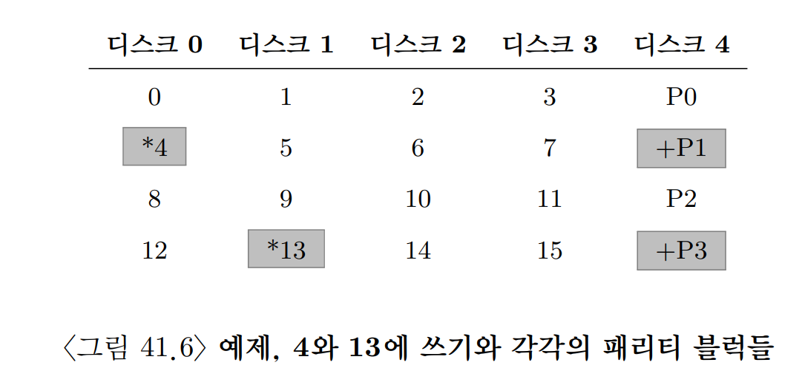
        <br>

        - 이러한 워크로드가 들어오면 패리티 디스크는 병목을 일으킨다. ( = `small-write 문제` )

            - 데이터 디스크는 병렬적으로 접근할 수 있으나 패리티 디스크는 병렬 연산이 안된다.

            - 결과적으로 R/2 만큼의 성능만 낼 수 있다.

            - 이는 디스크를 시스템에 추가해도 성능이 나아지지 않는다.

### 41-7. RAID 레벨 5: 순환 패리티

- small write 문제를 해결하기 위해 RAID-5가 소개됨.

    - RAID-4와 거의 동일하지만 패리티 블럭을 **순환(rotate)** 시킨다는 점이 다르다.

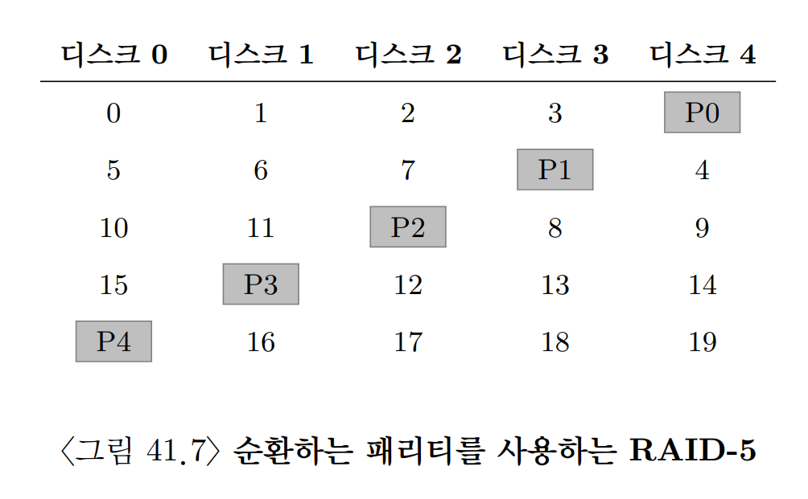
<br>

- **RAID-5 분석**

    - **RAID-4와의 차이점**

        - 모든 디스크를 활용할 수 있기 때문에 랜덤 읽기 성능이 약간 더 좋다.

        - 랜덤 쓰기 성능은 요청들을 병렬적으로 처리할 수 있기 때문에 RAID-4 대비 많이 개선된다.

### 41-8. RAID 비교: 정리

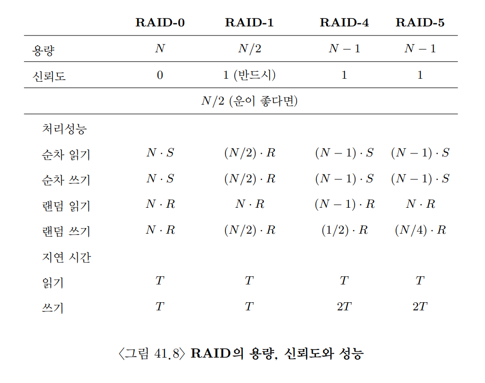
<br>

- 결론 

    - 성능만 고려 -> **스트라이핑(RAID-0)**

    - 임의 I/O 성능과 신뢰성 -> **미러링(RAID-1)**

    - 용량과 신뢰성 -> **RAID-5**

    - 항상 순차 I/O만 사용하고 용량을 극대화 -> **RAID-5**
    
## 42. 막간: 파일과 디렉터리

- `영속 저장 장치(persistent storage)`

    - 하드 디스크 드라이브(HDD)

    - 솔리드스테이트 드라이브(SSD)

- 전원 공급이 차단되면 내용이 사라지는 메모리와 달리 데이터가 보존된다.

> **핵심 질문**  
> 어떻게 영속 장치를 관리하는가

### 42-1. 파일과 디렉터리

- **저장 장치  가상화의 주요 개념**

    - `파일`

        - 단순히 읽거나 쓸 수 있는 순차적인 바이트 배열

        -  **저수준의 이름(low-level name), 아이노드 번호(inode number)**

            - 각 파일마다 가지고 있다.

            - 숫자로 표현되지만 사용자는 그 이름을 알지 못한다. 

    - `디렉터리`

        - 파일과 달리 **<사용자가 읽을 수 있는 이름, 저수준의 이름> 쌍**으로 이루어진 목록을 갖고 있다.

        - 디렉터리의 각 항목은 파일이나 다른 디렉터리를 가리킨다.

        - **디렉터리 트리, 계층**

            - 루트 디렉터리부터 시작(보통은 /으로 표현)

            - 원하는 디렉터리나 파일까지 구분자(/)를 사용해서 표현

            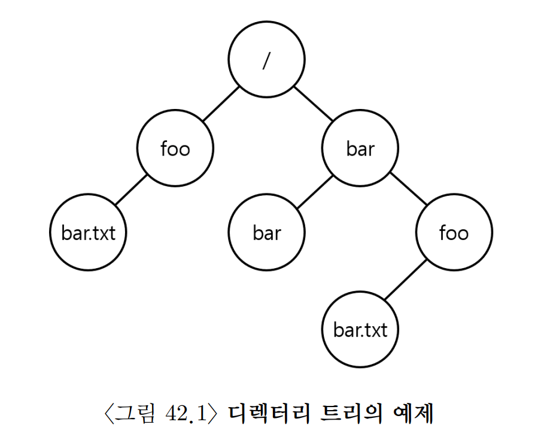
            <br>

### 42-2. 파일 시스템 인터페이스

- 파일 생성

- 파일 접근

- 파일 삭제

    - 삭제를 담당하는 unlink() 시스템 콜

### 42-3. 파일의 생성

- **open() 시스템 콜**

    ```cpp
    int fd = open(“foo ”, O_CREAT | O_WRONLY | O_TRUNC);
    ```

    - 다수의 플래그를 받는다.

        - **O_CREAT** : 파일 생성 플래그

        - **O_WRONLY** : 파일을 열었을 때 쓰기만 가능하게 하는 플래그

        - **O_TRUNC** : 파일이 이미 존재한다면 파일의 크기를 0으로 만드는 플래그

    - 리턴값: `파일 디스크립터`

        - 프로세스마다 존재하는 정수

        - open된 파일을 읽고 쓰는데 사용

        - 특정 동작에 대한 수행 자격을 부여하는 핸들

        - 파일 객체를 가리키는 포인터

### 42-4. 파일의 읽기와 쓰기

- 시스템 콜을 추적하는 도구

    - Linux : strace

    - Mac : dtruss

    ```cpp
    prompt> strace cat foo
    . . .
    open(“foo ”, O_RDONLY|O_LARGEFILE) = 3
    read(3,“hello\n ”, 4096) = 6
    write(1,“hello\n ”, 6) = 6
    hello
    read(3,“ ”, 4096) = 0
    close(3) = 0
    . . .
    prompt>
    ```

    - `O_RDONLY` : 읽기 전용 플래그

    - `O_LARGEFILE` : 64bit 오프셋이 사용되도록 설정

    - open()으로 3을 리턴하는 이유

        - 프로세스가 3개의 파일을 열어 놓았기 때문

            - 0 : 표준 입력

            - 1 : 표준 출력

            - 2 : 표준 에러

    - 파일 열기 성공 시 cat은 read() 시스템 콜을 사용하여 파일에서 몇 바이트씩 반복적으로 읽는다.

    - read()

        - 1번째 매개변수 : 파일 디스크립터

        - 2번째 매개변수 : read() 결과를 저장할 버퍼

        - 3번째 매개변수 : 버퍼의 크기

        - 리턴 성공 시 읽은 바이트 수 반환

    - write()

        - 파일이 큰 경우 반복적을 호출할 수 있다.

### 42-5. 비 순차적 읽기와 쓰기

- 지금까지의 모든 접근은 **순차적** 이었다.

- `lseek()` : 문서 내의 임의의 오프셋을 읽을 때 사용하는 시스템 콜

    - 커널 내부에 있는 변수의 값을 변경한다.

    ```cpp
    off_t lseek(int fildes, off_t offset, int whence);
    ```

    - **fildes** : 파일 디스크립터

    - **offset** : 오프셋(파일의 특정 위치)

    - **whence** : 탐색 방식

        - SEEK_SET : offset 바이트로 설정

        - SEEK_CUR : 현재 위치에 offset 바이트 더하기

        - SEEK_END : 파일의 크기에 offset 바이트 더하기

- 오프셋의 2가지 갱신 방법

    1. N 바이트를 읽거나 쓸 때 현재 오프셋에 N이 더해진다.

    2. lseek()로 명시적으로 오프셋을 변경한다.

### 42-6. fsync() 를 이용한 즉시 기록

- **write() 호출의 목적**

    - 데이터를 가까운 미래에 영속 저장 장치에 기록해달라고 파일 시스템에게 요청하는 것

    - `버퍼링`

        - 파일 시스템은 쓰기들을 일정 시간 동안 메모리에 모운 후 디스크에 한 번에 전달한다.

    - 드물게 데이터가 유실되는 경우가 있다.

- 쓰기에 있어 강력한 보장을 위한 제어 API

    - `fsync(int fd)`

        - 프로세스가 fsync()를 호출하면 파일 시스템은 지정된 파일의 모든 더티 데이터를 디스크로 강제로 내려보낸다.

        - fsync()가 리턴하면 데이터가 영속성을 갖게 되었다는 것을 보장받기 때문에, 안전하게 다음으로 진행할 수 있다.

        - 때로는 파일이 존재하는 디렉터리도 같이 fsync() 해줘야 한다.

### 42-7. 파일 이름 변경

- `mv` : 파일명 변경 명령어

- `rename()` : mv 내 명칭 변경 시스템 콜

    - 시스템 크래시에 대해 원자적으로 구현

        - 원래 이름, 새로운 이름 둘 중 하나만 갖게 된다.

### 42-8. 파일 정보 추출

- `메타데이터(metadata)` : 파일에 대한 정보

- `stat()`,`fstat()` : 파일의 메타데이터를 추출하는 시스템 콜

```cpp
struct stat {
    dev_t st_dev; /* ID of device containing file */
    ino_t st_ino; /* inode number */
    mode_t st_mode; /* protection */
    nlink_t st_nlink; /* number of hard links */
    uid_t st_uid; /* user ID of owner */
    gid_t st_gid; /* group ID of owner */
    dev_t st_rdev; /* device ID (if special file) */
    off_t st_size; /* total size, in bytes */
    blksize_t st_blksize; /* blocksize for filesystem I/O */
    blkcnt_t st_blocks; /* number of blocks allocated */
    time_t st_atime; /* time of last access */
    time_t st_mtime; /* time of last modification */
    time_t st_ctime; /* time of last status change */
};
```

- 일반적으로 파일 시스템은 **아이노드(inode)**에 이 정보를 보관한다.

### 42-9. 파일 삭제

- `rm` : 파일 삭제 명령어

- `unlink()` : 파일 삭제 시스템 콜

    - 지워야 하는 파일 이름을 인자로 받은 후 성공하면 0을 리턴

> **팁: 명령어 주의**  
>  `prompt> rm *`   
>  `prompt> rm -rf *`  
>        - r : 재귀적으로  
>        - f : 강제적으로  
>        - * : 현재 디렉터리 모든 파일을 가리킨다.

### 42-10. 디렉터리 생성

- 디렉터리 관련 시스템 콜은 디렉터리에 직접 쓸 수 없다.

    - 파일 시스템의 메타데이터로 분류되며, 간접적으로 변경된다.

    - 파일, 디렉터리 또는 다른 종류의 객체들을 생성함으로써 디렉터리를 변경할 수 있다.

    - 파일 시스템은 디렉터리의 내용이 항상 예상과 일치하도록 보장한다.

- `mkdir()` : 디렉터리 생성 시스템 콜

### 42-11. 디렉터리 읽기

- `ls` : 디렉터리 내용 읽기 명령어

    - 반복문을 사용해 디렉터리 항목을 하나씩 읽은 후 각 파일의 이름과 아이노드 번호를 출력한다.

### 42-12. 디렉터리 삭제하기

- `rmdir()` : 디렉터리 삭제 시스템 콜

    - 비어있지 않은 디렉터리에서 호출하면 실패한다.

### 42-13. 하드 링크

- `ln` : 명령행 프로그램

- `link()` : 파일 시스템 트리에 항목을 추가하는 시스템 콜

    - 1번째 매개변수 : 원래의 경로명

    - 2번째 매개변수 : 새로운 경로명

    - 동작방식

        - 새로이 링크하려는 이름 항목을 디렉터리에 생성

        - 원래 파일과 같은 아이노드 번호 매핑

        - 파일은 복사되지 않는다.

    `-i` : 각 파일의 아이노드 번호를 함께 출력하는 옵션

- 파일 생성 시 작업

    1. 파일 관련 모든 정보를 관리하는 자료구조(아이노드) 생성

    2. 해당 파일에 사람이 읽을 수 있는 이름을 연결, 연결 정보를 디렉터리에 생성

- 파일 삭제 시 unlink() 작업

    - unlink()하면 아이노드 번호의 참조 횟수(reference count)를 검사

        - **참조 횟수** : 특정 아이노드에 대해 다른 이름이 몇 개나 연결되어 있는지 관리

    - unlink() 호출 시 연결을 끊고 참조 횟수를 1 감소

    - 참조 횟수가 0이 되면 파일 시스템이 해당 파일을 삭제 처리

- 파일의 참조 횟수는 `stat()`을 통해 확인 가능

### 42-14. 심볼릭 링크

- 하드 링크의 제한

    - 디렉터리에 대해서 하드 링크 불가

    - 다른 디스크 파티션에 있는 파일에 대해서 하드 링크 불가

- `ln -s` : 심볼릭 링크 생성

- 심볼릭 링크와 하드 링크 차이점

    1. 심볼릭 링크는 다른 형식의 독립된 파일이다.

    ```cpp
    prompt> ls -al
    drwxr−x−−− 2 remzi remzi 29 May 3 19:10 ./
    drwxr−x−−− 27 remzi remzi 4096 May 3 15:14 . ./
    −rw−r−−−−− 1 remzi remzi 6 May 3 19:10 file
    lrwxrwxrwx 1 remzi remzi 4 May 3 19:10 file2 −> file
    ```

    - 심볼릭 링크는 `l`로 시작한다.

    2. 심볼릭 링크는 연결하느 파일의 경로명을 저장

    3. 심볼릭 링크는 **dangling reference** 문제가 발생할 수 있다.

        - 원래 파일을 삭제하면 심볼릭 링크가 가리키는 파일은 더 이상 존재하지 않게 된다.

### 42-15. 파일 시스템 생성과 마운트

- 다수의 파일 시스템들이 존재할 때 이들을 묶어서 어떻게 하나의 디렉터리 트리를 구성하는가?

    - 각각의 파일 시스템을 생성하고, 이들을 **마운트** 함으로써 단일 디렉터리 트리를 구성한다.

- `mkfs` : 파일 시스템을 생성하는 명령어

    - 장치명, 파일 시스템 타입을 전달하면 해당 파티션에 파일 시스템 생성.

- `마운트` : 새로이 생성된 파일 시스템을 루트 디렉터리에서 시작하는 기존의 디렉터리 구성을 통해 접근할 수 있도록 하는 작업

    - **동작 방법**

        - 기존의 디렉터리 중 하나를 **마운트 지점(mount point)** 으로 지정

        - 마운트 지점에 생성된 파일 시스템을 붙여 넣기

    ```cpp
    prompt> mount −t ext3 /dev/sda1 /home/users
    ```

    - **묘미**

        - 여러 개의 개별 파일 시스템을 갖는 대신 모든 파일 시스템을 하나의 트리 아래에서 통합

## 43. 파일 시스템 구현

- `vsfs(Very Simple File System)`

> **핵심 질문**   
> 어떻게 간단한 파일 시스템을 만들 것인가


### 43-1. 생각하는 방법

- **파일 시스템 2가지 측면**

    - 자료 구조

        - vsfs은 배열과 같은 간단한 자료구조

        - SGI의 XFS 같은 파일 시스템은 좀 더 복잡한 트리 기반의 자료구조

    - 접근 방법(access method)

        - 프로세스가 호출하는 open(), read(), write() 등의 명령들은 자료 구조와 어떤 관련이 있는가?

        - 특정 시스템 콜을 실행할 떄 어떤 자료 구조들이 읽히는가?

        - 어떤 것들이 쓰일까?

        - 과정이 얼마나 효율적으로 동작하는가?

### 43-2. 전체 구성

- vsfs 파일 시스템의 자료 구제에 대한 디스크 상 전체적인 구성

    - 디스크를 블럭(block)들로 나누는 것

    - 디스크의 일정 부분(ex: 56블럭)을 데이터 영역으로 확보

        - **데이터 영역** : 사용자 데이터가 있는 디스크 공간

    - 디스크의 일정 부분(ex: 5블럭)을 아이노드 테이블로 확보

        - **아이노드 테이블** : 아이노드들의 저장을 위한 디스크 공간

    - 각 블럭이 현재 사용 중인지 아닌지를 표현할 **할당 구조(allocation structure)** 가 필요하다.

        - 프리 리스트(free list)를 사용한 방법

        - 비트맵(bitmap)을 사용한 방법

            - 비트맵은 비트들의 배열, 각 비트는 해당 블럭이나 객체가 사용중(1)인지 아닌지(0)를 나타낸다.

    - **슈퍼블럭(superblock)** 을 위한 공간 마련

        - `슈퍼블럭(superblock)` : 파일 시스템 전체에 대한 정보

            - 예시

                1. 몇 개의 아이노드와 데이터 블럭 있는지

                2. 아이노드 테이블은 어디에서 시작하는지

                3. 파일 시스템을 식별하는 매직 넘버

            - 대부분의 파일 시스템은 슈퍼블럭을 몇 개 복사해서 안정성을 챙긴다.

### 43-3. 파일 구성: 아이노드

- `아이노드(= 인덱스 노드)`

    - 각 배열은 특정 아이노드를 접근하기 위해 탐색된다.

    - 각 아이노드는 **숫자(아이넘버, 저수준 이름)** 로 표현된다.

    - 아이넘버를 통해 해당 아이노드가 디스크 상 어디에 있는지 직접 계산할 수 있다.

    - 아이노드에는 파일에 대한 모든 정보(메타데이터)가 들어있다.

- 아이노드 설계 시 중요한 결정 사항

    - 데이터 블럭의 위치를 표현하는 방법

        - 아이노드 내에 여러 개의 **직접 포인터(디스크 주소)** 를 두는 것

            - 각 포인터는 파일의 디스크 블럭 하나를 가리킨다.

            - 이 방법은 파일 크기의 제한이 있다.
            (포인터 개수) * (블럭 크기)

- **멀티 레벨 인덱스**

    - 큰 파일을 지원하기 위한 방법

        - `간접 포인터(indirect pointer)`

            - 간접 포인터는 데이터 블럭을 가리키지 않고, 데이터 블럭을 가리키는 포인터들을 저장하고 있는 블럭을 가리킨다.

        - `이중 간접 포인터(double indirect pointer)`

            - 더 큰 파일을 저장하고 싶을 때 사용

            - 이중 간접 포인터가 가리키는 블럭은 간접 포인터들이 저장된 블럭이다.

        - `삼중 간접 포인터(triple indirect pointer)`

    - 멀티 레벨 인덱스 대신 **익스텐트** 를 기반으로 동작하는 파일 시스템도 존재한다.

        - `익스텐트(extent)`

            - 디스크 포인터와 길이(블럭 단위)로 디스크 상의 파일 위치를 가리킨다.

            - 자유도가 낮은 대신 좀 더 집약되어있어, 디스크의 여유 공간이 충분히 있고 파일들을 연속적으로 배치할 수 있을 때 잘 동작한다.

### 43-4. 디렉터리 구조

- vsfs에서 디렉터리는 `(항목의 이름, 아이노드 번호)` 쌍의 배열로 구성되어 있다.

- 디렉터리의 데이터 블럭에는 **문자열과 숫자** 가 쌍으로 존재하며 문자열 길이에 대한 정보도 있다.
```
inum | reclen | strlen | name
  5      4        2     .   (현재)
  2      4        3     . . (부모)
  12     4        4     foo
  13     4        4     bar
  24     8        7     foobar
```

- 파일을 삭제(unlink() 호출)하면 디렉터리 중간에 빈 공간이 생긴다.

    - 항목의 길이를 명시하는 이유 중 하나가 **영역이 비었다는 것을 표시하기 위해서** 이다.

- 디렉터리는 파일 시스템에서 특수한 파일로 간주

    - 자신의 아이노드를 가지며, 아이노드 테이블에 저장되어 있다.

    - 데이터 블럭도 여타 다른 파일들과 똑같다.

- 디렉터리는 가변 크기 레코드로 구성된 배열이지만, 이외에도 많은 방식이 존재한다.

    - ex : XFS

        - B-Tree 형식 디렉터리

        - 선형 배열이 아니라 검색 시간이 단축된다.

        - 파일 생성을 좀 더 빨리 할 수 있다.
            
### 43-5. 빈 공간의 관리

- 파일 시스템은 아이노드와 데이터 블럭 사용 여부를 관리해야 한다.

- `빈 공간 관리(free space management)`

    - `아이노드 비트맵`

        - 파일 생성 시 아이노드 할당

        - 파일 시스템은 아이노드 비트맵을 탐색

        - 비어있는 아이노드에 파일 할당

        - 해당 아이노드의 비트를 1로 변경

    - `데이터 블럭 할당 비트맵`

        - 고려 사항

            - Linux(ext2, ext3) 경우, 할당 시 가능하면 여러 개의 블럭들이 연속적으로 비어 있는 공간을 찾아서 할당한다.( = `선할당`)
            
            - 선할당을 통해 해당 파일에 대한 입출력 성능을 개선한다.

### 43-6. 실행 흐름: 읽기와 쓰기

- **디스크에서 파일 읽기**

    - 파일을 열고, 읽고, 닫는 과정을 가정

    - **열기**

        1. open() 시스템 콜

        2. 파일 시스템에서 경로명을 통해 해당 파일에 대한 아이노드 탐색 및 정보 획득

    - **읽기**

        1. open() 이후 read() 시스템 콜

        2. 첫 번째 읽기는 해당 블럭의 디스크 상 위치를 파악 후 읽기 시작

        3. 파일을 읽은 후 마지막으로 읽은 시간을 아이노드에 기록

        4. 다음 읽기 수행 시, 이전에 읽었던 다음 위치부터 읽기 수행

    - **닫기**

       1. 할당된 파일 디스크립터 해제 
    
    - 읽기에서 I/O 발생 횟수는 경로의 길이에 비례한다.

- **디스크에 쓰기**

    - 읽기와 과정은 비슷하다.

    - 파일 쓰기는 **블럭 할당** 을 필요로 할 수 있다.

        - **ex** : 새로운 파일에 쓸 때
            
            - 파일을 어느 블럭에 할당할지 결정

            - 디스크에 다른 자료 구조(데이터 비트맵, 아이노드 등) 갱신

            - 데이터를 디스크에 기록

> **핵심 질문**  
> 파일 시스템의 I/O 비용을 어떻게 줄일까

### 43-7. 캐싱과 버퍼링

- 성능 개선을 위해 대부분의 파일 시스템들은 자주 사용되는 블럭들을 메모리(DRAM)에 캐싱한다.

- `정적 기법`

    - 고정 크기의 캐시는 보통 전체 메모리의 10% 정도 차지한다.

    - 용도 변경이 불가해서 낭비가 될 수 있다.

- `동적 파티션`

    - 현대 많은 운영체제가 **일원화된 페이지 캐시(unified page cache)** 를 사용한다.

    - 파일 열기의 경우 첫번째 열기 이후 추가 I/O가 필요없다.

- `쓰기 버퍼링(write buffering)`

    - 쓰기는 영속성을 유지하기 위해 해당 블럭들을 디스크로 내려야 한다.

    - 읽기와 같은 역할을 할 수 없어서 쓰기 시점을 연기하는 역할을 한다.

    - **성능 이득**

        - 쓰기 요청을 지연 시켜 일괄처리(batch)할 수 있다.

        - 여러 개의 쓰기요청들을 모아두믕로써 다수의 I/O들을 스케줄링할 수 있다.

        - 지연시킴으로써 쓰기 자체를 피할 수 있다.

            - ex : 임시파일 생성, 삭제

    - 일부 응용 프로그램은 버퍼링으로 인한 문제를 예방하기 위해 **fsync()** 를 사용한다.

## 44. 지역성과 Fast File System

### 44-1. 문제: 낮은 성능

- 이전 장에 알려준 구형 파일 시스템은 성능이 형편없다.

- **구형 파일 시스템의 핵심 문제**

    - 디스크를 메모리(RAM)처럼 사용한다.

    - 파일 시스템은 빈 공간을 효율적으로 관리하지 않기 떄문에 **단편화** 가 발생한다.

        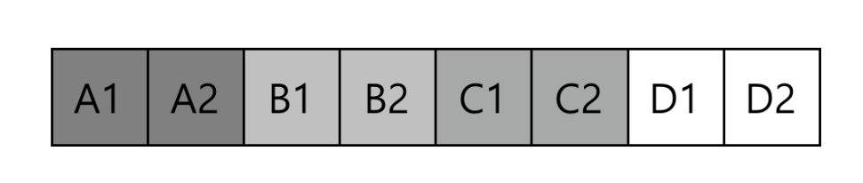
        <br>

        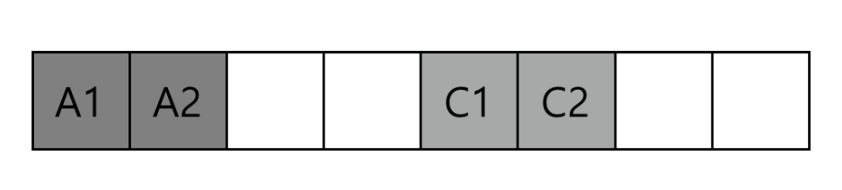
        <br>

        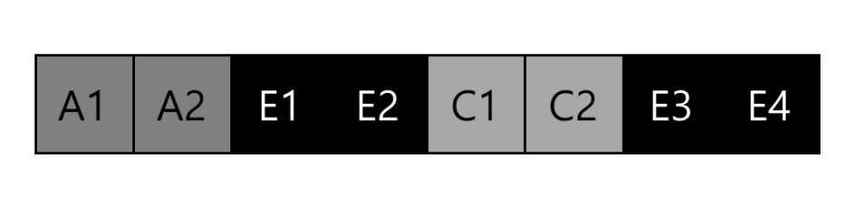
        <br>

    - 블럭 크기가 너무 작다.(512바이트)

        - 입출력단위가 너무 작아 디스크로부터 데이터를 전송하는 것이 매우 비효율적이다.

> **핵심 질문**   
> 성능 개선을 위해 어떻게 디스크 상의 데이터를 구성해야 할까

### 44-2. FFS: 디스크에 대한 이해가 해답이다

- `Fast File System, FFS`

    - 파일 시스템 인터페이스는 그대로 유지하면서, 내부 구현 방식을 변경

### 44-3. 파일 시스템 구조: 실린더 그룹

- 1단계 : 디스크에 적합하게 파일 시스템 구성을 수정

    - 디스크를 여러 개의 **실린더 그룹(cylinder gruop)** 으로 분할

        - `실린더 그룹`

            - 두 개의 파일을 같은 그룹에 배치

            - 한 파일을 읽고, 다음 파일을 접근할 때 디스크 전역 탐색이 발생하지 않도록 방지

            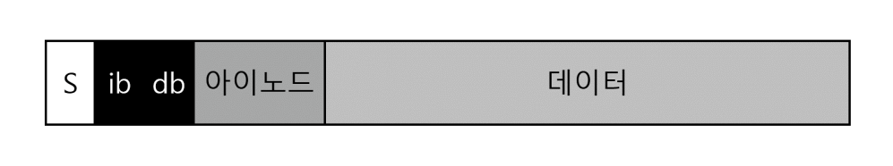
            <br>

            - **구성 요소**

                - 슈퍼블럭의 복사본

                - 아이노드 비트맵

                - 데이터 비트맵

### 44-4. 파일과 디렉터리 할당 정책

- **기본 원칙** : 관련있는 것끼리 모아라

    - **사용한 힌트**
    
        1. 디렉터리의 위치 결정

            - 할당된 디렉터리 수가 적고 프리 아이노드의 수가 많은 실린더 그룹을 선택하여 디렉터리 데이터와 아이노드를 해당 그룹에 저장한다.

        2. 파일의 위치 결정

            1. 아이노드와 파일의 데이터 블럭을 같은 그룹에 할당

                - 아이노드와 데이터 간의 긴 탐색을 방지

            2. 동일한 디렉터리 내의 모든 파일들은 해당 디렉터리가 존재하는 실린더 그룹에 함께 저장

### 44-5. 파일 접근의 지역성 측정

- `경로 간의 거리`

    - 디렉터리 트리 내에서 파일 간의 접근이 얼마나 **멀리 떨어져있는지** 를 분석

        - 비교하는 파일의 조상 경로명이 동일하게 될 때까지 디렉터리 트리를 얼마나 타고 올라가야 하는가

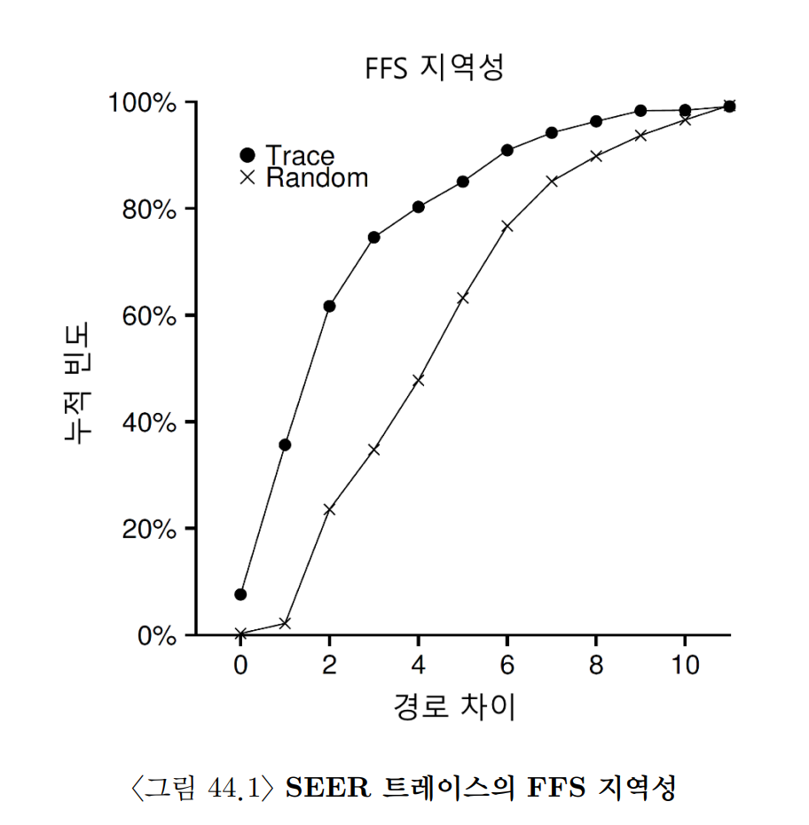
<br>

### 44-6. 대용량 파일 예외 상황

- 파일 크기가 매우 큰 경우

    - 하나의 파일이 블럭 그룹을 모두 채워, 관련있는 다른 파일들을 다른 블럭 그룹에 저장시키면 **접근 지역성이 떨어진다.**

- FFS의 처리 방식

    - 첫 번쨰 블럭 그룹에 일정 수의 블럭을 할당
    
    - 파일의 큰 청크를 다른 블럭 그룹에 저장

    - 다음 청크는 또 다른 블럭 그룹에 저장

- 최대 대역폭에 가까운 성능을 원한다면 청크의 크기를 키우는게 맞지만, FFS는 아이노드 자체 구조를 기반으로 한 접근법을 활용했다.

### 44-7. FFS에 대한 기타 사항

- 구형 파일 시스템은 작은 파일들에게 있어서 데이터를 전송하는 성능은 좋았지만, **내부 단편화** 로 인한 공간 활용 문제를 피할 수 없다.

- **FFS의 해결 방법**

    - 512byte의 `서브블럭(sub-block)`

        - 서브 블럭들의 합이 블럭 용량(ex:4KB)이 되면 서브블럭들을 블럭에 붙여넣은 후 해당 서브블럭을 다시 재사용

        - 일종의 버퍼 역할

    - 성능에 최적화된 디스크 배치

        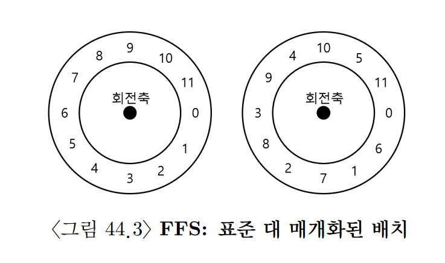
        <br>

        - FFS에서 순차 읽기는 불가능하다.

        - `매개화(parameterization)`

            - FFS는 디스크의 성능 매개변수들을 검출해 그 정보를 바탕으로 정확한 시차에 따른 배치 기법을 결정

        - 이 기법은 신경안써도 되는게 현대 디스크는 한 트랙을 모두 내부 디스크에 캐시한다.

    - 사용자 편의성 개선

        - 긴 파일 이름 지원

        - 심볼릭 링크 개념 도입

        - rename() 명령 소개

## 45. 크래시 일관성: FSCK와 저널링

- **문제점** : 시스템 크래시가 발생하는 상황에서 어떻게 안전하게 디스크 상의 내용을 갱신하는가?

    - 시스템 크래시가 발생하는 상황

        - 갱신 도중 기계가 꺼질 경우

        - 운영체제가 버그 떄문에 멈춘 경우

### 45-1. 예제

- **가정**

    - `워크로드` : 기존 파일에 블럭을 하나 추가하는 연산

    - **블럭 추가 시 발생하는 연산**

        1. 아이노드 정보 갱신

        2. 데이터 비트맵 갱신

        3. 데이터 블럭 쓰기

    - write()의 결과는 디스크에 바로 반영되지 않고, 캐시에 저장되었다가 파일 시스템이 실제로 디스크를 실행하는 시점에 디스크에 기록된다.

- `크래시 시나리오`

    - **아이노드와 비트맵** 이 정상적으로 기록되지 않으면 `일관성 손상` 문제가 발생한다.

    - **데이터 블록** 은 있던 없던 크래시 일관성 관점에서는 문제 없다.

- **크래시 일관성 문제**

    - 일관성을 유지하려는 목적

        - 연산 이전에서 이후 상태로 이동할 때, 중간의 임시 상태로 시스템에 남아 있는 경우를 방지하기 위해서

    - **크래시나 전력 손실** 등의 이유로 목적을 달성하기 어렵다.

### 45-2. 해법 1: 파일 시스템 검사기

- **초기 파일 시스템의 크래시 일관성 해법** : 그대로 두었다가 리부팅 시 해결

- `fsck` : 일관성 불일치를 발견하고 수정하는 UNIX 도구.

    - 문제들을 전부 해결할 순 없다.

        - **ex)** 아이노드가 의미없는 블럭을 가리키고 있는 경우(데이터 블럭만 기록이 안된 경우)

    - fsck는 파일 시스템의 마운트 직전에 실행된다.

    - **fsck가 하는 일**

        - `슈퍼블럭`

            - **슈퍼블럭** 내용에 오류가 없는지 검사

                - 블럭 개수가 파일 시스템의 크기보다 큰지와 같은 기초 검사

                - 손상이 의심되는 슈퍼블럭이 있는지 확인

                - 발견 시 슈퍼블럭을 사본으로 대체할지 결정

        - `프리 블럭`

            - **아이노드와 간접 블럭, 이중 간접 블럭 등** 을 살펴보고 파일 시스템에 어떤 블럭들이 할당되었는지에 대한 정보를 생성

            - 정보를 토대로 정확한 할당 비트맵을 재구성

            - 기존의 비트맵과 비교해 불일치할 경우, 아이노드 정보를 기반으로 해결

            - 모든 아이노드에 대해 같은 검사를 수행, 비트맵의 유효성을 검사하고, 필요 시 아이노드 비트맵을 재구성

        - `아이노드 상태`

            - 각 아이노드가 손상되었는지 검사

            - 아이노드 항목 중 쉽게 해결이 안되는 문제가 있으면 해당 아이노드를 초기화

            - 아이노드 비트맵도 그에 따라 갱신

        - `아이노드 링크`

            - 각 할당된 아이노드의 **링크 개수** 를 확인

                - 링크 개수 : 특정 파일에 대한 참조를 포함하고 있는 디렉터리들의 수

            - 링크 개수를 확인하기 위해 루트 디렉터리부터 모든 디렉터리 트리를 탐색, 모든 파일과 디렉터리에 대한 링크 개수를 직접 수집

            - 탐색해서 계산된 개수와 아이노드의 링크 개수를 비교

            - 만약 다를 경우 아이노드의 개수 필드를 수정

        - `중복`

            - **중복된 포인터**가 있는지 검사

                - 같은 블럭을 가리키는 서로 다른 아이노드가 있는지 검사

        - `배드 블럭`

            - 모든 포인터 목록을 검사해 배드 블럭 포인터가 있는지 확인

            - 발견 시 아이노드나간접 블럭에서 해당 포인터를 삭제

        - `디렉터리 검사`

            - 파일의 내용은 파악할 수 없다.

            - 디렉터리 내용에 대해서는 모든 내용이 제대로 저장되어 있는지 검사

                - 첫 항목이 ".", ".." 인지

                - 각 아이노드가 실제 할당되어 있는지

                - 전체 계층에서 디렉터리가 2번 이상 연결된 경우가 있는지

    - **단점** : 너무 느리다.

### 45-3. 해법 2: 저널링(Write-Ahead Logging, WAL)

- 데이터베이스 관리 시스템에서 차용한 개념

- **개념**  : 디스크 내용을 갱신할 때, 자료구조를 갱신하기 전에 먼저 수행하고자 하는 작업을 요약해서 기록해둔다.

    - `redo` : 디스크 페이지를 새값으로 갱신하는 과정에서 크래시가 발생하면, 로그를 확인해 다시 갱신한다.

- **장점**

    - 크래시가 났을 때 디스크 전체를 다 스캔하지 않아도 된다.

    - 쓰기가 복잡해져서 약간 느려지지만, 오버헤드가 심하지 않고 시스템의 복구 성능은 대폭 개선된다.

- **Linux ext2 / ext3**

    - ext2 : 저널링을 지원하지 않음

    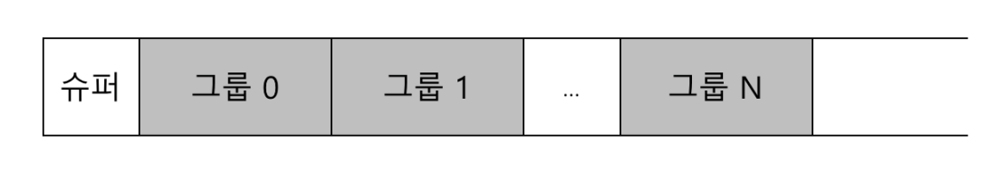
    <br>

    - ext3 : 저널링을 지원

    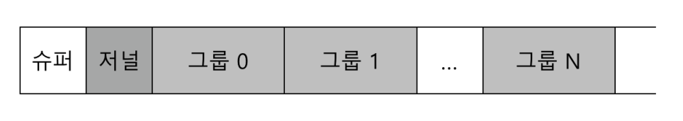
    <br>

- **데이터 저널링**

    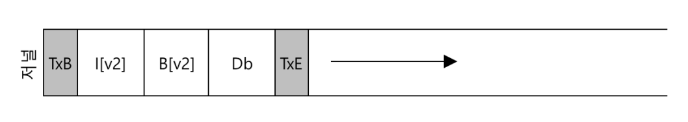
    <br>

    - 시작 블럭(TxB)
    
        - 연산에 대한 정보들을 기록한다.

            - 갱신될 블럭들에 대한 정보

            - **트랜잭션 식별자(TID)**

    - 블럭(아이노드, 비트맵, 데이터)

        - 디스크 상의 최종 위치에 기록될 내용들이 기록

    - 트랜잭션 종료 블럭(TxE)

        - 로그가 기록되면 트랜잭션은 커밋되엇다는 의미

        - TID를 포함하고 있다.

    - `체크 포인트`
    
        - 저널에 기록된 내용을 실제 위치에 반영하는 과정

        - 저널에 기록한 직후 바로 체크포인트를 진행하지 않는다.

        - **작업 순서**

            1. 저널 기록

                - 트랜잭션을 저널에 기록

                - 트랜잭션 시작, 데이터, 종료등 블럭을 로그에 기록한다.

            2. 체크포인트
            
                - 갱신된 메타데이터와 데이터 블럭들을 해당 위치에 반영한다.

        - 파일 시스템의 트랜잭션

            - 트랜잭션 종료 블럭을 통해 종료된 시점을 알 수 있지만, 성공적으로 종료된건지는 알 수 없다.

            - 이로 인한 문제의 발생을 방지하기 위해 트랜잭션을 2단계로 나눠 기록한다.

                - TxE를 제외한 모든 블럭을 한 번의 쓰기 요청으로 저널에 저장

                - 쓰기 완료 시 TxE 블럭에 대한 쓰기를 요청해 하나의 안전한 상태로 만든다.

            - **조건**

                - 디스크 쓰기 연산의 원자성

                    - TxE는 무조건 원자적으로 기록되어야 한다.

                    - 디스크는 섹터단위의 쓰기에 대한 원자성은 보장한다.

- **복구**

    - **크래시 상황에서 저널을 통해 파일 시스템을 복구하는 방법**

        - 트랜잭션이 로그에 안전하게 기록되기 전에 크래시가 발생한 경우

            - 복구 시 아무것도 안해도 된다.

        - 로그가 기록되었지만, 체크포인트가 완료되기 전에 크래시가 발생한 경우

            - 복구 프로세스는 시스템이 부팅할 때 로그를 탐색해서 디스크에 커밋된 트랜잭션이 있는지 파악한다.

            - **redo logging**를 통해 디스크 자료 구조 간의 일관성을 보장한다.

                - `redo logging` : 커밋된 트랜잭션의 블럭들을 디스크 상의 원래 위치에 다시 쓰는 로깅 방식

            - 복구 후 파일 시스템을 마운트하여 새로운 요청을 받을 수 있도록 준비한다.

- **로그 기록을 일괄 처리 방식으로**

    - 앞선 데이터 저널링 방식은 디스크에 많은 트래픽을 유발한다.

        - 파일을 하나 생성하려면 디스크 상의 여러 자료 구조를 갱신해야 한다.

        - 저널링을 사용하면 각 파일들에 대한 정보들이 모두 저널에 커밋된다.

    - **개선 방법** : 각각 여러 개의 저널로그를 모아서 한 번에 디스크에 커밋하는 방법(ex: ext3)

        - 로깅해야 할 모든 갱신 내용을 **트랜잭션 버퍼(= 저널 버퍼)** 라는 자료 구조에 보관한다.

            - 파티션마다 하나만 존재하는 전역 자료구조이다.

        - 파일 시스템은 메모리에 있는 갱신내용들을 정기적으로 저널에 기록한다.

        - **fsync(), sync() 함수** 가 호출되면, 트랜잭션 버퍼의 내용들이 저널에 커밋된다.

- **로그 공간의 관리**

    - 로그 공간이 모두 차면 생기는 문제

        1. 로그에 있는 트랜잭션은 순서대로 재실행하기 때문에 복구 소요 시간이 길어진다.

        2. 더 이상의 트랜잭션을 커밋할 수 없다.

    - **해법** : 환형 로그(circular log)

        - 로그 공간을 다 쓰면 앞에서부터 다시 쓰기

    - 파일 시스템은 트랜잭션이 체크포인트되면 해당 트랜잭션 공간을 비운다.

        - `저널 슈퍼블럭`

            - 최신 트랜잭션, 가장 오래된 트랜잭션의 위치, 체크포인트가 안된 트랜잭션 등 다양한 정보를 가진다.

            - 복구 시간 단축, 로그 재사용에 쓰인다.

            - **저널 알고리즘의 고도화**

                1. 트랜잭션 내용을 로그에 쓰기

                2. 트랜잭션 커밋 블럭을 로그에 쓰기

                3. 갱신에 대한 내용을 파일 시스템 내에 쓰기

                4. 일정 시간 이후 저널 슈퍼블럭을 갱신하여 저널 트랜잭션을 해제

- **메타데이터 저널링**

    - 복구 시간 단축은 어느 정도 해소됐지만 저널과 디스크 양쪽에 쓰기를 해야 되서 파일 시스템이 느려진다.

    - `메타데이터 저널링(Ordered journaling)`

        - 저널에 데이터 블럭을 기록하지 않는다.

        - 데이터 블럭은 언제 디스크에 내려 보내는가?

        - **해법** : 메타데이터를 저널에 기록하기 전에 데이터 블럭을 먼저 디스크에 쓴다.

            1. 데이터를 최종 위치에 쓰기

            2. 시작 블럭과 메타데이터를 로그에 쓰기

            3. 트랜잭션 커밋 블럭을 로그에 쓰기

            4. 갱신된 메타데이터의 내용을 최종 위치에 갱신

            5. 저널 슈퍼블럭에 해당 트랜잭션이 해제되었다고 표기

    - 저널링의 올바른 동작을 위해 저널 커밋을 요청할 때는 반드시 앞선 단계가 완료되어야만 한다.

- **까다로운 사례: 블럭 재활용**

    - **사례**

        1. foo 디렉터리에 파일 생성(블럭 1000번)

        2. foo에 대한 저널링 완료 후 디렉터리랑 파일 모두 삭제

        3. 삭제와 동시에 foobar 파일 생성 후 저널링(블럭 1000번)

        4. 크래시 발생

    - **해법**

        - 지워진 블럭이 체크포인트될 때까지 재사용하지 않는다.

        - **철회 레코드를 통한 해법**

            - 디렉터리 삭제 시 저널에 철회 레코드를 기록

            - 저널 재실행 시 철회 레코드의 존재 여부를 먼저 탐색하고, 철회된 내용은 재실행하지 않는 식으로 문제 회피

- **마치며: 흐름도**

    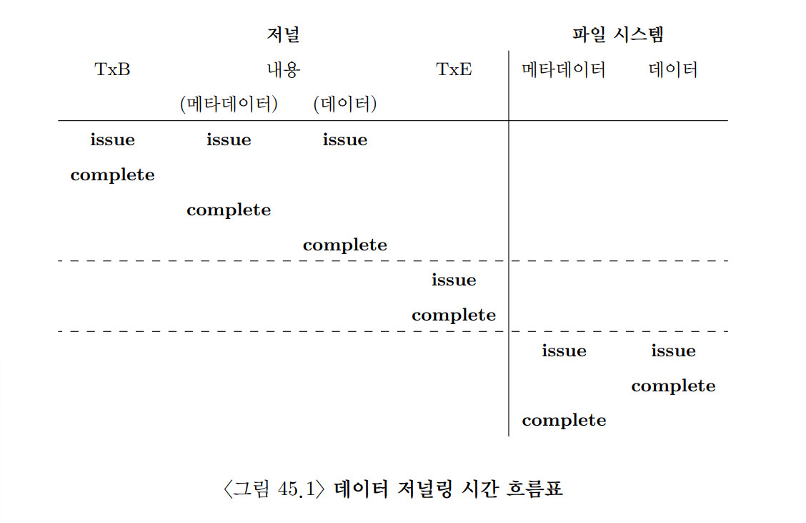
    <br>

    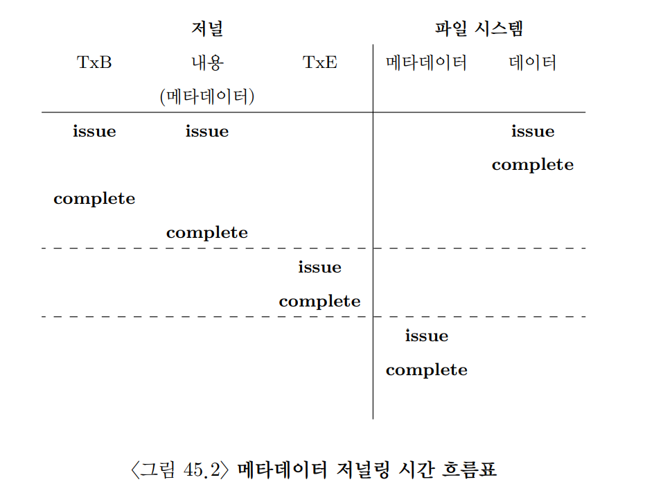
    <br>

    - TxB, 내용은 완료 순서에 제약이 없다.

    - TxE는 앞선 쓰기 요청들이 모두 완료된 후에 시작해야 된다.

    - 데이터와 메타데이터의 체크포인트는 커밋되기 전까지는 시작할 수 없다.

### 45-4. 해법 3: 그 외 방법

- `Soft Update`

    - 파일 시스템의 **모든 쓰기들의 순서** 를 잘 정해서 디스크 상의 자료 구조가 절대로 불일치 상태가 되지 않도록 하는 방법

- `Copy-On-Write(COW)`

    - 파일이나 디렉터리들을 절대 원래 위치에 덮어쓰지 않는다.

    - 이제까지 디스크에서 사용안 된 위치에 갱신 내용을 저장한다.

    - 여러 갱신 작업이 완료되면 루트 자료 구조에 새롭게 갱신된 자료 구조를 가리키는 포인터를 포함하도록 변경한다.

- `백포인터 기반 일관성(backpointer-based consistency, BBC)`

    - 쓰기 사이에 순서를 강요하는 않는 대신, 모든 블럭에 **백포인터** 를 추가

    - 일관성이 유지되고 있는지 판단하기 위해 포인터가 가리키는 블럭이 다시 이 블럭을 가리키고 있는지 검사

- `Optimistics Crash Consistency`

    - 저널링 시 디스크 쓰기를 대기하는 횟수를 줄이는 기법

    - 요청할 수 있는 가장 큰 크기의 쓰기를 디스크에 내려보낸다.

    - **트랜잭션 체크섬** 과 다른 몇 가지 기술들을 적용해 일관성을 보장

## 46. 로그 기반 파일 시스템

- 로그 기반 파일 시스템 연구 동기

    - **메모리 크기 증가 추세**

        - 메모리 용량이 커지면서 더 많은 데이터를 메모리에 캐시할 수 있다.

        - 대량의 데이터가 캐시되면서 디스크는 대체로 쓰기 위주로 되었고 읽기는 캐시가 처리했다.

        - 파일 시스템의 성능은 쓰기의 성능에 비례되었다.

    - **랜덤 I/O와 순차 I/O의 성능 간의 격차**

        - 디스크를 순차적으로 사용할 수 있다면 상당한 성능 개선 효과를 얻게 된다.

    - **많은 일반적인 워크로드에서 기존 파일 시스템들의 성능이 좋치 않음**

        - FFS는 블록 하나 크기의 새로운 파일을 생성하기 위해 여러 번의 쓰기를 한다.

        - 할당된 모든 블럭들을 같은 블럭 그룹 내에 배치할 수 있다.

        - FFS는 여러 번의 짧은 탐색과 연이은 회전 지연을 발생시키기 때문에 최대 순차 대역폭의 성능을 따라가지 못한다.

    - **파일 시스템이 RAID를 고려하지 않았다**

        -  RAID의 small-write 문제를 회피하기 위한 노력을 하지 않았다.

- `로그 기반 파일 시스템(Log-Structured Filesystem, LSF)`

    - 디스크 기록 시, LFS는 모든 갱신 정보를 **세그멘트** 메모리 자료구조에 보관

    - 세그멘트가 모두 차면 디스크 빈공간에 한번에 기록한다.

    - 기존의 내용을 덮어쓰지 않고, 항상 비어 있는 곳에 세그멘트를 쓴다.

> **핵심 질문**  
> 모든 쓰기를 어떻게 순차 쓰기로 변형시킬까

### 46-1. 디스크에 순차적으로 쓰기

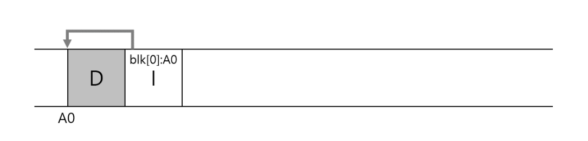
<br>

- 데이터 블럭을 기록하면 데이터 블럭만 기록되는게 아닌 **메타데이터** 도 함께 갱신되어야 한다.

### 46-2. 순차적이면서 효율적으로 쓰기

- 디스크에 순차적으로 쓰는 것으로는 효율적인 쓰기를 보장할 수 없다.

    - 첫 쓰기와 두 번째 쓰기 사이에 디스크를 회전시켰다면, 두 번쨰 쓰기를 실행하기 전엔 플래터를 회전시켜야 한다.

    - 다수의 순차쓰기를 한 번에 디스크에 내려 보내야 빠른 쓰기 성능을 얻을 수 있다.(`쓰기 버퍼링`)

    - `세그먼트` : 한 번에 디스크에 기록하는 단위

### 46-3. 적절한 버퍼의 크기는?

- **디스크에 실제 쓰기 전에 LFS는 몇 개의 쓰기 내용을 세그멘트 버퍼에 갖고 있어야 할까?**

    - 전송 속도 대비 위치 잡기 오버헤드가 얼마나 큰지에 따라 다르다.

    - **데이터 청크를 쓰는데 소요되는 시간**

    $$T_{write} = T_{postion} + \frac{D}{R_{peak}}$$

    - **실제 쓰기 속도**

    $$R_{effective} = \frac{D}{T_{write}} = \frac{D}{T_{position+ \frac{D}{R_{peak}}}}$$

    - **최대 속도에 근접했을 때의 세그먼트 크기**

        $$R_{effective} = \frac{D}{T_{position} + \frac{D}{R_{peak}}} = F × R_{peak}$$

        $$D = F × R_{peak} × (T_{position} + \frac{D}{R_{peak}})$$
        
        $$D = (F × R_{peak} × T_{position}) + (F × R_{peak} × \frac{D}{R_{peak}})$$

        $$D = \frac{F}{1-F} × R_{peak} × T_{position}$$

        - 대체로 F는 최대 속도의 0.9가 된다.

### 46-4. 문제: 아이노드 찾기

- **전통적인 파일 시스템에서 아이노드 위치** 

    - 위치 = 아이노드 번호 × 아이노드 크기 + 배열 시작 주소

- **FFS의 경우**

    - 실린더 그룹으로 분할된 테이블의 크기와 각각의 시작 주소가 필요

    - 위치 계산은 배열 기반과 유사

- **LFS의 경우**

    - 아이노드가 디스크 전역에 흩어져 있고, 최신 아이노드의 위치가 계속 변해서 찾기 어렵다.

### 46-5. 간접 계층을 이용한 해법: 아이노드 맵

- `아이노드 맵(inode map, imap)`

    - 계속 이동하는 아이노드의 위치를 파악하기 위해 개발한 자료구조

    - 아이노드 번호를 입력으로 가장 최신 아이노드의 디스크 위치를 구한다.

### 46-6. 최종 완성: 체크포인트 영역

- `체크포인트 영역(checkpoint region, CR)`

    - 디스크 상에서 약속된 위치에 각 imap 블럭들의 위치를 기록하는 영역

    - 체크포인터 영역은 최신의 아이노드 맵을 이루는 블럭들을 가리키는 포인터(주소)를 갖는다.

    - 주기적으로 갱신되며(약 30초 주기) 성능에 큰 영향은 없다.

    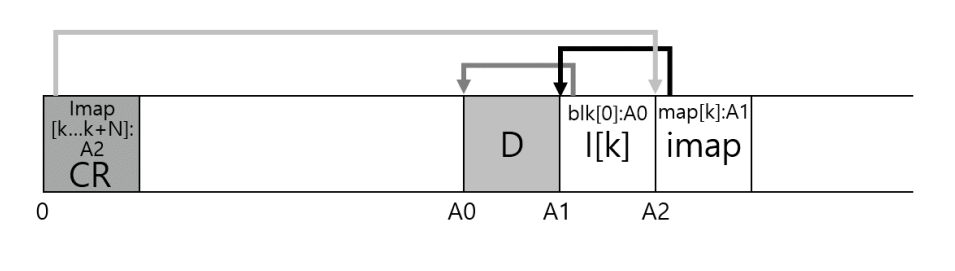

    - 아이노드 맵 조각 -> 아이노드들의 주소 -> 파일 / 디렉터리

### 46-7. 디스크에서 읽기: 요약

- **디스크에서 파일을 읽는 과정**

    1. 체크포인트 영역을 읽는다.

    2. 아이노드 맵 전체를 읽어서 캐시한다.

    3. 파일의 아이노드 번호를 구한다.

    4. 아이노드 맵에서 최신 아이노드를 읽어들인다.

    5. 포인터를 따라서 파일을 찾는다.

### 46-8. 디렉터리 관리 방법은?

- **LFS에서 디렉터리 데이터를 어떻게 저장할까?**

    - 디렉터리는 매핑 정보(이름과 아이노드 번호)로 구성되어 있다.

    - LFS에선 파일을 생성할때 파일을 가리키는 디렉터리 데이터와 아이노드도 같이 써야 한다.

    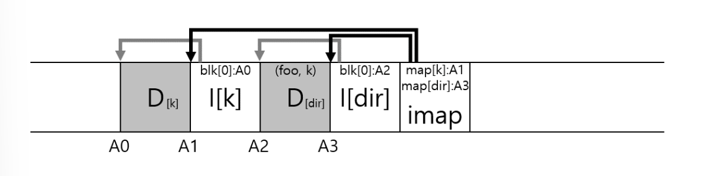
    <br>

    - **디렉터리에 존재하는 파일을 읽는 과정**

        1. 아이노드 맵에서 디렉터리 dir의 아이노드 위치 파악

        2. 디렉터리 데이터의 위치를 얻기 위해 아이노드를 읽는다.

        3. 디렉터리 데이터에서 파일명과 아이노드 번호 매핑 정보를 파악

        4. 아이노드 번호를 통해 아이노드 맵을 다시 조회

        5. 파일 데이터 블럭을 읽는다.

    - `재귀 갱신 문제(recursive update problem)`

        - 원래 위치에 덮어쓰기를 하지 않고 갱신 내용을 새로운 위치에 갱신하는 파일 시스템에서 동일하기 발생하는 문제
    
        - 디렉터리 항목들이 아이노드 위치를 직접 가리키도록 설계되었다면, 아이노드의 위치가 변경되면 디렉터리의 데이터 블럭도 갱신되어야 한다.

        - 이를 아이노드 맵을 통해 해결

### 46-9. 새로운 문제: 가비지 컬렉션

- LFS는 갱신된 파일을 새로운 위치에 쓴다.

- 쓰기 동작을 효율적으로 수행하기 위해서지만, 예전 값들이 디스크에 계속 남아 있다. ( = `가비지` ) 

- **구 버전의 아이노드와 데이터 블럭 등을 어떻게 할까?**

    - `버전 파일 시스템(versioning file system)`

        -파일의 구 버전들을 관리하는 파일 시스템

    - `가비지 컬렉션`

        - 최신 버전만 유지하고 이전 버전의 데이터와 아이노드 등 자료구조를 찾아 제거

        - 빈 디스크 블럭들은 추후 쓰기 요청에 사용

        - LFS는 이 방식을 채택

- **LFS의 가비지 컬렉터**

    - 세그먼트 단위로 동작

    - 쓰기 작업의 효율성을 위해 큰 공간 단위로 공간을 해제

    - **작업 방식**

        - 주기적으로 오래된 세그멘트들을 읽은 후, 해당 세그멘트들에서 최신 블럭들의 개수를 파악

        - 최신 블럭들을 새로운 세그멘트로 이동

        - 최신 블럭 이전 후 해당 세그멘트는 빈 공간으로 표시

    - 2가지 문제점

        1. LFS가 세그멘터 내 어떤 블럭이 최신인지 어떻게 알 수 있는가?

        2. 가비지 컬렉터는 얼마나 자주 실행되어야 하고 몇 개의 세그멘트를 가비지 컬렉션해야 하는가?

### 46-10. 블럭의 최신 여부 판단

- `세그멘트 요약 블럭(segment summary block)`

    - LFS는 각 데이터 블럭에 대해 파일의 아이노드 번호와 오프셋을 저장한다.

- **세그멘트 요약 블럭을 통한 유효성 여부 메커니즘**

    - 세그멘트 요약 블럭에서 아이노드 번호와 오프셋 파악

    - imap에서 아이노드 번호의 위치를 찾고, 디스크에서 해당 위치를 읽는다.

    - 아이노드를 이용해 오프셋에 해당하는 블럭의 디스크 위치를 찾는다.

    - 이떄 파악된 위치가 일치하면 유효한 블럭, 일치하지 않으면 유효하지 않다.

    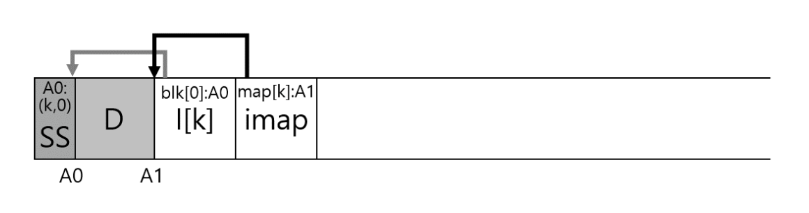
    <br>

- **버전 번호를 증가시키고 기록하는 방식**

    - 파일을 truncate나 삭제했을 때, 버전 번호를 증가시켜 해당 번호를 imap에 기록하는 방식

    - 디스크 상의 버전 번호와 imap의 버전 번호를 비교하여 과정을 단축시킬 수 있다.

### 46-11. 정책: 어떤 블럭을 언제 정리하는가

- **가비지 컬렉션 시기를 정하는 방식**

    1. 주기적으로 수행

    2. 유휴 시간에 하는 방법

    3. 디스크가 가득 차서 어쩔 수 없을 때

- **초기 가비지 컬렉션할 블럭 선정 방식**

    - 세그멘트를 `핫`, `콜드`로 구분

        - 핫 : 해당 세그멘트의 내용이 빈번하게 갱신되는 세그멘트

        - 콜드 : 핫과 반대로 내용이 갱신되지 않는 세그멘트

    - 콜드 세그멘트는 자주, 핫 세그멘트는 긴 간격을 클리닝하는 것이 좋다고 판단

### 46-12. 크래시로부터 복구와 로그

- LFS가 디스크에 쓰는 도중 시스템 크래시가 발생하면 어떻게 되는가?

    - 세그멘트를 쓸 때

        - 약 30초마다 체크포인트 영역 갱신

        - `롤 포워드(roll forward)`

            - 수초간의 갱신 내용들이 손실되는 것을 방지하기 위한 기법

            - 체크포인트 영역을 읽어들여 세그멘트 리스트의 마지막 세그멘트 위치 파악

            - 세그멘트 포인터로 체크포인트가 가리키는 마지막 세그멘트를 읽어 갱신

            - 세그멘트 리스트를 순회하여, 마지막 체크포인트 이후 데이터와 메타데이터를 복구

    - 체크포인트 영역을 갱신할 때

        - 체크포인트 영역을 원자적으로 갱신하기 위해 LFS는 2개의 체크포인트 영역을 둔다.

        - 체크포인트 영역을 디스크 양 끝에 위치시키고, 교대로 갱신한다.

        - **체크포인트 갱신 과정**

            1. 체크포인터 헤더(현재 시간 값을 포함)를 기록

            2. 체크포인트 영역에 내용 작성

            3. 체크포인트 여역의 마지막 블럭을 갱신(현재 시간값 포함한 정보)

        - 헤더의 시간 값과 마지막 블럭의 시간 값을 비교해 **헤더값이 크다면** 크래시가 발생한 것으로 판단한다.

### 46-13. 요약

- `쉐도우 페이징`

    - 디스크에 사용되지 않은 부분에 쓰고, 나중에 오래된 것들을 가비지 컬렉션해서 공간을 확보하는 방법

## 47. 데이터 무결성과 보호

- `데이터 무결성`, `데이터 보호`

    - 저장 시스템에서 데이터를 읽었을 때 그 데이터가 처음에 썼던 것과 동일하다는 것을 보장하는 기술

> **핵심 질문**  
> 데이터 무결성을 어떻게 보장하는가

### 47-1. 디스크 오류 모델

- 현대 디스크들은 정상적으로 동작하는 것처럼 보이지만 블럭들을 읽는데 실패하는 경우가 있다.

- **2가지 단일-블럭 오류**

    1. `숨어있는 섹터 에러(Latent sector error, LSE)`

        - 디스크 섹터 또는 섹터 그룹이 어떤 이유로든 손상되었을 때 발생

        - ex) 헤드 크래시, 강한 방사선

        - **에러 정정 코드(error correcting codes, ECC)**

            - 디스크 상에 있는 블럭의 비트가 괜찮은지 판단, 혹은 고치기도 한다.

        - 비트의 상태가 좋지 않은데 해당 에러를 고칠 충분한 정보가 없을 경우, 비트 호출 시 디스크에서 에러를 반환

    2. `블럭 손상(block corruption)`

        - 디스크의 손상 여부를 인식할 수 없게 내용이 **손상** 된 경우

        - **예시**

            - 버그가 있는 디스크 펌웨어 떄문에 잘못된 위치에 쓰기를 한 경우

            - 전송 버스 상의 오류로 호스트에서 디스크로 전송되는 도중 블럭이 손상된 경우( = `조용한 오류` )

    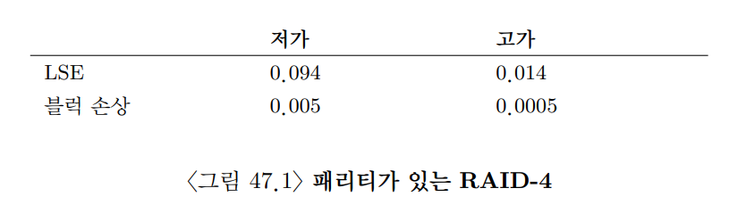
    <br>

    - 2종류의 오류가 얼마나 발생하는지 보여주며, 더 좋은 드라이브가 해당 오류의 발생 빈도를 낮춘다.

    - **LSE의 경우**
    
        - 하나 이상의 LSE를 갖고 있는 고가의 드라이브들은 저가의 드라이브들처럼 추가적인 에러를 만들어 낸다.
        
        - 대부분의 드라이브들의 연간 에러율은 둘째 해에 증가한다.
        
        - LSE는 디스크의 크기에 비례하여 증가한다.

        - LSE를 갖고 있는 대부분의 디스크는 50개 미만의 LSE를 갖고 있다.
        
        - LSE를 갖고 있는 디스크들은 추가적인 LSE를 만들어 낼 확률이 있다.
        
        - 공간과 시간 지역성이 상당히 두드러진다.
        
        - 디스크를 지우는 것이 유용하다 (이것으로 대부분의 LSE를 발견할 수 있다).

    - **섹터 손상**

        - 같은 급의 드라이브들이라고 하더라도 모델에 따라서 손상 확률의 차이가 크다.

        - 사용 연한에 따른 영향은 모델에 따라 다르다.

        - 워크로드와 디스크의 크기는 섹터 손상 빈도에 큰 영향이 있다.

        - 섹터 손상이 발생한 대부분의 디스크는 단지 몇 개의 손상된 부분을 갖고 있다.
        
        - RAID로 묶인 디스크들 간이나 하나의 디스크에 있는 손상은 독립적이지 않다.
        
        - LSE와는 연관성이 약하다.

### 47-2. 숨어있는 섹터 에러(Latent Sector Error)

> **핵심 질문**
> 숨어있는 섹터 에러를 어떻게 처리할까

- LSE가 발생했을 때 RAID의 경우, 사본을 통해 리턴하거나 패리티 그룹 내의 다른 블럭들을 활용하여 해당 블럭을 재생성한다.

- 중복 정볼르 이용한 복구 기법들이 다수 존재해, 복구에 문제가 없다.

- RAID-4/5시스템의 경우, 하나의 디스크가 완전히 고장나면서 다른 디스크에서 LSE가 발생하면 문제가 발생한다.

    - 하나의 디스크가 고장나면 다른 디스크드을 읽어 빠진 값을 다시 계산해 **디스크 재구성** 을 시도한다.

    - 재구성 중 다른 디스크들 중 하나에 LSE를 만나게 되면 재구성에 실패한다.

    - **해결 방법**

        - NetApp : RAID-DP

            - 2개의 패리티 디스크를 사용

            - 재구성 도중 LSE가 발생하면 추가적인 패리티가 블럭을 재구성하는데 도움을 준다.

            - 2개의 패리티 블럭을 유지하는 것은 큰 비용을 부담하며, 이를 로그 기반 구조로 완화했다.

### 47-3. 손상 검출: 체크섬

> **핵심 질문**  
> 어떻게 데이터가 손상이 되어도 무결성을 유지할까

- `체크섬(checksum)`

    - 데이터 청크를 입력하여 함수 값을 계산, 결과는 데이터 내용에 대한 요약 정보

    - 데이터의 손상이나 변경 여부를 시스템이 판단할 수 있도록 하는 것이 목적

    - 저장된 데이터로부터 계산한 현재의 체크섬과 저장 장치에 기록되어 있는 체크섬 값이 같은지 확인

- **널리 사용되는 체크섬 함수**

    - 다양한 체크섬 함수들이 존재하며, 각각의 보호 강도와 연산 속도가 상이하다.

    1. XOR 연산

        - 각 데이터 블럭의 청크를 XOR연산하여 최종적으로 전체 블럭을 대표하는 XOR 값을 생성

        - 체크섬을 계산하는 각 열에서 두 개의 값이 변하면 손상을 검출할 수 없다.

    2. 덧셈

        - 각 데이터 청크에 대해서 2의 보수 덧셈을 하고 만약 오버플로우가 발생하면 무시한다.

        - 데이터가 쉬프트된 경우에는 발견 못할 수 있다.

    3. Fletcher checksum

        - 2개의 체크 바이트, s1과 s2의 계산이 필요한 방법

    4. Cyclic Redundancy Check(CRC)

        - 이진 나머지 연산

        - 상당히 효율적으로 처리할 수 있어 네트워크 분야에선 인기가 있다.

- 어떤 방식이 사용되든 완벽한 체크섬은 없다.

    - `충돌(collision)`

        - 전혀 다른 내용을 가진 블럭들이 동일한 체크섬을 가질 수 있다.

- **체크섬의 배치도**

    - 기본적인 방식 : 각 디스크 섹터에 체크섬을 같이 저장하는 방식

    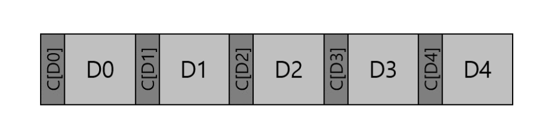
    <br>

    - 체크섬은 보통 작다(4~8 바이트)

    - 디스크는 섹터 크기나 그 배수로만 쓰기가 가능하기 때문에 해당 방식은 문제가 있다.

    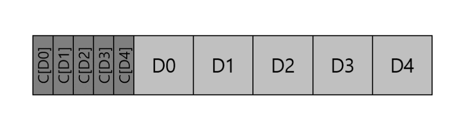
    <br>

    - n개의 체크섬들을 모아서 한 섹터에 저장하고 그 뒤를 이어 데이터 블럭을 배치

        - 모든 디스크에 적용이 가능하지만 효율이 상대적으로 떨어진다.

### 47-4. 체크섬의 활용

- 블럭을 읽을 때면 사용자는 디스크에서 **체크섬** 을 읽는다.

    - **저장된 체크섬(stored checksum)** : 디스크에 저장된 체크섬

- 사용자는 해당 블럭으로부터 체크섬 값을 계산한다.

    - **계산된 체크섬(computed checksum)**

- 사용자는 저장된 체크섬과 계산된 체크섬을 비교한다.

    - 동일할 경우, 손상없이 안전하게 리턴

    - 다르다면 손상이 발생했음을 나타낸다.

- 손상되었을 경우, 복사본을 대신 사용하거나 에러를 리턴한다.

### 47-5. 새로운 문제: 잘못된 위치에 기록

- 잘못된 위치에 기록(misdirected write)

    - 디스크와 RAID에서 발생하는 현상

    - 디스크에 데이터를 올바르게 썼지만 잘못된 위치에 쓰는 현상

    > **핵심 질문**  
    > 잘못된 위치에 기록하는 문제를 어떻게 해결할까

    - 해법

        - 각 체크섬에 추가적인 정보를 더한다. ( = `물리적 식별자(물리적 ID)` )

        - ex) 디스크 번호, 섹터 번호

### 47-6. 마지막 문제: 기록 작업의 손실

- 상위 계층에서 쓰기가 완료되었다고 알리지만 실제로 저장되지 않는 문제

> **핵심 질문**  
> 기록 작업의 손실 문제를 어떻게 다룰까

- 해법

    - `쓰기 검증(write verify)`, `쓰기 후 읽기(read-after-write)`

        - 쓰기를 수행한 후 즉시 그 값을 다시 읽는 것을 통해 시스템은 데이터가 디스크 표면에 잘 도착했는지 알 수 있다.

        - 느린 쓰기 동작을 완료하기 위해 I/O의 수를 2배로 늘린다.

    - Sun 사의 `Zettabyte 파일 시스템(ZFS)`

        - 파일 블럭들의 체크섬을 아이노드와 간접 블럭에 저장

        - 데이터 블럭에 대한 쓰기가 손실되었더라도 아이노드 내의 체크섬은 갱신되므로, 예전의 데이터와 해당 블럭에 대한 체크섬이 일치하지 않게 된다.

### 47-7. Scrubbing

- 체크섬들은 언제 검사할까?

    - **디스크 다시 읽기(disk scrubbing)**

        - 주기적으로 시스템의 모든 블럭들을 읽어서 체크섬이 여전히 유효한지 검사

        - 디스크 시스템은 특정 데이터의 모든 사본이 모두 손상되는 확률을 줄인다.

        - 보통 매일 밤 혹은 매주 데이터를 검사한다.

### 47-8. 체크섬 오버헤드

- 데이터 보호를 위해 체크섬을 사용하는데 드는 비용

    - **공간 오버헤드**

        - 디스크
         
            - 디스크 상에 체크섬을 저장하기 위한 공간이 필요

            - 이에 따라 사용자가 저장할 수 있는 공간이 줄어들게 된다.

        - 시스템 메모리

            - 데이터 접근시 메모리에 데이터와 체크섬을 읽어들일 공간이 필요

            - 체크섬이 메모리에서 즉시 제거되는 경우 문제가 되지 않지만, 반대의 경우 작은 용량이지만 메모리 필요량이 증가한다.

    - **시간 오버헤드**

        - CPU
        
            - CPU에 데이터를 저장할 때, 각 블럭의 체크섬을 연산

            - CPU에 데이터를 접근할 때, 각 블럭의 체크섬을 연산

            - CPU 오버헤드를 줄이기 위해 사용하는 방법

                - 체크섬 연산과 데이터 복사를 하나의 연속적인 작업으로 처리하는 것

- 체크섬 기법에 따라 추가적인 I/O를 유발할 수 있다.

    - 체크섬이 데이터와 구분되어 저장된 경우

        - 설계를 통해 감소시킬 수 있음.

    - 백그라운드에서 다시 읽기(scrubbing)를 수행하는 경우

        - 다시 읽기 수행 시점을 적절히 조절하여 영향을 줄일 수 있음.

        
        