# 가상화(Virtualization)

## 7. 프로세스의 개념

`프로세스` : 일반적으로 실행 중인 프로그램.

   - `프로그램` : 디스크 상에 존재하며 실행을 위한 명령어와 정적 데이터의 묶음

> **핵심 질문**  
> CPU가 여러 개 존재한다는 환상을 어떻게 제공하는가?

> **답변**  
> 운영체제는 **CPU 가상화**를 통해 환상을 만들어낸다. 

`시분할(time sharing)` : 하나의 프로세스를 실행하고, 얼마 후 중단시킨 뒤 다른 프로세스를 실행하는 작업을 반복하면서 실제 하나 또는 소수의 CPU로 여러 개의 가상 CPU가 존재하는 듯한 환상을 만들어내는 기법으로 **CPU 가상화의 핵심**.

`공간 대응(space sharing)` : 시분할에 대응하는 개념으로, 예를 들어 디스크는 자연스럽게 공간을 분할할 수 있는 자원으로 블럭이 하나의 파일에 할당되면 파일을 삭제하기 전에는 다른 파일이 할당될 가능성이 낮아진다.

- **CPU 가상화를 잘 구현하기 위한 조건**
    - 저수준의 도구 - `메커니즘(필요한 기능을 구현하는 방법이나 규칙)`
        - ex : 문맥 교환(Context Switch)
    - 고차원적인 지능 - `정책(운영체제 내에서 어떤 결정을 내리기 위한 알고리즘)`
        - ex : 스케줄링 정책(Scheduling Policy)

### 7-1. 프로세스의 개념

- 프로세스의 구성요소를 이해하기 위해서는 **하드웨어 상태**를 이해해야 한다.

- **프로세스에서 중요한 하드웨어 구성 요소**

    - `메모리(address space)` : 명령어, 실행 프로그램의 I/O 데이터 등이 저장되는 요소.

    - `레지스터` : 명령어들이 읽거나 갱신하는 요소.
    
        - 프로그램 카운터(=명령어 포인터, PC) : 프로그램이 어느 명령어를 실행 중인지를 알려주는 레지스터
            
        - 스택 포인터, 프레임 포인터 : 함수의 변수와 리턴 주소를 저장하는 스택을 관리할 때 사용하는 레지스터


### 7-2. 프로세스 API

- **운영체제에서 기본적으로 제공하는 API**

    - `생성(Create)` : 새로운 프로세스를 생성하는 인터페이스

        - 쉘에 명령어를 입력하거나, 아이콘을 더블클릭하여 프로그램을 실행시키면 운영체제는 새로운 프로세스를 생성한다.

    - `제거(Destroy)` : 프로세스를 강제로 제거할 수 있는 인터페이스

    - `대기(Wait)` : 프로세스의 실행 중지를 기다릴 필요가 있기에 여러 종류의 대기 인터페이스가 제공됨.

    - `각종 제어(Miscellaneous Control)` : 프로세스의 제거, 대기 이외에 여러 가지 제어 인터페이스

        - ex : 프로세스를 일시정지하거나 재개하는 기능

    - `상태(Status)` : 프로세스 상태 정보를 얻어내는 인터페이스

### 7-3. 프로세스 생성

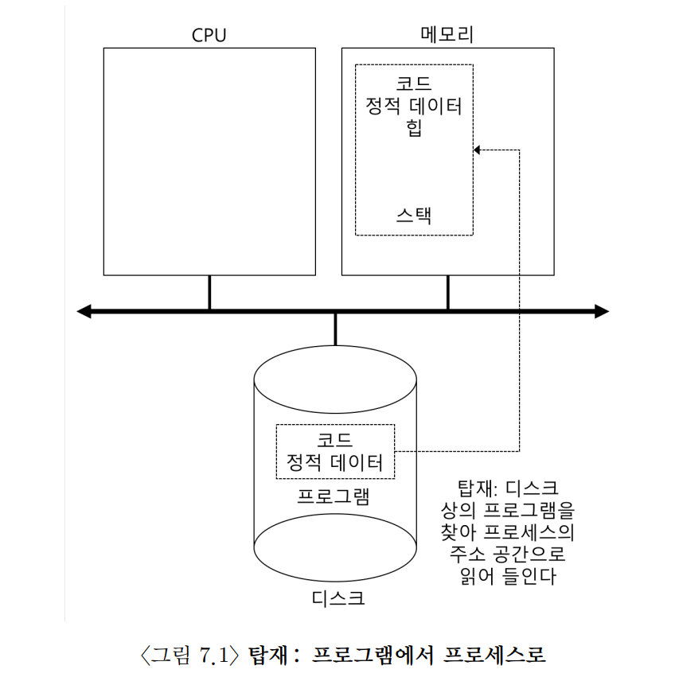

<br>

- 초기 운영체제들은 프로그램 실행 전에 코드와 데이터를 모두 메모리에 탑재했다.

- 현재 운영체제들은 필요할 때 필요한 부분만 메모리에 탑재한다.

    - 코드와 데이터의 탑재를 늦추기 위해서 `페이징(Paging)`과 `스와핑(swapping)`이 사용됐다.

- 일정량의 메모리가 프로그램의 `실행시간 스택 용도(stack)`로 할당되어야 한다.

    - 스택에는 `함수 호출 정보, 지역 변수, 리턴 주소` 등이 저장된다.

- 운영체제는 `힙(heap)`을 위한 메모리 영역을 할당한다.

    - 힙은 동적으로 할당된 데이터(ex : 연결 리스트, 해시 테이블, 트리 등 크기가 가변적인 자료 구조)를 저장하기 위해 사용된다.

- 운영체제는 입출력과 관계된 초기화 작업을 수행한다.

    - ex : Unix 시스템 기준으로 표준 입력(STDIN), 표준 출력(STDOUT), 표준 에러(STDERR) 장치에 해당하는 3개의 파일 디스크립터를 갖는다.

        - 해당 디스크립터들을 사용하여 프로그램은 터미널로부터 입력을 읽고, 화면에 출력하는 작업을 쉽게 한다.

### 7-4. 프로세스 상태

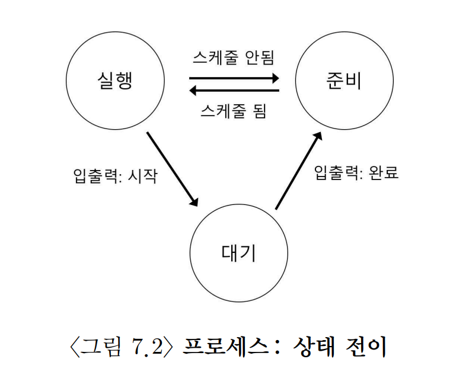

<br>

- 프로세스는 3가지 상태로 존재할 수 있다.

    - `실행(Running)` : 프로세스가 명령어를 실행하고 있는 상태

    - `준비(Ready)` : 프로세스를 실행할 준비가 되어있지만 운영체제가 다른 프로세스를 실행하고 있는 등의 다른 이유로 대기 중인 상태

    - `대기(Blocked)` : 프로세스가 다른 사건을 기다리는 동안 프로세스의 수행을 중단시키는 연산.

        - ex : 프로세스가 입출력 요청을 했을 때, 입출력이 완료될 때까지 대기 상태가 되고, 다른 프로세스가 실행 상태가 된다.


- **각 프로세스의 상태 전이 예시**

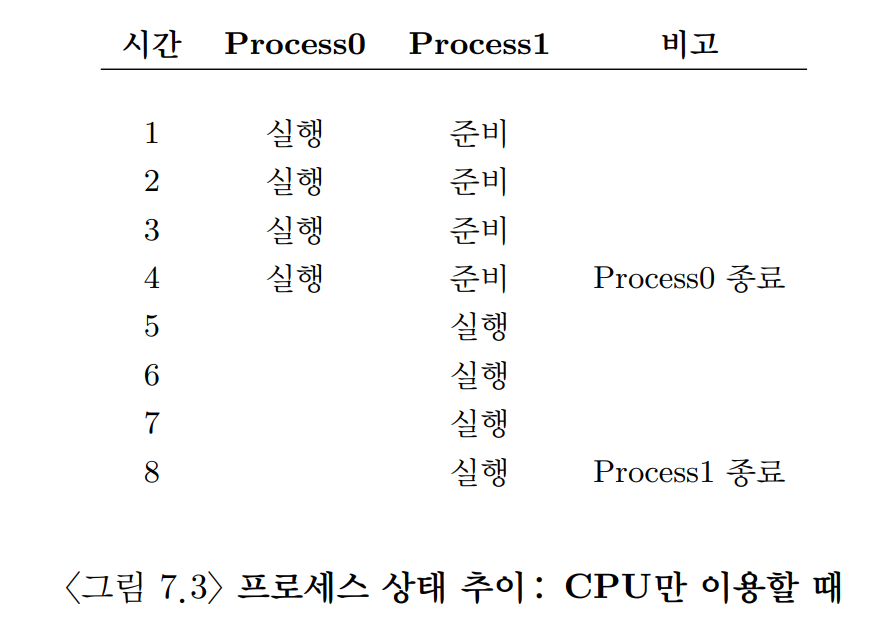

<br>

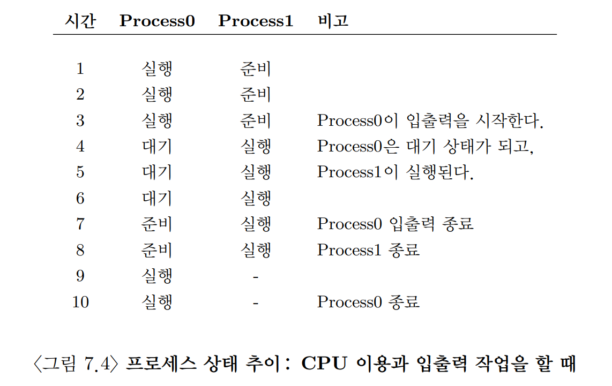

<br>

    - 운영체제는 스케줄러를 통해 상태 전이를 결정한다.

### 7-5. 자료구조

- 운영체제도 일종의 프로그램으로 다양한 정보를 유지하기 위한 자료 구조를 가지고 있다.

    - ex : 프로세스 리스트 - 프로세스 상태를 파악하기 위해 준비 상태의 프로세스 자료 구조

    - ex : 어느 프로세스가 실행 중인지를 파악하기 위한 부가적인 자료 구조

## 8. 프로세스 API

### 8-1. fork() 시스템 콜

`fork()` : 프로세스 생성

```cpp
#include <stdio.h>
#include <stdlib.h>
#include <unistd.h>

int main(int argc, char *argv[])
{
    printf("hello world (pid:%d)\n", (int) getpid());
    int rc = fork();
    if(rc < 0) {        // fork 실패: 종료
        fprintf(stderr, "fork failed\n");
        exit(1);
    } else if(rc == 0) {    // 자식(새 프로세스)
        printf("hello. I am child (pid:%d)\n", (int) getpid());
    } else {                // 부모 프로세스는 이 경로를 따라 실행한다(main)
        printf("hello. I am parent of %d (pid:%d)\n", (int) rc, (int) getpid());
    }

    return 0;
}
```

```
# 호출 결과
prompt> ./p1
hello world (pid:29146)
hello. I am parent of 29147 (pid:29146)
hello. I am child (pid:29147)
```

- 자식 프로세스는 **fork()** 를 호출하면서부터 시작된다. 
- 자식 프로세스는 자신의 주소 공간, 레지스터, PC 값을 갖는다.
- **fork()** 로부터 부모 프로세스는 자식 프로세스의 pid를 반환값으로 받고, 자식 프로세스는 0을 반환값으로 받는다.
- 출력 결과는 항상 동일하지 않으며, 자식과 부모가 어떤 순서로 출력을 할 지 예측할 수 없다.
    - 이러한 `CPU 스케줄러의 비결정성`이 멀티 스레드 프로그램 실행 시 다양한 문제를 일으키게 된다.

### 8-2. wait() 시스템 콜

```cpp
#include <stdio.h>
#include <stdlib.h>
#include <unistd.h>
#include <sys/wait.h>

int main(int argc, char *argv[])
{
    printf("hello world (pid:%d)\n", (int) getpid());
    int rc = fork();
    if(rc < 0) {                // fork 실패: 종료
        fprintf(stderr, "fork failed\n");
        exit(1);
    } else if(rc == 0) {         // 자식(새 프로세스)
        printf("hello, I am child (pid:%d)\n", (int) getpid());
    } else {                    // 부모 프로세스는 이 경로를 따라 실행한다(main)
        int wc = wait(NULL);
        printf("hello, I am parent of %d (wc:%d) (pid:%d)\n", rc, wc, (int) getpid());
    }

    return 0;
}
```

```
# 호출 결과
prompt> ./p2
hello world (pid:29266)
hello, I am child (pid:29267)
hello, I am parent of 29267 (wc:29267) (pid:29266)
```

- **wait()** 를 호출하면 운영체제는 자식 프로세스가 종료될 때까지 부모 프로세스를 대기 상태로 전환한다.
- 부모가 먼저 실행되더라도 자식 종료 후 **wait()** 가 리턴되어 그 후에 부모 프로세스가 출력된다.
    
### 8-3. exec() 시스템 콜

- `exec()` : 자기 자신이 아닌 다른 프로그램을 실행할 때 사용하는 시스템 콜

    - 실행 파일의 이름과 약간의 인자가 주어지면 해당 실행 파일의 코드와 정적 데이터를 읽어 현재 실행 중인 프로세스의 코드 세그멘트와 정적 데이터 부분을 덮어쓴다.

    - 힙과 스택 및 프로그램 다른 주소 공간들로 새로운 프로그램의 실행을 위해 초기화된다.

    - 운영체제는 프로세스의 argv와 같은 인잘르 전달하여 프로그램을 실행시킨다.

    - 현재 실행 중인 프로그램에서 다른 프로그램으로 완전히 대체되는 것이며, exec() 시스템 콜이 성공한다면 기존 프로그램으로 리턴되지 않는다.

```cpp
#include <stdio.h>
#include <stdlib.h>
#include <unistd.h>
#include <string.h>
#include <sys/wait.h>

int main(int argc, char *argv[])
{
    printf("hello world (pid:%d)\n", (int) getpid());
    int rc = fork();
    if(rc < 0) {                // fork 실패함: exit
        fprintf(stderr, "fork failed\n");
        exit(1);
    } else if(rc == 0) {         // 자식(새 프로세스)
        printf("hello, I am child (pid:%d)\n", (int) getpid());
        char *myargs[3];
        myargs[0] = strdup("wc");       // 프로그램: "wc"(단어 세기)
        myargs[1] = strdup("p3.c");     // 인자: 단어 셀 파일
        myargs[2] = NULL;               // 배열의 끝 표시
        execvp(myargs[0], myargs);      // "wc" 실행
        printf("This shouldn't print out");
    } else {                    // 부모 프로세스는 이 경로를 따라 실행한다(main)
        int wc = wait(NULL);
        printf("hello, I am parent of %d (wc:%d) (pid:%d)\n", rc, wc, (int) getpid());
    }

    return 0;
}    
```

### 8-4. 왜 이런 API를?

- UNIX의 쉘을 구현하기 위해서는 `fork()`와 `exec()`을 분리해서 사용할 필요가 있다.

    - 쉘이 `fork()`를 호출하고 `exec()`를 호출하기 전에 코드를 실행할 수 있다.

    - 이떄 실행되는 코드가 프로그램의 환경을 설정하고, 다양한 기능을 준비한다.

### 8-5. 여타 API들

- `kill()` : 프로세스에게 **시그널(Signal)** 을 보내는 데 사용된다.

    - `시그널` : 프로세스를 중단시키고, 삭제하는 등의 작업에 사용된다.

- `ps` : 어떤 프로세스가 실행 중인지 알아보는 명령어

- `top` : 시스템에 존재하는 프로세스와 그 프로세스가 CPU 및 다른 자원들을 얼마나 사용하고 있는지 보여주는 명령어

## 9. 제한적 직접 실행 원리

- **CPU 가상화 기법 구현 시 고려해야 할 문제**

    - **성능 저하** : 시스템에 과중한 오버헤드를 주지 않으면서 가상화를 구현해야 한다.

    - **제어 문제** : CPU에 대한 통제를 유지하면서 프로세스를 효율적으로 실행해야 한다.

### 9-1. 기본 원리 : 제한적 직접 실행

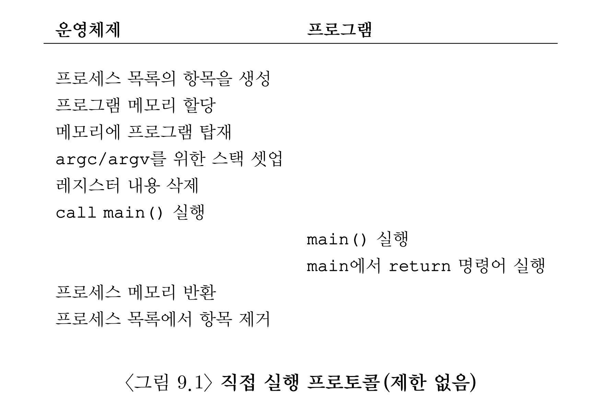

<br>

- `직접 실행` : 프로그램을 CPU 상에서 직접 실행하는 방식. 빠르게 실행할 수 있다는 장점이 있다.

    - **직접 실행에서 고려해야 할 문제**

        1. 프로그램이 운영체제가 원치않는 일을 하지 않는다는 보장

        2. 시분할 기법을 어떻게 구현할 수 있는가?

### 9-2. 문제점 1: 제한된 연산

> **핵심 질문**  
> 프로세스는 입출력 연산을 비롯한 다른 제한된 연산을 수행해야 하지만, 시스템에 대한 권한이 없기 때문에 제한된 연산을 수행할 수 없다. 이 때 운영체제와 하드웨어가 할 일은 무엇인가?

- `사용자 모드 ` : 응용 프로그램의 하드웨어 자원에 대한 접근 권한이 일부 제한된 모드

- `커널 모드` : 하드웨어 자원에 대한 접근 권한이 부여된 모드

- 사용자 프로세스가 디스크 읽기와 같은 특권 명령어를 실행해야 할 때는 어떻게 해야하는가?

    - 제한 작업의 실행을 허용하기 위해서 하드웨어는 프로세스에서 **시스템 콜(파일 시스템 접근, 프로세스 생성 및 제거, 다른 프로세스와의 통신 및 메모리 할당 등)** 을 제공한다.

    - 시스템 콜을 실행하기 위해 프로그램은 `trap`, `return-from-trap` 특수 명령어를 실행한다.

        - `trap` : **사용자 모드에서 커널 모드로 전환**하는 명령어

        - `return-from-trap` : **커널 모드에서 사용자 모드로 전환**하는 명령어

        - 주의 : `trap` 수행 시, 사용자 프로세스로 다시 리턴할 수 있도록 필요한 레지스터를 저장해야 한다.

            - 각 프로세스는 `커널 스택(kernal stack)`을 가지며, 레지스터는 여기에 저장된다.

- 커널은 부팅 시 `트랩 테이블(trap table)`을 만들고 이를 이용해 시스템을 통제한다.

    - 운영체제는 인터럽트가 발생하거나 프로그램이 시스템 콜을 호출하면 특정 명령어를 사용해 하드웨어에게 `트랩 핸들러(trap handler)`의 위치를 알려준다.

<br>

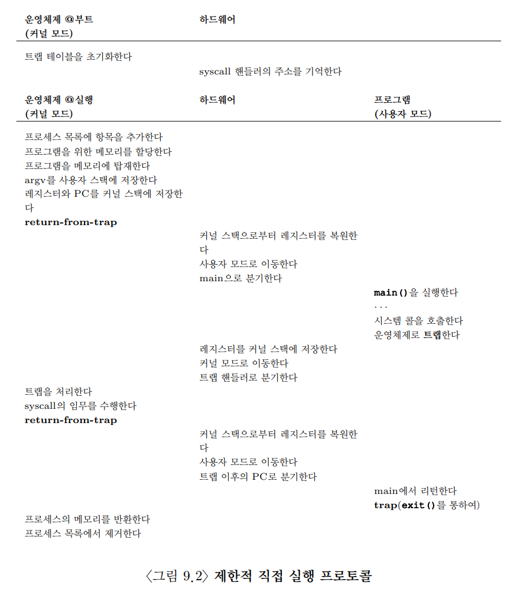

<br>

- **LDE 프로토콜 정리**

    - 전반부 : 부팅 시 커널은 트랩 테이블을 초기화, CPU는 나중에 사용하기 위해서 테이블의 위치를 기억한다.

    - 후반부 : 프로세스를 실행할 때 return-from-trap을 이용해 사용자 프로세스를 시작할 때 몇 가지 작업을 수행한다.

### 9-3. 문제점 2: 프로세스 간 전환

> **핵심 질문**  
> 운영체제는 어떻게 CPU를 다시 획득하여 프로세스를 전환할 수 있는가?

- **협조 방식: 시스템 콜 기다리기**

    - `협조` : 너무 오랫동안 실행할 가능성이 있는 프로세스는 운영체제가 다른 작업을 실행할 결정을 할 수 있도록 주기적으로 CPU를 포기할 것을 가정하는 방식

        - 이 방식에서 대부분의 프로세스는 **yield 시스템 콜** 을 호출하여 CPU의 제어권을 운영체제에게 넘겨준다.

    - 프로그램이 비정상적인 행위를 하게 되면 운영체제에게 제어가 넘어가 해당 행위를 하는 프로세스를 종료할 수 있다.

    - 협조 방식의 문제점 : 운영체제는 시스템 콜이 호출되기를 기다리거나 불법적인 연산이 일어나기를 기다려서 CPU의 제어권을 획득한다.

- **비협조 방식: 운영체계가 전권을 행사**

    - 협조 방식에서 프로세스가 무한 루프에 빠졌을 경우 할 수 있는 일은 **재부팅** 하는 것이다.

    > **핵심 질문**  
    > 프로세스가 비협조적인 상황에서도 CPU의 제어를 획득하는 방법은 무엇인가?

    - `타이머 인터럽트(timer interrupt)` : 타이머 장치로 미리 정해진 간격마다 인터럽트를 발생시키도록 프로그램하는 것.

        - 타이머 인터럽트를 통해 현재 수행 중인 프로세스를 중단하고 미리 구성된 `인터럽트 핸들러`를 실행시켜 CPU 제어권을 얻는 방식.

        - 운영체제는 타이머 인터럽트가 발생하면 실행해야 할 코드를 알려주어야 한다.

        - 하드웨어는 프로그램의 상태를 저장하여 return-from-trap 때 프로그램을 다시 시작할 수 있도록 해야 한다.

- **문맥의 저장과 복원**

    - 운영체제가 CPU 제어권을 획득하면 실행중인 프로세스를 계속 실행할건지 전환할 건지 결정한다. (= 스케줄러의 역할)

    - `문맥 교환(context switch)` : 현재 실행 중인 프로세스의 레지스터 값을 커널 스택 같은 곳에 저장하고 곧 실행될 프로세스의 커널 스택으로부터 레지스터 값을 복원하는 작업.
    
    <br>
    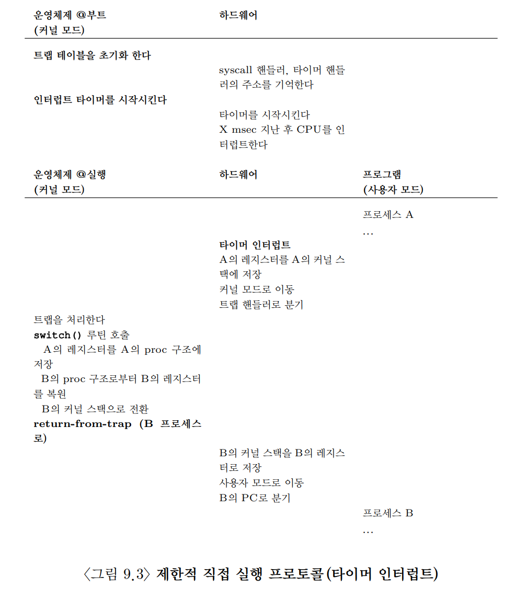
    <br>
    

### 9-4. 병행성이 걱정

- 운영체제는 인터럽트 또는 트랩을 처리하는 도중에 다른 인터럽트가 발생할 때 어떤 일이 생기는가에 대해 고민해야 한다.

    - 해법 : 인터럽트가 처리하는 동안 **인터럽트를 불능화** 시키는 것이다.

        - 이 때 오랫동안 불능화되지 않도록 하며, 동시에 접근하는 것을 방지하기 위해 많은 잠금(lock) 기법이 사용된다.

## 10. 스케줄링: 개요

### 10-1. 워크로드에 대한 가정

- `워크로드(workload)` : 일련의 프로세스들이 실행하는 상황

- **실행 중인 프로세스 혹은 작업에 대한 가정**

    1. 모든 작업은 같은 시간 동안 실행된다.
    2. 모든 작업은 동시에 도착한다.
    3. 각 작업은 시작되면 완료될 때까지 실행된다.
    4. 모든 작업은 CPU가 사용한다(즉, 입출력은 수행하지 않는다.)
    5. 각 작업의 실행 시간은 사전에 알려져 있다.

### 10-2. 스케줄링 평가 항목

- `스케줄링 평가 항목(scheduling metric)` : 워크로드에 대한 가정 이외에 스케줄링 정책의 비교를 위한 평가 항목.

    - 1. 반환 시간(turnaround time) : 작업이 완료된 시각에서 작업이 시스템에 도착한 시각을 뺀 시간을 정의.

        - 성능 측면에서의 평가 기준

    - 2. 공정성(fairness)

        - ex : Jain's Fairness Index

### 10-3. 선입선출

- `선입선출(FIFO)`, `선도착선처리(FCFS)` 스케줄링

    - 장점 : 단순하고 구현하기 쉽다.

    - 단점 : 먼저 도착한 프로세스의 반환 시간이 늦어지면 그만큼 뒤에 프로세스들도 영향을 받아 평균 반환 시간이 늘어난다.(= convey effect)

### 10-4. 최단 작업 우선

- `최단 작업 우선(SJF)` : 선입선출의 단점을 개선하는 원칙으로, 가장 짧은 실행 시간을 가진 작업을 먼저 실행시키는 원칙

    - 문제점 : 동시점에 도착한 작업들의 스케줄링은 가능하지만 임의의 시간에 도착하는 작업들에 대한 스케줄링은 고려하지 않는다.(=비선점형 스케줄러)

### 10-5. 최소 잔여시간 우선

- `최단 잔여시간 우선(STCF)`, `선점형 최단 작업 우선(PSJF)` : 새로운 작업이 시스템에 들어오면, 스케줄러는 남아 있는 작업과 새로운 작업의 잔여 실행 시간을 계산하고 그 중 가장 적은 실행 시간을 가진 작업을 스케줄링한다.

<br>
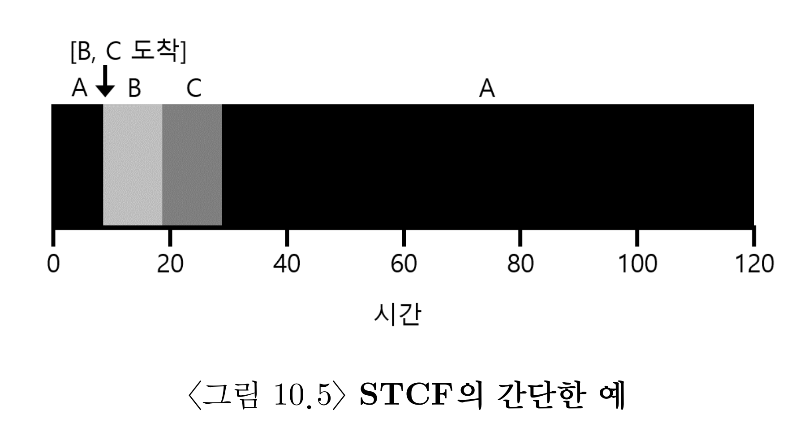
<br>

### 10-6. 새로운 평가 기준: 응답 시간

- `STCF`는 초기 스케줄링 알고리즘으로 의미가 있었지만, 시분할 컴퓨터의 등장으로 기준이 바뀌었다.

- `응답 시간(response time)` : 작업이 도착할 때부터 처음 스케줄 될 때까지의 시간으로 정의.

- 응답 시간이라는 평가 기준을 적용하게 되면서 STCF 알고리즘도 최적의 알고리즘이 될 수 없다.

### 10-7. 라운드 로빈

- `라운드 로빈(RR)` : 작업이 끝날 때까지 기다리지 않고, 일정 시간 동안 실행한 후 실행 큐의 다음 작업으로 전환하는 방식.

    - `타임 슬라이스(time slice)`, `스케줄링 퀀텀(scheduling quantum)` : 작업이 실행되는 일정 시간.

    - 타임 슬라이스의 길이 = 타이머 인터럽트 주기의 배수

    - 타임 슬라이스 길이를 짧게 지정하면 RR의 응답 시간이 줄어들지만, 문맥 교환 비용이 증가해 전체 성능에 영향을 미친다.

    - 문맥 교환 비용에는 레지스터를 저장/복원하는 작업, CPU 캐시, TLB, 분기 예측 등 다양한 작업 정보들을 갱신하는 비용을 말한다.

    - RR은 응답 시간 측면에선 우수하지만, 반환 시간 측면에선 FIFO보다 좋지 않아 절충안이 필요하다.

<br>
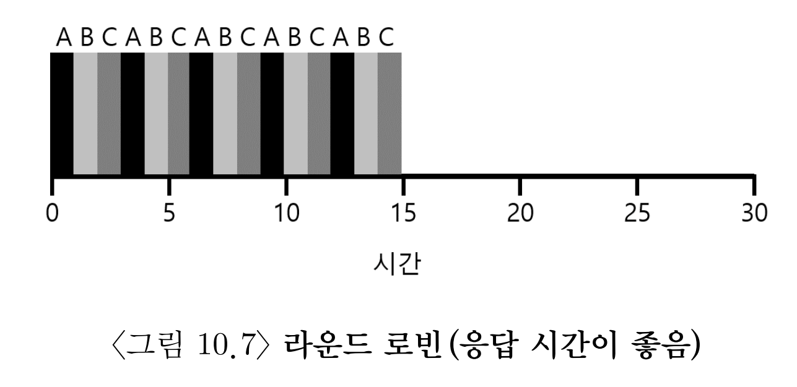
<br>

### 10-8. 입출력 연산의 고려

- 입출력 요청을 발생시킨 작업은 입출력 완료를 기다리며 CPU가 대기 상태로 들어간다.

- 이를 효율적으로 접근하기 위해서 입출력이 있는 작업은 입출력 요청을 기준으로 독립적인 작업들로 나눠서 스케줄링을 진행한다.

- 이렇게 하면 프로세스의 입출력이 끝나기를 기다리는 동안 CPU가 다른 프로세스에 의해 사용되어 `연산의 중첩`이 가능하다.

<br>
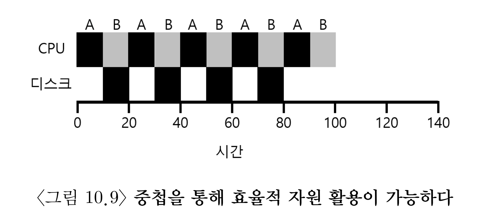
<br>

### 10-9. 만병통치약은 없다(No More Oracle)

- 사전에 알려진 작업 시간 길이가 없다면, SJF/STCF 알고리즘을 적용할 수 있을까?

- 응답 시간을 좋게 하기 위해 RR 스케줄러의 아이디어를 어떻게 포함시킬 수 있을까?

## 11. 스케줄링 : 멀티 레벨 피드백 큐

- `멀티 레벨 피드백 큐(Multi-level Feedback Queue, MLFQ)`

    - 해결하려고 했던 문제

        1. 짧은 작업을 먼저 실행시켜 반환 시간의 최적화

        2. 응답 시간의 최적화

    - 프로세스의 정보 없이 더 나은 스케줄링 결정을 하기 위한 방법

### 11-1. MLFQ: 기본 규칙

- MLFQ은 여러 개의 **큐** 로 구성되며, 각각 다른 **우선순위(priority level)** 가 배정된다.
    
    - 실행 준비된 프로세스는 이 중 하나의 큐에 존재한다.

    - 실행할 프로세스를 결정하기 위해 우선순위를 사용하며, 높은 우선순위 큐에 존재하는 작업이 선택되어 실행된다.

    - 큐에는 둘 이상의 작업이 존재할 수 있으며, 이들 사이에선 RR 스케줄링 알고리즘이 적용된다.

    - 작업 특성에 따라 동적으로 우선순위가 부여된다.

        - 높은 우선순위 작업 : 짧은 시간 안에 CPU를 사용하고 대기하는 작업

        - 낮은 우선순위 작업 : 오랫동안 CPU를 점유하고 있는 작업

    > **기본 규칙**   
    > 1. Priority(A) > Priority(B) 이면, A가 실행된다. (B는 실행되지 않는다.)  
    >     
    > 2. Priority(A) == Priority(B) 이면, A와 B는 RR 방식으로 실행된다.         

<br>
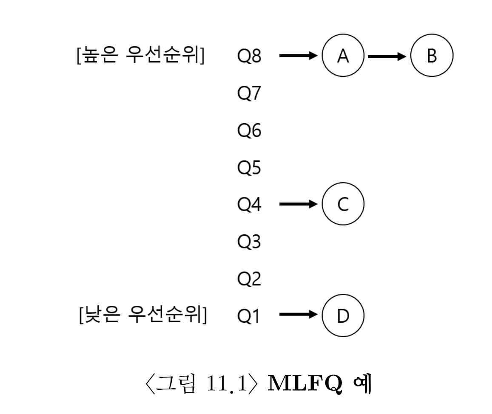
<br>

### 11-2. 시도 1: 우선순위의 변경

- **우선순위 조정 알고리즘을 위한 첫 시도**

    - **규칙 1**: 작업이 시스템에 진입하면, 가장 높은 우선순위, 즉 맨 위에 큐에 놓여진다.

    - **규칙 2**: 주어진 타임 슬라이스를 모두 사용하면 우선순위는 낮아진다. 즉 한 단계 아래 큐로 이동한다.

    - **규칙 3**: 타임 슬라이스를 소진하기 전에 CPU를 양도하면 같은 우선순위를 유지한다.

- 예 1: 한 개의 긴 실행 시간을 가진 작업

<br>
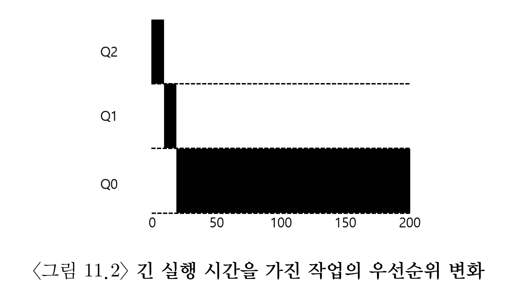
<br>

- 예 2: 짧은 작업과 함께

<br>
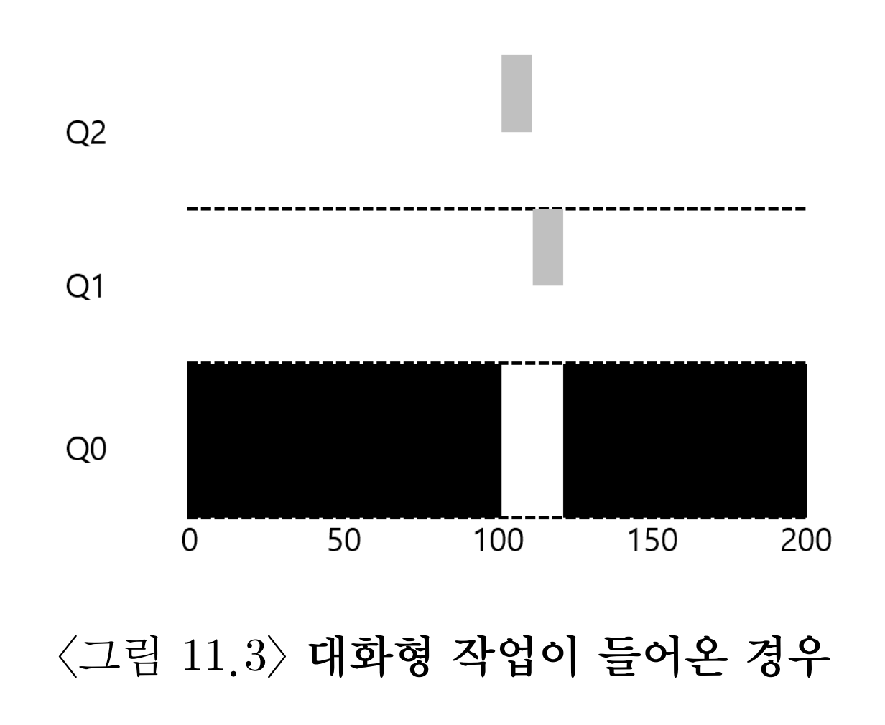
<br>

    - A(검은색) 작업은 오래 실행되는 작업으로 가장 낮은 우선순위 큐에서 실행되고 있다.

    - B(회색) 작업은 A 작업보다 뒤에 시작되었지만, 가장 높은 우선순위 큐에서 실행되서 먼저 실행된다.

    - 이러한 방식은 SJF와 근사하게 동작한다는 것을 확인할 수 있다.

- 예 3: 입출력 작업에 대해서는 어떻게?

<br>
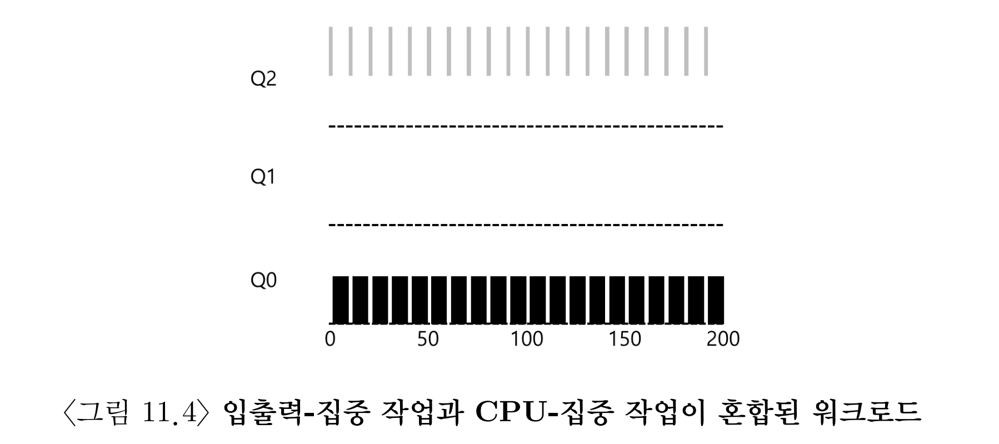
<br>

    - A(검은색)은 긴 배치형 작업으로 B와 CPU를 사용하기 전까지 낮은 우선순위 큐에서 실행된다.

    - B(회색)은 대화형 작업으로 입출력을 수행하기 전 1msec동안만 실행된다. 때문에 B는 항상 높은 우선순위 큐에 위치하게 된다.

- **현재 MLFQ의 문제점**

    1. 기아 상태(starvation) 발생

        - 너무 많은 대화형 작업이 존재하면, 긴 실행 시간 작업이 CPU를 할당받지 못해 계속 대기하는 현상이 발생할 수 있다.

    2. 취약점 공격

        - 타임 슬라이스가 끝나기 전 입출력 요청을 내려 계속 높은 우선순위를 유지하게 함으로써, CPU를 독점하는 현상이 발생할 수 있다.

    3. 프로그램은 시간 흐름에 따라 특성이 변할 수 있다.

        - CPU 위주 작업이 추후 대화형 작업으로 변하면, 다른 대화형 작업들과 같은 대우를 받을 수 없다.

### 11-3. 시도 2: 우선순위의 상향 조정

- `상향 조정(boost)`

    - **규칙 5**: 일정 시간 S가 지나면, 시스템의 모든 작업을 최상위 큐로 이동시킨다.

    - 최상위 큐에 존재하는 동안 작업은 다른 높은 우선순위 작업들과 라운드 로빈 방식으로 CPU를 공유해서 기아 상태를 방지한다.

    - CPU 위주의 작업이 대화형 작업으로 특성이 변할 경우 우선순위 상향을 통해 스케줄러가 변경된 특성에 적합한 스케줄링 방법을 적용한다.

    - 일정 시간 S는 부두 상수(voo-doo constants)로 적절한 값을 잘 선택해야 한다.

<br>
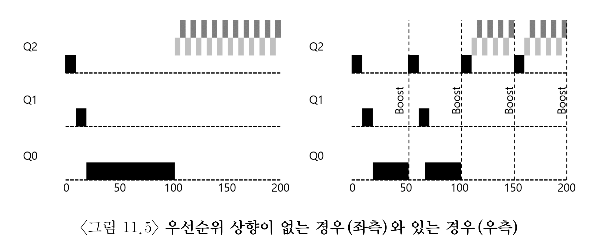
<br>

    - 긴 실행 시간 작업도 꾸준히 진행된다는 것을 보장할 수 있다.

### 11-4. 시도 3: 더 나은 시간 측정

- 스케줄러를 자신에게 유리하게 동작시키는 것을 어떻게 막을 수 있을까?

    - MLFQ의 각 단계에서 CPU 총 사용 시간을 측정하는 것으로 해결할 수 있다.

    - **규칙 4**: 주어진 단계에서 시간 할당량을 소진하면 (CPU를 몇 번 양도하였는지 상관없이), 우선순위는 낮아진다.

<br>
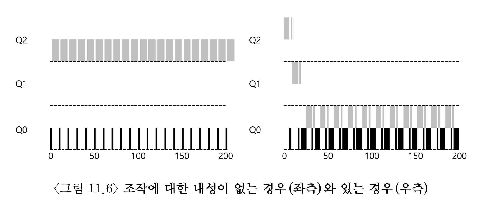
<br>

### 11-5. MLFQ 조정과 다른 쟁점들

- MLFQ 스케줄링에는 여러 쟁점들이 남아 있으며, 이들은 모두 워크로드에 대해 충분히 경험하고 계속 조정해 나가면서 균형점을 찾아야 한다.

- MLFQ 기법들은 큐 별로 타임 슬라이스를 변경할 수 있어, 보통 우선순위가 높은 큐일수록 더 짧은 타임 슬라이스를 갖는다.

- 참고할 만한 MLFQ 스케줄러 : Solaris, FreeBSD(감쇠-사용 알고리즘)

- 스케줄러는 다른 여러 기능을 제공한다.

    - 일부 스케줄러는 가장 높은 우선순위를 운영체제 작업을 위해 예약해둔다.

    - 일부는 사용자가 우선순위를 정하는 데 도움을 줄 수 있도록 허용한다.

## 12. 스케줄링: 비례 배분

- `비례 배분(Proprotional Share)`, `공정 배분(fair share)` : 반환 시간이나 응답 시간을 최적화하는 대신 스케줄러가 각 작업에게 CPU의 일정 비율을 보장하는 것이 목적이다.

- `추첨 스케줄링(lottery scheduling)` : 다음 실행될 프로세스를 추첨을 통해 결정한다. 더 자주 수행되어야 하는 프로세스에게 당첨 기회를 많이 준다.

> **핵심 질문**  
> 특정 비율로 CPU를 배분하는 스케줄러를 어떻게 설계할 수 있는가?

### 12-1. 기본 개념: 추첨권이 당신의 몫을 나타낸다

- `추첨권(티켓)` : 프로세스가 받아야 할 자원의 몫으로 프로세스가 소유한 티켓의 개수와 전체 티켓에 대한 비율이 자신의 몫을 나타낸다.

- 무작위성은 원하는 비율을 정확히 보장하지는 않지만, 장시간 실행될수록 원하는 비율에 달성할 가능성이 높아진다.

### 12-2. 추첨 기법

- `추첨권 화폐(ticket currency)` : 사용자가 추첨권을 자신의 화폐 가치로 자유롭게 할당할 수 있도록 허용한다. 

- `추첨권 양도(ticket transfer)` : 양도를 통해 프로세스는 일시적으로 다른 프로세스에게 추첨권을 넘겨줄 수 있다.

    ex : 클라이언트 프로세스는 서버에게 메시지를 보내 요청한다.

    -> 작업이 빨리 완료될 수 있도록 클라이언트는 서버에게 추첨권을 전달하고 서버가 자신의 요청을 수행하는 동안 서버의 성능을 극대화하려 한다.

    -> 요청이 완수되면 서버는 추첨권을 클라이언트에게 돌려준다.

- `추첨권 팽창(ticket inflation)` : 프로세스가 일시적으로 자신이 소유한 추첨권의 수를 늘리거나 줄일 수 있다.

    - 프로세스들이 서로 상호 신뢰할 때만 유용하다.

    - 어떤 프로세스가 더 많은 CPU 시간을 필요로 한다면 시스템에게 이를 알리는 방법으로 다른 프로세스들과 통신하지 않고 혼자 추첨권의 가치를 상향 조정한다.

### 12-3. 구현

- **필요한 요소** : 난수 발생기, 프로세스들의 집합을 표현하는 자료 구조, 추첨권의 전체 개수

```code
// counter: 당첨자를 발견했는지 추적하는 데 사용함
int counter = 0;

// winner: 0부터 총 추첨권의 수 사이의 임의의 값을 얻기 위해
int winner = getrandom(0, totaltickets);

// current: 작업 목록을 탐색하는 데 사용
node_t *current = head;

// 티켓 값 > winner를 만족할 때까지 반복
while (current) {
    counter = counter + current->tickets;
    if (counter > winner) 
        break;  // 당첨자 발견
    current = current->next;
}
// current는 당첨자를 가리킴: 당첨자가 실행될 수 있도록 준비
```

- 일반적으로 리스트를 내림차순으로 정렬하면 이 과정이 가장 효율적이지만, 정렬 순서가 정확성에 영향을 주지는 않는다.

### 12-4. 예제

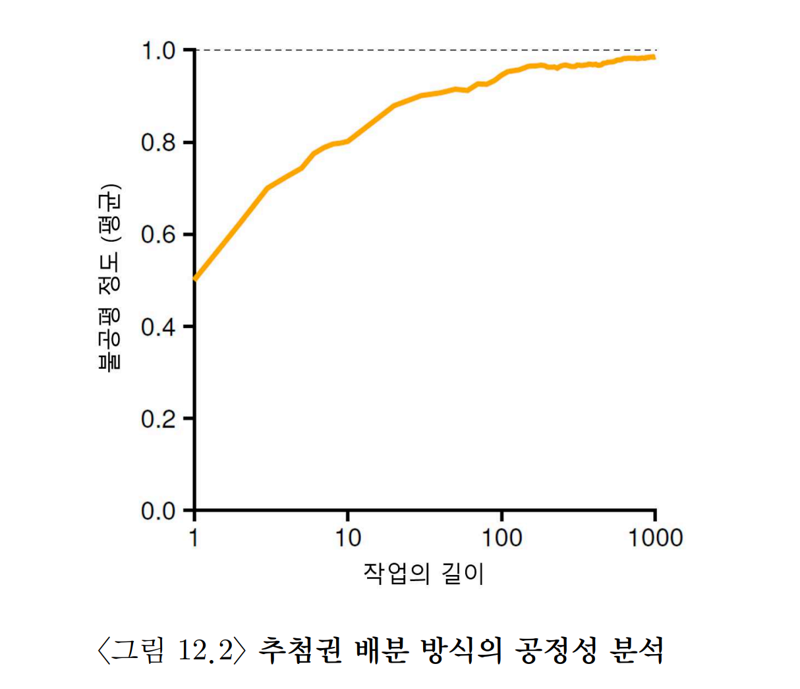
<br>

- 작업 길이가 길지 않은 경우, 평균 불공정 정도가 심각하며, 충분한 길이를 가져야 스케줄러가 원하는 결과에 가까워진다.

### 12-5. 추첨권 배분 방식

- 여전히 주어진 작업 집합에 대한 추첨권 할당 문제는 미해결 상태이다.

### 12-6. 왜 결정론적(deterministic)방법을 사용하지 않는가?

- `보폭 스케줄링(stride scheduling)` : 무작위성을 이용하면 정확한 비율을 보장할 수 없어 고안한 결정론적 공정 배분 스케줄러

    - `보폭(stride)` : 자신이 가지고 있는 추첨권 수에 반비례하는 값. 프로세스가 실행될 때마다 **pass** 라는 값을 보폭만큼 증가시켜 얼마나 CPU를 사용하였는지를 추적한다.

    - 스케줄러는 보폭과 pass 값을 사용해 가장 작은 pass 값을 가진 프로세스를 선택한다.

    - 프로세스를 실행시킬 때마다 pass 값을 보폭만큼 증가시킨다.

- 보폭 스케줄링은 각 스케줄링 주기마다 정확한 비율로 CPU를 배분할 수 있는데 추첨을 사용하는 이유가 무엇인가?

    - 추첨은 프로세스 상태(CPU 사용 현황, pass 값)를 유지할 필요가 없으며, 새 프로세스를 추가할 때 새 프로세스가 가진 추첨권의 개수, 전체 추첨권의 개수만 갱신하고 스케줄하면 되기 때문이다.

### 12-7. 요약

- 추첨, 보폭 스케줄링 모두 CPU 스케줄러로서 널리 사용되지 않다.

    - 입출력과 맞물렸을 때, 제대로 동작하지 않는다는 점이 이유 중 한 가지이다.

- 비례 배분 스케줄러는 추첨권 할당량을 비교적 정확하게 결정할 수 있는 환경에서 유용하게 사용된다.

## 13. 멀티프로세서 스케줄링 (고급)

> **핵심 질문**  
> 운영체제는 어떻게 작업을 여러 CPU에 스케줄 해야 하는가?

### 13-1. 배경: 멀티프로세서 구조

- 단일 CPU 시스템에는 **하드웨어 캐시** 계층이 존재한다.

    - 프로그램을 빠르게 실행하기 위해 존재한다.

    - 자주 접근하는 데이터를 캐시해 임시로 가져다 둠으로써 시스템은 크고 느린 메모리를 빠른 메모리처럼 보이게 한다.

    <br>
    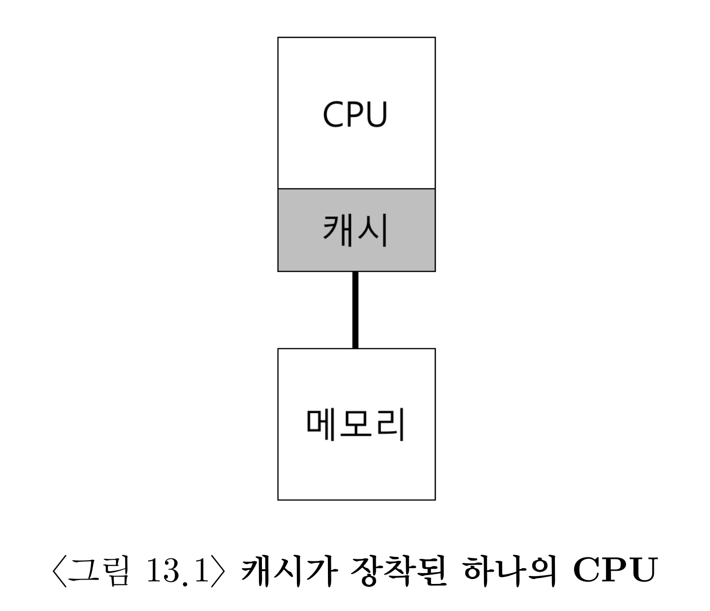
    <br>

- 캐시는 `지역성(locality)` 에 기반한다.

    - `시간 지역성(temporal locality)` : 데이터가 한 번 접근되면 가까운 미래에 다시 접근되기 쉽다는 원리.

    - `공간 지역성(spacial locality)` : 프로그램이 주소 x의 데이터를 접근하면 x 주변의 데이터가 접근되기 쉽다는 원리.

<br>
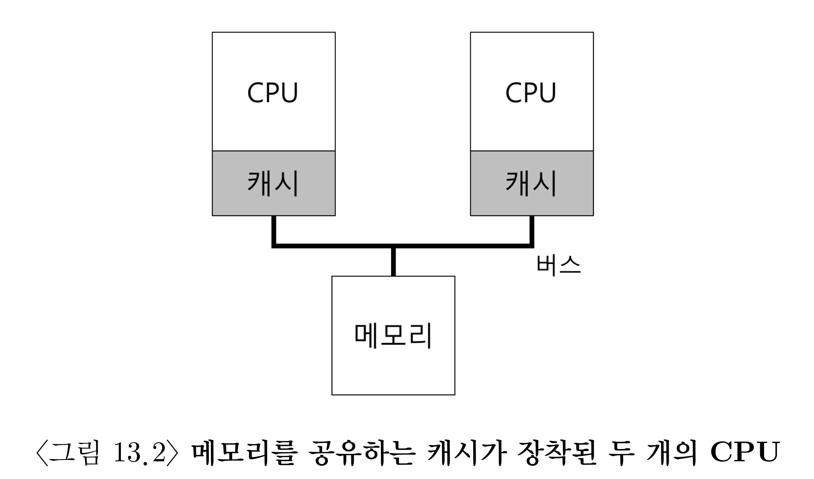
<br>


- 하나의 시스템에 여러 프로세서가 존재하고 하나의 공유 메인 메모리가 있을 때 어떤 일이 일어나는가?

    - `캐시 일관성 문제(cache coherence)`
    
        - 프로그램 실행 시 한 CPU에서 D값이 변경되어 이를 캐시에 저장한 상황이라고 가정하자. 보통 메인 메모리에 기록하는 건 비용이 큰 작업이라 나중에 이뤄진다.

        - 프로그램 실행을 중단하고 다른 CPU로 이동하면 변경되지 않은 D값을 사용해 일관성을 해치게 된다.

    - **해결방법**

        - 하드웨어가 항상 메모리 주소를 감시하고, 정상적인 상황만 발생토록 시스템은 관리한다.

        - 여러 개의 프로세스들이 하나의 메모리에 갱신할 때는 항상 공유되도록 한다.

        - `버스 스누핑(bus snooping)` - 버스 기반 시스템에서 사용

            - 캐시는 자신과 메모리를 연결하는 버스의 통신 상황을 계속 모니터링한다.

            - 캐시 데이터에 대한 변경이 발생하면, 자신의 캐시에서 데이터를 삭제하거나 갱신한다.

### 13-2. 동기화를 잊지 마시오

- 프로그램 또는 운영체제 자신은 공유 데이터를 접근할 때 신경을 쓸 필요가 있다.

- CPU들이 동일한 데이터 또는 구조체에 접근할 때 올바른 연산 결과를 보장하기 위해 락과 같은 상호 배제를 보장하는 동기화 기법이 사용된다.

- **락-프리(lock-free)** 데이터 구조등의 다른 방식은 특별한 경우에만 사용된다.

- 캐시의 일관성이 보장되더라도 항목(구조체)의 추가나 삭제,갱신엔 락이 필요하다.

### 13-3. 마지막 문제점: 캐시 친화성

- `캐시 친화성(cache affinity)` : CPU에서 실행될 때 프로세스는 해당 CPU 캐시와 TLB에 상당한 양의 상태 정보를 올려둔다. 이를 통해 다음 번에 동일한 CPU에서 프로세스 실행되는 것이 유리해지는 특성을 말한다.

    - 프로세스가 매번 다른 CPU에서 실행되면 실행할 때마다 필요한 정보를 캐시에 다시 탑재해야 하기 때문에 프로세스의 성능은 더 나빠진다.

    - 스케줄러는 가능한 한 프로세스를 동일한 CPU에서 실행하도록 결정해야한다.

### 13-4. 단일 큐 스케줄링

- `단일 큐 멀티프로세서 스케줄링(single queue multiprocessor scheduling, SQMS)`

    - 기존 단일 프로세서 스케줄링을 그대로 사용하는 것으로, 다수 CPU에서 동작하도록 할때 가장 간단한 방법이다.

    - 문제점 1. 확장성(scalability) 결여

        - 다수의 CPU에서 정상적으로 동작하기 위해선 락을 삽입해야하는데, 이는 CPU의 수가 늘어날수록 락을 비용이 늘어나 필요한 일에 쓰는 시간이 줄어든다.

    - 문제점 2. 캐시 친화성

        - 실행할 5개의 작업(A,B,C,D,E)의 프로세서가 4개 있다고 가정하자.

        <br>
        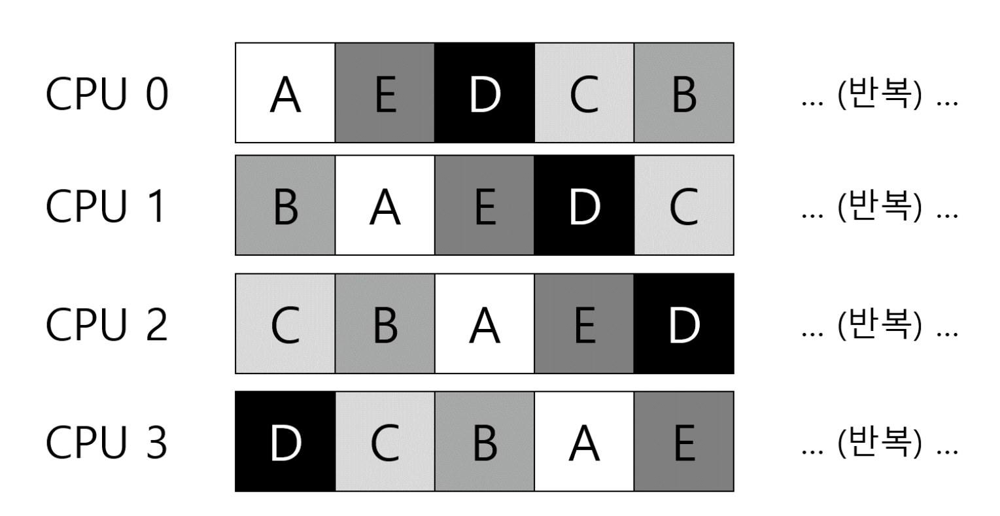
        <br>

        - 각 작업이 주어진 타임 슬라이스 동안 실행되면 그림과 같이 캐시 친화성 관점에선 잘못된 스케줄링을 할 것이다.

        <br>
        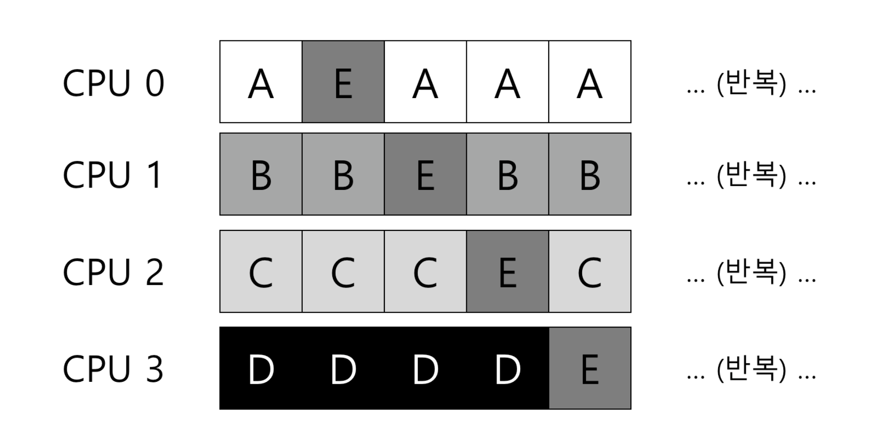
        <br>

        - 이를 해결하기 위해 SQMS 스케줄러는 가능한 한 프로세스가 동일한 CPU에서 실행되도록 시도한다.

### 13-5. 멀티 큐 스케줄링

- `멀티 큐 멀티프로세서 스케줄링(multi-queue multiprocessor scheduling, MQMS)`

    - SQMS의 문제점을 개선하기 위해 일부 시스템은 각 CPU마다 큐를 하나씩 둔다.

    - 각 큐는 라운드 로빈 같은 특정 스케줄링 규칙을 따를 것이다.

    - 작업이 시스템에 들어가면 하나의 스케줄링 큐로 배치된다. (이 때 무작위로 할 수도 있고, 다른 큐보다 작은 수가 작업이 있는 큐로 배치할 수 있다.)

    - 각 프로세스는 각각이 독립적으로 스케줄되기 때문에 단일 큐 방식에서 보았던 정보와 공유 및 동기화 문제를 피할 수 있다.

    <br>
    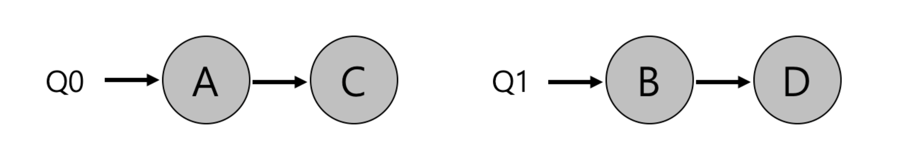

    <br>

    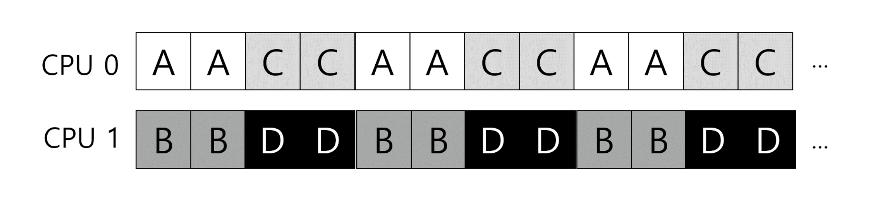
    <br>

    - 그림은 MQMS를 사용한 스케줄링의 예시이며, 여기에는 멀티 큐 기반 방식의 근본적인 문제인 워크로드의 불균형(load imbalance)가 드러난다.

    - 동일한 상태에서 Q0의 C가 종료되었다고 가정하자.

    <br>
    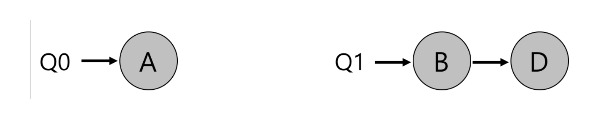
    
    <br>

    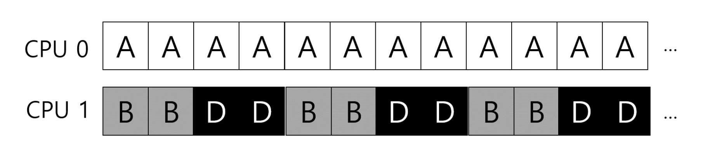
    <br>

    - 결과적으로 A가 B와 D보다 2배의 CPU를 차지하게 된다.

    - A와 C가 모두 종료하고 B와 D만 남은 상태라고 가장하자.

    <br>
    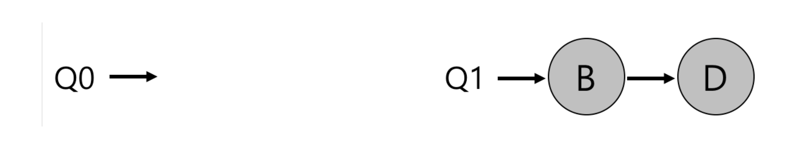
    
    <br>

    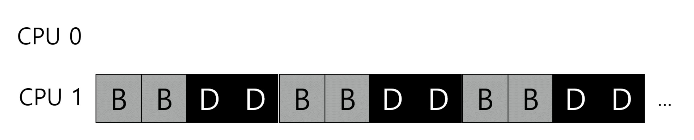
    <br>

    - 결과적으로 CPU0는 **유휴 상태** 가 된다.

    > **핵심 질문**  
    > 워크로드 불균형에 대처하는 방법

    - `이주(migration)` : 작업을 한 CPU에서 다른 CPU로 이주시킴으로써 워크로드의 균형을 달성하는 방법.

    <br>
    
    <br>

    - 이 경우 운영체제는 B 또는 D 중 하나를 CPU 0으로 이주시키면 된다.

    <br>
    
    <br>

    - 이 경우 한 번의 이주로 해결되지 않는다. 때문에 작업들을 지속적으로 이주시킴으로서 워크로드의 균형을 맞추는 방법을 사용한다.

    <br>
    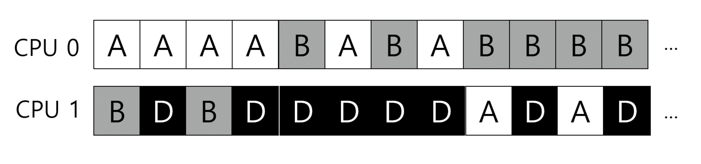
    <br>

    - `작업 훔치기(work stealing)`

        - 작업의 개수가 낮은 (소스) 큐가 가끔 다른 (대상) 큐에 훨씬 많은 수의 작업이 있는지 검사한다.

        - 대상 큐가 소스 큐보다 많다면 워크로드의 균형을 맞추기 위해 소스는 대상에서 하나 이상의 작업을 가져온다.

        - 검사 빈도는 부두 상수로서, 오버헤드와 워크로드 불균형간의 적절한 합의점을 찾아야 한다.

### 13-6. Linux 멀티프로세서 스케줄러

- `O(1) 스케줄러`

    - 멀티 큐

    - 우선순위 기반 스케줄러(MLFQ와 유사)로서 프로세스의 우선순위를 시간에 따라 변경하여 가장 높은 우선순위 작업을 선택하여 실행한다.

    - 상호 작용을 가장 우선시 한다.

- `Completely Fair Scheduler (CFS)`

    - 멀티 큐

    - 결정론적 비례배분 방식(보폭 스케줄링에 가까움)

- `BF 스케줄러(BFS)`

    - 단일 큐

    - 비례배분 방식

    - **Earliest Eligible Virtual Finish Time (EEVFT)**을 기반으로 스케줄링을 수행한다.

## 16. 주소 공간의 개념

### 16-1. 초기 시스템

<br>
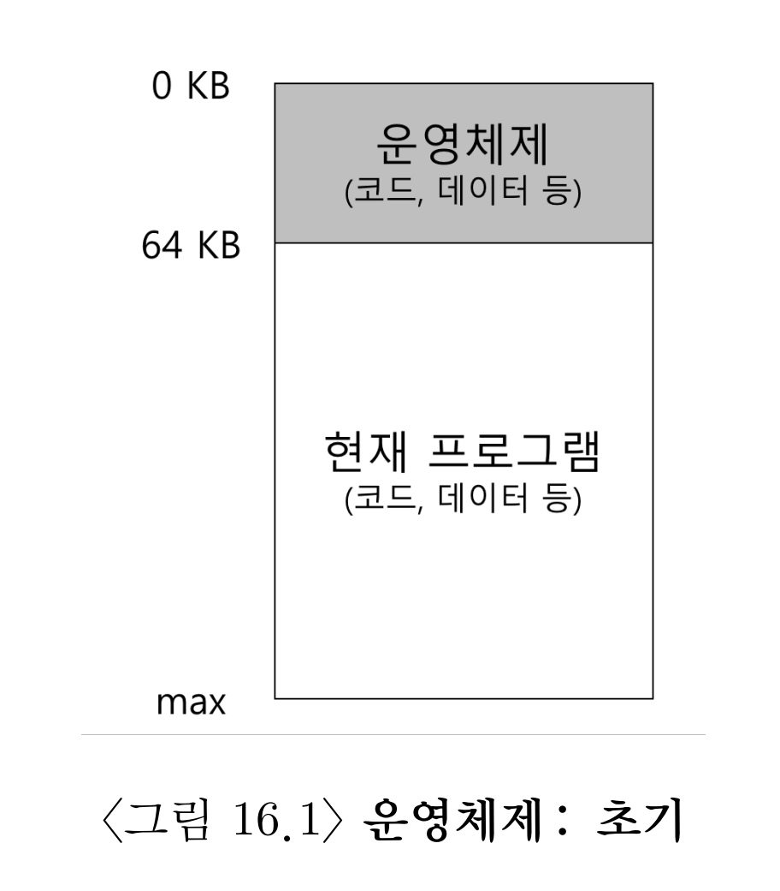
<br>

### 16-2. 멀티프로그래밍과 시분할

- `멀티프로그래밍(multi-programming)` : 여러 프로세스가 실행 준비 상태에 있고 운영체제는 그들을 전환하면서 실행.

- `시분할(time-sharing)` : 하나의 프로세스를 짧은 시간 동안 실행.

    - 실행 시간동안 모든 메모리에 접근할 권한이 주어진다.

    - **문제점**

        - 메모리가 커질수록 느리게 동작한다.

        - 레지스터 상태를 저장, 복원하는 건 빠르지만 메모리의 내용 전체를 디스크에 저장하는 데에 너무 많은 시간이 소요된다.

    <br>
    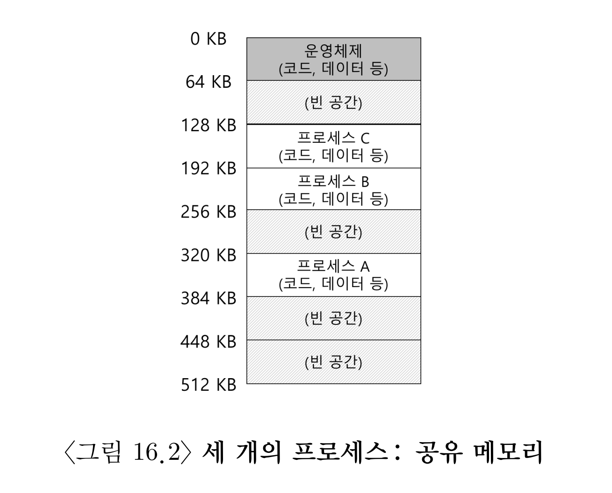
    <br>

    - 시분할이 대중화되면서 새로운 요구사항

        - 여러 프로그램이 한 메모리에 동시에 존재하려면 **보호(protection)** 가 필요한다.

### 16-3. 주소 공간

- `주소 공간(address space)` : 실행 중인 프로그램이 가정하는 메모리의 모습.

    - 실행 프로그램의 모든 메모리 상태를 갖고 있다.

        - ex : 프로그램 코드는 반드시 메모리에 존재해야 한다.

    - `스택` : 함수 호출 체인 상의 현재 위치, 지역 변수, 함수 인자와 반환 값 등을 저장하는 데 사용.

    - `힙` : 동적으로 할당되는 메모리를 위해 사용

    <br>
    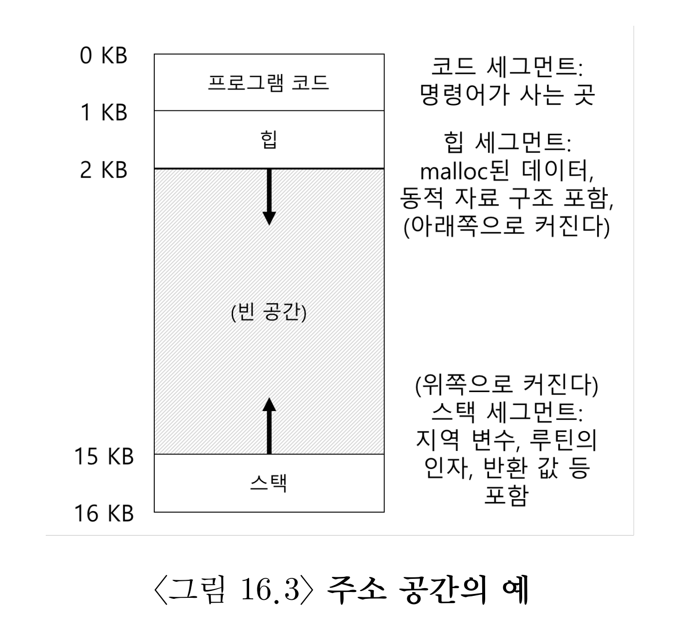
    <br>

    - 스택과 힙의 이러한 배치는 관례일 뿐, 여러 쓰레드가 공존할 때는 이런 식으로 주소 공간을 나누지 않는다.

> **핵심 질문**  
> 운영체제는 물리 메모리를 공유하는 다수의 프로세스에서 어떻게 프로세스 전용의 커다란 주소 공간이라는 개념을 제공하는가?

- 가상화에서 실행 중인 프로그램은 자신의 **가상 주소(virtual address)**를 사용해 자신의 물리 주소를 읽도록 보장한다.

### 16-4. 목표

- **가상 메모리 시스템(VM)의 주요 목표**

    - `투명성(transparency)` : 운영체제는 실행 중인 프로그램이 가상 메모리의 존재를 인지하지 못하도록 구현해야 한다.

    - `효율성(efficiency)` : 운영체제는 가상화가 시간/공간 측면에서 효율적이도록 해야 한다.

        - 운영체제는 TLB 등의 하드웨어 기능을 지원받아야 한다.

    - `보호(protection)` : 운영체제는 프로세스를 다른 프로세스로부터 보호해야 하고 자신도 프로세스로부터 보호해야 한다.

        - 프로세스가 자신의 주소 공간 밖의 어느 것도 접근할 수 있어서는 안된다.

        - 보호 성질을 이용해서 프로세스들을 서로 **고립(isolate)** 시킬 수 있다.

## 17. 막간: 메모리 관리 API

> **핵심 질문**  
> 어떻게 메모리를 할당하고 관리해야 하는가?

### 17-1. 메모리 공간의 종류

- `스택 메모리(stack memory)` : 할당과 반환은 프로그래머를 위해 컴파일러에 의해 암묵적으로 이뤄진다.(= **자동 메모리(automatic memory)** )

    - 함수에서 리턴하면 컴파일러가 자동으로 메모리를 반환한다.

    - ex : void func() { int x; // 스택에 int 형으로 선언 }

- `힙 메모리(heap memory)` : 모든 할당과 반환이 프로그래머에 의해 명시적으로 처리된다.

- 주의사항

    ```cpp
    void func() {
        int *x =  (int *) malloc(sizeof(int));
        ...
    }
    ```
    - 이런 코드는 스택과 힙 할당이 모두 발생한다.

### 17-2. malloc() 함수

- `malloc()` : 힙에 요청할 공간의 크기를 넘겨 주면, 성공했을 겨우 새로 할당된 공간에 대한 포인터를 실패했을 경우 NULL을 반환한다.

```cpp
double *d = (double *) malloc(sizeof(double));
```

### 17-3. free() 함수

- `free()` : 사용이 끝난 힙 메모리를 해제한다.

```cpp
int *x = malloc(10 * sizeof(int));
...
free(x);
```

### 17-4. 흔한 오류

- malloc() 과 free() 를 사용 시 흔히 발생하는 오류가 많다.

- 많은 새로운 언어들이 `자동 메모리 관리(Automatic Memory Management)` 를 지원한다.

    - `가비지 컬렉터(Garbage Collector, GC)` : 더 이상 참조되지 않는 메모리를 자동으로 해제해주는 기능

- **메모리 할당 잊어버리기**

    - `세그멘테이션 폴트(segmentation fault)` : 불법적인 메모리 접근 시 발생하는 오류

    ```cpp
    // 잘못된 코드
    char *src = "hello";
    char *dst;        // 메모리 할당 안됨
    strcpy(dst, src); // 세그멘테이션 폴트 발생

    // 올바른 코드
    char *src = "hello";
    char *dst = (char *) malloc(strlen(src) + 1);
    strcpy(dst, src);
    ```

- **메모리를 부족하게 할당받기**

    - `버퍼 오버플로우(buffer overflow)` : 메모리를 부족하게 할당받을 경우 발생하는 오류

    ```cpp
    char *src = "hello";
    char *dst = (char *) malloc(strlen(src));  // 너무 작다
    strcpy(dst, src);                          // 제대로 동작
    ```

    - 프로그램에 따라 제대로 동작하는 경우도 생기며, 이 때문에 프로그램이 올바르게 실행되더라도 주의가 필요하다.

- **할당받은 메모리 초기화하지 않기**

    - malloc()을 제대로 호출했지만 새로 할당받은 데이터 타입에 특정 값을 넣는 것을 잊는 것.

- **메모리 헤제하지 않기**

    - `메모리 누수(memory leak)` : 할당된 메모리를 해제하지 않는 것

        - 장기적으로 메모리가 점점 부족하게 되고 시스템을 재시작 할 수 밖에 없게 된다.

        - 메모리 청크의 사용이 끝나면 반드시 해제해야 한다.

- **메모리 사용이 끝나기 전에 메모리 해제하기**

    - `dangling pointer` : 메모리 사용이 끝나기 전에 메모리를 삭제하는 것.

        - 해당 포인터를 사용하면 프로그램을 크래시하거나 유효 메모리 영역을 덮어쓸 수 있어 위험하다.

- **반복적으로 메모리 해제하기**

    - `이중 해제(double free)` : 메모리를 한 번 이상 해제하는 것.

- **free() 잘못 호출하기**

    - free()가 malloc() 받은 포인터 외에 다른 값이 전달 될 경우 오류가 발생한다.

### 17-5. 운영체제의 지원

- **메모리를 요구하고 반환하는 시스템 콜**

    - `brk` : 프로그램의 break 위치를 변경하는데 사용하는 시스템 콜.

        - break는 힙의 마지막 위치를 나타낸다.

        - brk은 새로운 break 주소를 나타내는 한 개의 인자를 받는다.

        - 새로운 break가 기존 break보다 큰지 작은지에 따라 힙의 크기를 결정한다.

        - **sbrk** : 증가량만을 받아들이는 brk

        > **주의**  
        brk, sbrk은 직접 호출해서는 안된다.

    - `mmap()` : 프로그램에 anonymous 메모리 영역을 생성한다.

        - **anonymous 영역** : 특정 파일과 연결되지 않은 스왑 공간(swap space)에 연결된 영역

### 17-6. 기타 함수들

- `calloc()` : 메모리의 할당 영역을 0으로 채워서 반환한다.

    - 초기화하는 것을 잊어버리는 오류를 방지하는게 목적

- `realloc()` : 이미 할당된 공간에 대해 추가 공간이 필요할 때 사용한다.

    - 더 큰 새로운 영역을 확보하고, 옛 영역의 내용을 복사한 후에 새 영역에 대한 포인터를 반환한다.
