# 가상화 2

## 18. 주소 변환의 원리

- 메모리 가상화는 CPU 가상화의 LDE 기법과 비슷한 전략을 추구한다.

    - 가상화 제공과 동시에 추구하는 가치
    
        - `효율성(efficiency)`
        
            - 효율성을 높이려면 하드웨어 지원을 활용해야 한다.

            - 레지스터 -> TLB -> 페이지 테이블 등 점차 복잡한 하드웨어를 활용

        - `제어(control)`

            - 응용 프로그램이 자기자신의 메모리 이외에 다른 메모리에 접근하지 못한다는 것을 운영체제가 보장하는 것.

            - 프로그램이나 운영체제를 다른 프로그램으로부터 보호하기 위해서는 하드웨어의 도움이 필요하다.

        - `유연성(flexibility)`

            - VM 시스템에선 프로그래머가 원하는 대로 주소 공간을 사용하고, 프로그래밍하기 쉬운 시스템을 만들기 원한다.

> **핵심 질문**  
> 어떻게 효율적이고 유연하게 메모리를 가상화하는가?

- `하드웨어-기반 주소 변환(Hardware-based Address Translation)`, `주소 변환(Address Translation)`

    - 주소 변환을 통해 하드웨어는 명령어 반인, 탑재, 저장 등의 **가상 주소** 를 정보가 실제 존재하는 **물리 주소** 로 변환한다.

    - **하드웨어** : 
    
        - 주소 변환을 가속화하는데 도움을 준다.
        
        - 하드웨어만으론 가상화를 구현할 수 없다.

    - **운영체제** : 
    
        - 변환이 일어나도록 관여한다.
        
        - 메모리의 빈 공간과 사용 중인 공간을 항상 알고, 메모리 사용을 제어하고 관리한다.

    - **목표**

        - 프로그램이 자신의 전용 메모리를 소유하고 그 안에 자신의 코드와 데이터가 있다는 **환상** 을 만드는 것

### 18-1. 가정

1. 사용자 주소 공간은 물리 메모리에 연속적으로 배치되어야 한다.

2. 주소 공간은 물리 메모리 크기보다 작다.

3. 각 주소 공간의 크기는 같다.

### 18-2. 사례

```cpp
void func() {
    int x = 3000;
    x = x + 3;  // 관심있는 코드
```

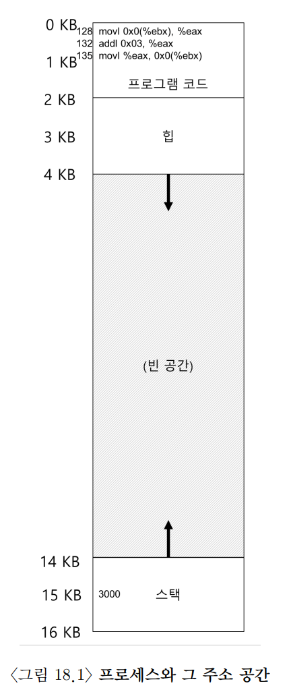
<br>

- 명령어 실행 시 프로세스 관점에서의 메모리 접근

    - 주소 128의 명령어를 반입

    - 명령어 실행(주소 15KB에서 탑재)

    - 주소 132의 명령어를 반입

    - 명령어 실행(메모리 참조 없음)

    - 주소 135의 명령어를 반입

    - 명령어 실행(15KB에 저장)

- 프로그램 관점에서 **주소 공간** 은 주소 0부터 최대 16KB까지다.

- 프로그램이 생성하는 모든 메모리 참조는 이 범위 내에 있어야 한다.

- 메모리 가상화를 위해서 운영체제는 프로세스가 모르게 물리 주소 0이 아닌 다른 곳에 위치시키고 싶다.

<br>

<br>

### 18-3. 동적(하드웨어-기반) 재배치

- `베이스와 바운드(base and bound)`, `동적 재배치(dynamic relocation)`

    - **베이스(base)** 레지스터, **바운드(boound)(=한계(limit))** 레지스터 쌍은 원하는 위치에 주소 공간을 배치할 수 있게 한다.

        - `베이스(base)`
        
            - 프로그램이 탑재될 물리 메모리 위치를 저장

        - `바운드(bound)`

            - 보호를 지원하기 위해 존재

            - 프로세스가 바운드보다 큰 가상 주소 또는 음수인 가상 주소를 참조하면 CPU는 예외를 발생시키고 프로세스를 종료한다.

    - 배치와 동시에 프로세스가 자신의 주소 공간에만 접근한다는 것을 보장한다.

    - 프로세서 변환식 : **physical address = virtal address + base**

    - `주소 변환` : 가상 주소에서 물리 주소로의 변환

        - 주소의 재배치는 실행 시와 실행을 시작한 이후에도 주소 공간을 이동할 수 있다. (= **동적 재배치**)

    - `메모리 관리 장치(Memory Management Unit, MMU)` : 주소 변환에 도움을 주는 프로세서의 일부

    - **바운드 레지스터의 방식**

        - **주소 공간의 크기를 저장하는 방식** : 하드웨어는 가상 주소를 베이스 레지스터에 더하기 전에 바운드 레지스터와 비교한다.

        - **주소 공간의 마지막 물리 주소를 저장하는 방식** : 하드웨어는 먼저 베이스 레지스터를 더하고 그 결과가 바운드 안에 있는지 검사한다.

- **예제**


    - 가상 주소가 너무 크거나 음수일 경우 폴트를 일으키고 예외를 발생시킨다.

### 18-4. 하드웨어 지원: 요약

- `프로세서 상태 워드(processor status word)레지스터`의 한 비트가 CPU의 현재 실행 모드를 나타낸다.

- 하드웨어는 베이스와 바운드 레지스터 값을 변경하는 명령어를 제공

    - 다른 프로세스를 실행시킬때 운영체제가 명령어를 사용해 베이스와 바운드 레지스터 값을 변경할 수 있다.

    - 특권 명령어, 커널 모드에서만 실행가능하다.

- CPU는 사용자 프로그램이 바운드를 벗어난 주소로 불법적인 메모리 접근을 시도하려는 상황에서 예외를 발생시킬 수 있다.

    - 이 경우 CPU는 사용자 프로그램의 실행을 중지, 운영체제의 `"바운드 벗어남" 예외 핸들러`가 실행되도록 조치

- 사용자 프로그램이 특권이 필요한 베이스와 바운드 레지스터 값의 변경을 시도하면 CPU는 예외를 발생시키고 핸들러를 실행한다.

### 18-5. 운영체제 이슈

- 베이스, 바운드 가상 메모리 구현을 위해서 운영체제가 반드시 개입되어야 하는 3개의 시점

    1. 프로세스가 생성될 때 주소 공간이 저장될 메모리 공간을 찾아 조치한다.

        - 운영체제는 물리 메모리를 슬롯의 배열로 보고 각 슬롯의 사용여부를 관리한다.

        - 새로운 프로세스가 생성되면 운영체제는 새로운 주소 공간 할당에 필요한 영역을 찾기 위해 자료 구조(free list)를 검색한다.

        - 선택된 공간을 사용 중으로 표시한다.

    2. 프로세스가 종료할 때, 프로세스가 사용하던 메모리를 회수하여 다른 프로세스나 운영체제가 사용할 수 있게 한다.

        - 프로세스가 종료하면 운영체제는 종료한 프로세스의 메모리를 다시 빈 공간 리스트에 넣고 연관된 자료 구조를 모두 정리한다.

    3. 문맥 교환이 일어날 때에도 몇 가지 추가 조치한다.

        - 각 프로그램마다 다른 물리 주소가 탑재되어야 하기에 운영체제는 프로세스 전환 시 베이스 바운드 쌍을 저장하고 복원해야 한다.

        - 실행 중인 프로세스를 중단시키기로 결정하면 운영체제는 메모리에 존재하는 프로세스 별 자료 구조 안에 베이스 바운드 레지스터 값을 저장한다.

            - 이 때 자료구조를 `프로세스 구조체(process structure)`, `프로세스 제어 블록(process control block, PCB)`라고 한다.

        - 프로세스가 중단되면 운영체제가 메모리의 현 위치에서 다른 위치로 주소 공간을 비교적 쉽게 옮길 수 있다.

            - 이를 통해 프로세스 실행을 중지한 후 현재 위치에서 새 위치로 주소 공간을 복사하고, 프로세스 구조체에 저장된 베이스 값을 갱신하여 새 위치를 가리키게 한다.

    4. 운영체제는 예외 핸들러 또는 호출될 함수를 제공해야 한다.

        - 프로세스가 바운드 밖에 메모리에 접근해 예외가 발생하면, 운영체제가 조치를 취할 준비가 되어 있어야 한다.

    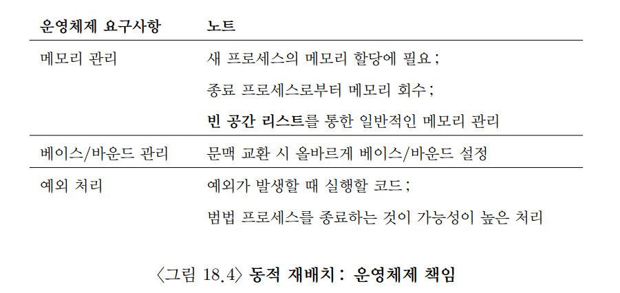
    <br>

- **하드웨어/OS의 상호작용 타임라인**

    <br>
    
    <br>

    - 프로세스가 잘못된 행동을 했을 때만 운영체제가 개입한다.

### 18-6. 요약

- 보호는 운영체제의 가장 중요한 목표 중의 하나이다.

- 동적 재배치는 비효율적이다.

    - `내부 단편화(internal fragmentation)`

        - 스택과 힙 사이에 프로세스를 재배치하고 사용되지 않은 내부 공간

    - 물리 메모리의 이용률을 높이고 내부 단편화를 방지하기 위해 `세그멘테이션(segmentation)`이 등장한다.
    
## 19. 세그멘테이션

- 베이스 바운드 레지스터를 사용하면 스택과 힙 사이에 사용되지 않는 공간이 존재하며 물리 메모리를 차지한다.

    - 주소 공간이 물리 메모리보다 큰 경우 실행이 어렵다.

    - 이런 측면에서 베이스 바운드 방식은 유연성이 없다.

> **핵심 질문**  
> 대용량 주소 공간을 어떻게 지원하는가

### 19-1. 세그멘테이션: 베이스/바운드(base/bound)의 일반화

- `세그멘테이션(segmentation)`

    - MMU 안에 하나의 베이스/바운드 쌍이 아닌 주소 공간의 논리적인 세그멘트(segment) 마다 베이스/바운드 쌍을 관리하는 것

        - `세그멘트(segment)` : 특정 길이를 가지는 연속적인 주소 공간(코드, 스택, 힙)

        - 운영체제는 각 세그멘트를 물리 메모리의 각기 다른 위치에 배치할 수 있다.

        - 사용되지 않는 가상 주소 공간이 물리 메모리를 차지하는 것을 방지할 수 있다.

    - **예시**
        <br>
        
        <br>
        
        <br>

        - `드문드문 사용되는 주소 공간(sparse address space)` : 사용되지 않는 영역이 많은 대형 주소 공간

        - 참조가 일어나면 하드웨어는 베이스 값에서 세그멘트의 **오프셋** 을 더해 물리 주소를 구한다.

            - **오프셋** : 주소가 참조하는 바이트가 세그먼트의 시작으로부터 몇 번째 바이트인지 나타내는 값

                - **변환식** : 가상 주소 - 베이스

    > **여담**: 세그멘트 폴트(segment fault)  
    > 세그멘트 사용 시스템에서 불법적인 주소 접근 시 발생한다.

### 19-2. 세그멘트 종류의 파악

- 하드웨어는 가상 주소가 어느 세그멘트를 참조하는지 그 세그멘트 안에서 오프셋은 얼마인지 어떻게 알 수 있는가?

    - 일반적인 접근법 : 가상 주소의 최상위 몇 비트를 기준으로 주소 공간을 여러 세그멘트로 나누는 것.


        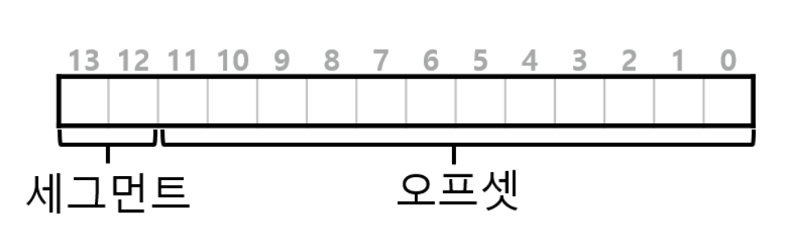
        <br>

        - 주소 공간을 세그멘트로 나누기 위해서는 2비트가 필요해 가상 주소 14비트 중 최상위 2비트를 사용해서 나타낸다.

        - 최상위 비트가 `00` -> 코드 세그멘트를 가리키며, 세그멘트의 베이스/바운드 쌍을 사용해 주소를 정확한 물리 메모리에 재배치

        - 최상위 비트가 `01` -> 힙 세그멘트를 가리키며, 세그멘트의 베이스/바운드 쌍을 사용해 주소를 정확한 물리 메모리에 재배치

        
        <br>

    - 일부 시스템은 세그멘트를 구분할때 낭비를 줄이기 위해 코드와 힙을 하나의 세그멘트에 저장해 2비트가 아닌 1비트를 사용한다.

    - `묵시적(implicit) 접근 방식` : 주소가 어떻게 형성되었나를 관찰하여 세그멘트를 결정.

### 19-3. 스택

- 스택은 다른 세그멘트들과 다르게 반대 방향으로 확장된다. 때문에 다른 방식의 변환이 필요하다.

- 이를 위해 베이스 / 바운드 값뿐 아니라 세그멘트가 어느 방향으로 확장하는지 하드웨어가 알아야 한다.

- 스택 주소를 변환하려면 올바른 음수 오프셋을 얻어야 한다.

    - `음수 오프셋 식` : 가상 주소의 오프셋 - 세그멘트 최대 크기(4KB)

- 바운드 검사는 음수 오프셋의 절댓값이 세그멘트 크기보다 작다는 것을 통해 확인할 수 있다.

### 19-4. 공유 지원

- 메모리를 절약하기 위해 때로는 주소 공간들 간에 특정 메모리 세그멘트를 공유하는 것이 유용하다.

    - 일반적으로 코드 공유

- 공유를 지원하기 위해, 하드웨어에 `protection bit`의 추가가 필요하다.

    - 세그멘트를 읽거나 쓸 수 있는지 혹은 세그멘트의 코드를 실행시킬 수 있는지 판별한다.

    - 코드 세그멘트를 읽기 전용으로 설정하면 주소 공간의 독립성을 유지하면서, 여러 프로세스가 주소 공간의 일부를 공유할 수 있다.

    - 이때 각 프로세스는 자신의 전용 메모리를 사용하고 있다는 환상을 유지하게 된다.

        
        <br>

    - protection bit을 사용하면 하드웨어 알고리즘이 수정되어야 한다.

        - 가상 주소가 범위 내에 있는지 확인하는 것 외에 특정 액세스가 허용되는지 확인해야 한다.
        
        - 사용자 프로세스가 읽기 전용 페이지에 쓰기를 시도하는 경우 또는 실행 불가 페이지에서 실행하려고 하면 하드웨어는 예외를 발생시켜 운영체제가 위반 프로세스를 처리할 수 있게 해야 한다.

### 19-5. 소단위 대 대단위 세그멘테이션

- `대단위(coarse-grained)` : 주소 공간을 비교적 큰 단위의 공간으로 분할하는 세그멘테이션

- `소단위(fine-grained)` : 주소 공간을 작은 크기의 공간으로 잘게 나누는 것을 허용하는 세그멘테이션

- `세그멘트 테이블`을 이용하면 매우 많은 세그멘트를 손쉽게 생성하고 융통성 있게 사용할 수 있다.

### 19-6. 운영체제의 지원

- 세그멘테이션의 문제

    1. 문맥 교환 시 운영체제는 어떤 일을 해야 하는가?

        - 세그멘트 레지스터의 저장과 복원

            - 운영체제는 프로세스가 다시 실행하기 전에 레지스터들을 올바르게 설정해야 한다.

    2. 물리 메모리 관리
        
        - 프로세스가 많은 세그멘트를 가질 수 있게 되면서 각각의 크기가 다를 수 있다.

        - `외부 단편화(external fragmentation)`

            - 물리 메모리가 빠르게 작은 크기의 빈 공간들로 채워지면 세그멘트를 할당하기 힘들며 기존 세그멘트를 확장하는 데도 어려워 관리하기 어렵다.

        - 해결책 : 기존의 세그멘트를 정리하여 물리 메모리를 **압축(compact)**
            
            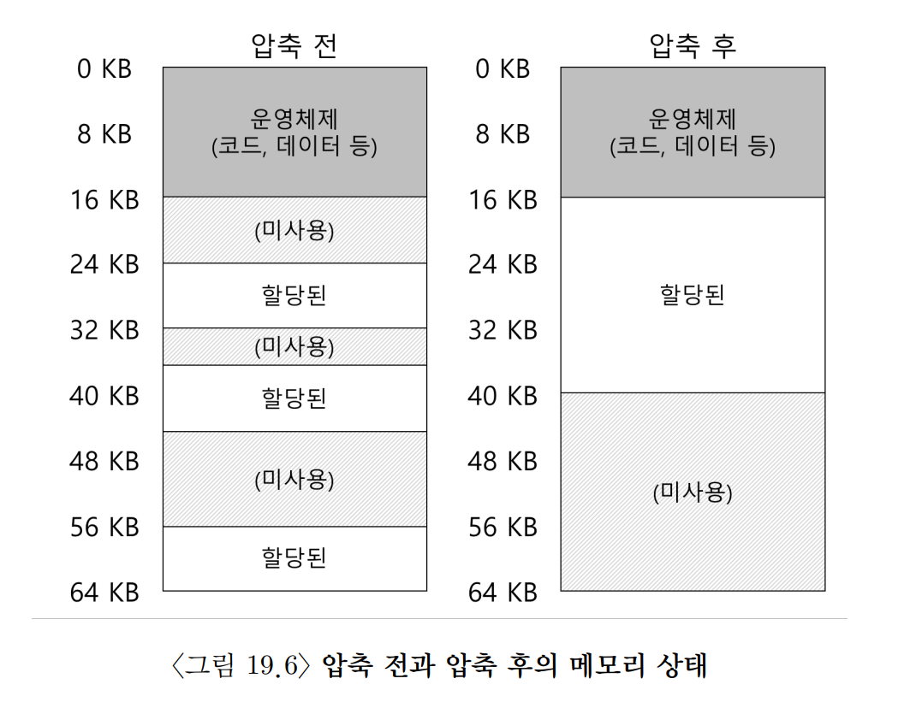
            <br>

            - 실행 중인 프로세스를 중단해야 압축을 할 수 있다.

            - 세그멘트 복사는 메모리에 부하가 큰 연산이고 일반적으로 상당량의 시간을 사용해 압축은 비용이 많이 든다.

            - 비용을 줄이기 위해 빈 공간 리스트를 관리하는 알고리즘 사용한다.

                - 최적 적합(best-fit)

                    - 빈 공간 리스트에서 요청된 크기와 가장 비슷한 크기의 공간을 할당

                - 최악 적합(worst-fit)

                - 최초 적합(first-fit)

                - 버디 알고리즘(buddy algorithm)

### 19-7. 요약

- **세그멘테이션의 장점**

    - 주소 공간 상의 논리 세그멘트 사이의 큰 공간에 대한 낭비를 피함으로 드문드문 사용되는 주소 공간을 지원할 수 있다.

    - 산술 연산이 쉽고 하드웨어 구현에 적합해 속도가 빠르며, 변환 오버헤드도 최소로 든다.

    - 코드 공유의 장점도 부가적으로 발생한다.

- **세그멘테이션의 문제점**

    - 외부 단편화 문제로 가변 길이 할당의 태생적인 문제는 회피하기 어렵다.

    - 아직 일반적인 드문드문 사용되는 주소 공간을 지원할 만큼 유연하지 못하다.
    
## 20. 빈 공간 관리

- 빈 공간 관리가 어려운 경우는 관리하는 공간이 가변 크기 빈 공간들의 집합으로 구성되어 있는 경우다.

> **핵심 질문**  
> 빈 공간을 어떻게 관리하는가?

### 20-1. 가정

- 합의 빈 공간을 관리하는 데는 일반적인 링크드리스트가 사용된다.

    - 영역 내의 모든 빈 청크에 대한 주소를 갖고 있다.

- 클라이언트에게 할당딘 메모리는 다른 위치로 재배치될 수 없다고 가정한다.

- 단편화 해결에 유용하게 사용되는 빈 공간의 압축은 이 경우 사용이 불가능하다.

### 20-2. 저수준 기법

- 할당기에서 사용되는 일반적인 기법

    - **분할(splitting)과 병합(coalescing)**

        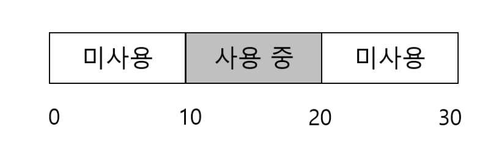
        <br>

        
        <br>

        - 10바이트를 초과하는 모든 요청은 실패하여 NULL을 반환할 것이다.

        - 10바이트에 대한 요청은 둘 중 빈 청크를 사용하여 쉽게 충족된다.

        - 10바이트보다 적은 요청일 경우 할당기는 **분할(splitting)** 로 알려진 작업을 수행한다.

            - 요청을 만족할 수 있는 빈 청크를 찾아 이를 둘로 분할

            - 첫 번째 청크는 호출자에게 반환

            - 두 번째 청크는 리스트에 남긴다.

        - 분할에 동반되는 기법은 빈 공간의 **병합(coalescing)** 이다.

            
            <br>

            - 위의 예시에서처럼 사용 중인 공간을 반환해도 청크로 나눠져있다.

            - 메모리 청크를 반환할 때 해제되는 청크의 주소와 바로 인접한 빈 청크의 주소를 살펴본다.

            - 새로 해제된 빈 공간이 왼쪽의 빈 청크와 인접해 있다면 하나의 더 큰 빈 청크로 병합한다.

            - 병합 기법을 통해 할당기가 커다란 빈 공간을 응용 프로그램에게 제공할 수 있다는 것을 보장할 수 있다.

    - **할당된 공간의 크기 파악**

        - 할당기는 추가 정보를 **헤더(Header)** 블럭에 저장한다.

        - 헤더 블럭은 메모리에 유지되며 보통 헤제된 청크 바로 직전에 위치한다.

        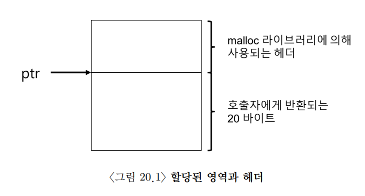
        <br>

        
        <br>

        - 헤더에 보통 저장하는 정보

            - 할당된 공간의 크기

            - 해제 속도를 향상시키기 위한 추가의 포인터

            - 부가적인 무결성 검사를 제공하기 위한 매직 넘버

        - 빈 영역의 크기는 헤더 크기 + 사용자에게 할당된 영역의 크기이다.

    - **빈 공간 리스트 내장**

        - 리스트 노드

            ```cpp
            typedef struct __node_t {
                int size;
                struct __node_t *next;
            } node_t;
            ```
        
        - 메모리 청크가 요청되면 충분한 크기의 메모리에서 분할이 일어난다.

        - 만약 이 중 일부 메모리를 반환하면 단편화가 발생하게 된다.

        - 이때 리스트를 순회하면서 인접한 청크를 병합하면 힙은 하나의 큰 청크가 된다.

    - **힙의 확장**

        - 힙이 부족하면 할당기가 운영체제에게 더 많은 메모리를 요청한다.

        - 시스템 콜(ex: **sbrk**)을 호출한 후 확장된 영역에서 새로운 청크를 할당한다.

            - 시스템 콜을 수행하기 위해 운영체제는 빈 물리 페이지를 찾아 요청 프로세스의 주소 공간에 매핑한 후, 새로운 힙의 마지막 주소를 반환한다.

### 20-3. 기본 전략

- **최적 적합(Best Fit)**

    - 빈 공간 리스트를 검색하여 요청한 크기와 같거나 더 큰 빈 메모리 청크를 찾는다.

    - 그 중 가장 작은 크기의 청크를 반환한다.(= 최적 청크)

    - 정교하지 않은 구현은 해당 빈 블럭을 찾기 위해 항상 전체를 검색해야 하기에 성능 저하가 초래된다.

- **최악 적합(Worst Fit)**

    - 최적 적합의 반대 방식. 가장 큰 빈 청크를 찾아 요청된 크기 만큼만 반환하고 남는 부분은 빈 공간 리스트에 계속 유지한다.

    - 이 역시도 항상 빈 공간 전체를 탐색해야 하기에 높은 비용이 발생한다.

    - 엄청난 단편화가 발생해서 오버헤도도 큰 것으로 보인다.

- **최초 적합(First Fit)**

    - 요청보다 큰 첫 번째 블럭을 찾아서 요청만큼 반환한다.

    - 빈 공간 리스트 전체를 탐색할 필요가 없어서 빠르다.

    - 리스트 시작에 크기가 작은 객체가 많이 생길 수 있어 **주소-기반 정렬** 과 같은 추가적인 작업을 해야 하는 단점이 있다.

- **다음 적합(Next Fit)**

    - 마지막으로 찾았던 원소를 가리키는 추가의 포인터를 유지해 탐색을 진행하는 방식.

    - 리스트 첫 부분에만 단편이 집중적으로 발생하는 것을 방지한다.

    - 최초 적합과 성능이 비슷하다.

### 20-4. 다른 접근법

- **개별 리스트(Segregated Lists)**

    - 특정 응용 프로그램이 한두 개 자주 요청하는 크기가 있다면, 그 크기의 객체를 관리하기 위한 별도의 리스트를 유지하는 것.

    - **장점**

        - 특정 크기의 요청을 위한 메모리 청크를 유지함으로써 단편화 가능성을 줄일 수 있다.

        - 요청된 크기의 청크만이 존재하기 때문에 복잡한 리스트 검색 없이 할당과 해제 요청을 처리할 수 있다.

    - **문제점**

        - 지정된 크기의 메모리 풀과 일반적인 풀에 얼마만큼의 메모리를 할당해야 하는가?

        - 해결방법 : `슬랩 할당기(slab allocator)`

            - 커널이 부팅될 때 커널 객체를 위한 여러 `객체 캐시(object cache)`를 할당한다.

            - 기존에 할당한 캐시 공간이 부족하면 상위 메모리 할당기에게 추가 **슬랩** 을 요청한다.

                - 요청의 전체 크기는 페이지 크기의 정수배

            - 슬랩 내 객체들에 대한 참조가 0이 되면 상위 할당기가 슬랩을 회수한다. 

            - 반납된 객체들을 초기화된 상태로 리스트에 유지시켜 객체 당 잦은 초기화와 반납 작업을 피할 수 있어서 오버헤드가 감소된다.

- **버디 할당**

    - `이진 버디 할당기(binary buddy allocator)` : 합병을 간단히 하는 방법 중 하나

        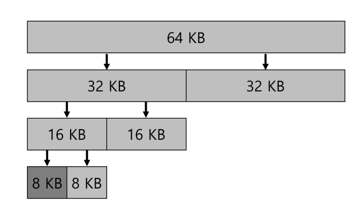
        <br>

        - 2의 거듭제곱 크기 만큼의 블럭만 할당할 수 있기 때문에 내부 단편화로 어려움을 겪을 수 있다.

        - 블럭이 해제될 때 예를 들어 8KB 블럭을 반환한다면, 할당기는 버디 8KB 블럭이 비어있는지 확인한다.

        - 블럭이 비어있다면 16KB로 병합하고, 16KB 블럭이 비어있다면 32KB로 병합하는 식으로 계속 재귀해 나간다.

- **기타 아이디어**

    - 앞서 말한 접근 방식들은 공통적으로 **확장성** 이 문제다.

    - 빈 공간의 개수가 늘어남에 따라 리스트 검색이 매우 느려질 수 있다.

    - 해당 비용을 줄이기 위한 할당기들

        - 균형 이진 트리(balanced binary tree)

        - 스플레이 트리(splay tree)

        - 부분 정렬 트리(partially ordered tree)

    - 멀티프로세서를 위한 할당기

        - Berger

        - Evans

        - glibc

## 21. 페이징: 개요

- `페이징(Paging)` : 가상 메모리 공간을 동일 크기의 조각으로 분할하는 것

    - 프로세스의 주소 공간을 가변 크기의 논리 세그멘트(ex: 코드, 힙, 스택)로 나누는 것이 아니라 고정 크기의 단위(=페이지)로 나눈다.

    - **페이지 프레임** : 물리 메모리를 고정 크기의 슬롯 배열로 나눈 것.

        - 각 프레임은 하나의 가상 메모리 페이지를 저장할 수 있다.

> **핵심 질문**  
> 페이지를 사용하여 어떻게 메모리를 가상화할 수 있을까?

### 21-1. 간단한 예제 및 개요

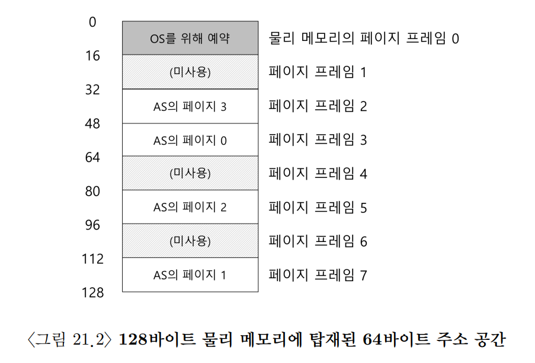
<br>

- 물리 메모리는 고정 크기 슬롯들로 구성된다.

- 가상 주소 공간의 페이지들은 물리 메모리 전체에 분산 배치된다.

- **페이징의 장점**

    - `유연성`

        - 페이징을 사용하면 프로세스의 주소 공간 사용 방식과는 상관없이 효율적으로 주소 공간 개념을 지원할 수 있다.

    -  `빈 공간 관리의 단순함`

        - 운영체제는 비어있는 아무 페이지에나 프로세스의 페이지를 할당할 수 있다.

- `페이지 테이블(page table)`

    - 주소 공간의 각 가상 페이지에 대한 물리 메모리 위치 기록을 위해 프로세스마다 유지하는 자료 구조

    - 주소 공간의 가상 페이지 주소 변환 정보를 저장

    - 각 페이지에 저장된 물리 메모리의 위치가 어딘지 알려준다.

    - 프로세스가 생성한 가상 주소의 변환을 위해 먼저 가상 주소를 가상 페이지 번호와 페이지 내의 오프셋 2개의 구성 요소로 분할한다.
    
    <br>
    
    <br>

    - 가상 주소의 구성 : 가상 페이지 번호(virtual page number, VPN), 오프셋(offset)

    - 물리 주소는 VPN을 물리 프레임 번호(physical page number, PPN)로 변환, 오프셋은 그대로 유지하면 얻을 수 있다.
    
### 21-2. 페이지 테이블은 어디에 저장되는가

- 페이지 테이블은 세그멘트 테이블이나 베이스/바운드 쌍에 비해 매우 커질 수 있다.

    - 때문에 현재 프로세스가 사용하고 있는 페이지 테이블 MMU 안에 저장하지 않고, 각 프로세스의 페이지 테이블을 **메모리에 저장** 한다.

### 21-3. 페이지 테이블에는 실제 무엇이 있는가

- 페이지 테이블은 가상 주소를 물리 주소로 매핑하는 데 사용되는 자료구조이며, 임의의 자료 구조도 사용 가능하다.

    - `선형 페이지 테이블(linear page table)`
    
        - 가장 간단한 형태로 단순한 배열


    - PTE의 비트

        - Valid bit : 특정 변환의 유효 여부를 나타내기 위해 포함된다.

            - 할당되지 않은 주소 공간을 표현하기 위해 필수

            - 주소 공간의 미사용 페이지를 표시함으로써 물리 프레임을 할당할 필요를 없애 대량의 메모리를 절약한다.

        - protection bit : 허용하지 않는 방식으로 페이지에 접근하려고 하면 운영체제에 트랩을 생성한다.

        - Present bit : 페에지가 물리 메모리에 있는지 혹은 디스크에 있는지 가리킨다. (스와핑 여부 확인)

        - dirty bit : 메모리에 반입된 후 페이지가 변경되었는지 여부

        - reference bit(accessed bit)
            
            - 페이지가 접근되었는지를 추적하기 위해 사용

            - 어떤 페이지가 인기가 있는지 결정하여 메모리에 유지되어야 하는 페이지를 결정하는 데 유용
        
        <br>       
        
        <br>
        
        - `P` : Present bit

        - `R/W` : 페이지에 쓰기가 허용되는지 결정하는 읽기/쓰기 비트

        - `U/S` : 사용자 모드 프로세스가 페이지에 액세스 할 수 있는지를 결정하는 사용자/슈퍼바이저 비트

        - `PWT, PCD, PAT 및 G` : 페이지에 대한 하드웨어 캐시의 동작을 결정하는 몇몇 비트

        - `A` : reference bit

        - `D` : dirty bit

### 21-4. 페이징: 너무 느림

- 페이지 테이블의 크기가 매우 증가하면 처리 속도가 저하될 수 있다.

- `페이지 테이블 베이스 레지스터(page table base register)` : 페이지 테이블의 시작 주소(물리 주소)를 저장하는 레지스터

```cpp
// 원하는 PTE 위치를 찾기 위한 하드웨어 연산
VPN = (VirtualAddress & VPN_MASK) >> SHIFT
PTEAddr = PageTableBaseRegister + (VPN * sizeof(PTE))
```
- 물리 주소가 알려지면 하드웨어는 메모리에서 PTE를 반입할 수 있고, PFN을 추출하고, 가상 주소의 오프셋과 연결하여 원하는 물리 주소를 만든다.

```cpp
offset = VirtualAddress & OFFSET_MASK
PhysAddr = (PFN << SHIFT) | offset
```

- 하드웨어는 메모리에서 원하는 데이터를 가져와서 레지스터에 넣을 수 있다.

- 문제점 : 하드웨어와 소프트웨어의 신중한 설계 없이는 페이지 테이블로 인해 시스템이 매우 느려질 수 있으며 너무 많은 메모리를 차지한다.

### 21.5 메모리 트레이스

- 프로그램 실행되면, 각 명령어 반입 시 메모리가 2번 참조한다.

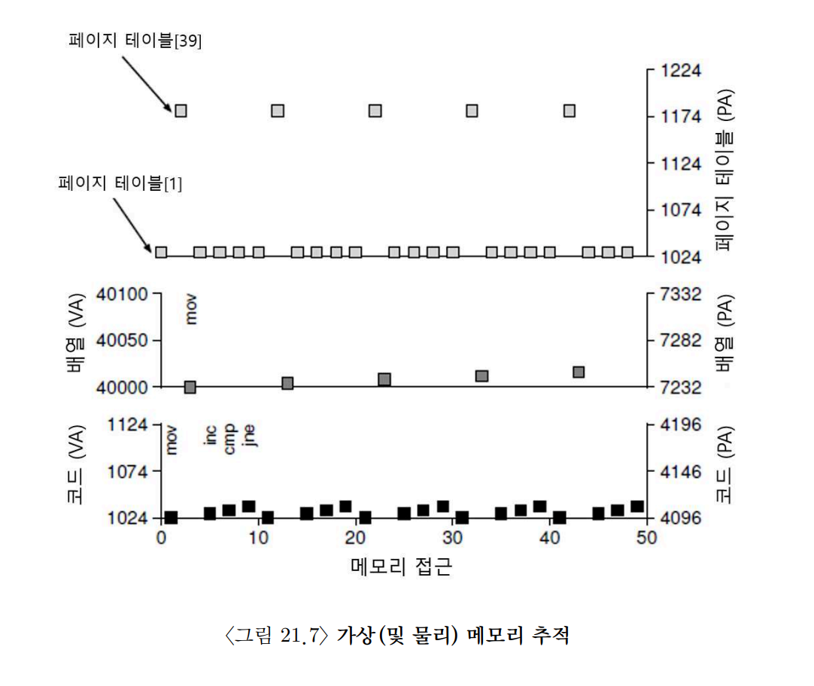
<br>

- 5번의 루프 반복에 대해 전체 과정을 담은 그래프이다.

- 1번째 그래프 : 페이지 테이블 메모리 접근 그래프

- 2번쨰 그래프 : 배열의 접근 그래프

- 3번째 그래프 : 명령어 메모리 참조 그래프

    - x축에서 루프 당 10번의 메모리 접근이 존재한다.

    - 4번의 명령어 반입, 1번의 메모리 갱신이 발생한다.

### 21-6. 요약

- **페이징의 장점**

    1. 메모리의 고정 크기의 단위로 나눈다.

    2. 가상 주소 공간의 드문 사용을 허용한다.

## 22. 페이징: 더 빠른 변환 (TLB)

- 페이지 테이블 접근을 위한 메모리 읽기 작업은 엄청난 성능 저하를 유발한다.

> **핵심 질문**  
> 주소 변환 속도를 어떻게 향상할까

- `변환-색인 버퍼(translation-lookaside buffer, TLB)` 
    
    - 주소 변환을 빠르게 하기 위한 버퍼

    - MMU의 일부

    - 자주 참조되는 가상 주소-실주소 변환 정보를 저장하는 하드웨어 캐시(`주소-변환 캐시(address-translation cache)`)

    - **방법**

        - 가상 메모리 참조 시, 하드웨어는 TLB에 원하는 변환 정보가 있는지 확인한다.

        - 있다면 페이지 테이블을 통하지 않고 변환을 수행한다.

### 22-1. TLB의 기본 알고리즘


<br>

- TLB에 변환 정보가 존재함으로, 메모리 참조가 빠르게 처리된다.

- TLB 전제조건 : 주소 변환 정보가 대부분 캐시에 있다.

- TLB 미스가 많이 발생할수록 메모리 접근 횟수가 많아져 성능이 저하되기 때문에 TLB 미스율을 낮추는 것이 중요하다.

### 22-2. 예제: 배열 접근

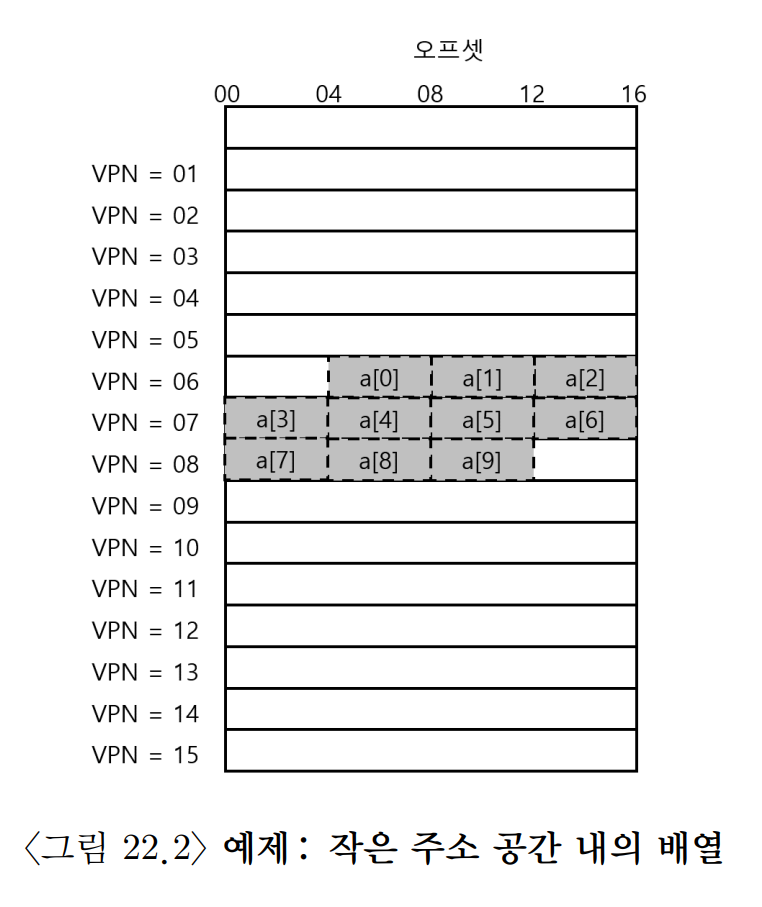
<br>

- TLB는 `공간 지역성`으로 인해서 성능을 개선할 수 있다.

    - 배열의 항목들이 페이지 내에서 서로 인접해 있기 때문에, 페이지에서 첫 번째 항목을 접근할 때만 TLB 미스가 발생한다.

- TLB에서 페이지 크기는 중요한 역할을 하며, 정수 배열을 연속적으로 접근하는 프로그램의 경우 TLB 사용이 큰 개선 효과를 낸다.

- 루프 종료 후에도 배열을 사용한다면, 시간 지역성으로 인해 TLB의 성공률이 높아진다.

> **팁 : 가능하면 캐싱을 사용하자**  
> - 하드웨어 캐시 사용의 취지는 명령과 데이터 참조에 있어서 **지역성** 을 활용하는 것이다.
> - 목적은 필요한 메모리 내용을 매우 빠른 cpu 칩 내의 메모리에 위치시키고, 접근 지역성을 최대한 활용하는 것이다.
> - 속도가 빠를려면 크기가 작아야하기 때문에 캐시 역할을 하기 위해선 작아야만 한다.

### 22-3. TLB 미스는 누가 처리할까

- TLB 미스를 처리하는 방법은 하드웨어, 소프트웨어 두 가지가 있다. 

    - **하드웨어**

        1. 페이지 테이블에서 원하는 페이지 테이블 엔트리를 찾기

        2. 필요한 변환 정보를 추출

        3. TLB 갱신

        4. TLB 미스가 발생한 명령어를 재실행

    - 대표적인 예 : 인텔 x86 CPU, `멀티 레벨 페이지 테이블`을 사용

    - **소프트웨어**

        
        <br>

        1. 하드웨어가 예외를 발생

        2. 운영체제가 예외 처리 루틴을 실행
        
        3. 트랩 핸들러 실행 - TLB 미스 해결을 위한 코드 실행

            - 기존 트랩 핸들러와 다르게 해당 핸들러는 명령어를 처음부터 다시 실행한다.

            - 운영체제는 트랩 발생의 원인에 따라 현재 명령어 PC값이나 다음 명령어 PC값을 저장해야 한다.

            - 핸들러 실행 시, 무한 반복되지 않도록 주의해야 한다.

        4. TLB 갱신 후 리턴

        5. 명령어 재실행

        - TLB를 소프트웨어로 관리하는 방식의 장점

            - 유연성

                - 운영체제는 하드웨어의 변경없이 페이지 테이블 구조를 자유로이 변경 가능
                
            - 단순함

                - 미스가 발생했을 때 하드웨어에서 할 일이 별로 없다.

### 22-4. TLB의 구성: 무엇이 있나?

- 일반적인 TLB는 32, 64, 128개의 엔트리를 가지며, **완전 연관(fully associative)** 방식으로 설계된다.

    - `완전 연관` : 변환 정보는 TLB 내에 어디든 위치할 수 있으며, 원하는 변환 정보를 찾는 검색은 TLB 전체에서 병렬적으로 수행된다.

    - TLB 구성

        ```
        VPN | PFN | 다른비트들
        ```

### 22-5. TLB의 문제: 문맥 교환

- TLB에 있는 가상 주소와 실제 주소 간의 변환 정보는 탑재시킨 프로세스에서만 유효하고 다른 프로세스들에게는 의미가 없다.

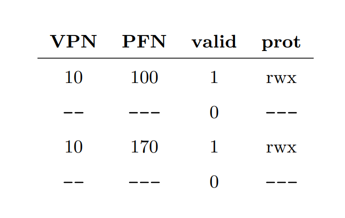
<br>

- TLB는 어느 정보가 어떤 프로세스를 위한 항목인지 구분할 방법이 없기에 멀티 프로세스 간의 가상화를 지원하기 위해 추가적인 기능이 필요하다.

> **핵심 질문**  
> 문맥 교환 시 TLB 내용을 어떻게 관리하는가

- 방법 1 : 문맥 교환을 수행할 때 다음 프로세스가 실행되기 전 기존 TLB 내용을 비운다.

    - 새로운 프로세스가 실행될 떄, 데이터와 코드 페이지에 대한 접근으로 미스가 발생

    - 문맥 교환이 빈번하게 발생한다면 성능에 부담을 가져온다.

        - 부담을 개선하기 위해 **주소 공간 식별자(ASID)** 필드를 추가하는 하드웨어적 방식을 추가

        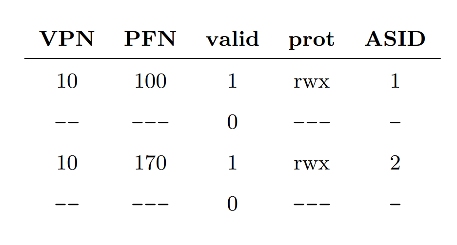
        <br>

        - 주소 공간 식별자를 사용할 경우, 프로세스 별로 TLB 변환 정보를 구분할 수 있다.

### 22-6. 이슈: 교체 정책

> **핵심 질문**  
> TLB 교체 정책은 어떻게 설계하는가

- 정책 1 : `최저 사용 빈도(least-recently-used, LRU)` 항목을 교체하는 것

    - 메모리 참조 패턴에서의 지역성을 최대한 활용하는 것이 목적

- 정책 2 : 랜덤(random) 정책

    - 때때로 잘못된 결정을 내릴 수도 있지만 구현이 간단하고 예외 상황 발생을 피할 수 있다는 장점이 있다.

### 22-8. 요약

- `TLB 범위(TLB coverage)`

    - 프로그램이 짧은 시간 동안 접근하는 페이지들의 수가 TLB에 들어갈 수 있는 수보다 많다면 많은 수의 TLB 미스가 발생하고 느리게 동작하게 될 것이다.

    - 해법 : 더 큰 페이지 크기를 지원하도록 하는 것

        -더 큰 페이지들을 위한 지원은 데이터베이스 관리 시스템(DBMS)과 같은 프로그램들에 의해서 주로 사용

- CPU 파이프라인에서 TLB 접근이 병목될 수 있다.

    - 특히 물리적으로 인덱스된 캐시(physically-indexed cache)가 사용될 경우, 문제 발생률 높음.

    - 해법 : 가상 주소로 캐시를 접근하는 방식 등등

    - 가상적으로 인덱스된 캐시(virtually indexed cache) 는 일부 성능 문제를 해결했지만 새로운 문제를 수반한다.

## 23. 페이징: 더 작은 테이블

> **핵심 질문**  
> 페이지 테이블을 어떻게 더 작게 만들까

### 23-1. 간단한 해법: 더 큰 페이지

- 페이지 크기의 증가는 부작용을 수반한다.

    - 내부 단편화(internal fragmentation)

        - 페이지 내부의 낭비 공간이 증가한다.

- 컴퓨터 시스템의 메모리가 금방 고갈되는 현상이 발생해, 일반적으로 사용되지 않는다.
    
### 23-2. 하이브리드 접근 방법: 페이징과 세그멘트

- 페이징과 세그멘테이션을 결합하여 페이지 테이블 크기를 줄이는 아이디어 제시.

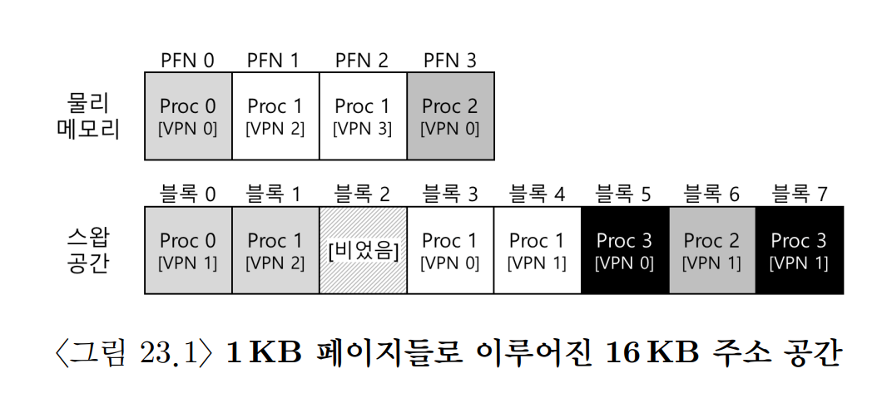
<br>

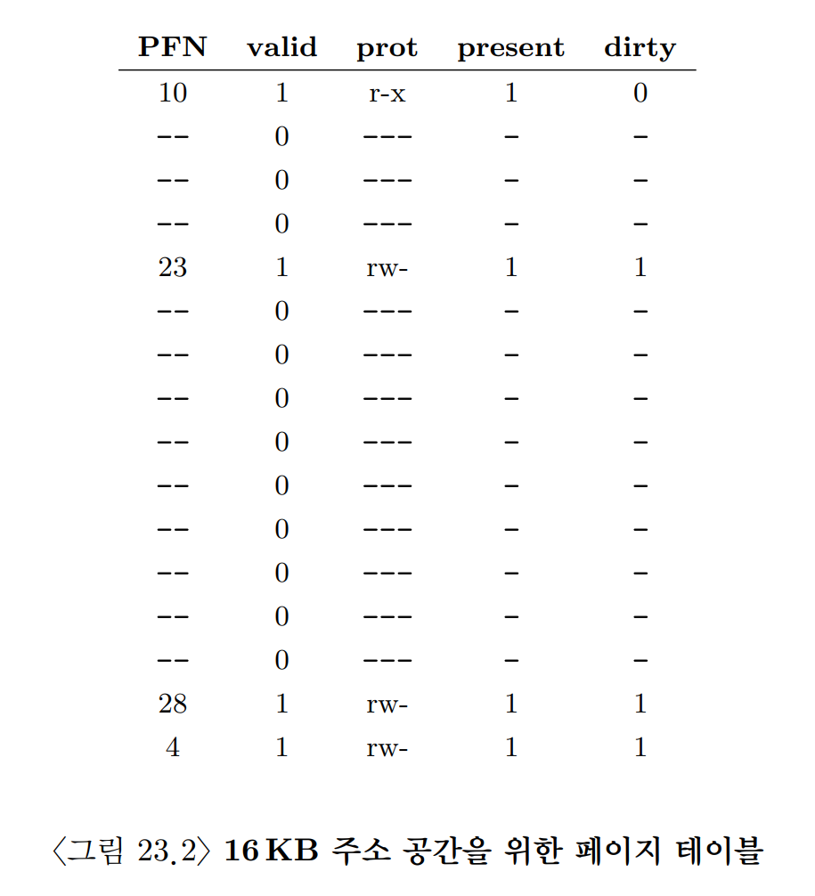
<br>

- 메모리에서의 세그멘테이션

    - 베이스 : 세그멘트의 페이지 테이블의 시작 주소

    - 바운드 : 페이지 테이블의 끝

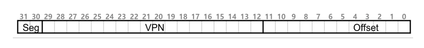
<br>

- 하드웨어에 세 개의 베이스/바운드 레지스터 쌍이 코드, 힙, 스택을 위해 존재한다.

- 문맥 교환 시, 레지스터들은 새로 실행되는 프로세스의 페이지 테이블의 위치값으로 변경된다.

- TLB 미스 발생 시, 하드웨어는 세그멘트 비트(SN)을 사용하여 어떤 베이스/바운드 쌍을 사용할지 결정한다.

- 하드웨어는 페이지 테이블 엔트리의 물리 주소를 계산한다.

    ```
    SN = (VirtualAddress & SEG_MASK) >> SN_SHIFT
    VPN = (VirtualAddress & VPN_MASK) >> VPN_SHIFT
    AddressOfPTE = BASE[SN] + (VPN * sizeof(PTE))
    ```

- **단점**

    - 세그멘테이션을 활용하기에 유연성이 떨어진다.

        - 드문드문 사용되는(sparsely used) 힙의 경우 페이지 테이블의 낭비를 피할 수 없다.

    - 외부 단편화를 유발한다.

### 23-3. 멀티 레벨 페이지 테이블

- `멀티 레벨 페이지 테이블` : 선형 페이지 테이블을 트리 구조로 표현하는 방식.

    - 페이지 테이블을 페이지 크기의 단위로 나눈다.

    - 페이지 테이블의 페이지가 유효하지 않은 항목만 있으면 해당 페이지를 할당하지 않는다.

    - **페이지 디렉터리(page directory)** 라는 자료 구조를 사용하여 페이지 테이블 각 페이지의 할당 여부와 위치를 파악한다.

        - `페이지 디렉터리(page directory)` : 페이지 테이블을 구성하는 각 페이지의 존재 여부와 위치 정보를 가지고 있다.

    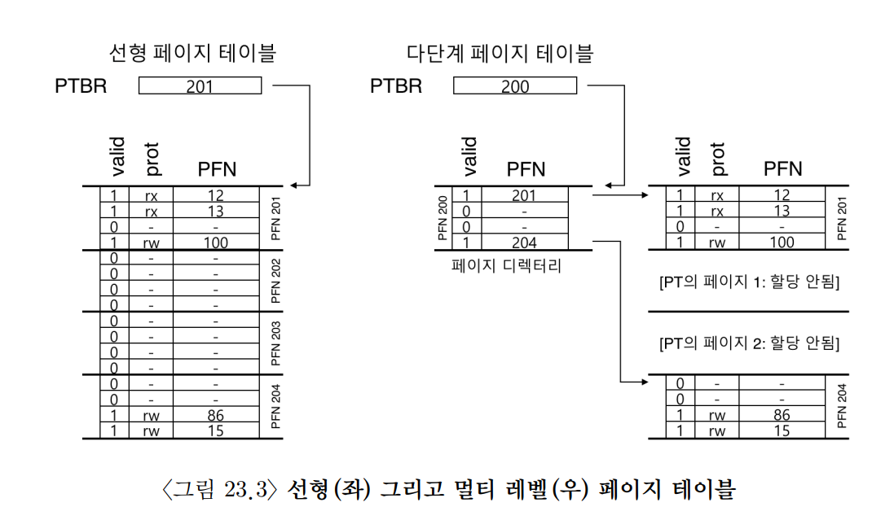
    <br>

    - 페이지 디렉토리는 **페이지 디렉토리 항목(page directory entries, PDE)** 으로 구성된다.

        - 유효(valid) 비트와 페이지 프레임 번호(PFN)를 갖고 있다.

        - **PDE와 PTE의 차이점**

            - PDE 항목이 유효하다는 것은, 그 항목이 가리키고 있는 페이지들 중 최소 하나가 유효 비트가 1인 것이다.

            - 반대로 유효하지 않다면 실제 페이지가 할당되어 있지 않은 것이다.

    - **장점**

    1. 멀티 레벨 테이블은 사용된 주소 공간의 크기에 비례하여 페이지 테이블 공간이 할당된다.

    2. 페이지 테이블을 페이지 크기로 분할함으로써 메모리 관리가 매우 용이하다.

        - 페이지 테이블을 할당하거나 확장할 때, 운영체제는 free 페이지 풀에 있는 빈 페이지를 가져다 쓴다.

    - **멀티 레벨 페이징 vs 선형 페이지 테이블 방식**

        - 큰 페이지 테이블의 경우, 해당 크기의 연속된 빈 메모리를 찾기 쉽지 않다.

        - 멀티 레벨 페이징에선 페이지 디렉터리를 사용해 위치를 파악한다.

        - 페이지 테이블을 위한 공간 할당이 매우 유연하다.

    - **유의사항**

        - TLB 미스 시, 주소 변환을 위해 두 번의 메모리 로드가 발생한다.

        - 페이지 테이블 검색이 단순 선형 페이지 테이블의 경우보다 더 복잡해진다.

- **멀티 레벨 페이징 예제**

    - 페이지-디렉터리 인덱스(page-directory index, PDIndex)

        ```
        표현식 : PDEAddr = PageDirBase + (PDIndex * sizeof(PDE))
        ```

        - 상기 표현식을 통해 PDE 주소를 찾을 수 있다.

    - 페이지-테이블 인덱스(page-table index, PTIndex)

        ```
        표현식 : PTEAddr = (PDE.PFN << SHIFT) + (PTIndex * sizeof(PTE))
        ```

    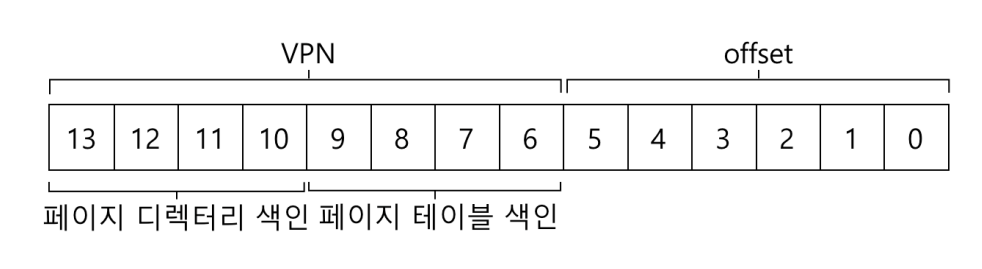
    <br>

- **2단계 이상 사용하기**

    - 멀티 레벨 페이지 테이블의 목적 : 페이지 테이블의 모든 분할된 부분들이 단일 페이지 크기에 맞도록 하는것이다.

    - 페이지 디렉터리가 너무 커지면 한 페이지에 몇 개의 페이지 테이블 항목을 저장할 수 있을지 계산해야 한다.

- **변환 과정: TLB를 기억하자**

    - 복잡합 멀티 레벨 페이지 테이블 접근을 거치기 전에 TLB를 검사한다.

        - 히트 시, 페이지 테이블 참조 없이 물리 주소를 직접 구성

        - 미스 시, 멀티 레벨 페이지 테이블의 모든 단계를 거쳐 물리 주소를 구한다.

### 23-4. 역 페이지 테이블

- `역 페이지 테이블(inverted page table)`

    - 여러 개의 페이지 테이블 대신 시스템에 단 하나의 페이지 테이블만 둔다.

    - 페이지 테이블은 물리 페이지를 가상 주소 상의 페이지로 변환한다.

    - **역 페이지 테이블의 각 항목**
    
        - 해당 물리페이지를 사용 중인 프로세스 번호 
        
        - 가상 페이지 번호

    - 역 페이지 테이블에서는 주소 변환을 위해 전체 테이블을 검색해서 원하는 가상 주소 페이지를 갖는 항목을 찾아야 한다.

    - 순차 탐색은 느려서, 주로 해시 테이블을 사용한 검색을 한다.

### 23-5. 페이지 테이블을 디스크로 스와핑하기

- 축소를 해도 메모리에 상주시키기 어려운 경우

    - 페이지 테이블을 `커널 가상 메모리`에 존재시키기.

    - 페이지 테이블을 디스크로 `스왑(swap)`하기.

### 23-6. 요약

- 공간을 많이 소모하는 테이블 구조는 TLB 미스의 처리속도가 빨라진다.

## 24. 물리 메모리 크기의 극복: 매커니즘

- 지금까지 가상 주소 공간이 비현실적으로 작아서 모두 물리 메모리에 탑재가 가능한 것으로 가정했다.

- 사실 실행 중인 프로세스는 다수 동시에 존재하며 각자 큰 주소 공간을 사용하고 있다고 가정하자.

- 이를 위해 메모리 계층에 레이어의 추가가 필요하다.

    - 큰 주소 공간을 지원하기 위해 운영체제는 주소 공간 중에 현재는 필요하지 않은 일부를 보관할 공간이 필요하다.(ex: HDD)

> **핵심 질문**  
> 운영체제는 어떻게 크고 느린 장치를 사용하면서 마치 커다란 가상 주소 공간이 있는 것처럼 할 수 있을까?

    - 편리함과 사용 용이성이다.

    - 주소 공간이 충분히 크면, 프로그램의 자료 구조들을 위한 충분한 메모리 공간이 있는지 걱정안해도 된다.

    - 필요 시 메모리 할당을 운영체제에게 요청하면 된다.

### 24-1. 스왑 공간

- `스왑 공간(swap space)` : 메모리 페이지를 읽어서 이곳에 쓰고(swap out), 여기서 페이지를 읽어 메모리에 탑재(swap in)시킨다.

    - 입출력 단위 : 페이지

    - 운영체제는 스왑 공간에 있는 모든 페이지들의 디스크 주소를 기억해야 한다.

    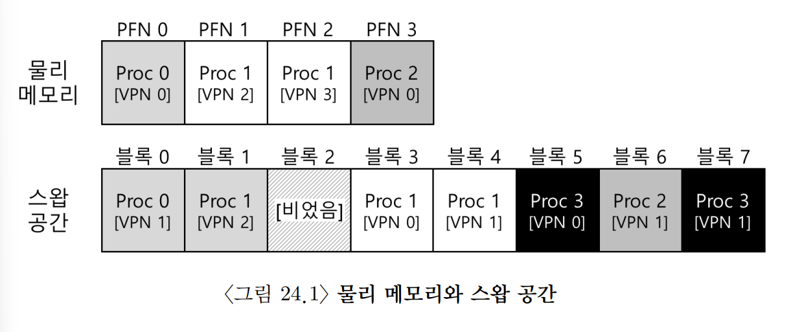
    <br>

    - 시스템은 실제 물리적으로 존재하는 메모리 공간보다 더 많은 공간이 존재하는 것처럼 가장할 수 있다.

    - 스왑 공간만 스왑할 수 있는 건 아니며, 물미 메모리에 추가 공간이 필요할 때 코드 영역의 페이지는 스왑 목적으로 사용될 수 있다.

### 24-2. Present Bit

- 페이지가 디스크로 스왑되는 것을 가능케 하려면  PTE에서 해당 페이지가 물리 메모리에 존재하지 않는다는 것을 표현해야 한다.

- `present bit` : 각 페이지 테이블 항목에 어떤 페이지가 존재하는지 표현

    - 1로 설정 : 물리 메모리에 해당 페이지가 존재

    - 0으로 설정 : 메모리에 페이지가 존재하지 않고 디스크 어딘가에 존재


### 24-3. 페이지 폴트

- `페이지 폴트` : 물리 메모리에 존재하지 않는 페이지를 접근하는 행위

    - 페이지 폴트 발생 시 운영체제로 제어권이 넘어가며 **페이지 폴트 핸들러(page-fault handler)** 가 실행된다.

- 요청한 페이지가 메모리에 없고 디스크로 스왑되었다면, 운영체제는 해당 페이지를 메모리로 스왑해온다.

- **어떻게?**
    
    - 해당 페이지의 스왑 공간상에서의 위치를 페이지 테이블에 저장한다.

    - 운영체제는 PFN과 같은 PTE비트들을 페이지 디스크 주소를 나타내는데 사용할 수 있다.

- **페이지 폴트 발생 시 동작**

    1. 디스크 I/O가 완료되면 운영체제는 PTE의 PFN 값을 탑재된 페이지의 메모리 위치로 갱신

    2. 페이지 폴트를 발생시킨 명령어를 재실행

    3. 이 과정에 TLB 미스가 발생할 수 있음(미스를 피하기 위해 페이지 폴트 처리 시 TLB를 갱신할 수도 있음.)

    4. TLB에서 주소 변환 정보를 찾게 되고, 이를 통해 물리 주소에서 원하는 데이터나 명령어를 가져옴.

- **유의사항**

    - I/O 전송 중에는 해당 프로세스는 차단된(blocked) 상태

    - 페이지 폴트 처리 시 운영체제는 다른 프로세스들을 실행시킬 수 있다.

### 24-4. 메모리에 빈 공간이 없으면?

- 메모리에 여유 공간이 없을 경우 어떻게 해야할까?

    - 탑재하고자 하는 새로운 페이지를 위한 공간을 확보하기 위해 하나 또는 그 이상의 페이지들을 먼저 **페이지 아웃(page out)** 할 수 있다.

    - 잘못된 페이지 교체 정책을 할 경우 메모리 속도가 저하되 디스크와 비슷한 속도로 동작할 수도 있다.

### 24-5. 페이지 폴트의 처리

- 하드웨어 처리 과정에서 TLB 미스 발생 시, 3가지 중요한 경우

    1. 페이지가 존재하며 유효한 경우

        - TLB 미스 핸들러가 PTE에서 PFN을 가져와서 명령어를 여러 차례 재시도한다.

    2. 페이지가 유효하지만 존재하지 않는 경우

        - 페이지 폴트 핸들러가 반드시 실행

    3. 페이지가 유효하지 않는 경우

        - 프로그램 버그 등으로 잘못된 주소를 접근하는 경우의 처리를 나타냄.

        - 운영체제의 트랩 핸들러에 의해서 처리되도록 한다.

- 운영체제가 페이지 폴트를 처리하는 과정

    - 탑재할 페이지를 위한 물리 프레임을 확보

    - 여유 프레임이 없다면, 교체 알고리즘을 실행해 메모리에서 페이지를 내보내고 여유 공간 확보

    - 물리 프레임 확보 후, I/O 요청을 통해 스왑 영역에서 페이지를 읽어오기

    - 작업 완료 후 페이지 테이블 갱신 및 명령어 재시도

    - 재시도 시 TLB 미스가 발생하면 다시 재시도해서 TLB 히트

### 24-6. 교체가 실제 언제 일어나는가

- 교체 알고리즘이 그리 효율적이지 않아 운영체제는 항상 어느 정도의 여유 메모리 공간을 확보하고 있다.

- 여유 공간을 위해 대부분의 운영체제들은 여유 공간과 관련된 **최댓값(high watermark,HW)** 와 **최솟값(low watermark,LW)** 을 설정하여 교체 알고리즘 작동에 활용.

- **동작 방식**

    - 여유 공간이 최솟값보다 작아지면 확보를 위해 백그라운드 스레드(스왑 데몬, 페이지 데몬) 실행

    - 이 스레드는 여유 공간의 크기가 최댓값에 이를 때까지 페이지를 제거

    - 충분한 메모리 확보 시 스레드 슬립

- 다수의 페이지들을 **클러스터(cluster)** 나 **그룹(group)** 으로 묶어서 한 번에 스왑 파티션에 저장함으로써 디스크의 효율을 높일 수 있다.

- 백그라운드 페이징 스레드

    - 교체를 직접 수행하는 대신 알고리즘을 사용할 수 있는 페이지들이 있는지 검사.

    - 없다면 백그라운드 페이징 쓰레드에게 여유 페이지들이 필요하다고 알림.

    - 쓰레드가 페이지들을 비운 후 원래 쓰레드를 다시 깨워 원하는 페이지를 불러들일 수 있도록 하며 계속 작업을 진행

## 25. 물리 메모리 크기의 극복: 정책

- 빈 메모리 공간이 거의 없으면 운영체제는 메모리 압박(memory pressure)을 해소하기 위해 다른 페이지들을 강제적으로 페이징 아웃(paging out)하여 활발히 사용 중인 페이지를 위한 공간을 확보한다.

- 운영체제의 교체 정책 : 내보낼 페이지들을 선택

> **핵심 질문**  
> 내보낼 페이지는 어떻게 결정하는가

### 25-1. 캐시 관리

- 메인 메모리에서의 교체 정책 목표 : 디스크로부터 페이지를 가져오는 횟수를 최소로 만드는 것

- 캐시 히트와 미스의 횟수를 안다면 프로그램의 `평균 메모리 접근 시간(average memory access time, AMAT)`을 계산할 수 있다.

    $$ AMAT = (P_{Hit} \cdot
     T_{M}) + (P_{Miss} \cdot T_{D}) $$

    - $T_{M}$ = 물리 메모리 접근 비용

    - $T_{D}$ = 디스크 접근 비용

    - $P_{Hit}$ = 히트 확률

    - $P_{Miss}$ = 미스 확률

    - $P_{Hit}, P_{Miss}$는 각각 0.0에서 1.0의 값을 가지며 둘의 합은 1.0을 만족한다.

- 현대 시스템에서는 디스크 접근 비용이 너무 크기 떄문에 작은 미스만 발생해도 AMAT에 큰 영향을 준다.

- 이를 위해 최적의 정책을 선택하는 것이 매우 중요하다.

### 25-2. 최적 교체 정책

- `최적 교체 정책(The Optimal Replacement Policy)`

    - 가장 나중에 접근될 페이지를 교체하는 것이 최적이며, 가장 적은 횟수의 미스를 발생시킨다.

    - 간단하지만 구현하기 어려운 정책

- **예제**

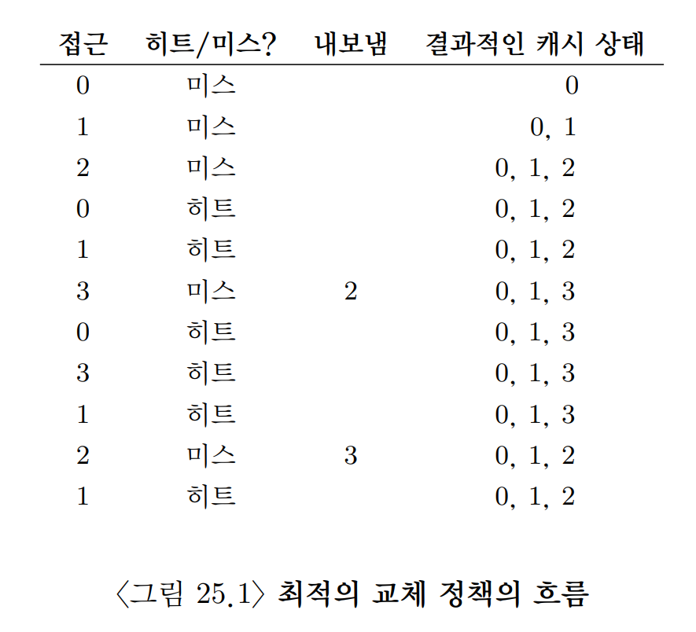
<br>

- 캐시가 비어있는 상태에서 처음 3번 접근은 당연히 미스다.

    - `최초 시작 미스(cold-start miss)`/ `강제 미스(compulsory miss)`

- 이후 미스를 만나면, 캐시가 가득 차서 교체 정책이 실행된다.

    - 최적 기법 관점에서 캐시는 먼 미래에 접근할 것을 알 수 있기에 해당 정보를 빼고 새로운 캐시를 저장한다.

- 미래는 일반적으로 미리 알 수 없기에 범용 운영체제에서는 최적 기법의 구현이 불가능하다.

### 25-3. 간단한 정책: FIFO

- 초기 시스템은 복잡한 시도 대신 매우 간단한 교체 정책(FIFO)을 채용했다.

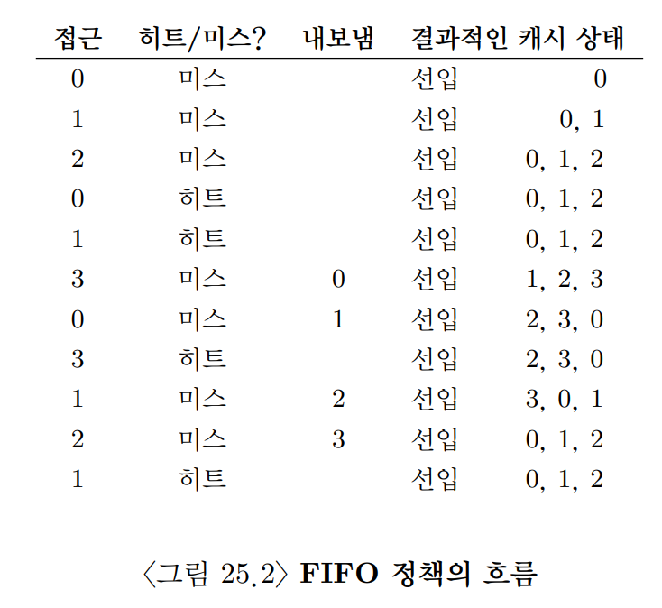
<br>

- 페이지가 들어오면 큐에 삽입되고, 교체를 해야 할 경우 큐의 테일에 있는 페이지가 내보내진다.

- 최적 기법 관점에서 FIFO는  눈에 띄게 성능이 안 좋다.

### 25-4. 또 다른 간단한 정책: 무작위 선택

- 메모리 압박이 있는 때 페이지를 무작위로 선택하여 교체하는 정책

- 구현하기 쉽지만 내보낼 블럭을 제대로 선택하려는 노력을 하지 않는다.

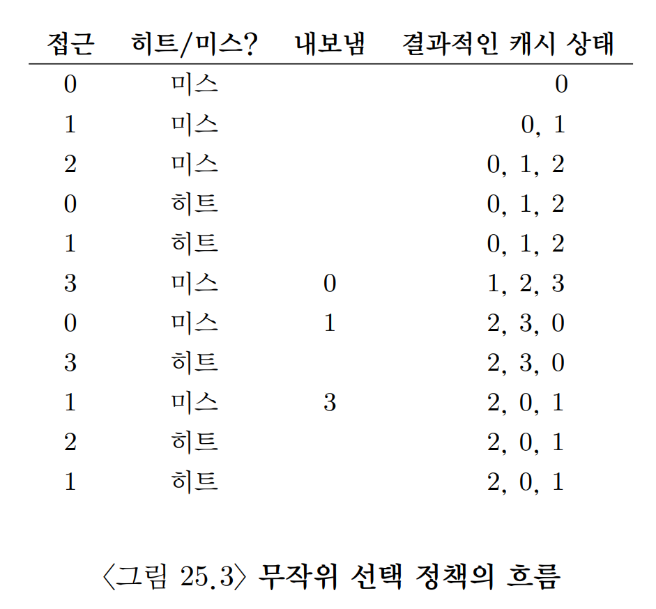
<br>

- 무작위 선택 방식의 동작은 그때그때에 따라 성능이 달라진다.

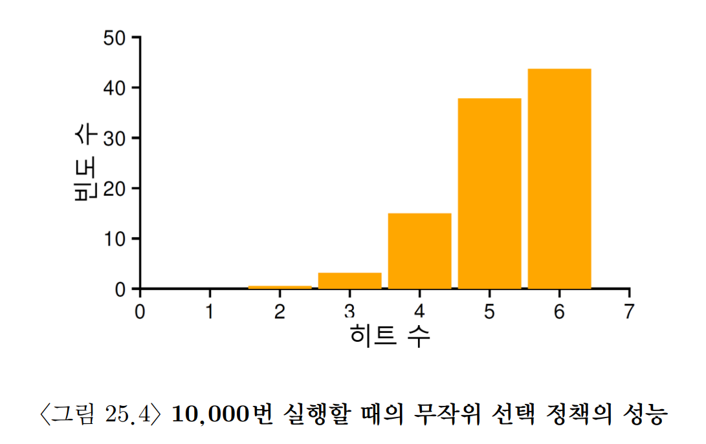
<br>

> **여담 : Belady's Anomaly**  
> FIFO와 랜덤 정책은 캐시의 크기가 증가해도 캐시 히트율이 상승하지 않는 현상이 발생

### 25-5. 과거 정보의 사용: LRU

- FIFO나 무작위 선택 방식은 중요한 페이지들 혹은 바로 다시 참조하게 될 페이지를 내보낼 수 있다는 문제가 있다.

- `지역성의 원칙(principle of locality)` 활용

    - 미래 예측을 위해 과거 사용 이력을 활용한다.

        - `빈도수(frequency)` : 한 페이지가 여러 차례 접근되었다면, 앞으로도 자주 사용될 것이다.

        - `최근성(recency)` : 최근에 접근된 페이지일수록 가까운 미래에 접근될 확률이 높다.

- `Least-Frequently_Used(LFU)` : 가장 적은 빈도로 사용된 페이지를 교체

- `Least-Recently_Used(LRU)` : 가장 오래 전에 사용하였던 페이지를 교체

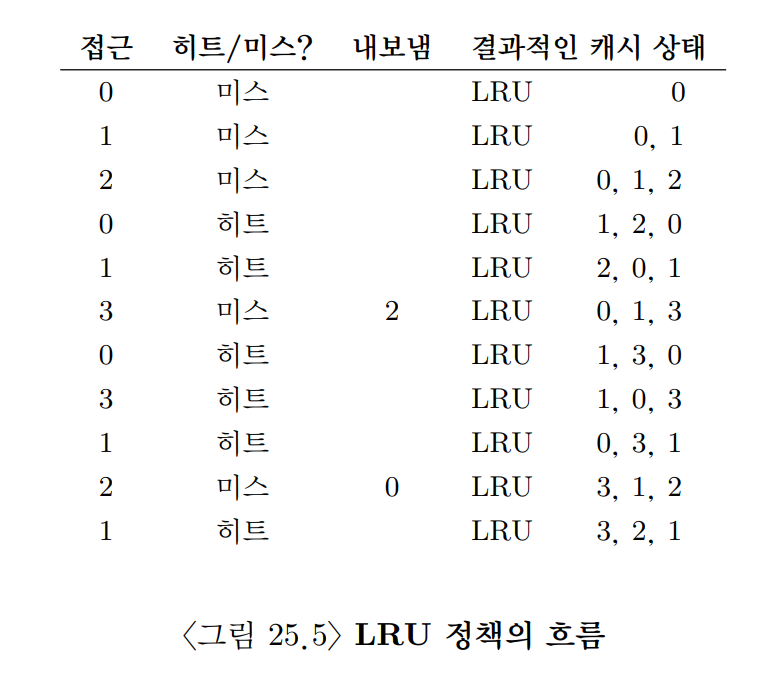
<br>

### 25-6. 워크로드에 따른 성능 비교

- 페이지는 100페이지까지 증가시켰으며 각 정책이 캐시 크기에 따라 어떻게 동작하는지 살펴본다.

1. 지역성이 없는 워크로드

    - 접근되는 페이지들의 집합에서 페이지가 무작위적으로 참조된다.

    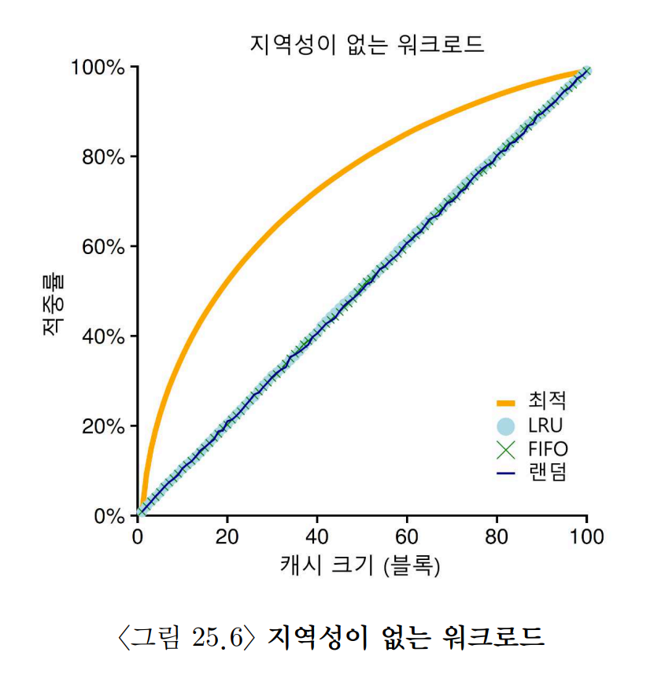
    <br>

    - 지역성이 없다면 어떤 정책을 사용하든 상관이 없다.

2. 80 대 20 워크로드

    - 인기 있는 20%의 페이지들에서 80%의 참조가 발생하고 반대로 나머지 인기없는 80% 페이지들에 대해서 20%의 참조가 발생한다.

    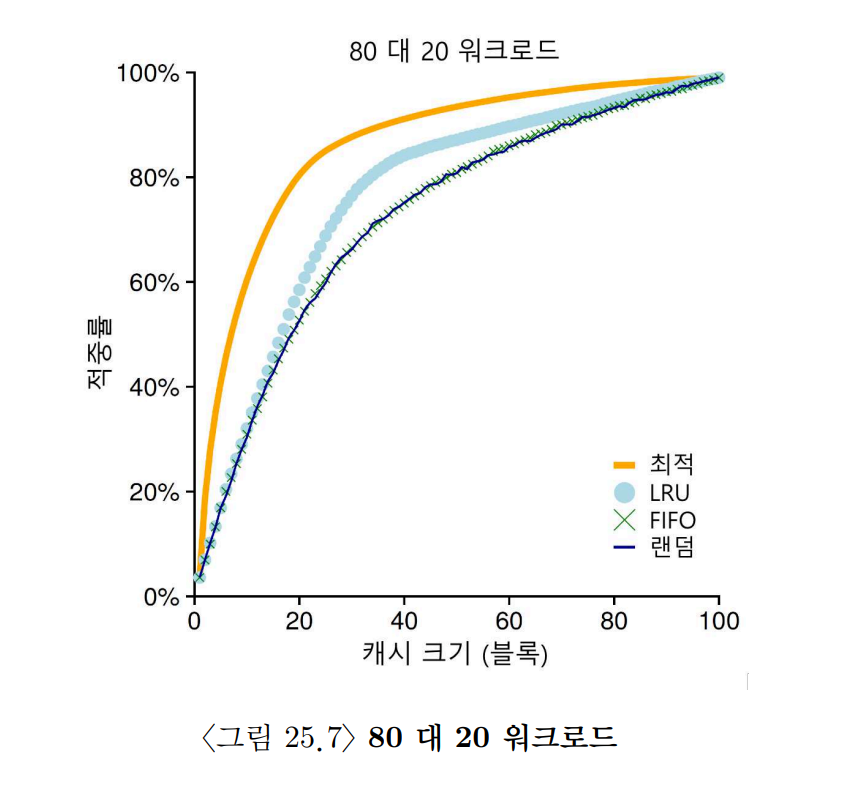
    <br>

    - FIFO, 랜덤 방식에 비해 LRU가 더 좋은 성능을 보인다.

    - LRU가 무조건 더 좋은거냐하면 그 대답은 "상황에 따라 다르다"이다.

3. 순차 반복 워크로드

    - 50개의 페이지들을 순차적으로 참조하고 처음으로 돌아가 접근 순서를 반복한다.

    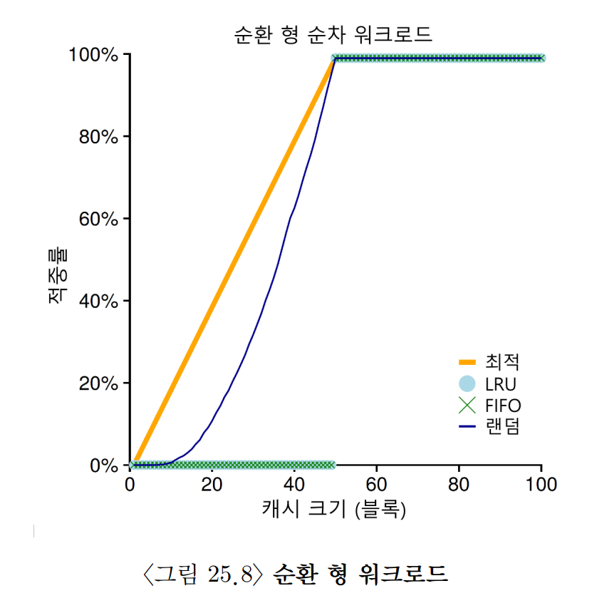
    <br>

    - FIFO와 LRU에선 가장 안좋은 성능을 보인다.

### 25-7. 과거 이력 기반 알고리즘의 구현

- 과거 정보에 기반을 둔 정책을 어떻게 구현할까?

    - LRU의 경우
    
        - LRU에서는 어떤 페이지가 가장 최근에 또는 오래 전에 사용되었는지 관리하기 위해 모든 메모리 참조 정보를 기록한다.

        - 주의 없이 정보를 기록하면 성능이 크게 저하될 수 있다.

- 효율적인 작업을 위한 하드웨어의 지원

    - 페이지 접근이 있을 때마다 하드웨어가 메모리의 시간 필드를 갱신하도록 한다.

    - 페이지 교체 시 운영체제는 가장 오래 전에 사용된 페이지를 찾기 위해 시간 필드를 검사한다.

    - 페이지 수가 증가하면 시간 정보 배열을 검색하여 가장 오래된 것을 찾는 것도 고비용의 연산이 된다.

> **핵심 질문**  
> 완벽한 LRU를 구현하는 것은 비싼 비용이 든다는 것을 전제로, 어떻게 하면 LRU에 가까운 선택을 하고 유사한 행동을 보이는 정책을 구현할 수 있을까?

### 25-8. LRU 정책 근사하기

- 연산량 관점에서 LUR를 근사하는 식으로 만들면 구현이 쉽다.

- **하드웨어 지원** : use bit(reference bit)

    - 각 페이지마다 하나의 use bit을 가진다.

    - 페이지가 참조될 때마다 하드웨어에 의해서 use bit가 1로 설정된다.

    - 하드웨어는 이 비트를 절대로 지우지 않으며, 0으로 바꾸는 것은 운영체제의 몫이다.

- 운영체제에서는 use bit을 어떻게 활용하는가?

    - `시계 알고리즘(clock algorithm)`

        - 시스템의 모든 페이지들이 환형 리스트를 구성한다고 가정.

        - 시계 바늘이 특정 페이지를 가리킨다고 가정.

        - 페이지를 교체해야 할 때 운영체제는 현재 바늘이 가리키고 있는 페이지 P의 use bit가 1인지 0인지 검사.

        - 1이라면: 최근에 사용되었으며 교체 대상이 아님을 뜻하고 use bit가 0으로 교체된 뒤 다음 페이지로 이동.

        - use bit가 0인 페이지를 찾을 때까지 반복.

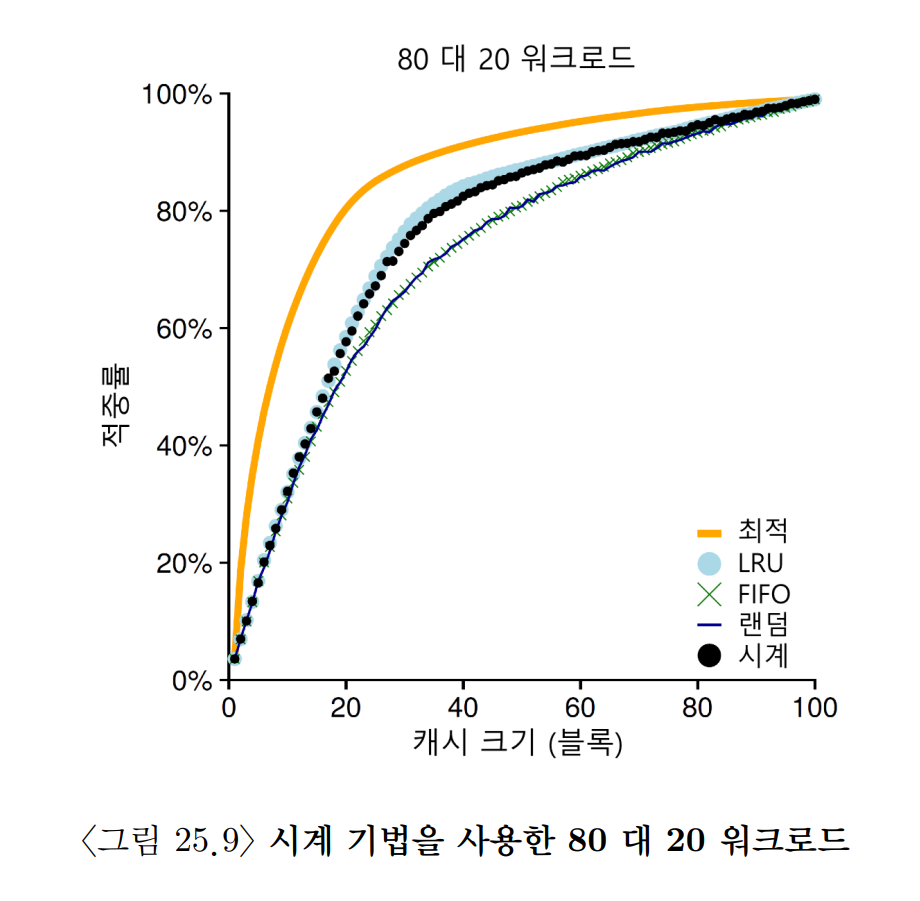
<br>

- 완벽한 LRU만큼은 아니지만 과거 정보를 고려하지 않는 다른 기법들에 비해 좋은 성능을 보인다.

### 25-9. 갱신된 페이지(Dirty Page)의 고려

- 운영체제가 교체 대상을 선택할 때 메모리에 탑재된 이후에 변경되었는지를 추가로 고려하는 것을 제안.

    - 어떤 페이지가 `변경(modified)`되어 `더티(dirty)` 상태가 되었다면, 그 페이지를 내보내기 위해서는 디스크에 변경 내용을 기록해야 하기 때문에 비싼 비용을 지불해야 한다.

    - 이를 지원하기 위해 하드웨어는 `modified bit(더티 비트)`를 제공한다.

        - 페이지가 변경될 때마다 비트가 1로 설정

        - 페이지 교체 알고리즘은 이를 고려해서 교체 대상을 선택한다.

        - 시계 알고리즘은 교체 대상을 선택할 때 사용되지 않은 상태이고 깨끗한 페이지를 먼저 찾도록 한다.

        - 실패했을 경우 수정되었지만 한동안 사용되지 않은 페이지를 찾는다.

### 25-10. 다른 VM 정책들

- 페이지 교체 정책만이 유일한 정책은 아니다.

- `페이지 선택 정책(page selection)`

    - `demand paging(요구 페이징)`

        - 운영체제는 대부분의 페이지를 읽어 들일 때 이 정책을 사용한다.

        - 페이지가 실제로 접근될 때 운영체제가 해당 페이지를 메모리로 읽어 들인다.

        - `선반입(prefetching)`

            - 운영체제는 어떤 페이지가 곧 사용될 것인지 예상할 수 있기 때문에 미리 메모리를 읽어 들일 수 있다.

            - 성공할 확률이 높을 때에만 한다.

    - `클러스터링(clustering) / 쓰기 모으기(grouping of writes)`

        - 한 번에 한 페이지씩 디스크에 쓸 수 있지만, 기록해야 할 페이지들을 메모리에 모은 후, 한 번에 디스크에 기록한다.

        - 디스크는 여러 개의 작은 크기의 쓰기 요청을 처리하는 것보다 하나의 큰 쓰기 요청을 더 효율적으로 처리할 수 있는 특성을 이용.

### 25-11. 쓰래싱(Thrashing)

- 메모리 사용 요구가 감당할 수 없을 만큼 많고 실행 중인 프로세스가 요구하는 메모리가 가용 물리 메모리 크기를 초과하는 경우에 운영체제는 어떻게 해야 하는가?

- `쓰래싱(thrashing)` : 워킹 셋의 크기가 메모리보다 커져 시스템이 끊임없이 페이징하는 상황.

    - `워킹 셋(working set)` : 프로세스가 일정 시간 동안 사용하는 페이지들의 집합

    - `진업 제어(admission control)` : 쓰레싱이 발생했을때 일부 프로세스의 실행을 중지

- 일부 시스템은 메모리 요구가 초과되면 **메모리 부족 킬러(out-of-memory killer)** 를 실행.

### 25-12. 요약

- 현대 시스템들은 시계 알고리즘과 같은 순수한 LRU 근사 방법에 몇 가지 성능 향상을 위한 기능을 추가.

    - `탐색 내성(scan resistance)`

## 26. VAX/VMS 가상 메모리 시스템

### 26-1. 배경

- `VAX-11 미니컴퓨터`

    - 1970년 말 Digital Equipment Corporation(DEC)에 의해 소개

- `VAX/VMS`

    - Microsoft Windows NT 개발을 이끌었다.

    - 다양한 종류의 기계들에서 실행되어야 한다는 문제를 안고 있다.

    - 컴퓨터의 구조적 결함을 소프트웨어로 보완한 훌륭한 사례

> **핵심 질문**  
> 운영체제가 다양한 시스템에서 효과적으로 실행되려면 어떻게 구현되어야 하는가?

### 26-2. 메모리 관리 하드웨어

- VAX-11은 페이징과 세그멘테이션의 하이브리드 구조를 갖고 있다.

    - 주소 공간의 하위 절반(프로세스 공간)

        - 프로세스 1번째 절반(P0) : 사용자 프로그램, 힙

            - 주소가 큰 쪽으로 증가

        - 프로세스 2번째 절반(P1) : 스택

            - 주소가 작은 쪽으로 증가

    - 주소 공간의 상위 절반(시스템 공간, S)

        - 운영체제의 보호된 코드와 데이터

- VMS의 고민

    - **VAX 하드웨어의 크기** : 512바이트

    - 페이지 테이블로 인한 메모리 압박의 정도를 경감시키기 위한 방법

        1. VAX-11은 사용자 주소 공간을 두 개의 세크멘트로 나누어 각 영역을 위한 페이지 테이블을 가지도록 한다.

            - 스택과 힙 사이의 사용되지 않은 주소 영역을 위한 페이지 테이블 공간을 없앤다.

        2. 운영체제는 사용자 페이지 테이블들을 커널의 가상 메모리에 배치하여 메모리 압박을 줄인다.

            - 페이지 테이블을 확장할땐 자신의 세그멘트 S 내에 공간을 할당

            - 메모리가 고갈되면 커널의 페이지들을 디스크로 스왑

    - 커널 가상 메모리에 페이지 테이블을 넣으면 주소 변환 과정이 더 복잡해진다.

    - 모든 과정은 VAX의 하드웨어 TLB에서 빠르게 처리할 수 있다.

    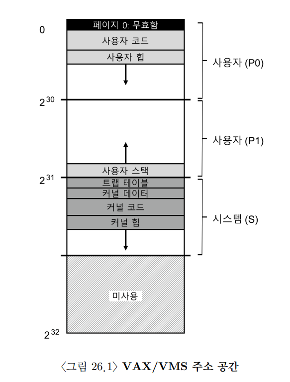
    <br>

### 26-3. 실제 주소 공간

- 코드 세그멘트는 절대로 페이지 0에서 시작하지 않는다.

- 페이지 0은 접근 불가능 페이지로 마킹, 널 포인터 접근을 검출할 수 있게 한다.

    - 효과적인 디버깅 지원

- 커널의 가상 주소 공간이 사용자 주소 공간의 일부이다.

    - 문맥 교환이 발생하면 운영체제는 `P0, P1 레지스터`를 다음 실행될 프로세스의 페이지 테이블을 가리키도록 변경한다.

    - `S 베이스와 바운드 레지스터`는 변경되지 않기 때문에 결과적으로 동일한 커널 구조들이 사용자 주소 공간에 매핑된다.

- **커널이 여러 주소 공간들로 매핑되는 이유**

    - 커널의 동작이 쉬워진다.

    - 운영체제는 사용자 프로그램으로부터 포인터를 받으면 그 포인터로부터 데이터를 자신의 구조로 복사하면 된다.

    - 이를 통해 커널은 보호된 영역이지만 응용 프로그램에서 쉽게 사용할 수 있다.

- **보호**

    - VAX는 페이지 테이블의 `protection bit`에 보호 수준을 지정한다.

    - 특정 페이지를 접근하기 위해서 필요한 CPU의 권한 수준을 기록한다.

    - 사용자 코드가 더 높은 수준의 자료를 접근하려고 시도하면 운영체제로 트랩이 걸리고 핸들러를 통해 종료된다.

### 26-4. 페이지 교체

- VAX 페이지 테이블 항목(PTE)

    - `valid bit`

    - `protection bit`

    - `modified bit`

    - 운영체제가 사용하기 위해 예약한 필드(5비트)

    - 물리 프레임 번호(PFN)

- VAX는 reference bit 없이 VMS 알고리즘을 통해 어떤 페이지를 자주 사용 중인지 파악한다.

- 개발자들은 **메모리 호그**에 대해서 고민했다.

    - `메모리 호그(memory hog)` : 메모리를 너무 많이 사용하는 프로그램

- **세그멘트된 FIFO**

    - 각 프로세스는 **상주 집합 크기(resident set size, RSS)** 라는 메모리를 유지할 수 있는 최대 페이지 개수를 지정 받는다.

    - 각 페이지들은 FIFO 리스트로 보관된다.

    - `second-chance list`

        - `전역 클린-페이지 프리 리스트(global clean-page free list)` : 제거된 페이지가 클린이라면 이곳에 추가.

        - `더티-페이지 리스트(dirty-page list)` : 제거된 페이지가 더티라면 이곳에 추가.

        - 순수 FIFO의 성능을 개선하기 위해 도입

        - 전역 자료 구조, 메모리에서 제거되기 전에 페이지가 보관되는 리스트

    - 다른 프로세스에서 빈 페이지가 필요하면 전역 클린 리스트에서 1번쨰 프리 페이지를 꺼낸다.

    - 원래 프로세스가 해당 페이지가 회수되기 전에 폴트를 발생시키면 다시 가져가 사용할 수 있다.

- **페이지 클러스터링**

    - VMS의 작은 페이지 크기를 극복할 수 있게 했다.

    - 페이지 크기가 작을수록 스왑할 때 디스크 I/O가 비효율적이다.

    - 전역 더티 리스트에 있는 페이지들을 작업 묶음을 만들어서 한 번에 디스크로 전송.

    - 운영체제는 스왑 공간 어디에든 페이지들을 자유롭게 배치할 수 있기 때문에 페이지들을 그룹으로 묶어서 쓸 수 있다.

### 26-5. 그 외의 VM 기법들

1. `요청 시 0으로 채우기(demanding zeroing)`


    - **구현** 

        - 페이지를 추가하는 요청이 오면 운영체제는 물리 메모리에서 페이지를 찾아 0으로 채운다.

            - 보안을 위해 이전에 할당되었던 페이지의 내용이 유출되는 것을 방지한다.

        - 주소 공간에 페이지를 매핑한다.

        - 페이지 테이블에 접근 불가능 페이지라고 표기하고 항목을 추가한다.

        - 추가된 페이지를 운영체제에서 읽으면 트랩이 발생한다.

        - 트랩을 처리하면서 운영체제는 `demanding zeroing`할 페이지라고 인지.

        - 물리 페이지를 0으로 채우고 필요한 작업(프로세스의 주소 공간을 매핑하는 등) 진행

    - **장점**

        - 프로세스가 해당 페이지를 접근하지 않으면 초기화 작업을 피할 수 있다.

2. `쓰기-시-복사(copy-on-write)`

    - **개념**

        - 운영체제가 한 주소 공간에서 다른 공간으로 페이지를 복사할 필요가 있을 때, 복사를 하지 않고 해당 페이지를 대상 주소 공간으로 매핑, 해당 페이지의 PTE를 양쪽 주소 공간에서 읽기 전용으로 표시한다.

    - 운영체제는 실제로 데이터 이동없이 빠른 복사를 할 수 있다.

    - **진행 흐름**

        - 두 주소 공간 중 하나가 페이지 쓰기를 시도하면 트랩이 발생한다.

        - 이때 운영체제는 COW 페이지라고 파악

        - 그 후 새 페이지를 할당하고, 데이터를 채우고, 새로운 페이지 폴트를 일으킨 페이지의 주소 공간을 매핑한다.

        - 페이지 사본으로 기존 작업을 계속한다.

    - **활용 예시**
    
        - 공유 라이브러리들을 여러 프로세스들의 주소 공간에 매핑해 공간 절약

        - fork()에서 COW를 수행하게 되면 불필요한 복사를 피할 수 있으며, 성능을 개선할 수 있다.


        
