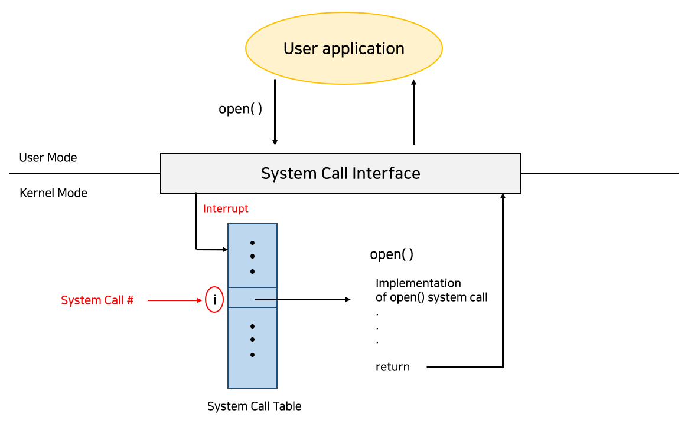
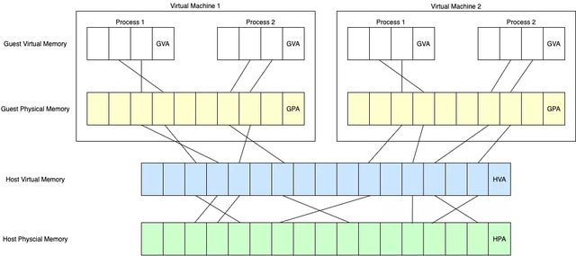

## 0. 개요

### 프로세서(CPU)의 기본 동작
- 프로세서는 프로그램의 명령어를 다음 순서로 실행한다.
  1. 명령어 가져오기(Fetch)
  2. 명령어 해석하기(Decode)
  3. 명령어 실행하기(Execute)

- 하나의 명령어 실행이 끝나면 다음 명령어를 계속 수행하며,
  프로그램이 종료될 때까지 이 과정을 반복한다.

---

### 운영체제(OS)란?
- 컴퓨터에서는 여러 프로그램이 동시에 실행된다.
- 이때 프로그램들이:
  - 메모리를 안전하게 사용하고
  - 서로 필요한 데이터를 공유하며
  - 키보드, 마우스, 디스크 같은 장치와 상호작용할 수 있도록
    관리해주는 소프트웨어가 필요하다.

- 이러한 역할을 하는 핵심 소프트웨어를 운영체제(OS)라고 한다.

- 운영체제의 대표적인 역할:
  - 여러 프로그램 동시 실행 관리
  - 메모리 관리
  - 장치 제어
  - 파일 관리
  - 프로그램 간 충돌 방지

---

### 운영체제와 가상화(Virtualization)
- 운영체제는 위 기능들을 수행하기 위해 가상화(Virtualization)를 사용한다.

- 가상화란:
  - 실제 물리 자원(Physical Resource)을
  - 프로그램이 사용하기 쉬운 가상 자원(Virtual Resource)처럼 제공하는 기술이다.

- 예를 들어:
  - 하나의 CPU를 여러 프로그램이 동시에 사용하는 것처럼 보이게 함
  - 하나의 메모리를 프로그램마다 독립적으로 사용하는 것처럼 보이게 함

- 이러한 이유로 운영체제를 "가상 머신(Virtual Machine)"이라고 부르기도 한다.

---

### 시스템 콜(System Call)과 API
- 프로그램은 운영체제의 기능을 직접 사용할 수 없다.
- 대신 운영체제가 제공하는 API와 시스템 콜(System Call)을 사용한다.

- 시스템 콜은:
  - 프로그램 실행
  - 메모리 사용
  - 파일 읽기/쓰기
  - 장치 접근
    등을 운영체제에 요청하는 방법이다.

- 운영체제는 이러한 기능들을 쉽게 사용할 수 있도록
  표준 라이브러리(Standard Library)도 함께 제공한다.

---

### 운영체제는 자원 관리자(Resource Manager)
- 운영체제는 여러 프로그램이:
  - CPU
  - 메모리
  - 디스크
  - 입출력 장치
    등을 함께 사용할 수 있도록 관리한다.

- 운영체제는:
  - CPU를 여러 프로그램이 나누어 사용하게 하고
  - 각 프로그램이 자신의 데이터와 명령어에 접근할 수 있게 하며
  - 디스크와 같은 장치를 공유할 수 있도록 한다.

- 따라서 운영체제를 자원 관리자(Resource Manager)라고도 부른다.

- 운영체제의 중요한 목표:
  - 효율성(Efficiency)
  - 공정성(Fairness)
  - 안정성(Stability)

---

## 1. CPU 가상화



### 1. CPU 가상화
- CPU 가상화: 하드웨어의 도움을 받아 운영체제가 가상 CPU를 만들어서 여러 CPU가 존재하는 듯한 환상을 만드는 것이다
- 프로그램을 실행하고 멈추고, 어떤 프로그램을 실행시킬 것인가 운영체제에 알려주기 위해서는 인터페이스(API)가 필요하다
  - API는 운영체제와 사용자가 상호작용할 수 있는 주된 방법이다
- 다수의 프로그램을 동시에 실행했을 때 어떤 것이 실행되느냐는 운영체제의 정책에 달려있다
  - 동시에 다수의 프로그램을 실행시키는 자원 관리자로서 운영체제의 역할을 다룬다

### 2. 메모리 가상화

- 메모리는 데이터를 저장하는 공간이며, 데이터에 접근하려면 주소(Address)가 필요하다.
- 프로그램은 변수, 객체, 함수, 명령어 등을 모두 메모리에 저장하고 사용한다.

- 운영체제는 각 프로그램에게 독립적인 메모리가 있는 것처럼 동작하게 만든다.
- 이를 메모리 가상화(Memory Virtualization)라고 한다.

예시:
```text
크롬의 0x1000 → 실제 RAM 5000번
게임의 0x1000 → 실제 RAM 9000번
```

- 프로그램 입장에서는 같은 주소를 사용하는 것처럼 보이지만,
  실제 물리 메모리는 서로 다르게 연결(mapping)된다.

- 따라서:
  - 프로그램끼리 서로의 메모리를 침범하지 못하고
  - 여러 프로그램을 동시에 안전하게 실행할 수 있다.



### 3. 병행성
- 프로그램이 한 번에 많은 일을 (동시에) 하려 할 때 발생하는 문제들을 의미한다
- 운영체제는 한 프로세스 실행, 다음 프로세스, 그다음 순서 등 여러 프로세스를 실행시켜 한 번에 많은 일을 한다
- 병행성 문제는 운영체제 뿐만 아니라 멀티 쓰레드에서도 나타난다
  - 이는 원자적으로 실행되지 않기 때문에 일어나는 일이다

### 4. 영속성
- DRAM(메모리)은 휘발성이기 때문에 전원이 꺼지면 데이터가 사라진다.
- 따라서 데이터를 오래 저장하기 위해 SSD, HDD 같은 저장 장치가 필요하다.

#### 파일 시스템(File System)

- 운영체제는 디스크를 관리하기 위해 파일 시스템(File System)을 사용한다.
- 파일 시스템은:
  - 파일을 저장하고
  - 읽고
  - 수정하고
  - 삭제하는 작업을 담당한다.

- 또한 파일을:
  - 안전하게 저장하고
  - 효율적으로 관리하는 역할도 한다.

#### CPU/메모리 가상화와의 차이
- CPU와 메모리는 가상화(Virtualization)를 사용한다.
- 하지만 디스크는 보통 가상의 디스크를 만들어주는 것 보다는 파일을 안전하게 저장하고 관리하는 것에 초점이 맞춰져 있다.

#### 시스템 콜(System Call)
- 프로그램은 파일을 다루기 위해 시스템 콜을 사용한다.

- 대표적인 시스템 콜:
```c
open()   // 파일 열기
write()  // 파일 쓰기
close()  // 파일 닫기
```
- 이 요청들은 운영체제의 파일 시스템으로 전달된다.

#### 파일 저장 과정

- 예를 들어 메모장에 글 작성 → 저장 버튼 클릭
- 운영체제는 내부적으로:

1. 디스크의 어디에 저장할지 결정
2. 파일 정보를 관리하는 자료 구조 갱신
3. 실제 데이터를 디스크에 기록
4. 저장 상태 추적

등의 작업을 수행한다.

#### 운영체제와 표준화된 인터페이스

- 운영체제는 시스템 콜이라는 표준화된 방법으로 장치에 접근하게 만든다.
- 그래서 프로그램은:
  - SSD 종류
  - HDD 제조사
  - 실제 하드웨어 구조
    를 몰라도 동일한 방식으로 파일을 사용할 수 있다.

즉 프로그램 → 시스템 콜 → 운영체제 → 저장 장치 형태로 동작한다.

### 5. 설계 목표

- 운영체제는 CPU, 메모리, 디스크 같은 물리 자원을 가상화하고 여러 프로그램이 동시에 실행될 때 발생하는 문제를 해결한다.
- 또한 파일을 안전하게 저장하여 데이터의 영속성(Persistence)을 보장한다.

- 운영체제의 가장 기본적인 목표는 사용자가 시스템을 쉽고 편리하게 사용할 수 있도록 만드는 것이다.
- 이를 위해 추상화(Abstraction)를 사용하여 복잡한 하드웨어를 숨긴다.

예시:
```text
SSD의 실제 동작 원리
→ 몰라도 파일 저장 가능
```

- 운영체제는 성능도 중요하게 생각한다.
- 즉 CPU, 메모리, 디스크를 효율적으로 관리하여 오버헤드(불필요한 비용)를 최소화해야 한다.

- 또한 프로그램 간 보호(Protection)도 중요하다.
- 하나의 프로그램 오류가 다른 프로그램이나 운영체제에 영향을 주지 않도록 해야 한다.
- 이를 고립(Isolation) 원칙이라고 한다.

예시:
```text
게임 오류 발생
→ 브라우저까지 같이 종료되면 안 됨
```

- 운영체제는 항상 안정적으로 실행되어야 한다.
- 운영체제가 실패하면 실행 중인 모든 프로그램도 영향을 받기 때문이다.

예시:
```text
운영체제 오류
→ 블루스크린(BSOD)
```

- 이 외에도 에너지 효율성, 보안(Security), 이동성(Portability) 등도 중요한 설계 목표이다.

### 6. 역사 약간
#### 1. 초창기 운영체제: 단순 라이브러리
- 초창기 운영체제는 자주 사용되는 함수들을 모아 놓은 라이브러리에 불과했다
  - 예를들어 저수준 입출력 처리 코드 API를 제공하여 개발자를 편하게 해줬다
  - 옛날 메인프레임 시스템에서는 작업이 준비되면 일괄적으로 처리했다 (batch)
  - 당시 컴퓨터는 비용 때문에 대화 방식(실시간)으로 사용되지 않았다. 시간당 수만 달러이기 때문이다

#### 2. 라이브러리를 넘어서: 보호
- 컴퓨터 관리 면에서 더 중심적인 역할을 하게된다
- 모든 응용 프로그램이 디스크의 원하는 지점을 읽을 수 있다면 보안적으로 위험할 것이다
  - 그래서 시스템 콜이라는 아이디어가 나왔다
  - 사용자 응용 프로그램은 사용자 모드(user mode)에서 실행되고 이는 하드웨어적으로 제한한다
  - 예를들어 디스크 입출력, 물리 메모리 페이지 접근 또는 네트워크 패킷 송신 등을 할 수 없다
- 시스템 콜은 보통 `trap`이라 불리는 특별한 하드웨어 명령어를 이용하여 호출된다
- 시스템 콜 시작 시 하드웨어는 미리 지정된 `트랩 핸들러`함수에게 제어권을 넘기고 커널 모드(kernel mode)로 격상시킨다
  - 트랩 핸들러 함수는 하드웨어가 미리 구현해놓고 커널 모드에서는 자유롭게 접근할 수 있다
  - 서비스를 완료하면 `return-from-trap` 특수 명령어를 이용해 제어권을 다시 넘기면서 사용자 모드로 전환한다

#### 3. 멀티프로그래밍 시대
- 컴퓨터 자원의 효율적 사용을 위해 `멀티프로그래밍`기법이 대중으로 사용되었다
  - 한 번에 하나의 프로그램만 실행시키는 것이 아닌 운영체제는 여러 작업을 메모리에 탑재하고 작업들을 빠르게 번갈아 가며 실행하여 CPU 사용률을 향상시킨다
  - 입출력 장치가 느리기 때문에 전환(switching)능력이 특히 중요하였다
- 멀티프로그램 지원의 필요와 인터럽트를 통한 입출력 작업 처리 등이 운영체제의 발전에 혁신을 가져왔다
  - 다른 프로그램 메모리에 접근하지 못하게 메모리 보호와 같은 주제가 중요하게 되었다
  - 병행성도 문제도 생겼다