## 18. 주소 변환의 원리
- CPU 가상화 부분에서 제한적 직접 실행(LDE)기법을 다뤘다
  - LDE의 아이디어는 간단하고, 대부분의 경우 프로그램은 하드웨어에서 직접 실행된다
  - 그러나 프로세스가 시스템 콜을 호출하거나 타이머 인터럽트가 발생할 때 등의 특정 순간에는 운영체제가 개입하여 문제가 발생하지 않도록 한다
  - 중요한 순간에 운영체제가 관여하여 하드웨어를 직접젲어한다. 효율성과 제어가 현대 운영체제의 목표이다
- 메모리 가상화도 비슷하게 효율성과 제어 모두를 추구한다
  - 효율성을 높이려면 하드웨어 지원을 활용할 수밖에 없다
  - 처음에는 몇 개의 레지스터에서 TLB, 페이지 테이블 등 점차 복잡한 하드웨어를 사용하게 된다
  - 제어는 응용프로그램이 다른 메모리에 접근하지 못하는 것을 보장하는 것을 의미한다
  - 마지막 유연성 측면에서 VM 시스템에서 필요한 사항이 있다
    - 프로그래머가 원하는 대로 주소 공간을 사용하고 프로그래밍하기 쉬운 시스템을 만들기 원하는 데 핵심 문제는 다음과 같다
    - 어떻게 효율적이고 유연하게 메모리를 가상화하는가?
- 우리가 다룰 기법은 하드웨어-기반 주소 변환 또는 짧게 주소 변환이다
  - 주소 변환을 통해 하드웨어는 가상 주소를 실제 존재하는 물리 주소로 변환한다
  - 물론 하드웨어만으로 구현할 수 없고 운영체제가 관여해야 한다
  - 운영체제는 메모리의 빈 공간과 사용 중인 공간을 항상 알고 있어야 하고, 메모리 사용을 제어하고 관리한다
- 가상화의 목표는 프로그램이 자신의 전용 메모리를 소유하고 그 안에 자신의 코드와 데이터가 있다는 환상을 만드는 것이다

### 1. 가정
- 가상화는 위한 첫 번째 시도는 간단하다
- 우선 사용자 주소 공간은 물리 메모리에 연속적으로 배치되어야 한다고 가정한다

### 2. 사례
```c
void func(){
    int x = 3000;
    x = x + 2;
}

LOAD  R1, [15KB]    ; x 값을 메모리에서 읽음
ADD   R1, 2         ; 레지스터 값 +2
STORE R1, [15KB]    ; 결과를 다시 메모리에 저장
```
- 이 명령어가 실행되면 다음과 같은 메모리 접근이 일어난다
  - 주소 128의 명령어를 반입
  - 이 명령어 실행(주소 15KB에서 탑재)  
  - 주소 132의 명령어를 반입
  - 이 명령어 실행(메모리 참조 없음)
  - 주소 135 명령어를 반입
  - 이 명령어 실행(15KB에 저장)
- 프로그램 관점에서 주소 공간은 0부터 최대 16KB까지이다
  - 모든 프로그램 참조는 이 범위 내에 있어야 한다
  - 운영체제는 물리 메모리 주소 0이 아닌 다른 곳에 위치시키고 싶고, 어떻게 하면 프로세스 모르게 메모리를 다른 위치에 재배치 하느냐가 해결해야 할 문제이다

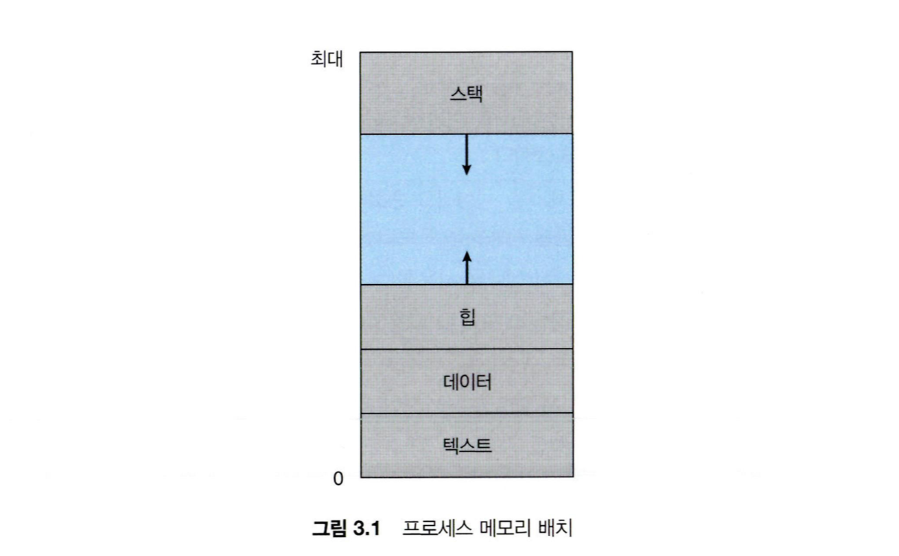

### 3. 동적(하드웨어-기반) 재배치
- 시분할 컴퓨터에서 베이스와 바운드라는 아이디거 채택되었다. 동적 재배치라고도 한다
- 각 CPU마다 2개의 하드웨어 레지스터가 필요하다
  - 하나의 베이스 레지스터이고, 다른 하나는 바운드 레지스터 또는 한계 레지스터라고 한다
  - 이 베이스와 바운드가 우리가 원하는 위치에 주소 공간을 배치할 수 있게 한다
  - 배치와 동시에 프로세스가 오직 자신의 주소 공간에만 접근한다는 것을 보장한다
- 모든 프로그램은 주소 0에 탑재되는 것처럼 작성되고 컴파일된다
  - 프로세스가 생성하는 모든 주소가 `physical address = virtual address + base`로 변환된다
  - 하드웨어는 베이스 레지스터의 내용을 이 주소에 더하여 물리 주소를 생성한다 
- 이전 코드로 예를 들어보자
  - 프로그램 카운터(PC)는 128로 설정된다
  - 하드웨어가 이 명령어를 반입할 때 32KB에 더해 32896의 물리 주소로 명령어를 가져온다
  - 가장 주소 15KB의 값을 탑재하라는 명령어를 내리면 32KB를 더해 47KB에 원하는 내용을 탑재한다
- 이 주소의 재배치는 실행 시에 일어나고 프로세스가 실행한 후에도 주소 공간을 이동할 수 있기 때문에 동적 재배치라고도 불린다
- 여기서 바운드 레지스터는 보호를 지원하기 위해 존재한다
  - 메모리 참조가 합법적인지를 확인하기 위해 가상 주소가 바운드 안에 있는지 확인한다
  - 바운드 레지스터는 항상 16KB로 이것보다 크거나 음수인 주소를 참조하면 예외를 일으키고 종료한다
  - 주소 변환에 도움을 주는 프로세서의 일부를 메모리 관리 장치(MMU)라고 부르기도 한다
  - 더 정교한 메모리 관리 기법을 위해 MMU에 더 많은 회로를 추가한다

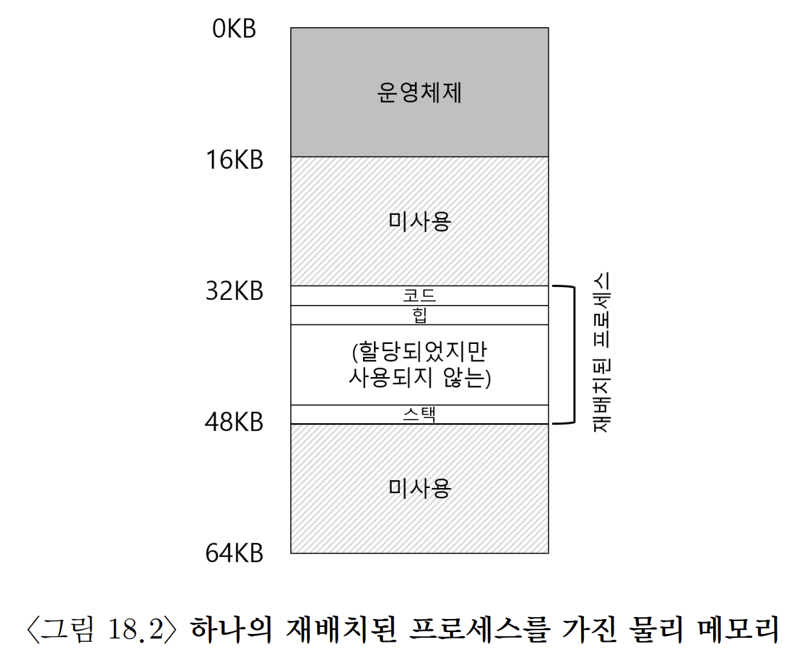

>#### 여담: 소프트웨어-기반 재배치
> - 초창기에는 하드웨어 도움 없이 소프트웨어만으로 재배치를 수행했다.
> - 이를 정적 재배치(static relocation)라고 하며, 로더(loader)가 실행 파일 내부의 주소 참조들을 실제 적재 위치에 맞게 수정했다.
> - 예를 들어 프로그램이 주소 1000을 참조하도록 작성되었는데 실제 메모리 3000번지부터 적재되었다면, 로더는 해당 주소 참조를 4000으로 변경한다. (더하기 연산)
> - 하지만 하드웨어 기반 메모리 보호 기능이 없었기 때문에, 프로그램이 다른 프로세스나 운영체제 메모리에 접근하는 것을 막기 어려웠다.
> - 또한 주소를 실행 전에 고정해버리므로, 실행 중 다른 위치로 프로세스를 이동시키려면 주소를 다시 전부 수정해야 하는 문제가 있었다.

### 4. 하드웨어 지원: 요약
- 하드웨어는 사용자 모드(user mode)와 커널 모드(kernel mode)를 지원한다.
- 운영체제는 커널 모드에서만 특권 작업을 수행할 수 있다.
- 하드웨어는 메모리 보호를 위해 베이스(base) 레지스터와 바운드(bound) 레지스터를 제공한다.
- CPU는 메모리 접근 시 베이스와 바운드 값을 이용해 주소가 유효한 범위인지 검사한다.
- 운영체제는 context switch 시 베이스와 바운드 레지스터 값을 변경한다.
- 이러한 레지스터를 변경하는 명령어는 특권 명령어(privileged instruction)이므로 커널 모드에서만 실행할 수 있다.

### 5. 운영체제 이슈
- 동적 재배치 지원을 위해 운영체제에도 새로운 이슈가 등장한다
- 베이스와 바운드 방식의 가상 메모리 구현을 위해서 운영체제가 반드시 개입해야 하는 세 개의 시점이 존재한다
  1. 프로세스가 생성될 때 운영체제는 주소 공간이 저장될 메모리 공간을 찾아 조치를 취해야 한다
     2. 각 주소 공간은 물리 메모리 크기보다 작고 크기가 일정하다는 가정하에서는 쉽게 처리할 수 있다
     3. 새로운 프로세스가 생성되면 운영체제는 새로운 주소 할당을 위해 `빈 공간 리스트`자료 구조를 검색해야 한다
     4. 가변 크기 주소 공간일 경우 더 복잡해진다
  5. 프로세스가 종료될 때(정상 혹은 비정상) 사용하던 메모리를 회수하여 사용할 수 있게 해야 한다
     6. 프로세스가 종료되면, 빈 공간 리스트에 넣고 연관도니 자료 구조를 모두 정리한다
  7. Context Switching이 일어날 때도 몇 가지 추가 조치를 취해야 한다
     8. CPU마다 한 쌍의 베이스-바운드 레지스터만 존재하고, 다른 프로그램마다 다른 값을 가져야 한다
     9. 프로세스를 중단시키면 PCB에 베이스와 바운드 레지스터의 값을 저장하고 다시 사용한다
     10. 바운드와 베이스 값만 변경하면 되기 때문에 새 위치를 가르키는 것도 쉽다

### 6. 요약
- 베이스 레지스터를 가상 주소에 더하고 생성된 주소가 바운드를 검사하기 위한 바운드 레지스터 등 간단한 하드웨어 회로만 추가하면 되기 때문에 매우 효율적이다
- 하지만 동적 재배치는 비효율적이다
  - 크기가 작아 할당된 영역의 내부 공간이 사용되지 않으면 단순한 낭비가 된다
    - 이런 낭비를 내부 단편화라고 한다
    - 고정 크기의 슬롯에 주소 공간을 배치해야 되기 때문에 내부 단편화가 발생한다

## 19. 세그멘테이션
- 지금까지는 주소 공간 전체를 메모리에 탑재하는 것을 가정해 왔다.
  - 하지만 이렇게 되면 스택과 힙 사이에 사용되지 않는 큰 공간이 존재한다
  - 베이스와 바운드 레지스터 방식은 메모리 낭비가 심하고, 주소 공간이 메모리 공간보다 큰 경우 실행이 매우 어렵다

### 1. 세그멘테이션: 베이스/바운드의 일반화
- 이를 해결하기 위한 아이디어가 세그멘테이션(segmentation)이다.
- MMU에는 하나의 베이스-바운드 쌍만 존재하는 것이 아니라, 각 세그먼트마다 별도의 베이스(base)와 바운드(bound) 값이 존재한다.
- 세그먼트는 프로그램 전체를 하나의 덩어리로 보지 않고, 코드 / 힙 / 스택을 각각 따로 관리한다
- 세그멘테이션에서는 각 세그먼트를 물리 메모리의 서로 다른 위치에 독립적으로 배치할 수 있다.
- 따라서 주소 공간 사이의 사용되지 않는 빈 영역을 실제 물리 메모리에 배치하지 않아도 되어 메모리 낭비를 줄일 수 있다.

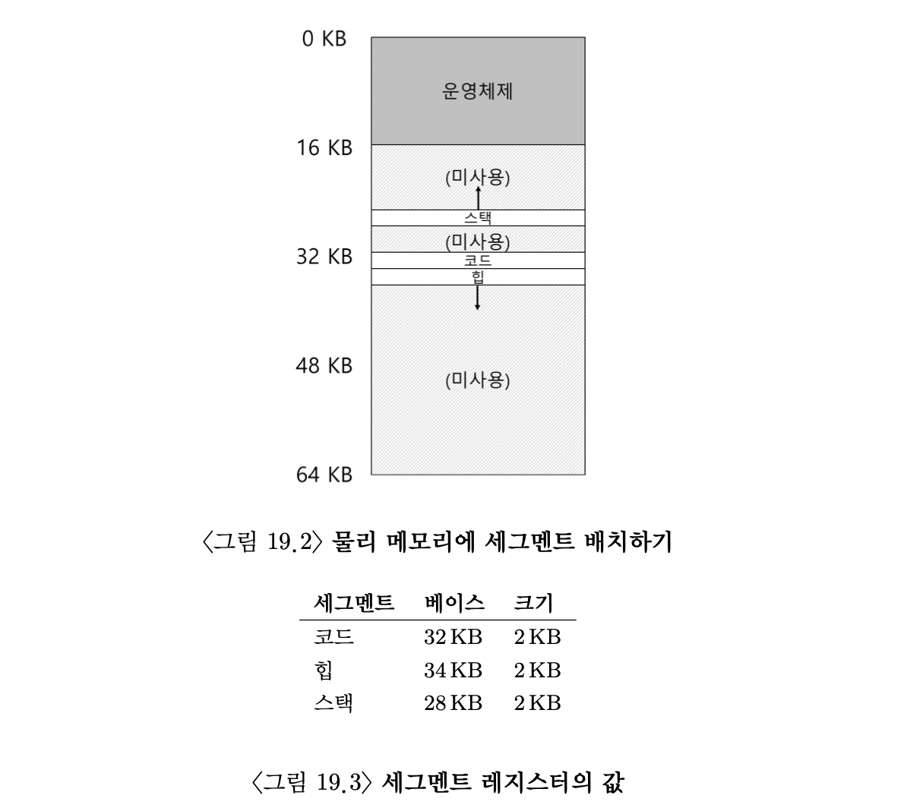

- 세그멘테이션에서는 가상 주소를 그대로 물리 주소에 더하지 않는다.
- 먼저 해당 주소가 어떤 세그먼트에 속하는지 확인한 뒤, 세그먼트 시작 기준 offset을 계산한다.
- 예를 들어 힙 세그먼트가 가상 주소 4KB에서 시작하고, 가상 주소 4200을 접근한다면:
  - offset = 4200 - 4096 = 104
- 힙 세그먼트의 base가 물리주소 34KB라면:
  - 물리주소 = 34KB + 104 = 34920
- 즉 세그먼트 내부 주소는 세그먼트 시작 기준 offset으로 해석된다.
- 만약 offset이 세그먼트 크기(bound)를 초과하면 세그먼트 위반(segmentation fault)이 발생한다.

### 2. 세그먼트 종류의 파악
하드웨어는 가상 주소가:
- 코드(Code)
- 힙(Heap)
- 스택(Stack)
중 어떤 세그먼트인지 알아내야 한다.

그리고 해당 세그먼트의 Base-Bound를 사용하여 실제 물리 주소를 계산한다.

#### 1. 최상위 비트로 구분하는 방식
가상 주소의 최상위 비트를 세그먼트 종류 구분용으로 사용한다.
예시: 14비트 주소

```text
[ 세그먼트 ][ 오프셋 ]
    2비트      12비트

세그먼트 종류:
00 → 코드
01 → 힙
10 → 스택
11 → 사용 안 함

예시:
00 0000 0110 1000

↓

00 → 코드 세그먼트
0000 0110 1000 → 오프셋

최종 물리 주소 = Base + Offset

바운드 검사:
Offset < Bound
```

#### 2. 묵시적 접근 방식 (Implicit Approach)
주소가 어떻게 만들어졌는지 보고 세그먼트를 판단한다.
- PC 기반 주소
  - PC(Program Counter)가 만든 주소는 코드 세그먼트로 판단한다
  - 왜냐하면 PC는 실행할 명령어 주소를 저장하기 때문이다.
- SP/BP 기반 주소
  - SP(Stack Pointer), BP(Base Pointer) 기반 주소은 스택 세그먼트로 판단한다
  - 왜냐하면 함수 호출, 지역 변수 등이 스택에 저장되기 때문이다.
- 나머지 주소
  - PC 기반도 아니고 SP/BP 기반도 아니면 힙 세그먼트로 간주한다.

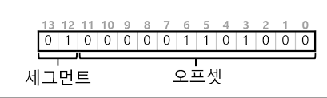

### 3. 스택
- 스택(Stack)은 코드나 힙과 다르게 높은 주소에서 낮은 주소 방향으로 확장된다. 즉 주소가 감소하는 방향으로 커진다.
- 그래서 하드웨어는 단순히 Base와 Bound만 아는 것이 아니라 이 세그먼트가 어느 방향으로 성장하는지도 함께 알아야 한다.
- 간단한 하드웨어 추가로 방향 정보를 저장해야 한다
  - 1 → 주소 증가 방향
  - 0 → 주소 감소 방향
- 가상 주소 15KB를 물리 주소 27KB로 변환한다고 가정하자.
- 15KB를 이진수로 표현하면 `11 1100 0000 0000`이 된다
  - 상위 2비트인 `11`은 스택 세그먼트를 의미하고, 나머지 부분은 오프셋(offset)이다.
  - 이 오프셋은 3KB이다.
  - 하지만 스택은 아래 방향으로 성장하기 때문에 일반 세그먼트처럼 단순히 `Base + Offset`으로 계산하지 않는다.
- 스택은 반대 방향으로 커지므로 `실제 오프셋 = 오프셋 - 세그먼트 최대 크기`를 사용한다.
  - 세그먼트 최대 크기가 4KB라면 `3KB - 4KB = -1KB`가 된다.
  - 즉 실제 오프셋은 `-1KB`이다.
  - 스택 베이스가 28KB라면 `28KB + (-1KB) = 27KB`가 되어 최종 물리 주소는 27KB가 된다.

### 4. 공유 지원
- 세그멘테이션 기법이 발전하면서 단순히 메모리를 나누는 것뿐만 아니라, 여러 프로세스가 일부 세그먼트를 함께 사용하는 방식도 가능해졌다. 이렇게 하면 같은 내용을 여러 번 메모리에 올릴 필요가 없어 메모리를 절약할 수 있다.
- 특히 코드(Code) 세그먼트 공유가 대표적이다. 예를 들어 동일한 프로그램을 여러 개 실행하더라도 프로그램 코드 자체는 대부분 동일하다. 그런데 프로세스마다 코드 영역을 따로 복사하면 메모리가 낭비된다.
- 그래서 운영체제는 하나의 코드 세그먼트를 여러 프로세스가 함께 참조하도록 만들 수 있다. 각 프로세스는 자신만의 독립적인 주소 공간을 사용한다고 생각하지만, 실제로는 운영체제가 내부적으로 같은 코드 메모리를 공유시키는 것이다.
- 하지만 코드 영역을 공유하려면 한 프로세스가 코드를 수정해서는 안 된다. 이를 해결하기 위해 하드웨어는 `Protection Bit`를 사용한다.
- Protection Bit는 해당 세그먼트에 대해:
  - 읽기(Read)
  - 쓰기(Write)
  - 실행(Execute)중 어떤 동작이 가능한지를 나타낸다.
- 예를 들어 코드 세그먼트를:
  - 읽기 가능
  - 실행 가능
  - 쓰기 불가로 설정하면 여러 프로세스가 같은 코드를 안전하게 공유할 수 있다.
- Protection Bit가 추가되면 하드웨어는 단순히 주소가 세그먼트 범위 안에 있는지만 검사하지 않는다. 해당 접근이 허용된 동작인지도 함께 검사해야 한다.
- 예를 들어:
  - 읽기 전용 영역에 쓰기를 시도하거나
  - 실행 불가 영역에서 코드를 실행하려고 하면 하드웨어는 예외(Exception)를 발생시키고 운영체제가 해당 프로세스를 처리한다.
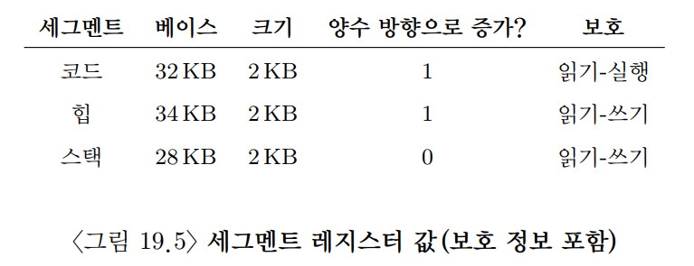

### 5. 소단위 대 대단위 세그멘테이션
- 지금까지 설명한 방식은 보통:
  - 코드
  - 힙
  - 스택처럼 주소 공간을 비교적 큰 단위로 나누는 방식이다. 이를 `대단위 세그멘테이션`이라고 한다.
- 반면 일부 초기 시스템은 주소 공간을 훨씬 더 작은 단위들로 잘게 나누었다. 이를 `소단위 세그멘테이션`이라고 한다.
- 세그먼트 개수가 많아지면 각 세그먼트의 정보를 저장할 구조가 필요하다. 이를 위해 사용하는 것이 `세그먼트 테이블(Segment Table)`이다.
- 세그먼트 테이블에는 각 세그먼트의:
  - Base
  - Bound
  - Protection Bit같은 정보가 저장된다.
- 세그먼트 테이블을 사용하면 많은 수의 세그먼트를 더 유연하게 생성하고 관리할 수 있다.
- 초기 시스템에서는 주소 공간을 더 잘게 나누는 것이 메모리를 효율적으로 사용할 수 있다고 생각하여 소단위 세그멘테이션 방식을 사용하기도 했다.
  - 현재는 관리가 복잡해주고 외부 단편화 문제로 사용하지 않는다

### 6. 운영체제의 지원
- 세그멘테이션은 하나의 Base-Bound만 사용하는 방식보다 메모리를 훨씬 효율적으로 사용할 수 있다.
- 기존 방식에서는 프로세스 전체 주소 공간을 하나의 연속된 메모리 공간으로 할당해야 했다.
- 그래서 실제로 사용하지 않는 영역까지도 물리 메모리에 포함되는 문제가 있었다.
- 대표적으로 힙과 스택 사이의 비어 있는 공간도 실제 메모리에 할당되어야 했다.
- 하지만 세그멘테이션은:
  - 코드
  - 힙
  - 스택을 각각 독립적으로 관리한다.
- 따라서 실제로 사용하는 부분만 물리 메모리에 올리면 되므로 메모리를 더 효율적으로 사용할 수 있다.

#### 1.Context Switching 문제
- 세그멘테이션은 새로운 문제들도 발생시킨다.
- Context Switching이 발생하면 운영체제는 현재 프로세스의 세그먼트 레지스터 값을 저장하고, 다음 프로세스의 세그먼트 레지스터 값을 복원해야 한다.
- 왜냐하면 프로세스마다:
  - Base
  - Bound
  - Protection 정보가 모두 다르기 때문이다.
#### 2. 외부 단편화 문제
- 가장 큰 문제는 물리 메모리의 빈 공간 관리이다.
- 새로운 프로세스가 생성되면 운영체제는 각 세그먼트를 저장할 수 있는 빈 공간을 물리 메모리에서 찾아야 한다.
- 그런데 세그먼트는:
  - 크기가 서로 다르고
  - 생성과 삭제가 반복되기 때문에 메모리가 점점 조각나게 된다.

예시:
```text
[사용][빈칸][사용][빈칸][사용]
```

- 이런 현상을 `외부 단편화(External Fragmentation)`라고 한다.
- 전체 빈 공간의 크기는 충분하더라도 연속된 큰 공간이 없어서 새로운 세그먼트를 배치하지 못할 수 있다.

#### 3.압축(Compaction)
- 외부 단편화를 해결하는 방법 중 하나가 `압축(Compaction)`이다.
- 압축은 흩어진 세그먼트들을 한쪽으로 모아서 큰 연속 공간을 만드는 방식이다.

예시:
```text
[사용][빈칸][사용][빈칸]

↓

[사용][사용][빈칸][빈칸]
```
- 이 과정에서 운영체제는:
  - 실행 중인 프로세스를 잠시 멈추고
  - 세그먼트를 새로운 위치로 복사한 뒤
  - 세그먼트 레지스터의 Base 값을 수정해야 한다.
- 하지만 메모리 복사는 비용이 큰 작업이기 때문에 압축은 성능 부담이 크다.

#### 4.빈 공간 관리 알고리즘
- 실제 시스템에서는 빈 공간을 효율적으로 관리하기 위한 알고리즘들도 많이 사용된다.
- 대표적인 방식은:
  - 최초 적합(First Fit)
  - 최적 적합(Best Fit)
  - 최악 적합(Worst Fit)
  - 버디 알고리즘(Buddy Algorithm)등이 있다.
- 예를 들어 `최적 적합(Best Fit)`은 요청한 크기와 가장 비슷한 크기의 빈 공간을 선택하는 방식이다.
- 즉 20KB가 필요하다면 빈 공간들 중에서 20KB와 가장 가까운 크기의 공간을 선택하여 메모리 낭비를 줄이려는 것이다.

### 7. 요약
- 세그멘테이션은 많은 문제를 해결하며, 메모리 가상화를 효과적으로 실현할 수 있다
- 세그멘테이션에 필요한 산술 연산은 쉽고 하드웨어 구현에 적합하기 때문에 속도도 빠르고 변환 오버헤드도 최소이다
- 그러나 세그먼트의 크기가 일정하지 않기 때문에 여러 문제가 발생한다
  - 첫째는 외부 단편화이다
  - 두번째는 드문드문 사용되는 주소 공간을 지원할 만큼 유연하지 못하다는 것이다
  - 예를들어 크기가 크지만 가끔 사용되는 힙이 하나의 논리적인 세그먼트에 배정되어 있다고 할 때 이 힙에 접근하기 위해서는 힙 전체가 여전히 물리 메모리에 존재해야 한다
  - 다시말해서 주소 공간이 사용되는 모델과 이를 지원하기 위한 세그멘테이션 설계 방법이 정확히 일치하지 않는다면 제대로 동작하지 않는다

## 20. 빈 공간 관리
- 여기서는 모든 메모리 관리 시스템의 중요한 주제인 `빈 공간 관리`를 다룬다.
- 메모리 관리 시스템은:
  - `malloc` 같은 사용자 수준 메모리 할당 라이브러리일 수도 있고
  - 프로세스 주소 공간을 관리하는 운영체제 자체일 수도 있다.
- 핵심은 사용되지 않는 메모리 공간을 어떻게 효율적으로 관리할 것인가이다.

#### 1. 고정 크기 공간 관리
- 빈 공간 관리가 쉬운 경우는 메모리가 고정 크기 단위로 나누어져 있는 경우이다.
- 예를 들어 메모리가 모두 같은 크기의 블록으로 나뉘어 있다면 운영체제는 단순히 빈 블록들의 리스트만 관리하면 된다.
- 클라이언트가 메모리를 요청하면 리스트에서 하나를 꺼내 반환하면 된다.
- 페이지(Page) 기반 메모리 관리가 대표적인 예시이다.

#### 2.가변 크기 공간 관리
- 빈 공간 관리가 어려운 경우는 메모리가 가변 크기의 빈 공간들로 구성되어 있는 경우이다.
- 이는:
  - 사용자 수준 메모리 할당 라이브러리(`malloc`)
  - 세그멘테이션 기반 운영체제 등에서 발생한다.
- 문제는 메모리 요청 크기가 계속 달라진다는 점이다.
- 어떤 요청은 4KB가 필요하고 어떤 요청은 20KB가 필요할 수 있다.
- 그러다 보면 빈 공간들이 점점 작은 조각들로 나뉘게 된다.

예시:

```text
[사용][빈칸][사용][작은 빈칸][사용]
```
- 이런 현상을 `외부 단편화(External Fragmentation)`라고 한다.
- 외부 단편화가 발생하면 전체 빈 공간의 크기는 충분하더라도 연속된 큰 공간이 없어서 메모리 할당에 실패할 수 있다.
- 아래 그림과 같이 흩어져 있다면 연속된 20KB 공간이 없기 때문에 요청이 실패할 수 있다.
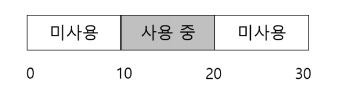

### 1. 가정
- 메모리 할당기는 `malloc()`과 `free()` 같은 기본 인터페이스를 제공한다고 가정한다.
- `malloc(size)`는 사용자가 요청한 크기만큼의 메모리를 할당하고 그 시작 주소를 반환한다.
- 반환 타입이 `void *`인 이유는 어떤 타입의 메모리로도 사용할 수 있도록 하기 위함이다.
- `free(ptr)`는 전달받은 포인터가 가리키는 메모리 영역을 해제한다.

- 중요한 점은 `free()` 호출 시 사용자가 크기를 전달하지 않는다는 것이다.
- 따라서 메모리 할당 라이브러리는 포인터만 보고:
  - 해당 메모리의 시작 위치
  - 할당된 크기를 알아낼 수 있어야 한다.
- 이 라이브러리가 관리하는 메모리 공간을 `힙(Heap)`이라고 한다.
- 힙의 빈 공간들은 보통 `Linked List` 형태로 관리된다.
- 리스트의 각 노드는 빈 메모리 청크의:
  - 시작 주소
  - 크기같은 정보를 저장한다.

#### 1.내부 단편화와 외부 단편화
- 메모리 관리에서는 외부 단편화뿐 아니라 내부 단편화도 문제가 된다.
- `내부 단편화(Internal Fragmentation)`는 요청한 크기보다 더 큰 메모리를 할당했을 때 발생한다.

예를 들어:

```text
10바이트 요청
→ 실제로는 16바이트 할당
되었다면 남는 6바이트는 사용되지 못하고 낭비된다.
-> 이렇게 할당된 메모리 블록 내부에서 발생하는 낭비를 내부 단편화라고 한다.
```
#### 2.메모리 재배치 불가 가정

- 여기서는 한 번 할당된 메모리는 다른 위치로 이동할 수 없다고 가정한다.
- 즉 `malloc()`으로 받은 메모리는 `free()`될 때까지 해당 위치에 그대로 존재해야 한다.

예를 들어:

```c
char *p = malloc(100);

을 호출하면 `p`가 가리키는 메모리는 프로그램이 계속 사용할 수 있어야 한다.
따라서 라이브러리가 마음대로 메모리를 다른 위치로 옮기거나 주소를 변경할 수 없다.
```

- 이 제약 때문에 단편화를 해결하기가 더 어려워진다.
- 예를 들어 빈 공간 압축(Compaction)은 일반적인 사용자 수준 메모리 할당기에서는 사용하기 어렵다.
- 반면 운영체제의 세그멘테이션에서는 주소 변환을 지원하기 때문에 압축을 사용할 수 있다.

### 2. 저수준 기법들
- 세부 정책을 설명하기 전에 일반적인 기법에 대해 말한다
  - 첫번째는 분할과 병합의 기초에 대해서 알아본다
  - 두 번째는 할당된 영역의 크기를 빠르고 상대적으로 쉽게 파악할 수 있는 방법을 설명한다
  - 마지막으로 빈 공간과 사용 중인 공간을 추적하기 위해 빈 공간 내에 간단한 리스트를 구현하는 방법에 대해 설명할 것이다

#### 1. 분할과 병합

#### 1). 분할
- 빈 공간 리스트는 힙에 존재하는 빈 메모리 영역들의 집합이다.
- 예를 들어 30바이트 크기의 힙이 있다고 가정하자.

```text
0 ~ 9    : 빈 공간
10 ~ 19  : 사용 중
20 ~ 29  : 빈 공간
```

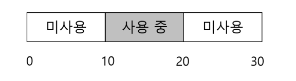

- 이 힙의 빈 공간 리스트에는 2개의 원소가 있다
- 하나는 첫 번째 바이트의 빈 세그먼트(바이트 0-9)를 설명하고 다른 하나는 나머지 빈 세그먼트(바이트 20-29)를 표현한다

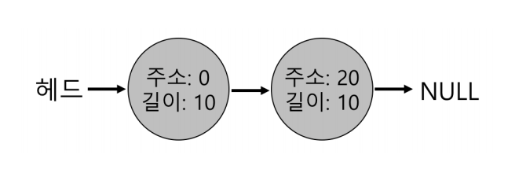

- 현재 빈 공간 리스트에는:
  - 0 ~ 9
  - 20 ~ 29
- 두 개의 빈 청크가 존재한다.

- 따라서 현재는 최대 10바이트까지만 연속적으로 할당할 수 있다.
- 만약 11바이트 이상을 요청하면 연속된 공간이 없으므로 실패하고 `NULL`을 반환한다.

- 그런데 사용자가 1바이트만 요청하면 어떻게 될까?
- 이 경우 할당기는 `분할(Splitting)`을 수행한다.
- 분할은:
  - 요청을 만족할 수 있는 빈 공간을 찾은 뒤
  - 필요한 만큼만 할당하고
  - 남은 부분은 다시 빈 공간으로 유지 하는 방식이다.

- 예를 들어:
  - 20 ~ 29 공간에서
  - 1바이트를 할당하면

메모리는 아래처럼 바뀐다.

```text
20       : 사용 중
21 ~ 29  : 빈 공간
```

- 즉 기존 10바이트 빈 공간이:
  - 1바이트 사용 공간
  - 9바이트 빈 공간으로 나뉜 것이다.

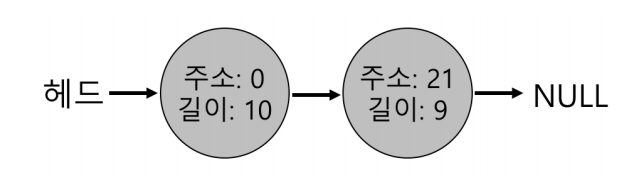

#### 2). 병합(Coalescing)
- 분할만 계속 수행하면 빈 공간들이 점점 작은 조각으로 나뉘게 된다.

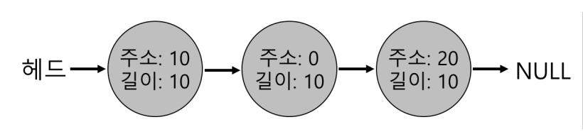

- 이 상태에서 사용자가 20바이트를 요청하면 문제가 발생한다.
- 전체 빈 공간은 30바이트지만 연속된 20바이트 공간이 없다고 판단하여 요청이 실패할 수 있다.
- 이를 해결하기 위해 사용하는 기법이 `병합(Coalescing)`이다.
- 병합은 메모리를 해제할 때 인접한 빈 공간들을 하나로 합치는 방식이다.

#### 2. 할당된 공간의 크기 파악
- free(void *ptr) 인터페이스는 크기를 매개변수로 받지 않는다는 것을 알고 있을 것이다
- 포인터가 인자로 전달되면 malloc 라이브러리는 해제되는 메모리 영역의 크기르 신속하게 파악하여 그 공간을 빈 공간 리스트에 추가시킬 수 있다고 가정한다
- 이 작업을 위해 대부분의 할당기는 추가 정보를 헤더 블럭에 저장한다
- 헤더블럭은 메모리에 유지되며 보통 해제된 청크 바로 직전에 위치한다

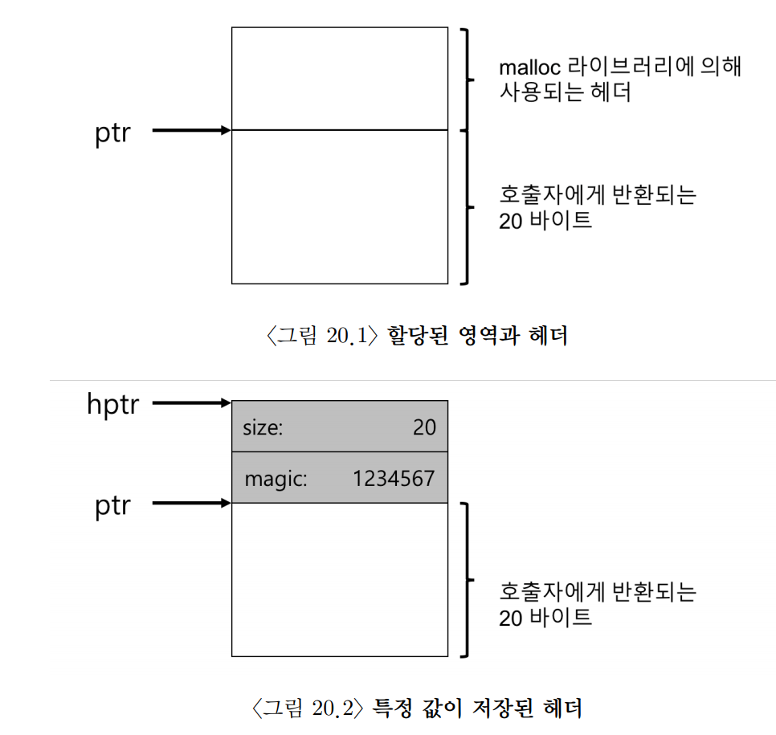

- 사용자는 malloc을 호출하고 그 결과를 ptr에 저장했다고 가정한다
  - 예를들어 ptr = malloc(20);
- 헤더는 적어도 할당된 공간의 크기는 저장해야 한다
  - 또한 해제 속도를 향상시키기 위한 추가의 포인터, 부가적인 무결성 검사를 제공하기 위한 매직 넘버 및 기타 정보를 저장할 수 있다
- 사용자가 free(ptr)을 호출하여 라이브러리는 헤더의 시작 위치를 파악하기 위해 간단한 포인터 연산을 한다
- 헤더를 가르키는 포인터를 얻어 내면 라이브러리는 매직 넘버가 기대하는 값과 일치하는지 비교하여 안정성 검사를 실시한다
- 그리고 새로 해제된 영역의 크기를 간단한 수학을 통해 계산한다
- 주의할점으로는 빈 영역의 크기는 헤더 크기 더하기 사용자에게 할당된 영역의 크기가 된다
  - 사용자가 N 바이트의 메모리 청크를 요청하면 라이브러리는 크기 N의 빈 청크를 찾는 것이 아니라 빈 청크의 크기 N 더하기 헤더의 크기인 청크를 탐색한다

#### 3. 빈 공간 리스트 내장
- 빈 공간 리스트를 구현할 때 일반적인 프로그램이라면 새로운 노드가 필요할 때 `malloc()`을 호출하면 된다.
- 하지만 메모리 할당 라이브러리 자체에서는 `malloc()`을 사용할 수 없다.
  - 왜냐하면 `malloc()` 자체를 구현하는 중이기 때문이다.
  - 따라서 빈 공간 리스트는 관리 중인 힙 내부에 직접 저장되어야 한다.
- 예를 들어 4096바이트 크기의 메모리 영역이 있다고 가정하자.
- 이 영역은 `mmap()` 같은 시스템 콜을 통해 운영체제가 제공한 공간이다.

- 처음에는 전체 공간이 비어 있으므로 빈 공간 리스트에는 하나의 큰 빈 청크만 존재한다.
- 단 헤더(Header) 공간이 필요하기 때문에 실제 사용 가능한 크기는 약 4088바이트가 된다.

예시:

```text
[ Header ][            4088 Bytes Free            ]
```

- `head` 포인터는 이 첫 번째 빈 청크를 가리킨다.
- 메모리 시작 주소가 16KB라고 가정해보자.

- 이제 사용자가 100바이트를 요청하면 할당기는 현재 빈 공간이 충분하므로 `분할(Splitting)`을 수행한다.

- 하지만 실제로는:
  - 사용자 데이터 100바이트
  - 헤더 정보 8바이트가 필요하다.

- 따라서 총 108바이트를 할당하게 된다.

예시:

```text
[ Header ][ 100 Bytes Data ][ Remaining Free Space ]
```

- 헤더에는:
  - 할당 크기
  - 상태 정보 등이 저장된다.
- 이 정보는 이후 `free()` 호출 시 사용된다.

- 108바이트를 사용하고 나면 남은 빈 공간 크기는 ```4088 - 108 = 3980 Bytes```가 된다

- 이후 사용자가 메모리를 반납하면(`free`) 할당기는 빈 공간 리스트를 순회하면서 인접한 빈 청크들을 병합(Coalescing)한다.
- 이를 통해 큰 연속 공간을 다시 만들 수 있다.

#### 4. 힙의 확장

- 힙 공간이 부족할 때 가장 단순한 방법은 메모리 할당 실패를 반환하는 것이다.
- 하지만 대부분의 실제 메모리 할당기는 운영체제에게 더 많은 메모리를 요청한다.

- 이를 위해 할당기는 `sbrk()`, `mmap()`같은 시스템 콜을 사용한다.

- 운영체제는 요청을 받으면:
  - 사용 가능한 물리 페이지를 찾고
  - 해당 페이지를 프로세스 주소 공간에 매핑한 뒤
  - 새로운 힙 영역을 제공한다.

- 예를 들어 기존 힙 공간이 부족해지면 `기존 Heap + 새로운 메모리 영역`형태로 힙이 확장된다.
- 이후 할당기는 새로 확보한 공간을 빈 공간 리스트에 추가하고 메모리 요청을 계속 처리한다.
- 즉 힙은 프로그램 실행 중에도 필요에 따라 계속 커질 수 있다.

### 3. 기본 전략
- 이상적인 할당기는 속도가 빠르고 단편화를 최소로 해야 한다

#### 1. 최적 적합(Best Fit)
- 빈 공간 리스트에서 가능한 후보자 그룹에서 가장 작은 크기의 청크를 사용한다
- 최적 적합은 공간의 낭비를 줄이려고 노력하지만, 정교하지 않는 구현은 빈 블럭을 찾기 위해 전체를 검색해야 하기 때문에 엄청난 성능 저하를 초래한다

#### 2. 최악 적합(Worst Fit)
- 최적 적합과 반대로 가장 큰 청크를 찾아 요청한 크기만큼만 사용하고 나머지는 반환한다
- 단편화도 발생하고 오버헤드도 크다는 단점이 있다

#### 3. 최초 적합(First Fit)
- 요청보다 큰 첫 번째 블럭을 찾아서 요청만큼 반환한다
- 속도가 빠르다는 것이 장점이지만, 앞에서부터 찾기 때문에 시작부분에 크기가 작은 객체가 많이 생길 수 있다
  - 따라서 할당기가 빈 공간 리스트 순서를 관리하는 방법이 쟁점이다
  - 한 가지는 방법은 주소-기반 정렬로 리스트를 주소로 정렬하여 병합을 쉽게 하고, 단편화를 감소시킨다

#### 4. 다음 적합
- 할당기는 마지막으로 탐색했던 위치를 기억하는 추가 포인터를 유지한다.
- 새로운 메모리 요청이 들어오면 이전 탐색이 끝난 위치부터 다시 탐색을 시작한다.
  - 따라서 탐색이 리스트 전체에 비교적 고르게 분산된다.
  - 그 결과 메모리 앞부분만 계속 잘게 쪼개지는 현상을 줄일 수 있다.


```text
예시
현재 빈 공간 리스트가 아래와 같다고 가정하자.

[10KB] [20KB] [15KB] [30KB]

- 이전 탐색이 `20KB` 위치에서 끝났다고 가정한다.
- 이제 12KB 요청이 들어오면 다음 적합은

20KB → 15KB → ...
```

### 4. 다른 접근법
#### 1. 개별 리스트
- 개별 리스트 방식은 자주 요청되는 크기의 메모리를 별도로 관리하는 방식이다.
- 예를 들어 어떤 프로그램이:
  - 64바이트 객체
  - 128바이트 객체를 자주 요청한다면 크기별 전용 리스트를 따로 만들어 관리한다.

- 이렇게 하면:
  - 탐색 속도가 빨라지고
  - 불필요한 분할이 줄어들어
  - 단편화 문제도 완화 할 수 있다.

예를 들어 아래와 같이 관리할 수 있다

```text
64B 전용 리스트
128B 전용 리스트
256B 전용 리스트
```

- 사용자가 64바이트를 요청하면 일반 빈 공간 리스트를 탐색하지 않고 64B 리스트에서 바로 가져오면 된다.
  - 하지만 문제가 있다.
  - 어떤 크기의 메모리를 얼마나 미리 준비해 둘지 결정하기 어렵다.
- 이를 더 발전시킨 방식이 `슬랩 할당기(Slab Allocator)`이다.

#### 2.슬랩 할당기(Slab Allocator)
- 슬랩 할당기는 운영체제 커널에서 자주 사용되는 방식이다.
- 커널이 부팅될 때 자주 사용하는 객체들을 위한 전용 캐시(Cache)를 미리 만들어 둔다.

- 대표적인 커널 객체는:
  - 락(Lock)
  - 아이노드(Inode)
  - 프로세스 구조체 등이 있다.

- 예를 들어:
  - 아이노드 전용 캐시
  - 락 전용 캐시를 따로 유지한다.

- 요청이 들어오면 새로 메모리를 초기화하지 않고 미리 준비된 객체를 바로 반환한다.
  - 따라서 메모리 할당 속도가 매우 빠르다.
- 만약 캐시가 부족해지면 상위 메모리 할당기에게 새로운 슬랩(Slab)을 요청한다.
- 슬랩 할당 방식은 객체를 미리 초기화된 상태로 유지하기 때문에 성능상 유리하다.
- Bonwick은 자료 구조를 매번 초기화하고 제거하는 작업이 상당한 비용이 든다는 점을 발견했고, 이를 줄이기 위해 슬랩 할당기를 제안했다.

#### 3. 버디 할당(Buddy Allocation)
- `버디 할당(Buddy Allocation)`은 빈 공간 병합을 쉽게 만들기 위한 메모리 관리 방식이다.
- 메모리를 항상 2의 거듭제곱 크기로 나누어 관리한다.

```text
계속 절반으로 분할한다.

1024KB
→ 512KB + 512KB
→ 256KB + 256KB
```

- 만약 100KB 요청이 들어오면 128KB 블록을 할당한다.
- 이후 인접한 동일 크기 블록이 둘 다 비게 되면 다시 하나로 합칠 수 있다.

- 이렇게 짝이 되는 블록을 `Buddy`라고 부른다.
- 버디 할당은 병합이 매우 단순하다는 장점이 있다.

## 3. 기타 아이디어

- 기존 방식들의 가장 큰 문제 중 하나는 확장성(Scalability)이다.
- 빈 공간 개수가 많아질수록 탐색 비용이 증가하여 성능이 느려질 수 있다.

- 특히 현대 시스템은:
  - 멀티코어
  - 멀티프로세스
  - 멀티스레드 환경에서 동작한다.

- 따라서 여러 CPU가 동시에 메모리 할당기를 사용하더라도 효율적으로 동작해야 한다.

- 이를 해결하기 위해:
  - CPU별 메모리 캐시
  - 락 경쟁 감소
  - 병렬 할당 구조 같은 다양한 기법들이 연구되었다.

- Berger와 Evans 같은 연구자들은 이러한 고성능 메모리 할당기를 연구했다.
- 실제 리눅스 시스템에서는 `glibc malloc` 같은 복잡한 메모리 할당기가 사용된다.
- 내부적으로:
  - 여러 개의 free list
  - thread cache
  - mmap 기반 확장등의 다양한 최적화 기법을 사용한다.