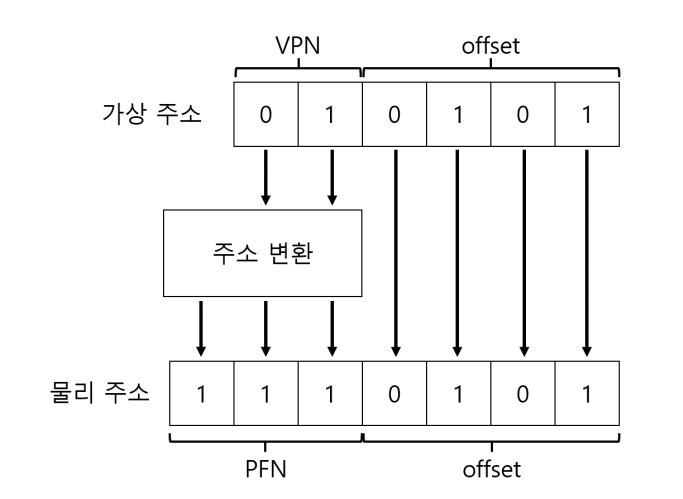
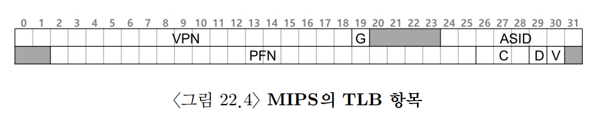
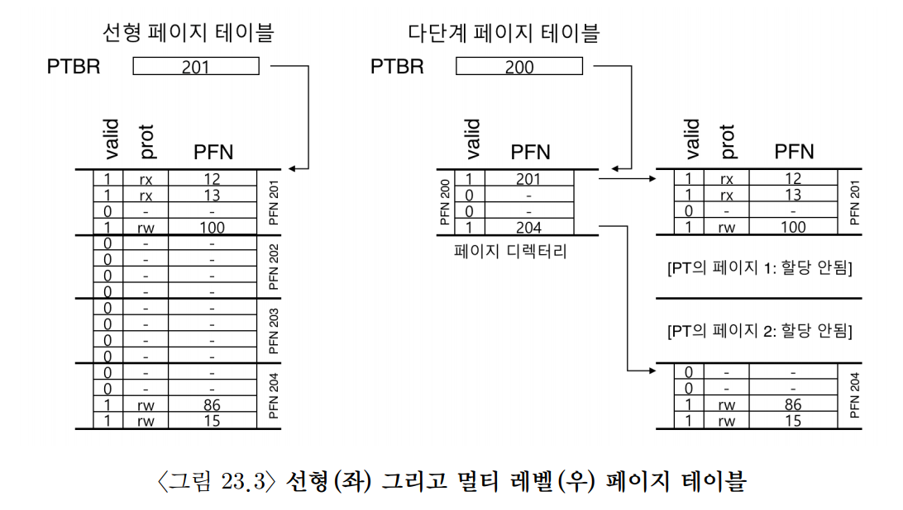

## 21. 페이징: 개요
# 21. 페이징(Paging): 개요

- 운영체제는 메모리 공간을 관리할 때 보통 두 가지 방식 중 하나를 사용한다.
- 첫 번째는 세그멘테이션처럼 가변 크기의 조각들로 분할하는 방식이다.
- 예를 들어:
    - 코드
    - 힙
    - 스택처럼 의미 단위별로 메모리를 나누어 관리한다.
- 하지만 세그멘테이션은 세그먼트 크기가 서로 다르기 때문에 메모리가 점점 조각나는 문제가 발생한다.
- 즉 외부 단편화(External Fragmentation)가 생기고 메모리 할당이 점점 어려워진다.
- 이를 해결하기 위한 또 다른 방식이 `페이징(Paging)`이다.
  - 페이징은 메모리를 항상 동일한 크기의 조각으로 나누는 방식이다.
  - 가상 주소 공간을 고정 크기로 나눈 단위를 `페이지(Page)`라고 한다.
  - 물리 메모리도 같은 크기의 고정 슬롯들로 나누는데 이를 `페이지 프레임(Page Frame)`이라고 한다.

예시:

```text
가상 메모리
[Page][Page][Page][Page]

물리 메모리
[Frame][Frame][Frame][Frame]
```

- 각 페이지 프레임에는 하나의 가상 페이지를 저장할 수 있다.
- 즉 운영체제는 어떤 가상 페이지를 어떤 물리 프레임에 배치할지 관리하게 된다.
- 페이징은 모든 공간의 크기가 동일하기 때문에 세그멘테이션처럼 외부 단편화 문제가 거의 발생하지 않는다는 장점이 있다.

### 1. 간단한 예제 및 개요

- 아래 예제에서는:
  - 가상 주소 공간 크기 = 64바이트
  - 페이지 크기 = 16바이트라고 가정한다.
- 페이지 크기가 16바이트이므로 가상 주소 공간은 총 4개의 페이지로 나뉜다.

예시:

```text
가상 주소 공간

[Page 0][Page 1][Page 2][Page 3]
 16B      16B      16B      16B
```

- 물리 메모리도 같은 크기의 슬롯들로 나뉜다.
- 이 슬롯을 `페이지 프레임(Page Frame)`이라고 한다.

예시:

```text
물리 메모리

[Frame 0][Frame 1][Frame 2][Frame 3]
[Frame 4][Frame 5][Frame 6][Frame 7]
```

- 이 예제에서는:
  - 총 8개의 프레임
  - 각 프레임은 16바이트이므로 물리 메모리 크기는 총 128바이트이다.

#### 1.페이지 배치 방식
- 페이징에서는 가상 페이지들이 물리 메모리 전체에 흩어져 저장될 수 있다.
- 즉 연속된 공간에 저장될 필요가 없다.

예시:

```text
가상 페이지 0 → 물리 프레임 3
가상 페이지 1 → 물리 프레임 7
가상 페이지 2 → 물리 프레임 5
가상 페이지 3 → 물리 프레임 2

- 따라서 실제 물리 메모리는 아래처럼 저장될 수 있다.

Frame 0 : 비어있음
Frame 1 : 비어있음
Frame 2 : Page 3
Frame 3 : Page 0
Frame 4 : 비어있음
Frame 5 : Page 2
Frame 6 : 비어있음
Frame 7 : Page 1
```

- 즉 가상 메모리는 연속적으로 보이지만 실제 물리 메모리에서는 여기저기 흩어져 존재할 수 있다.
- 이것이 페이징의 핵심 특징이다.

#### 2. 페이징의 장점
- 페이징의 가장 큰 장점은 유연성이다.
- 세그멘테이션처럼 연속된 큰 공간을 찾을 필요가 없다.
- 운영체제는 단순히 비어 있는 프레임 몇 개만 찾으면 된다.

- 예를 들어 64B 주소 공간 
  - 16B 페이지 4개라면 빈 프레임 4개 만 확보하면 된다
  - 따라서 외부 단편화 문제가 거의 발생하지 않는다.
  - 또한 빈 공간 관리도 훨씬 단순해진다.

#### 3. 페이지 테이블(Page Table)
- 운영체제는 각 가상 페이지가 어느 물리 프레임에 저장되어 있는지 기억해야 한다.
- 이를 위해 사용하는 자료구조가 `페이지 테이블(Page Table)`이다.
- 페이지 테이블은 `가상 페이지 번호(VPN)`, `물리 프레임 번호(PFN)`를 저장한다.

예시:

```text
VPN 0 → PFN 3
VPN 1 → PFN 7
VPN 2 → PFN 5
VPN 3 → PFN 2
```

- 즉:
  - 가상 페이지 0은 물리 프레임 3에 있고
  - 가상 페이지 1은 물리 프레임 7에 있다는 뜻이다.
- 중요한 점은 페이지 테이블이 프로세스마다 존재한다는 것이다.
- 프로세스마다:
  - 가상 주소 공간이 다르고
  - 페이지 배치 위치도 다르기 때문이다.
- 따라서 Context Switching이 발생하면 운영체제는 현재 프로세스의 페이지 테이블도 함께 변경해야 한다.

#### 4. 가상 주소의 구성
- CPU가 메모리에 접근할 때 사용하는 주소를 `가상 주소(Virtual Address)`라고 한다.
- 페이징에서는 가상 주소를 두 부분으로 나눈다.

```text
[ 가상 페이지 번호(VPN) | 오프셋(Offset) ]
```

- VPN(Virtual Page Number):
  - 어떤 페이지인지 나타낸다.
- Offset:
  - 페이지 내부에서 몇 번째 바이트인지를 나타낸다.

#### 5. 왜 6비트 주소가 필요한가?
- 가상 주소 공간 크기가 64B이므로 64개의 주소를 표현해야 한다.
- 64개를 표현하려면 :contentReference[oaicite:0]{index=0} 이므로 가상 주소는 6비트가 필요하다. (2의 6승)

#### 6. VPN과 Offset 분리
- 페이지 크기가 16B이므로 페이지 내부 위치 표현에는 :contentReference[oaicite:1]{index=1} 처럼 4비트가 필요하다.
- 따라서:
  - 하위 4비트 → Offset
  - 상위 2비트 → VPN으로 사용된다.

예시:

```text
101011
→ 10 | 1011
```

- `10`은 VPN = 2
- `1011`은 Offset = 11
- 즉 `Page 2의 11번째 위치`를 의미한다.



### 2. 페이지 테이블은 어디에 저장되는가?
- 페이지 테이블은 매우 커질 수 있다.
  - 예를 들어 VPN이 20비트라면 `2^20 = 약 100만 개`의 페이지 정보를 관리해야 한다는 뜻이다.
- 만약 페이지 테이블 항목(PTE) 하나가 4B라면 `2^20 × 4B = 4MB`
  - 즉 프로세스 하나의 페이지 테이블만 저장하는 데도 4MB가 필요하다.
  - 프로세스가 100개 실행 중이라면 `4MB × 100 = 400MB`의 메모리가 페이지 테이블 저장에 사용될 수 있다.
- 따라서 페이지 테이블 전체를 MMU 내부 회로에 저장하기는 어렵다.
- 그래서 운영체제는 각 프로세스의 페이지 테이블을 메모리에 저장한다.

### 3. 페이지 테이블에는 실제 무엇이 있는가?
- 페이지 테이블은:
  - 가상 페이지 번호(VPN)
  - 물리 프레임 번호(PFN)의 매핑 정보를 저장하는 자료구조이다.

예시:

```text
VPN 0 → PFN 3
VPN 1 → PFN 7
VPN 2 → PFN 5
```

- 가장 단순한 형태는 `선형 페이지 테이블(Linear Page Table)`이다.
- 운영체제는 VPN을 이용해 배열처럼 페이지 테이블에 접근한 뒤 PFN 정보를 얻는다.

#### 1.페이지 테이블 항목(PTE)
- 각 페이지 테이블 항목(PTE)에는 PFN 외에도 여러 상태 정보가 저장된다.
#### 1).Valid Bit
- 해당 페이지가 실제로 사용 가능한 페이지인지 나타낸다.
- 사용되지 않는 주소 공간이면 Invalid로 표시된다.

예시:

```text
코드 영역 ----- 빈 공간 ----- 스택 영역
```

- 중간 빈 공간은 실제로 사용되지 않으므로 무효(Invalid) 처리된다.
- 프로그램이 이런 영역에 접근하면 운영체제가 예외(Trap)를 발생시킨다.

#### 2).Protection Bit
- 페이지 접근 권한을 나타낸다.
  - 페이지가 읽고 쓰고 실행할 수 있는지 표시한다
- 허용되지 않은 접근을 시도하면 운영체제가 Trap을 발생시킨다.

#### 3). Present Bit
- 해당 페이지가 현재 물리 메모리에 존재하는지 나타낸다.
- 메모리에 없다면 디스크(Swap 영역)에 존재할 수 있다.
- 운영체제는 필요 시 페이지를 디스크와 메모리 사이에서 이동시킨다.

#### 4).Dirty Bit
- 페이지가 메모리에 올라온 이후 수정되었는지를 나타낸다.
- 수정된 페이지는 디스크로 내보낼 때 다시 저장해야 한다.

#### 5). Reference Bit
- 페이지가 최근 접근되었는지를 나타낸다.
- 운영체제는 이를 이용해:
  - 자주 사용하는 페이지
  - 거의 사용하지 않는 페이지를 구분한다.
- 즉 어떤 페이지를 계속 메모리에 유지할지 결정할 때 사용된다.
- 
### 4. 페이징: 너무 느림
- 페이징은 유연하고 외부 단편화 문제도 거의 없지만 성능 문제가 존재한다.
- 가장 큰 이유는 주소 변환 과정 때문이다.
- CPU가 메모리에 접근하려면 먼저 페이지 테이블 접근이 필요하다.
  - 즉 실제 메모리 접근 전에 한 번 더 메모리를 읽어야 한다.

동작 과정:

```text
1. 페이지 테이블 접근
2. PFN 얻기
3. 실제 물리 메모리 접근
```

- 즉 메모리 접근이 원래보다 더 많이 발생한다.
- 따라서 페이지 테이블 접근 비용 때문에 페이징은 느려질 수 있다.
- 하드웨어와 소프트웨어의 신중한 설계 없이는 페이지 테이블로 인해 시스템이 매우 느려질 수 있으며 너무 많은 메모리를 차지한다

>#### 여담: 자료구조-페이지 테이블
> - 페이지 테이블은 현대 운영체제에서 메모리 관리 서브시스템에서 가장 중요한 자료 구조 중 하나이다
> - 일반적으로 가상-물리 주소 변환을 저장하여 주소 공간의 각 페이지의 물리 메모리 위치를 알 수 있다
> - 각 주소 공간은 이런 변환을 필요로 하기 때문에 프로세스마다 하나씩 존재한다

## 22. 페이징: 더 빠른 변환(TLB)
- 주소 변환을 빠르게 하기 위해 변환-색인 버퍼 또는 TLB를 도입했다
  - TLB는 칩의 메모리 관리부(MMU)의 일부다
  - 자주 참조하는 가상 주소-실주소 변환 정보를 저장하는 하드웨어 캐시이다
- 하드웨어는 TLB에 변환 정보가 있는지 확인하고 만약 있다면 페이지 테이블을 통하지 않고 변환을 수행한다
  - TLB를 도입함으로써 페이징이 사용 가능한 가상 메모리 기법이 된다

### 1. TLB의 기본 알고리즘

- TLB는 자주 사용하는 주소 변환 결과를 저장하는 작은 캐시이다.
- CPU가 가상 주소를 접근하면 먼저 TLB를 확인한다.

동작 과정:

```text
1. VPN 추출
2. TLB 검색
3. 히트 시 PFN 획득
4. 물리 주소 생성
5. 메모리 접근
```

- 만약 TLB에 해당 VPN 정보가 존재하면 `TLB Hit`이다.
- 이 경우 페이지 테이블까지 갈 필요 없이 바로 PFN을 얻을 수 있다.

예시:

```text
VPN 2 → PFN 5

이후:

PFN + Offset
```

을 합쳐 실제 물리 주소를 만든다.

- 또한 접근 권한 검사도 함께 수행한다.
- 읽기/쓰기/실행 권한이 없는 경우 운영체제가 Trap을 발생시킨다.

#### 1. TLB Miss

- 만약 TLB에 원하는 변환 정보가 없으면 `TLB Miss`가 발생한다.
- 이 경우 운영체제 또는 하드웨어가 페이지 테이블을 확인해야 한다.

동작 과정:

```text
1. 페이지 테이블 접근
2. VPN → PFN 변환 검색
3. TLB에 결과 저장
4. 다시 메모리 접근
```

- 즉 TLB 미스가 발생하면 메모리 접근 횟수가 증가한다.
- 따라서 성능이 느려질 수 있다.

- TLB는:
  - CPU 가까이에 존재하고
  - 매우 빠른 하드웨어로 구성되기 때문에
- 히트가 발생하면 주소 변환 비용이 거의 없다.

### 2. 예제: 배열 접근
- 가상 주소 공간은 8비트이다.
- 페이지 크기는 16B이다.
- 따라서:
  - 상위 4비트 → VPN
  - 하위 4비트 → Offset으로 사용된다.
- 배열은 가상 주소 100번지부터 시작한다고 가정한다.
- 배열 원소는 int형이며 각 원소 크기는 4B이다.

코드:

```c
int sum = 0;

for (i = 0; i < 10; i++) {
    sum += a[i];
}
```

#### 1. 첫 번째 접근: a[0]
- a[0]의 시작 주소는 100번지이다.
  - 배열의 첫 항목은(VPN=06, 오프셋=04)에서 시작한다
- CPU는 먼저 TLB에서 VPN 06을 찾는다.
- 하지만 처음 접근이므로 TLB는 비어 있어 `TLB Miss`가 발생한다
  - 따라서 페이지 테이블에 접근하여 `VPN 06 → PFN 확인`을 수행한다
  - 이후 해당 변환 결과를 TLB에 저장한다.

#### 2. 두 번째 접근: a[1]
- a[1]은 바로 다음 원소이다.
- int는 4B이므로 같은 페이지 내부에 존재한다.
  - `a[0], a[1], a[2] ...`가 같은 페이지를 사용한다.
  - 따라서 다시 VPN 06을 접근하게 되고 이번에는 `TLB Hit`가 발생한다
- 즉 페이지 테이블 접근 없이 바로 PFN을 얻을 수 있다.
- 이것이 TLB가 성능을 향상시키는 이유이다.

### 3. TLB 미스는 누가 처리할까?
TLB 미스는 크게 두 방식으로 처리할 수 있다.

1. 하드웨어가 직접 처리하는 방식
2. 운영체제가 처리하는 방식

#### 1. 하드웨어가 처리하는 방식
- 과거의 CISC 구조에서는 하드웨어가 TLB 미스를 직접 처리하는 경우가 많았다.
- 이 방식에서는 하드웨어가 페이지 테이블 구조를 알고 있어야 한다.

TLB 미스가 발생하면 하드웨어는 다음 순서로 동작한다.

```text
1. 페이지 테이블에서 필요한 페이지 테이블 엔트리(PTE)를 찾는다.
2. 변환 정보를 추출한다.
3. TLB를 갱신한다.
4. TLB 미스가 발생했던 명령어를 다시 실행한다.
```

인텔 x86 CPU가 하드웨어 관리 TLB의 대표적인 예이다.
x86은 멀티 레벨 페이지 테이블을 사용한다.

#### 2. 운영체제가 처리하는 방식
- RISC 구조에서는 TLB를 소프트웨어, 즉 운영체제가 관리하는 방식이 많이 사용되었다.
- TLB에서 주소 변환을 찾지 못하면 하드웨어는 예외를 발생시킨다.
  - 그러면 운영체제는 현재 명령어 실행을 잠시 멈추고 커널 모드로 전환한다.
  - 커널 모드에서는 커널 주소 공간에 접근할 수 있는 권한을 얻고, TLB 미스 처리를 위한 트랩 핸들러를 실행한다.

소프트웨어 관리 TLB의 처리 흐름은 다음과 같다.

```text
1. TLB 미스가 발생한다.
2. 하드웨어가 예외를 발생시킨다.
3. 운영체제가 커널 모드로 전환한다.
4. TLB 미스 트랩 핸들러가 실행된다.
5. 트랩 핸들러가 페이지 테이블에서 변환 정보를 찾는다.
6. 특권 명령어로 TLB를 갱신한다.
7. 트랩 핸들러가 리턴한다.
8. 하드웨어가 원래 명령어를 다시 실행한다.
```

이때는 이미 TLB가 갱신되어 있으므로, 재실행된 명령어는 TLB 히트가 발생한다.

#### 3. 시스템 콜 트랩과의 차이
- TLB 미스 트랩은 시스템 콜 트랩과 리턴 위치가 다르다.
  - 시스템 콜은 트랩 핸들러가 끝나면 시스템 콜을 호출한 명령어의 다음 명령어부터 실행한다.
  - 반면 TLB 미스는 트랩을 발생시킨 바로 그 명령어를 다시 실행해야 한다.
- 이 차이가 필요한 이유는 간단하다.
- TLB 미스가 난 명령어는 아직 정상적으로 실행되지 못했기 때문이다.

#### 4. TLB 미스 핸들러에서 주의할 점
- TLB 미스 핸들러를 실행하는 도중 다시 TLB 미스가 발생하면 문제가 생길 수 있다.
  - 최악의 경우 TLB 미스가 무한히 반복될 수 있다.
- 이를 피하는 방법은 여러 가지가 있다.
  - TLB 미스 핸들러를 물리 메모리에 두어 주소 변환이 필요 없게 한다.
  - TLB 일부를 핸들러 코드 주소 저장용으로 고정해 둔다.
- 두 번째 방식처럼 특정 변환 정보를 TLB에 계속 유지하는 것을 연결 변환이라고 한다.

#### 5. 소프트웨어 관리 TLB의 장점
- 소프트웨어 관리 TLB의 가장 큰 장점은 유연성이다.
  - 운영체제는 하드웨어를 바꾸지 않고도 페이지 테이블 구조를 자유롭게 설계하거나 변경할 수 있다.
- 또 다른 장점은 하드웨어가 단순해진다는 점이다.
  - TLB 미스가 발생했을 때 하드웨어는 예외만 발생시키면 되고, 실제 처리는 운영체제가 담당한다.

### 4. TLB의 구성: 무엇이 있나
- TLB는 주소 변환 정보를 저장하는 작은 캐시이다. 
- 일반적으로 32개, 64개, 128개 정도의 엔트리를 가지며, 완전 연관 방식으로 설계되는 경우가 많다.
  - 완전 연관 방식에서는 변환 정보가 TLB 안의 어느 위치에나 저장될 수 있다.
  - 따라서 하드웨어는 원하는 변환 정보를 찾기 위해 TLB의 모든 엔트리를 동시에 검색한다.

TLB 엔트리는 보통 다음과 같은 형태를 가진다.

```text
VPN | PFN | 다른 비트들
```

- `VPN`: 가상 페이지 번호이다.
- `PFN`: 물리 프레임 번호이다.
- `다른 비트들`: 접근 권한이나 상태 정보를 저장한다.

#### 1. TLB가 완전 연관 캐시인 이유
- TLB는 변환 정보의 저장 위치에 제약을 두지 않는다.
  - 즉 어떤 VPN의 변환 정보도 TLB의 어느 엔트리에나 들어갈 수 있다.
- 이 방식의 장점은 검색이 빠르다는 점이다.
- 하드웨어가 모든 엔트리를 병렬로 비교하기 때문에, 원하는 VPN이 TLB 안에 있다면 빠르게 찾을 수 있다.

#### 2. TLB 엔트리의 다른 비트들
- TLB 엔트리에는 VPN과 PFN 외에도 여러 상태 비트가 들어갈 수 있다.
  - `Valid Bit`: 해당 TLB 엔트리가 유효한지 표시한다.
  - `Protection Bit`: 읽기, 쓰기, 실행 같은 접근 권한을 표시한다.
  - `ASID`: 어떤 주소 공간의 변환 정보인지 구분한다.
  - `Dirty Bit`: 해당 페이지가 수정되었는지 표시한다.

### 5. TLB의 문제: 문맥 교환
- TLB를 사용하면 문맥 교환(Context Switching) 때 새로운 문제가 생긴다.
  - TLB에 저장된 주소 변환 정보는 특정 프로세스에서만 유효하다.
  - 프로세스마다 자신의 가상 주소 공간을 가지고 있기 때문에, 같은 가상 주소라도 프로세스에 따라 다른 물리 주소를 가리킬 수 있다.
- 예를 들어 프로세스 A의 `VPN 10`과 프로세스 B의 `VPN 10`은 서로 다른 물리 프레임을 가리킬 수 있다.
  - 따라서 문맥 교환 후에도 이전 프로세스의 TLB 엔트리를 그대로 사용하면 잘못된 주소 변환이 발생할 수 있다.

#### 1. 해결 방법: TLB 비우기
- 가장 단순한 해결 방법은 문맥 교환이 일어날 때 기존 TLB 내용을 모두 비우는 것이다.
- TLB를 비우는 방법은 시스템에 따라 다르다.
  - 소프트웨어 관리 TLB에서는 특별한 하드웨어 명령어로 TLB를 비울 수 있다.
  - 하드웨어 관리 TLB에서는 페이지 테이블 베이스 레지스터가 변경될 때 TLB를 비울 수 있다.
- 어느 방식이든 핵심은 기존 TLB 엔트리의 `Valid Bit`를 0으로 설정하는 것이다.
  - 그러면 이전 프로세스의 변환 정보는 더 이상 사용되지 않는다.
- 하지만 이 방식에는 단점이 있다.
  - 새로운 프로세스가 실행될 때 TLB가 비어 있으므로 초반에는 TLB 미스가 많이 발생한다.
  - 문맥 교환이 자주 일어나면 이 비용이 성능에 큰 부담이 될 수 있다.

#### 2. 해결 방법: ASID 사용
- TLB를 매번 비우는 비용을 줄이기 위해 `ASID(Address Space Identifier)`를 사용할 수 있다.
- ASID는 각 TLB 엔트리가 어떤 주소 공간에 속하는지 표시하는 값이다.
- 프로세스 식별자(PID)와 비슷한 역할을 하지만, TLB에서 주소 공간을 구분하기 위해 사용된다.
- ASID를 사용하면 여러 프로세스의 변환 정보를 TLB 안에 함께 보관할 수 있다.
- 하드웨어는 VPN뿐 아니라 ASID도 함께 비교하여 현재 프로세스에 맞는 변환 정보만 사용한다.

```text
ASID | VPN | PFN | 다른 비트들
```

- 이 방식의 장점은 문맥 교환이 발생해도 TLB를 항상 전부 비울 필요가 없다는 점이다.
- 따라서 문맥 교환 이후에도 일부 TLB 엔트리를 계속 활용할 수 있다.

#### 3. 공유 페이지와 ASID
- 여러 프로세스가 같은 코드를 공유하는 경우도 있다.
  - 예를 들어 같은 프로그램을 실행하는 여러 프로세스는 코드 페이지를 공유할 수 있다.
- 공유 페이지를 사용하면 같은 물리 페이지를 여러 주소 공간에서 함께 사용할 수 있다.
- 이렇게 하면 필요한 물리 페이지 수를 줄일 수 있고, 메모리 사용량도 줄어든다.

### 6. 이슈: 교체 정책
TLB도 캐시이기 때문에 교체 정책이 중요하다.
TLB가 가득 찬 상태에서 새로운 변환 정보를 넣어야 한다면, 기존 엔트리 중 하나를 골라 제거해야 한다.

핵심 질문은 다음과 같다.

```text
어떤 TLB 엔트리를 교체할 것인가?
```

#### 1. LRU 정책
- 흔한 방법은 `LRU(Least Recently Used)` 정책이다.
  - LRU는 가장 오랫동안 사용되지 않은 항목을 교체한다.
- 이 정책은 다음 가정에 기반한다.
  - 최근에 사용된 항목은 곧 다시 사용될 가능성이 높다.
  - 오래 사용되지 않은 항목은 앞으로도 사용되지 않을 가능성이 높다.
- 하지만 LRU가 항상 좋은 결과를 내는 것은 아니다.
  - 예를 들어 TLB가 `n`개의 변환 정보만 저장할 수 있는데, 프로그램이 `n + 1`개의 페이지를 반복해서 접근한다고 하자.
  - 이 경우 LRU는 매번 곧 다시 필요해질 항목을 제거할 수 있다.
  - 결과적으로 거의 모든 접근에서 TLB 미스가 발생하는 최악의 상황이 생길 수 있다.

#### 2. 랜덤 정책
- 또 다른 방법은 랜덤 정책이다.
- 랜덤 정책은 교체할 엔트리를 무작위로 선택한다.
  - 이 방식은 잘못된 항목을 제거할 수도 있지만, 장점도 있다.
  - 구현이 단순하다.
  - 특정 접근 패턴에서 계속 최악의 선택을 하는 상황을 피할 수 있다.
  - LRU처럼 합리적으로 보이는 정책이 특정 반복 패턴에서 무너지는 문제를 줄일 수 있다.

### 7. 실제 TLB
- 실제 TLB의 예로 `MIPS R4000`을 볼 수 있다.
- MIPS R4000은 다음과 같은 특징을 가진다.
  - 32비트 주소 공간을 사용한다.
  - 4KB 페이지를 지원한다.
  - TLB는 일반적으로 32개 또는 64개의 엔트리로 구성된다.
  - TLB를 소프트웨어가 관리한다.
#### 1. 주소 비트 구성
- 4KB 페이지를 사용하면 페이지 내부 위치를 나타내는 오프셋은 12비트가 필요하다.
- 일반적인 32비트 주소라면 다음처럼 나눌 것이라고 예상할 수 있다.
```text
VPN 20비트 | Offset 12비트
```
- 하지만 MIPS R4000에서는 VPN에 19비트가 할당된다.
  - 전체 주소 공간 중 절반만 사용자 주소 공간으로 사용하기 때문이다.
- 물리 프레임 번호(PFN)에는 24비트가 할당된다.

#### 2. 중요한 상태 비트
- MIPS R4000의 TLB 엔트리에는 주소 변환 정보 외에도 중요한 상태 비트들이 있다.
  - `Global Bit`: 여러 프로세스가 공유하는 페이지를 표시한다.
  - `ASID`: 어떤 주소 공간의 변환 정보인지 구분한다.
  - `Coherence Bit`: 페이지가 하드웨어 캐시에 어떻게 저장되는지 나타낸다.
  - `Global Bit`가 설정되어 있으면 ASID는 무시된다.
    - 즉 해당 TLB 엔트리는 특정 프로세스에만 묶이지 않고 여러 프로세스에서 사용할 수 있다.
    - `Coherence Bit`는 3비트 길이이며, 페이지의 캐시 일관성 방식을 구분하는 데 사용된다.

#### 3. 소프트웨어 관리 TLB
- MIPS의 TLB는 소프트웨어가 관리한다.
- 따라서 운영체제가 TLB를 갱신할 수 있도록 별도의 명령어가 필요하다.



### 8. 요약
- TLB는 주소 변환을 빠르게 하기 위한 하드웨어 캐시이다.
- TLB를 사용하면 대부분의 메모리 접근에서 메인 메모리에 있는 페이지 테이블을 직접 읽지 않아도 된다.
- 즉 TLB는 페이징의 성능 문제를 줄여 주는 핵심 장치이다.
- 현대 시스템에서 페이징을 현실적으로 사용할 수 있게 만드는 중요한 요소라고 볼 수 있다.

#### 1. TLB가 항상 좋은 성능을 보장하지는 않는다
- TLB가 모든 프로그램에서 항상 잘 동작하는 것은 아니다.
- 짧은 시간 동안 접근하는 페이지 수가 TLB에 들어갈 수 있는 엔트리 수보다 많으면 TLB 미스가 자주 발생한다.
- 이 경우 주소 변환 비용이 다시 커지고 프로그램이 느려질 수 있다.
- 이 문제를 줄이는 한 가지 방법은 더 큰 페이지 크기를 지원하는 것이다.
- 페이지 크기가 커지면 하나의 TLB 엔트리가 더 넓은 주소 범위를 담당할 수 있다.
- 큰 페이지는 데이터베이스 관리 시스템처럼 큰 메모리 영역을 다루는 프로그램에서 유용하게 사용될 수 있다.

#### 2. CPU 파이프라인과 캐시 접근 문제
- TLB 접근은 CPU 파이프라인에서 병목이 될 수 있다.
  - 특히 물리적으로 인덱스된 캐시를 사용하는 경우 문제가 된다.
  - 물리적으로 인덱스된 캐시는 물리 주소를 기준으로 캐시에 접근한다.
  - 따라서 캐시에 접근하기 전에 가상 주소를 물리 주소로 변환해야 한다.
  - 이 변환 과정이 캐시 접근보다 먼저 끝나야 하므로 성능에 부담이 될 수 있다.
- 이 문제를 줄이기 위해 가상적으로 인덱스된 캐시를 사용할 수 있다.
  - 가상적으로 인덱스된 캐시는 가상 주소를 기준으로 캐시에 접근하므로 일부 성능 문제를 줄일 수 있다.
  - 다만 이 방식은 새로운 하드웨어 설계 문제를 동반한다.

## 23. 페이징: 더 작은 테이블
- 페이징의 두 번째 문제점은 페이지 테이블의 크기이다.
- 페이지 테이블이 커지면 그만큼 메모리 공간을 많이 차지한다.
- 주소 변환을 빠르게 하는 것도 중요하지만, 페이지 테이블 자체가 너무 커지지 않도록 줄이는 것도 중요하다.

### 1. 간단한 해법: 더 큰 페이지
- 가장 단순한 방법은 페이지 크기를 키우는 것이다.
- 페이지가 커지면 같은 가상 주소 공간을 더 적은 수의 페이지로 나눌 수 있다.
  - 즉 필요한 페이지 테이블 항목(PTE)의 개수가 줄어든다.

#### 1. 예시: 32비트 주소 공간과 16KB 페이지
- 32비트 주소 공간에서 페이지 크기가 16KB라고 가정해 보자.
  - 16KB는 `2^14` 바이트이므로 오프셋은 14비트가 필요하다.
  - 따라서 나머지 18비트가 VPN으로 사용된다.

```text
32비트 가상 주소

[ VPN 18비트 | Offset 14비트 ]
```

- 페이지 테이블에는 `2^18`개의 항목이 필요하다.
- 각 PTE의 크기가 4바이트라면 페이지 테이블의 전체 크기는 다음과 같다.

```text
2^18 * 4B = 1MB
```

- 페이지 크기를 4KB에서 16KB로 키우면 페이지 크기는 4배가 된다.
- 그만큼 필요한 페이지 개수는 줄어들고, 페이지 테이블 크기도 1/4로 줄어든다.

#### 2. 더 큰 페이지의 단점
- 페이지 크기를 키우면 페이지 테이블은 작아지지만 부작용이 생긴다.
- 가장 큰 문제는 내부 단편화이다.
- 내부 단편화는 페이지 안에서 실제로 사용하지 않는 공간이 낭비되는 현상이다.
- 페이지가 커질수록 한 페이지 안에서 남는 공간도 커질 수 있다.
- 이런 이유로 많은 시스템은 너무 큰 페이지를 기본으로 사용하지 않는다.
- 일반적으로 4KB 또는 8KB 정도의 비교적 작은 페이지를 사용한다.

### 2. 하이브리드 접근 방법: 페이징과 세그먼트
- 또 다른 방법은 페이징과 세그멘테이션을 결합하는 것이다.
- 전체 주소 공간에 대해 하나의 큰 페이지 테이블을 두는 대신, 논리 세그먼트마다 별도의 페이지 테이블을 둔다.
  - 예를 들어 코드, 힙, 스택에 각각 페이지 테이블을 두는 방식이다.

#### 1. 왜 하나의 큰 페이지 테이블이 낭비될까?
- 1KB 페이지를 사용하는 16KB 주소 공간을 예로 들어 보자.
- 그러면 가상 주소 공간은 총 16개의 페이지로 나뉜다.
  - 이때 실제로 사용하는 페이지가 다음과 같다고 하자.

```text
VPN 0  -> 물리 페이지 10  // 코드
VPN 4  -> 물리 페이지 23  // 힙
VPN 14 -> 물리 페이지 28  // 스택
VPN 15 -> 물리 페이지 4   // 스택
```

- 전체 페이지 테이블에는 16개의 엔트리가 필요하지만, 실제로 사용하는 엔트리는 4개뿐이다.
- 나머지 대부분은 비어 있으므로 메모리 낭비가 발생한다.

#### 2. 핵심 아이디어
- 하이브리드 방식의 핵심은 세그먼트마다 페이지 테이블을 따로 두는 것이다.

```text
코드 세그먼트 -> 코드용 페이지 테이블
힙 세그먼트   -> 힙용 페이지 테이블
스택 세그먼트 -> 스택용 페이지 테이블
```

- 이 방식에서는 세그먼트마다 `Base`와 `Bound` 레지스터를 둔다.
- 다만 세그멘테이션에서의 의미와 조금 다르다.
  - `Base`: 세그먼트의 페이지 테이블이 시작되는 물리 주소를 저장한다.
  - `Bound`: 해당 세그먼트 페이지 테이블의 크기 또는 유효 범위를 나타낸다.
- 즉 Base는 세그먼트 데이터의 시작 주소가 아니라, 그 세그먼트에 대한 페이지 테이블의 시작 주소를 가리킨다.

#### 3. 주소 변환 과정
- 4KB 페이지를 사용하는 32비트 가상 주소 공간이 4개의 세그먼트로 나뉘어 있다고 가정하자.
- 상위 2비트는 어떤 세그먼트에 속하는지 나타내는 데 사용한다.

```text
[ Segment Number | VPN | Offset ]
```

- TLB 미스가 발생하면 하드웨어는 다음 순서로 페이지 테이블 항목(PTE)을 찾는다.

1. 가상 주소의 상위 비트에서 세그먼트 번호(SN)를 확인한다.
2. SN을 이용해 사용할 Base/Bound 쌍을 선택한다.
3. VPN이 Bound 안에 있는지 검사한다.
4. 선택된 Base와 VPN을 이용해 PTE 주소를 계산한다.

- PTE 주소는 다음과 같은 형태로 구할 수 있다.

```text
PTE 주소 = Base[SN] + (VPN * sizeof(PTE))
```

- 선형 페이지 테이블과 거의 비슷하지만, 하나의 페이지 테이블 베이스 레지스터만 사용하는 것이 아니다.
- 세그먼트에 따라 서로 다른 페이지 테이블 베이스 레지스터를 사용한다는 점이 다르다.

#### 4. 하이브리드 방식의 장점
- 이 방식은 비어 있는 주소 공간에 대한 페이지 테이블 낭비를 줄일 수 있다.
- 코드, 힙, 스택처럼 실제로 사용하는 영역에 대해서만 페이지 테이블을 만들면 된다.
- 따라서 전체 가상 주소 공간을 덮는 거대한 선형 페이지 테이블보다 메모리를 덜 사용할 수 있다.

#### 5. 하이브리드 방식의 한계
-  세그멘테이션의 한계를 그대로 일부 가져오기 때문 이 방식도 완벽하지 않다.
- 첫 번째 문제는 유연성이 떨어진다는 점이다.
  - 세그멘테이션은 주소 공간이 코드, 힙, 스택처럼 특정 패턴으로 사용된다고 가정한다.
  - 하지만 실제 주소 공간은 항상 이렇게 깔끔하게 나뉘지 않는다.
- 두 번째 문제는 드문드문 사용되는 큰 영역이다.
  - 예를 들어 힙이 큰 범위를 차지하지만 실제로는 일부 페이지만 사용한다면, 힙 페이지 테이블 안에는 여전히 빈 항목이 많이 생길 수 있다.
- 세 번째 문제는 외부 단편화이다.
  - 세그먼트별 페이지 테이블은 크기가 서로 다를 수 있다.
  - 따라서 메모리 안에서 다양한 크기의 페이지 테이블 공간을 찾아 배치해야 하고, 이 과정에서 외부 단편화가 발생할 수 있다.

### 3. 멀티 레벨 페이지 테이블
- 멀티 레벨 페이지 테이블은 선형 페이지 테이블을 트리 구조로 바꾼 것이다.
- 핵심 아이디어는 페이지 테이블 전체를 한 번에 만들지 않는 것이다.
  - 페이지 테이블을 페이지 크기 단위로 나누고, 실제로 필요한 부분만 메모리에 할당한다.
- 이를 위해 `페이지 디렉터리(Page Directory)`라는 자료 구조를 사용한다.
  - 페이지 디렉터리는 페이지 테이블의 각 페이지가 존재하는지, 존재한다면 물리 메모리 어디에 있는지를 알려 준다.

#### 1. 왜 멀티 레벨 페이지 테이블이 필요할까?
- 선형 페이지 테이블은 가상 주소 공간 전체에 대한 항목을 모두 가진다.
- 문제는 실제 프로그램이 주소 공간 전체를 사용하는 경우가 드물다는 점이다.
  - 예를 들어 코드, 힙, 스택은 사용하지만 중간의 큰 빈 공간은 사용하지 않을 수 있다.
  - 그런데 선형 페이지 테이블은 사용하지 않는 가상 페이지에 대해서도 PTE 공간을 차지한다.
- 멀티 레벨 페이지 테이블은 이 낭비를 줄인다.
- 유효한 PTE가 하나도 없는 페이지 테이블 페이지는 아예 할당하지 않는다.

#### 2. 페이지 디렉터리와 PDE
- 페이지 디렉터리는 여러 개의 `PDE(Page Directory Entry)`로 구성된다.
  - PDE는 페이지 테이블의 한 페이지를 가리킨다.
  - PDE에는 보통 다음 정보가 들어 있다.
    - `Valid Bit`: 해당 페이지 테이블 페이지가 존재하는지 표시한다.
    - `PFN`: 페이지 테이블 페이지가 저장된 물리 프레임 번호를 저장한다.
  - PTE의 Valid Bit와 PDE의 Valid Bit는 의미가 조금 다르다.
    - PTE가 유효하다는 것은 해당 가상 페이지가 실제 물리 페이지에 매핑되어 있다는 뜻이다.
    - PDE가 유효하다는 것은 그 PDE가 가리키는 페이지 테이블 페이지 안에 유효한 PTE가 최소 하나 이상 있다는 뜻이다.

#### 3. 장점
- 멀티 레벨 페이지 테이블의 장점은 두 가지이다.
- 첫 번째 장점은 공간 절약이다. 
  - 사용 중인 주소 공간에 비례해서 페이지 테이블 공간이 할당된다.
  - 따라서 사용하지 않는 주소 영역에 대한 페이지 테이블 페이지는 만들지 않아도 된다.
- 두 번째 장점은 메모리 할당이 쉬워진다는 점이다.
  - 선형 페이지 테이블은 큰 연속된 물리 메모리 공간을 필요로 할 수 있다.
  - 하지만 멀티 레벨 페이지 테이블은 페이지 테이블을 페이지 단위로 나누기 때문에, 빈 물리 페이지를 하나씩 가져와 사용할 수 있다.
- 또 페이지 디렉터리가 각 페이지 테이블 페이지의 위치를 알고 있기 때문에 페이지 테이블 페이지들이 물리 메모리 여기저기에 흩어져 있어도 괜찮다.
#### 4. 단점
- 멀티 레벨 페이지 테이블은 공간을 줄이는 대신 주소 변환 과정이 더 복잡해진다.
  - TLB 미스가 발생하면 주소 변환을 위해 메모리를 두 번 읽어야 할 수 있다.
```text
1. 페이지 디렉터리에 접근한다.
2. 페이지 테이블 페이지에 접근하여 PTE를 읽는다.
```
- 즉 멀티 레벨 페이지 테이블은 공간과 시간을 맞바꾸는 방식이다.
- 페이지 테이블 크기는 줄일 수 있지만, TLB 미스 시 주소 변환 비용은 증가한다.
  - 또한 구조 자체가 선형 페이지 테이블보다 복잡하다.
  - 운영체제와 하드웨어는 페이지 디렉터리, 페이지 테이블 페이지, 인덱스 계산을 모두 처리해야 한다.



#### 멀티 레벨 페이징 예제
- 64바이트 페이지를 사용하는 16KB 주소 공간을 예로 들어 보자.
  - 16KB는 `2^14` 바이트이므로 가상 주소는 14비트이다.
  - 페이지 크기 64바이트는 `2^6` 바이트이므로 오프셋은 6비트이다.
  - 따라서 VPN은 8비트가 된다.

```text
14비트 가상 주소

[ VPN 8비트 | Offset 6비트 ]
```

- VPN이 8비트이므로 선형 페이지 테이블에는 `2^8 = 256`개의 PTE가 필요하다.
- 각 PTE가 4바이트라면 선형 페이지 테이블 크기는 `256 * 4B = 1024B = 1KB`이다.

#### 1. 사용 중인 가상 페이지

이 예제에서는 일부 가상 페이지만 사용한다고 하자.

```text
VPN 0, 1     -> 코드 영역
VPN 4, 5     -> 힙 영역
VPN 254, 255 -> 스택 영역
```

- 선형 페이지 테이블을 사용하면 256개 PTE를 모두 위한 공간이 필요하다.
  - 하지만 실제로 유효한 PTE는 6개뿐이다.

#### 2. 페이지 테이블을 페이지 단위로 나누기
- 페이지 크기는 64바이트이고, PTE 하나는 4바이트이다.
  - 따라서 페이지 테이블 페이지 하나에는 PTE가 16개 들어간다.
  - `64B / 4B = 16개 PTE`

- 전체 PTE는 256개이므로, 선형 페이지 테이블은 총 16개의 페이지 테이블 페이지로 나뉜다. 
  - `256개 PTE / 16개 PTE = 16개 페이지 테이블 페이지`
  - 즉 2단계 페이지 테이블에서는 페이지 디렉터리가 이 16개의 페이지 테이블 페이지를 관리한다.

#### 3. VPN을 두 부분으로 나누기
- VPN은 8비트이다.
- 페이지 테이블 페이지 하나에는 16개의 PTE가 들어가므로, 페이지 테이블 페이지 안에서 특정 PTE를 고르려면 4비트가 필요하다.
  - `16개 PTE = 2^4`
- 따라서 VPN 8비트는 다음처럼 나눌 수 있다.
  - `[ PD Index 4비트 | PT Index 4비트 ]`
  - `PD Index`: 어떤 페이지 테이블 페이지를 사용할지 고른다.
  - `PT Index`: 그 페이지 테이블 페이지 안에서 몇 번째 PTE를 읽을지 고른다.
- 전체 가상 주소까지 포함하면 다음과 같다.

```text
[ PD Index 4비트 | PT Index 4비트 | Offset 6비트 ]
```

#### 4. 실제 VPN을 나눠 보기
- 사용 중인 VPN을 8비트 이진수로 쓰면 다음과 같다.

```text
VPN 0   = 0000 0000 -> PD Index 0,  PT Index 0
VPN 1   = 0000 0001 -> PD Index 0,  PT Index 1
VPN 4   = 0000 0100 -> PD Index 0,  PT Index 4
VPN 5   = 0000 0101 -> PD Index 0,  PT Index 5
VPN 254 = 1111 1110 -> PD Index 15, PT Index 14
VPN 255 = 1111 1111 -> PD Index 15, PT Index 15
```

- 따라서 실제로 필요한 페이지 테이블 페이지는 두 개뿐이다.
  - `PD Index 0`이 가리키는 페이지 테이블 페이지
  - `PD Index 15`가 가리키는 페이지 테이블 페이지
  - 중간에 있는 `PD Index 1`부터 `PD Index 14`까지는 유효한 PTE가 없으므로 페이지 테이블 페이지를 할당하지 않아도 된다.

#### 5. 공간 절약 효과
- 선형 페이지 테이블은 1KB가 필요했다.
  - 멀티 레벨 페이지 테이블에서는 실제로 필요한 페이지 테이블 페이지가 2개이다.
  - 각 페이지 테이블 페이지는 64바이트이므로 PTE 저장 공간은 `2 * 64B = 128B`이다.
- 여기에 페이지 디렉터리 공간이 추가로 필요하다.
- 그래도 사용하지 않는 중간 영역의 페이지 테이블 페이지를 만들지 않기 때문에, 선형 페이지 테이블보다 공간을 줄일 수 있다.
> #### 이 예제의 핵심은 다음과 같다.
> - 선형 페이지 테이블:
>   - 전체 VPN 범위에 대한 PTE를 모두 준비한다.
> - 멀티 레벨 페이지 테이블:
>   - 실제로 사용되는 VPN 범위에 해당하는 페이지 테이블 페이지만 준비한다.

### 4. 역 페이지 테이블(inverted page table)
- 역 페이지 테이블은 페이지 테이블 공간을 더 크게 줄이기 위한 방법이다.
- 일반적인 페이지 테이블은 프로세스마다 하나씩 존재한다.
- 반면 역 페이지 테이블은 시스템 전체에 하나만 존재한다.

#### 1. 일반 페이지 테이블과의 차이
- 일반 페이지 테이블은 가상 페이지 번호(VPN)를 이용해 물리 프레임 번호(PFN)를 찾는다.
  - `VPN -> PFN`
- 역 페이지 테이블은 관점을 반대로 바꾼다.
  - 각 물리 페이지가 어떤 프로세스의 어떤 가상 페이지에 의해 사용되고 있는지를 저장한다.
  - `PFN -> (PID, VPN)`
- 역 페이지 테이블의 각 항목에는 보통 다음 정보가 들어 있다.
  - 해당 물리 페이지를 사용 중인 프로세스 번호(PID)
  - 해당 프로세스의 가상 페이지 번호(VPN)
  - 보호 비트, 유효 비트 같은 상태 정보

#### 2. 장점
- 역 페이지 테이블의 가장 큰 장점은 공간 절약이다.
  - 프로세스마다 큰 페이지 테이블을 따로 둘 필요가 없다.
  - 시스템 전체 물리 페이지 수에 비례하는 하나의 테이블만 유지하면 된다.
- 즉 가상 주소 공간이 매우 크더라도, 실제 물리 메모리 크기를 기준으로 테이블 크기가 결정된다.

#### 3. 단점
- 역 페이지 테이블은 주소 변환이 더 어려워질 수 있다.
- CPU가 가상 주소를 접근하면 `(PID, VPN)`에 해당하는 물리 페이지를 찾아야 한다.
- 하지만 역 페이지 테이블은 물리 페이지 기준으로 구성되어 있으므로, 원하는 `(PID, VPN)`을 찾기 위해 테이블을 검색해야 한다.
- 순차 탐색을 하면 너무 느리다.
- 그래서 실제 시스템에서는 보통 해시 테이블을 함께 사용하여 원하는 항목을 빠르게 찾는다.

### 5. 페이지 테이블을 디스크로 스와핑하기
- 지금까지는 페이지 테이블이 커널이 관리하는 물리 메모리에 항상 존재한다고 가정했다.
- 하지만 페이지 테이블 크기를 줄이기 위한 여러 기법을 사용해도, 모든 페이지 테이블을 항상 물리 메모리에 올려 두기에는 양이 너무 클 수 있다.
- 이 문제를 해결하기 위해 일부 시스템은 페이지 테이블 자체를 커널 가상 메모리에 둔다.
  - 그리고 필요하면 페이지 테이블의 일부를 디스크로 스왑한다.
- 즉 페이지 테이블도 일반 데이터처럼 메모리에 항상 상주하지 않을 수 있다.
  - 이 방식은 물리 메모리 사용량을 줄일 수 있지만, 페이지 테이블을 다시 가져와야 하는 경우 추가 비용이 발생한다.

### 6. 요약
- 페이지 테이블 자료 구조에는 시간과 공간 사이의 절충이 존재한다.
- 작은 페이지 테이블은 메모리 공간을 절약하지만, 주소 변환 과정이 복잡해지거나 느려질 수 있다.
- 큰 페이지 테이블은 메모리를 더 많이 사용하지만, 구조가 단순하고 TLB 미스를 빠르게 처리하기 쉽다.
- 메모리 용량이 작았던 과거에는 작은 자료 구조를 사용하는 것이 중요했다.
- 반대로 메모리가 충분하고 많은 페이지를 사용하는 워크로드에서는, TLB 미스를 빠르게 처리할 수 있는 큰 페이지 테이블이 더 나은 선택일 수 있다.
- 결국 페이지 테이블 설계는 하나의 정답이 있는 문제가 아니다.
- 시스템의 메모리 크기, 워크로드 특성, TLB 미스 처리 비용을 함께 고려해야 한다.
