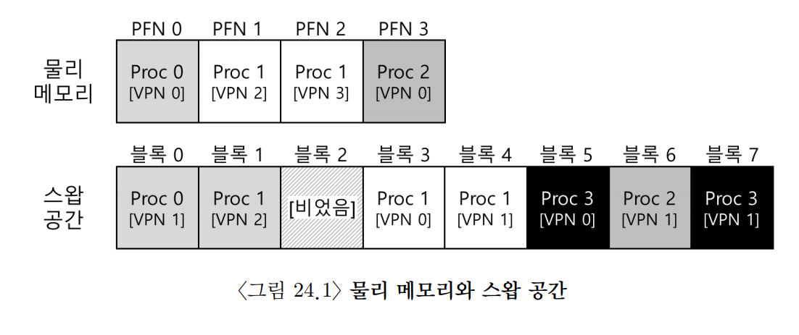
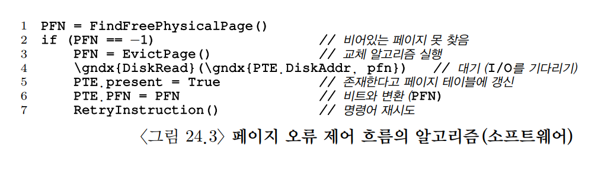
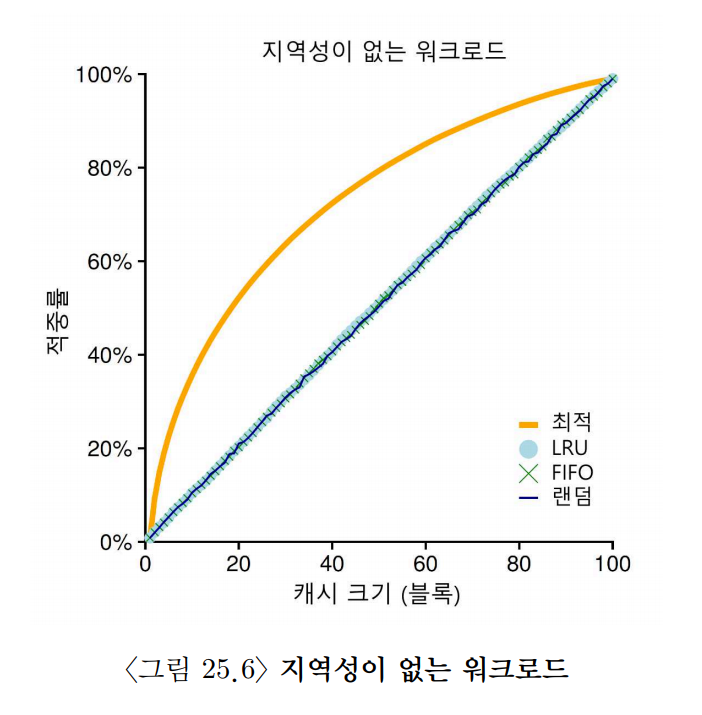
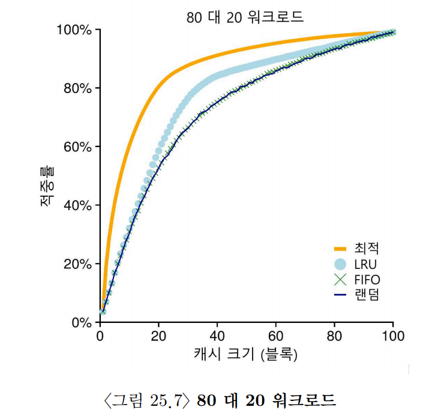
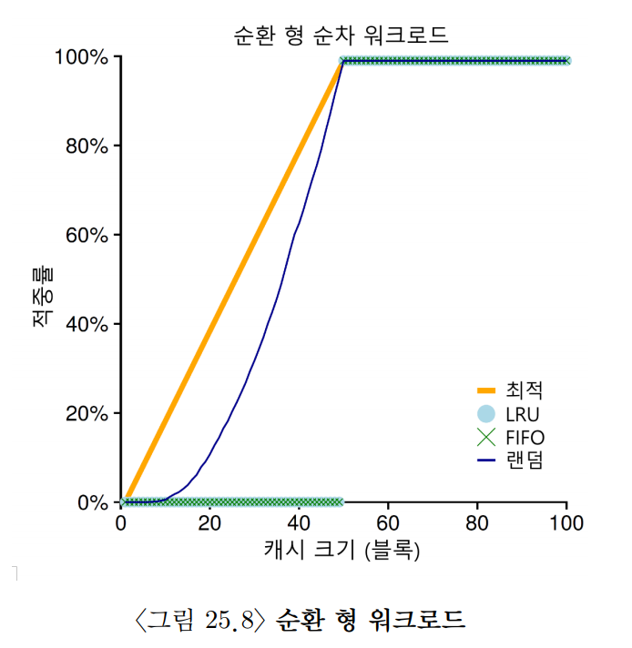
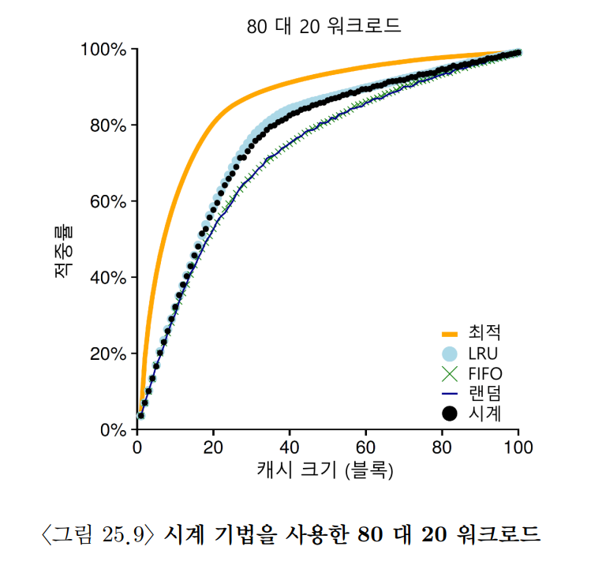
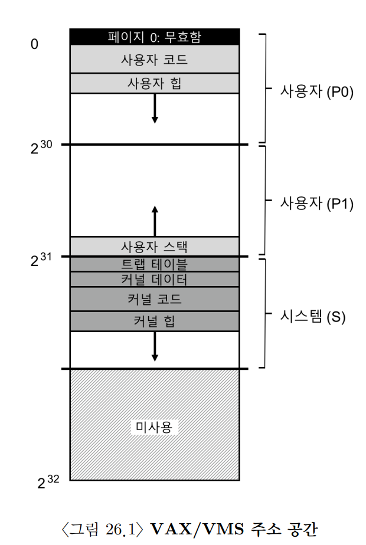

## 24. 물리 메모리 크기의 극복: 메커니즘

- 지금까지는 프로세스의 주소 공간이 모두 물리 메모리에 올라와 있다고 가정했다.
- 하지만 실제 시스템에서는 여러 프로세스가 동시에 실행되고, 각 프로세스가 큰 주소 공간을 사용한다.
- 모든 프로세스의 모든 페이지를 물리 메모리에 항상 올려 두기는 어렵다.
- 그래서 운영체제는 메모리 계층에 디스크를 추가로 사용한다.
  - 당장 필요하지 않은 페이지는 디스크에 잠시 보관한다.
  - 필요할 때 다시 디스크에서 메모리로 가져온다.
  - 이 과정을 통해 실제 물리 메모리보다 더 큰 가상 메모리를 제공할 수 있다.

### 1. 왜 큰 주소 공간이 필요할까?

- 프로세스에게 큰 주소 공간을 제공하는 이유는 편리함과 사용 용이성 때문이다.
  - 프로그램은 자료구조를 위한 메모리가 충분한지 매번 걱정하지 않아도 된다.
  - 필요할 때 운영체제에 메모리 할당을 요청하면 된다.
- 운영체제가 가상 메모리 환경을 제공하면 프로그래머는 물리 메모리 크기를 직접 관리하지 않아도 된다.
- 과거에는 `메모리 오버레이(memory overlay)`라는 기법을 사용하기도 했다.
  - 프로그래머가 코드나 데이터 일부를 직접 메모리에 올리고 내리는 방식이다.
  - 가상 메모리와 스왑 공간이 도입되면서 이런 수동 관리 부담이 줄어들었다.
- 멀티프로그래밍 시스템에서는 여러 프로그램이 동시에 실행된다.
  - 모든 프로세스의 모든 페이지를 물리 메모리에 저장하기 어렵다.
  - 따라서 일부 페이지를 디스크로 내보내는 스왑 기능이 필요하다.

### 2. 스왑 공간

- 스왑을 사용하려면 디스크에 페이지를 저장할 공간이 필요하다.
  - 이 공간을 `스왑 공간(swap space)`이라고 한다.
- 스왑 공간은 메모리에서 밀려난 페이지를 임시로 저장하는 디스크 영역이다.
- 운영체제는 페이지 단위로 스왑 공간에 데이터를 쓰고, 필요할 때 다시 읽어 온다.

운영체제가 관리해야 하는 정보:

- 어떤 페이지가 스왑 공간에 저장되어 있는지
- 그 페이지가 디스크의 어느 위치에 있는지
- 다시 메모리로 가져올 때 어느 프로세스의 어느 가상 페이지인지

스왑 공간의 크기도 중요하다.

- 스왑 공간이 클수록 물리 메모리보다 더 많은 페이지를 다룰 수 있다.
- 스왑 공간이 부족하면 더 이상 페이지를 디스크로 내보내기 어렵다.



#### 1. 파일 시스템도 스왑처럼 사용될 수 있다

- 모든 페이지가 반드시 스왑 공간에 저장되는 것은 아니다.
- 예를 들어 실행 파일의 코드 페이지는 이미 파일 시스템에 원본이 있다.
  - 프로그램이 실행되면 코드 페이지가 메모리에 올라온다.
  - 물리 메모리가 부족해지면 이 코드 페이지는 그냥 버릴 수 있다.
  - 나중에 다시 필요하면 실행 파일에서 다시 읽어 오면 된다.
- 즉 코드 페이지처럼 디스크에 원본이 있는 페이지는 별도의 스왑 공간에 저장하지 않아도 된다.
- 이 경우 파일 시스템의 원본 위치가 스왑 공간과 비슷한 역할을 한다.

### 3. Present Bit

- 페이지가 디스크로 스왑될 수 있으려면 PTE에 추가 정보가 필요하다.
- 하드웨어는 해당 페이지가 현재 물리 메모리에 있는지 알아야 한다.
- 이를 표현하는 비트가 `Present Bit`이다.

```text
Present Bit = 1 -> 페이지가 물리 메모리에 있음
Present Bit = 0 -> 페이지가 현재 물리 메모리에 없음
```

기본 메모리 접근 흐름:

1. 프로세스가 가상 주소를 생성한다.
2. 하드웨어가 가상 주소에서 VPN을 추출한다.
3. TLB에서 해당 VPN의 변환 정보를 찾는다.
4. TLB 히트라면 PFN을 얻고 물리 주소를 만든다.
5. 물리 주소를 이용해 데이터나 명령어를 가져온다.

TLB 미스가 발생한 경우:

1. 하드웨어가 페이지 테이블의 위치를 찾는다.
2. VPN을 인덱스로 사용하여 PTE를 읽는다.
3. PTE가 유효하고 Present Bit가 1이면 PFN을 얻는다.
4. 해당 변환 정보를 TLB에 탑재한다.
5. 명령어를 다시 실행한다.

- 만약 PTE는 유효하지만 Present Bit가 0이면 페이지가 물리 메모리에 없는 상태이다.
- 이때 발생하는 예외를 `페이지 폴트(Page Fault)`라고 한다.
- 페이지 폴트가 발생하면 제어권이 운영체제로 넘어가고, 페이지 폴트 핸들러가 실행된다.

### 4. 페이지 폴트
- 페이지 폴트는 단순히 TLB에 변환 정보가 없는 상황이 아니다.
- 필요한 페이지가 현재 물리 메모리에 없어서 디스크에서 가져와야 하는 상황이다.
- TLB 미스를 하드웨어가 처리하든 운영체제가 처리하든, 페이지 폴트는 운영체제가 처리한다.

페이지 폴트 처리 흐름:

1. 운영체제가 PTE를 확인한다.
2. PTE에서 해당 페이지의 디스크 위치를 찾는다.
3. 디스크 I/O를 요청하여 페이지를 물리 메모리로 읽어 온다.
4. I/O가 완료되면 PTE를 갱신한다.
5. PFN을 새 물리 프레임 번호로 설정한다.
6. Present Bit를 1로 설정한다.
7. 페이지 폴트를 발생시킨 명령어를 다시 실행한다.

- 명령어를 다시 실행하면 TLB 미스가 한 번 더 발생할 수 있다.
  - 이때는 페이지가 이미 물리 메모리에 있다.
  - TLB 미스 처리 과정에서 PTE의 PFN을 읽어 TLB를 갱신한다.
  - 그 다음 재실행에서는 TLB 히트가 발생한다.
- 디스크 I/O는 매우 느리기 때문에 페이지 폴트를 일으킨 프로세스는 보통 차단된다.
  - 운영체제는 그동안 다른 실행 가능한 프로세스를 실행한다.
  - 이렇게 하면 디스크 I/O 시간 동안 CPU를 더 효율적으로 사용할 수 있다.

### 5. 메모리에 빈 공간이 없으면?
- 지금까지의 설명은 페이지를 메모리로 가져올 빈 프레임이 있다고 가정했다.
- 하지만 실제로는 물리 메모리에 빈 공간이 없을 수 있다.
- 이 경우 운영체제는 기존 페이지 중 하나를 디스크로 내보내고 빈 프레임을 만들어야 한다.

관련 용어:

- `Page-In`: 필요한 페이지를 디스크에서 메모리로 가져오는 것
- `Page-Out`: 메모리에 있던 페이지를 디스크로 내보내는 것
- `Page Replacement Policy`: 어떤 페이지를 내보낼지 결정하는 정책

- 좋은 교체 정책은 앞으로 당분간 사용되지 않을 페이지를 선택하려고 한다.
- 나쁜 교체 정책은 곧 다시 사용할 페이지를 내보내 페이지 폴트를 더 많이 만들 수 있다.
- 페이지 교체가 자주 발생하면 메모리 접근 대신 디스크 I/O가 반복된다.
  - 이 경우 시스템 성능이 크게 느려질 수 있다.

### 6. 페이지 폴트 처리의 세 가지 경우
- TLB 미스가 발생했을 때는 PTE 상태에 따라 세 가지 경우를 생각할 수 있다.

#### 1. 페이지가 유효하고 물리 메모리에 있는 경우
- PTE가 유효하고 Present Bit가 1인 경우이다.
- 진짜 페이지 폴트가 아니다.
  - 단지 TLB에 변환 정보가 없었을 뿐이다.
- TLB 미스 핸들러가 PTE에서 PFN을 가져와 TLB를 갱신한다.
- 이후 명령어를 다시 실행하면 정상적으로 접근할 수 있다.

#### 2. 페이지가 유효하지만 물리 메모리에 없는 경우
- PTE는 유효하지만 Present Bit가 0인 경우이다.
- 프로세스가 접근해도 되는 페이지이지만 현재 물리 메모리에 없다.
- 이 경우 페이지 폴트 핸들러가 실행된다.
  - 운영체제는 스왑 공간에서 해당 페이지를 찾아 메모리로 가져온다.
  - PTE를 갱신한 뒤 명령어를 다시 실행한다.

#### 3. 페이지가 유효하지 않은 경우
- 프로세스가 접근하면 안 되는 주소에 접근한 경우이다.
- 잘못된 포인터나 할당되지 않은 주소를 참조할 때 발생할 수 있다.
- 이 경우 PTE의 다른 비트는 의미가 없다.
- 하드웨어는 이 접근을 운영체제의 트랩 핸들러가 처리하도록 한다.
  - 운영체제는 보통 해당 프로세스에 오류를 전달하거나 프로세스를 종료한다.



### 7. 교체는 실제 언제 일어나는가?
- 운영체제는 페이지 폴트가 발생한 순간에만 교체를 수행하지 않는다.
- 보통은 항상 어느 정도의 여유 메모리를 유지하려고 한다.
  - 페이지 폴트가 발생했을 때 즉시 사용할 빈 프레임이 있으면 처리 시간이 줄어든다.
- 이를 위해 운영체제는 두 기준값을 사용할 수 있다.
  - `LW(Low Watermark)`: 여유 메모리가 너무 적다고 판단하는 최솟값
  - `HW(High Watermark)`: 충분한 여유 메모리가 확보되었다고 판단하는 최댓값

동작 방식:

1. 여유 메모리 크기가 LW보다 작아진다.
2. 운영체제가 백그라운드 쓰레드를 실행한다.
3. 이 쓰레드는 페이지를 교체하여 여유 프레임을 늘린다.
4. 여유 메모리 크기가 HW에 도달하면 작업을 멈춘다.

- 이 백그라운드 쓰레드는 보통 `스왑 데몬` 또는 `페이지 데몬`이라고 부른다.
- 여러 페이지를 한 번에 교체하면 성능이 좋아질 수 있다.
  - 디스크는 작은 I/O를 여러 번 수행하는 것보다 큰 I/O를 한 번 수행하는 편이 효율적일 수 있다.
  - 그래서 많은 시스템은 여러 페이지를 클러스터나 그룹으로 묶어 한 번에 스왑 공간에 기록한다.

### 8. 요약
- 이 장에서는 실제 물리 메모리보다 더 큰 가상 메모리를 제공하는 방법을 살펴보았다.
- 핵심은 필요한 페이지만 물리 메모리에 두고, 당장 필요하지 않은 페이지는 디스크에 보관하는 것이다.
- 이를 위해 PTE에는 `Present Bit`가 필요하다.
  - Present Bit는 해당 페이지가 현재 물리 메모리에 있는지 알려 준다.
- 물리 메모리에 없는 페이지에 접근하면 페이지 폴트가 발생한다.
  - 운영체제는 페이지 폴트 핸들러를 실행한다.
  - 필요한 페이지를 디스크에서 메모리로 가져온다.
  - 빈 프레임이 없다면 기존 페이지를 교체하여 공간을 만든다.
- 이 모든 과정은 프로세스가 직접 알지 못하는 상태에서 처리된다.
- 프로세스 입장에서는 자신만의 크고 연속적인 가상 주소 공간을 사용하는 것처럼 보인다.

## 25. 물리 메모리 크기의 극복: 정책
- 물리 메모리에 빈 공간이 없으면 운영체제는 `메모리 압박`을 해소해야 한다.
- 이때 운영체제는 메모리에 있는 페이지 중 일부를 디스크로 내보내고 빈 공간을 만든다.
- 어떤 페이지를 내보낼지 결정하는 기준을 `교체 정책(Replacement Policy)`이라고 한다.
- 좋은 교체 정책의 목표는 페이지 폴트와 디스크 I/O를 줄이는 것이다.

### 1. 캐시 관리
- 메인 메모리는 가상 메모리 페이지를 담아 두는 캐시로 볼 수 있다.
  - 메모리에 페이지가 있으면 `캐시 히트`이다.
  - 메모리에 페이지가 없어서 디스크에서 가져와야 하면 `캐시 미스`이다.
- 교체 정책의 목표는 캐시 미스 횟수를 최소화하는 것이다.
  - 즉 디스크에서 페이지를 가져오는 횟수를 줄이는 것이다.
- 캐시 히트와 미스의 비율을 알면 평균 메모리 접근 시간(AMAT)을 계산할 수 있다.

```text
AMAT = (P_hit * T_M) + (P_miss * T_D)
```

- `P_hit`: 캐시 히트 확률
- `P_miss`: 캐시 미스 확률
- `T_M`: 메모리 접근 비용
- `T_D`: 디스크 접근 비용

- 현대 시스템에서는 디스크 접근 비용이 메모리 접근 비용보다 훨씬 크다.
- 따라서 아주 작은 페이지 미스 비율도 AMAT에 큰 영향을 줄 수 있다.
- 그래서 페이지 교체 정책은 성능에 매우 중요하다.

### 2. 최적 교체 정책
- 최적 교체 정책은 앞으로 가장 늦게 다시 사용될 페이지를 교체한다.
- 이 정책은 페이지 미스를 가장 적게 만들 수 있다.
- 하지만 실제로 구현하기는 어렵다.
  - 미래에 어떤 페이지가 언제 다시 사용될지 미리 알아야 하기 때문이다.

핵심 아이디어:

- 곧 다시 사용할 페이지는 메모리에 남겨 둔다.
- 가장 먼 미래에 다시 사용할 페이지를 내보낸다.

예를 들어 페이지 접근 순서가 다음과 같다고 하자.

```text
0, 1, 2, 0, 1, 3, 0, 3, 1, 2, 1
```

- 캐시가 처음에 비어 있다면 `0`, `1`, `2`에 대한 첫 접근은 모두 미스이다.
  - 이런 미스를 `최초 시작 미스` 또는 `강제 미스`라고 한다.
- 이후 `0`, `1`을 다시 접근하면 이미 캐시에 있으므로 히트가 발생한다.
- 페이지를 교체해야 하는 순간에는 현재 캐시에 있는 페이지들의 미래 접근 시점을 비교한다.
  - 가장 늦게 다시 사용될 페이지를 선택하여 내보낸다.
- 최적 정책은 실제 운영체제에서 그대로 구현할 수 없다.
- 대신 다른 교체 정책이 최적 정책에 얼마나 가까운지 비교하는 기준으로 사용된다.

### 3. 간단한 정책: FIFO
- `FIFO(First-In, First-Out)`는 가장 먼저 메모리에 들어온 페이지를 먼저 내보내는 정책이다.
- 페이지가 메모리에 들어오면 큐에 추가한다.
- 교체가 필요하면 큐에서 가장 오래된 페이지를 제거한다.

- 장점
  - 구현이 매우 쉽다.
  - 페이지가 들어온 순서만 관리하면 된다.
- 단점
  - 페이지가 최근에 자주 사용되었는지는 고려하지 않는다.
  - 예를 들어 페이지 `0`이 여러 번 접근되었더라도, 가장 먼저 들어왔다는 이유만으로 교체될 수 있다.
  - 그래서 최적 정책과 비교하면 성능이 좋지 않을 수 있다.

### 4. 또 다른 간단한 정책: 무작위 선택
- 무작위 선택 정책은 교체할 페이지를 랜덤하게 고른다.
- 특별한 이력을 관리하지 않기 때문에 구현이 단순하다.

특징:

- FIFO보다 좋은 성능을 보일 때도 있다.
- 최적 정책보다는 보통 성능이 낮다.
- 실행할 때마다 결과가 달라질 수 있다.

- 무작위 선택은 단순하지만 특정한 나쁜 패턴에 계속 갇히지 않는다는 장점이 있다.

### 5. 과거 정보의 사용: LRU
- 실제 운영체제는 미래를 알 수 없기 때문에 과거 정보를 사용한다.
- 과거 정보에서 중요하게 볼 수 있는 것은 두 가지이다.
  - 얼마나 자주 접근되었는가
  - 얼마나 최근에 접근되었는가
- 이런 정책들은 `지역성의 원칙(Locality)`에 기반한다.
  - 최근에 사용한 페이지는 가까운 미래에도 다시 사용할 가능성이 높다.
  - 자주 사용한 페이지도 앞으로 다시 사용할 가능성이 높다.
- 대표적인 정책
  - `LFU(Least Frequently Used)`: 가장 적게 사용된 페이지를 교체한다.
  - `LRU(Least Recently Used)`: 가장 오래 전에 사용된 페이지를 교체한다.
- LRU는 실제로 최적 정책에 가까운 성능을 보이는 경우가 많다.
- 이유는 프로그램이 보통 지역성을 가지기 때문이다.
  - 반복문 안에서 같은 코드와 데이터를 반복해서 접근한다.
  - 스택과 힙의 일부 영역을 짧은 시간 동안 집중적으로 사용한다.
- 반대로 다음과 같은 정책도 존재한다.
  - `MFU(Most Frequently Used)`: 가장 많이 사용된 페이지를 교체한다.
  - `MRU(Most Recently Used)`: 가장 최근에 사용된 페이지를 교체한다.
  - 하지만 대부분의 일반적인 워크로드에서는 MFU나 MRU가 잘 동작하지 않는 경우가 많다.

### 6. 워크로드에 따른 성능 비교
- 교체 정책의 성능은 워크로드에 따라 달라진다.

#### 1. 지역성이 없는 워크로드
- 페이지를 무작위적으로 참조된다는 뜻이다
- 아래 사진에서 보듯이 지역성이 없다면 어느 정책을 사용하든 상관이 없다



#### 2. 80 대 20 워크로드
- 20% 페이지들에게서 80% 참조가 발생하고, 나머지 80% 페이지들에게서 20% 참조만 발생한다
- 즉 인기 있는 페이지들만 대부분 참조가 된다
- LRU가 가장 좋은 성능을 보이지만, 미스로 인한 영향이 크지 않다면 LRU의 장점도 그렇게 중요하지 않게 된다



#### 3. 순차 반복 워크로드
- 50개의 페이지들을 순차적으로 참조한다
  - 0부터 49번째 페이지를 참조한 후에 다시 0부터 접근한다
- 이럴 경우 LRU와 FIFO는 캐시 히트율이 0%가 된다



### 7. 과거 이력 기반 알고리즘의 구현
- LRU는 성능이 좋지만 정확하게 구현하기 어렵다.
- 정확한 LRU를 구현하려면 모든 페이지 접근 순서를 알아야 한다.
  - 페이지가 접근될 때마다 해당 페이지를 가장 최근 사용 위치로 옮겨야 한다.
  - 모든 메모리 참조 정보를 기록하거나 갱신해야 한다.
- 이 작업은 너무 자주 발생하기 때문에 소프트웨어만으로 처리하면 비용이 크다.

#### 1. 하드웨어 지원이 필요한 이유
- LRU를 효율적으로 구현하려면 하드웨어 지원이 필요하다.
- 예를 들어 페이지가 접근될 때마다 하드웨어가 해당 페이지의 시간 정보를 갱신하도록 만들 수 있다.
- 하지만 페이지 수가 많아지면 또 다른 문제가 생긴다.
  - 모든 페이지의 시간 정보를 훑어 봐야 한다.
  - 가장 오래전에 사용된 페이지를 찾아야 한다.
  - 이 검색 자체가 매우 비싼 연산이 될 수 있다.

#### 2. 정확한 LRU가 꼭 필요할까?
- 여기서 중요한 질문이 생긴다.
  - 가장 오래된 페이지를 반드시 정확히 찾아야 할까?
  - 거의 오래된 페이지를 찾아도 충분하지 않을까?
- 실제 시스템에서는 완벽한 LRU보다 구현 비용이 낮은 근사 LRU를 많이 사용한다.

### 8. LRU 정책 근사하기
- LRU를 정확히 구현하기 어렵기 때문에 많은 시스템은 LRU를 근사한다.
- 근사 LRU는 완벽한 LRU는 아니지만 구현 비용이 훨씬 낮다.
- 핵심은 페이지가 최근에 사용되었는지만 간단히 기록하는 것이다.

#### 1. Use Bit
- LRU 근사에는 보통 `Use Bit` 또는 `Reference Bit`가 사용된다.
- 페이지가 참조될 때마다 하드웨어가 Use Bit를 1로 설정한다.
- 운영체제는 필요할 때 이 비트를 다시 0으로 바꾼다.
- Use Bit는 다음 위치에 저장될 수 있다.
  - 각 프로세스의 페이지 테이블
  - 별도의 배열
  - 운영체제가 관리하는 페이지 메타데이터

```text
Use Bit = 1 -> 최근에 참조된 페이지
Use Bit = 0 -> 최근에 참조되지 않은 페이지
```

#### 2. 시계 알고리즘
- Use Bit를 이용한 대표적인 LRU 근사 방법이 `시계 알고리즘(Clock Algorithm)`이다.
- 시스템의 모든 페이지가 원형 리스트를 이룬다고 생각한다.
- 시계 바늘은 현재 검사할 페이지를 가리킨다.

페이지 교체가 필요할 때 동작 방식:

1. 시계 바늘이 가리키는 페이지의 Use Bit를 확인한다.
2. Use Bit가 0이면 그 페이지를 교체 대상으로 선택한다.
3. Use Bit가 1이면 최근에 사용된 페이지로 판단한다.
4. 해당 페이지의 Use Bit를 0으로 바꾼다.
5. 시계 바늘을 다음 페이지로 이동한다.
6. Use Bit가 0인 페이지를 찾을 때까지 반복한다.

- Use Bit가 1인 페이지는 한 번 더 기회를 받는다.
- 그래서 시계 알고리즘은 `Second-Chance` 알고리즘이라고도 볼 수 있다.



#### 3. 다른 근사 방식
- Use Bit를 활용하는 방식은 시계 알고리즘만 있는 것이 아니다.
- 기본 아이디어는 비슷하다.
  - 주기적으로 Use Bit를 지운다.
  - 교체 시점에 Use Bit가 0인 페이지를 더 오래 사용되지 않은 페이지로 본다.
- 변형된 방식에서는 페이지들을 순서대로 보지 않고 랜덤하게 검사할 수도 있다.
  - Reference Bit가 1인 페이지를 만나면 비트를 0으로 바꾼다.
  - Reference Bit가 0인 페이지를 만나면 그 페이지를 교체 대상으로 선택한다.
- 이런 방식은 완벽한 LRU만큼 좋지는 않다.
- 하지만 FIFO나 무작위 선택처럼 과거 정보를 거의 사용하지 않는 정책보다 좋은 성능을 보이는 경우가 많다.

### 9. 갱신된 페이지(Dirty Page)의 고려
- 페이지 교체 시에는 해당 페이지가 변경되었는지도 고려해야 한다.
- 페이지가 변경된 상태라면 그 페이지를 `Dirty Page`라고 한다.
- Dirty Page를 디스크로 내보내려면 변경된 내용을 디스크에 다시 기록해야 한다.
  - 즉 추가 디스크 I/O가 필요하다.
  - 따라서 교체 비용이 커진다.
- 반대로 변경되지 않은 페이지는 `Clean Page`라고 한다.
  - Clean Page는 디스크에 원본이 이미 있으므로 그냥 버릴 수 있다.
  - 필요하면 나중에 다시 디스크에서 읽어 오면 된다.

#### 1. Dirty Bit
- Dirty Page를 구분하기 위해 하드웨어는 `Modified Bit` 또는 `Dirty Bit`를 제공한다.
- 페이지가 수정될 때마다 하드웨어가 Dirty Bit를 1로 설정한다.

```text
Dirty Bit = 1 -> 페이지가 수정됨
Dirty Bit = 0 -> 페이지가 수정되지 않음
```

#### 2. 교체 정책에 미치는 영향
- 운영체제는 가능하면 Dirty Page보다 Clean Page를 먼저 교체하려고 한다.
- Clean Page를 내보내면 추가 쓰기 작업이 필요 없기 때문이다.
- 시계 알고리즘도 이 정보를 활용할 수 있다.
  - Use Bit만 보는 것이 아니라 Dirty Bit도 함께 고려한다.
  - 최근에 사용되지 않았고, 수정되지 않은 페이지를 먼저 찾는 방식으로 개선할 수 있다.

### 10. 다른 VM 정책들
- VM 시스템에는 페이지 교체 정책만 있는 것이 아니다.
- 운영체제는 페이지를 언제 가져올지, 언제 디스크에 쓸지도 결정해야 한다.

#### 1. 페이지 선택 정책
- 페이지 선택 정책은 언제 페이지를 메모리로 가져올지 결정한다.
- 가장 기본적인 방식은 `요구 페이징(Demand Paging)`이다.
  - 페이지가 실제로 요청될 때 메모리로 읽어 들인다.
  - 필요하지 않은 페이지를 미리 가져오지 않기 때문에 단순하다.

#### 2. 선반입
- 운영체제는 어떤 페이지가 곧 사용될 것이라고 예측하면 미리 읽어 올 수도 있다.
- 이런 방식을 `선반입(Prefetching)`이라고 한다.
- 선반입은 예측이 맞으면 성능을 높일 수 있다.
  - 나중에 페이지 폴트를 줄일 수 있기 때문이다.
- 하지만 예측이 틀리면 오히려 손해가 된다.
  - 필요 없는 페이지를 읽느라 디스크 I/O와 메모리를 낭비하기 때문이다.
- 따라서 선반입은 성공할 가능성이 충분히 높을 때만 사용하는 것이 좋다.

#### 3. 클러스터링
- 또 다른 정책은 변경된 페이지를 언제 디스크에 기록할지와 관련된다.
- 운영체제는 Dirty Page를 하나씩 바로 쓰기보다 여러 개를 모아서 한 번에 쓸 수 있다.
- 이런 방식을 `클러스터링(Clustering)` 또는 `모으기`라고 한다.
- 디스크는 작은 쓰기를 여러 번 수행하는 것보다 큰 쓰기를 한 번 수행하는 편이 효율적일 수 있다.

### 11. 쓰래싱(Thrashing)
- 실행 중인 프로세스들이 요구하는 메모리 양이 가용 물리 메모리보다 커질 수 있다.
- 이 경우 시스템은 계속 페이지를 메모리로 가져오고, 다시 디스크로 내보내는 일을 반복한다.
- 이렇게 실제 계산보다 페이징에 대부분의 시간을 쓰는 상황을 `쓰래싱(Thrashing)`이라고 한다.

#### 1. 쓰래싱이 발생하면 생기는 문제
- 페이지 폴트가 매우 자주 발생한다.
- 디스크 I/O가 폭증한다.
- CPU는 실제 작업보다 I/O 대기에 더 많은 시간을 쓰게 된다.
- 결과적으로 시스템 전체 성능이 크게 떨어진다.

#### 2. 워킹 셋
- 쓰래싱을 이해하기 위해 `워킹 셋(Working Set)` 개념이 중요하다.
- 워킹 셋은 프로세스가 일정 시간 동안 실제로 사용하는 페이지들의 집합이다.
- 모든 실행 중인 프로세스의 워킹 셋을 합친 크기가 물리 메모리보다 크면 쓰래싱이 발생하기 쉽다.

#### 3. 해결 방법
- 운영체제는 실행 중인 프로세스 수를 줄일 수 있다.
  - 일부 프로세스의 실행을 잠시 중지한다.
  - 남은 프로세스들의 워킹 셋이 메모리에 올라갈 수 있도록 한다.
- 이런 방법은 `진입 제어(Admission Control)`라고 볼 수 있다.
  - 많은 일을 모두 조금씩 못하는 것보다, 적은 일을 제대로 처리하는 편이 나을 수 있다는 생각이다.
- 일부 최신 시스템은 더 강한 조치를 취하기도 한다.
  - `메모리 부족 킬러(Out-Of-Memory Killer)`를 실행한다.
  - 메모리를 많이 요구하는 프로세스를 종료하여 메모리를 확보한다.

### 12. 요약
- 현대 시스템은 단순한 LRU 근사만 사용하지 않는다.
- 시계 알고리즘 같은 기본 기법에 여러 성능 개선을 추가한다.
  - Use Bit와 Dirty Bit를 함께 고려한다.
  - Clean Page를 우선적으로 교체한다.
  - 여러 페이지를 묶어 디스크에 기록한다.
  - 워크로드 패턴에 따라 LRU의 약점을 피하려고 한다.
- 예를 들어 `탐색 내성(scan resistance)`은 현대 교체 알고리즘에서 중요한 특성이다.
  - 순차적으로 많은 페이지를 한 번씩 훑는 접근 패턴에서 LRU가 크게 흔들리는 것을 줄인다.
  - ARC 같은 알고리즘은 이런 문제를 완화하려고 설계되었다.
- 하지만 교체 알고리즘만으로 모든 문제를 해결할 수는 없다.
  - 메모리 접근 시간과 디스크 접근 시간의 차이가 매우 크기 때문이다.
  - 디스크 페이징이 자주 발생하면 어떤 정책을 써도 성능이 크게 나빠진다.
- 과도한 페이징이 발생한다면 가장 현실적인 해결책은 메모리를 더 확보하는 것이다.

## 26. VAX/VMS 가상 메모리 시스템
- 이번 장에서는 실제 운영체제였던 `VAX/VMS`의 가상 메모리 시스템을 살펴본다.
- VAX/VMS는 하드웨어의 한계를 운영체제 소프트웨어로 보완한 좋은 사례이다.
- 특히 작은 페이지 크기, 복잡한 주소 공간 구조, 제한적인 하드웨어 지원을 운영체제가 어떻게 다뤘는지 볼 수 있다.

### 1. 배경
- VMS는 VAX 하드웨어 위에서 동작하던 운영체제이다.
- VAX 하드웨어에는 가상 메모리 관리 측면에서 몇 가지 불편한 점이 있었다.
  - 페이지 크기가 작았다.
  - 페이지 테이블이 커질 수 있었다.
  - Reference Bit가 없어 페이지 교체 정책을 구현하기 어려웠다.
- VMS는 이런 하드웨어 한계를 소프트웨어 기법으로 보완했다.
- 이 장의 핵심은 다음과 같다.
  - VAX 하드웨어가 어떤 구조를 가졌는가
  - VMS가 페이지 테이블 공간 문제를 어떻게 줄였는가
  - VMS가 페이지 교체와 스와핑을 어떻게 처리했는가
  - Demand Zeroing과 Copy-On-Write 같은 VM 최적화를 어떻게 활용했는가

### 2. 메모리 관리 하드웨어
- VAX-11은 프로세스마다 32비트 가상 주소 공간을 제공했다.
- 페이지 크기는 512바이트였다.
  - 512바이트는 `2^9`이므로 오프셋은 9비트이다.
  - 나머지 23비트는 VPN으로 사용된다.

```text
32비트 가상 주소

[ VPN 23비트 | Offset 9비트 ]
```

- VPN의 상위 2비트는 세그먼트를 구분하는 데 사용되었다.
- 따라서 VAX/VMS는 페이징과 세그멘테이션이 결합된 하이브리드 구조를 가졌다.

#### 1. 주소 공간의 구분
- VAX의 주소 공간은 크게 프로세스 공간과 시스템 공간으로 나뉜다.
- 하위 절반은 `프로세스 공간`이다.
  - 각 프로세스마다 다르게 매핑된다.
  - 사용자 프로그램, 힙, 스택 등이 위치한다.
- 상위 영역 일부는 `시스템 공간`이다.
  - 커널 코드와 커널 자료구조가 매핑된다.
  - 여러 프로세스 주소 공간에서 공통으로 보일 수 있다.

#### 2. 작은 페이지 크기의 문제
- VAX의 페이지 크기는 512바이트로 작았다.
- 페이지가 작으면 내부 단편화는 줄어들 수 있다.
- 하지만 페이지 수가 많아지고, 그만큼 페이지 테이블도 커진다.
- VMS 설계자의 중요한 목표 중 하나는 페이지 테이블 때문에 메모리가 낭비되는 것을 막는 것이었다.

#### 3. VMS의 해결 방법
- VMS는 페이지 테이블 공간 문제를 줄이기 위해 두 가지 방법을 사용했다.

첫 번째 방법은 주소 공간을 세그먼트로 나누는 것이다.

- 사용자 주소 공간을 `P0`, `P1` 같은 영역으로 나누었다.
- 각 영역에 대해 필요한 만큼만 페이지 테이블을 만들 수 있었다.
- 베이스와 바운드 레지스터를 사용하여 각 세그먼트의 페이지 테이블 위치와 크기를 관리했다.

두 번째 방법은 사용자 페이지 테이블을 커널 가상 메모리에 두는 것이다.

- 페이지 테이블을 물리 메모리에 항상 고정해 두지 않았다.
- 커널의 가상 주소 공간 안에 페이지 테이블을 배치했다.
- 메모리가 부족하면 페이지 테이블 자체의 페이지도 디스크로 스왑할 수 있었다.
- 이 방식은 물리 메모리 압박을 줄여 준다.

- 단점도 있다.
  - 페이지 테이블이 커널 가상 메모리에 있으면 주소 변환 과정이 더 복잡해진다.
  - 하지만 VAX의 하드웨어 TLB가 이 비용을 상당 부분 줄여 주었다.



### 3. 실제 주소 공간
- VMS의 주소 공간에는 몇 가지 중요한 특징이 있다.

#### 1. 페이지 0을 비워 두기
- 코드 세그먼트는 페이지 0에서 시작하지 않는다.
- 페이지 0은 접근할 수 없는 페이지로 표시된다.
- 이렇게 하면 널 포인터 접근을 쉽게 잡아낼 수 있다.
  - 예를 들어 주소 0 근처를 잘못 참조하면 즉시 예외가 발생한다.
  - 운영체제는 이를 프로그램 오류로 처리할 수 있다.

#### 2. 커널이 사용자 주소 공간에 함께 매핑됨
- 중요한 특징은 커널의 가상 주소 공간이 각 프로세스의 주소 공간 안에 함께 매핑된다는 점이다.
- 문맥 교환이 발생하면 운영체제는 `P0`, `P1` 레지스터를 다음 프로세스의 페이지 테이블을 가리키도록 바꾼다.
- 하지만 시스템 공간을 나타내는 `S` 영역의 베이스와 바운드 레지스터는 바꾸지 않는다.
- 그 결과 모든 프로세스 주소 공간에 동일한 커널 코드와 커널 자료구조가 매핑된다.

#### 3. 커널을 함께 매핑하는 이유
- 커널이 각 프로세스의 주소 공간에 함께 매핑되면 운영체제 구현이 쉬워진다.
- 예를 들어 시스템 콜에서 사용자 프로그램이 포인터를 전달했다고 하자.
  - 커널은 같은 주소 공간 안에서 그 포인터가 가리키는 데이터를 읽을 수 있다.
  - 데이터를 커널 자료구조로 복사하는 과정도 자연스럽게 처리할 수 있다.
- 페이지 테이블을 커널 가상 메모리에 두는 방식도 이 구조 덕분에 가능해진다.

#### 4. 보호가 반드시 필요하다
- 커널이 사용자 주소 공간에 함께 매핑되어 있다고 해서 사용자가 커널을 마음대로 접근할 수 있으면 안 된다.
- 운영체제의 코드와 자료구조는 반드시 보호되어야 한다.
- VAX는 페이지 테이블의 `Protection Bit`를 이용해 페이지별 보호 수준을 설정했다.
  - 사용자 모드에서는 커널 페이지에 접근하지 못하게 한다.
  - 커널 모드에서는 필요한 커널 데이터에 접근할 수 있게 한다.

### 4. 페이지 교체
- VAX의 PTE에는 다음과 같은 정보가 들어 있었다.
  - 유효 비트
  - 보호 필드
  - 변경 비트
  - 운영체제가 사용하기 위해 예약한 필드
  - 물리 프레임 번호(PFN)
- 하지만 VAX PTE에는 `Reference Bit`가 없었다.
  - 즉 어떤 페이지가 최근에 사용되었는지 하드웨어가 직접 알려 주지 않았다.
  - VMS는 하드웨어 도움 없이 페이지 교체 정책을 설계해야 했다.
- 또 하나의 문제는 `메모리 호그(memory hog)`였다.
  - 메모리를 지나치게 많이 사용하는 프로그램을 의미한다.
  - 이런 프로세스가 시스템 전체 메모리를 독점하지 못하게 해야 했다.

#### 1. 세그먼트된 FIFO
- VMS는 `세그먼트된 FIFO(Segmented FIFO)` 정책을 사용했다.
- 각 프로세스는 `RSS(Resident Set Size)`를 가진다.
  - RSS는 한 프로세스가 물리 메모리에 유지할 수 있는 최대 페이지 수이다.
  - 프로세스가 RSS를 넘으면 자신의 페이지 중 하나를 내보내야 한다.
- 각 프로세스의 페이지는 FIFO 리스트에 보관된다.
  - 새 페이지는 리스트 뒤에 들어간다.
  - RSS를 초과하면 가장 오래된 페이지가 제거 후보가 된다.

순수 FIFO의 문제:

- 단순하지만 성능이 좋지 않을 수 있다.
- 최근에 사용된 페이지도 오래전에 들어왔다는 이유만으로 제거될 수 있다.

VMS의 개선:

- VMS는 두 개의 전역 second-chance 리스트를 사용했다.
  - `Clean-Page Free List`
  - `Dirty-Page List`
- 어떤 프로세스가 RSS를 넘으면 해당 프로세스의 FIFO 리스트에서 페이지가 제거된다.
- 제거된 페이지는 즉시 완전히 버려지지 않는다.
  - Clean Page라면 Clean-Page Free List에 들어간다.
  - Dirty Page라면 Dirty-Page List에 들어간다.

이 방식의 장점:

- 페이지가 전역 리스트에 있는 동안 원래 프로세스가 다시 접근하면 디스크 I/O 없이 되살릴 수 있다.
- 즉 페이지가 완전히 회수되기 전에 한 번 더 기회를 주는 효과가 있다.
- 다른 프로세스에 빈 페이지가 필요하면 Clean-Page Free List에서 페이지를 가져갈 수 있다.

#### 2. 페이지 클러스터링
- VMS는 작은 페이지 크기의 단점을 줄이기 위해 `페이지 클러스터링(Page Clustering)`을 사용했다.
- 512바이트 페이지를 하나씩 디스크에 쓰면 I/O 효율이 좋지 않다.
- 그래서 VMS는 Dirty Page 여러 개를 묶어서 한 번에 디스크로 보냈다.
- 운영체제는 스왑 공간의 위치를 자유롭게 정할 수 있다.
  - 따라서 여러 페이지를 연속된 위치에 묶어 쓸 수 있다.
  - 작은 I/O 여러 번보다 큰 I/O 한 번이 더 효율적일 수 있다.

### 5. 그 외의 VM 기법들
- VMS는 페이지 교체 외에도 오늘날 표준처럼 쓰이는 VM 기법을 사용했다.
- 대표적인 기법은 두 가지이다.
  - `Demand Zeroing`
  - `Copy-On-Write`

#### 1. Demand Zeroing
- `Demand Zeroing`은 필요한 순간에 페이지를 0으로 채우는 기법이다.
- 프로세스가 새 페이지를 요청했다고 해서 운영체제가 즉시 물리 페이지를 할당하고 0으로 초기화하지 않는다.
- 대신 해당 가상 페이지를 “아직 실제 물리 페이지가 없는 0 페이지”처럼 표시해 둔다.
- 프로세스가 실제로 그 페이지에 접근하면 페이지 폴트가 발생한다.
- 그때 운영체제가 물리 페이지를 할당하고 0으로 채운 뒤 매핑한다.

장점:

- 실제로 사용하지 않는 페이지에 물리 메모리를 낭비하지 않는다.
- 초기화 비용을 필요한 시점까지 미룰 수 있다.
- 프로그램이 큰 메모리 영역을 요청했지만 일부만 사용하는 경우 특히 유용하다.

#### 2. Copy-On-Write
- `Copy-On-Write(COW)`는 페이지 복사를 실제로 쓰기가 발생할 때까지 미루는 기법이다.
- 처음에는 여러 주소 공간이 같은 물리 페이지를 공유한다.
- 공유 페이지는 읽기 전용으로 표시된다.
- 어떤 프로세스가 그 페이지에 쓰려고 하면 보호 예외가 발생한다.
- 운영체제는 그때 새 물리 페이지를 만들고 내용을 복사한 뒤, 쓰기를 요청한 프로세스에게 새 페이지를 연결한다.

장점:

- 불필요한 복사를 줄일 수 있다.
- 프로세스 생성이나 주소 공간 복사 비용을 크게 낮출 수 있다.
- 여러 프로세스가 같은 내용을 읽기만 한다면 하나의 물리 페이지를 공유할 수 있다.

예시:

- `fork()`처럼 부모 프로세스의 주소 공간을 자식 프로세스가 처음에는 공유하는 경우
- 실행 파일의 코드 페이지를 여러 프로세스가 함께 읽는 경우
- 큰 메모리 영역을 복사했지만 실제로는 일부 페이지만 수정하는 경우
