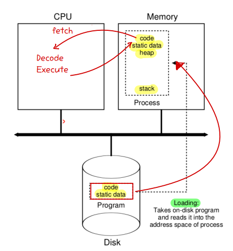
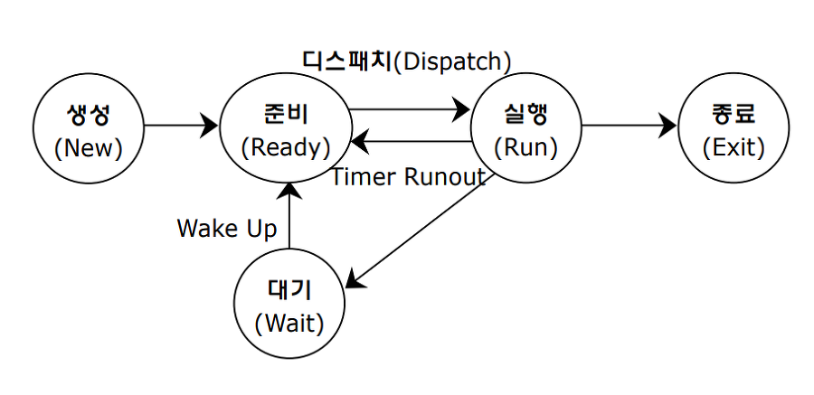
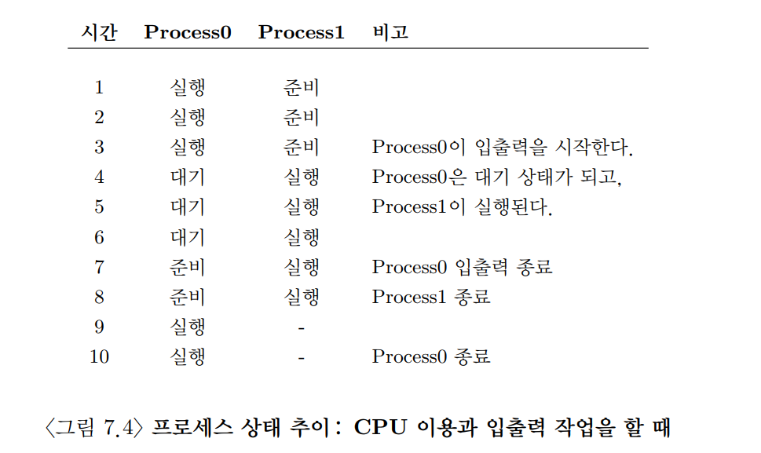

## 7. 프로세스의 개념 
### 0. 개요

- 프로세스
    - 실행 중인 프로그램
    - 디스크에 저장된 프로그램을 메모리에 올려 실행한 상태

- 운영체제는 여러 프로그램이 동시에 실행되는 것처럼 보이게 만든다
    - 이를 CPU 가상화라고 한다
    - 실제 CPU 개수보다 더 많은 프로그램이 동시에 동작하는 것처럼 보인다

- CPU 가상화 방식
    - 대표적으로 시분할(Time Sharing) 기법 사용
    - CPU 사용 시간을 매우 잘게 나누어 여러 프로세스가 번갈아 실행된다
    - CPU를 공유하기 때문에 각 프로세스 성능은 일부 감소할 수 있다

- CPU 가상화를 위해 필요한 요소
    - 메커니즘(Mechanism)
        - 운영체제 기능을 구현하는 저수준 도구
        - 예: 컨텍스트 스위치(Context Switch)
    - 정책(Policy)
        - 운영체제가 어떤 결정을 내릴지 정하는 알고리즘
        - 예: 어떤 프로세스를 먼저 실행할지 결정하는 스케줄링 정책

> #### 시분할(Time Sharing)과 공간 분할(Space Sharing)
> - 시분할: 운영체제가 사용하는 가장 기본적인 자원 공유이다
>   - 시간을 나누어 자원을 번갈아 사용
>   - CPU 같은 자원에서 주로 사용
> - 공간 분할
>   - 자원의 공간 자체를 나누어 사용
>   - 디스크 같은 자원에서 주로 사용
>   - 디스크의 공간 분할 예시
>     - 디스크 블록을 특정 파일에 할당
>     - 파일이 삭제되기 전까지 다른 파일이 해당 블록을 사용하지 않음

### 1. 프로세스의 개념
- 프로세스(Process)
    - 실행 중인 프로그램
    - 디스크에 저장된 프로그램이 메모리에 올라와 CPU에서 실행되는 상태이다
- 프로세스의 구성요소를 이해하기 위해서는 하드웨어 상태를 이해해야 한다
  - 프로그램은 실행되는 동안 하드웨어 상태를 읽거나 변경한다
  - 이때 가장 중요한 하드웨어 요소는 메모리와 레지스터이다

#### 1. 메모리
- 명령어는 메모리에 저장된다
- 프로그램이 사용하는 데이터도 메모리에 저장된다
- 프로세스가 접근 가능한 메모리 영역 역시 프로세스를 구성하는 요소이다

예시:
- 코드 영역
- 데이터 영역
- 스택 영역
- 힙 영역

#### 2. 레지스터(Register)
- CPU 내부의 매우 빠른 저장 공간
- 명령어 실행에 필요한 값을 저장한다
- 많은 명령어들이 레지스터 값을 읽거나 수정한다

#### 1). 주요 레지스터
- 프로그램 카운터(PC, Program Counter)
    - 현재 실행 중인 명령어 위치 저장
    - 다음에 실행할 명령어를 가리킨다
    - 명령어 포인터(IP)라고도 부른다
- 스택 포인터(Stack Pointer)
    - 현재 스택 위치 관리
- 프레임 포인터(Frame Pointer)
    - 함수 호출 시 지역 변수와 리턴 주소 관리

예시:
- 함수 호출
- 지역 변수 저장
- 함수 종료 후 원래 위치 복귀

#### 3. 저장장치 접근
- 프로그램은 파일 저장 및 읽기를 위해 디스크 같은 영구 저장장치에도 접근한다
- 입출력 정보는 프로세스가 현재 열어 놓은 파일 목록을 가지고 있다

> #### 정책과 구현의 분리
> - 운영체제는 고수준 정책과 저수준 기법을 분리하여 설계한다
> - 기법(Mechanism)
>   - 기능을 실제로 수행하는 방법
>   - 운영체제가 어떻게 동작하는가에 대한 부분
>   - 예시:
>     - 문맥 교환(Context Switch)
>     - 인터럽트 처리
>     - 메모리 주소 변환
> 정책(Policy)
> - 어떤 결정을 내릴지 정하는 알고리즘
> - 운영체제가 무엇을 선택할지 결정하는 부분
>   - 예시:
>     - 어떤 프로세스를 먼저 실행할까?
>     - 어떤 페이지를 메모리에서 제거할까?
>     - CPU를 얼마나 오래 사용할까?
> - 정책과 구현을 분리하는 이유
>   - 정책만 변경해도 운영체제 동작 방식을 바꿀 수 있다
>   - 기법 자체는 재사용 가능하다
>   - 유지보수와 확장이 쉬워진다
>   - 모듈화된 설계가 가능하다

### 2. 프로세스 API
- 운영체제가 반드시 제공하는 몇몇 기본 기능을 알아보자
- 생성
  - 운영체제는 새로운 프로세스를 생성할 수 있는 방법을 제공해야 한다
  - 쉘에 명령어를 입력하거나, 응용 프로그램을 클릭해서 실행하면 새로운 프로세스를 생성한다
- 제거
  - 프로세스를 강제로 제거할 수 있는 인터페이스를 제공해야 한다
- 대기
  - 어떤 프로세스의 실행 중지를 기다릴 필요가 있기 때문에 여러 종류의 대기 인터페이스가 제공된다
- 각종 제어
  - 프로세스 일시정지 및 재개 기능등을 제공한다
- 상태
  - 프로세스 상태 정보를 얻어내는 인터페이스를 제공한다
  - 상태 정보는 실행 시간과 어떤 상태 등이 포함된다

### 3. 프로세스 생성: 좀 더 자세하게
- 프로그램 실행을 위해서 코드와 정적 데이터(static data)를 메모리에 탑재(load)하는 것이다
  - 프로그램은 디스크, SSD에 실행 파일 형식에 존재하고 이걸 메모리에 탑재하기 위해서 운영체제는 디스크의 해당 바이트를 읽어서 메모리의 어딘가에 저장해야 한다
- 현대 운영체제는 코드와 데이터가 필요할 때 필요한 부분만 메모리에 탑재한다
  - 이러한 지연로딩은 페이징과 스와핑 동작의 이해가 필요하다
  - 이후 일정량의 메모리가 프로그램의 실행시간 스택용도로 할당되어야 한다
  - 지역 변수, 함수 인자, 리턴 주소등을 저장하기 위해 사용된다
- 프로그램의 힙(heap)을 위한 메모리 영역을 할당한다
  - 힙은 크기가 가변적인 자료 구조를 위해 사용된다
- 또 입출력과 관계된 초기화 작업을 수행한다
  - 표준입력, 표준 출력, 표준 에러장치에 해당하는 세 개의 파일 디스크립터를 갖는다
  - 이 디스크립터들을 사용하여 터미널로부터 입력을 읽고 화면에 출력한느 프린트하는 작업을 쉽게 할 수 있다
- 코드와 정적 데이터를 메모리에 탑재하고, 스택과 힙을 생성하고 초기화하고, 입출력 셋업과 관계된 다른 작업을 마치게 되면, 운영체제는 프로그램 실행을 위한 준비를 마치게 된다



### 4. 프로세스 상태
- 상태를 단순화하면 다음 세 상태 중 하나에 존재할 수 있다
  - 실행: 명령어를 실행중인 상태
  - 준비: 프로세스는 실행할 준비가 되어있지만 운영체제가 다른 프로세스를 실행하고 있는 등의 이유로 대기중인 상태
  - 대기: 입출력등을 요청할 때 같이 프로세스 수행을 중단시킨 상태





>#### 자료 구조 - 프로세스 리스트
> - 프로세스 리스트라는 자료구조를 이용해 실행 중인 프로그램을 관리한다
> - 프로세스 관리를 위한 정보를 저장하는 자료 구조를 프로세스 제어 블럭(PCB)라고 부른다

### 5. 자료 구조
- 운영체제도 일종의 프로그램으로 다양한 자료구조가 있다
  - 프로세스들을 위한 `프로세스 리스트`와 같은 자료 구조를 유지한다
  - 실행, 대기 상태인 프로세스도 파악하고, 적절한 프로세스를 깨워 준비 상태로 전이시킬 수 있어야 한다
- 레지스터 문맥 자료 구조로 프로세스가 중단돼었을 때 해당 프로세스의 레지스터값들을 저장한다
  - 이 레지스터값들을 복원하여 실행을 재개한다

## 8. 막간: 프로세스 API
- Unix는 프로세스를 생성하기 위해 `fork()`와 `exec()` 시스템 콜을 사용한다
  - `wait()`는 자신이 생성한 프로세스가 종료되기를 기다리길 원할 때 사용한다

### 1. fork() 시스템 콜
- 새로운 프로세스를 생성할 때 사용하는 시스템 콜이다
  - 기존 프로세스를 복사해서 새로운 프로세스를 만든다
  - fork()를 호출한 원래 프로세스를 부모 프로세스(parent process) 라고 한다
  - 새로 생성된 프로세스를 자식 프로세스(child process) 라고 한다
  - 부모와 자식은 거의 동일한 코드와 메모리 내용을 가진 상태로 실행을 시작한다
  - fork() 이후에는 부모와 자식이 각각 독립적으로 실행된다

```text
부모 프로세스 실행 중
        ↓
    fork() 호출
       / \
      /   \
부모 프로세스   자식 프로세스
   계속 실행      새로 생성되어 실행
```

### 2. wait() 시스템 콜
- 부모 프로세스가 자식 프로세스의 종료의 대기하는 경우가 생길 수 있다
- wait()를 호출해 자식이 종료될 때까지 자신의 실행을 잠시 중지시킨다

### 3. exec() 시스템 콜
- 자기 자신이 아닌 다른 프로그램을 실행해야 할 때 사용한다
- 실행 파일의 이름과 인자가 주어지면 해당 실행 파일의 코드와 정적 데이터를 읽어 들여 현재 실행 중인 프로세스의 코드 세그먼트와 정적 데이터 부분을 덮어 쓴다
  - 힙과 스택은 새로운 프로그램을 위해 초기화된다
  - 새로운 프로세스를 생성하는 것이 아니라 대체하는 것이다

### 4. 왜 이런 API를?
- Unix에서 쉘을 구현하기 위해 fork와 exec를 분리해야 한다
  - 그래야 해당 명령어들을 호출하기 전에 코드를 실행할 수 있다
- 쉘은 프로그램을 실행하기 위해 `fork()`를 호출하여 새로운 자식 프로세스를 만든 후 `exec()`를 호출하여 프로그램을 실행시키고 `wait()`로 명령어가 끝나기를 기다린다
  - 자식 프로세스가 종료되면 다시 프롬프트를 출력하고 다음 명령어를 기다린다

### 5. 여타 API들
- `kill()`은 프로세스에게 시그널을 보내는 데 사용된다
  - 시그널은 프로세스를 중단시키고 삭제하는 등의 작업에 사용된다
  - 시그널의 매커니즘은 외부 사건을 프로세스에게 전달하는 토대이다