## 9. 제한적 직접 실행 원리
- CPU를 가상화하기 위해서 운영체제는 물리적인 CPU를 공유한다
  - 기본적인 아이디어는 시분할로 잠깐씩 실행시킨다
- 이러한 가상화 기법을 구현하기 위해서 몇 가지 문제를 해결해야 한다
  - 첫 번째는 성능 저하로 과중한 오버헤드를 주지 않으면서 구현해야 한다
  - 두 번째는 제어 문제로 CPU에 대한 통제를 유지하면서 프로세스를 효율적으로 실행시켜야 한다
  - 특히 제어권이 중요한데, 한 프로세스가 영원히 실행하거나 접근해서 안되는 정보에 접근하면 안된다

### 1. 기본 원리: 제한적 직접 실행
- 프로그램을 CPU 상에 그냥 직접 실행시키는 것이다
  - 문제점은 시분할 기법을 구현할 수 없고 운영체제가 원치않은 일을 하지 않는지 보장할 수 없다

### 2. 문제점 1: 제한된 연산
- 직접 실행의 장점은 CPU에서 실행되기 때문에 빠르게 실행된다는 것이다
- 다만 프로세스가 특수한 종류의 연산을 수행하길 원한다면 선택해야 될 사항이 있다 
  - 디스크 입출력 요청이나 CPU 또는 메모리 자원에 대한 추가할당 요청 등을 의미한다 
  - 프로세스가 원하는 대로 방치하는 방안이 있다
    - 이러면 디스크의 경우 전체 디스크에 읽고쓰기가 가능하기 때문에 권한의 의미가 없어진다
    - 이 때문에 `사용자 모드(user mode)`가 도입되었다
- 사용자 모드에서는 실행되는 코드가 제한된다
- 커널 모드는 운영체제의 중요한 코드들이 실행되고 모든 특수한 명령어를 포함하여 원하는 모든 작업을 수행할 수 있다
- 사용자 프로세스가 디스크 읽기와 같은 명령어를 실행할 때 현대 하드웨어는 시스템 콜을 제공한다
  - 시스템 콜을 통하여 자신의 주요 기능을 사용자 프로그램에게 제공한다
  - 파일 시스템 접근, 프로세스 생성 및 제거, 다른 프로세스와의 통신 등을 의미한다
  - 시스템 콜을 실행하기 위해 프로그램은 trap이라는 특수 명령어를 실행해야 한다
  - 이 명령어는 커널 안으로 분기하는 동시에 특권 수준을 커널 모드로 상향 조정한다
  - 커널 모드로 진입하면 운영체제는 모든 명령어를 실행할 수 있고 이를 통하여 프로세스가 요청한 작업을 처리할 수 있다
  - 완료되면 return-from-trap 특수 명령어로 다시 사용자 모드로 하향 조정하면서 호출한 사용자 프로그램으로 리턴한다
- 하드웨어는 trap 명령어를 수행할 때 필요한 레지스터를 저장해야 한다
  - 운영체제가 return-from-trap 명령어 실행 시 사용자 프로세스로 제대로 리턴할 수 있도록 하기 위함이다
  - x86에서는 프로그램 카운터, 플래그와 다른 몇 개의 레지스터를 각 프로세스의 커널 스택에 저장한다
- trap이 운영체제 코드의 어디를 실행할 지 어떻게 아느냐도 중요하다
  - 호출한 프로세서는 분기할 주소를 명시할 수 없다
  - 주소를 명시한다는 것은 커널 내부의 원하는 지점을 접근할 수 있다는 것이기 때문에 위험하다
  - 커널이 임의의 코드를 실행하기 위해서는 접근 권한 검사가 끝난 후 분기해야 한다
- 커널은 부팅 시 트랩 테이블을 만들고 이를 이용하여 시스템을 통제한다
  - 컴퓨터가 부팅될 때는 커널 모드로 동작하기 떄문에 하드웨어를 원하는 대로 제어할 수 있다
  - 운영체제의 초기 작업 중 하나는 하드웨어에게 예외 사건이 일어났을 때 어떤 코드를 실행해야 하는지 알려주는 것이다
  - 예로들어 하드 디스크 인터럽트가 발생하면 운영체제는 특정 명령어를 이용하여 하드웨어에게 `트랩 핸들러`의 위치를 알려준다
  - 하드웨어는 이 정보를 전달받으면 해당 위치를 기억하고 있다가 시스템 콜과 같은 예외적인 사건이 발생했을 때 하드웨어는 무엇을 해야 할지 알 수 있다

### 3. 문제점 2: 프로세스 간 전환
- 직접 실행의 두 번째 문제점은 프로세스 간 전환을 할 수 있어야 한다는 점이다
- 운영체제는 실행 중인 프로세스를 계속 실행할 지 전환할 지 결정해야 한다

#### 1. 협조 방식: 시스템 콜 기다리기
- 대부분 프로세스는 시스템 콜을 호출하여 CPU 제어권을 운영체제에게 넘긴다
  - 파일 시스템 일고쓰기, 새 프로세스를 생성할 때 `yield` 시스템 콜을 사용한다
  - 응용 프로그램이 0으로 나누는 등 비정상적인 행위를 하면 운영체제에게 제어가 넘어간다
- 하지만 악의적이든 버그든 프로세스가 무한 루프에 빠져 시스템 콜을 호출할 수 없으면 문제가 생긴다

#### 2. 비협조 방식: 운영체제가 전권을 행사
- 협조적 방식으로 프로세스가 무한루프가 빠졌을 때는 컴퓨터를 재부팅하여 제어권을 획득한다
- 하지만 이러한 문제를 `타이머 인터럽트`를 통해 수 밀리 초마다 인터럽트를 발생시키도록 한다
  - 인터럽트를 발생하면 프로세스는 중단되고 운영체제의 `인터럽트 핸들러`가 실행된다
  - 이 시점에 운영체제는 CPU 제어권을 얻게 되고 다른 프로세스를 실행시키는 작업 등을 할 수 있다
- 운영체제는 하드웨어에게 타이머 인터럽트가 발생했을 때 실행해야 할 코드를 알려주어야 한다
- 타이머가 시작되면 운영체제는 부담 없이 사용자 프로그램을 실행할 수 있다
- 인터럽트 발생 시 하드웨어에게도 약간의 역할이 있다
  - 인터럽트가 발생했을 때 실행중이던 프로그램 상태를 저장하여 나중에 `return-from-trap`명령어가 프로그램을 다시 시작할 수 있도록 해야 한다
  - 이러한 동작은 시스템 콜이 호출되었을 때와 매우 유사하다
  - 다양한 레지스터가 커널 스택에 저장되고, return-from-trap 명령어를 통하여 복원된다

#### 1). 문맥의 저장과 복원
- 운영체제가 제어권을 다시 획득하면 현재 프로세스를 계속 진행할 지 아니면 다른 프로세스로 전환할 지 결정해야 한다
  - 이러한 결정은 스케줄러에 의해 결정된다
- 다른 프로세스로 전환하기로 결정되면 운영체제는 문맥 교환(context switch)을 실행한다
  - 현재 실행중인 프로세스의 레지스터 값을 커널 스택 같은 곳에 저장하고 실행될 프로세스의 커널 스택으로부터 레지스터 값을 복원하는 것이다
  - 그렇게함으로써 운영체제는 `return-from-trap` 명령어가 마지막으로 실행될 때 다른 프로세스로 리턴하여 실행을 다시 시작할 수 있다
  - 프로세스 전환을 위하여 운영체제는 저수준 어셈블리 코드를 사용하여 현재 실행중인 프로세스의 범용 레지스터, PC뿐 아니라 현재 커널 스택 포인터를 저장한다

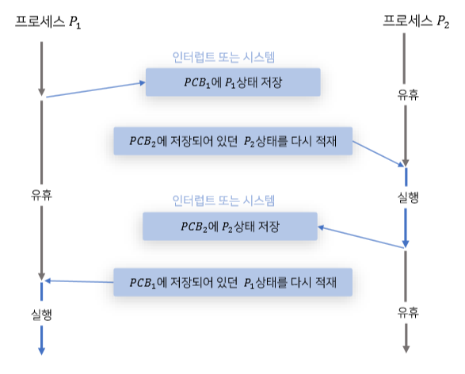

### 4.병행성이 걱정
- 운영체제는 인터럽트 또는 트랩을 처리하는 도중 다른 인터럽트가 발생했을 때 어떤 일이 생기는 지 고려할 필요가 있다
- 운영체제가 할 수 있는 간단한 방법은 인터럽트가 실행되는 동안 다른 인터럽트를 실행하지 못하게 하는 것이다
  - 이럴경우 하나의 인터럽트가 너무 오래걸리는 경우 인터럽트를 놓치게 되고 기술적으로도 좋지 않다
- 또한 내부 자료 구조에 동시에 접근하는 것을 방지를 위해 `락(lock)`을 개발해왔다

## 10. 스케줄링: 개요
- 다양한 스케줄링 정책을 소개한다
- 이러한 정책은 원칙이라고도 불린다
### 1. 워크로드에 대한 가정
- 일련의 프로세스들이 실행하는 상황을 `워크로드`라고 부르기로 한다
  - 워크로드를 결정하는 것은 정책 개발에 매우 중요한 부분이다. 워크로드에 대해 잘 알수록 그에 맞게 정책을 정교하게 만들 수 있다
- 시스템에서 실행중인 프로세스 혹은 작업(job)에 대해 다음과 같은 가정을 한다
  - 모든 작업은 같은 시간 동안 실행된다
  - 모든 작업은 동시에 도착한다
  - 각 작업은 시작되면 완료될 때까지 기달린다
  - 모든 작업은 CPU만 사용한다
  - 각 작업의 실행 시간은 사전에 알려져있다

### 2. 스케줄링 평가 항목
- 스케줄링 정책 비교를 위해 스케줄링 평가 항목을 결정해야 한다
  - 성능 측면에서는 `반환 시간`을 기준으로 사용한다
  - 다른 평가 기준은 공정성이다

### 3. 선입선출(FIFO)
- 가장 기초적인 알고리즘은 FIFO 또는 FCFS 스케줄링으로 알려져 있다
- 간단하지만 처음 시간하는 프로세스가 오래걸리면 뒤에 있는 것도 그만큼 기다려야 한다

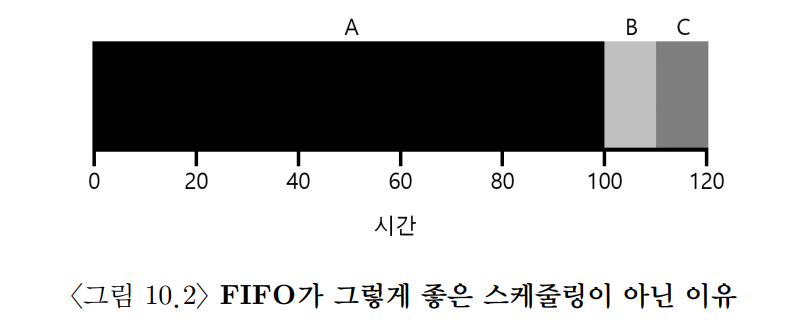

### 4. 최단 작업 우선(SJF)
- 최단 작업 우선(Shortest JobFirst)은 가장 짧은 실행 시간을 가진 작업을 먼저 실행시킨다
- SJF가 최적의 스케줄링 알고리즘이지만 비현실적이다
  - 모든 작업이 동시에 시작하지도 않고, 끝나는 시간을 알 수가 없다

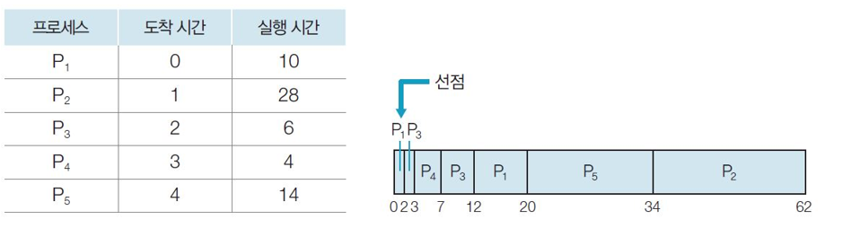

>#### 여담: 선점형 스케줄러
> - 예전 일괄처리 시절에는 비선점 스케줄러가 개발되었다 
> - 이 시스템은 각 작업이 종료될 때까지 계속 실행한다. 
> - 현대 스케줄러는 선점형으로 다른 프로세스를 실행시키기 위해 필요하면 현재 프로세스의 실행을 중단한다

### 5. 최소 잔여시간 우선(STCF)
- SJF에 선점 기능을 추가한 Shortest Time-to-Completion First) 또는 선점형 최단 작업 우선(PSJF)가 있다
- 새로운 작업이 들어오면, 남아 있는 작업과 새로운 작업의 잔여 실행 시간을 계산하고, 그 중 가장 적은 잔여 실행 시간을 가진 작업을 스케줄한다
- 새로운 가정 하에서 STCF가 최적의 스케줄러다

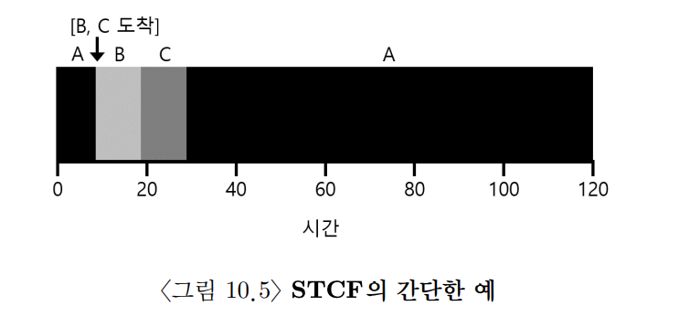

### 6. 새로운 평가 기준: 응답 시간
- 작업의 길이를 미리 알고 있고, 작업이 오직 CPU만 사용하며, 평가 기준이 반환 시간 하나라면 STCF 훌륭한 정책이다
- 초기 일괄처리 컴퓨터 시스템에서는 이러한 알고리즘이 의미가 있었다
- 하지만 시분할 컴퓨터의 등장이 모든 것을 바꾸었다
- 이제 사용자는 터미널에서 작업하게 되어 시스템에게 상호작용을 원활히 하기 위한 성능을 요구하게 되어 응답 시간이라는 새로운 평가 기준이 태어나게 된다
- SJF는 반환 시간 기준으로는 훌륭하지만 응답시간과 상호작용 측면에서는 매우 나쁜 방법이다

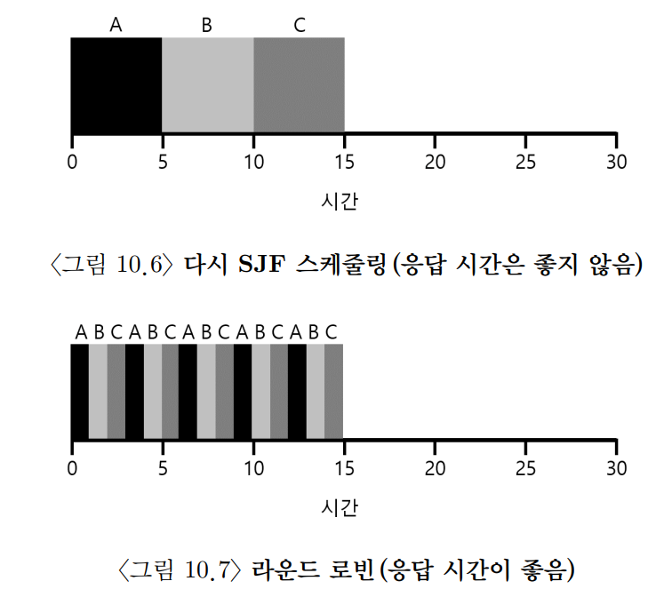

### 7. 라운드 로빈(Round-Robin)
- 일정 시간동안만 실행한 후 다음 작업으로 전환한다
  - 일정 시간을 타입 슬라이스 또는 스케줄링 퀀텀이라고 부른다
- 타임 슬라이스가 짧을수록, 응답 시간 기준으로는 RR의 성능이 좋아지지만 Context Switching 문제가 생긴다
  - 시스템이 최적의 상태로 동작할 수 있도록 타임 슬라이스의 길이를 결정해야 한다
- RR와 같은 공정한 정책은 `반환 시간`기준으로는 성능이 나쁘지만, 반대로 불공정하다면 응답시간이 나빠진다

### 8. 입출력 연산의 고려
- 입출력을 하면 CPU를 사용하지 않기 때문에 그 시간만큼은 다른 프로세스가 사용할 수 있는 `중첩`이 가능해져 CPU 이용률이 더 높아진다

### 9. 만병통치약은 없다
- 지금까지 접근한 방식은 각 작업의 실행 시간을 알고 있어야 한다는 점이다
  - 범용 운영체제에서는 작업의 길이를 알 수 없다
  - 나중에 멀티 레벨 피드백 큐로 문제를 해결한다

## 11. 스케줄링: 멀티 레벨 피드백 큐
- Multi-level Feedback Queue(MLFQ)은 두 가지 문제를 해결하려고 한다
  - 짧은 작업을 먼저 실행시켜 반환 시간을 최적화한다
  - 대화형 사용자(터미널)에게 응답이 빠른 시스템이라는 느낌을 주기 위해 응답 시간을 최적화한다
- 프로세스 정보가 없다면 이러한 스케줄러를 어떻게 만들 수 있을까?

### 1. MLFQ: 기본 규칙
- 여러 개의 큐로 구성되어 각자 다른 우선순위가 배정된다
  - 실행 준비가 된 프로세스는 이 중 하나의 큐에 존재한다
  - 실행할 프로세스를 결정하기 위하여 우선순위를 사용한다
  - 큐에 둘 이상의 작업이 존재할 수 있고, 이들은 모두 같은 웃너순위를 가지고 RR 알고리즘이 사용된다
- MLFQ의 핵심은 우선순위를 정하는 방식이다
  - 고정된 우선순위를 부여하는 것이 아니라 각 작업의 특성에 따라 동적으로 우선순위를 부여한다
  - 예를들어 어떤 작업이 키보드 입력을 기다리며 CPU를 양보한다면 MLFQ는 해당 작업의 우선순위를 높게 유지한다
  - 긴 시간동안 CPU를 집중적으로 사용하면 우선순위를 낮춘다
  - 규칙1: Priority(A) > Priority(B)이면, A가 실행된다
  - 규칙2: Priority(A) = Priority(B)이면, RR 방식으로 실행된다

### 2. 시도 1: 우선순위 변경
- 작업이 시스템에 진입하면, 가장 높은 우선순위에 놓여진다
- 주어진 타임 슬라이스를 모두 사용하면 우선순위는 낮아진다. 한 단계 아래 큐로 이동한다
- 타임 슬라이스를 소진하기 전에 CPU를 야도하면 우선순위를 유지한다

#### 1. 예 1: 한 개의 긴 실행 시간을 가진 작업
- 최고 우선순위(Q2)로 진입하고 타임 슬라이스가 하나 지나면 우선순위를 한 단계 낮추어 Q1으로 이동시킨다
- 다시 하나의 타임 슬라이스 동안 Q1에서 실행한 후 작업은 가장 낮은 우선순위를 가지게 되고 Q0로 이동하고 계속 머무르게 된다

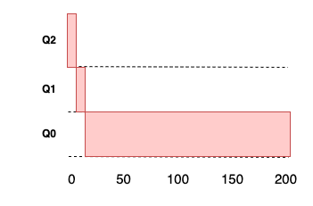

#### 2. 예 2: 짧은 작업과 함께
- A가 기존에 있던 오래 실행되는 CPU 위주 작업이고 B는 이제 도착한 짧은 대화형 작업이다
- B가 도착하고 바닥의 큐에 도착하기 전에 종료되고 A는 낮은 우선순위에서 실행을 재개한다

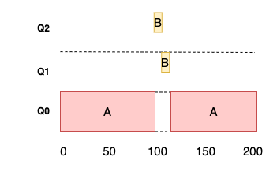

#### 3. 예 3: 입출력 작업에 대해서는 어떻게?
- 타임 슬라이스를 소진하기 전에 프로세스를 양도하면 같은 우선순위를 유지하게 된다
- B는 대화형 작업으로 CPU를 양도하고 A는 긴 배치형 작업으로 B는 계속 같은 우선순위를 유지하게 된다

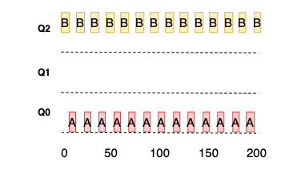

#### 4. MLFQ의 문제점
- 기아 상태가 발생할 수 있다
  - 너무 많은 대화형 작업이 존재하면 모든 CPU 시간을 소모하게 되어 우선순위가 낮은 프로세스들은 할당받지 못한다
- 똑똑한 사용자라면 스케줄러를 자신에게 유리하게 동작하도록 프로그램을 다시 작성할 수 있다
  - 스케줄러를 속여서 지정된 몫보다 더 많은 시간을 할당하도록 하게 할 수 있다
  - 타임 슬라이스가 끝나기 전에 아무 파일을 대상으로 입출력 요청을 내려 CPU를 양도하는 느낌이다

### 3. 시도 2: 우선순위의 상향 조정
- 이러한 문제점의 간단한 아이디어는 모든 작업의 우선순위를 상향 조정하는 것이다
  - 일정 시간이 지나면, 시스템의 모든 작업을 최상위 큐로 이동시킨다
  - 이러한 규칙은 기아 상태와 대화형 작업이 많더라도 한 번씩은 CPU를 공유받게 된다
- 상향을 위해 필요한 시간을 S값(부두 상수)라고 하는데, 시간을 잘 정해야 된다

### 4. 시도 3: 더 나은 시간 측정
- 또 다른 해결하기 위한 문제점으로는 스케줄러를 자신에게 유리하게 동작시키는 것을 어떻게 막을까? 이다
  - 이 문제의 주범은 타임 스라이스가 끝나기 전에 CPU를 양보하여 우선순위가 유지하는 것 때문이다
  - 여기서 해결책은 MLFQ의 각 단계에서 CPU 총 사용 시간을 측정하는 것이다
  - 현재 단계에서 CPU 사용 시간을 저장하여 모두 소진하면 다음 우선순위 큐로 강등된다

### 5. MLFQ 조정과 다른 쟁점들
- 몇 개의 큐가 존재해야 하는가? 타임 슬라이스의 크기는 얼마로 해야 하는가? 기아를 피하기 위해서 얼마나 자주 우선순위가 상향 조정되어야 하는가? 에 대한 대답을 해야 한다
- Solaris의 MLFA 구현, 감쇠-사용 알고리즘 같은 여러 특성이 있다
- 마지막으로 스케줄러는 다른 여러 기능을 제공한다
  - 일부 스케줄러의 경우 가장 높은 우선순위를 운영체제 작업을 위해 예약해 둔다
  - 일부 시스템은 `nice`명령어를 통해 작업의 우선순위를 높이거나 낮출 수 있고, 실행 순서도 바꿀 수 있다
- Unix, Solaris, Windows 등 여러 시스템이 기본 스케줄러로 MLFQ를 사용한다

## 12. 스케줄링: 비례 배분
- 비례 배분 스케줄러 혹은 공정 배분이라 불린다
- 반환 시간이나 응답 시간을 최적화하는 대신 스케줄러가 각 작업에게 CPU의 일정 비율을 보장하는 것이 목적이다
- 대표적인 예로 추첨 스케줄링이 있고, 이는 다음 실행될 프로세스를 추첨을 통해 결정한다

### 1. 기본 개념: 추첨권이 당신의 몫을 나타낸다
- 추첨권(티켓)이라는 개념이 추첨 스케줄링의 근간을 이룬다
  - 추첨권은 프로세스가 받아야 할 자원의 몫을 나타내는 데 사용한다
  - A는 75장의 추첨권을, B는 25장의 추첨권을 가지고 있을 때 무작위로 선택하여 실행한다

### 2. 추첨 기법
- 추첨권을 다루는 기법에는 다양하게 있고 그 중 한가지로 추첨권 화폐의 개념이다
  - 자신의 화폐 가치로 추첨권을 자유롭게 할당하지만, 시스템적으로 화폐 가치를 변환한다
- 다른 기법으로는 추첨권 양도가 있다
  - 양도를 통하여 일시적으로 추첨권을 다른 프로세스에게 넘겨줄 수 있다
  - 자신을 대신해 특정 작업을 해달라고 요청하고, 요청을 완수하면 서버 추첨권을 다시 클라이언트에게 되돌려 준다
- 마지막으로 추첨권 팽창이 있다
  - 일시적으로 자신이 소유한 추첨권의 수를 늘리거나 줄일 수 있다
  - 화폐 팽창 기법은 프로세스들이 서로 신뢰할 때 유용한다

### 3. 구현
- 구현이 단순하다는 것이 가장 큰 장점이다
  - 난수 발생기와 프로세스의 집합, 추첨권의 전체 개수만으로 구현이 가능하다

### 5. 추첨권 배분 방식
- 몇 개의 추천권을 분배해야 되는지가 문제점이다
- 한 가지 접근 방식은 사용자가 가장 잘 알고 있다고 가정 하는 것이다
  - 각 사용자에게 추첨권을 나누어 준 후 알아서 작업들에게 배분하는 것이다
- 하지만 이건 해결책이 아니고 `추첨권 할당 문제`는 여전히 미해결 문제이다

### 6. 왜 결정론적 방법을 사용하지 않는가
- 무작위성을 이용하면 단순하면서 어느정도 정확하게 만들 수 있지만 정확한 비율을 보장할 수 없다
  - 짧은 기간만 실행하는 경우는 더 그렇기 때문에 결정론적 공정 배분 스케줄러인 `보폭 스케줄링`을 고안했다
- 보폭 스케줄링은 각 작업은 보폭을 가지고 있고, 자신이 가지고 있는 추첨권 수에 반비례하는 값이다
  - A, B, C가 100, 50, 250의 추첨권을 가지고 있을 때 10,000을 각자의 추첨권 개수로 나누면 각 작업의 보폭은 100, 200, 40이 된다
  - 이 값을 보폭이라고 부르며 프로세스가 실행될 때마다 pass라는 값을 보폭만큼 증가시켜 얼마나 CPU를 사용했는지 추적한다
  - 스케줄러는 보폭과 pass값을 사용하여 어느 프로세스를 실행시킬지 겾렁한다
  - 가장 작은 pass 값을 선택하고, 프로세스를 실행시킬 때마다 pass값을 보폭만큼씩 증가시킨다
- 보폭 스케줄링 대신 추첨 스케줄링을 사용하는 이유는 상태 정보가 필요 없기 때문이다
  - 새로운 작업이 오면 pass 값은 얼마를 해야 되는지에 대한 문제점이 생긴다
  - 하지만 추첨 스케줄링은 새 프로세스를 추가할 때, 전체 추첨권의 개수만 갱신하고 스케줄한다
  - 이런 이유로 추첨 스케줄링에서느 새 프로세스를 쉽게 추가할 수 있다

### 7. 요약
- 비례 배분 스케줄링은 CPU 스케줄러로서 널리 사용되고 있지 않다
  - 하지만 추첨권 할달량을 비교적 정확히 결정할 수 있는 환경에서 유용하게 사용된다
  - 예를 들어 가상화 데이터 센터에서 Window 가상 머신에 CPU 1/4을 할당하고 나머지는 Linux 시스템에 할당하고 싶은 경우 효과적이다

## 13. 멀티프로세서 스케줄링 (고급)
- 멀티프로세서는 일반적으로 되었으며 멀티코어 프로세서가 대중화의 근본 원인이다
  - 다중 CPU 시대가 오면서 기존에 하나의 CPU만 사용하던 프로그램을 병렬로 실행되도록 다시 작성해야 했다
  - 보통 쓰레드를 이용하고, 멀티 쓰레드 응용 프로그램은 작업을 여러 CPU에 할당하며, 더 많은 수의 CPU가 주어지면 더 빠르게 실행된다
  - 이렇게 새로이 직면한 문제는 멀티프로세서 스케줄링이다

### 1. 배경: 멀티프로세서 구조
- 단일 CPU 시스템에는 하드웨어 캐시 계층이 존재한다
  - 자주 사용하는 데이터를 캐시에 임시로 가져다 둬서 빠르게 수행한다
  - 캐시는 지역성에 기반한다
  - 지역성에는 시간 지역성과 공간 지역성이 있다
  - 시간 지역성: 데이터에 한 번 접근하면 빠른 시일내에 또 다시 접근한다는 것이다
  - 공간 지역성: 주소 x의 데이터에 접근하면 x 주변 데이터에 접근한다는 것이다 (예로 for-each)
- 이럴 경우 멀티프로세서 시스템에서 캐시를 사용하는 것은 훨씬 복잡한다
  - 메모리에 데이터를 쓰는 것은 시간이 오래걸려서 CPU1에서 주소 A의 값을 변경하더라도 CPU 2에서 값을 가져올 때는 옛날 값을 가져오게 된다
  - 이러한 문제를 캐시 일관성 문제라고 부른다
- 기본적인 해결책은 하드웨어에 의해 제공한다
  - 하드웨어는 메모리 주소를 계속 감시하고, 항상 `제대로`된 상황만 발생하도록 시스템을 관리한다
  - 버스 기반 시스템에서는 `버스 스누핑`이라는 기법을 사용한다
    - 캐시는 자신과 메모리를 연결하는 버스의 통신 상황을 계속 모니터링한다
    - 캐시 데이터에 대한 변경이 발생하면, 자신의 복사본을 무효화하거나 갱신한다

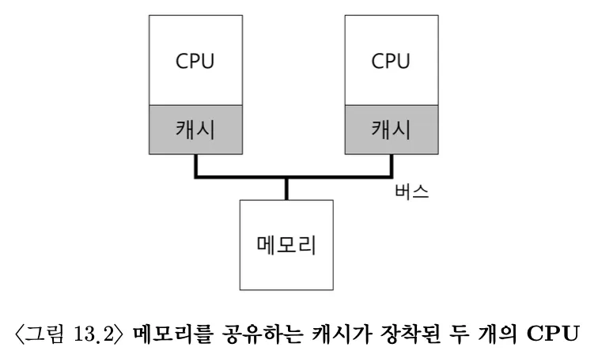

### 2. 동기화를 잊지 마시오
- CPU들이 동일한 데이터에 접근할 때 올바른 값을 보장하기 위해 락 같은 `상호 배제`를 보장하는 동기화 기법이 많이 사용된다
  - 락-프리 데이터 구조 등의 다른 방식은 복잡할 뿐만 아니라 특별한 경우에만 사용된다
  - 캐시의 일관성을 보장하는 프로토콜이 있더라도 락 없이는 원자적으로 갱신할 수 없다
- 락의 문제점은 성능 측면에서 CPU의 개수가 증가할수록 연산이 매우 느려지게 된다

### 3. 마지막 문제점: 캐시 친화성
- 멀티프로세서 캐시 스케줄러의 마짐가 문제점은 캐시 친화성이다
- CPU에서 실행될 때 프로세스는 해당 CPU 캐시와 TLB에 상당한 양의 상태 정보를 올려 놓게 된다
  - 캐시에 일부 정보가 있기 때문에 다음 번에 실행될 때 같은 CPU에서 실행되는 것이 더 빨리 실행된다
  - 매번 다른 CPU에서 실행되면 필요한 정보를 다시 캐시에 탑재해야 되기 때문에 성능이 더 나빠진다
- 멀티프로세서 스케줄러는 스케줄링 결정을 내릴 때 캐시 친화성을 고려해야 한다

### 4. 단일 큐 스케줄링
- 멀티프로세서 스케줄러의 가장 기본적인 방식은 단일 프로세서의 스케줄링을 그대로 사용하는 것이다
- 이것을 단일 큐 멀티프로세서 스케줄링(SQMS)라고 부른다
  - 단순함이 장점으로 CPU가 2개라면 실행할 작업 두 개를 선택해서 실행한다
  - 다만 명백한 단점이 있다
    - **첫번째**로 확장성으로 스케줄러가 다수의 CPU에서 제대로 동작하기 위해 일정 형태의 락을 삽입한다
    - 락은 SQMS 코드가 단일 큐를 접근할 때(실행시킬 다음 작업을 찾을 때) 옵라른 결과가 나오도록 한다
    - 하지만 락은 성능을 크게 저하시킬 수 있고, CPU 개수가 증가할 수록 더욱 그렇다
    - **두번째**는 캐시 친화성이다
    - 실행할 작업 5개가 있고, 4개의 프로세서가 있다고 가정한다
    - 각 작업은 CPU를 옮겨 다니기 때문에 **캐시 친화성**관점에서는 잘못된 선택을 하는 것이다
    - 이 문제는 각각 자신의 프로세서로 실행되게 할 수 있지만 구현이 복잡해질 수 있다
- 기존 단일 CPU 스케줄러는 하나의 큐밖에 없기 때문에 구현이 간단하지만, 동기화 오버헤드 떄문에 확장성이 좋지 않고 캐시 친화성에 문제가 있다

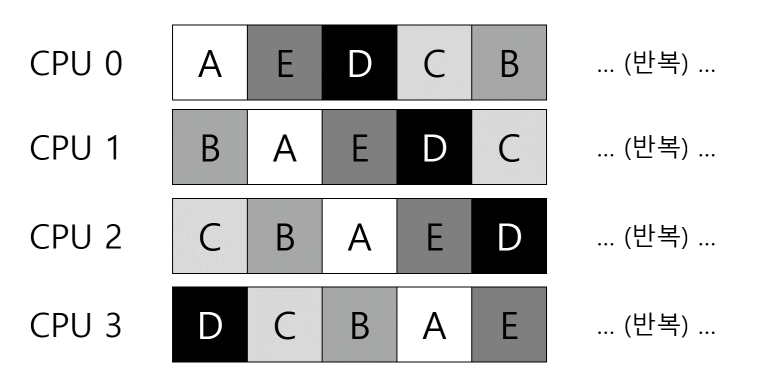

### 5. 멀티 큐 스케줄링
- CPU마다 큐를 두는 방식을 멀티 큐 프로세서 스케줄링(MQMS)라고 부른다
- 각 큐는 RR 같은 특정 스케줄링 규칙을 따르고, 작업이 시스템에 들어가면 하나의 스케줄링 큐에 배치된다
  - 그 후에는 각각이 독립적으로 스케줄이 되기 때문에 SQMS의 데이터의 공유 및 동기화 문제를 피할 수 있다
- 명확한 장점은 확장성이 좋다는 것이다
  - CPU 개수가 증가할수록 큐의 개수도 증가하기 때문에 락과 캐시 경합이 문제가 되지 않는다
- 다만 근본적인 문제는 워크로드의 불균형이다
  - 하나의 큐에서 모든 걸 처리할수도 있다
  - 하지만 이 문제에 대한 답은 작업을 이리저리로 이동시키는 것이다 (이주(migration))
  - 작업을 한 CPU에서 다른 CPU로 이주킴으로써 워크로드 균형을 달성한다
- 다양한 이주 패턴이 있지만 기본적으로 작업훔치기 방식이 있다
  - 작업 훔치기에서는 작업의 개수가 낮은 큐가 가끔 다른 큐에 훨씬 많은 수의 작업이 있는지 검사한다
  - 대상 큐가 소스 큐보다 더 가득 차 있다면 워크로드 균형을 맞추기 위해서 작업을 가져온다
  - 다만 너무 자주 검사하게 되면 높은 오버헤드로 확장성에 문제가 생기게 된다

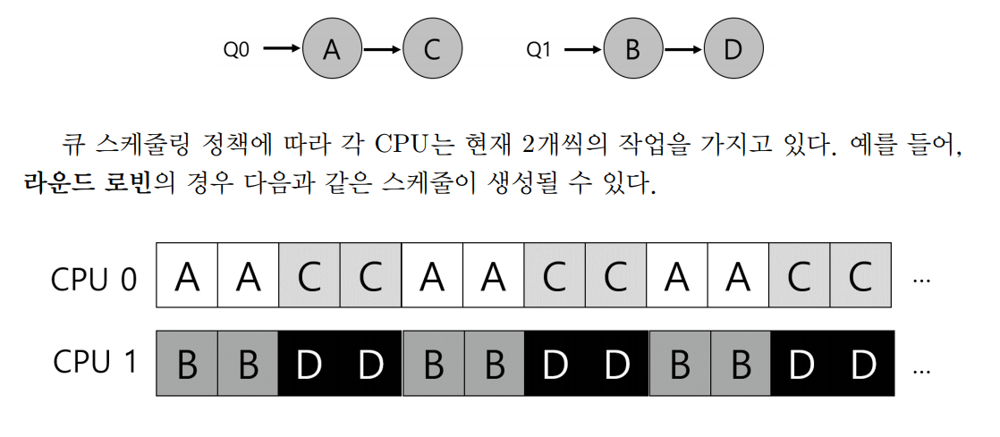

### 6. Linux 멀티프로세서 스케줄러
- Linux에서는 멀티프로세서 스케줄러를 위한 단일화된 방식이 존재하지 않았다
  1. O(1) 스케줄러
     2. 멀티 큐로 우선순위 기반 스케줄러이다. (MLFQ와 유사) 프로세스의 우선순위를 시간에 따라 변경하여 우선순위가 가장 높은 작업을 선택한다
  2. Completely Fair Scheduler(CFS)
     3. 멀티 큐로 결정론적 비례배분 방식이다 (보폭 스케줄링과 유사)
  3. BF 스케줄러(BFS)
     4. 단일 큐 방식으로 또한 비례 배분 방식이다
 
## 16. 주소 공간의 개념
### 1. 초기 시스템
- 메모리 관점에서 초기 컴퓨터는 많은 개념을 제공하지 않았다
- 운영체제는 메모리에 상주하는 루틴의 집합이었다.
  - 물리 메모리에 하나의 프로세스가 존재했고 나머지 메모리를 사용했다

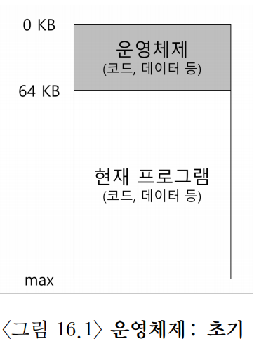

### 2. 멀티프로그램과 시분할
- 멀티프로그래밍 시대가 도래하면서 여러 프로세스가 실행 준비 상태에 있고 그들을 전화하면서 실행했다
  - 이러한 전환은 CPU 이용률을 증가시키고 효율성을 개선했다
- 사람들이 컴퓨터를 더 많이 사용하기 원하면서 시분할 시대가 시작되었다
  - 일괄처리방식의 한계를 인식했으며, 현재 실행 중인 작업으로부터 즉시 응답을 원하는 대화식 이용의 개념이 중요하게 되었다
  - 시분할을 구현하는 한 가지는 하나의 프로세스를 짧은 시간 동안 실행시키고 모든 메모리에 접근할 권한이 주어진다
  - 그런 후에 이 프로세스를 중단하고, 중단 시점의 모든 상태를 디스크 종류의 장치에 저장하고 다른 프로세스 상태를 탑재하여 실행시킨다
  - 문제점으로는 메모리가 커질수록 느리게 되었고, 해결책으로는 프로세스 전환 시 프로세스를 메모리에 그대로 유지하면서, 운영체제가 시분할 시스템을 효율적으로 구현할 수 있게 하는 것이다
  - 세 개의 프로세스(A, B, C)가 각기 작은 부분을 할당받고, 사용할 때 자신의 영역에서 실행한다
  - 여러 프로그램이 메모리에 동시에 존재하려면 **보호**가 중요한 문제가 된다
  - 한 프로세스가 다른 프로세스의 메모리를 읽는 상황이 생겨서는 안된다

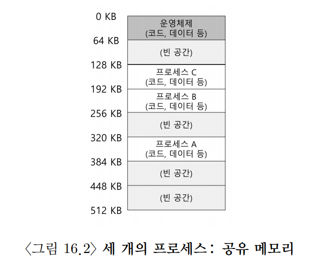

### 3. 주소 공간
- 이런 위험한 행동을 하는 사용자를 염두에 두어야 한다
  - 그런 위험에 대비하여 운영체제는 사용하기 쉬운 메모리 개념을 만들어야 한다
  - 이 개념이 주소 공간이다
  - 실행 중인 프로그램이 가정하는 메모리의 모습이다
- 주소 공간은 실행 프로그램의 모든 메모리 상태를 갖고 있다
- 실제로 프로그램이 물리 주소 0에서 16KB사이에 존재하는 것이 아니다
  - 실제로는 임의의 물리 주소에 탑재하고, 운영체제가 메모리를 가상화한다
  - 실제 실행 중인 프로그램은 자신이 특정 주소의 메모리에 탑재되고 매우 큰 주소 공간을 가지고 있다고 생각하기 때문이다
  - 하지만 가장주소를 이용해 물리 주소 0이 아닌 물리 주소 320KB를 읽도록 보장해야 한다 

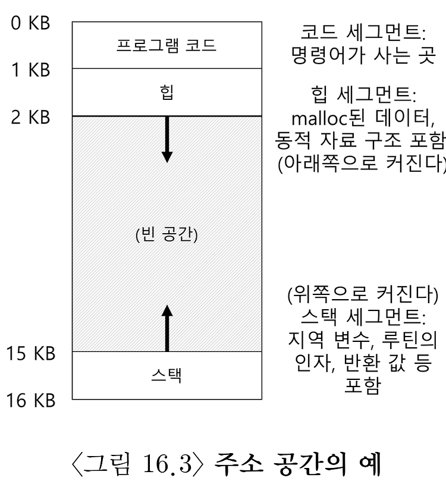

>#### 고립의 원칙
> - 고칩은 신뢰할 수 있는 시스템을 구축하는 데 중요한 원칙이다 
> - 운영체제는 프로세스를 서로 고립시키기 위해 노력하고 다른 프로세스에게 피해 주는 것을 방지한다 
> - 나아가 메모리 고립을 사용하여 프로그램이 운영체제 동작에 영향을 줄 수 없다는 것을 보장한다

- 가상 메모리 시스템(VM)의 주요 목표 중 하나는 투명성이다
  - 운영체제는 프로세스가 가상 메모리의 존재를 인지하지 못하도록 구현해야 한다
  - 프로그램은 메모리가 가상화되었다는 사실을 인지해서는 안되고 전용 물리 메모리를 소유하는 것처럼 행동해야 한다
- 또 다른 목표는 효율성이다
  - 프로그램이 너무 느리게 실행되서는 안되고, 공간적으로 가상화를 지원하기 위해 너무 많은 메모리를 사용해서는 안된다
  - 시간-효율적인 가상화를 구현할 때 운영체제는 TLB 등의 하드웨어 기능을 포함하여 지원을 받아야 한다
- 마지막으로 세 번째 목표는 보호이다
  - 운영체제는 프로세스를 다른 프로세스로부터 보호해야하고, 운영체제 자신도 보호해야 한다
  - 어떤 방법으로든 다른 프로세스의 메모리 내용에 접근하거나 영향을 줄 수 있어서도 안된다

## 17. 막간: 메모리 관리 API
### 1. 메모리 공간의 종류
- C 프로그램이 실행되면 두 가지 유형의 메모리 공간이 할당된다
  - 스택: 할당과 반환은 프로그래머를 위해 컴파일러에 의해 암묵적으로 이뤄진다. 이러한 이유로 자동 메모리라고 불린다
    - `int x;`라고 선언하는 것만으로 스택에 공간을 확보한다
  - 힙: 오래 유지되어야 하는 값을 위해 사용된다
    - 모든 할당과 반환이 프로그래머에 의해 명시적으로 처리된다
    - `int *x = (int *) malloc(sizeof(int));`
    - 위 코드는 스택과 힙 할당이 모두 발생한다
    - 변수 선언이 스택을 사용한다면 malloc()으로 정수의 주소를 반환하여, 그 반환된 주소는 스택에 저장되어 프로그램에 의해 사용된다