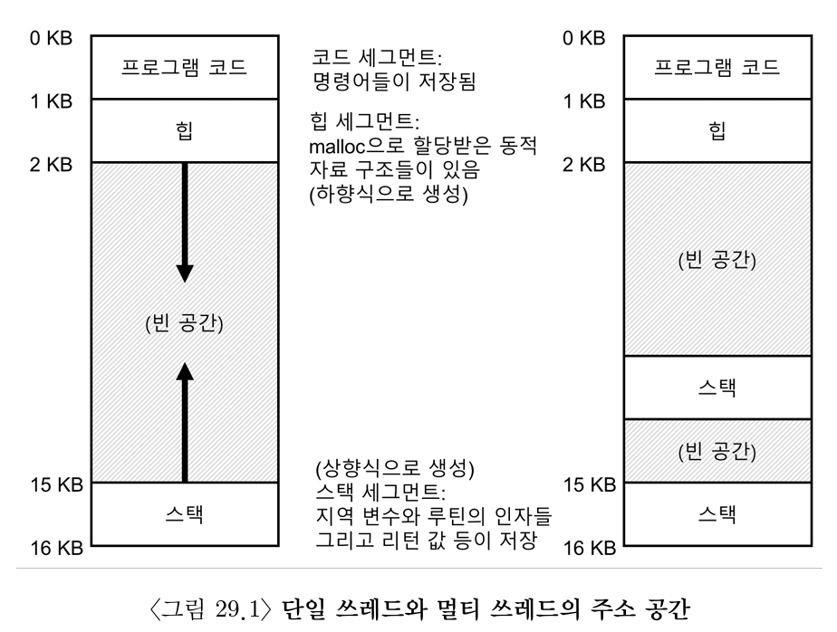
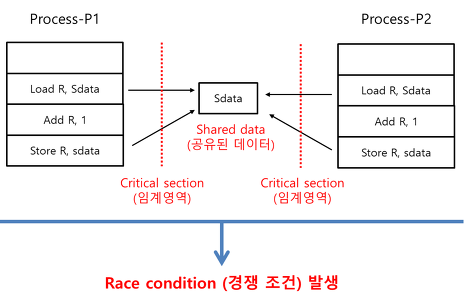
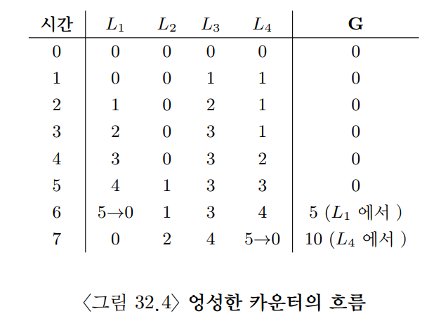
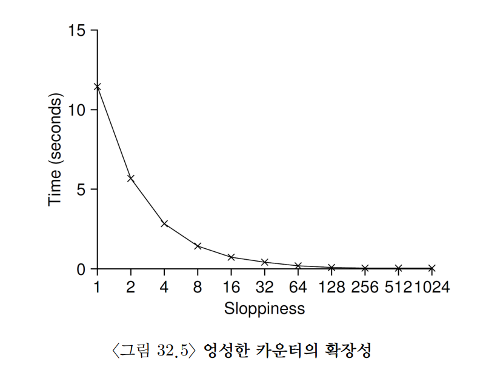

## 29. 병행성: 개요
- 하나의 프로세스에 하나 이상의 쓰레드가 있다
  - 쓰레드와 프로세스의 차이점은 쓰레드들은 주소 공간을 공유하기 때문에 동일한 값에 접근할 수 있다
- 하나의 쓰레드 상태는 프로세스의 상태와 매우 유사하다
  - 쓰레드는 프로그램 카운터(PC)와 연산을 위한 레지스터를 가지고 있다
- 만약 두 개의 쓰레드가 하나의 프로세서에서 실행 중이라면 실행하고자 하는 쓰레드(T2)는 반드시 Context Switching을 해야한다
  - 프로세스가 PCB에 저장하듯이 쓰레드도 쓰레드 제어 블럭(TCB)에 저장한다
  - 하지만 프로세스와 달리 쓰레드 간 Context Switching은 주소 공간을 그대로 사용한다
- 아래 그림과 같이 두 개의 쓰레드를 가지는 멀티 쓰레드 프로세스의 주소 공간은 단일 쓰레드 프로세스의 주소 공간과 다르다
  - 멀티쓰레드 프로세스에서는 각 쓰레드가 독립적인 스택을 가진다.
  - 코드, 힙, 데이터 영역은 쓰레드들이 공유한다.
  - 또한 각 쓰레드는 필요에 따라 Thread-Local Storage(TLS)를 가질 수 있다.




### 1. 예제: 쓰레드 생성
- 생성된 쓰레드는 호출한 쓰레드와 독립적으로 실행된다
- 쓰레드 생성 함수가 리턴되기 전에 새 쓰레드가 먼저 실행될 수도 있고, 이후에 실행될 수도 있다
- 어떤 쓰레드가 먼저 실행될지는 스케줄러의 결정에 따라 달라진다

### 2. 훨씬 더 어려운 경우: 데이터 공유
- 아래코드는 2,000이 되지 않는다

```java
public class Main {

    static int counter = 0;

    public static void main(String[] args) throws Exception {

        ExecutorService pool = Executors.newFixedThreadPool(2);

        Runnable task = () -> {
            for (int i = 0; i < 10_000_000; i++) {
                counter++;
            }
        };

        pool.execute(task);
        pool.execute(task);

        pool.shutdown();
        pool.awaitTermination(1, TimeUnit.MINUTES);

        System.out.println(counter);
    }
}
```

### 3. 제어 없는 스케줄링
- `counter++`처럼 단순해 보이는 코드도 실제로는 여러 단계로 실행된다.

```text
1. 메모리에서 counter 값을 읽는다.
2. 읽어 온 값에 1을 더한다.
3. 계산한 값을 다시 메모리에 저장한다.
```

- 문제는 이 세 단계가 한 번에 실행되는 것이 아니라는 점이다.
  - 값을 읽은 직후 컨텍스트 스위치가 발생할 수 있다.
  - 현재 쓰레드의 상태는 TCB에 저장되고, 다른 쓰레드가 실행된다.
  - 다른 쓰레드도 같은 값을 읽으면 두 쓰레드가 같은 값을 기준으로 계산하게 된다.
- 이처럼 실행 순서에 따라 결과가 달라지는 상황을 `경쟁 조건(race condition)`이라고 한다.
  - 경쟁 조건이 있으면 같은 프로그램을 실행해도 매번 다른 결과가 나올 수 있다.
- 경쟁 조건이 발생할 수 있는 코드 영역을 `임계 영역(critical section)`이라고 한다.
  - 여러 쓰레드가 동시에 실행하면 안 되는 코드이다.
  - 대표적으로 공유 변수, 파일 시스템 메타데이터, 커널 자료 구조를 수정하는 코드가 해당된다.
- 임계 영역을 안전하게 다루기 위해서는 `상호 배제(mutual exclusion)`가 필요하다.
  - 한 쓰레드가 임계 영역을 실행 중일 때는 다른 쓰레드가 들어오지 못하게 막아야 한다.



### 4. 원자성에 대한 바람
- 임계 영역 문제를 가장 단순하게 해결하는 방법은 여러 단계를 하나의 명령처럼 실행하는 것이다.
  - 중간에 인터럽트나 컨텍스트 스위치가 끼어들 수 없다면 경쟁 조건도 발생하지 않는다.
- 이렇게 더 이상 쪼갤 수 없는 하나의 동작처럼 실행되는 성질을 `원자성(atomicity)`이라고 한다.
- 하지만 모든 복잡한 연산을 하드웨어 명령어 하나로 만드는 것은 현실적이지 않다.
  - 대신 하드웨어는 동기화 구현에 필요한 기본 명령어를 제공한다.
  - 운영체제와 라이브러리는 이 명령어를 이용해 락(lock), 세마포어(semaphore) 같은 동기화 도구를 만든다.
- 결과적으로 멀티 쓰레드 프로그램은 하드웨어 지원과 운영체제의 도움을 받아 임계 영역에 한 번에 하나의 쓰레드만 들어가도록 만들 수 있다.

### 5. 또 다른 문제: 상대 기다리기
- 병행성에서 필요한 것은 상호 배제만이 아니다.
- 어떤 쓰레드는 다른 쓰레드가 특정 작업을 끝낼 때까지 기다려야 할 수도 있다.
  - 예를 들어 한 쓰레드가 I/O 요청을 보낸 뒤 응답이 올 때까지 기다리는 경우가 있다.
  - 이때 계속 CPU를 사용하며 기다리면 낭비가 크다.
- 따라서 운영체제는 쓰레드를 잠들게 하고, 조건이 만족되면 다시 깨우는 기법을 제공해야 한다.
  - 이를 통해 불필요한 CPU 사용을 줄이고, 필요한 시점에만 실행을 재개할 수 있다.

### 6. 정리: 왜 운영체제에서?
- 병행성 문제는 운영체제에서 특히 중요하다.
  - 운영체제는 오래전부터 여러 작업을 동시에 다루는 대표적인 병행 프로그램이었다.
  - 이후 멀티 쓰레드 프로그램이 일반화되면서 응용 프로그램도 같은 문제를 다루게 되었다.
- 예를 들어 두 프로세스가 같은 파일에 동시에 `write()`를 호출한다고 해 보자.
  - 두 프로세스 모두 파일 끝에 데이터를 덧붙이려 한다.
  - 파일 크기가 늘어나면 새로운 블록을 할당해야 한다.
  - inode에는 새 블록의 위치와 변경된 파일 크기가 기록되어야 한다.
- 이 과정에서 두 프로세스가 동시에 파일 시스템 자료 구조를 수정하면 데이터가 꼬일 수 있다.
  - 따라서 inode, 블록 할당 정보처럼 공유되는 커널 자료 구조를 갱신하는 코드는 임계 영역으로 다루어야 한다.
- 운영체제 내부에는 이런 공유 자료 구조가 많다.
  - 페이지 테이블
  - 프로세스 리스트
  - 파일 시스템 메타데이터
  - 각종 커널 큐와 캐시
- 결론적으로 운영체제가 올바르게 동작하려면 적절한 동기화 기법으로 공유 자료 구조를 조심스럽게 보호해야 한다.

## 31. 락
- 임계 영역을 락으로 둘러서 그 임계 영역이 마치 하나의 원자 단위 명령어인 것처럼 실행되도록 한다

### 1. 락: 기본 개념
- 락(lock)은 임계 영역에 한 번에 하나의 쓰레드만 들어가도록 만드는 동기화 도구이다.
- 쓰레드는 `lock()`을 호출하여 락 획득을 시도한다.
  - 아무 쓰레드도 락을 가지고 있지 않으면 락을 획득하고 임계 영역에 진입한다.
  - 락을 획득한 쓰레드를 `락 소유자(owner)`라고 한다.
- 이미 다른 쓰레드가 락을 가지고 있다면, 새로 `lock()`을 호출한 쓰레드는 락이 풀릴 때까지 기다린다.
  - 이 동안 `lock()`은 바로 리턴하지 않는다.
  - 따라서 기다리는 쓰레드는 임계 영역에 들어가지 못한다.
- 락 소유자가 임계 영역 실행을 끝내면 `unlock()`을 호출한다.
  - 그러면 락은 다시 사용 가능한 상태가 된다.
  - 대기 중인 쓰레드가 있다면 그중 하나가 락을 획득하고 임계 영역에 들어갈 수 있다.
  - 대기 중인 쓰레드가 없다면 락은 사용 가능한 상태로 남아 있다.

- 락은 프로그래머에게 스케줄링에 대한 최소한의 제어권을 제공한다.
  - 일반적으로 쓰레드는 프로그래머가 생성하지만, 실제 실행 순서는 운영체제가 결정한다.
  - 프로그래머는 락을 사용해 특정 코드 구간만큼은 동시에 실행되지 않도록 제한할 수 있다.
  - 즉, 락으로 감싼 코드에서는 한 번에 하나의 쓰레드만 동작하도록 보장한다.

```java
private static final Lock mutex = new ReentrantLock();

mutex.lock();
try {
    balance = balance + 1;
} finally {
    mutex.unlock();
}
```

### 2. PThread락
- 쓰레드 간에 상호 배제 기능을 제공하기 위해 POSIX 라이브러리 락을 `mutex`라고 부른다
  - 다른 쓰레드가 임계 영역에 들어올 수 없도록 제한한다고 해서 얻은 이름이다
    - POSIX 방식에서는 변수명을 지정하여 락과 언락 함수에 전달하고 있다.

### 3. 락 구현
- 사용 가능한 락을 만들기 위해서 하드웨어와 운영체제의 도움을 받아야 한다

### 4. 락의 평가
- 어떤 락을 만들기 전에 목표를 이해해야 하고 구현의 효율을 어떻게 평가할지 질문해야 한다
- 락이 동작하는지 평가하기 위해서 먼저 기준을 정해야 한다
  - 첫째는 상호 배제를 제대로 지원하는가이다.
  - 둘째는 공정성이다
    - 쓰레드들이 락 획득에 대한 공정한 기회가 주어지는가?
    - 락을 전혀 얻지 못해 기아상태가 발생하는가?
  - 마짐가 기준은 성능이다
    - 락 사용 시간적 오버헤드를 평가해야 한다
    - 이 주제에 대해서 고려해야 할 몇 가지 사항이 있다
    - 하나는 경쟁이 전혀 없는 경우 성능이다
    - 다음은 여러 쓰레드가 단일 CPU사에서 락을 획득하려고 경쟁할 때의 성능이다

### 5. 인터럽트 제어
- 초기 단일 프로세스 시스템에서는 임계 영역 내에서는 인터럽트를 비활성화하는 방법을 사용했었다
  - 임계 영역 내의 코드에서는 인터럽트가 발생할 수 없기 때문에 원자적으로 실행될 수 있다
  - 장점은 단순하다는 점이다
  - 단점은 많다
    - 이 요청을 하는 쓰레드가 인터럽트를 활성/비활성하는 특권 연산을 실행할 수 있도록 허가해야 한다
    - 또 이를 다른 목적으로 사용하지 않음을 신뢰할 수 있어야 한다
    - 운영체제가 잘 알지 못하는 다른 프로그램을 신뢰해야 하는 경우가 생긴다면 대부분 곤경에 빠진 것이라고 보면 된다
    - 탐욕적(greedy)기법을 사용한 프로그램이 시작과 동시에 `lock()`을 호출하여 프로세서를 독점하여 사용할 수도 있다
    - 더한 경우라면 오류가 있거나 악의적인 프로그램이 `lock()`을 호출하고 무한 반복문에 들어갈 수도 있다
    - 두 번째 단점은 멀티프로세서에서는 적용을 할 수가 없다는 것이다
      - 여러 쓰레드가 여러 CPU에서 실행 중이라면 각 쓰레드가 동일한 임계 영역을 진입하려고 시도할 수 있다
      - 이때에 특정 프로세서에서의 인터럽트 비활성화는 전혀 영향을 주지 않는다
    - 세 번째 단점은 장시간 동안 인터럽트를 중지시키는 것은 중요한 인터럽트의 시점을 놓칠 수 있다는 점이다
    - 예를 들어 CPU가 저장장치에서 읽기 요청을 마친 사시을 모르고 지나갔다고 하면 운영체제가 이 읽기 결과를 기다리는 프로세스를 언제 깨울 수 있을까?
    - 마지막 비효율적이다.
  - 위의 이유로 상호 배제를 위하여 인터럽트를 비활성화하는 것은 제한된 범위에서만 사용되어야 한다

### 6. Test-And-Set
- 멀티프로세서에서는 인터럽트를 끄는 방식만으로 상호 배제를 보장할 수 없다.
  - 한 CPU에서 인터럽트를 꺼도 다른 CPU의 쓰레드는 계속 실행될 수 있기 때문이다.
  - 그래서 하드웨어는 락 구현에 필요한 원자적 명령어를 제공한다.
- 가장 기본적인 원자 명령어가 `Test-And-Set`이다.
  - 현재 값을 읽는다.
  - 동시에 그 값을 새로운 값으로 바꾼다.
  - 이 두 동작이 중간에 끊기지 않는 하나의 원자적 연산으로 실행된다.
- 먼저 하드웨어 지원 없이 플래그만 사용하는 잘못된 락을 보자.
  - `flag == 0`인지 검사하는 동작과 `flag = 1`로 바꾸는 동작이 분리되어 있다.
  - 그 사이에 컨텍스트 스위치가 발생하면 두 쓰레드가 모두 락을 얻었다고 착각할 수 있다.
  - 따라서 이 코드는 상호 배제를 보장하지 못한다.

```java
class BadSpinLock {
    // 0: 락 사용 가능
    // 1: 락 사용 중
    private volatile int flag = 0;

    public void lock() {
        while (flag == 1) {
            Thread.onSpinWait();
        }

        // 검사와 대입이 원자적으로 묶여 있지 않다.
        flag = 1;
    }

    public void unlock() {
        flag = 0;
    }
}
```

### 7. 진짜 돌아가는 스핀 락의 구현
- 실제 스핀 락은 검사와 대입을 원자적으로 묶어야 한다.
- Java에서는 `AtomicInteger.getAndSet()`을 이용해 `Test-And-Set`과 같은 동작을 표현할 수 있다.
  - `getAndSet(1)`은 이전 값을 반환하고, 값을 `1`로 바꾼다.
  - 이전 값이 `0`이면 락이 비어 있었다는 뜻이므로 락 획득에 성공한다.
  - 이전 값이 `1`이면 이미 다른 쓰레드가 락을 보유 중이므로 계속 회전한다.
- 이 방식은 상호 배제를 보장하지만, 기다리는 동안 CPU를 계속 사용한다.
  - 이런 대기 방식을 `스핀 대기(spin-wait)` 또는 `busy waiting`이라고 한다.

```java
import AtomicInteger;

class SpinLock {
    // 0: 락 사용 가능
    // 1: 락 사용 중
    private final AtomicInteger flag = new AtomicInteger(0);

    public void lock() {
        while (flag.getAndSet(1) == 1) {
            Thread.onSpinWait();
        }
    }

    public void unlock() {
        flag.set(0);
    }
}
```

```java
static int testAndSet(AtomicInteger value, int newValue) {
    int old = value.getAndSet(newValue);
    return old;
}
```

### 8. 스핀 락 평가
- 스핀 락을 평가할 때는 세 가지를 본다.
- 첫째, `정확성`이다.
  - 원자 명령어를 사용한 스핀 락은 한 번에 하나의 쓰레드만 임계 영역에 들어가게 하므로 상호 배제를 만족한다.
- 둘째, `공정성`이다.
  - 단순 스핀 락은 어떤 쓰레드가 다음에 락을 얻을지 보장하지 않는다.
  - 운이 나쁜 쓰레드는 계속 밀려나 기아 상태에 빠질 수 있다.
- 셋째, `성능`이다.
  - 단일 CPU에서는 락을 기다리는 쓰레드가 CPU를 낭비하므로 성능이 나쁘다.
  - 멀티 CPU에서는 락을 가진 쓰레드가 다른 CPU에서 곧 실행을 끝낼 수 있으므로, 짧은 임계 영역에서는 꽤 합리적으로 동작할 수 있다.

### 9. Compare-And-Swap
- `Compare-And-Swap(CAS)`도 대표적인 원자 명령어이다.
- CAS는 메모리의 현재 값이 기대한 값과 같은지 비교한다.
  - 같으면 새로운 값으로 바꾼다.
  - 다르면 아무 것도 바꾸지 않는다.
  - 그리고 비교 당시의 실제 값을 반환하거나, 교체 성공 여부를 알려준다.
- CAS를 사용해도 스핀 락을 만들 수 있다.
  - `flag`가 `0`일 때만 `1`로 바꾸면 락 획득에 성공한 것이다.
  - `flag`가 이미 `1`이면 다른 쓰레드가 락을 가지고 있으므로 계속 기다린다.
- CAS는 단순 락뿐 아니라 lock-free 자료 구조를 만드는 데도 사용되므로 `Test-And-Set`보다 더 범용적이다.

```java
import AtomicInteger;

class CASLock {
    private final AtomicInteger flag = new AtomicInteger(0);

    public void lock() {
        while (!flag.compareAndSet(0, 1)) {
            Thread.onSpinWait();
        }
    }

    public void unlock() {
        flag.set(0);
    }
}
```

### 10. Load-Linked 그리고 Store-Conditional
- 일부 CPU는 CAS 대신 `Load-Linked(LL)`와 `Store-Conditional(SC)`이라는 명령어 쌍을 제공한다.
- `Load-Linked`는 특정 주소의 값을 읽으면서 그 주소를 감시 대상으로 표시한다.
- `Store-Conditional`은 그 주소가 중간에 다른 쓰레드에 의해 변경되지 않았을 때만 저장에 성공한다.
  - 성공하면 값을 저장하고 `true`를 반환한다.
  - 실패하면 값을 저장하지 않고 `false`를 반환한다.
- Java는 LL/SC 명령어를 직접 노출하지 않는다.
  - 아래 코드는 실제로 실행하기 위한 코드가 아니라, LL/SC의 동작을 Java 문법에 가깝게 표현한 의사 코드이다.
  - 실제 Java 코드에서는 보통 `AtomicInteger.compareAndSet()` 같은 CAS 계열 API를 사용한다.

```java
class LLScStyleLock {
    private int flag = 0;

    public void lock() {
        while (true) {
            int value = loadLinked();

            if (value == 0 && storeConditional(1)) {
                return;
            }

            Thread.onSpinWait();
        }
    }

    public void unlock() {
        flag = 0;
    }

    private int loadLinked() {
        // CPU의 Load-Linked 명령어라고 가정한다.
        return flag;
    }

    private boolean storeConditional(int newValue) {
        // CPU의 Store-Conditional 명령어라고 가정한다.
        // loadLinked() 이후 flag가 바뀌지 않았을 때만 저장에 성공한다.
        flag = newValue;
        return true;
    }
}
```

### 11. Fetch-And-Add
- `Fetch-And-Add`는 특정 주소의 예전 값을 반환하고, 그 값을 증가시키는 원자 명령어이다.
- 이 명령어를 사용하면 `티켓 락(ticket lock)`을 만들 수 있다.
  - `ticket`은 새로 도착한 쓰레드에게 번호표를 나눠 주는 변수이다.
  - `turn`은 지금 입장할 차례를 나타내는 변수이다.
  - 쓰레드는 자기 번호표와 현재 차례가 같아질 때까지 기다린다.
- 티켓 락의 장점은 공정성이다.
  - 먼저 온 쓰레드가 먼저 임계 영역에 들어간다.
  - 단순 스핀 락에서 발생할 수 있는 기아 문제를 줄일 수 있다.

```java
import AtomicInteger;

class TicketLock {
    private final AtomicInteger ticket = new AtomicInteger(0);
    private final AtomicInteger turn = new AtomicInteger(0);

    public void lock() {
        int myTurn = ticket.getAndIncrement();

        while (turn.get() != myTurn) {
            Thread.onSpinWait();
        }
    }

    public void unlock() {
        turn.incrementAndGet();
    }
}
```

### 12. 요약: 과도한 스핀
- 하드웨어 원자 명령어를 사용하면 올바른 락을 만들 수 있다.
- 하지만 단순한 스핀 락은 락을 기다리는 동안 CPU를 계속 소모한다.
  - 락이 아주 짧게 잡히는 경우에는 괜찮을 수 있다.
  - 락이 오래 잡히거나 경쟁하는 쓰레드가 많으면 낭비가 커진다.
- 따라서 좋은 락 구현은 하드웨어 원자 명령어뿐 아니라 운영체제의 도움도 함께 사용한다.

### 13. 간단한 접근법: 무조건 양보
- 스핀으로 CPU를 계속 태우는 대신, 락을 얻지 못하면 CPU를 양보할 수 있다.
- Java에서는 `Thread.yield()`로 현재 쓰레드가 CPU 사용을 양보하겠다는 힌트를 줄 수 있다.
  - 정확히 어떤 쓰레드가 다음에 실행될지는 스케줄러가 결정한다.
  - 따라서 `yield()`는 강제 동작이 아니라 힌트에 가깝다.
- 이 방식은 계속 회전하는 스핀 락보다 나을 수 있지만 한계가 있다.
  - 경쟁하는 쓰레드가 많으면 많은 쓰레드가 반복해서 양보만 하게 된다.
  - 어떤 쓰레드는 계속 락을 얻지 못하는 기아 상태에 빠질 수 있다.

### 14. 큐의 사용: 스핀 대신 잠자기
- 더 좋은 방법은 락을 얻지 못한 쓰레드를 큐에 넣고 잠재우는 것이다.
  - 기다리는 쓰레드는 CPU를 소모하지 않는다.
  - 락이 해제되면 큐에서 다음 쓰레드를 깨운다.
  - 큐를 사용하면 다음에 깨울 쓰레드를 제어할 수 있으므로 기아 문제도 줄일 수 있다.
- 이 방식에는 두 가지 동작이 필요하다.
  - `park()`는 현재 쓰레드를 잠재운다.
  - `unpark(thread)`는 특정 쓰레드를 깨운다.
- Java에서는 `LockSupport.park()`와 `LockSupport.unpark(thread)`로 이 개념을 표현할 수 있다.
  - 아래 코드는 개념을 보여 주기 위한 단순화된 예제이다.
  - 실제 라이브러리 락은 인터럽트, 예외, 가짜 깨움(spurious wakeup)까지 더 꼼꼼하게 처리한다.
- 주의할 점은 `park()` 직전의 경쟁 조건이다.
  - 쓰레드 A가 큐에 들어간 뒤 잠들기 직전이라고 하자.
  - 그 순간 락 소유자가 A를 깨우려고 `unpark(A)`를 먼저 호출할 수 있다.
  - 이후 A가 `park()`를 호출하면 이미 깨움 신호를 놓친 것처럼 보일 수 있다.
  - 이런 문제를 `깨우기/대기 경쟁`이라고 한다.
- 실제 운영체제와 런타임은 이런 경쟁을 피하기 위해 `setpark()` 같은 추가 기법이나, `park/unpark`의 허가(permit) 모델을 사용한다.

```java
import java.util.ArrayDeque;
import java.util.Queue;
import java.util.concurrent.atomic.AtomicInteger;
import java.util.concurrent.locks.LockSupport;

class QueueLock {
    private boolean locked = false;
    private final AtomicInteger guard = new AtomicInteger(0);
    private final Queue<Thread> waiting = new ArrayDeque<>();

    public void lock() {
        while (guard.getAndSet(1) == 1) {
            Thread.onSpinWait();
        }

        if (!locked) {
            locked = true;
            guard.set(0);
            return;
        }

        Thread current = Thread.currentThread();
        waiting.add(current);
        guard.set(0);

        LockSupport.park();
    }

    public void unlock() {
        while (guard.getAndSet(1) == 1) {
            Thread.onSpinWait();
        }

        if (waiting.isEmpty()) {
            locked = false;
        } else {
            Thread next = waiting.remove();
            LockSupport.unpark(next);
            // locked는 true로 둔다. 깨어난 쓰레드에게 락을 넘긴다는 의미이다.
        }

        guard.set(0);
    }
}
```

### 15. 다른 운영체제, 다른 지원
- Linux는 `futex`를 사용해 사용자 영역 락과 커널 대기 큐를 함께 활용한다.
- futex의 핵심 아이디어는 빠른 경우에는 커널에 들어가지 않는 것이다.
  - 락을 바로 얻을 수 있으면 사용자 영역의 원자 연산만으로 처리한다.
  - 락을 얻지 못해 잠들어야 할 때만 커널의 도움을 받는다.
- 대표적인 futex 동작은 두 가지이다.
  - `futex_wait(address, expected)`: `address`의 값이 `expected`와 같으면 현재 쓰레드를 잠재운다.
  - `futex_wake(address)`: 해당 주소의 대기 큐에서 쓰레드 하나를 깨운다.
- Linux의 NPTL 쓰레드 라이브러리는 이런 futex를 이용해 효율적인 mutex를 구현한다.
  - 하나의 정수 값으로 락 상태와 대기자 존재 여부를 함께 표현한다.
  - 경쟁이 없으면 빠르게 처리하고, 경쟁이 심하면 커널 큐에서 잠들게 한다.

### 16. 2단계 락
- 2단계 락은 스핀과 잠자기를 섞은 하이브리드 방식이다.
- 첫 번째 단계에서는 잠깐 스핀한다.
  - 락이 곧 해제될 가능성이 있다면, 잠들었다가 깨어나는 비용보다 짧게 도는 편이 더 싸다.
- 두 번째 단계에서는 잠든다.
  - 정해진 횟수만큼 스핀해도 락을 얻지 못하면 더 기다리지 않고 잠든다.
  - 이후 락이 해제되면 운영체제나 런타임이 쓰레드를 깨운다.
- 즉, 2단계 락은 두 상황을 모두 고려한다.
  - 짧은 대기는 스핀으로 빠르게 처리한다.
  - 긴 대기는 잠들게 해서 CPU 낭비를 줄인다.

## 32. 락 기반의 병행 자료 구조
- 자료 구조에 락을 추가하면 여러 쓰레드가 동시에 사용해도 안전하게 만들 수 있다.
- 이런 자료 구조를 `쓰레드 안전(thread-safe)`하다고 한다.
- 핵심은 락을 단순히 추가하는 것이 아니라, 어디에 어떤 범위로 추가하느냐이다.
  - 락 범위가 너무 넓으면 구현은 쉽지만 병행성이 떨어진다.
  - 락 범위가 너무 좁으면 성능은 좋아질 수 있지만 구현이 복잡해지고 버그가 생기기 쉽다.

### 1. 병행 카운터
- 카운터는 가장 단순한 자료 구조 중 하나이다.
  - 값을 증가시킨다.
  - 값을 감소시킨다.
  - 현재 값을 읽는다.
- 단순하지만 운영체제와 병행 프로그램에서 자주 사용된다.

#### 1. 간단하지만 확장성이 없음
- 가장 쉬운 방법은 카운터 전체에 하나의 락을 두는 것이다.
  - `increment()`, `decrement()`, `get()`을 실행할 때 락을 획득한다.
  - 메서드가 끝나면 락을 해제한다.
  - Java의 `synchronized` 메서드나 모니터 방식과 비슷한 구조이다.
- 이 방식은 정확하지만 확장성이 낮다.
  - 모든 쓰레드가 하나의 락을 두고 경쟁한다.
  - CPU가 많아져도 한 번에 하나의 쓰레드만 카운터를 갱신할 수 있다.
- `확장성(scalability)`은 CPU나 쓰레드 수가 늘어났을 때 처리량도 함께 늘어나는 성질이다.
  - 이상적으로는 CPU가 많아져도 각 작업의 완료 시간이 거의 늘어나지 않아야 한다.
  - 하나의 큰 락을 사용하는 카운터는 이 목표를 달성하기 어렵다.

```java
import java.util.concurrent.locks.Lock;
import java.util.concurrent.locks.ReentrantLock;

class LockedCounter {
    private int value = 0;
    private final Lock lock = new ReentrantLock();

    public void increment() {
        lock.lock();
        try {
            value++;
        } finally {
            lock.unlock();
        }
    }

    public void decrement() {
        lock.lock();
        try {
            value--;
        } finally {
            lock.unlock();
        }
    }

    public int get() {
        lock.lock();
        try {
            return value;
        } finally {
            lock.unlock();
        }
    }
}
```

#### 2. 확장성 있는 카운팅
- 확장성을 높이려면 모든 쓰레드가 하나의 전역 카운터만 갱신하지 않도록 해야 한다.
- 대표적인 방법이 `엉성한 카운터(sloppy counter)`이다.
- 엉성한 카운터는 하나의 논리적 카운터를 여러 개의 물리적 카운터로 나눈다.
  - CPU 또는 쓰레드 그룹마다 `지역 카운터(local counter)`를 둔다.
  - 전체 값을 나타내는 `전역 카운터(global counter)`를 둔다.
  - 각 지역 카운터와 전역 카운터는 각각의 락으로 보호한다.
- 동작 방식은 다음과 같다.
  - 쓰레드는 먼저 자기 지역 카운터를 증가시킨다.
  - 지역 카운터 값이 임계값 `S`에 도달하면 전역 카운터에 합산한다.
  - 전역 카운터에 합산한 뒤 지역 카운터는 다시 `0`으로 초기화한다.
- `S` 값은 정확성과 성능의 균형을 결정한다.
  - `S`가 작으면 전역 카운터가 자주 갱신되어 값이 정확하지만 경쟁이 많아진다.
  - `S`가 크면 지역 카운터 위주로 동작하므로 빠르지만 전역 값은 실제 값보다 늦게 반영된다.



```java
import java.util.concurrent.locks.Lock;
import java.util.concurrent.locks.ReentrantLock;

class SloppyCounter {
    private final int threshold;
    private int global = 0;

    private final int[] local;
    private final Lock globalLock = new ReentrantLock();
    private final Lock[] localLocks;

    public SloppyCounter(int numberOfCounters, int threshold) {
        this.threshold = threshold;
        this.local = new int[numberOfCounters];
        this.localLocks = new Lock[numberOfCounters];

        for (int i = 0; i < numberOfCounters; i++) {
            localLocks[i] = new ReentrantLock();
        }
    }

    public void increment(int counterId) {
        Lock localLock = localLocks[counterId];

        localLock.lock();
        try {
            local[counterId]++;

            if (local[counterId] >= threshold) {
                globalLock.lock();
                try {
                    global += local[counterId];
                    local[counterId] = 0;
                } finally {
                    globalLock.unlock();
                }
            }
        } finally {
            localLock.unlock();
        }
    }

    public int getApproximate() {
        globalLock.lock();
        try {
            return global;
        } finally {
            globalLock.unlock();
        }
    }
}
```

- `getApproximate()`는 전역 카운터만 읽기 때문에 빠르지만 정확한 전체 값은 아닐 수 있다.
- 정확한 값을 얻으려면 모든 지역 카운터와 전역 카운터를 함께 더해야 한다.
  - 이 경우 여러 락을 획득해야 하므로 확장성이 떨어진다.
  - 여러 락을 잡을 때는 항상 같은 순서로 잡아야 교착 상태를 피할 수 있다.



### 2. 병행 연결 리스트
- 연결 리스트도 가장 단순하게는 리스트 전체에 하나의 락을 둘 수 있다.
  - 삽입할 때 락을 잡는다.
  - 검색할 때도 락을 잡는다.
  - 한 번에 하나의 쓰레드만 리스트를 수정하거나 순회할 수 있다.
- 이 방식은 구현이 쉽고 정확하다.
- 하지만 리스트가 길거나 검색이 자주 발생하면 병목이 된다.
- 락을 사용할 때는 예외가 발생해도 반드시 락을 해제해야 한다.
  - Java에서는 `try/finally`로 이 패턴을 표현한다.

```java
import java.util.concurrent.locks.Lock;
import java.util.concurrent.locks.ReentrantLock;

class ConcurrentList {
    private static class Node {
        private final int key;
        private Node next;

        private Node(int key) {
            this.key = key;
        }
    }

    private Node head;
    private final Lock lock = new ReentrantLock();

    public void insert(int key) {
        Node node = new Node(key);

        lock.lock();
        try {
            node.next = head;
            head = node;
        } finally {
            lock.unlock();
        }
    }

    public boolean contains(int key) {
        lock.lock();
        try {
            Node current = head;

            while (current != null) {
                if (current.key == key) {
                    return true;
                }

                current = current.next;
            }

            return false;
        } finally {
            lock.unlock();
        }
    }
}
```

#### 1. 확장성 있는 연결 리스트
- 병행성을 더 높이려면 리스트 전체가 아니라 노드마다 락을 둘 수 있다.
- 이를 `hand-over-hand locking` 또는 `lock coupling`이라고 한다.
  - 현재 노드의 락을 잡은 상태에서 다음 노드의 락을 먼저 잡는다.
  - 그 다음 현재 노드의 락을 해제하고 다음 노드로 이동한다.
  - 이렇게 하면 리스트 전체를 한 번에 잠그지 않고 순회할 수 있다.
- 하지만 실제로는 성능이 항상 좋아지는 것은 아니다.
  - 노드마다 락을 획득하고 해제하는 비용이 크다.
  - 리스트가 짧거나 경쟁이 심하지 않다면 하나의 큰 락이 더 빠를 수도 있다.
- 따라서 세밀한 락은 성능 문제가 확인되었을 때 도입하는 편이 좋다.

### 3. 병행 큐
- 큐는 삽입과 삭제가 서로 다른 끝에서 일어난다.
  - 삽입은 `tail` 쪽에서 일어난다.
  - 삭제는 `head` 쪽에서 일어난다.
- 이 특성을 이용하면 락을 두 개로 나눌 수 있다.
  - `tailLock`은 삽입 연산을 보호한다.
  - `headLock`은 삭제 연산을 보호한다.
  - 삽입과 삭제가 서로 다른 락을 사용하므로 동시에 진행될 수 있다.
- Michael과 Scott의 큐는 더미 노드를 사용한다.
  - 초기 상태에서 `head`와 `tail`은 같은 더미 노드를 가리킨다.
  - 실제 데이터는 더미 노드 다음부터 저장된다.
  - 더미 노드는 빈 큐와 일반 큐의 경계 처리를 단순하게 만든다.
- 아래 예제는 락 기반 큐의 핵심 구조만 보여 준다.
  - 큐가 비었을 때 기다리는 기능은 없다.
  - 실제 생산자-소비자 큐라면 조건 변수나 세마포어가 추가로 필요하다.

```java
import java.util.OptionalInt;
import java.util.concurrent.locks.Lock;
import java.util.concurrent.locks.ReentrantLock;

class ConcurrentQueue {
    private static class Node {
        private final int value;
        private volatile Node next;

        private Node(int value) {
            this.value = value;
        }
    }

    private Node head;
    private Node tail;

    private final Lock headLock = new ReentrantLock();
    private final Lock tailLock = new ReentrantLock();

    public ConcurrentQueue() {
        Node dummy = new Node(0);
        head = dummy;
        tail = dummy;
    }

    public void enqueue(int value) {
        Node node = new Node(value);

        tailLock.lock();
        try {
            tail.next = node;
            tail = node;
        } finally {
            tailLock.unlock();
        }
    }

    public OptionalInt dequeue() {
        headLock.lock();
        try {
            Node first = head;
            Node newHead = first.next;

            if (newHead == null) {
                return OptionalInt.empty();
            }

            int value = newHead.value;
            head = newHead;
            return OptionalInt.of(value);
        } finally {
            headLock.unlock();
        }
    }
}
```

### 4. 병행 해시 테이블
- 해시 테이블은 버킷(bucket) 단위로 나뉜다.
- 따라서 테이블 전체에 하나의 락을 두는 대신, 버킷마다 락을 둘 수 있다.
  - 서로 다른 버킷에 접근하는 쓰레드들은 동시에 실행될 수 있다.
  - 같은 버킷에 접근하는 경우에만 같은 락을 두고 경쟁한다.
- 이 방식은 단순하면서도 병행성을 크게 높일 수 있다.
- 단, 해시 함수가 좋지 않아 특정 버킷에 접근이 몰리면 그 버킷의 락이 병목이 된다.

```java
import java.util.LinkedList;
import java.util.List;
import java.util.concurrent.locks.Lock;
import java.util.concurrent.locks.ReentrantLock;

class ConcurrentHashSet {
    private static class Bucket {
        private final Lock lock = new ReentrantLock();
        private final List<Integer> values = new LinkedList<>();
    }

    private final Bucket[] buckets;

    public ConcurrentHashSet(int bucketCount) {
        buckets = new Bucket[bucketCount];

        for (int i = 0; i < bucketCount; i++) {
            buckets[i] = new Bucket();
        }
    }

    public void insert(int key) {
        Bucket bucket = bucketFor(key);

        bucket.lock.lock();
        try {
            if (!bucket.values.contains(key)) {
                bucket.values.add(key);
            }
        } finally {
            bucket.lock.unlock();
        }
    }

    public boolean contains(int key) {
        Bucket bucket = bucketFor(key);

        bucket.lock.lock();
        try {
            return bucket.values.contains(key);
        } finally {
            bucket.lock.unlock();
        }
    }

    private Bucket bucketFor(int key) {
        int index = Math.floorMod(Integer.hashCode(key), buckets.length);
        return buckets[index];
    }
}
```

### 5. 요약
- 락 기반 병행 자료 구조를 만들 때는 두 가지를 동시에 봐야 한다.
  - 정확성: 여러 쓰레드가 동시에 접근해도 자료 구조가 깨지지 않아야 한다.
  - 성능: 락 때문에 병행성이 필요 이상으로 제한되지 않아야 한다.
- 가장 쉬운 출발점은 자료 구조 전체에 하나의 락을 두는 것이다.
  - 구현이 단순하고 버그 가능성이 낮다.
  - 하지만 모든 연산이 직렬화되어 확장성이 떨어질 수 있다.
- 성능 문제가 확인되면 락을 더 세밀하게 나눌 수 있다.
  - 카운터는 지역 카운터와 전역 카운터로 나눈다.
  - 큐는 head 락과 tail 락을 나눈다.
  - 해시 테이블은 버킷마다 락을 둔다.
  - 연결 리스트는 노드별 락을 둘 수 있지만, 오버헤드가 커서 항상 유리하지는 않다.
- 병행성 개선이 곧 전체 성능 개선을 의미하지는 않는다.
  - 락을 더 많이 두면 락 획득과 해제 비용도 늘어난다.
  - 코드도 복잡해지고 교착 상태 가능성도 생긴다.
- 따라서 성능 최적화는 실제 병목이 확인된 뒤에 적용하는 것이 좋다.
  - 부분적인 최적화가 프로그램 전체 성능을 개선하지 못한다면 의미가 없다.
