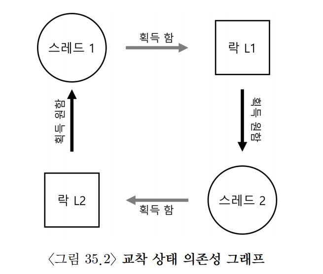

## 33. 컨디션 변수
- 지금까지는 락을 이용해 임계 영역에 한 번에 하나의 쓰레드만 들어가도록 만드는 방법을 살펴보았다.
- 하지만 락만으로는 모든 병행 문제를 해결할 수 없다.
- 어떤 쓰레드는 특정 조건이 참이 될 때까지 기다려야 할 수 있다.
  - 부모 쓰레드가 자식 쓰레드의 종료를 기다리는 경우
  - 소비자가 버퍼에 데이터가 들어오기를 기다리는 경우
  - 생산자가 버퍼에 빈 공간이 생기기를 기다리는 경우
- 이때 스핀하면서 계속 검사하면 CPU를 낭비한다.
- 더 좋은 방법은 조건이 만족될 때까지 쓰레드를 잠재우고, 조건이 바뀌면 깨우는 것이다.
- 이 역할을 하는 동기화 도구가 `컨디션 변수(condition variable)`이다.

### 1. 정의와 루틴들
- 컨디션 변수는 특정 조건이 참이 되기를 기다리는 쓰레드들의 대기 큐이다.
- 컨디션 변수는 항상 락과 함께 사용한다.
  - 락은 공유 상태를 보호한다.
  - 컨디션 변수는 공유 상태가 원하는 조건이 될 때까지 쓰레드를 기다리게 한다.
- Java에서는 `Condition`을 사용해 컨디션 변수를 표현할 수 있다.
  - `await()`는 락을 해제하고 현재 쓰레드를 잠재운다.
  - 깨어난 뒤에는 리턴하기 전에 다시 락을 획득한다.
  - `signal()`은 대기 중인 쓰레드 하나를 깨운다.
  - `signalAll()`은 대기 중인 모든 쓰레드를 깨운다.
- 중요한 점은 `await()`가 락 해제와 잠자기를 하나의 동작처럼 처리한다는 것이다.
  - 락을 해제한 뒤 잠들기 전의 짧은 틈에 시그널을 놓치는 문제를 막기 위해서이다.

#### 부모 쓰레드가 자식 쓰레드를 기다리는 예
- 부모 쓰레드는 자식 쓰레드가 끝날 때까지 기다린다.
- 공유 상태는 `done`이다.
  - `done == false`이면 자식 쓰레드가 아직 끝나지 않은 상태이다.
  - `done == true`이면 자식 쓰레드가 끝난 상태이다.
- 부모 쓰레드는 `done`이 참이 될 때까지 `await()`로 잠든다.
- 자식 쓰레드는 작업을 끝낸 뒤 `done`을 참으로 바꾸고 `signal()`로 부모를 깨운다.

```java
import java.util.concurrent.locks.Condition;
import java.util.concurrent.locks.Lock;
import java.util.concurrent.locks.ReentrantLock;

class ThreadJoinExample {
    private final Lock lock = new ReentrantLock();
    private final Condition childDone = lock.newCondition();
    private boolean done = false;

    public void childExit() {
        lock.lock();
        try {
            done = true;
            childDone.signal();
        } finally {
            lock.unlock();
        }
    }

    public void joinChild() throws InterruptedException {
        lock.lock();
        try {
            while (!done) {
                childDone.await();
            }
        } finally {
            lock.unlock();
        }
    }

    public static void main(String[] args) throws InterruptedException {
        ThreadJoinExample example = new ThreadJoinExample();

        System.out.println("parent: begin");

        Thread child = new Thread(() -> {
            System.out.println("child");
            example.childExit();
        });

        child.start();
        example.joinChild();

        System.out.println("parent: end");
    }
}
```

- 여기서 가장 중요한 부분은 `if`가 아니라 `while`로 조건을 검사한다는 점이다.
- 쓰레드가 깨어났다고 해서 조건이 여전히 참이라는 보장은 없다.
- 따라서 깨어난 뒤에도 조건을 다시 확인해야 한다.

### 2. 생산자/소비자 문제
- 생산자/소비자 문제는 컨디션 변수가 필요한 대표적인 예이다.
- 생산자는 데이터를 만들어 버퍼에 넣는다.
- 소비자는 버퍼에서 데이터를 꺼내 사용한다.
- 버퍼는 공유 자원이므로 락으로 보호해야 한다.
- 또한 버퍼 상태에 따라 쓰레드가 기다려야 한다.
  - 버퍼가 가득 차 있으면 생산자는 기다려야 한다.
  - 버퍼가 비어 있으면 소비자는 기다려야 한다.

#### 1. 불완전한 해답
- 락만 사용하면 버퍼의 동시 접근은 막을 수 있다.
- 하지만 버퍼가 비었거나 가득 찬 상황을 효율적으로 처리할 수 없다.
  - 소비자가 빈 버퍼를 계속 확인하며 스핀하면 CPU를 낭비한다.
  - 생산자가 가득 찬 버퍼를 계속 확인해도 마찬가지이다.
- 그래서 컨디션 변수가 필요하다.
- 단, `await()` 전에 조건을 `if`로 한 번만 검사하면 문제가 생긴다.
  - 소비자 T1이 빈 버퍼를 보고 잠든다.
  - 생산자가 데이터를 넣고 T1을 깨운다.
  - T1이 바로 실행되기 전에 소비자 T2가 먼저 실행되어 데이터를 가져간다.
  - 그 뒤 T1이 깨어나면 버퍼는 다시 비어 있다.
- 즉, 시그널은 "조건이 참일 수 있다"는 힌트일 뿐이다.
- 깨어난 쓰레드가 실제로 실행될 때도 조건이 유지된다는 보장은 없다.
- 이런 방식의 컨디션 변수 의미를 `Mesa semantics`라고 한다.

#### 2. if 대신 while 사용
- 해결책은 조건 검사를 항상 `while`로 하는 것이다.
- 쓰레드가 깨어나면 곧바로 조건을 다시 확인한다.
  - 조건이 만족되면 진행한다.
  - 조건이 만족되지 않으면 다시 잠든다.
- 컨디션 변수를 사용할 때의 기본 규칙은 다음과 같다.

```text
조건이 만족되지 않으면 while 문 안에서 await()를 호출한다.
```

#### 유한 버퍼 예제
- 아래 예제는 크기가 정해진 버퍼를 사용하는 생산자/소비자 구조이다.
- 두 개의 컨디션 변수를 사용한다.
  - `notFull`: 버퍼에 빈 공간이 생겼음을 생산자에게 알린다.
  - `notEmpty`: 버퍼에 데이터가 생겼음을 소비자에게 알린다.

```java
import java.util.ArrayDeque;
import java.util.Queue;
import java.util.concurrent.locks.Condition;
import java.util.concurrent.locks.Lock;
import java.util.concurrent.locks.ReentrantLock;

class BoundedBuffer {
    private final Queue<Integer> buffer = new ArrayDeque<>();
    private final int capacity;

    private final Lock lock = new ReentrantLock();
    private final Condition notFull = lock.newCondition();
    private final Condition notEmpty = lock.newCondition();

    public BoundedBuffer(int capacity) {
        this.capacity = capacity;
    }

    public void put(int value) throws InterruptedException {
        lock.lock();
        try {
            while (buffer.size() == capacity) {
                notFull.await();
            }

            buffer.add(value);
            notEmpty.signal();
        } finally {
            lock.unlock();
        }
    }

    public int take() throws InterruptedException {
        lock.lock();
        try {
            while (buffer.isEmpty()) {
                notEmpty.await();
            }

            int value = buffer.remove();
            notFull.signal();
            return value;
        } finally {
            lock.unlock();
        }
    }
}
```

- `put()`은 버퍼가 가득 차 있으면 `notFull`에서 기다린다.
- 값을 넣은 뒤에는 소비자를 깨우기 위해 `notEmpty.signal()`을 호출한다.
- `take()`는 버퍼가 비어 있으면 `notEmpty`에서 기다린다.
- 값을 꺼낸 뒤에는 생산자를 깨우기 위해 `notFull.signal()`을 호출한다.

### 3. 컨디션 변수 사용 시 주의점
- 컨디션 변수는 어떤 쓰레드를 깨워야 하는지 명확할 때 잘 동작한다.
- 하지만 어떤 쓰레드가 깨어나야 하는지 정확히 알기 어려운 경우도 있다.
- 예를 들어 메모리 할당 상황을 생각해 보자.
  - 어떤 쓰레드는 100KB가 필요해서 기다린다.
  - 다른 쓰레드는 1MB가 필요해서 기다린다.
  - 누군가 200KB를 반납했다면 100KB를 기다리던 쓰레드는 깨어날 수 있지만, 1MB를 기다리던 쓰레드는 아직 깨어나면 안 된다.
- 이처럼 어떤 대기 쓰레드가 조건을 만족하는지 정확히 고르기 어려우면 `signalAll()`을 사용할 수 있다.
  - 모든 대기 쓰레드를 깨운다.
  - 각 쓰레드는 깨어난 뒤 자신의 조건을 `while`로 다시 검사한다.
  - 조건이 만족되지 않은 쓰레드는 다시 잠든다.
- 이런 방식을 `포함 조건(covering condition)`이라고 한다.
  - 깨어나야 할 가능성이 있는 모든 쓰레드를 포함해서 깨우기 때문이다.
- 단점은 불필요하게 깨어나는 쓰레드가 생긴다는 것이다.
  - 깨어났다가 다시 잠드는 과정에서 문맥 전환 비용이 발생한다.
  - 그래도 잘못된 쓰레드만 깨워서 필요한 쓰레드가 계속 잠드는 것보다는 안전하다.

### 4. 요약
- 컨디션 변수는 어떤 조건이 참이 될 때까지 쓰레드를 잠재우는 동기화 도구이다.
- 컨디션 변수는 항상 락과 함께 사용한다.
  - 락은 공유 상태를 보호한다.
  - 컨디션 변수는 상태가 원하는 조건이 될 때까지 기다리게 한다.
- `await()`는 락을 해제하고 쓰레드를 잠재운 뒤, 깨어날 때 다시 락을 획득한다.
- `signal()`은 대기 중인 쓰레드 하나를 깨우고, `signalAll()`은 모든 대기 쓰레드를 깨운다.
- 컨디션 변수를 사용할 때는 반드시 `while`로 조건을 검사해야 한다.
  - 시그널은 조건이 참이라는 보장이 아니라 상태가 바뀌었다는 힌트이다.
  - 깨어난 뒤에도 조건이 유지된다는 보장이 없기 때문이다.
- 생산자/소비자 문제와 포함 조건 문제는 컨디션 변수가 유용한 대표적인 사례이다.

## 34. 세마포어
- 세마포어(semaphore)는 병행 프로그램에서 사용할 수 있는 강력한 동기화 도구이다.
- 세마포어 하나로 여러 역할을 표현할 수 있다.
  - 락처럼 임계 영역을 보호할 수 있다.
  - 컨디션 변수처럼 어떤 사건이 발생할 때까지 기다릴 수 있다.
  - 자원의 개수를 세어 여러 쓰레드의 접근 수를 제한할 수 있다.
- 핵심은 세마포어가 내부에 정수 값을 가지고 있고, 그 값을 원자적으로 조작한다는 점이다.

### 1. 세마포어: 정의
- 세마포어는 정수 값을 가진 객체이다.
- 세마포어는 주로 두 연산으로 사용한다.
  - `wait()` 또는 `acquire()`: 세마포어 값을 감소시키고, 사용할 수 있는 값이 없으면 기다린다.
  - `post()` 또는 `release()`: 세마포어 값을 증가시키고, 대기 중인 쓰레드가 있으면 깨운다.
- POSIX에서는 `sem_wait()`, `sem_post()`라고 부른다.
- Java에서는 `Semaphore.acquire()`, `Semaphore.release()`로 같은 개념을 사용할 수 있다.
- 세마포어는 초기값에 따라 의미가 달라진다.
  - 초기값이 `1`이면 한 번에 하나의 쓰레드만 통과할 수 있어 락처럼 사용할 수 있다.
  - 초기값이 `0`이면 누군가 `release()`를 호출하기 전까지 기다리게 만들 수 있다.
  - 초기값이 `N`이면 동시에 최대 `N`개의 쓰레드가 통과할 수 있다.

```java
import java.util.concurrent.Semaphore;

class SemaphoreInitExample {
    private final Semaphore semaphore = new Semaphore(1);
}
```

- 세마포어 연산은 원자적으로 실행된다고 가정한다.
- 따라서 여러 쓰레드가 동시에 `acquire()`나 `release()`를 호출해도 세마포어 내부 값은 안전하게 갱신된다.

### 2. 이진 세마포어: 락으로 사용하기
- 초기값이 `1`인 세마포어는 락처럼 사용할 수 있다.
- 가능한 상태는 두 가지이다.
  - 값이 `1`: 임계 영역에 들어갈 수 있다.
  - 값이 `0`: 이미 누군가 임계 영역에 있다.
- 첫 번째 쓰레드가 `acquire()`를 호출하면 값이 `1`에서 `0`이 되고 임계 영역에 들어간다.
- 다른 쓰레드가 다시 `acquire()`를 호출하면 값이 부족하므로 기다린다.
- 임계 영역을 끝낸 쓰레드가 `release()`를 호출하면 대기 중인 쓰레드 하나가 진행할 수 있다.

```java
import java.util.concurrent.Semaphore;

class BinarySemaphoreLock {
    private final Semaphore mutex = new Semaphore(1);
    private int balance = 0;

    public void increment() throws InterruptedException {
        mutex.acquire();
        try {
            balance++;
        } finally {
            mutex.release();
        }
    }
}
```

- 락처럼 사용할 때는 반드시 `try/finally`로 `release()`가 실행되게 해야 한다.
- 중간에 예외가 발생했는데 세마포어를 반환하지 않으면 다른 쓰레드가 영원히 기다릴 수 있다.

### 3. 컨디션 변수로서의 세마포어
- 초기값이 `0`인 세마포어는 사건 발생을 기다리는 용도로 사용할 수 있다.
- 기다리는 쓰레드는 `acquire()`를 호출한다.
  - 아직 사건이 발생하지 않았다면 값이 없으므로 잠든다.
- 사건을 완료한 쓰레드는 `release()`를 호출한다.
  - 대기 중인 쓰레드가 깨어나 계속 실행한다.
- 부모 쓰레드가 자식 쓰레드의 종료를 기다리는 예로 볼 수 있다.

```java
import java.util.concurrent.Semaphore;

class SemaphoreJoinExample {
    private final Semaphore done = new Semaphore(0);

    public void childWork() {
        System.out.println("child");
        done.release();
    }

    public void waitForChild() throws InterruptedException {
        done.acquire();
    }

    public static void main(String[] args) throws InterruptedException {
        SemaphoreJoinExample example = new SemaphoreJoinExample();

        System.out.println("parent: begin");

        Thread child = new Thread(example::childWork);
        child.start();

        example.waitForChild();
        System.out.println("parent: end");
    }
}
```

- 자식이 먼저 끝나서 `release()`를 먼저 호출해도 문제 없다.
  - 세마포어 값이 `1`이 된다.
  - 이후 부모가 `acquire()`를 호출하면 바로 통과한다.
- 부모가 먼저 `acquire()`를 호출해도 문제 없다.
  - 부모는 잠든다.
  - 이후 자식이 `release()`를 호출하면 부모가 깨어난다.

### 4. 생산자/소비자 문제
- 생산자/소비자 문제에서도 세마포어를 사용할 수 있다.
- 필요한 세마포어는 세 가지이다.
  - `empty`: 버퍼에 남아 있는 빈 칸의 수를 나타낸다.
  - `full`: 버퍼에 들어 있는 데이터의 수를 나타낸다.
  - `mutex`: 버퍼 배열과 인덱스를 보호하는 이진 세마포어이다.
- 초기값은 다음과 같다.
  - `empty = 버퍼 크기`
  - `full = 0`
  - `mutex = 1`

#### 1. 첫 번째 시도: empty와 full만 사용
- `empty`와 `full`만 사용하면 버퍼가 비었는지, 가득 찼는지는 제어할 수 있다.
- 하지만 버퍼 내부 자료 구조를 동시에 수정하는 경쟁 조건은 막을 수 없다.
- 예를 들어 생산자 두 개가 동시에 `put()`을 호출하면 문제가 생길 수 있다.
  - 두 생산자가 같은 `fill` 위치를 읽는다.
  - 둘 다 같은 칸에 값을 쓴다.
  - 하나의 값이 다른 값으로 덮어써진다.
- 따라서 버퍼 자체를 수정하는 구간에는 상호 배제가 필요하다.

#### 2. 잘못된 락 추가: 교착 상태
- 단순히 `mutex`를 가장 바깥에서 잡으면 교착 상태가 생길 수 있다.
- 예를 들어 소비자가 먼저 실행되었다고 하자.
  - 소비자가 `mutex`를 획득한다.
  - 버퍼가 비어 있어 `full.acquire()`에서 잠든다.
  - 그런데 소비자는 아직 `mutex`를 쥐고 있다.
- 이제 생산자가 실행되어 데이터를 넣으려고 한다.
  - 생산자는 먼저 `mutex`를 얻어야 한다.
  - 하지만 소비자가 `mutex`를 쥐고 잠들어 있으므로 생산자도 기다린다.
- 소비자는 생산자가 데이터를 넣어 주기를 기다리고, 생산자는 소비자가 `mutex`를 놓기를 기다린다.
- 이것이 교착 상태이다.

#### 3. 최종 해답: 락 범위 줄이기
- 해결책은 대기용 세마포어와 상호 배제용 세마포어의 순서를 분리하는 것이다.
- 생산자는 빈 칸이 생길 때까지 먼저 기다린 뒤, 실제 버퍼를 수정할 때만 `mutex`를 잡는다.
- 소비자는 데이터가 생길 때까지 먼저 기다린 뒤, 실제 버퍼를 수정할 때만 `mutex`를 잡는다.

```java
import java.util.concurrent.Semaphore;

class SemaphoreBoundedBuffer {
    private final int[] buffer;
    private int fill = 0;
    private int use = 0;

    private final Semaphore empty;
    private final Semaphore full = new Semaphore(0);
    private final Semaphore mutex = new Semaphore(1);

    public SemaphoreBoundedBuffer(int capacity) {
        buffer = new int[capacity];
        empty = new Semaphore(capacity);
    }

    public void put(int value) throws InterruptedException {
        empty.acquire();

        mutex.acquireUninterruptibly();
        try {
            buffer[fill] = value;
            fill = (fill + 1) % buffer.length;
        } finally {
            mutex.release();
        }

        full.release();
    }

    public int take() throws InterruptedException {
        full.acquire();

        mutex.acquireUninterruptibly();
        try {
            int value = buffer[use];
            use = (use + 1) % buffer.length;
            return value;
        } finally {
            mutex.release();
            empty.release();
        }
    }
}
```

- `empty.acquire()`와 `full.acquire()`는 조건 대기 역할을 한다.
- `mutex.acquire()`와 `mutex.release()`는 버퍼 내부 상태 보호 역할을 한다.
- 핵심은 잠들 수 있는 연산을 `mutex` 안에서 호출하지 않는 것이다.

### 5. Reader-Writer 락
- 어떤 자료 구조는 읽기 연산이 많고 쓰기 연산은 적다.
- 읽기 연산은 자료 구조를 변경하지 않으므로 여러 읽기 쓰레드가 동시에 실행되어도 안전하다.
- 하지만 쓰기 연산은 자료 구조를 변경하므로 단독으로 실행되어야 한다.
- 이 요구를 만족하는 락이 `Reader-Writer 락`이다.
  - 여러 reader는 동시에 들어갈 수 있다.
  - writer는 reader와 writer가 모두 없을 때만 들어갈 수 있다.
- 세마포어로 간단한 Reader-Writer 락을 구현할 수 있다.

```java
import java.util.concurrent.Semaphore;

class ReaderWriterLock {
    private final Semaphore lock = new Semaphore(1);
    private final Semaphore writeLock = new Semaphore(1);
    private int readers = 0;

    public void acquireReadLock() throws InterruptedException {
        lock.acquireUninterruptibly();
        try {
            readers++;

            if (readers == 1) {
                writeLock.acquireUninterruptibly();
            }
        } finally {
            lock.release();
        }
    }

    public void releaseReadLock() {
        lock.acquireUninterruptibly();
        try {
            readers--;

            if (readers == 0) {
                writeLock.release();
            }
        } finally {
            lock.release();
        }
    }

    public void acquireWriteLock() {
        writeLock.acquireUninterruptibly();
    }

    public void releaseWriteLock() {
        writeLock.release();
    }
}
```

- 첫 번째 reader는 `writeLock`을 획득해 writer가 들어오지 못하게 막는다.
- 이후 reader들은 `readers` 값만 증가시키고 함께 읽을 수 있다.
- 마지막 reader가 나갈 때 `writeLock`을 해제한다.
- 이 구현은 reader에게 유리하다.
  - reader가 계속 들어오면 writer가 오래 기다릴 수 있다.
  - 즉, writer 기아(starvation)가 발생할 수 있다.

### 6. 식사하는 철학자
- 식사하는 철학자 문제는 교착 상태와 기아 문제를 설명하기 위한 고전적인 예제이다.
- 다섯 명의 철학자가 원형 식탁에 앉아 있고, 철학자 사이마다 포크가 하나씩 있다.
- 철학자는 생각하거나 식사한다.
  - 생각할 때는 포크가 필요 없다.
  - 식사하려면 왼쪽 포크와 오른쪽 포크가 모두 필요하다.
- 목표는 다음과 같다.
  - 교착 상태가 없어야 한다.
  - 어떤 철학자도 영원히 굶주리면 안 된다.
  - 가능한 한 병행성이 높아야 한다.


#### 1. 불완전한 해답
- 모든 철학자가 같은 순서로 포크를 잡으면 교착 상태가 생길 수 있다.
  - 모든 철학자가 먼저 왼쪽 포크를 잡는다.
  - 그 다음 모두 오른쪽 포크를 기다린다.
  - 오른쪽 포크는 옆 철학자가 이미 잡고 있으므로 아무도 진행하지 못한다.

#### 2. 해답: 의존성 제거
- 교착 상태를 피하려면 순환 대기 조건을 깨야 한다.
- 간단한 방법은 포크를 잡는 순서를 통일하는 것이다.
  - 번호가 작은 포크를 먼저 잡는다.
  - 번호가 큰 포크를 나중에 잡는다.
- 이렇게 하면 모든 철학자가 원형으로 서로를 기다리는 상황을 만들 수 없다.

```java
import java.util.concurrent.Semaphore;

class DiningPhilosophers {
    private static final int N = 5;
    private final Semaphore[] forks = new Semaphore[N];

    public DiningPhilosophers() {
        for (int i = 0; i < N; i++) {
            forks[i] = new Semaphore(1);
        }
    }

    public void eat(int philosopher) throws InterruptedException {
        int left = philosopher;
        int right = (philosopher + 1) % N;

        int first = Math.min(left, right);
        int second = Math.max(left, right);

        forks[first].acquire();
        try {
            forks[second].acquire();
            try {
                System.out.println("philosopher " + philosopher + " eats");
            } finally {
                forks[second].release();
            }
        } finally {
            forks[first].release();
        }
    }
}
```

- 이 방식은 교착 상태를 막는 간단한 방법이다.
- 다만 공정성까지 완벽히 보장하려면 추가 정책이 필요할 수 있다.

### 7. 세마포어 구현
- 세마포어는 락과 컨디션 변수를 이용해 구현할 수 있다.
- 내부에는 세 가지가 필요하다.
  - 현재 사용 가능한 자원 수를 나타내는 `value`
  - `value`를 보호하는 락
  - `value`가 충분해질 때까지 기다리는 컨디션 변수
- `acquire()`는 `value`가 0보다 커질 때까지 기다린 뒤 1 감소시킨다.
- `release()`는 `value`를 1 증가시키고 대기 중인 쓰레드 하나를 깨운다.

```java
import java.util.concurrent.locks.Condition;
import java.util.concurrent.locks.Lock;
import java.util.concurrent.locks.ReentrantLock;

class SimpleSemaphore {
    private int value;
    private final Lock lock = new ReentrantLock();
    private final Condition hasPermit = lock.newCondition();

    public SimpleSemaphore(int initialValue) {
        value = initialValue;
    }

    public void acquire() throws InterruptedException {
        lock.lock();
        try {
            while (value <= 0) {
                hasPermit.await();
            }

            value--;
        } finally {
            lock.unlock();
        }
    }

    public void release() {
        lock.lock();
        try {
            value++;
            hasPermit.signal();
        } finally {
            lock.unlock();
        }
    }
}
```

- 이 구현에서는 세마포어 값이 음수가 되지 않는다.
- 대기 중인 쓰레드 수를 음수 값으로 표현하는 전통적인 설명과는 다르지만, 동작 방식은 이해하기 쉽다.
- 중요한 점은 `acquire()`에서 `while`로 조건을 검사한다는 것이다.
  - 컨디션 변수와 마찬가지로 깨어난 뒤에도 조건을 다시 확인해야 한다.

### 8. 요약
- 세마포어는 정수 값을 기반으로 동작하는 동기화 도구이다.
- 초기값에 따라 다양한 역할을 할 수 있다.
  - `1`: 이진 세마포어로 사용하여 락처럼 동작한다.
  - `0`: 어떤 사건이 발생할 때까지 기다리는 용도로 사용한다.
  - `N`: 동시에 접근 가능한 자원의 개수를 제한한다.
- 생산자/소비자 문제에서는 `empty`, `full`, `mutex` 세마포어를 조합해 해결할 수 있다.
- Reader-Writer 락과 식사하는 철학자 문제도 세마포어로 표현할 수 있다.
- 세마포어는 강력하지만, 연산 순서를 잘못 배치하면 교착 상태가 쉽게 발생한다.
- 따라서 세마포어를 사용할 때는 어떤 연산이 잠들 수 있는지, 어떤 락을 가진 상태에서 기다리는지 항상 확인해야 한다.

## 35. 병행성 관련 오류
- 병행 프로그램은 실행 순서가 매번 달라질 수 있기 때문에 오류를 찾기 어렵다.
- 대표적인 병행성 오류는 두 종류로 나눌 수 있다.
  - 비 교착 상태 오류
  - 교착 상태 오류
- 비 교착 상태 오류는 원자성이나 실행 순서가 깨져서 발생한다.
- 교착 상태 오류는 여러 쓰레드가 서로가 가진 자원을 기다리면서 아무도 진행하지 못할 때 발생한다.

### 1. 오류의 종류
- 병행성 오류는 재현이 어렵다.
  - 특정 타이밍에서만 발생할 수 있다.
  - 테스트에서는 통과했지만 실제 실행 환경에서 드러날 수 있다.
- 많이 발견되는 오류는 크게 다음과 같다.
  - `원자성 위반(atomicity violation)`
  - `순서 위반(order violation)`
  - `교착 상태(deadlock)`

### 2. 비 교착 상태 오류
- 비 교착 상태 오류는 프로그램이 멈추지는 않지만 잘못된 결과를 만들거나 예외를 발생시키는 오류이다.
- 대표적으로 원자성 위반과 순서 위반이 있다.

#### 1. 원자성 위반 오류
- 원자성 위반은 함께 실행되어야 하는 여러 동작 사이에 다른 쓰레드가 끼어들 때 발생한다.
- 예를 들어 어떤 쓰레드가 `procInfo`가 `null`인지 검사한 뒤 그 값을 출력한다고 하자.
- 다른 쓰레드가 그 사이에 `procInfo`를 `null`로 바꾸면 첫 번째 쓰레드는 잘못된 값을 사용하게 된다.

```java
class ProcessInfoPrinter {
    private String procInfo;

    public void printIfPresent() {
        if (procInfo != null) {
            System.out.println(procInfo);
        }
    }

    public void clear() {
        procInfo = null;
    }
}
```

- 위 코드는 `null` 검사와 출력이 원자적으로 실행된다고 가정한다.
- 하지만 두 동작 사이에 다른 쓰레드가 끼어들 수 있으므로 안전하지 않다.
- 해결 방법은 같은 공유 상태에 접근하는 코드를 같은 락으로 보호하는 것이다.

```java
import java.util.concurrent.locks.Lock;
import java.util.concurrent.locks.ReentrantLock;

class SafeProcessInfoPrinter {
    private final Lock lock = new ReentrantLock();
    private String procInfo;

    public void printIfPresent() {
        lock.lock();
        try {
            if (procInfo != null) {
                System.out.println(procInfo);
            }
        } finally {
            lock.unlock();
        }
    }

    public void clear() {
        lock.lock();
        try {
            procInfo = null;
        } finally {
            lock.unlock();
        }
    }
}
```

- 핵심은 `검사`와 `사용`을 하나의 임계 영역으로 묶는 것이다.

#### 2. 순서 위반 오류
- 순서 위반은 반드시 먼저 실행되어야 하는 작업이 나중에 실행될 때 발생한다.
- 예를 들어 쓰레드 2가 `worker`가 이미 초기화되었다고 가정한다고 하자.
- 만약 쓰레드 2가 쓰레드 1의 초기화보다 먼저 실행되면 `null` 값을 사용하게 된다.

```java
class OrderViolationExample {
    private Thread worker;

    public void init() {
        worker = new Thread(this::runWorker);
        worker.start();
    }

    public void useWorker() {
        System.out.println(worker.getState());
    }

    private void runWorker() {
        // 작업 수행
    }
}
```

- 이 코드는 `init()`이 `useWorker()`보다 먼저 실행된다는 순서를 가정한다.
- 순서가 중요하다면 컨디션 변수, 세마포어, 래치 같은 동기화 도구로 순서를 강제해야 한다.

```java
import java.util.concurrent.Semaphore;

class SafeOrderingExample {
    private final Semaphore initialized = new Semaphore(0);
    private Thread worker;

    public void init() {
        worker = new Thread(this::runWorker);
        worker.start();
        initialized.release();
    }

    public void useWorker() throws InterruptedException {
        initialized.acquire();
        System.out.println(worker.getState());
    }

    private void runWorker() {
        // 작업 수행
    }
}
```

- 세마포어의 초기값을 `0`으로 두면 초기화가 끝나기 전에는 `useWorker()`가 진행할 수 없다.

#### 3. 비 교착 상태 오류: 정리
- 비 교착 상태 오류는 대부분 다음 두 가지로 설명할 수 있다.
  - 원자성 위반: 함께 실행되어야 하는 코드 사이에 다른 쓰레드가 끼어든다.
  - 순서 위반: 먼저 실행되어야 하는 코드가 나중에 실행된다.
- 원자성 위반은 락으로 임계 영역을 보호해서 해결하는 경우가 많다.
- 순서 위반은 컨디션 변수, 세마포어, 래치 등으로 실행 순서를 강제해서 해결한다.

### 3. 교착 상태 오류
- 교착 상태는 여러 쓰레드가 서로가 가진 자원을 기다리면서 아무도 진행하지 못하는 상태이다.
- 락을 여러 개 사용하는 프로그램에서 자주 발생한다.

#### 1. 교착 상태는 왜 발생하는가?
- 가장 흔한 원인은 락 획득 순서가 서로 다르기 때문이다.
- 예를 들어 쓰레드 1은 `L1 -> L2` 순서로 락을 잡고, 쓰레드 2는 `L2 -> L1` 순서로 락을 잡는다고 하자.
- 쓰레드 1이 `L1`을 잡고 쓰레드 2가 `L2`를 잡으면 둘 다 다음 락을 기다리게 된다.

```java
import java.util.concurrent.locks.Lock;
import java.util.concurrent.locks.ReentrantLock;

class DeadlockExample {
    private final Lock l1 = new ReentrantLock();
    private final Lock l2 = new ReentrantLock();

    public void thread1() {
        l1.lock();
        try {
            l2.lock();
            try {
                // L1과 L2가 모두 필요한 작업
            } finally {
                l2.unlock();
            }
        } finally {
            l1.unlock();
        }
    }

    public void thread2() {
        l2.lock();
        try {
            l1.lock();
            try {
                // L1과 L2가 모두 필요한 작업
            } finally {
                l1.unlock();
            }
        } finally {
            l2.unlock();
        }
    }
}
```

- 대형 시스템에서는 이런 문제가 더 복잡해진다.
  - 모듈 내부에서 어떤 락을 잡는지 호출자가 모를 수 있다.
  - 캡슐화가 잘 되어 있을수록 내부 락 순서를 외부에서 파악하기 어려울 수 있다.
  - 그래서 모듈화와 락 설계는 충돌하기 쉽다.



#### 2. 교착 상태 발생 조건
- 교착 상태가 발생하려면 네 가지 조건이 모두 만족되어야 한다.
- 하나라도 깨지면 교착 상태는 발생하지 않는다.

- `상호 배제(Mutual Exclusion)`
  - 어떤 자원은 한 번에 하나의 쓰레드만 사용할 수 있다.
- `점유 및 대기(Hold-and-Wait)`
  - 쓰레드가 이미 자원을 가진 상태에서 다른 자원을 기다린다.
- `비선점(No Preemption)`
  - 다른 쓰레드가 가진 자원을 강제로 빼앗을 수 없다.
- `순환 대기(Circular Wait)`
  - 쓰레드들이 원형으로 서로의 자원을 기다린다.

#### 3. 교착 상태의 예방
- 교착 상태 예방은 네 가지 발생 조건 중 하나를 깨는 방식으로 접근한다.

#### 1) 순환 대기 제거
- 가장 실용적인 방법은 모든 락에 전역 순서를 부여하는 것이다.
- 모든 쓰레드가 같은 순서로 락을 획득하면 순환 대기가 생기지 않는다.

```java
class OrderedLocking {
    private final Lock l1 = new ReentrantLock();
    private final Lock l2 = new ReentrantLock();

    public void workA() {
        lockInOrder();
    }

    public void workB() {
        lockInOrder();
    }

    private void lockInOrder() {
        l1.lock();
        try {
            l2.lock();
            try {
                // L1과 L2가 모두 필요한 작업
            } finally {
                l2.unlock();
            }
        } finally {
            l1.unlock();
        }
    }
}
```

- 복잡한 시스템에서는 모든 락의 전체 순서를 정하기 어렵다.
- 이때는 특정 하위 시스템 안에서만이라도 부분 순서를 정해 두는 것이 도움이 된다.

#### 2) 점유 및 대기 제거
- 점유 및 대기를 없애려면 필요한 락을 한 번에 획득하게 만들 수 있다.
- 대표적인 방법은 여러 락을 잡기 전에 전역 락을 먼저 잡는 것이다.

```java
class GlobalPreventionLock {
    private final Lock prevention = new ReentrantLock();
    private final Lock l1 = new ReentrantLock();
    private final Lock l2 = new ReentrantLock();

    public void work() {
        prevention.lock();
        try {
            l1.lock();
            l2.lock();
            try {
                // 여러 락이 필요한 작업
            } finally {
                l2.unlock();
                l1.unlock();
            }
        } finally {
            prevention.unlock();
        }
    }
}
```

- 이 방식은 교착 상태를 막을 수 있지만 단점이 크다.
  - 어떤 락이 필요한지 미리 알아야 한다.
  - 실제로 필요해지기 전에 락을 잡으므로 병행성이 떨어진다.
  - 전역 락 자체가 병목이 될 수 있다.

#### 3) 비선점 조건 약화
- 일반적인 락은 다른 쓰레드가 가진 락을 강제로 빼앗을 수 없다.
- 대신 `tryLock()`을 사용하면 락을 얻지 못했을 때 기다리지 않고 실패할 수 있다.
- 실패하면 이미 잡은 락을 모두 풀고 나중에 다시 시도한다.

```java
import java.util.concurrent.ThreadLocalRandom;
import java.util.concurrent.TimeUnit;

class TryLockRetry {
    private final Lock l1 = new ReentrantLock();
    private final Lock l2 = new ReentrantLock();

    public void work() throws InterruptedException {
        while (true) {
            l1.lock();
            try {
                if (l2.tryLock()) {
                    try {
                        // L1과 L2가 모두 필요한 작업
                        return;
                    } finally {
                        l2.unlock();
                    }
                }
            } finally {
                l1.unlock();
            }

            TimeUnit.MILLISECONDS.sleep(ThreadLocalRandom.current().nextInt(1, 5));
        }
    }
}
```

- 무작위 지연을 넣는 이유는 여러 쓰레드가 동시에 같은 패턴으로 재시도하는 상황을 줄이기 위해서이다.
- 이 방식도 완벽하지는 않다.
  - 코드가 복잡해진다.
  - 이미 획득한 자원을 모두 되돌리는 처리가 필요하다.
  - 호출 깊숙한 곳에서 락을 잡는 구조라면 재시도 로직을 만들기 어렵다.

#### 4) 상호 배제 제거
- 상호 배제 자체를 줄이거나 없애는 방법도 있다.
- 대표적인 방법은 락 없는 자료 구조(lock-free data structure)를 사용하는 것이다.
- 이런 구조는 `Compare-And-Swap(CAS)` 같은 원자 명령어를 이용한다.

```java
import java.util.concurrent.atomic.AtomicInteger;

class LockFreeCounter {
    private final AtomicInteger value = new AtomicInteger(0);

    public void increment() {
        while (true) {
            int oldValue = value.get();
            int newValue = oldValue + 1;

            if (value.compareAndSet(oldValue, newValue)) {
                return;
            }
        }
    }

    public int get() {
        return value.get();
    }
}
```

- 명시적인 락을 사용하지 않으므로 교착 상태는 발생하지 않는다.
- 하지만 lock-free 구조는 구현과 검증이 어렵다.
- 모든 문제를 lock-free로 해결하는 것은 현실적이지 않다.

#### 5) 스케줄링으로 교착 상태 회피
- 교착 상태를 예방하지 않고, 스케줄링으로 회피하는 방법도 있다.
- 이 방식은 각 쓰레드가 앞으로 어떤 락을 필요로 하는지 알고 있다고 가정한다.
- 운영체제나 런타임은 그 정보를 바탕으로 교착 상태가 생기지 않는 순서로 쓰레드를 실행한다.
- 대표적인 이론적 방법으로 다익스트라의 `은행원 알고리즘(Banker's Algorithm)`이 있다.
- 하지만 일반적인 시스템에서는 쓰레드가 앞으로 어떤 락을 요청할지 미리 알기 어렵다.
- 그래서 이 방법은 전체 작업과 자원 요구량을 미리 알 수 있는 제한된 환경에서 더 적합하다.

#### 6) 발견 및 복구
- 마지막 방법은 교착 상태 발생을 허용하고, 나중에 발견하여 복구하는 것이다.
- 시스템은 주기적으로 자원 할당 그래프를 만들고 사이클이 있는지 검사한다.
  - 사이클이 있으면 교착 상태가 발생한 것으로 볼 수 있다.
- 복구 방법은 시스템 성격에 따라 다르다.
  - 일부 작업을 중단한다.
  - 트랜잭션을 롤백한다.
  - 심한 경우 시스템이나 서비스를 재시작한다.
- DBMS는 교착 상태를 발견하고 트랜잭션 하나를 중단시켜 복구하는 방식을 자주 사용한다.

### 4. 요약
- 병행성 오류는 크게 비 교착 상태 오류와 교착 상태 오류로 나눌 수 있다.
- 비 교착 상태 오류는 주로 원자성 위반과 순서 위반이다.
  - 원자성 위반은 임계 영역을 락으로 보호해 해결한다.
  - 순서 위반은 세마포어, 컨디션 변수, 래치 등으로 실행 순서를 강제해 해결한다.
- 교착 상태는 네 조건이 모두 만족될 때 발생한다.
  - 상호 배제
  - 점유 및 대기
  - 비선점
  - 순환 대기
- 교착 상태를 다루는 방법은 여러 가지이다.
  - 락 획득 순서를 정한다.
  - 필요한 락을 한 번에 잡는다.
  - `tryLock()`으로 실패 시 물러난다.
  - lock-free 구조로 상호 배제를 줄인다.
  - 스케줄링으로 회피한다.
  - 발생 후 발견하고 복구한다.

## 36. 이벤트 기반의 병행성
- 이벤트 기반 병행성은 여러 쓰레드를 만드는 대신, 하나의 이벤트 루프가 여러 요청을 번갈아 처리하는 방식이다.
- GUI 프로그램이나 네트워크 서버에서 자주 사용된다.
- 이 방식의 목표는 두 가지이다.
  - 락, 교착 상태 같은 멀티 쓰레드 동기화 문제를 줄인다.
  - 운영체제 스케줄러에만 맡기지 않고, 프로그램이 다음에 처리할 작업을 직접 고른다.
- 하지만 이벤트 기반 방식도 단점이 있다.
  - 블로킹 시스템 콜 하나가 전체 이벤트 루프를 멈출 수 있다.
  - 비동기 작업의 상태를 직접 관리해야 한다.
  - 멀티코어 환경에서는 다시 동기화 문제가 생길 수 있다.

### 1. 기본 개념: 이벤트 루프
- 이벤트 기반 프로그램은 특정 사건이 발생하기를 기다린다.
- 사건이 발생하면 그 사건의 종류를 확인하고 적절한 코드를 실행한다.
  - 네트워크 패킷 도착
  - 클라이언트 연결 요청
  - 디스크 I/O 완료
  - 타이머 만료
- 각 이벤트를 처리하는 코드를 `이벤트 핸들러(event handler)`라고 한다.
- 이벤트 루프는 다음 구조를 반복한다.
  - 처리할 이벤트를 가져온다.
  - 이벤트를 하나씩 처리한다.
  - 다시 다음 이벤트를 기다린다.

```java
while (true) {
    List<Event> events = getEvents();

    for (Event event : events) {
        processEvent(event);
    }
}
```

- 이벤트 기반 프로그램에서는 이벤트 핸들러 실행이 시스템의 주된 작업이다.
- 따라서 다음에 어떤 이벤트를 처리할지 결정하는 것이 곧 스케줄링과 비슷한 역할을 한다.
- 핵심 질문은 다음과 같다.
  - 어떤 이벤트가 발생했는지 어떻게 알 수 있는가?
  - 이벤트를 기다리는 동안 CPU를 낭비하지 않으려면 어떻게 해야 하는가?

### 2. 중요 API: select() 또는 poll()
- Unix 계열 시스템은 여러 I/O 대상 중 준비된 것이 있는지 확인하기 위해 `select()`나 `poll()`을 제공한다.
- 이 시스템 콜은 여러 파일 디스크립터를 한 번에 감시한다.
  - 읽을 데이터가 도착했는지 확인한다.
  - 쓸 준비가 되었는지 확인한다.
  - 예외 상황이 발생했는지 확인한다.
- 예를 들어 웹 서버는 여러 클라이언트 소켓을 감시하다가, 데이터가 도착한 소켓만 처리할 수 있다.

#### select()가 확인하는 것
- `readfds`
  - 읽을 준비가 된 파일 디스크립터 집합이다.
  - 네트워크 서버에서는 보통 새 요청이나 패킷 도착 여부를 확인하는 데 사용한다.
- `writefds`
  - 쓸 준비가 된 파일 디스크립터 집합이다.
  - 응답을 보낼 수 있는 시점을 확인하는 데 사용한다.
- `errorfds`
  - 예외 상황이 발생한 파일 디스크립터 집합이다.
- `timeout`
  - 얼마나 기다릴지 결정한다.
  - `null`이면 준비된 디스크립터가 생길 때까지 계속 기다린다.
  - `0`이면 기다리지 않고 즉시 리턴한다.
  - 특정 시간을 지정하면 그 시간까지만 기다린다.

- `select()`는 준비된 디스크립터 수를 반환하고, 전달받은 집합을 준비된 디스크립터만 남도록 갱신한다.
- 실제 시스템에서는 `select()` 외에도 `poll()`, `epoll`, `kqueue`, IOCP 같은 더 확장성 있는 API가 사용된다.

### 3. select()의 사용
- 이벤트 기반 서버의 기본 흐름은 다음과 같다.
  - 서버가 감시할 파일 디스크립터 집합을 준비한다.
  - `select()`로 준비된 디스크립터가 생길 때까지 기다린다.
  - 준비된 디스크립터를 순회하며 해당 이벤트를 처리한다.
  - 다시 루프 처음으로 돌아간다.

```java
while (true) {
    Set<Descriptor> ready = select(watchedDescriptors);

    for (Descriptor descriptor : ready) {
        if (descriptor.isReadable()) {
            handleRead(descriptor);
        }

        if (descriptor.isWritable()) {
            handleWrite(descriptor);
        }
    }
}
```

- 실제 C 코드에서는 `FD_ZERO()`, `FD_SET()`, `FD_ISSET()` 같은 매크로를 사용한다.
  - `FD_ZERO()`는 감시 집합을 초기화한다.
  - `FD_SET()`은 특정 디스크립터를 감시 집합에 추가한다.
  - `FD_ISSET()`은 특정 디스크립터가 준비되었는지 확인한다.
- 실제 서버는 이보다 더 복잡하다.
  - 새 연결을 받아야 한다.
  - 요청을 파싱해야 한다.
  - 응답을 버퍼링해야 한다.
  - 디스크 I/O나 타이머 같은 다른 이벤트도 함께 관리해야 한다.

### 4. 왜 간단한가? 락이 필요 없음
- 기본적인 이벤트 기반 서버는 하나의 쓰레드에서 동작한다.
- 한 번에 하나의 이벤트 핸들러만 실행되므로 같은 자료 구조를 동시에 수정하는 일이 없다.
- 그래서 기본 구조에서는 락이 거의 필요 없다.
  - 경쟁 조건이 줄어든다.
  - 교착 상태 가능성도 줄어든다.
  - 디버깅이 상대적으로 단순해진다.
- 단, 이 장점은 이벤트 루프가 하나의 쓰레드에서만 실행될 때 강하게 유지된다.
- 여러 이벤트 핸들러를 여러 CPU에서 병렬 실행하기 시작하면 다시 락과 동기화가 필요하다.

### 5. 문제: 블로킹 시스템 콜
- 이벤트 기반 시스템의 가장 큰 문제는 블로킹 호출이다.
- 이벤트 루프는 하나의 쓰레드에서 실행되므로, 핸들러 하나가 멈추면 전체 서버가 멈춘다.
- 예를 들어 어떤 요청을 처리하려면 디스크에서 파일을 읽어야 한다고 하자.
  - 핸들러가 `open()`을 호출한다.
  - 핸들러가 `read()`를 호출한다.
  - 디스크 I/O가 오래 걸리면 이벤트 루프 전체가 기다리게 된다.
- 그동안 다른 클라이언트 요청도 처리되지 못한다.
- 쓰레드 기반 서버라면 한 쓰레드가 디스크 I/O를 기다리는 동안 다른 쓰레드가 계속 실행될 수 있다.
- 이벤트 기반 서버에서는 그렇지 않기 때문에 블로킹 호출을 피해야 한다.

```text
이벤트 기반 시스템의 기본 원칙:
이벤트 핸들러 안에서 오래 걸리는 블로킹 호출을 하지 않는다.
```

### 6. 해법: 비동기 I/O
- 블로킹 문제를 줄이는 방법은 비동기 I/O를 사용하는 것이다.
- 비동기 I/O는 요청을 등록한 뒤 즉시 제어권을 돌려준다.
  - 프로그램은 I/O 완료를 기다리며 멈추지 않는다.
  - 나중에 I/O가 완료되었는지 확인하거나 완료 알림을 받는다.
- POSIX AIO 계열에서는 `aio_read()`로 비동기 읽기를 요청하고, `aio_error()`로 완료 여부를 확인할 수 있다.
  - 완료되지 않았으면 `EINPROGRESS`를 반환한다.
  - 완료되었으면 성공 또는 실패 결과를 확인할 수 있다.
- 완료 여부를 확인하는 방식은 두 가지가 있다.
  - 폴링: 주기적으로 `aio_error()`를 호출해 완료되었는지 확인한다.
  - 알림: 시그널이나 이벤트를 통해 완료 사실을 통지받는다.
- 비동기 I/O가 충분히 지원되지 않는 시스템에서는 하이브리드 구조를 쓰기도 한다.
  - 네트워크 이벤트는 이벤트 루프가 처리한다.
  - 디스크 I/O처럼 블로킹될 수 있는 작업은 쓰레드 풀에 맡긴다.

```java
class AsyncRequest {
    private final Socket socket;
    private final String path;

    AsyncRequest(Socket socket, String path) {
        this.socket = socket;
        this.path = path;
    }
}

void handleRequest(Socket socket, String path) {
    AsyncRequest request = new AsyncRequest(socket, path);
    startAsyncRead(request);
}

void onReadComplete(AsyncRequest request, byte[] data) {
    sendResponse(request.socket, data);
}
```

- 위 코드는 실제 Java API 예제가 아니라 이벤트 기반 구조를 보여 주는 의사 코드이다.
- 핵심은 I/O 요청 시점과 I/O 완료 처리 시점이 분리된다는 점이다.

### 7. 또 다른 문제점: 상태 관리
- 이벤트 기반 코드는 쓰레드 기반 코드보다 상태 관리가 어렵다.
- 쓰레드 기반 코드에서는 함수 호출 흐름과 지역 변수가 쓰레드 스택에 남아 있다.
  - 파일을 읽는다.
  - 읽은 결과로 응답을 만든다.
  - 응답을 보낸다.
- 이벤트 기반 코드에서는 I/O 요청을 등록한 뒤 함수가 끝난다.
- 따라서 나중에 I/O가 완료되었을 때 필요한 상태를 어딘가에 저장해 두어야 한다.
  - 어떤 클라이언트 요청이었는지
  - 어떤 파일을 읽고 있었는지
  - 읽기가 끝나면 무엇을 해야 하는지
- 이런 방식을 `수동 스택 관리(manual stack management)`라고 한다.
- 저장해 둔 후속 작업을 `continuation`이라고도 한다.
  - 이벤트가 완료되면 continuation에 저장된 정보를 이용해 나머지 처리를 이어 간다.

```java
class Continuation {
    private final Socket client;
    private final Request request;

    Continuation(Socket client, Request request) {
        this.client = client;
        this.request = request;
    }

    void resume(byte[] fileData) {
        Response response = buildResponse(request, fileData);
        sendResponse(client, response);
    }
}
```

- 이벤트 기반 프로그래밍이 복잡해지는 이유는 이처럼 프로그램의 다음 실행 상태를 개발자가 직접 관리해야 하기 때문이다.

### 8. 이벤트 사용의 어려움
- 이벤트 기반 접근법에는 추가적인 어려움이 있다.
- 첫째, 멀티코어 환경에서는 단순함이 줄어든다.
  - 하나의 이벤트 루프만 사용하면 CPU 하나만 주로 사용하게 된다.
  - 여러 CPU를 활용하려면 여러 이벤트 루프나 병렬 핸들러를 사용해야 한다.
  - 그러면 공유 자료 구조에 대한 락과 동기화가 다시 필요해진다.
- 둘째, 숨은 블로킹을 피하기 어렵다.
  - 이벤트 핸들러가 직접 블로킹 호출을 하지 않아도 페이지 폴트가 발생할 수 있다.
  - 페이지 폴트가 발생하면 운영체제가 디스크에서 페이지를 읽어 올 때까지 해당 쓰레드는 멈춘다.
  - 이 동안 이벤트 루프도 멈춘다.
- 셋째, 라이브러리 함수의 성질 변화에 취약하다.
  - 어떤 함수가 예전에는 비차단이었는데 나중에 내부적으로 블로킹을 수행할 수 있다.
  - 그러면 해당 함수를 호출하는 이벤트 핸들러 전체를 다시 점검해야 한다.
- 넷째, 비동기 I/O 지원이 플랫폼마다 다르다.
  - 디스크 I/O와 네트워크 I/O의 비동기 지원 방식이 다를 수 있다.
  - API가 일관되지 않으면 이벤트 기반 프로그램을 이식하기 어려워진다.

### 9. 요약
- 이벤트 기반 병행성은 하나의 이벤트 루프가 여러 이벤트를 처리하는 방식이다.
- 단일 쓰레드 이벤트 루프에서는 락이 거의 필요 없기 때문에 병행성 오류가 줄어든다.
- 프로그램이 다음 이벤트를 직접 선택하므로 스케줄링에 대한 제어권도 커진다.
- 하지만 이벤트 기반 방식은 다음 문제를 가진다.
  - 블로킹 시스템 콜에 취약하다.
  - 비동기 I/O와 continuation 때문에 상태 관리가 복잡하다.
  - 멀티코어 환경에서는 다시 락과 동기화가 필요하다.
  - 페이지 폴트 같은 숨은 블로킹을 완전히 피하기 어렵다.
- 따라서 이벤트 기반 방식과 쓰레드 기반 방식 중 어느 하나가 항상 정답은 아니다.
- 실제 시스템에서는 이벤트 루프, 비동기 I/O, 쓰레드 풀을 섞어 사용하는 경우가 많다.
