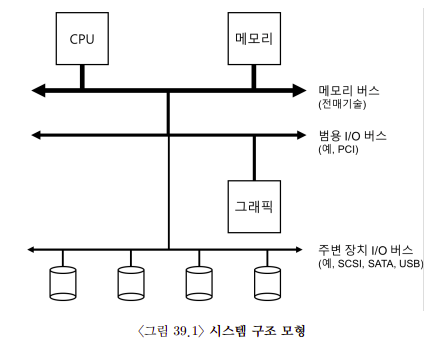
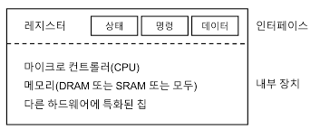
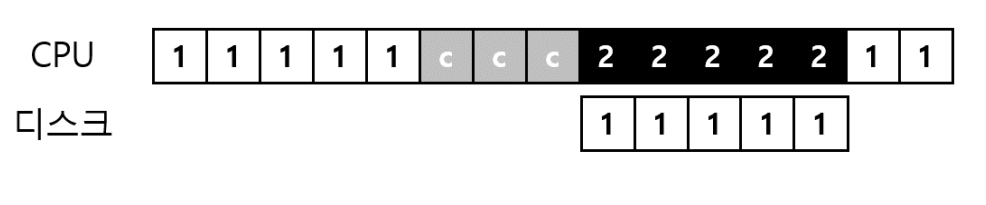
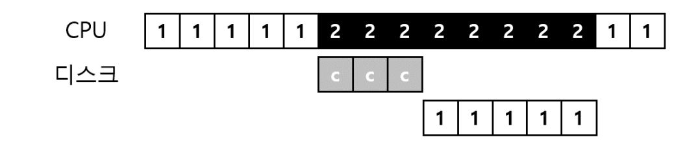
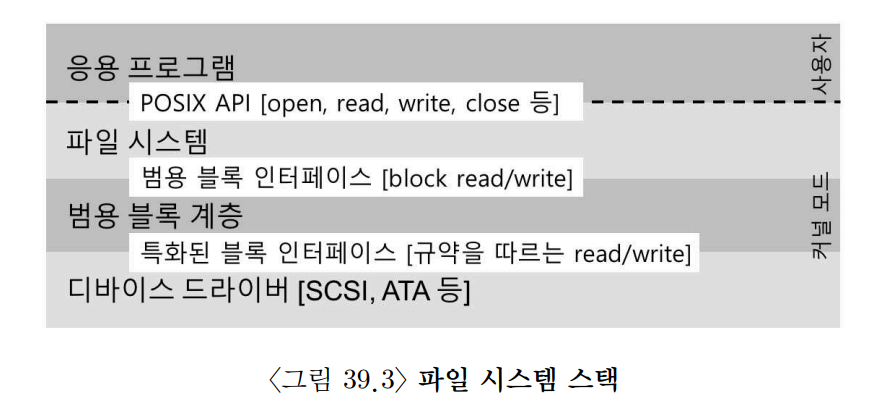
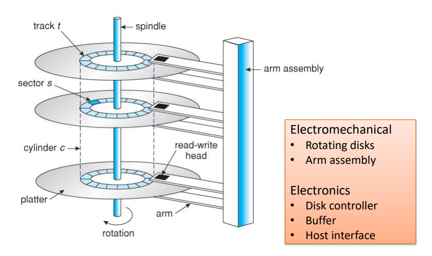
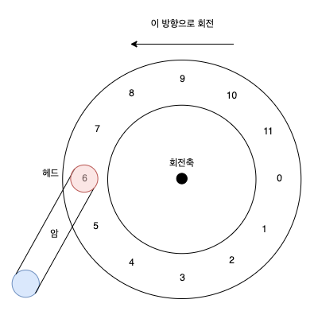
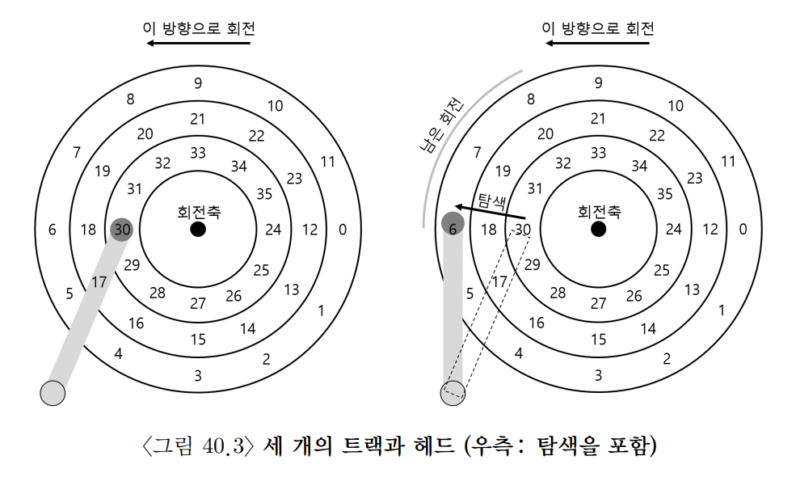
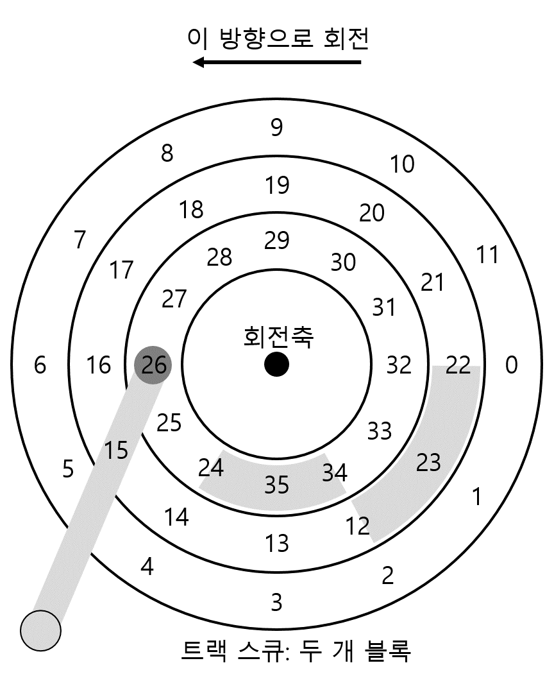
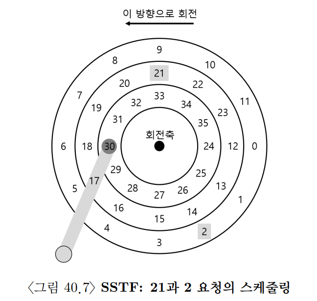

## 39. I/O 장치
- 운영체제는 CPU, 메모리, 저장 장치, 네트워크 장치처럼 서로 다른 속도와 특성을 가진 장치들을 함께 다뤄야 한다.
- 핵심 질문은 다음과 같다.
  - I/O 장치를 시스템에 어떻게 연결할까?
  - 장치와 운영체제는 어떤 방식으로 통신할까?
  - CPU 낭비를 줄이면서 I/O를 효율적으로 처리하려면 어떻게 해야 할까?

### 1. 시스템 구조
- 일반적인 컴퓨터 시스템은 계층적인 버스 구조를 가진다.
- CPU와 메모리는 가장 빠른 메모리 버스로 연결된다.
- 고성능 I/O 장치는 그 아래의 범용 I/O 버스에 연결된다.
  - 현대 시스템에서는 PCI 계열 버스가 대표적이다.
  - 그래픽 카드나 고속 네트워크 장치가 여기에 연결될 수 있다.
- 더 느린 주변 장치는 SCSI, SATA, USB 같은 주변 장치 버스에 연결된다.
  - 디스크
  - 키보드
  - 마우스
  - USB 장치



- 이런 계층 구조가 필요한 이유는 성능과 비용 때문이다.
  - 빠른 버스는 짧고 단순해야 하므로 많은 장치를 직접 연결하기 어렵다.
  - 모든 장치를 고속 버스에 연결하면 비용이 커지고 설계도 복잡해진다.
  - 그래서 빠른 장치는 CPU 가까이에, 느린 장치는 더 아래 계층에 배치한다.
- 결과적으로 시스템은 장치의 속도와 특성에 맞는 버스 계층을 사용한다.

### 2. 표준 장치
- 모든 I/O 장치는 크게 두 부분으로 볼 수 있다.

#### 하드웨어 인터페이스
- 장치가 운영체제에게 제공하는 제어 방법이다.
- 운영체제는 이 인터페이스를 통해 장치 상태를 확인하고 명령을 내린다.
- 소프트웨어가 API를 제공하듯이, 하드웨어도 레지스터와 명령 형식이라는 인터페이스를 제공한다.

#### 내부 구조
- 장치 내부에서 실제 동작을 수행하는 부분이다.
- 단순한 장치는 몇 개의 칩만으로 구성될 수 있다.
- 복잡한 장치는 내부에 다음 요소를 가질 수 있다.
  - 작은 CPU
  - 메모리
  - 장치 전용 칩
  - 펌웨어
- 예를 들어 RAID 컨트롤러는 내부 펌웨어가 디스크 배열 관리와 오류 처리를 담당한다.



### 3. 표준 방식: 폴링과 PIO
- 단순화된 장치 인터페이스는 보통 몇 개의 레지스터로 구성된다.
  - `상태 레지스터(status register)`: 장치가 바쁜지, 준비되었는지 확인한다.
  - `명령 레지스터(command register)`: 장치에게 수행할 작업을 지시한다.
  - `데이터 레지스터(data register)`: 장치와 데이터를 주고받는다.
- 운영체제는 이 레지스터를 읽고 쓰면서 장치를 제어한다.

```text
while (STATUS == BUSY) {
    // 장치가 준비될 때까지 기다린다.
}

DATA = data;
COMMAND = command;

while (STATUS == BUSY) {
    // 작업이 끝날 때까지 기다린다.
}
```

- 이 방식은 네 단계로 진행된다.
  - 운영체제가 상태 레지스터를 반복해서 읽으며 장치가 준비되었는지 확인한다.
  - 장치가 준비되면 데이터 레지스터에 데이터를 쓴다.
  - 명령 레지스터에 명령을 기록하여 장치 작업을 시작한다.
  - 장치가 작업을 끝낼 때까지 다시 상태 레지스터를 반복해서 확인한다.
- 장치 상태를 반복해서 확인하는 방식을 `폴링(polling)`이라고 한다.
- CPU가 직접 데이터 레지스터에 데이터를 옮기는 방식을 `Programmed I/O(PIO)`라고 한다.
- 이 방식은 단순하지만 비효율적이다.
  - 장치는 CPU보다 훨씬 느리다.
  - CPU는 장치가 끝나기를 기다리며 계속 루프를 돈다.
  - 그 시간에 다른 프로세스를 실행할 수 있는데도 CPU를 낭비하게 된다.

### 4. 인터럽트를 이용한 CPU 오버헤드 개선
- 폴링의 낭비를 줄이기 위해 `인터럽트(interrupt)`를 사용할 수 있다.
- 인터럽트 기반 방식은 다음과 같이 동작한다.
  - 운영체제가 장치에 I/O 작업을 요청한다.
  - I/O를 요청한 프로세스는 대기 상태로 전환된다.
  - CPU는 다른 프로세스를 실행한다.
  - 장치가 작업을 끝내면 하드웨어 인터럽트를 발생시킨다.
  - CPU는 운영체제의 인터럽트 핸들러를 실행한다.
  - 운영체제는 I/O 완료를 처리하고 대기 중이던 프로세스를 깨운다.
- 인터럽트 핸들러는 `Interrupt Service Routine(ISR)`이라고도 부른다.
- 인터럽트를 사용하면 CPU 연산과 I/O를 겹쳐 실행할 수 있다.
  - 장치가 느린 작업을 하는 동안 CPU는 다른 일을 한다.
  - 시스템 전체 사용률이 높아진다.

- 하지만 인터럽트가 항상 최선은 아니다.
- 장치가 매우 빠르면 폴링이 더 나을 수 있다.
  - 인터럽트 처리에는 문맥 전환과 핸들러 실행 비용이 든다.
  - 작업이 거의 즉시 끝나는 장치라면 폴링 한두 번이 더 싸다.
- 장치 속도를 예측하기 어렵다면 하이브리드 방식도 사용할 수 있다.
  - 짧은 시간 동안만 폴링한다.
  - 그래도 끝나지 않으면 인터럽트 기반으로 전환한다.

#### 인터럽트 폭주와 병합
- 네트워크처럼 이벤트가 매우 자주 발생하는 장치에서는 인터럽트가 너무 많이 발생할 수 있다.
- 패킷마다 인터럽트가 발생하면 CPU가 인터럽트 처리에만 매달릴 수 있다.
  - 사용자 프로세스 실행이 밀린다.
  - 시스템이 실제 일을 처리하지 못하고 인터럽트만 처리하는 상황이 생긴다.
- 이때는 폴링이 더 나은 제어를 제공할 수 있다.
  - 운영체제가 적절한 시점에 네트워크 장치를 확인한다.
  - 패킷 처리와 사용자 작업 사이의 균형을 조절할 수 있다.
- 또 다른 최적화는 `인터럽트 병합(interrupt coalescing)`이다.
  - 장치가 작업 하나가 끝날 때마다 즉시 인터럽트를 보내지 않는다.
  - 잠시 기다렸다가 여러 완료 이벤트를 묶어 한 번만 인터럽트를 보낸다.
  - 인터럽트 횟수는 줄지만, 너무 오래 기다리면 응답 지연이 커질 수 있다.

### 5. DMA를 이용한 효율적인 데이터 이동
- PIO 방식에서는 CPU가 메모리와 장치 사이의 데이터 복사를 직접 수행한다.
- 대량 데이터를 전송할 때는 이 비용이 매우 크다.
  - CPU가 단순 복사 작업에 묶인다.
  - 다른 프로세스를 실행할 기회를 잃는다.



- 이 문제를 해결하기 위해 `DMA(Direct Memory Access)`를 사용한다.
- DMA는 CPU 대신 메모리와 장치 사이의 데이터 전송을 담당하는 하드웨어 기능이다.
- DMA 방식은 다음과 같이 동작한다.
  - 운영체제가 DMA 컨트롤러에 전송 정보를 설정한다.
  - 전송할 메모리 주소, 데이터 크기, 대상 장치를 알려 준다.
  - DMA 컨트롤러가 CPU 개입 없이 데이터를 전송한다.
  - 전송이 끝나면 DMA 컨트롤러가 인터럽트를 발생시킨다.
  - 운영체제는 전송 완료를 처리한다.
- DMA를 사용하면 CPU는 데이터 복사 중에도 다른 작업을 실행할 수 있다.



### 6. 디바이스와 상호작용하는 방법
- 운영체제가 장치 레지스터와 통신하는 방식은 크게 두 가지이다.

#### 명시적 I/O 명령어
- CPU가 제공하는 특수 I/O 명령어를 사용한다.
- 운영체제는 이 명령어로 장치 레지스터를 읽거나 쓴다.
- 대부분 특권 명령어이므로 커널만 사용할 수 있다.
  - 사용자 프로그램이 디스크나 네트워크 장치를 직접 조작하면 시스템 안정성과 보안이 깨질 수 있다.
  - 따라서 운영체제가 장치 접근을 통제한다.

#### Memory-Mapped I/O
- 장치 레지스터를 메모리 주소 공간의 일부처럼 배치하는 방식이다.
- 운영체제는 특정 주소에 `load` 또는 `store`를 수행한다.
- 하드웨어는 해당 주소 접근을 일반 메모리가 아니라 장치 레지스터 접근으로 해석한다.
- 이 방식은 일반 메모리 접근 명령으로 장치를 제어할 수 있다는 장점이 있다.

- 두 방식은 모두 현재 시스템에서 사용된다.
- 어느 방식이 절대적으로 우월하다기보다는 CPU 구조와 장치 설계에 따라 선택된다.

### 7. 운영체제에 연결하기: 디바이스 드라이버
- 운영체제는 수많은 장치를 지원해야 한다.
  - SCSI 디스크
  - SATA 디스크
  - USB 저장 장치
  - SSD
  - 네트워크 카드
- 파일 시스템은 디스크 종류마다 다른 명령 형식을 직접 알 필요가 없어야 한다.
- 이를 위해 운영체제는 `디바이스 드라이버(device driver)`를 사용한다.
- 디바이스 드라이버는 특정 장치의 세부 동작을 알고 있는 커널 코드이다.
  - 장치 레지스터 형식
  - 명령 전달 방식
  - 인터럽트 처리 방식
  - 오류 처리 방식
- 파일 시스템은 장치 드라이버를 직접 다루기보다, 보통 더 일반적인 블록 계층에 요청한다.
  - "이 블록을 읽어라"
  - "이 블록에 써라"
- 실제 장치별 세부 처리는 드라이버가 맡는다.



- 이런 추상화의 장점은 명확하다.
  - 파일 시스템은 장치 종류에 독립적으로 작성될 수 있다.
  - 새 장치를 추가할 때 드라이버만 추가하면 된다.
- 단점도 있다.
  - 장치가 가진 특수 기능이 범용 인터페이스에 가려질 수 있다.
  - 모든 기능을 일반화하기 어렵다.
- 시간이 지나면서 드라이버 코드는 커널에서 매우 큰 비중을 차지하게 되었다.
  - 시스템이 지원해야 하는 장치가 많기 때문이다.

### 8. 사례 연구: 간단한 IDE 디스크 드라이버
- IDE 디스크는 단순한 장치 인터페이스를 제공한다.
- 대표적으로 다음 레지스터를 사용한다.
  - `Control`
  - `Command Block`
  - `Status`
  - `Error`
- x86 시스템에서는 `in`, `out` 같은 I/O 명령어로 특정 I/O 주소의 레지스터를 읽고 쓸 수 있다.

#### IDE 요청 처리 흐름
- IDE 디스크 요청은 대략 다음 순서로 처리된다.

1. 장치 준비 확인
   - 드라이브가 바쁘지 않고 `READY` 상태가 될 때까지 `Status` 레지스터를 읽는다.

2. 명령 인자 설정
   - 접근할 섹터 수를 기록한다.
   - 접근할 섹터의 논리 블록 주소를 기록한다.
   - 대상 드라이브 번호를 기록한다.

3. I/O 시작
   - `Command` 레지스터에 읽기 또는 쓰기 명령을 기록한다.
   - 장치는 명령을 보고 실제 작업을 시작한다.

4. 데이터 전송
   - 쓰기 작업이라면 장치가 `READY`이고 `DRQ` 상태가 될 때까지 기다린다.
   - 이후 데이터 포트에 데이터를 기록한다.

5. 인터럽트 처리
   - 전송이 끝나면 장치가 인터럽트를 발생시킨다.
   - 단순한 방식은 섹터마다 인터럽트를 발생시키는 것이다.
   - 더 효율적인 방식은 여러 전송을 묶어 마지막에 한 번만 인터럽트를 발생시키는 것이다.

6. 오류 처리
   - 각 단계 이후 `Status` 레지스터를 확인한다.
   - `ERROR` 비트가 설정되어 있으면 `Error` 레지스터를 읽어 상세 원인을 확인한다.

#### xv6 IDE 드라이버의 기본 함수
- xv6의 IDE 드라이버는 이 흐름을 몇 개의 함수로 나누어 구현한다.
- `ide_rw()`
  - 읽기 또는 쓰기 요청을 큐에 넣는다.
  - 디스크가 비어 있으면 바로 요청을 시작한다.
  - 요청을 보낸 프로세스는 완료될 때까지 잠든다.
- `ide_start_request()`
  - 큐에서 요청을 꺼내 실제 디스크 명령을 내린다.
  - `in`, `out` 명령어로 장치 레지스터를 읽고 쓴다.
- `ide_wait_ready()`
  - 요청을 보내기 전에 드라이브가 준비되었는지 확인한다.
- `ide_intr()`
  - 디스크 인터럽트가 발생했을 때 호출된다.
  - 읽기 요청이면 장치에서 데이터를 가져온다.
  - I/O 완료를 기다리던 프로세스를 깨운다.
  - 큐에 다음 요청이 있으면 `ide_start_request()`로 다음 작업을 시작한다.

- 이 사례는 운영체제의 I/O 처리 흐름을 잘 보여 준다.
  - 프로세스는 I/O를 요청하고 잠든다.
  - 드라이버는 장치 레지스터를 조작한다.
  - 장치는 작업이 끝나면 인터럽트를 발생시킨다.
  - 인터럽트 핸들러는 완료 처리를 하고 다음 요청을 이어서 실행한다.

## 40. 하드 디스크 드라이브
- 많은 파일 시스템 기술은 하드 디스크 드라이브(HDD)의 동작 방식을 기준으로 발전했다.
- HDD는 순차 접근과 가까운 위치 접근이 빠르고, 멀리 떨어진 위치로 이동하는 랜덤 접근은 느리다.
- 따라서 파일 시스템은 디스크의 물리적 특성을 고려해 데이터를 배치하고 I/O 요청을 정렬한다.

### 1. 인터페이스
- 현대 디스크 드라이브의 기본 인터페이스는 단순하다.
- 드라이브는 읽고 쓸 수 있는 수많은 `섹터(sector)`로 이루어져 있다.
  - 전통적으로 한 섹터의 크기는 512바이트이다.
- 디스크에 `n`개의 섹터가 있다면, 각 섹터에는 `0`부터 `n - 1`까지의 번호가 붙는다.
- 따라서 운영체제 입장에서는 디스크를 다음과 같은 단순한 배열처럼 볼 수 있다.

```text
sector[0], sector[1], sector[2], ..., sector[n - 1]
```

- 이 섹터 번호들이 드라이브의 주소 공간이 된다.
- 운영체제는 특정 섹터 번호를 지정해 데이터를 읽거나 쓴다.

#### 1. 멀티 섹터 작업
- 디스크는 여러 섹터를 한 번에 읽거나 쓸 수 있다.
- 많은 파일 시스템은 보통 한 번에 4KB 단위로 읽고 쓴다.
  - 512바이트 섹터 기준으로는 8개 섹터에 해당한다.
- 하지만 원자성이 항상 큰 단위로 보장되는 것은 아니다.
  - 일반적으로 드라이브 제조사가 원자적으로 보장하는 단위는 하나의 512바이트 섹터 쓰기이다.
  - 4KB 쓰기 도중 전원이 꺼지면 일부 섹터만 기록되고 나머지는 기록되지 않을 수 있다. (찢긴 쓰기)

#### 2. 디스크 인터페이스의 암묵적 가정
- 디스크 인터페이스는 단순히 섹터 배열을 제공하지만, 사용자는 몇 가지 성능 가정을 한다.
- 이런 가정을 `디스크 드라이브의 계약 불문율`이라고 볼 수 있다.
- 첫 번째 가정은 가까운 주소의 블록 접근이 더 빠르다는 것이다.
  - `sector[100]`과 `sector[101]`을 읽는 것은 `sector[100]`과 `sector[100000]`을 읽는 것보다 빠를 가능성이 높다.
  - 물리적으로 가까운 위치에 있는 데이터는 디스크 헤드 이동이 적기 때문이다.
- 두 번째 가정은 순차 접근이 랜덤 접근보다 훨씬 빠르다는 것이다.

### 2. 기본 구조
- 하드 디스크는 기계적으로 움직이는 저장 장치이다.
- 주요 구성 요소는 다음과 같다.

#### 플래터
- 디스크는 하나 이상의 `플래터(platter)`를 가진다.
- 각 플래터는 보통 위아래 두 개의 표면을 가진다.
- 플래터 표면은 얇은 자성 물질로 코팅되어 있어 전원이 꺼져도 비트를 유지할 수 있다.

#### 회전축과 RPM
- 플래터들은 `회전축(spindle)`에 고정되어 있고, 모터가 이 축을 일정한 속도로 회전시킨다.
- 회전 속도는 `RPM(Revolutions Per Minute)`으로 측정한다.
  - 일반적인 HDD는 7,200RPM에서 15,000RPM 정도로 회전한다.
  - 10,000RPM이면 1분에 10,000번 회전한다.
  - 한 바퀴 회전 시간은 `60초 / 10,000 = 0.006초 = 6ms`이다.

#### 트랙과 섹터
- 플래터 표면에는 동심원 형태로 데이터가 배치된다.
- 동심원 하나를 `트랙(track)`이라고 한다.
- 트랙은 다시 여러 개의 `섹터(sector)`로 나뉜다.
- 표면에는 수많은 트랙이 매우 촘촘하게 배치된다.
  - 수백 개의 트랙이 모여도 사람 머리카락 두께 정도밖에 되지 않을 수 있다.

#### 디스크 헤드와 디스크 암
- 데이터를 읽고 쓰려면 플래터 표면의 자기적 패턴을 감지하거나 변경해야 한다.
- 이 작업은 `디스크 헤드(disk head)`가 수행한다.
- 각 표면마다 헤드가 하나씩 존재한다.
- 헤드는 `디스크 암(disk arm)`에 연결되어 있다.
- 디스크 암은 헤드를 원하는 트랙 위로 이동시킨다.



### 3. 간단한 디스크 드라이브
- 디스크의 동작을 이해하기 위해 단순한 모델을 생각해 보자.
- 하나의 트랙만 있는 디스크가 있다고 가정한다.
- 이 트랙에는 12개의 섹터가 있다.
  - 각 섹터는 512바이트이다.
  - 섹터 번호는 `0`부터 `11`까지이다.
- 플래터는 회전축을 중심으로 계속 회전한다.
- 디스크 헤드는 특정 위치에 고정되어 있고, 원하는 섹터가 헤드 아래로 지나갈 때 데이터를 읽거나 쓴다.



#### 1. 단일 트랙 지연 시간: 회전 지연
- 섹터 0번을 읽는다고 가정하자.
- 헤드가 이미 올바른 트랙 위에 있다면, 남은 일은 섹터 0번이 헤드 아래로 올 때까지 기다리는 것이다.
- 이 기다림을 `회전 지연(rotational delay)`이라고 한다.
- 회전 지연은 HDD I/O 시간에서 중요한 요소이다.
  - 최선의 경우: 원하는 섹터가 바로 헤드 아래에 있다.
  - 최악의 경우: 거의 한 바퀴를 기다려야 한다.
  - 평균적으로는 반 바퀴 정도를 기다린다고 본다.

#### 2. 멀티 트랙: 탐색 시간
- 실제 디스크에는 하나가 아니라 수많은 트랙이 있다.
- 요청한 섹터가 다른 트랙에 있다면, 먼저 헤드를 해당 트랙으로 이동시켜야 한다.
- 이 과정을 `탐색(seek)`이라고 한다.
- 탐색은 회전 지연과 함께 HDD에서 가장 비싼 동작 중 하나이다.
- 탐색 과정은 대략 다음 단계로 이루어진다.
  - 가속: 디스크 암이 움직이기 시작한다.
  - 활주: 디스크 암이 빠르게 이동한다.
  - 감속: 목표 트랙에 가까워지면 속도를 줄인다.
  - 안정화: 헤드를 정확한 트랙 위에 위치시킨다.
- 안정화 시간은 중요하다.
  - 헤드가 정확한 트랙 위에 있어야 데이터를 안전하게 읽고 쓸 수 있다.
  - 보통 0.5ms에서 2ms 정도 걸릴 수 있다.
- 요청한 트랙에 도착한 뒤에도 원하는 섹터가 헤드 아래에 올 때까지 회전 지연을 기다려야 한다.
- 마지막으로 섹터가 헤드 아래를 지나갈 때 실제 데이터 전송이 이루어진다.
- 따라서 HDD의 기본 I/O 시간은 다음 세 요소로 구성된다.
  - 탐색 시간
  - 회전 지연
  - 전송 시간



#### 3. 그 외의 세부 사항
- 실제 디스크는 단순한 트랙 모델보다 더 복잡하다.

#### 트랙 비틀림
- 많은 디스크는 `트랙 비틀림(track skew)`을 사용한다.
- 한 트랙을 다 읽은 뒤 다음 트랙으로 이동하려면 약간의 시간이 필요하다.
- 만약 다음 트랙의 첫 섹터가 바로 이어서 배치되어 있다면, 헤드가 이동하는 동안 그 섹터가 이미 지나가 버릴 수 있다.
- 그러면 거의 한 바퀴를 더 기다려야 한다.
- 트랙 비틀림은 다음 트랙의 섹터 시작 위치를 약간 뒤로 밀어 배치하여 이 문제를 줄인다.



#### 멀티 구역 디스크
- 바깥쪽 트랙은 안쪽 트랙보다 둘레가 길다.
- 따라서 바깥쪽 트랙에는 더 많은 섹터를 배치할 수 있다.
- 현대 디스크는 여러 `구역(zone)`으로 나뉜다.
  - 같은 구역 안의 트랙은 같은 수의 섹터를 가진다.
  - 바깥쪽 구역은 안쪽 구역보다 더 많은 섹터를 가진다.
- 이런 구조를 `멀티 구역 디스크(multi-zone disk)`라고 한다.

#### 디스크 캐시
- 현대 디스크에는 작은 메모리 캐시가 있다.
- 역사적으로는 `트랙 버퍼(track buffer)`라고도 부른다.
- 디스크는 한 섹터를 읽는 김에 같은 트랙의 주변 섹터를 미리 읽어 캐시에 넣을 수 있다.
  - 순차 접근이 빠르게 보이는 이유 중 하나이다.
- 쓰기 캐시에는 두 가지 방식이 있다.
  - `write-through`: 데이터가 실제 디스크에 기록된 뒤 완료를 보고한다.
  - `write-back`: 데이터가 디스크 내부 캐시에 들어간 시점에 완료를 보고한다.
- `write-back`은 빠르지만 위험할 수 있다.
  - 전원이 갑자기 꺼지면 캐시에 있던 데이터가 디스크에 기록되지 않을 수 있다.
  - 파일 시스템이 특정 쓰기 순서를 가정한다면 일관성 문제가 생길 수 있다.


### 4. I/O 시간 계산
- 디스크 I/O 시간은 크게 세 요소의 합으로 계산할 수 있다.

```text
T_IO = T_seek + T_rotation + T_transfer
```

- `T_seek`: 탐색 시간이다. 헤드를 원하는 트랙으로 이동시키는 데 걸리는 시간이다.
- `T_rotation`: 회전 지연이다. 원하는 섹터가 헤드 아래로 올 때까지 기다리는 시간이다.
- `T_transfer`: 전송 시간이다. 실제 데이터를 읽거나 쓰는 데 걸리는 시간이다.

#### 회전 시간 계산
- RPM을 알면 한 바퀴 회전 시간을 계산할 수 있다.

```text
T_rotation_full = 60초 / RPM
```

- 예를 들어 10,000RPM 디스크라면 다음과 같다.

```text
T_rotation_full = 60초 / 10,000 = 0.006초 = 6ms
```

- 평균 회전 지연은 보통 반 바퀴로 가정한다.

```text
T_rotation_avg = T_rotation_full / 2
```

- 10,000RPM 디스크의 평균 회전 지연은 다음과 같다.

```text
T_rotation_avg = 6ms / 2 = 3ms
```

#### 전송 시간 계산
- 전송 시간은 요청 크기와 디스크 전송률로 계산할 수 있다.

```text
T_transfer = 요청 크기 / 전송률
```

- 예를 들어 전송률이 100MB/s이고 4KB를 읽는다면 다음과 같다.

```text
T_transfer = 4KB / 100MB/s
           = 0.04ms 정도
```

- 작은 랜덤 I/O에서는 전송 시간보다 탐색 시간과 회전 지연이 훨씬 크다.

#### I/O 처리율 계산
- I/O 시간을 알면 처리율도 계산할 수 있다.

```text
처리율 = 전송 크기 / T_IO
```

- 4KB 랜덤 읽기의 예를 생각해 보자.
  - 평균 탐색 시간: 7ms
  - 평균 회전 지연: 3ms
  - 전송 시간: 0.04ms

```text
T_IO = 7ms + 3ms + 0.04ms = 10.04ms
처리율 = 4KB / 10.04ms ≒ 0.39MB/s
```

- 같은 디스크에서 큰 순차 읽기를 하면 탐색과 회전 지연이 한 번만 발생하고, 이후에는 전송이 계속 이어진다.
- 그래서 순차 워크로드는 랜덤 워크로드보다 훨씬 높은 처리율을 보인다.

#### 랜덤 워크로드와 순차 워크로드
- `랜덤 워크로드`
  - 디스크의 서로 떨어진 위치에서 작은 요청을 자주 발생시킨다.
  - DBMS 같은 시스템에서 흔하다.
  - 요청마다 탐색 시간과 회전 지연이 반복되어 느리다.
- `순차 워크로드`
  - 연속된 블록을 차례대로 읽거나 쓴다.
  - 헤드 이동이 적고 회전 대기 낭비도 작다.
  - 디스크가 가장 잘 처리하는 접근 패턴이다.

### 5. 디스크 스케줄링
- HDD의 I/O 비용은 요청 순서에 크게 영향을 받는다.
- 운영체제는 여러 I/O 요청 중 어떤 요청을 먼저 처리할지 결정할 수 있다.
- 이를 `디스크 스케줄링(disk scheduling)`이라고 한다.
- 목표는 전체 I/O 시간을 줄이는 것이다.
  - 탐색 시간을 줄인다.
  - 회전 지연을 줄인다.
  - 처리율을 높인다.
- 디스크 I/O는 어느 요청이 더 가까운지 어느 정도 예측할 수 있으므로, 짧은 작업을 먼저 처리하는 `SJF`와 비슷한 원칙을 적용하려고 한다.

#### 1. SSTF: 최단 탐색 시간 우선
- `SSTF(Shortest Seek Time First)`는 현재 헤드 위치에서 가장 가까운 트랙의 요청을 먼저 처리한다.
- 가까운 요청을 먼저 처리하면 탐색 시간이 줄어든다.
- 예를 들어 현재 헤드가 안쪽 트랙에 있고, 중간 트랙 요청과 바깥쪽 트랙 요청이 있다면 중간 트랙 요청을 먼저 처리한다.
- 하지만 SSTF에는 한계가 있다.
  - 운영체제는 실제 디스크 내부 구조를 정확히 알기 어렵다.
  - 운영체제는 보통 디스크를 섹터 번호의 배열로만 본다.
  - 따라서 실제 트랙 거리 대신 가까운 블록 번호를 기준으로 삼는 `NBF(Nearest Block First)` 같은 근사 방법을 사용할 수 있다.
- 또 다른 문제는 기아(starvation)이다.
  - 현재 헤드 주변 요청이 계속 들어오면 먼 트랙의 요청은 계속 밀릴 수 있다.



#### 2. 엘리베이터(SCAN 또는 C-SCAN)
- SSTF의 기아 문제를 줄이기 위해 `SCAN` 알고리즘을 사용할 수 있다.
- SCAN은 디스크 헤드가 한 방향으로 이동하면서 지나가는 요청을 처리한다.
- 끝까지 이동한 뒤에는 방향을 바꾸어 다시 요청을 처리한다.
- 엘리베이터가 위아래로 이동하며 승객을 태우는 방식과 비슷해서 `엘리베이터 알고리즘`이라고도 부른다.
- `스위프(sweep)`는 디스크를 한 방향으로 한 번 훑는 과정을 의미한다.
- 어떤 요청이 이미 지나간 위치에 도착하면 즉시 처리하지 않고 다음 스위프까지 기다릴 수 있다.

#### F-SCAN
- `F-SCAN`은 스위프가 시작될 때 현재 큐를 고정한다.
- 스위프 도중 새로 들어온 요청은 다음 큐에 넣는다.
- 이렇게 하면 가까운 위치에 새 요청이 계속 들어와도 먼 요청이 무한히 밀리지 않는다.

#### C-SCAN
- `C-SCAN(Circular SCAN)`은 한 방향으로만 요청을 처리한다.
- 끝에 도달하면 다시 반대쪽 끝으로 이동한 뒤 같은 방향으로 처리한다.
- 모든 요청이 좀 더 균등한 대기 시간을 갖도록 만드는 방식이다.
- 다만 SCAN 계열은 주로 탐색 시간을 줄이는 데 초점을 둔다.
- 회전 지연까지 정확히 고려하지는 못하므로 최적이라고 보기는 어렵다.

#### 3. SPTF: 최단 위치 잡기 우선
- `SPTF(Shortest Positioning Time First)`는 가장 빨리 위치 잡기가 끝나는 요청을 먼저 처리한다.
- 여기서 위치 잡기 시간은 탐색 시간과 회전 지연을 모두 포함한다.

```text
T_positioning = T_seek + T_rotation
```

- 어떤 요청이 가까운 트랙에 있어도, 원하는 섹터가 방금 지나갔다면 회전 지연이 길 수 있다.
- 반대로 조금 더 먼 트랙에 있어도, 헤드가 도착할 때쯤 원하는 섹터가 바로 아래에 온다면 더 빠를 수 있다.
- 그래서 SPTF는 SSTF보다 더 정확한 스케줄링이 가능하다.
- 문제는 운영체제가 이를 구현하기 어렵다는 점이다.
  - 트랙 경계 정보를 정확히 알기 어렵다.
  - 현재 헤드의 회전 위치를 알기 어렵다.
  - 디스크 내부 배치가 외부에 공개되지 않는 경우가 많다.
- 따라서 SPTF는 보통 디스크 드라이브 내부 컨트롤러에서 수행된다.

#### 4. 다른 스케줄링 쟁점들
- 현대 시스템에서는 운영체제와 디스크 컨트롤러가 함께 스케줄링에 관여한다.
- 과거에는 운영체제가 대기 중인 요청을 보고 하나씩 디스크에 보냈다.
- 현대 디스크는 여러 요청을 한 번에 받을 수 있고, 내부 컨트롤러가 자체적으로 순서를 재정렬할 수 있다.
  - 디스크 컨트롤러는 실제 헤드 위치와 트랙 배치 정보를 더 잘 안다.
  - 따라서 내부적으로 SPTF에 가까운 결정을 할 수 있다.
- 운영체제는 적당한 요청 묶음을 디스크에 내려보내고, 디스크는 내부 정보로 더 좋은 순서를 선택한다.

#### I/O 병합
- 디스크 스케줄러의 중요한 작업 중 하나는 `I/O 병합`이다.
- 예를 들어 블록 `33`, `8`, `34`를 읽는 요청이 있다고 하자.
- `33`과 `34`는 연속된 블록이므로 하나의 요청으로 합칠 수 있다.

```text
read(33) + read(34) -> read(33, length=2)
```

- 요청을 병합하면 디스크로 내려보내는 명령 수가 줄어든다.
- 연속 I/O가 늘어나므로 처리율도 좋아질 수 있다.

#### 작업 보전과 비보전
- 또 다른 쟁점은 디스크로 요청을 언제 내려보낼지이다.
- `작업 보전(work-conserving)` 방식은 디스크가 유휴 상태가 되지 않도록 가능한 한 바로 요청을 보낸다.
- `작업 비보전(non-work-conserving)` 방식은 일부러 잠시 기다릴 수 있다.
  - 곧 더 좋은 요청이 도착할 수 있기 때문이다.
  - 예를 들어 현재 헤드 근처의 요청이 곧 들어올 가능성이 높다면 잠깐 기다리는 편이 전체 성능에 유리할 수 있다.
- 이를 예측 디스크 스케줄링이라고도 볼 수 있다.
- 단, 너무 오래 기다리면 지연 시간이 증가하므로 균형이 필요하다.