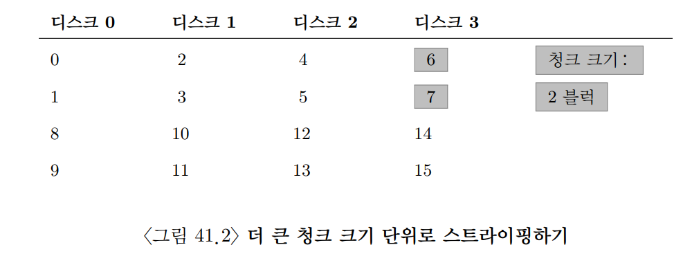
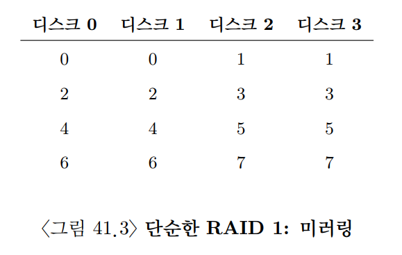
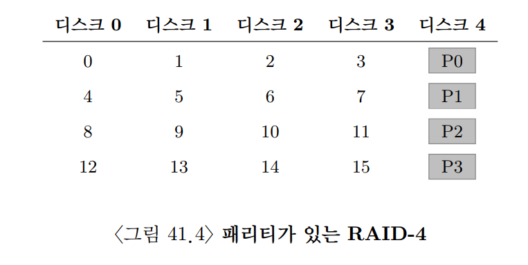
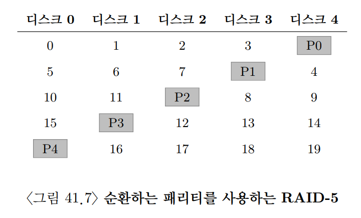
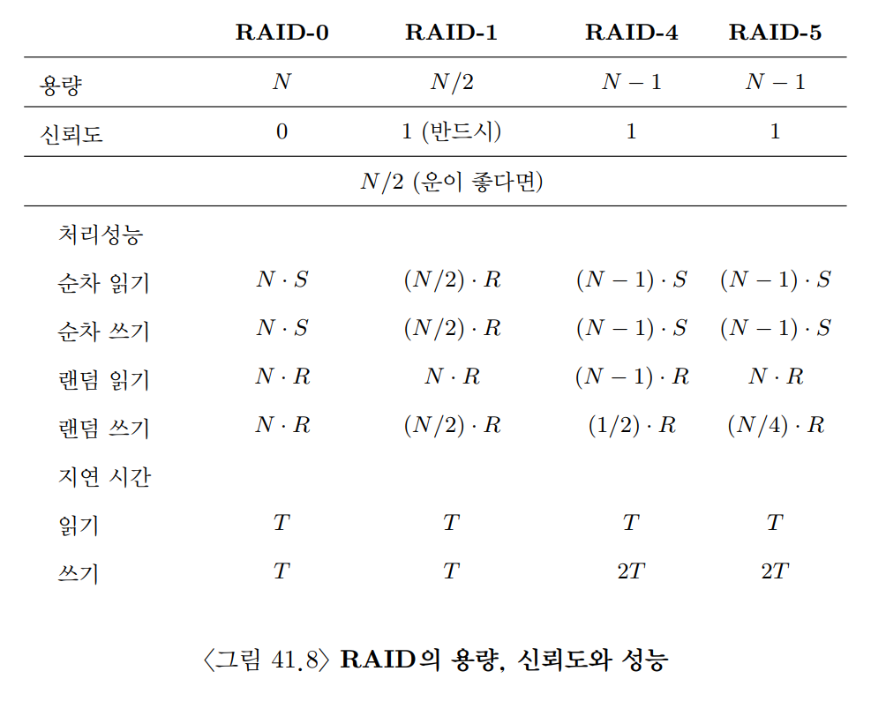

## 41. Redundant Array of Inexpensive Disk(RAID)
- RAID는 여러 개의 디스크를 하나의 큰 디스크처럼 보이게 만드는 기술이다.
- 목적은 크게 세 가지이다.
  - `성능`: 여러 디스크를 병렬로 사용해 I/O 처리량을 높인다.
  - `용량`: 여러 디스크의 공간을 묶어 더 큰 저장 공간을 제공한다.
  - `신뢰성`: 일부 디스크가 고장 나도 데이터를 잃지 않도록 중복 정보를 저장한다.
- 외부에서 보면 RAID는 하나의 디스크처럼 보인다.
  - 운영체제와 파일 시스템은 RAID 내부의 디스크 개수를 직접 알 필요가 없다.
  - 읽기/쓰기 가능한 블록들의 배열처럼 접근하면 된다.
- 내부적으로는 여러 디스크, 메모리, 컨트롤러, 펌웨어가 함께 동작한다.
- RAID는 운영체제나 파일 시스템을 크게 바꾸지 않고도 성능, 용량, 신뢰성을 개선할 수 있다는 장점이 있다.

### 1. 인터페이스와 RAID 내부
- 파일 시스템이 RAID에 논리적 I/O를 요청하면 RAID는 내부에서 이를 물리적 I/O로 변환한다.
- 예를 들어 파일 시스템이 논리 블록 100번을 읽으라고 요청하면 RAID는 다음을 계산한다.
  - 어느 디스크에 접근해야 하는가?
  - 어느 위치의 블록을 읽어야 하는가?
  - 패리티나 미러 데이터가 필요한가?
- 실제 발생하는 물리적 I/O의 수와 위치는 RAID 레벨에 따라 달라진다.

#### RAID 내부 구성
- RAID는 보통 별도의 하드웨어 장치처럼 구성될 수 있다.
- 호스트와는 SCSI, SATA 같은 표준 인터페이스로 연결된다.
- 내부에는 다음 요소가 있을 수 있다.
  - 여러 개의 디스크
  - RAID 동작을 관리하는 마이크로컨트롤러
  - 펌웨어
  - 읽기/쓰기 버퍼로 쓰이는 DRAM
  - 안전한 쓰기 버퍼링을 위한 비휘발성 메모리
  - 패리티 계산을 위한 전용 회로
- 소프트웨어 RAID도 가능하다.
  - 운영체제가 RAID 알고리즘을 직접 수행한다.
  - 저렴하지만 CPU 사용량, 일관성 유지, 장애 복구 측면에서 주의가 필요하다.

### 2. 결함 모델
- RAID를 평가하려면 어떤 고장을 견딜 것인지 먼저 정의해야 한다.
- 이 장에서는 가장 단순한 `고장 시 멈춤(fail-stop)` 모델을 가정한다.
- 고장 시 멈춤 모델에서 디스크는 두 상태 중 하나이다.
  - 정상: 모든 블록을 읽고 쓸 수 있다.
  - 고장: 디스크 전체를 사용할 수 없다.
- 이 모델은 고장이 발생하면 시스템이 그 사실을 알 수 있다고 가정한다.
- 여기서는 다음과 같은 더 복잡한 고장은 다루지 않는다.
  - 특정 섹터만 읽을 수 없는 부분 고장
  - 잘못된 데이터를 조용히 반환하는 silent corruption
  - 블록 훼손
  - 여러 디스크의 동시 고장

### 3. RAID의 평가 방법
- RAID 설계를 비교할 때는 세 가지 기준을 사용한다.

#### 용량
- RAID 사용자가 실제로 사용할 수 있는 저장 공간이다.
- 디스크가 `N`개이고 각 디스크 용량이 `B`라면 전체 원시 용량은 다음과 같다.

```text
Raw Capacity = N x B
```

- RAID 레벨에 따라 이 중 일부는 중복 정보 저장에 사용된다.

#### 신뢰성
- 몇 개의 디스크 고장을 견딜 수 있는지 나타낸다.
- 예를 들어 RAID-0은 고장을 견디지 못한다.
- RAID-1, RAID-4, RAID-5는 일반적으로 디스크 1개 고장을 견딜 수 있다.

#### 성능
- 성능은 워크로드에 따라 달라진다.
- 여기서는 주로 다음 네 가지를 본다.
  - 순차 읽기
  - 순차 쓰기
  - 랜덤 읽기
  - 랜덤 쓰기
- 성능을 분석할 때 사용하는 기호는 다음과 같다.

```text
N: 디스크 개수
B: 디스크 하나의 용량
S: 디스크 하나의 순차 대역폭
R: 디스크 하나의 랜덤 I/O 처리율
```

### 4. RAID 레벨 0: 스트라이핑
- RAID-0은 데이터를 여러 디스크에 나누어 저장하는 방식이다.
- 중복 정보를 저장하지 않기 때문에 엄밀히 말하면 신뢰성을 제공하는 RAID는 아니다.
- 하지만 성능과 용량의 기준점으로 중요하다.

#### 스트라이핑
- 블록들을 여러 디스크에 라운드 로빈 방식으로 배치한다.
- 예를 들어 디스크가 4개라면 연속된 블록이 여러 디스크에 퍼진다.
- 같은 행에 놓인 블록 묶음을 `스트라이프(stripe)`라고 한다.
- 한 디스크에 연속으로 배치되는 데이터 단위를 `청크(chunk)`라고 한다.



#### 1. 청크 크기
- 청크 크기는 RAID 성능에 큰 영향을 준다.
- 작은 청크 크기
  - 하나의 파일이 여러 디스크에 더 잘 분산된다.
  - 단일 큰 요청에서도 병렬성이 높아질 수 있다.
  - 하지만 디스크가 자주 바뀌므로 관리 오버헤드가 늘 수 있다.
- 큰 청크 크기
  - 하나의 요청이 적은 수의 디스크에만 걸칠 수 있다.
  - 단일 요청의 병렬성은 줄어든다.
  - 대신 각 디스크에서 더 긴 순차 I/O가 가능해 위치 찾기 비용이 줄어들 수 있다.
- 최적의 청크 크기는 워크로드에 따라 다르다.
  - 큰 순차 파일을 많이 다루는가?
  - 작은 랜덤 요청이 많은가?
  - 동시에 여러 요청이 들어오는가?

#### 2. RAID-0 분석
- `용량`

```text
Usable Capacity = N x B
```

- 모든 디스크 공간을 데이터 저장에 사용하므로 용량 효율은 가장 좋다.
- `신뢰성`
  - 디스크 하나라도 고장 나면 전체 데이터가 손실될 수 있다.
  - 중복 정보가 없기 때문이다.
- `성능`
  - 여러 디스크를 동시에 사용할 수 있으므로 성능이 좋다.
  - 순차 대역폭은 이상적으로 다음과 같다.

```text
Sequential Bandwidth = N x S
```

- 랜덤 I/O도 여러 디스크가 나누어 처리할 수 있어 처리량이 높아진다.

#### 3. RAID 성능 평가 기준
- RAID 성능은 두 관점으로 볼 수 있다.
- 첫째, `지연 시간(latency)`이다.
  - 하나의 논리적 I/O 요청을 끝내는 데 걸리는 시간이다.
  - 단일 요청이 얼마나 병렬적으로 처리되는지 이해하는 데 도움이 된다.
- 둘째, `정상 상태 처리량(steady-state throughput)`이다.
  - 여러 요청이 계속 들어올 때 전체 RAID가 처리할 수 있는 대역폭이다.
  - RAID는 고성능 저장 장치로 사용되므로 처리량이 특히 중요하다.
- 워크로드도 구분해야 한다.
  - `순차 워크로드`: 연속된 큰 데이터를 읽거나 쓴다.
  - `랜덤 워크로드`: 작은 요청이 디스크의 여러 위치에 흩어져 발생한다.
- 순차 접근은 디스크가 가장 잘 처리하는 패턴이다.
- 랜덤 접근은 탐색과 회전 지연이 반복되어 비용이 크다.

### 5. RAID 레벨 1: 미러링
- RAID-1은 같은 데이터를 둘 이상의 디스크에 복사해 저장한다.
- 한 블록에 대해 원본과 사본이 서로 다른 디스크에 존재한다.
- 읽을 때는 둘 중 하나를 선택해 읽을 수 있다.
- 쓸 때는 모든 사본에 데이터를 써야 한다.



#### RAID-10
- 미러링과 스트라이핑을 함께 사용하는 방식도 있다.
- RAID-10 또는 RAID 1+0은 미러링된 디스크 쌍을 스트라이핑한다.
- 즉, RAID-1로 신뢰성을 얻고 RAID-0으로 병렬성을 얻는다.

#### 1. RAID-1 분석
- `용량`
  - 미러링을 2개 사본으로 한다면 사용 가능한 용량은 절반이다.

```text
Usable Capacity = (N x B) / 2
```

- `신뢰성`
  - 디스크 하나가 고장 나도 사본이 남아 있으면 데이터를 읽을 수 있다.
  - 단, 같은 미러 쌍의 모든 디스크가 고장 나면 데이터가 손실된다.
- `읽기 성능`
  - 읽기는 원본이나 사본 중 더 적절한 디스크에서 수행할 수 있다.
  - 랜덤 읽기에서는 모든 디스크를 활용할 수 있어 성능이 좋다.
- `쓰기 성능`
  - 쓰기는 모든 사본에 반영되어야 한다.
  - 두 디스크에 병렬로 쓰더라도, 느린 쪽 쓰기가 끝날 때까지 기다려야 한다.
  - 순차 쓰기 대역폭은 대략 전체 디스크 대역폭의 절반 수준이 된다.

```text
Sequential Write Bandwidth ≒ (N / 2) x S
Random Read Throughput ≒ N x R
Random Write Throughput ≒ (N / 2) x R
```

- RAID-1은 랜덤 읽기 성능과 신뢰성이 중요한 환경에 적합하다.

### 6. RAID 레벨 4: 패리티를 이용한 공간 절약
- RAID-4는 데이터 디스크들과 하나의 전용 패리티 디스크를 사용한다.
- 패리티는 데이터 복구를 위한 중복 정보이다.
- 각 스트라이프마다 데이터 블록들과 해당 데이터들의 패리티 블록이 존재한다.
- 디스크 하나가 고장 나면 남은 데이터와 패리티를 이용해 고장 난 데이터를 복구할 수 있다.



#### 패리티와 XOR
- RAID-4는 보통 XOR을 이용해 패리티를 계산한다.
- XOR의 중요한 성질은 다음과 같다.

```text
A XOR B XOR B = A
```

- 즉, 어떤 값 하나가 사라져도 나머지 값들과 패리티를 XOR하면 사라진 값을 복원할 수 있다.
- 예를 들어 데이터 블록 `D0`, `D1`, `D2`와 패리티 `P`가 있을 때 다음과 같이 계산한다.

```text
P = D0 XOR D1 XOR D2
```

- 만약 `D1`이 있는 디스크가 고장 나면 다음처럼 복구한다.

```text
D1 = D0 XOR D2 XOR P
```

#### 1. RAID-4 분석
- `용량`
  - 디스크 하나를 패리티 전용으로 사용한다.

```text
Usable Capacity = (N - 1) x B
```

- `신뢰성`
  - 디스크 1개 고장을 견딜 수 있다.
  - 디스크 2개가 동시에 고장 나면 일반적인 RAID-4로는 복구할 수 없다.
- `순차 읽기`
  - 데이터 디스크를 병렬로 읽을 수 있다.

```text
Sequential Read Bandwidth ≒ (N - 1) x S
```

- `순차 쓰기`
  - 큰 순차 쓰기에서는 전체 스트라이프를 한 번에 쓰는 `full-stripe write`가 가능하다.
  - 새 데이터 전체로 패리티를 다시 계산하고 데이터와 패리티를 함께 쓴다.

```text
Sequential Write Bandwidth ≒ (N - 1) x S
```

- `랜덤 읽기`
  - 데이터 디스크만 읽기에 사용된다.

```text
Random Read Throughput ≒ (N - 1) x R
```

#### 작은 쓰기 문제
- RAID-4의 핵심 문제는 작은 랜덤 쓰기이다.
- 데이터 블록 하나만 수정해도 해당 스트라이프의 패리티도 함께 수정해야 한다.
- 패리티 갱신 방식은 두 가지가 있다.

#### 가산적 패리티
- 새 패리티를 만들기 위해 같은 스트라이프의 모든 데이터 블록을 읽는다.
- 새 데이터와 함께 XOR하여 새 패리티를 계산한다.
- 디스크가 많을수록 읽어야 할 블록이 많아져 비용이 커진다.

#### 감산적 패리티
- 기존 데이터, 새 데이터, 기존 패리티만 이용해 새 패리티를 계산한다.

```text
NewParity = OldParity XOR OldData XOR NewData
```

- 작은 쓰기 하나를 처리하려면 보통 다음 작업이 필요하다.
  - 기존 데이터 읽기
  - 기존 패리티 읽기
  - 새 데이터 쓰기
  - 새 패리티 쓰기
- 이를 작은 쓰기 문제(small write problem)라고 한다.
- RAID-4에서는 모든 패리티 쓰기가 전용 패리티 디스크에 몰리므로 패리티 디스크가 병목이 된다.

### 7. RAID 레벨 5: 순환 패리티
- RAID-5는 RAID-4와 비슷하지만 패리티 블록을 특정 디스크 하나에만 두지 않는다.
- 패리티 블록을 디스크들에 순환 배치한다.
- 목적은 RAID-4의 패리티 디스크 병목을 줄이는 것이다.



#### 1. RAID-5 분석
- `용량`
  - RAID-4와 마찬가지로 전체 디스크 중 하나의 용량만큼을 패리티에 사용한다.

```text
Usable Capacity = (N - 1) x B
```

- `신뢰성`
  - 디스크 1개 고장을 견딜 수 있다.
- `순차 읽기/쓰기`
  - RAID-4와 비슷하게 동작한다.
  - 큰 순차 쓰기에서는 full-stripe write가 가능하다.
- `랜덤 읽기`
  - 패리티가 여러 디스크에 분산되어 있어 모든 디스크를 더 고르게 활용할 수 있다.
- `랜덤 쓰기`
  - 작은 쓰기는 여전히 데이터와 패리티를 함께 갱신해야 한다.
  - 하지만 패리티 쓰기가 여러 디스크에 분산되므로 RAID-4보다 병렬성이 좋다.

```text
RAID-5의 핵심:
RAID-4의 용량 효율과 신뢰성을 유지하면서 패리티 병목을 완화한다.
```

### 8. RAID 비교: 정리
- RAID 레벨마다 목표와 장단점이 다르다.

| RAID | 유효 용량 | 고장 감내 | 장점 | 단점 |
| --- | --- | --- | --- | --- |
| RAID-0 | `N x B` | 없음 | 최고 수준의 용량 효율과 성능 | 디스크 하나만 고장 나도 데이터 손실 |
| RAID-1 | `(N x B) / 2` | 보통 1개 이상 | 높은 신뢰성, 좋은 랜덤 읽기 | 용량 비용이 큼 |
| RAID-4 | `(N - 1) x B` | 1개 | 좋은 용량 효율, 패리티 복구 | 전용 패리티 디스크 병목 |
| RAID-5 | `(N - 1) x B` | 1개 | 좋은 용량 효율, 패리티 병목 완화 | 작은 랜덤 쓰기 비용 |

- 성능만 원하고 신뢰성이 필요 없다면 RAID-0이 가장 빠르다.
- 랜덤 I/O 성능과 신뢰성이 모두 중요하다면 RAID-1 또는 RAID-10이 유리하다.
- 용량 효율과 신뢰성이 중요하다면 RAID-5가 좋은 선택이다.
- 항상 큰 순차 I/O가 주된 워크로드라면 RAID-5도 높은 효율을 낼 수 있다.
- 작은 랜덤 쓰기가 많다면 패리티 기반 RAID는 쓰기 비용이 커질 수 있다.



### 9. RAID와 관련된 다른 주제들
- RAID에는 이 장에서 다룬 레벨 외에도 다양한 설계가 있다.
  - RAID-2
  - RAID-3
  - RAID-6
  - RAID-10
- RAID-6은 두 개의 독립적인 패리티 정보를 사용해 디스크 2개 고장까지 견딜 수 있다.
- 일부 RAID 시스템은 `핫 스페어(hot spare)` 디스크를 둔다.
  - 평소에는 사용하지 않다가 디스크가 고장 나면 즉시 대체 디스크로 사용한다.
  - 이후 RAID는 남은 디스크의 데이터를 이용해 스페어 디스크에 데이터를 재구성한다.
- 고장 후 복구 과정은 성능에 큰 영향을 준다.
  - 정상 요청을 처리하면서 동시에 재구성 작업을 해야 하기 때문이다.
  - 재구성 중 또 다른 디스크가 고장 나면 데이터 손실 위험이 커진다.
- 실제 시스템에서는 단순한 fail-stop 모델보다 복잡한 결함도 고려해야 한다.
  - 잠재된 섹터 오류
  - 블록 훼손
  - 잘못된 데이터 반환
- RAID는 하드웨어로도 구현할 수 있고 소프트웨어로도 구현할 수 있다.
  - 하드웨어 RAID는 전용 컨트롤러와 캐시를 사용할 수 있다.
  - 소프트웨어 RAID는 저렴하고 유연하지만 운영체제가 더 많은 일을 해야 한다.
- RAID는 백업을 대체하지 않는다.
  - RAID는 디스크 고장에 대한 가용성을 높이는 기술이다.
  - 실수로 삭제한 파일, 소프트웨어 버그, 랜섬웨어, 데이터 훼손까지 자동으로 해결하지는 못한다.

## 42. 막간: 파일과 디렉터리

### 1. 파일과 디렉터리
- 저장 장치 가상화에서 핵심이 되는 개념은 `파일`과 `디렉터리`이다.

#### 파일
- 파일은 읽고 쓸 수 있는 `연속된 바이트 배열`이다.
- 파일 시스템은 보통 파일 내부 구조를 해석하지 않는다.
  - 예를 들어 파일이 텍스트인지, 이미지인지, 실행 파일인지는 파일 시스템 입장에서 중요하지 않다.
  - 파일 시스템의 역할은 데이터를 안전하게 저장하고, 요청이 오면 같은 데이터를 다시 돌려주는 것이다.
- 각 파일에는 저수준 이름이 있다.
  - 사용자는 보통 이 이름을 직접 다루지 않는다.
  - 유닉스 계열 시스템에서는 이 저수준 이름을 `아이노드 번호(inode number)`라고 부른다.

#### 디렉터리
- 디렉터리도 파일처럼 아이노드 번호를 가진다.
- 하지만 일반 파일과 달리 디렉터리의 내용은 정해진 구조를 가진다.
- 디렉터리는 다음과 같은 항목들의 목록이다.

```text
<사용자가 읽을 수 있는 이름, 아이노드 번호>
```

- 즉, 디렉터리는 이름과 실제 파일 객체를 연결하는 테이블이다.
- 디렉터리 항목은 일반 파일을 가리킬 수도 있고, 다른 디렉터리를 가리킬 수도 있다.
- 디렉터리 안에 디렉터리를 넣으면 계층 구조를 만들 수 있다.

```text
/
|-- home
|   `-- user
|       `-- notes.txt
`-- tmp
```

- 전체 디렉터리 계층은 루트 디렉터리(`/`)에서 시작한다.
- 경로명은 루트에서 시작해 여러 디렉터리를 따라가며 파일을 찾는 방법이다.
- 파일 이름의 확장자(`.txt`, `.jpg`, `.c`)는 대부분 관례일 뿐이다.
  - 파일 시스템이 반드시 그 확장자에 맞는 내부 형식을 보장하는 것은 아니다.

### 2. 파일 시스템 인터페이스
- 유닉스 파일 시스템 인터페이스는 파일과 디렉터리를 다루기 위한 시스템 콜들을 제공한다.
- 대표적인 시스템 콜은 다음과 같다.

| 작업 | 시스템 콜 |
| --- | --- |
| 파일 열기/생성 | `open()` |
| 파일 읽기 | `read()` |
| 파일 쓰기 | `write()` |
| 파일 위치 이동 | `lseek()` |
| 파일 닫기 | `close()` |
| 디스크에 강제 반영 | `fsync()` |
| 파일 이름 변경 | `rename()` |
| 파일 정보 확인 | `stat()`, `fstat()` |
| 파일 이름 제거 | `unlink()` |
| 디렉터리 생성 | `mkdir()` |
| 디렉터리 삭제 | `rmdir()` |
| 링크 생성 | `link()`, `symlink()` |

- 이 장의 핵심은 파일 시스템을 구현하는 방법이 아니라, 운영체제가 사용자에게 제공하는 파일 시스템 인터페이스를 이해하는 것이다.

### 3. 파일의 생성
- 파일은 `open()` 시스템 콜로 만들 수 있다.
- `open()`에 `O_CREAT` 플래그를 전달하면 파일이 없을 때 새 파일을 생성한다.

```c
int fd = open("foo.txt", O_CREAT | O_WRONLY | O_TRUNC, 0644);
```

- 주요 플래그는 다음과 같다.
  - `O_CREAT`: 파일이 없으면 생성한다.
  - `O_WRONLY`: 쓰기 전용으로 연다.
  - `O_RDONLY`: 읽기 전용으로 연다.
  - `O_RDWR`: 읽기와 쓰기 모두 가능하게 연다.
  - `O_TRUNC`: 파일이 이미 있으면 크기를 0바이트로 줄여 기존 내용을 삭제한다.
- `open()`의 중요한 반환값은 `파일 디스크립터(file descriptor)`이다.
  - 파일 디스크립터는 프로세스마다 관리되는 작은 정수이다.
  - 운영체제는 이 정수를 보고 어떤 열린 파일에 접근해야 하는지 판단한다.
  - 프로그래머 입장에서는 열린 파일 객체를 가리키는 핸들처럼 생각할 수 있다.

### 4. 파일의 읽기와 쓰기
- `read()`와 `write()`는 파일 디스크립터를 이용해 열린 파일에 접근한다.

```c
ssize_t read(int fd, void *buf, size_t count);
ssize_t write(int fd, const void *buf, size_t count);
```

- `read()`의 인자
  - `fd`: 읽을 파일 디스크립터
  - `buf`: 읽은 데이터를 저장할 버퍼
  - `count`: 최대 몇 바이트를 읽을지 나타내는 크기
- `write()`의 인자
  - `fd`: 쓸 대상 파일 디스크립터
  - `buf`: 쓸 데이터가 들어 있는 버퍼
  - `count`: 몇 바이트를 쓸지 나타내는 크기

#### `cat` 명령의 동작 예
- `strace`를 사용하면 `cat foo`가 내부적으로 어떤 시스템 콜을 호출하는지 볼 수 있다.

```text
open("foo", O_RDONLY|O_LARGEFILE) = 3
read(3, "hello\n", 4096) = 6
write(1, "hello\n", 6) = 6
hello
read(3, "", 4096) = 0
close(3) = 0
```

- 동작 흐름은 다음과 같다.
  - `open()`으로 `foo`를 읽기 전용으로 연다.
  - 반환된 파일 디스크립터는 `3`이다.
  - `read(3, ...)`으로 파일 내용을 읽는다.
  - `write(1, ...)`으로 읽은 내용을 표준 출력에 쓴다.
  - 다시 `read()`했을 때 `0`이 반환되면 파일 끝(EOF)에 도달했다는 뜻이다.
  - 마지막으로 `close(3)`으로 파일을 닫는다.
- 파일 디스크립터 `0`, `1`, `2`는 보통 프로세스 시작 시 이미 열려 있다.

| 파일 디스크립터 | 의미 |
| --- | --- |
| `0` | 표준 입력 |
| `1` | 표준 출력 |
| `2` | 표준 에러 |

### 5. 비 순차적 읽기와 쓰기
- 파일은 순차적으로만 접근할 수 있는 것이 아니다.
- 특정 위치부터 읽거나 쓰고 싶을 때는 `lseek()`을 사용한다.

```c
off_t lseek(int fd, off_t offset, int whence);
```

- `fd`: 위치를 변경할 열린 파일
- `offset`: 이동할 위치 또는 이동할 거리
- `whence`: `offset`을 해석하는 기준

| `whence` | 의미 |
| --- | --- |
| `SEEK_SET` | 파일 시작 지점 기준 |
| `SEEK_CUR` | 현재 오프셋 기준 |
| `SEEK_END` | 파일 끝 기준 |

- 운영체제는 열린 파일마다 `현재 오프셋(current offset)`을 관리한다.
- 현재 오프셋은 다음 읽기 또는 쓰기가 시작될 위치이다.
- 오프셋은 두 방식으로 바뀐다.
  - `read()` 또는 `write()`로 `N`바이트를 처리하면 현재 오프셋이 `N`만큼 증가한다.
  - `lseek()`을 호출하면 현재 오프셋이 명시적으로 변경된다.
- 여기서 `lseek()`의 seek는 디스크 암을 움직이는 물리적 탐색과 직접적인 관계가 없다.
  - `lseek()`은 커널 내부의 오프셋 값을 바꾸는 호출이다.
  - 실제 디스크 헤드 이동 여부는 이후 I/O 요청의 위치와 디스크 상태에 따라 달라진다.

### 6. fsync()를 이용한 즉시 기록
- `write()`가 리턴되었다고 해서 데이터가 즉시 디스크에 기록되었다는 뜻은 아니다.
- 파일 시스템은 성능을 위해 쓰기 데이터를 메모리에 잠시 모아 둘 수 있다.
  - 이를 버퍼링이라고 한다.
  - 응용 프로그램 입장에서는 쓰기가 끝난 것처럼 보이지만, 전원이 갑자기 꺼지면 아직 디스크에 내려가지 않은 데이터가 사라질 수 있다.
- 더 강한 영속성 보장이 필요할 때 `fsync()`를 사용한다.
- `fsync(fd)`는 해당 파일의 더티 데이터를 디스크에 강제로 기록하고, 기록이 끝난 뒤 리턴한다.

```c
int fd = open("foo", O_CREAT | O_WRONLY | O_TRUNC, 0644);
assert(fd >= 0);

int rc = write(fd, buffer, size);
assert(rc == size);

rc = fsync(fd);
assert(rc == 0);
```

- 단, 새 파일을 만들었거나 파일 이름을 바꾼 경우에는 파일 데이터뿐 아니라 디렉터리 메타데이터의 영속성도 고려해야 한다.
- 그래서 실제로는 파일의 `fsync()`뿐 아니라 필요하면 부모 디렉터리도 `fsync()`해야 더 강한 보장을 얻을 수 있다.

### 7. 파일 이름 변경
- `rename()`은 파일 이름을 바꾸는 시스템 콜이다.
- 중요한 특징은 시스템 크래시와 관련해 원자적으로 동작하도록 설계되었다는 점이다.
  - 이름 변경 중 크래시가 발생해도 파일 이름은 보통 이전 이름 또는 새 이름 중 하나로 남는다.
  - 중간 상태가 관찰되지 않는다.
- 이 특성 때문에 `rename()`은 파일을 원자적으로 갱신할 때 자주 사용된다.

```c
int fd = open("foo.txt.tmp", O_WRONLY | O_CREAT | O_TRUNC, 0644);
write(fd, buffer, size);
fsync(fd);
close(fd);
rename("foo.txt.tmp", "foo.txt");
```

- 일반적인 흐름은 다음과 같다.
  - 임시 파일을 만든다.
  - 새 내용을 임시 파일에 쓴다.
  - `fsync()`로 임시 파일 내용을 디스크에 반영한다.
  - `rename()`으로 임시 파일을 원래 파일 이름으로 바꾼다.
- 이렇게 하면 기존 파일을 직접 덮어쓰는 것보다 크래시에 더 강한 갱신 패턴을 만들 수 있다.

### 8. 파일 정보 추출
- 파일 시스템은 파일 데이터뿐 아니라 파일에 대한 정보도 저장한다.
- 이러한 정보를 `메타데이터(metadata)`라고 한다.
- 대표적인 메타데이터는 다음과 같다.
  - 파일 크기
  - 소유자
  - 접근 권한
  - 생성/수정/접근 시간
  - 링크 수
  - 파일이 저장된 디스크 블록 정보
- 메타데이터는 보통 아이노드에 저장된다.
- 파일 메타데이터는 `stat()` 또는 `fstat()`로 확인할 수 있다.

```c
struct stat st;
stat("foo.txt", &st);
printf("size: %lld\n", (long long) st.st_size);
```

### 9. 파일 삭제
- 파일 삭제에는 `unlink()`를 사용한다.

```c
int rc = unlink("foo.txt");
```

- 이름이 `unlink`인 이유는 파일 자체를 즉시 삭제한다기보다, 디렉터리에서 파일 이름과 아이노드의 연결을 제거하기 때문이다.
- 어떤 파일을 가리키는 이름이 더 이상 없고, 열린 파일 디스크립터도 없다면 파일 시스템은 아이노드와 데이터 블록을 해제한다.

### 10. 디렉터리 생성
- 디렉터리는 `mkdir()`로 생성한다.

```c
mkdir("dir", 0755);
```

- 디렉터리는 일반 파일처럼 직접 `write()`할 수 없다.
- 디렉터리의 내용은 파일 시스템 메타데이터이므로 시스템 콜을 통해 간접적으로만 변경된다.
  - 파일 생성
  - 파일 삭제
  - 링크 생성
  - 디렉터리 생성/삭제
- 새 디렉터리에는 기본적으로 두 항목이 들어 있다.
  - `.`: 자기 자신을 가리킨다.
  - `..`: 부모 디렉터리를 가리킨다.

### 11. 디렉터리 읽기
- 디렉터리를 읽을 때는 일반 파일처럼 `read()`를 직접 사용하지 않는다.
- 보통 다음 라이브러리 함수를 사용한다.
  - `opendir()`: 디렉터리를 연다.
  - `readdir()`: 디렉터리 항목을 하나씩 읽는다.
  - `closedir()`: 디렉터리를 닫는다.

```c
int main(int argc, char *argv[]) {
  DIR *dp = opendir(".");
  assert(dp != NULL);

  struct dirent *d;
  while ((d = readdir(dp)) != NULL) {
    printf("%d %s\n", (int) d->d_ino, d->d_name);
  }

  closedir(dp);
  return 0;
}
```

- `readdir()`로 얻을 수 있는 정보는 제한적이다.
- 파일 크기, 권한, 수정 시간 같은 자세한 정보가 필요하면 각 항목에 대해 `stat()`을 추가로 호출한다.

### 12. 디렉터리 삭제하기
- 디렉터리는 `rmdir()`로 삭제한다.

```c
rmdir("dir");
```

- `rmdir()`은 비어 있는 디렉터리만 삭제할 수 있다.
- 비어 있지 않은 디렉터리를 한 번에 지우면 많은 파일을 실수로 삭제할 수 있기 때문에, 기본 시스템 콜은 보수적으로 동작한다.
- 디렉터리에 항목이 남아 있으면 `rmdir()`은 실패한다.

### 13. 하드 링크
- 하드 링크는 같은 아이노드를 가리키는 새로운 이름을 만드는 기능이다.
- `link(oldpath, newpath)`는 기존 파일에 대한 새 디렉터리 항목을 만든다.

```c
link("file", "file2");
```

- 중요한 점은 파일 데이터가 복사되지 않는다는 것이다.
- `file`과 `file2`는 서로 다른 이름이지만 같은 아이노드를 가리킨다.
- 따라서 둘 중 어느 이름으로 접근해도 같은 파일 내용을 보게 된다.

```bash
echo hello > file
cat file
hello

ln file file2
cat file2
hello
```

- 하드 링크를 이해하면 `unlink()`라는 이름도 자연스럽다.
  - `unlink("file")`은 `file`이라는 이름과 아이노드의 연결을 끊는다.
  - 같은 아이노드를 가리키는 다른 이름이 남아 있으면 파일 데이터는 삭제되지 않는다.
  - 아이노드의 참조 횟수(link count)가 0이 되면 그때 실제 데이터 블록이 해제된다.
- 하드 링크 생성 후에는 원래 이름과 새 이름 사이에 본질적인 차이가 없다.
  - 둘 다 같은 아이노드로 가는 디렉터리 항목일 뿐이다.

### 14. 심볼릭 링크
- 하드 링크에는 제한이 있다.
  - 일반적으로 디렉터리에 대한 하드 링크는 만들 수 없다.
  - 서로 다른 파일 시스템이나 디스크 파티션을 가로질러 하드 링크를 만들 수 없다.
- 이런 제한을 완화하기 위해 `심볼릭 링크(symbolic link)`가 사용된다.
- 심볼릭 링크는 `ln -s`로 만든다.

```bash
echo hello > file
ln -s file file2
cat file2
hello
```

- 심볼릭 링크는 하드 링크와 다르게 독립된 파일이다.
- 심볼릭 링크 파일 안에는 대상 파일의 경로 문자열이 들어 있다.
- 따라서 심볼릭 링크는 다른 파일 시스템의 파일도 가리킬 수 있고, 디렉터리도 가리킬 수 있다.
- 하지만 대상 파일이 삭제되면 문제가 생긴다.
  - 심볼릭 링크는 여전히 남아 있지만, 가리키는 대상이 없다.
  - 이런 상태를 `dangling reference`라고 부른다.

| 구분 | 하드 링크 | 심볼릭 링크 |
| --- | --- | --- |
| 가리키는 대상 | 같은 아이노드 | 경로 문자열 |
| 파일 데이터 복사 | 없음 | 없음 |
| 다른 파일 시스템 연결 | 불가 | 가능 |
| 디렉터리 연결 | 일반적으로 불가 | 가능 |
| 대상 삭제 시 | 다른 하드 링크가 있으면 데이터 유지 | 깨진 링크가 될 수 있음 |

### 15. 파일 시스템 생성과 마운트
- 디스크나 파티션을 사용하려면 먼저 파일 시스템 형식으로 초기화해야 한다.
- 이 작업은 보통 `mkfs` 도구로 수행한다.

```bash
mkfs -t ext3 /dev/sda1
```

- 위 명령은 `/dev/sda1` 파티션 위에 `ext3` 형식의 빈 파일 시스템을 만든다.
- 하지만 파일 시스템을 만들었다고 해서 곧바로 기존 디렉터리 트리에서 접근할 수 있는 것은 아니다.
- 유닉스 계열 시스템은 여러 파일 시스템을 하나의 디렉터리 트리 아래에 붙여서 사용한다.
- 이 작업을 `마운트(mount)`라고 한다.

```bash
mount -t ext3 /dev/sda1 /home/users
```

- 위 명령은 `/dev/sda1`에 있는 파일 시스템을 `/home/users` 위치에 붙인다.
- `/home/users`는 마운트 지점이 된다.
- 마운트가 끝나면 사용자는 `/home/users` 아래의 경로를 통해 새 파일 시스템의 파일에 접근할 수 있다.
- 즉, 마운트는 여러 개의 개별 파일 시스템을 하나의 큰 디렉터리 계층으로 통합하는 방법이다.

### 16. 요약
- 이 장에서는 유닉스 파일 시스템 인터페이스의 기본을 살펴보았다.
- 핵심 개념은 다음과 같다.
  - 파일은 바이트 배열이고, 디렉터리는 이름과 아이노드 번호의 매핑이다.
  - 파일 디스크립터는 열린 파일에 접근하기 위한 프로세스별 핸들이다.
  - `read()`와 `write()`는 현재 오프셋을 기준으로 동작하며, 오프셋은 `lseek()`으로 변경할 수 있다.
  - `fsync()`는 버퍼링된 데이터를 디스크에 강제로 반영한다.
  - `rename()`은 원자적 파일 갱신에 유용하다.
  - `unlink()`는 이름과 아이노드의 연결을 끊는다.
  - 하드 링크는 같은 아이노드를 가리키는 새 이름이고, 심볼릭 링크는 경로 문자열을 담은 별도 파일이다.
  - `mkfs`와 `mount`를 통해 개별 파일 시스템을 하나의 디렉터리 트리에 통합한다.
- 유닉스 파일 시스템 인터페이스는 단순해 보이지만, 영속성 보장과 크래시 일관성을 이해하려면 각 시스템 콜의 의미를 정확히 구분해야 한다.
