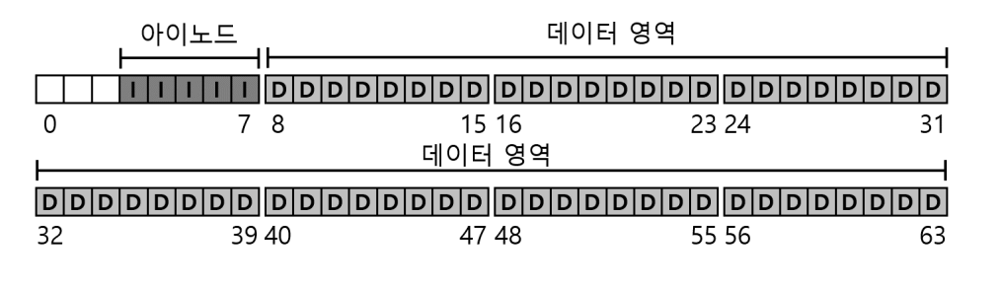
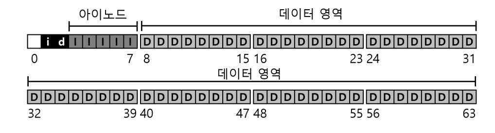
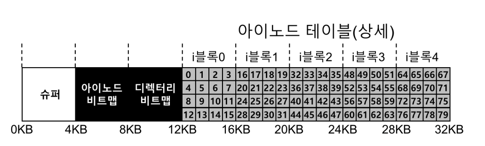
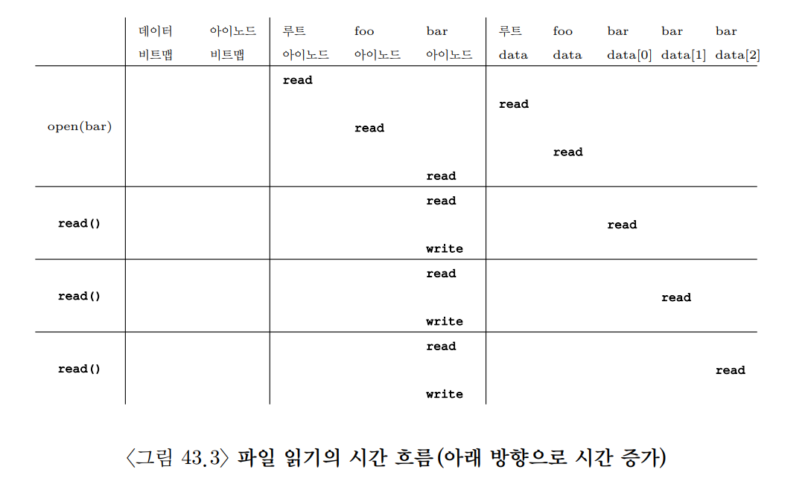
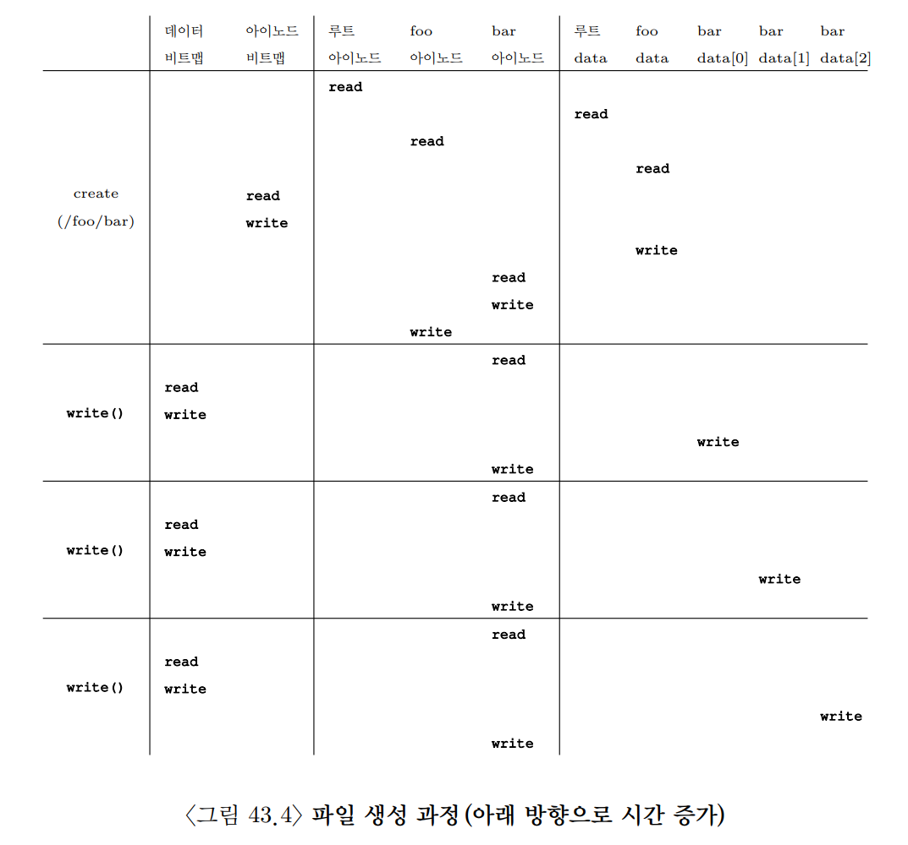
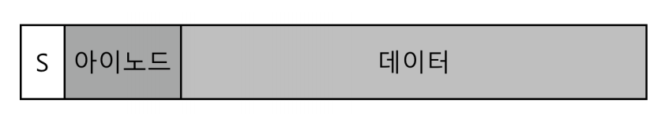
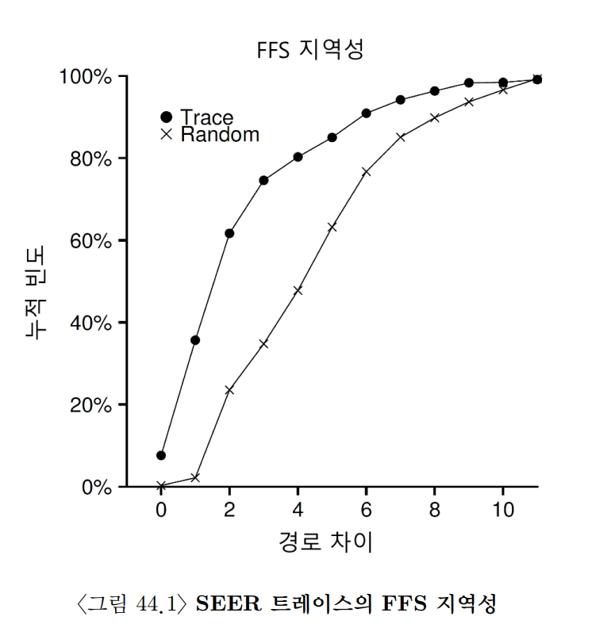
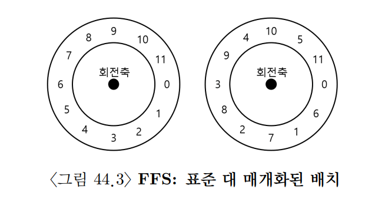
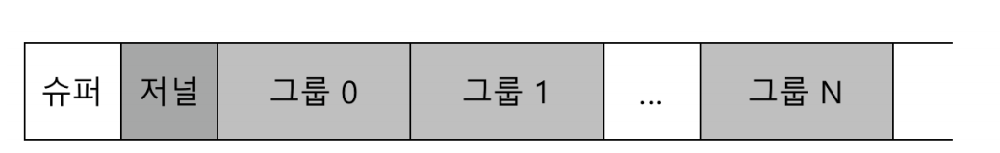

## 43. 파일 시스템 구현
- 이번 장에서는 `vsfs(Very Simple File System)`라는 아주 단순한 파일 시스템을 통해 파일 시스템 구현 방식을 살펴본다.
- vsfs는 실제 유닉스 파일 시스템을 단순화한 모델이다.
  - 디스크 자료 구조가 어떻게 배치되는지
  - 파일과 디렉터리가 어떻게 표현되는지
  - `open()`, `read()`, `write()` 같은 시스템 콜이 내부 자료 구조와 어떻게 연결되는지
  - 빈 공간과 캐시는 어떻게 관리되는지
- 파일 시스템은 순수한 소프트웨어이다.
- 구현 방식에는 정답이 하나만 있는 것이 아니기 때문에 AFS, FFS, ext 계열, XFS, ZFS처럼 다양한 파일 시스템이 존재한다.

### 1. 생각하는 방법
- 파일 시스템은 두 관점으로 나누어 이해하면 좋다.

#### 자료 구조
- 파일 시스템이 디스크 위에 어떤 정보를 저장하는지 보는 관점이다.
- 대표적인 자료 구조는 다음과 같다.
  - 파일 데이터를 저장하는 데이터 블록
  - 파일 메타데이터를 저장하는 아이노드
  - 아이노드와 데이터 블록의 사용 여부를 나타내는 비트맵
  - 파일 시스템 전체 정보를 담는 슈퍼블록
  - 이름과 아이노드 번호를 연결하는 디렉터리
- 단순한 파일 시스템은 배열과 비트맵 같은 간단한 자료 구조를 사용한다.
- XFS 같은 파일 시스템은 B-tree처럼 더 복잡한 트리 기반 자료 구조를 사용하기도 한다.

#### 접근 방법
- 프로세스가 호출하는 시스템 콜이 파일 시스템 자료 구조를 어떻게 읽고 쓰는지 보는 관점이다.
- 예를 들어 `open("/foo/bar")`는 단순히 파일을 여는 호출처럼 보이지만 내부적으로는 다음 과정을 거친다.
  - 루트 디렉터리 아이노드를 읽는다.
  - 루트 디렉터리 데이터 블록에서 `foo`를 찾는다.
  - `foo` 디렉터리 아이노드를 읽는다.
  - `foo` 디렉터리 데이터 블록에서 `bar`를 찾는다.
  - `bar`의 아이노드를 읽는다.
- 즉, 파일 시스템을 이해하려면 `디스크 자료 구조`와 `시스템 콜 실행 흐름`을 함께 봐야 한다.

### 2. 전체 구성
- vsfs는 디스크 파티션을 고정 크기 블록들의 배열로 본다.
- 여기서는 블록 크기를 `4KB`로 가정한다.
- `N`개의 4KB 블록으로 이루어진 파티션은 다음과 같은 주소를 가진다.

```text
block 0, block 1, block 2, ..., block N-1
```

- 파일 시스템은 이 블록들을 여러 영역으로 나누어 사용한다.

#### 데이터 영역
- 사용자 파일의 실제 데이터가 저장되는 공간이다.
- 파일 내용, 디렉터리 내용 등이 데이터 블록에 저장된다.
- 파일 시스템에서 가장 큰 공간을 차지한다.

#### 아이노드 테이블
- 파일 시스템은 각 파일에 대한 메타데이터를 저장해야 한다.
- 이 메타데이터를 담는 핵심 자료 구조가 `아이노드(inode)`이다.
- 아이노드에는 다음 정보가 들어간다.
  - 파일 종류
  - 파일 크기
  - 소유자
  - 접근 권한
  - 생성/수정/접근 시간
  - 데이터 블록 위치
- 여러 아이노드는 배열 형태로 저장되며, 이 영역을 `아이노드 테이블(inode table)`이라고 한다.
- 아이노드 하나의 크기는 보통 128~256바이트 정도이다.
- 예를 들어 아이노드 영역에 80개의 아이노드를 저장할 수 있다면 이 파일 시스템은 최대 80개의 파일 또는 디렉터리를 만들 수 있다.



#### 비트맵
- 파일 시스템은 어떤 아이노드와 데이터 블록이 사용 중인지 알아야 한다.
- 이를 위해 vsfs는 두 개의 비트맵을 사용한다.
  - `아이노드 비트맵`: 아이노드 테이블의 각 아이노드가 사용 중인지 표시한다.
  - `데이터 비트맵`: 데이터 영역의 각 블록이 사용 중인지 표시한다.
- 비트맵은 비트들의 배열이다.
  - `0`: 비어 있음
  - `1`: 사용 중
- 예를 들어 데이터 비트맵의 5번째 비트가 1이면 데이터 블록 5번이 사용 중이라는 뜻이다.



#### 슈퍼블록
- 남은 한 블록은 보통 `슈퍼블록(superblock)`으로 사용한다.
- 슈퍼블록은 파일 시스템 전체에 대한 정보를 담는다.
  - 파일 시스템 크기
  - 아이노드 개수
  - 데이터 블록 개수
  - 아이노드 테이블 시작 위치
  - 데이터 영역 시작 위치
  - 비트맵 위치
- 운영체제가 파일 시스템을 마운트할 때 가장 먼저 읽는 중요한 정보이다.
- 슈퍼블록이 손상되면 파일 시스템 전체를 해석하기 어려워질 수 있다.
- 그래서 실제 파일 시스템은 슈퍼블록의 복사본을 여러 위치에 저장하기도 한다.

#### vsfs의 예시 배치
- 작은 vsfs 파티션은 다음처럼 구성될 수 있다.

```text
| Superblock | Inode Bitmap | Data Bitmap | Inode Table | Data Blocks |
```

- 파일 시스템을 마운트하면 운영체제는 슈퍼블록을 읽고, 이 정보를 바탕으로 각 영역의 위치를 파악한다.

### 3. 파일 구성: 아이노드
- 파일 시스템에서 가장 중요한 디스크 자료 구조는 `아이노드`이다.
- 아이노드는 `index node`의 줄임말이다.
- 각 아이노드는 `아이넘버(i-number)`라는 번호로 구분된다.
  - 앞 장에서 말한 파일의 저수준 이름이 바로 이 아이넘버이다.
- 파일 이름은 디렉터리에 저장되고, 실제 파일 메타데이터는 아이노드에 저장된다.

#### 아이노드 위치 계산
- vsfs에서는 아이넘버를 이용해 해당 아이노드가 디스크 어디에 있는지 계산할 수 있다.
- 예를 들어 다음과 같이 가정하자.
  - 블록 크기: 4KB
  - 아이노드 크기: 256바이트
  - 아이노드 테이블 시작 위치: 12KB
  - 찾고 싶은 아이노드 번호: 32

```text
아이노드 오프셋 = 아이노드 번호 x 아이노드 크기
              = 32 x 256B
              = 8192B

아이노드 위치 = 아이노드 테이블 시작 위치 + 아이노드 오프셋
             = 12KB + 8KB
             = 20KB
```

- 디스크는 보통 바이트 단위가 아니라 섹터 단위로 접근한다.
- 섹터 크기가 512바이트라면 20KB 위치는 다음 섹터에 해당한다.

```text
20KB / 512B = 40번 섹터
```

- 따라서 파일 시스템은 40번 섹터 근처를 읽어 해당 아이노드가 들어 있는 블록을 가져온다.



#### 아이노드에 저장되는 정보
- 아이노드에는 파일에 대한 메타데이터가 들어 있다.
  - 파일 종류: 일반 파일, 디렉터리, 심볼릭 링크 등
  - 파일 크기
  - 소유자와 그룹
  - 접근 권한
  - 접근 시간, 수정 시간, 변경 시간
  - 파일 데이터가 저장된 블록들의 위치
- 사용자 데이터 자체는 아이노드 안에 저장되지 않는다.
- 아이노드는 사용자 데이터를 찾기 위한 지도 역할을 한다.

#### 직접 포인터
- 파일 데이터 블록 위치를 표현하는 가장 단순한 방법은 아이노드 안에 `직접 포인터(direct pointer)`를 두는 것이다.
- 직접 포인터 하나는 데이터 블록 하나를 가리킨다.
- 예를 들어 아이노드에 직접 포인터가 12개 있으면 최대 12개의 데이터 블록을 직접 가리킬 수 있다.
- 블록 크기가 4KB라면 직접 포인터만으로 표현 가능한 최대 파일 크기는 다음과 같다.

```text
12 x 4KB = 48KB
```

- 이 방식은 작은 파일에는 빠르고 단순하지만 큰 파일을 표현하기 어렵다.

#### 1. 멀티 레벨 인덱스
- 큰 파일을 지원하기 위해 파일 시스템은 `간접 포인터(indirect pointer)`를 사용한다.
- 간접 포인터는 데이터 블록을 직접 가리키지 않는다.
- 대신 데이터 블록 포인터들이 들어 있는 `간접 블록`을 가리킨다.

```text
inode
|-- direct pointer 0 -> data block
|-- direct pointer 1 -> data block
|-- ...
`-- indirect pointer -> indirect block -> data block pointers
```

- 예를 들어 블록 크기가 4KB이고 디스크 주소 하나가 4바이트라면, 간접 블록 하나에는 1024개의 포인터를 저장할 수 있다.

```text
4KB / 4B = 1024개 포인터
```

- 아이노드에 직접 포인터 12개와 간접 포인터 1개가 있다면 최대 파일 크기는 다음과 같다.

```text
(12 + 1024) x 4KB = 4144KB
```

#### 이중 간접 포인터
- 더 큰 파일을 위해 `이중 간접 포인터(double indirect pointer)`를 사용할 수 있다.
- 이중 간접 포인터는 간접 블록들을 가리키는 블록을 가리킨다.

```text
double indirect pointer
-> block of indirect pointers
-> indirect block
-> data block
```

- 블록 크기가 4KB이고 포인터가 4바이트라면 이중 간접 포인터 하나는 다음 크기까지 표현할 수 있다.

```text
1024 x 1024 x 4KB
```

- 더 큰 파일이 필요하면 삼중 간접 포인터도 사용할 수 있다.
- 이 구조는 파일의 데이터 블록들을 트리 형태로 구성한다.
- 이를 `멀티 레벨 인덱스(multi-level index)`라고 한다.
- 대부분 파일은 작기 때문에 직접 포인터로 빠르게 처리하고, 큰 파일은 간접 포인터를 통해 확장하는 방식이 효율적이다.

### 4. 디렉터리 구조
- vsfs에서 디렉터리는 단순한 구조를 가진다.
- 디렉터리는 다음 쌍들의 배열이다.

```text
<파일 이름, 아이노드 번호>
```

- 예를 들어 `dir` 디렉터리에 `foo`, `bar`, `foobar` 파일이 있고 각각의 아이노드 번호가 12, 13, 24라면 디렉터리 데이터 블록에는 다음과 비슷한 정보가 들어간다.

```text
| inode | record length | name length | name   |
| 12    | ...           | 3           | foo    |
| 13    | ...           | 3           | bar    |
| 24    | ...           | 6           | foobar |
```

- 각 디렉터리 항목은 보통 다음 정보를 가진다.
  - 아이노드 번호
  - 레코드 길이
  - 이름 길이
  - 파일 이름
- 레코드 길이가 필요한 이유는 디렉터리 항목의 크기가 가변적이기 때문이다.
- 파일 이름 길이가 서로 다르므로 항목 크기도 달라질 수 있다.

#### 삭제와 빈 공간
- 파일이 삭제되면 디렉터리 중간에 빈 공간이 생길 수 있다.
- 파일 시스템은 이 공간을 나중에 새 디렉터리 항목을 넣는 데 재사용할 수 있다.
- 그래서 디렉터리 항목에는 레코드 길이처럼 공간 경계를 알 수 있는 정보가 필요하다.

#### 디렉터리도 파일이다
- 대부분 파일 시스템에서 디렉터리는 특수한 종류의 파일로 취급된다.
- 디렉터리도 자신의 아이노드를 가진다.
- 디렉터리의 데이터 블록에는 파일 내용 대신 디렉터리 항목들이 저장된다.
- 즉, 일반 파일과 디렉터리는 데이터 블록의 해석 방식만 다르다.

```text
일반 파일 데이터 블록: 사용자 데이터
디렉터리 데이터 블록: <이름, 아이노드 번호> 목록
```

#### 디렉터리 검색
- 파일을 생성할 때 파일 시스템은 현재 디렉터리에 같은 이름이 이미 있는지 먼저 확인해야 한다.
- 디렉터리가 단순 배열이면 모든 항목을 선형 검색해야 한다.
- 디렉터리 항목이 많아지면 검색 시간이 길어진다.
- XFS 같은 파일 시스템은 디렉터리를 B-tree 같은 자료 구조로 구성하여 검색을 빠르게 한다.

### 5. 빈 공간의 관리
- 파일 시스템은 다음 두 종류의 빈 공간을 관리해야 한다.
  - 사용 가능한 아이노드
  - 사용 가능한 데이터 블록
- vsfs는 이를 위해 두 개의 비트맵을 사용한다.

#### 파일 생성 시 아이노드 할당
- 새 파일을 만들 때 파일 시스템은 먼저 빈 아이노드를 찾아야 한다.
- 동작 흐름은 다음과 같다.
  - 아이노드 비트맵을 검사한다.
  - 값이 0인 비트를 찾는다.
  - 해당 아이노드를 새 파일에 할당한다.
  - 아이노드 비트맵의 해당 비트를 1로 바꾼다.
  - 새 아이노드를 초기화한다.

#### 데이터 블록 할당
- 파일에 데이터를 쓰려면 데이터 블록도 할당해야 한다.
- 동작 흐름은 아이노드 할당과 비슷하다.
  - 데이터 비트맵을 검사한다.
  - 빈 데이터 블록을 찾는다.
  - 해당 블록을 사용 중으로 표시한다.
  - 아이노드에 새 데이터 블록의 위치를 기록한다.
  - 실제 데이터를 데이터 블록에 쓴다.

#### 연속 할당과 선할당
- 데이터 블록을 아무 곳에나 할당하면 파일의 블록들이 디스크 곳곳에 흩어질 수 있다.
- 그러면 순차 읽기 성능이 떨어진다.
- ext2, ext3 같은 파일 시스템은 가능하면 연속된 빈 블록을 찾아 할당한다.
- 또한 앞으로 더 쓸 가능성이 있는 파일에는 미리 여러 블록을 잡아두기도 한다.
- 이를 `선할당(pre-allocation)`이라고 한다.
- 선할당은 파일의 블록을 연속적으로 배치해 I/O 성능을 높이는 데 도움이 된다.

### 6. 실행 흐름: 읽기와 쓰기
- 파일 시스템 동작을 제대로 이해하려면 시스템 콜이 실제로 어떤 디스크 I/O를 발생시키는지 봐야 한다.
- 여기서는 파일 시스템이 이미 마운트되어 있고, 슈퍼블록은 메모리에 올라와 있다고 가정한다.
- 반면 아이노드와 디렉터리 데이터는 아직 디스크에 있다고 가정한다.

#### 1. 디스크에서 파일 읽기
- `/foo/bar`라는 파일을 읽는 상황을 생각해보자.
- 파일 크기는 4KB이고 데이터 블록 하나만 사용한다고 가정한다.

#### `open("/foo/bar", O_RDONLY)` 흐름
- 파일 시스템은 먼저 경로명을 해석해야 한다.
- 경로명 탐색은 항상 루트 디렉터리(`/`)에서 시작한다.
- 루트 디렉터리의 아이노드 번호는 파일 시스템이 알고 있는 특별한 값이다.
  - 많은 유닉스 파일 시스템에서 루트 아이노드는 보통 2번이다.
- 동작 흐름은 다음과 같다.
  - 루트 디렉터리 아이노드를 읽는다.
  - 루트 아이노드에서 루트 디렉터리 데이터 블록 위치를 얻는다.
  - 루트 디렉터리 데이터 블록을 읽고 `foo` 항목을 찾는다.
  - `foo` 항목에서 `foo` 디렉터리의 아이노드 번호를 얻는다.
  - `foo` 아이노드를 읽는다.
  - `foo` 디렉터리 데이터 블록을 읽고 `bar` 항목을 찾는다.
  - `bar`의 아이노드 번호를 얻는다.
  - `bar` 아이노드를 읽는다.
- 마지막으로 파일 시스템은 접근 권한을 확인한다.
- 문제가 없으면 프로세스의 열린 파일 테이블에 항목을 만들고 파일 디스크립터를 반환한다.

#### `read()` 흐름
- `read(fd, buffer, size)`가 호출되면 파일 시스템은 파일 디스크립터를 통해 열린 파일 정보를 찾는다.
- 열린 파일 정보에는 현재 파일 오프셋이 들어 있다.
- 첫 번째 읽기라면 오프셋은 보통 0이다.
- 파일 시스템은 아이노드에서 첫 번째 데이터 블록 위치를 찾고 해당 블록을 읽는다.
- 읽은 데이터는 사용자 버퍼로 복사된다.
- 이후 열린 파일 테이블의 오프셋이 읽은 바이트 수만큼 증가한다.
- 다음 `read()`는 이전에 읽은 위치 다음부터 시작한다.
- 파일 접근 시간이 갱신될 수 있으며, 이 경우 아이노드도 수정될 수 있다.

#### `close()` 흐름
- `close(fd)`는 열린 파일 디스크립터를 해제한다.
- 읽기 자체와 달리 보통 디스크 데이터 블록을 새로 읽을 필요는 없다.
- 경로가 길수록 `open()` 과정에서 더 많은 디렉터리 아이노드와 데이터 블록을 읽어야 한다.



#### 2. 디스크에 쓰기
- 쓰기도 기본적으로 파일을 열고, 쓰고, 닫는 흐름을 따른다.
- 하지만 읽기보다 복잡하다.
- 새 데이터 블록을 할당해야 할 수 있기 때문이다.

#### 기존 파일에 쓰기
- 이미 할당된 블록에 덮어쓰는 경우에는 비교적 단순하다.
  - 파일 아이노드를 통해 데이터 블록 위치를 찾는다.
  - 해당 데이터 블록에 새 내용을 쓴다.
  - 파일 크기나 수정 시간을 갱신해야 하면 아이노드도 갱신한다.

#### 새 블록을 할당해야 하는 쓰기
- 새 파일에 처음 쓰거나 파일 크기가 커지는 경우에는 더 많은 자료 구조를 갱신해야 한다.
- 논리적으로 다음 I/O가 필요할 수 있다.
  - 데이터 비트맵 읽기: 빈 데이터 블록을 찾기 위해
  - 데이터 비트맵 쓰기: 새 블록을 사용 중으로 표시하기 위해
  - 아이노드 읽기: 기존 파일 메타데이터를 확인하기 위해
  - 아이노드 쓰기: 새 데이터 블록 위치와 파일 크기를 반영하기 위해
  - 데이터 블록 쓰기: 실제 파일 데이터를 기록하기 위해
- 즉, 단순한 `write()` 하나도 여러 개의 디스크 I/O를 유발할 수 있다.

#### 파일 생성
- 새 파일 생성은 더 많은 메타데이터 갱신을 필요로 한다.
- 예를 들어 `creat("foo")` 또는 `open("foo", O_CREAT, ...)`를 수행하면 다음 일이 발생한다.
  - 아이노드 비트맵을 읽어 빈 아이노드를 찾는다.
  - 아이노드 비트맵을 갱신해 새 아이노드를 사용 중으로 표시한다.
  - 새 아이노드를 초기화해 디스크에 쓴다.
  - 부모 디렉터리 데이터 블록에 `<foo, 새 아이노드 번호>` 항목을 추가한다.
  - 부모 디렉터리 아이노드를 갱신한다.
- 만약 부모 디렉터리에 공간이 부족해 새 데이터 블록이 필요하면 데이터 비트맵과 새 디렉터리 블록도 추가로 갱신해야 한다.



### 7. 캐싱과 버퍼링
- 파일 시스템 작업은 많은 디스크 I/O를 발생시킨다.
- 디스크 I/O는 느리기 때문에 대부분 파일 시스템은 자주 쓰는 블록을 메모리에 캐싱한다.

#### 읽기 캐싱
- 자주 읽는 아이노드, 디렉터리 블록, 데이터 블록은 메모리에 보관된다.
- 처음 파일을 열 때는 디렉터리 아이노드와 데이터 블록을 읽어야 할 수 있다.
- 하지만 같은 파일을 다시 열면 많은 정보가 캐시에 남아 있어 디스크 I/O 없이 처리될 수 있다.
- 캐시 교체 정책으로는 LRU 계열 정책이 사용될 수 있다.

#### 정적 버퍼 캐시
- 초기 시스템은 파일 시스템 캐시를 고정 크기로 할당했다.
- 예를 들어 부팅 시 전체 메모리의 10%를 파일 시스템 캐시로 따로 떼어두는 방식이다.
- 이 방식은 단순하지만 메모리를 유연하게 쓰기 어렵다.
  - 파일 캐시가 부족한데 다른 메모리가 남을 수 있다.
  - 반대로 파일 캐시는 남는데 프로세스 메모리가 부족할 수 있다.

#### 통합 페이지 캐시
- 현대 운영체제는 보통 파일 시스템 캐시와 가상 메모리 페이지 캐시를 통합한다.
- 이를 `통합 페이지 캐시(unified page cache)`라고 한다.
- 이 방식은 메모리를 더 유연하게 사용할 수 있다.
  - 파일 데이터가 많이 사용되면 파일 캐시에 더 많은 메모리를 준다.
  - 프로세스 메모리가 더 필요하면 파일 캐시를 줄일 수 있다.

#### 쓰기 버퍼링
- 읽기 캐시는 디스크 읽기를 줄이는 데 직접적인 효과가 있다.
- 쓰기의 경우에는 결국 영속성을 위해 디스크에 기록해야 한다.
- 하지만 파일 시스템은 쓰기를 즉시 디스크에 내리지 않고 잠시 메모리에 모아둘 수 있다.
- 이를 `쓰기 버퍼링(write buffering)`이라고 한다.

#### 쓰기 버퍼링의 장점
- 여러 쓰기를 하나로 병합할 수 있다.
  - 예를 들어 아이노드 비트맵이 짧은 시간에 여러 번 바뀌면 한 번만 디스크에 쓸 수 있다.
- 디스크 스케줄링을 더 효율적으로 할 수 있다.
  - 여러 쓰기 요청을 모아 더 좋은 순서로 디스크에 보낼 수 있다.
- 불필요한 쓰기를 피할 수 있다.
  - 어떤 블록이 여러 번 수정되면 최종 상태만 디스크에 쓰면 된다.

#### 쓰기 버퍼링의 위험
- 버퍼링된 데이터는 아직 디스크에 기록되지 않은 상태일 수 있다.
- 이때 시스템이 크래시되면 데이터가 손실될 수 있다.
- 많은 시스템은 쓰기 데이터를 약 5초에서 30초 정도 메모리에 보관한 뒤 디스크에 기록한다.
- 데이터베이스처럼 강한 영속성 보장이 필요한 프로그램은 이런 지연을 허용하기 어렵다.
- 이런 프로그램은 다음 방법을 사용한다.
  - `fsync()`로 변경 내용을 디스크에 강제로 기록한다.
  - direct I/O로 파일 시스템 캐시를 우회한다.
  - 파일 시스템을 거치지 않고 디스크 장치에 직접 접근하기도 한다.

### 8. 요약
- 파일 시스템은 디스크를 블록들의 배열로 보고, 이를 여러 영역으로 나누어 관리한다.
- vsfs의 핵심 자료 구조는 다음과 같다.
  - `슈퍼블록`: 파일 시스템 전체 정보
  - `아이노드 비트맵`: 아이노드 사용 여부
  - `데이터 비트맵`: 데이터 블록 사용 여부
  - `아이노드 테이블`: 파일 메타데이터 저장
  - `데이터 영역`: 파일과 디렉터리의 실제 내용 저장
- 아이노드는 파일의 메타데이터와 데이터 블록 위치를 저장한다.
- 디렉터리는 이름과 아이노드 번호를 연결하는 특수한 파일이다.
- 파일 읽기는 경로명 탐색, 아이노드 읽기, 데이터 블록 읽기 과정을 거친다.
- 파일 쓰기와 생성은 데이터뿐 아니라 비트맵, 아이노드, 디렉터리까지 갱신해야 하므로 더 많은 I/O를 발생시킨다.
- 캐싱과 버퍼링은 파일 시스템 성능을 크게 높이지만, 크래시 시 데이터 손실 가능성을 만든다.
- 그래서 성능과 영속성 보장은 파일 시스템 설계에서 항상 함께 고려해야 하는 핵심 문제이다.

## 44. 지역성과 Fast File System
- 초기 유닉스 파일 시스템은 단순한 디스크 배치를 사용했다.
- 디스크 앞부분에는 파일 시스템 전체 정보를 저장하는 `슈퍼블록(S)`이 있었다.
  - 파일 시스템 크기
  - 아이노드 개수
  - 빈 블록 목록의 시작 위치
- 그 뒤에는 모든 아이노드를 모아 둔 아이노드 영역이 있었다.
- 나머지 대부분의 공간은 파일과 디렉터리의 내용을 저장하는 데이터 영역이었다.
- 이 구조는 파일과 계층형 디렉터리라는 핵심 기능을 단순하게 제공했다.
- 그러나 디스크의 물리적 특성을 고려하지 않은 배치 때문에 파일 시스템을 오래 사용할수록 성능이 크게 떨어졌다.



### 1. 문제: 낮은 성능
- 구형 파일 시스템의 가장 큰 문제는 디스크를 RAM처럼 취급했다는 점이다.
- RAM은 어느 위치에 접근하더라도 비용 차이가 크지 않지만, 하드 디스크는 멀리 떨어진 위치에 접근할 때 헤드를 이동해야 한다.

#### 아이노드와 데이터의 거리
- 구형 파일 시스템에서는 아이노드 영역과 데이터 영역이 멀리 떨어져 있었다.
- 일반적인 파일 읽기는 아이노드를 읽은 뒤 아이노드가 가리키는 데이터 블록을 읽는다.
- 따라서 파일을 읽을 때마다 두 영역 사이의 긴 탐색이 반복될 수 있었다.

```text
아이노드 읽기 -> 긴 디스크 탐색 -> 데이터 블록 읽기
```

#### 외부 단편화
- 빈 블록은 프리 리스트로 관리되었다.
- 새 블록이 필요하면 관련 데이터의 위치를 고려하지 않고 리스트의 다음 블록을 할당했다.
- 파일 시스템을 오래 사용하면 빈 공간이 디스크 전체에 흩어지고, 하나의 파일도 여러 위치에 나뉘어 저장된다.
- 그 결과 논리적인 순차 읽기에서도 디스크 헤드가 계속 이동해 성능이 크게 저하된다.

#### 작은 블록 크기
- 초기 파일 시스템의 블록 크기는 512바이트로 매우 작았다.
- 작은 블록은 내부 단편화를 줄이지만, 한 번의 탐색과 회전 지연 후 전송하는 데이터가 너무 적다.
- 즉, 비싼 위치 이동 비용에 비해 실제 데이터 전송량이 작아 I/O 효율이 낮았다.

### 2. FFS: 디스크에 대한 이해가 해답이다
- 구형 파일 시스템의 문제를 해결하기 위해 `Fast File System(FFS)`이 개발되었다.
- 핵심은 디스크의 물리적 특성을 고려해 자료 구조와 블록 할당 정책을 설계하는 것이다.
- 관련 있는 데이터를 가까이 배치해 탐색 시간을 줄이고, 큰 블록을 사용해 한 번의 I/O로 더 많은 데이터를 전송한다.
- 사용자에게 보이는 `open()`, `read()`, `write()` 등의 인터페이스는 그대로 유지하고 내부 구현만 변경했다.
- 현대 파일 시스템도 기존 인터페이스를 유지하면서 내부 구조를 최적화하는 방식을 사용한다.

### 3. 파일 시스템 구조: 실린더 그룹
- FFS는 디스크를 여러 개의 `실린더 그룹(cylinder group)`으로 나눈다.
- 각 실린더 그룹은 작은 독립 파일 시스템과 비슷한 구조를 가진다.
- 실린더 그룹이 10개라면 다음처럼 생각할 수 있다.

```text
| CG 0 | CG 1 | CG 2 | CG 3 | CG 4 | CG 5 | CG 6 | CG 7 | CG 8 | CG 9 |
```

- 각 그룹은 다음 구성 요소를 가진다.

```text
| Superblock Copy | Inode Bitmap | Data Bitmap | Inodes | Data Blocks |
```

- `슈퍼블록 복사본`: 원본 슈퍼블록이 손상되었을 때 복구에 사용할 수 있다.
- `아이노드 비트맵`: 그룹 안의 아이노드 사용 여부를 나타낸다.
- `데이터 비트맵`: 그룹 안의 데이터 블록 사용 여부를 나타낸다.
- `아이노드 영역`: 해당 그룹의 파일과 디렉터리 아이노드를 저장한다.
- `데이터 영역`: 파일과 디렉터리의 실제 내용을 저장한다.
- 실린더 그룹의 목적은 관련 있는 파일, 디렉터리, 아이노드를 가까이 배치하는 것이다.
- 비트맵을 사용하면 연속된 빈 블록을 쉽게 찾을 수 있어 프리 리스트보다 단편화 관리에도 유리하다.
- 현대 파일 시스템에서는 비슷한 단위를 `블록 그룹(block group)`이라고 부르기도 한다.

### 4. 파일과 디렉터리 할당 정책
- FFS의 기본 할당 원칙은 다음과 같다.

```text
관련 있는 데이터는 가깝게, 관련 없는 데이터는 분산해서 배치한다.
```

#### 디렉터리 배치
- 새 디렉터리는 할당된 디렉터리 수가 적고, 빈 아이노드와 데이터 블록이 충분한 그룹에 배치한다.
- 이는 디렉터리가 특정 그룹에 집중되는 것을 막고 파일 시스템 전체에 부하를 분산한다.

#### 파일 배치
- 파일의 아이노드와 데이터 블록은 가능하면 같은 그룹에 둔다.
  - 아이노드에서 데이터로 이동할 때 긴 탐색을 피할 수 있다.
- 같은 디렉터리의 파일은 가능하면 해당 디렉터리와 같은 그룹에 둔다.
  - 같은 디렉터리의 파일은 함께 접근될 가능성이 높기 때문이다.

#### 할당 정책의 근거
- 이 정책은 모든 프로그램의 접근 패턴을 정확히 예측해서 만든 것이 아니다.
- 대신 같은 디렉터리의 파일이 서로 관련되고 함께 사용되는 경우가 많다는 경험적 지역성에 기반한다.
- 이러한 단순한 규칙만으로도 관련 파일 사이의 탐색 거리를 크게 줄일 수 있다.

### 5. 파일 접근의 지역성 측정
- FFS의 배치 정책은 `이름 공간 지역성(namespace locality)`을 가정한다.
- 이름 공간 지역성이란 디렉터리 트리에서 가까운 파일들이 시간적으로도 가깝게 접근되는 경향이다.
- 예를 들어 다음 두 파일은 같은 디렉터리에 있어 이름 공간 거리가 가깝다.

```text
/home/user/project/a.c
/home/user/project/b.c
```

- 반면 다음 두 파일은 공통 조상이 멀어 이름 공간 거리도 멀다.

```text
/home/user/project/a.c
/var/log/system.log
```

#### SEER 트레이스
- 연구에서는 여러 워크스테이션의 파일 접근 기록인 SEER 트레이스를 이용해 지역성을 분석했다.
- 그래프는 다음을 나타낸다.
  - x축: 연속해서 접근된 파일 사이의 경로 거리
  - y축: 해당 거리 이하에서 발생한 접근의 누적 비율
- 실제 접근 기록은 무작위 접근보다 가까운 경로의 파일을 함께 접근하는 비율이 높았다.
- 이는 같은 디렉터리의 파일들을 가까이 배치하는 FFS 정책이 합리적임을 보여준다.
- 무작위 트레이스에도 모든 파일이 루트라는 공통 조상을 가지므로 약간의 지역성은 나타날 수 있다.



### 6. 대용량 파일 예외 상황
- 작은 파일과 관련 데이터를 같은 그룹에 배치하는 정책은 일반적으로 효과적이다.
- 하지만 매우 큰 파일을 한 그룹에 모두 저장하면 큰 파일 하나가 그룹의 빈 공간을 독점할 수 있다.
- 이후 생성되는 관련 파일은 다른 그룹으로 밀려나므로 디렉터리와 파일 사이의 지역성이 깨진다.

#### 큰 파일의 분산 배치
- FFS는 큰 파일을 일정 크기의 `청크(chunk)`로 나눈다.
- 첫 번째 청크는 파일의 아이노드가 있는 그룹에 배치한다.
- 이후 청크는 공간이 충분한 다른 그룹에 배치한다.

```text
작은 파일:
CG 0 | A A A A |

큰 파일:
CG 0 | A A A A |  CG 1 | A A A A |  CG 2 | A A A A |
```

- 파일 전체는 여러 그룹에 분산되지만 각 청크 내부 블록은 연속적으로 배치한다.
- 청크가 충분히 크면 한 번 탐색한 뒤 많은 데이터를 순차 전송할 수 있다.
- 따라서 청크 사이의 탐색 비용은 전체 데이터 전송 시간에 비해 작아진다.
- 고정된 오버헤드를 많은 작업에 나누어 부담하는 방식을 `점진적 경감(amortization)`이라고 한다.

### 7. FFS에 대한 기타 사항
- FFS는 실린더 그룹과 지역성 기반 할당 외에도 여러 기법을 도입했다.

#### 1. 조각을 이용한 내부 단편화 감소
- 큰 블록은 순차 I/O 성능을 높이지만 작은 파일에서 내부 단편화를 발생시킨다.
- 예를 들어 1KB 파일에 4KB 블록 하나를 할당하면 3KB가 낭비된다.
- FFS는 블록을 더 작은 `조각(fragment)`으로 나누어 이 문제를 줄였다.

```text
4KB block = 512B x 8 fragments
```

- 작은 파일에는 필요한 수의 조각만 할당한다.
- 파일이 커져 조각들의 합이 블록 하나 크기에 도달하면 전체 블록을 새로 할당하고 데이터를 옮긴 뒤 기존 조각을 해제할 수 있다.
- 이 과정의 추가 I/O를 줄이기 위해 라이브러리는 작은 쓰기를 버퍼링했다가 큰 단위로 파일 시스템에 전달할 수 있다.

#### 2. 회전 지연을 고려한 블록 배치
- 초기 디스크에서는 연속된 논리 블록을 물리적으로 완전히 붙여 놓아도 순차 읽기가 느려질 수 있었다.
- 블록 0을 처리하고 블록 1을 요청하는 사이에 블록 1이 이미 헤드를 지나가면 거의 한 바퀴를 더 기다려야 하기 때문이다.
- FFS는 다음 블록 사이에 일정한 간격을 두어 배치했다.

```text
논리 순서: 0 -> 1 -> 2 -> 3
물리 배치: 0 -> 간격 -> 1 -> 간격 -> 2 -> 간격 -> 3
```

- 이 간격은 운영체제가 다음 요청을 준비할 시간을 제공한다.
- 이 기법을 `매개변수화된 배치(parameterization)`라고 한다.
- 간격은 CPU 속도와 디스크 회전 속도에 맞춰 조정했다.
- 현대 디스크는 내부 캐시와 자체 스케줄링을 사용하므로 운영체제가 이런 물리 배치를 직접 제어할 필요성이 줄었다.

#### 3. 긴 파일 이름과 심볼릭 링크
- FFS는 긴 파일 이름을 지원한 초기 파일 시스템 중 하나이다.
- 또한 심볼릭 링크를 도입해 하드 링크의 제약을 보완했다.
- 하드 링크는 일반적으로 디렉터리를 가리킬 수 없고 같은 파일 시스템 안의 파일만 연결할 수 있다.
- 심볼릭 링크는 경로명을 저장하므로 디렉터리나 다른 파일 시스템의 파일도 가리킬 수 있다.



### 8. 요약
- 구형 파일 시스템은 디스크의 물리적 특성을 고려하지 않아 긴 탐색, 단편화, 작은 전송 단위로 인한 성능 문제를 겪었다.
- FFS는 디스크를 실린더 그룹으로 나누고 관련 데이터를 가까이 배치해 이 문제를 해결했다.
- 핵심 원칙은 다음과 같다.
  - 파일의 아이노드와 데이터 블록을 같은 그룹에 배치한다.
  - 같은 디렉터리의 파일들을 가까이 배치한다.
  - 관련 없는 디렉터리와 파일은 여러 그룹에 분산한다.
  - 큰 파일은 그룹 하나를 독점하지 않도록 청크 단위로 분산한다.
  - 비트맵으로 연속된 빈 공간을 효율적으로 찾는다.
  - 조각을 사용해 작은 파일의 내부 단편화를 줄인다.
- FFS는 파일 시스템 인터페이스를 바꾸지 않고 내부 배치와 할당 정책만 개선해 큰 성능 향상을 이루었다.
- 이후 많은 파일 시스템이 FFS의 지역성 기반 배치와 블록 그룹 개념에 영향을 받았다.

## 45. 크래시 일관성: FSCK와 저널링
- 파일 시스템 연산 하나는 여러 디스크 자료 구조를 함께 변경할 수 있다.
- 예를 들어 파일에 블록 하나를 추가하려면 다음 정보를 갱신해야 한다.
  - 새 데이터 블록
  - 파일의 아이노드
  - 데이터 블록 할당 비트맵
- 문제는 이 쓰기들이 한 번에 원자적으로 완료되지 않는다는 점이다.
- 갱신 도중 정전이나 운영체제 오류로 시스템이 멈추면 일부 쓰기만 디스크에 반영될 수 있다.
- 이때 파일 시스템 자료 구조가 서로 모순되지 않도록 하는 문제를 `크래시 일관성(crash consistency)`이라고 한다.
- 이 장에서는 대표적인 두 해결책을 살펴본다.
  - `fsck`: 크래시 이후 파일 시스템 전체를 검사하고 복구한다.
  - `저널링(journaling)`: 실제 자료 구조를 변경하기 전에 변경 내용을 로그에 기록한다.

### 1. 예제
- 기존 파일 끝에 4KB 블록 하나를 추가한다고 가정하자.

```c
int fd = open("foo", O_WRONLY);
lseek(fd, 0, SEEK_END);
write(fd, buffer, 4096);
close(fd);
```

- 파일은 아이노드 2번을 사용하고 있으며 현재 데이터 블록 4번 하나를 가진다.
- 변경 전 상태를 다음처럼 표현할 수 있다.

```text
아이노드 I[v1]
- size: 1 block
- direct[0]: block 4
- direct[1]: null

데이터 비트맵
- block 4: allocated
- block 5: free
```

- 파일 끝에 블록 하나를 추가하려면 블록 5번을 새로 할당한다고 가정한다.
- 파일 시스템은 다음 세 블록을 갱신해야 한다.

| 표기 | 갱신 대상 | 변경 내용 |
| --- | --- | --- |
| `Db` | 데이터 블록 | 블록 5번에 새 데이터 기록 |
| `I[v2]` | 아이노드 | 파일 크기를 2로 변경하고 블록 5번 포인터 추가 |
| `B[v2]` | 데이터 비트맵 | 블록 5번을 사용 중으로 표시 |

- 세 쓰기가 모두 완료되면 파일 시스템은 올바른 새 상태가 된다.
- 하지만 크래시가 발생하면 일부만 반영될 수 있다.

#### 1. 크래시 시나리오
- 세 블록 중 일부만 기록되었을 때의 결과는 다음과 같다.

| 디스크에 반영된 블록 | 결과 |
| --- | --- |
| `Db`만 기록 | 새 데이터는 있지만 아무 아이노드도 가리키지 않는다. 기존 메타데이터는 일관적이며 블록은 나중에 다시 덮어쓸 수 있다. |
| `I[v2]`만 기록 | 아이노드는 블록 5를 가리키지만 블록에는 새 데이터가 없다. 사용자는 오래되거나 의미 없는 데이터를 읽을 수 있다. |
| `B[v2]`만 기록 | 비트맵은 블록 5가 사용 중이라고 하지만 어떤 아이노드도 가리키지 않는다. 블록을 재사용할 수 없는 공간 누수가 발생한다. |
| `I[v2]`, `B[v2]` 기록 | 메타데이터는 서로 일치하지만 블록 5에 올바른 데이터가 없다. 사용자가 의미 없는 데이터를 읽을 수 있다. |
| `I[v2]`, `Db` 기록 | 파일은 올바른 데이터를 가리키지만 비트맵은 블록 5가 비어 있다고 표시한다. 다른 파일에 다시 할당될 위험이 있다. |
| `B[v2]`, `Db` 기록 | 데이터와 할당 표시는 있지만 해당 블록을 가리키는 아이노드가 없다. 공간 누수가 발생한다. |

- 특히 아이노드가 블록을 사용한다고 표시하는데 비트맵은 비어 있다고 표시하면 심각한 문제가 생긴다.
- 파일 시스템이 같은 블록을 다른 파일에도 할당하면 두 파일이 하나의 물리 블록을 공유하게 되어 데이터가 훼손될 수 있다.

#### 2. 크래시 일관성 문제
- 크래시로 인해 발생할 수 있는 문제는 다음과 같다.
  - 아이노드와 비트맵 사이의 불일치
  - 사용 중이지만 어느 파일에도 연결되지 않은 공간 누수
  - 하나의 블록을 여러 파일이 사용하는 중복 할당
  - 초기화되지 않은 데이터 노출
- 크래시 일관성의 목표는 파일 시스템을 다음 두 상태 중 하나로 유지하는 것이다.
  - 연산을 시작하기 전의 일관된 상태
  - 연산을 모두 완료한 후의 일관된 상태
- 여러 쓰기 중 일부만 반영된 중간 상태가 영구적으로 남지 않게 해야 한다.

### 2. 해법 1: 파일 시스템 검사기
- 초기 파일 시스템은 크래시가 발생할 때마다 즉시 일관성을 보장하지 않았다.
- 대신 재부팅 과정에서 파일 시스템 전체를 검사하고 불일치를 복구했다.
- 유닉스의 `fsck(file system check)`가 대표적인 도구이다.
- 보통 파일 시스템을 마운트하기 전에 실행되며, 검사가 끝난 뒤 파일 시스템을 사용할 수 있게 한다.

#### fsck의 주요 검사
- `슈퍼블록 검사`
  - 파일 시스템 크기와 블록 수 같은 기본 정보가 유효한지 확인한다.
  - 주 슈퍼블록이 손상되었다면 복사본을 사용할 수 있다.
- `블록 할당 상태 검사`
  - 모든 아이노드와 간접 블록을 탐색해 실제 사용 중인 블록 목록을 만든다.
  - 이 결과와 데이터 비트맵을 비교하고 불일치를 수정한다.
- `아이노드 검사`
  - 파일 종류, 크기, 블록 포인터 등 아이노드의 각 필드가 유효한지 확인한다.
- `링크 수 검사`
  - 루트부터 디렉터리 트리를 탐색해 각 아이노드를 가리키는 디렉터리 항목 수를 센다.
  - 계산한 값과 아이노드의 링크 수를 비교해 수정한다.
- `중복 블록 검사`
  - 서로 다른 아이노드가 같은 데이터 블록을 가리키는지 확인한다.
- `잘못된 블록 포인터 검사`
  - 파일 시스템 범위를 벗어나거나 예약 영역을 가리키는 포인터를 찾는다.
- `디렉터리 검사`
  - 디렉터리 항목 형식, 아이노드 번호, `.`과 `..` 항목 등이 올바른지 확인한다.

#### fsck의 한계
- fsck는 문제가 발생한 위치를 미리 알지 못한다.
- 따라서 파일 시스템 전체의 아이노드, 디렉터리, 블록 정보를 탐색해야 한다.
- 디스크 용량과 파일 수가 커질수록 검사 시간이 길어진다.
- 대용량 저장 장치에서는 재부팅 후 서비스 복구까지 매우 오래 걸릴 수 있다는 것이 가장 큰 단점이다.

### 3. 해법 2: 저널링(또는 Write-Ahead Logging)
- `저널링(journaling)`은 실제 파일 시스템 자료 구조를 변경하기 전에 변경 내용을 별도의 로그에 먼저 기록하는 방법이다.
- 앞으로 수행할 작업을 실제 반영보다 먼저 기록하므로 `Write-Ahead Logging(WAL)`이라고도 한다.
- 여러 블록에 대한 갱신을 하나의 `트랜잭션(transaction)`으로 묶는다.
- 트랜잭션이 저널에 완전히 기록되면 커밋된 것으로 판단한다.
- 이후 실제 위치를 갱신하던 중 크래시가 발생해도 저널의 커밋된 내용을 다시 실행할 수 있다.
- 이처럼 로그를 이용해 갱신을 다시 적용하는 것을 `redo` 또는 `replay`라고 한다.



#### 1. 데이터 저널링
- 데이터 저널링은 메타데이터와 사용자 데이터 모두를 저널에 기록한다.
- 앞의 블록 추가 예제는 다음 트랜잭션으로 표현할 수 있다.

```text
| TxB | I[v2] | B[v2] | Db | TxE |
```

- `TxB(Transaction Begin)`
  - 트랜잭션 식별자와 갱신 대상 블록 목록을 기록한다.
- `I[v2]`, `B[v2]`, `Db`
  - 실제 최종 위치에 기록할 새 블록 내용을 그대로 저장한다.
- `TxE(Transaction End)`
  - 트랜잭션이 완전히 기록되었음을 나타내는 커밋 블록이다.
- 변경 후 블록 전체를 저널에 기록하므로 `물리 로깅(physical logging)`이라고도 한다.

#### 안전한 기록 순서
- 트랜잭션은 다음 순서로 처리한다.

```text
1. Journal Write
   TxB와 변경 블록들을 저널에 기록하고 완료를 기다린다.

2. Journal Commit
   TxE를 저널에 기록하고 완료를 기다린다.

3. Checkpoint
   변경 블록들을 파일 시스템의 최종 위치에 기록한다.

4. Free
   체크포인트가 끝난 트랜잭션의 저널 공간을 재사용 가능하게 만든다.
```

- `TxE`는 앞선 저널 블록들이 안전하게 기록되기 전에 먼저 디스크에 기록되면 안 된다.
- 그렇지 않으면 불완전한 트랜잭션을 완성된 것으로 오인할 수 있다.
- 보통 작은 커밋 레코드를 디스크가 원자적으로 기록할 수 있는 크기로 만든다.
- 저널 내용을 실제 파일 시스템 위치에 반영하는 과정을 `체크포인팅(checkpointing)`이라고 한다.

#### 2. 복구
- 크래시가 발생하면 부팅 과정에서 저널을 검사한다.
- 트랜잭션별 복구 방법은 다음과 같다.
  - `TxE가 없는 트랜잭션`: 커밋되지 않았으므로 무시한다.
  - `TxE가 있는 트랜잭션`: 커밋되었으므로 저널 내용을 최종 위치에 다시 기록한다.
- 커밋된 트랜잭션을 다시 적용하는 과정을 `로그 재생(log replay)`이라고 한다.
- 같은 내용을 여러 번 적용해도 결과가 같도록 구성하기 때문에 체크포인트 도중 다시 크래시가 발생해도 재실행할 수 있다.

#### 3. 로그 기록의 일괄 처리
- 각 파일 시스템 연산을 별도 트랜잭션으로 커밋하면 저널 쓰기와 디스크 동기화가 너무 자주 발생한다.
- 이를 줄이기 위해 여러 연산의 변경 내용을 메모리의 `트랜잭션 버퍼`에 모은다.
- 일정 시간 또는 일정 크기에 도달하면 여러 변경을 하나의 트랜잭션으로 저널에 기록한다.
- 이를 `그룹 커밋(group commit)`이라고 한다.
- 여러 연산이 한 번의 디스크 동기화 비용을 공유하므로 처리량이 높아진다.

#### 4. 로그 공간의 관리
- 저널 공간은 유한하므로 완료된 트랜잭션을 계속 보관할 수 없다.
- 로그가 지나치게 길어지면 다음 문제가 생긴다.
  - 부팅 시 복구 시간이 길어진다.
  - 새 트랜잭션을 기록할 공간이 부족해진다.
- 저널은 보통 `원형 로그(circular log)`로 관리한다.
- 체크포인트가 완료된 트랜잭션의 공간은 다시 사용할 수 있다.

```text
log head -> 새 트랜잭션을 기록할 위치
log tail -> 아직 재사용할 수 없는 가장 오래된 트랜잭션
```

- 로그 끝에 도달하면 앞부분의 해제된 공간부터 다시 사용한다.
- 체크포인트가 늦어져 빈 로그 공간이 부족하면 새로운 파일 시스템 갱신도 대기해야 한다.

#### 5. 메타데이터 저널링
- 데이터 저널링은 사용자 데이터와 메타데이터를 모두 두 번 기록한다.
  - 한 번은 저널
  - 한 번은 최종 위치
- 이 방식은 안전하지만 쓰기 트래픽이 크다.
- `메타데이터 저널링`은 아이노드와 비트맵 같은 메타데이터만 저널에 기록한다.
- 사용자 데이터는 최종 위치에 한 번만 기록한다.

```text
1. Data Write
   사용자 데이터 Db를 최종 위치에 기록하고 완료를 기다린다.

2. Journal Metadata Write
   TxB, I[v2], B[v2]를 저널에 기록한다.

3. Journal Commit
   TxE를 기록해 트랜잭션을 커밋한다.

4. Metadata Checkpoint
   I[v2], B[v2]를 최종 위치에 기록한다.

5. Free
   저널 공간을 해제한다.
```

- 가장 중요한 순서 제약은 데이터가 메타데이터 커밋보다 먼저 최종 위치에 기록되어야 한다는 것이다.
- 메타데이터를 먼저 커밋하면 크래시 후 아이노드가 아직 기록되지 않은 데이터 블록을 가리킬 수 있다.
- 데이터 저널링보다 쓰기 양은 적지만, 크래시 직전 사용자 데이터의 최신 내용까지 항상 보장하는 것은 아니다.

#### 6. 까다로운 사례: 블록 재활용
- 원형 로그에서는 오래된 트랜잭션을 재생할 때 블록 번호 재사용 문제가 발생할 수 있다.
- 예를 들어 다음 상황을 생각해보자.
  - 이전 트랜잭션이 블록 100을 어떤 파일의 데이터로 갱신했다.
  - 이후 그 파일이 삭제되어 블록 100이 해제되었다.
  - 블록 100이 다른 용도로 다시 할당되었다.
  - 복구 과정에서 오래된 트랜잭션을 재생하면 새 내용을 오래된 데이터로 덮어쓸 수 있다.
- 이를 막기 위해 블록 해제나 재사용 사실을 나타내는 `철회 레코드(revoke record)`를 저널에 기록할 수 있다.
- 복구 과정에서는 철회된 블록에 대한 오래된 로그를 재생하지 않는다.

#### 7. 저널링의 순서 제약
- 저널링의 정확성은 쓰기 순서에 달려 있다.
- 데이터 저널링의 핵심 순서는 다음과 같다.

```text
[TxB + 변경 블록] 완료
          |
          v
       [TxE] 완료
          |
          v
 [최종 위치 체크포인트]
```

- 반드시 지켜야 하는 조건은 다음과 같다.
  - `TxE`는 TxB와 변경 블록보다 먼저 기록되면 안 된다.
  - 체크포인트는 `TxE`가 안전하게 기록된 후 시작해야 한다.
  - 메타데이터 저널링에서는 사용자 데이터가 메타데이터 커밋보다 먼저 기록되어야 한다.
- 저장 장치나 디스크 컨트롤러가 쓰기 순서를 임의로 바꿀 수 있으므로 파일 시스템은 배리어, flush 같은 기능을 사용해 순서를 강제해야 한다.

### 4. 해법 3: 그 외의 방법

#### Soft Updates
- `Soft Updates`는 메타데이터 쓰기 사이의 의존성을 추적하고 안전한 순서로 디스크에 기록한다.
- 예를 들어 아이노드가 새 블록을 가리키기 전에 다음 작업을 먼저 끝낸다.
  - 새 데이터 블록을 초기화한다.
  - 데이터 비트맵에 해당 블록을 사용 중으로 표시한다.
- 잘못된 블록을 참조하거나 사용 중인 블록을 중복 할당하는 상황을 쓰기 순서만으로 방지한다.
- 별도 저널 쓰기를 줄일 수 있지만 의존성 관리가 복잡하다.

#### Copy-On-Write
- `Copy-On-Write(COW)` 파일 시스템은 기존 블록을 그 자리에서 덮어쓰지 않는다.
- 변경된 데이터와 메타데이터를 새로운 빈 위치에 기록한다.
- 모든 하위 구조 기록이 끝나면 마지막에 루트 포인터를 새 구조로 전환한다.

```text
기존 루트 -> 기존 자료 구조
새 루트   -> 새롭게 기록한 자료 구조
```

- 크래시가 루트 전환 전에 발생하면 기존 루트를 사용한다.
- 루트 전환 후 발생하면 새로운 구조를 사용한다.
- ZFS, Btrfs 같은 파일 시스템이 이 방식의 영향을 받았다.

#### 백포인터 기반 일관성
- 각 블록에 자신을 소유한 상위 자료 구조의 정보를 기록하는 방법이다.
- 예를 들어 데이터 블록이 자신을 소유한 아이노드 번호를 저장할 수 있다.
- 정방향 포인터와 백포인터를 비교하면 잘못된 연결이나 소유권 불일치를 찾기 쉬워진다.
- 대신 블록마다 추가 메타데이터가 필요하다.

#### 트랜잭션 체크섬
- 트랜잭션 전체에 대한 체크섬을 커밋 레코드에 저장할 수 있다.
- 복구 시 체크섬이 일치하는 트랜잭션만 완전한 것으로 판단한다.
- 이를 이용하면 일부 로그 블록만 기록된 트랜잭션을 감지할 수 있다.
- 저널 본문과 커밋 블록 사이에 필요한 디스크 동기화 횟수를 줄이는 최적화에도 활용할 수 있다.

### 5. 요약
- 하나의 파일 시스템 연산은 여러 디스크 블록을 갱신하므로 크래시가 발생하면 일부만 반영될 수 있다.
- 크래시 일관성은 파일 시스템이 연산 전 또는 연산 후의 일관된 상태로 복구될 수 있도록 하는 문제이다.
- `fsck`는 크래시 이후 파일 시스템 전체를 검사하고 불일치를 수정한다.
  - 구현은 비교적 단순하지만 대용량 파일 시스템에서는 복구 시간이 길다.
- `저널링`은 실제 위치를 변경하기 전에 트랜잭션을 로그에 기록한다.
  - 커밋된 트랜잭션만 복구 과정에서 재생한다.
  - 전체 파일 시스템이 아니라 저널만 검사하므로 복구가 빠르다.
- 데이터 저널링은 데이터와 메타데이터를 모두 로그에 기록해 안전하지만 쓰기 비용이 크다.
- 메타데이터 저널링은 메타데이터만 로그에 기록해 쓰기 비용을 줄이며, 데이터 선행 쓰기 순서를 지켜야 한다.
- Soft Updates, Copy-On-Write, 백포인터, 트랜잭션 체크섬도 크래시 일관성을 위한 대안 또는 보완 기법이다.
