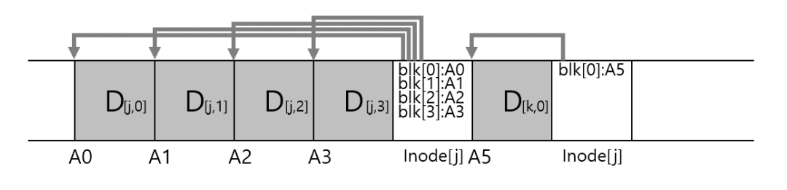
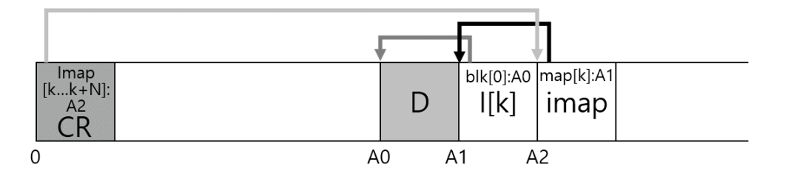
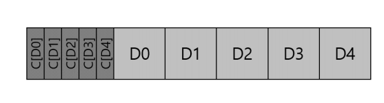

## 46. 로그 기반 파일 시스템
- 메모리 용량이 커지면서 많은 읽기 요청이 메모리 캐시에서 처리되기 시작했다.
- 그 결과 디스크는 읽기보다 쓰기에 더 자주 사용되었고, 파일 시스템의 성능도 쓰기 성능에 크게 좌우되었다.
- 하드 디스크는 랜덤 I/O보다 순차 I/O가 훨씬 빠르다.
- 하지만 기존 파일 시스템은 작은 파일 하나를 생성할 때도 여러 위치를 갱신해야 했다.
  - 아이노드 비트맵
  - 데이터 비트맵
  - 새 아이노드
  - 디렉터리 데이터
  - 디렉터리 아이노드
- 이 블록들이 디스크 여러 곳에 흩어져 있으면 작은 랜덤 쓰기가 반복되어 성능이 낮아진다.
- `로그 기반 파일 시스템(Log-structured File System, LFS)`은 모든 변경 내용을 메모리에 모았다가 디스크의 빈 공간에 큰 단위로 순차 기록한다.

```text
여러 개의 작은 랜덤 쓰기
        ↓
메모리에서 하나의 세그먼트로 결합
        ↓
디스크에 큰 순차 쓰기
```

- LFS는 기존 블록을 원래 위치에서 덮어쓰지 않는다.
- 변경된 데이터와 메타데이터를 항상 새로운 위치에 기록한다.
- 이 방식은 쓰기 성능을 높이지만 오래된 블록을 정리해야 하는 새로운 문제를 만든다.

### 1. 디스크에 순차적으로 쓰기
- LFS의 핵심 원칙은 파일 시스템의 모든 변경 내용을 로그처럼 순차적으로 기록하는 것이다.
- 사용자 데이터뿐 아니라 아이노드, 아이노드 맵 등 메타데이터도 함께 기록한다.

```text
| Data | Inode | Data | Inode Map | Directory | Inode | ...
```

- 예를 들어 기존 파일에 새 블록을 추가하면 다음 내용을 디스크의 새로운 위치에 연속해서 쓴다.
  - 새 데이터 블록
  - 갱신된 아이노드
  - 갱신된 아이노드 맵
- 기존 아이노드와 데이터 블록은 즉시 삭제하지 않는다.
- 최신 위치를 가리키는 메타데이터만 변경하고 이전 버전은 나중에 정리한다.

### 2. 순차적이면서 효율적으로 쓰기
- 블록을 연속된 위치에 쓰더라도 한 번에 한 블록씩 요청하면 충분히 효율적이지 않다.
- 각 요청에는 디스크 명령 처리, 탐색, 회전 지연 등의 고정 비용이 있기 때문이다.
- LFS는 여러 변경 내용을 메모리의 `세그먼트 버퍼(segment buffer)`에 모은다.
- 버퍼가 충분히 차면 전체 내용을 한 번의 큰 순차 쓰기로 디스크에 기록한다.
- 이때 한 번에 기록하는 큰 단위를 `세그먼트(segment)`라고 한다.

```text
메모리의 세그먼트 버퍼
| D0 | I0 | D1 | I1 | imap | summary |
                 ↓
          한 번의 순차 쓰기
                 ↓
디스크의 빈 세그먼트
| D0 | I0 | D1 | I1 | imap | summary |
```

- 세그먼트에는 서로 다른 파일의 데이터와 메타데이터가 함께 들어갈 수 있다.
- 중요한 점은 여러 작은 쓰기를 하나의 큰 쓰기로 결합한다는 것이다.



### 3. 적절한 버퍼의 크기는?
- 세그먼트가 너무 작으면 탐색과 회전 지연의 비중이 커져 순차 쓰기의 장점을 충분히 얻지 못한다.
- 반대로 너무 크면 다음 문제가 생긴다.
  - 메모리를 많이 사용한다.
  - 세그먼트가 찰 때까지 쓰기가 오래 지연될 수 있다.
  - 크래시가 발생하면 메모리에만 있던 변경 내용이 많이 손실될 수 있다.
- 적절한 세그먼트 크기는 디스크의 위치 이동 비용과 전송 속도를 고려해 정한다.

#### 버퍼 크기 계산
- 디스크의 평균 탐색 및 회전 시간이 `T_position`이고 전송 대역폭이 `R`이라고 하자.
- 크기가 `B`인 세그먼트를 쓸 때 대략적인 시간은 다음과 같다.

```text
T_total = T_position + (B / R)
```

- 전체 시간 중 실제 데이터 전송에 사용되는 비율을 `F`라고 하면 다음과 같다.

```text
F = (B / R) / (T_position + B / R)
```

- 원하는 전송 비율 `F`를 만족하는 세그먼트 크기는 다음처럼 계산할 수 있다.

```text
B = (F / (1 - F)) x R x T_position
```

- 예를 들어 전체 시간의 90%를 데이터 전송에 사용하려면 위치 이동 비용보다 충분히 큰 세그먼트를 선택해야 한다.
- 실제 크기는 저장 장치의 특성, 메모리 크기, 지연 시간 요구사항에 따라 달라진다.

### 4. 문제: 아이노드 찾기
- 전통적인 유닉스 파일 시스템은 아이노드를 고정된 아이노드 테이블에 저장한다.
- 아이노드 번호와 아이노드 크기를 알면 위치를 직접 계산할 수 있다.

```text
아이노드 위치 = 아이노드 테이블 시작 위치
             + (아이노드 번호 x 아이노드 크기)
```

- FFS도 아이노드 테이블을 실린더 그룹별로 나누지만 각 테이블의 위치는 고정되어 있다.
- 반면 LFS는 갱신된 아이노드를 로그의 새로운 위치에 계속 기록한다.
- 따라서 같은 아이노드의 최신 버전이 기록될 때마다 디스크 위치가 달라진다.

```text
inode 7 v1 -> segment 2
inode 7 v2 -> segment 8
inode 7 v3 -> segment 15
```

- 아이노드 번호만으로 최신 아이노드의 위치를 계산할 수 없다는 것이 LFS의 첫 번째 핵심 문제이다.

### 5. 간접 계층을 이용한 해법: 아이노드 맵
- LFS는 최신 아이노드 위치를 찾기 위해 `아이노드 맵(inode map, imap)`을 사용한다.
- imap은 아이노드 번호를 최신 아이노드의 디스크 주소로 변환한다.

```text
imap[inode number] = 최신 아이노드의 디스크 주소
```

- 예를 들면 다음과 같다.

| 아이노드 번호 | 최신 디스크 위치 |
| --- | --- |
| 2 | segment 1, block 4 |
| 7 | segment 15, block 2 |
| 12 | segment 9, block 6 |

- 아이노드를 새 위치에 기록할 때마다 해당 imap 항목도 새로운 위치를 가리키도록 갱신한다.

#### imap도 로그에 기록한다
- imap 전체를 디스크의 고정 위치에 두면 아이노드가 바뀔 때마다 그 위치를 덮어써야 한다.
- 그러면 LFS의 순차 쓰기 원칙이 깨지고 랜덤 쓰기가 다시 발생한다.
- 이를 피하기 위해 imap도 여러 블록으로 나누어 다른 변경 내용과 함께 로그에 기록한다.

```text
| 새 데이터 | 새 아이노드 | 갱신된 imap 블록 |
```

- 하지만 imap 블록까지 위치가 계속 바뀌면 imap을 어디에서 찾아야 하는지라는 문제가 다시 생긴다.

### 6. 최종 완성: 체크포인트 영역
- LFS는 최신 imap 블록들의 위치를 `체크포인트 영역(Checkpoint Region, CR)`에 기록한다.
- 체크포인트 영역은 디스크의 정해진 위치에 존재한다.
- 따라서 파일 시스템을 마운트할 때 탐색을 시작할 수 있는 고정된 출발점이 된다.

```text
Checkpoint Region
        ↓
최신 imap 블록들의 위치
        ↓
각 아이노드의 최신 위치
        ↓
파일 데이터 블록
```

- 체크포인트 영역에는 보통 다음 정보가 들어 있다.
  - 최신 imap 조각들의 위치
  - 세그먼트 사용 상태 정보의 위치
  - 마지막으로 기록된 세그먼트 위치
  - 체크포인트 생성 시간
- 체크포인트 영역은 모든 파일 변경마다 갱신하지 않는다.
- 일정 주기 또는 일정량의 변경이 누적되었을 때만 갱신해 고정 위치 쓰기 비용을 줄인다.



### 7. 디스크에서 읽기
- 메모리에 파일 시스템 정보가 없는 상태에서 파일을 읽는 과정은 다음과 같다.

```text
1. 체크포인트 영역 읽기
2. 최신 imap 블록 위치 확인
3. 필요한 imap 블록 읽기
4. imap에서 아이노드 위치 확인
5. 최신 아이노드 읽기
6. 아이노드가 가리키는 데이터 블록 읽기
```

- 마운트할 때 imap 전체 또는 자주 사용하는 부분을 메모리에 캐시할 수 있다.
- imap이 캐시되어 있다면 파일 읽기는 전통적인 유닉스 파일 시스템과 크게 다르지 않다.
- 차이는 아이노드 위치를 계산하는 대신 imap에서 조회한다는 점이다.
- 아이노드를 찾은 뒤에는 아이노드의 직접·간접 포인터를 따라 데이터 블록을 읽는다.

### 8. 디렉터리 관리 방법
- LFS의 디렉터리 구조는 전통적인 유닉스 파일 시스템과 기본적으로 같다.
- 디렉터리 데이터에는 파일 이름과 아이노드 번호의 쌍이 저장된다.

```text
<파일 이름, 아이노드 번호>
```

- 예를 들어 `dir` 디렉터리에 `foo` 파일을 생성하면 다음 정보가 변경된다.
  - `foo`의 새 아이노드
  - 필요하다면 `foo`의 데이터 블록
  - `<foo, 아이노드 번호>`가 추가된 `dir`의 디렉터리 데이터
  - 갱신된 `dir`의 아이노드
  - 두 아이노드의 최신 위치를 담은 imap 블록
- LFS는 이 변경 내용을 하나의 세그먼트에 모아 순차적으로 기록한다.

#### `/dir/foo`를 찾는 과정

```text
1. imap에서 dir 아이노드의 위치를 찾는다.
2. dir 아이노드를 읽는다.
3. dir의 데이터 블록에서 foo의 아이노드 번호를 찾는다.
4. imap에서 foo 아이노드의 최신 위치를 찾는다.
5. foo 아이노드를 읽는다.
6. foo의 데이터 블록을 읽는다.
```

- 디렉터리에는 아이노드 번호만 저장되므로 아이노드가 디스크의 새 위치로 이동해도 디렉터리 항목은 바꿀 필요가 없다.
- imap만 새 위치를 가리키도록 갱신하면 된다.
- 이 간접 계층이 아이노드 이동에 따른 연쇄 갱신을 막는다.

### 9. 새로운 문제: 가비지 컬렉션
- LFS는 블록을 갱신할 때 기존 위치를 덮어쓰지 않고 새 위치에 최신 버전을 기록한다.
- 따라서 디스크에는 더 이상 사용되지 않는 이전 버전이 계속 남는다.

```text
inode v1 -> 오래된 블록
inode v2 -> 오래된 블록
inode v3 -> 현재 사용 중인 블록
```

- 이런 오래된 블록을 그대로 두면 결국 디스크에 새 세그먼트를 기록할 빈 공간이 없어진다.
- LFS는 `세그먼트 클리너(segment cleaner)`를 이용해 공간을 회수한다.
- 세그먼트 클리너는 가비지 컬렉터와 같은 역할을 한다.

#### 세그먼트 정리 과정

```text
1. 정리할 기존 세그먼트를 읽는다.
2. 세그먼트 안의 블록 중 현재도 유효한 블록을 찾는다.
3. 유효한 블록만 새로운 세그먼트로 복사한다.
4. 관련 아이노드와 imap을 갱신한다.
5. 기존 세그먼트 전체를 빈 공간으로 표시한다.
```

- LFS는 개별 블록이 아니라 큰 세그먼트 단위로 공간을 확보한다.
- 그래야 이후에도 큰 순차 쓰기를 계속 수행할 수 있다.
- 세그먼트 정리에는 두 가지 핵심 문제가 있다.
  - 어떤 블록이 최신 버전인지 어떻게 판단할 것인가?
  - 어떤 세그먼트를 언제 정리할 것인가?

### 10. 블록의 최신 여부 판단
- 세그먼트 클리너는 각 블록이 현재 파일 시스템에서 사용 중인 `라이브 블록(live block)`인지 판단해야 한다.
- 이를 위해 각 세그먼트 앞부분에 `세그먼트 요약 블록(segment summary block)`을 기록한다.
- 요약 블록에는 세그먼트 안의 각 블록에 대한 설명이 들어 있다.
  - 해당 블록을 소유한 파일의 아이노드 번호
  - 파일 안에서의 논리적 블록 번호 또는 오프셋
  - 블록 종류

#### 데이터 블록의 생존 여부 확인
- 세그먼트 안의 데이터 블록 `D`에 다음 정보가 있다고 하자.

```text
소유 아이노드: 7
파일 내 블록 번호: 3
현재 디스크 위치: P
```

- 생존 여부는 다음 순서로 확인한다.

```text
1. imap에서 아이노드 7의 최신 위치를 찾는다.
2. 최신 아이노드 7을 읽는다.
3. 아이노드의 3번 블록 포인터를 확인한다.
4. 포인터가 P이면 D는 라이브 블록이다.
5. 다른 위치를 가리키면 D는 오래된 블록이다.
```

- 버전 번호를 이용해 더 빠르게 판단하는 방법도 있다.
- 아이노드를 삭제하고 같은 번호를 다시 사용할 때 버전 번호를 증가시키면, 오래된 파일의 블록과 새 파일의 블록을 구분할 수 있다.

### 11. 정책: 어떤 세그먼트를 언제 정리하는가?
- 세그먼트 정리 시점은 여러 방식으로 결정할 수 있다.
  - 시스템이 유휴 상태일 때
  - 빈 세그먼트 수가 기준 이하로 줄었을 때
  - 주기적인 백그라운드 작업으로
  - 새 세그먼트를 기록할 공간이 거의 없을 때
- 너무 늦게 정리하면 쓰기 요청이 공간 확보를 기다려야 한다.
- 너무 자주 정리하면 아직 유효한 블록을 반복해서 복사해 쓰기 비용이 커진다.

#### 어떤 세그먼트를 선택할 것인가?
- 유효 블록의 비율이 낮은 세그먼트를 정리하면 적은 복사로 많은 공간을 얻을 수 있다.

```text
세그먼트 A: 유효 블록 10% -> 정리 효율이 높음
세그먼트 B: 유효 블록 90% -> 복사 비용이 큼
```

- 하지만 사용률만 고려하면 자주 변경되는 데이터가 있는 세그먼트만 반복해서 정리할 수 있다.
- LFS는 세그먼트 사용률과 데이터의 나이를 함께 고려하는 `비용-편익(cost-benefit)` 정책을 사용할 수 있다.
  - 사용률이 낮을수록 정리하기 좋다.
  - 데이터가 오래되었을수록 곧 다시 변경될 가능성이 낮다.
- 자주 변경되는 `hot data`와 거의 변경되지 않는 `cold data`를 분리하면 정리 효율을 높일 수 있다.

### 12. 크래시로부터의 복구와 로그
- LFS도 세그먼트를 쓰거나 체크포인트를 갱신하는 도중 크래시가 발생할 수 있다.
- 복구에서 중요한 것은 다음 두 문제이다.
  - 체크포인트 영역을 원자적으로 갱신하는 방법
  - 마지막 체크포인트 이후 기록된 세그먼트를 복구하는 방법

#### 두 개의 체크포인트 영역
- LFS는 디스크의 서로 다른 고정 위치에 체크포인트 영역 두 개를 둔다.
- 두 영역을 번갈아 갱신한다.

```text
Checkpoint Region 1 <-> Checkpoint Region 2
```

- 각 체크포인트에는 생성 시간과 일관성을 확인하기 위한 정보가 들어 있다.
- 갱신 중 크래시가 발생하면 한쪽 체크포인트가 불완전할 수 있다.
- 부팅할 때 두 체크포인트를 검사하고 완전하게 기록된 것 중 더 최신인 체크포인트를 선택한다.

#### 롤 포워드
- 체크포인트는 주기적으로만 기록되므로 최신 체크포인트 이후에도 완전한 세그먼트가 디스크에 남아 있을 수 있다.
- 체크포인트만 복구하면 이 변경 내용은 잃어버리게 된다.
- LFS는 `롤 포워드(roll forward)`를 통해 최신 체크포인트 이후의 로그를 검사한다.

```text
1. 최신의 유효한 체크포인트를 읽는다.
2. 체크포인트가 가리키는 로그 끝 위치를 찾는다.
3. 그 이후의 세그먼트 요약 정보를 순서대로 검사한다.
4. 완전하게 기록된 데이터와 아이노드 및 imap 갱신을 복구한다.
5. 불완전한 마지막 세그먼트는 무시한다.
```

- 이 방식은 체크포인트 사이에 기록된 정상적인 변경을 최대한 복구한다.

### 13. 요약
- LFS는 모든 파일 시스템 변경을 메모리에 모아 큰 세그먼트 단위로 디스크에 순차 기록한다.
- 기존 위치를 덮어쓰지 않고 항상 새로운 위치에 기록하므로 작은 랜덤 쓰기를 줄일 수 있다.
- 핵심 자료 구조는 다음과 같다.
  - `세그먼트`: 여러 변경 내용을 모아 순차 기록하는 단위
  - `아이노드 맵(imap)`: 아이노드 번호를 최신 아이노드 위치로 변환
  - `체크포인트 영역`: 최신 imap과 로그 상태를 찾기 위한 고정된 시작점
  - `세그먼트 요약 블록`: 세그먼트 안의 각 블록에 대한 소유 정보
- LFS의 장점은 쓰기를 큰 순차 I/O로 변환하여 높은 쓰기 대역폭을 얻는 것이다.
- 반면 다음 비용이 발생한다.
  - 최신 아이노드 위치를 추적해야 한다.
  - 오래된 블록이 계속 생성된다.
  - 세그먼트 클리너가 유효 블록을 복사하고 빈 공간을 회수해야 한다.
  - 정리 작업이 많아지면 쓰기 증폭이 발생할 수 있다.
- LFS의 새로운 위치 쓰기, 로그 구조, 세그먼트 정리 개념은 이후 여러 파일 시스템과 저장 시스템 설계에 큰 영향을 주었다.
- 다만 LFS 자체를 일반적인 Copy-On-Write 파일 시스템이나 데이터베이스의 섀도 페이징과 완전히 같은 방식으로 보기는 어렵다.

## 47. 데이터 무결성과 보호
- 지금까지는 저장 장치가 요청한 블록을 정확히 읽고 쓴다고 가정했다.
- 하지만 실제 디스크와 저장 장치는 일부 블록을 읽지 못하거나 잘못된 데이터를 반환할 수 있다.
- 저장 장치가 완전히 신뢰할 수 없다는 전제에서 데이터를 안전하게 유지하는 문제를 `데이터 무결성(data integrity)` 또는 `데이터 보호(data protection)`라고 한다.
- 이 장에서는 다음 문제를 살펴본다.
  - 읽을 수 없는 섹터
  - 저장 장치가 알아차리지 못한 데이터 손상
  - 잘못된 위치에 기록된 데이터
  - 완료되었다고 보고했지만 실제로는 반영되지 않은 쓰기
- 핵심 보호 수단은 중복 저장, 체크섬, 주기적 검사이다.

### 1. 디스크 오류 모델
- 초기 RAID는 주로 `고장 시 멈춤(fail-stop)` 모델을 가정했다.
- 이 모델에서 디스크는 다음 두 상태 중 하나이다.
  - 정상적으로 모든 요청을 처리한다.
  - 완전히 고장 나 더 이상 요청을 처리하지 못한다.
- 그러나 실제 디스크는 전체가 고장 나지 않아도 일부 블록에서만 오류가 발생할 수 있다.
- 이를 `부분 고장(partial failure)` 모델이라고 한다.

#### 대표적인 단일 블록 오류

| 오류 | 저장 장치가 감지하는가? | 읽기 결과 |
| --- | --- | --- |
| 숨어 있는 섹터 오류(LSE) | 감지함 | 읽기 오류를 반환 |
| 블록 손상 | 감지하지 못할 수 있음 | 잘못된 데이터를 정상처럼 반환 |

#### 숨어 있는 섹터 오류
- 디스크 섹터가 물리적 문제 등으로 읽을 수 없게 된 상태이다.
- 디스크 내부의 `오류 정정 코드(Error-Correcting Code, ECC)`가 비트 오류를 감지한다.
- ECC 정보가 충분하면 디스크가 오류를 직접 수정한다.
- 복구할 수 없으면 디스크는 상위 계층에 읽기 오류를 반환한다.

#### 조용한 데이터 손상
- 데이터가 바뀌었지만 디스크가 오류를 감지하지 못하는 경우이다.
- 디스크는 잘못된 블록을 정상적으로 읽었다고 응답한다.
- 저장 시스템은 별도의 검증 정보가 없다면 손상을 알아차릴 수 없다.
- 오류가 명시적으로 보고되지 않기 때문에 `조용한 손상(silent corruption)`이라고 부르며 LSE보다 더 위험하다.

### 2. 숨어있는 섹터 에러 (Latent Sector Error)
- LSE는 디스크가 읽기 오류를 명시적으로 반환하므로 오류의 발생 여부를 쉽게 알 수 있다.
- 저장 시스템에 중복 정보가 있다면 정상 사본이나 패리티를 사용해 복구할 수 있다.

#### 미러링을 이용한 복구

```text
디스크 A의 블록 읽기 실패
        ↓
디스크 B의 동일한 미러 블록 읽기
        ↓
정상 데이터를 반환하고 디스크 A를 복구
```

#### 패리티를 이용한 복구
- RAID-4/5에서는 같은 스트라이프의 나머지 데이터와 패리티를 이용해 읽지 못한 블록을 재구성할 수 있다.

```text
손실된 블록 = 나머지 데이터 블록 XOR 패리티 블록
```

#### RAID 재구성 중 발생하는 문제
- 디스크 하나가 완전히 고장 나면 남은 디스크를 읽어 교체 디스크에 데이터를 재구성한다.
- 이 과정에서 남은 디스크 중 하나에서 LSE가 발생하면 필요한 블록을 복원하지 못할 수 있다.
- RAID-5는 기본적으로 한 번에 하나의 디스크 고장만 견딜 수 있기 때문이다.
- 이 위험을 줄이는 방법은 다음과 같다.
  - RAID-6 또는 RAID-DP처럼 이중 패리티를 사용한다.
  - 주기적인 스크러빙으로 잠재된 오류를 미리 찾는다.
  - 오류가 발견되면 정상 사본으로 즉시 복구한다.
- 이중 패리티는 복구 능력을 높이지만 추가 공간과 쓰기 비용이 필요하다.

### 3. 손상 검출: 체크섬
- 조용한 손상은 저장 장치가 오류를 보고하지 않으므로 발견하기 어렵다.
- 이를 검출하려면 데이터가 정상일 때 계산한 별도의 검증 정보가 필요하다.
- 현대 저장 시스템은 주로 `체크섬(checksum)`을 사용한다.

```text
체크섬 C = checksum(데이터 D)
```

- 체크섬은 데이터 내용을 짧게 요약한 값이다.
- 데이터를 저장할 때 데이터와 체크섬을 함께 저장한다.
- 나중에 데이터를 읽을 때 체크섬을 다시 계산해 저장된 값과 비교한다.
- 체크섬은 손상을 검출하는 기능만 제공한다.
- 손상된 데이터를 복구하려면 미러, 패리티 같은 별도의 중복 정보가 필요하다.

#### 1. 널리 사용되는 체크섬 함수
- 체크섬 함수는 계산 속도, 저장 공간, 오류 검출 능력에 차이가 있다.
- 일반적으로 강한 검출 능력은 더 많은 계산 비용을 요구한다.

| 방식 | 특징 | 한계 |
| --- | --- | --- |
| XOR | 매우 빠르고 구현이 단순함 | 특정한 다중 비트 변화나 순서 변경을 놓칠 수 있음 |
| 덧셈 | 각 데이터 단위를 더해 계산하며 빠름 | 순서 변경이나 상쇄되는 변화에 약할 수 있음 |
| Fletcher checksum | 두 누적 합을 사용해 순서 변화도 어느 정도 검출 | CRC보다 검출 능력이 약할 수 있음 |
| CRC | 다항식 나눗셈의 나머지를 사용 | 계산 비용이 있지만 전송·저장 오류 검출에 널리 사용 |
| 암호학적 해시 | 충돌 가능성이 매우 낮고 강력함 | 일반 체크섬보다 계산 비용이 큼 |

#### XOR
- 데이터 단위들을 XOR하여 체크섬을 계산한다.

```text
C = D0 XOR D1 XOR D2 ... XOR Dn
```

- 매우 빠르지만 같은 비트 위치가 짝수 번 바뀌면 변화를 놓칠 수 있다.

#### 덧셈
- 데이터 단위들을 더하고 오버플로는 버려 체크섬을 만든다.
- 여러 비트 변화를 검출할 수 있지만 데이터 순서가 바뀌어도 합계가 같으면 손상을 놓칠 수 있다.

#### Fletcher checksum
- 첫 번째 누적 합 `S1`과 누적 합의 누적 값 `S2`를 함께 계산한다.
- 단순 덧셈보다 데이터 순서 변경을 더 잘 검출한다.

#### CRC
- 데이터를 큰 이진수로 보고 정해진 생성 다항식으로 나눈 나머지를 체크섬으로 사용한다.
- 연속된 비트 오류를 잘 검출하여 디스크, 네트워크 등에서 널리 사용된다.

#### 체크섬 충돌
- 체크섬의 크기는 원본 데이터보다 훨씬 작다.
- 따라서 서로 다른 데이터가 같은 체크섬을 가질 가능성을 완전히 없앨 수 없다.
- 이를 `체크섬 충돌(checksum collision)`이라고 한다.
- 체크섬 비트 수가 크고 함수가 강할수록 우연한 충돌 가능성이 낮아진다.

#### 2. 체크섬의 배치도
- 체크섬은 보호 대상 데이터와 함께 안전하게 저장해야 한다.
- 대표적인 배치 방법은 다음과 같다.

#### 데이터와 같은 섹터에 저장
- 일부 저장 장치는 512바이트 데이터와 추가 보호 정보를 함께 저장할 수 있도록 520바이트 섹터 같은 형식을 사용한다.

```text
| 512B Data | 8B Protection Information |
```

- 데이터와 체크섬을 한 번에 읽고 쓸 수 있다는 장점이 있다.
- 일반적인 512바이트 또는 4KB 섹터 장치에서는 추가 공간을 직접 사용할 수 없을 수 있다.

#### 체크섬을 별도 영역에 저장
- 일반 장치에서는 여러 데이터 블록의 체크섬을 별도의 체크섬 블록에 모아 저장할 수 있다.

```text
Data:     | D0 | D1 | D2 | D3 |
Checksum: | C0 | C1 | C2 | C3 |
```

- 구현이 유연하지만 데이터와 체크섬을 읽기 위해 추가 I/O가 발생할 수 있다.
- 데이터와 체크섬을 함께 캐싱하거나 인접하게 배치해 비용을 줄일 수 있다.



### 4. 체크섬의 활용
- 데이터 블록을 읽을 때 저장 시스템은 다음 순서로 무결성을 검사한다.

```text
1. 데이터 D를 읽는다.
2. 저장된 체크섬 C_stored를 읽는다.
3. 읽은 데이터로 C_computed = checksum(D)를 계산한다.
4. C_stored와 C_computed를 비교한다.
```

- 두 값이 같으면 데이터가 손상되지 않았을 가능성이 높으므로 상위 계층에 반환한다.
- 두 값이 다르면 데이터 손상이 발생한 것이다.
- 중복 정보가 있다면 다음처럼 복구한다.

```text
체크섬 불일치
      ↓
미러 또는 패리티로 정상 데이터 복구
      ↓
복구한 데이터의 체크섬 재검증
      ↓
손상된 사본을 정상 데이터로 다시 기록
```

- 정상 사본이나 패리티가 없다면 오류를 상위 계층에 보고해야 한다.
- 체크섬 일치가 데이터의 절대적인 정확성을 보장하지는 않는다.
- 충돌 가능성이 있기 때문에 사용하는 체크섬의 강도가 중요하다.

### 5. 새로운 문제: 잘못된 위치에 기록
- 저장 장치나 컨트롤러의 오류로 데이터가 요청한 위치가 아닌 다른 블록에 기록될 수 있다.
- 이를 `잘못된 위치 쓰기(misdirected write)`라고 한다.

```text
요청: 데이터 D를 블록 100에 기록
오류: 데이터 D가 블록 200에 기록
```

- 데이터 자체와 체크섬이 함께 잘못된 위치에 기록되면 일반 체크섬 검사는 통과할 수 있다.
- 데이터 내용과 그 체크섬은 서로 일치하기 때문이다.
- 이를 검출하려면 체크섬 계산에 블록의 논리 주소나 물리 식별자를 포함한다.

```text
C = checksum(블록 주소 || 데이터)
```

- 블록 100용 데이터가 블록 200에서 읽히면 현재 주소를 사용해 계산한 체크섬이 저장된 값과 달라진다.
- 주소 정보 외에도 다음 값을 보호 정보에 포함할 수 있다.
  - 파일 또는 객체 식별자
  - 논리 블록 번호
  - 버전 번호
- 데이터가 어떤 위치와 버전에 속하는지까지 함께 검증하는 방식을 종단 간 보호의 일부로 볼 수 있다.

### 6. 마지막 문제: 기록 작업의 손실
- `쓰기 손실(lost write)`은 저장 장치가 쓰기 완료를 보고했지만 실제 데이터는 갱신되지 않은 오류이다.

```text
기존 블록: D_old
쓰기 요청: D_new
장치 응답: 성공
실제 블록: D_old
```

- 기존 블록 `D_old`에는 기존 데이터와 일치하는 올바른 체크섬이 있다.
- 블록 주소도 정확하므로 주소를 포함한 체크섬 검사도 통과한다.
- 따라서 일반 체크섬만으로는 쓰기 손실을 검출할 수 없다.

#### 쓰기 후 읽기
- 가장 직접적인 방법은 쓰기 직후 같은 블록을 다시 읽어 원하는 데이터가 저장되었는지 확인하는 것이다.

```text
write(D_new)
     ↓
read()
     ↓
읽은 값과 D_new 비교
```

- 검출 능력은 높지만 모든 쓰기에 추가 읽기가 필요해 성능 비용이 크다.

#### 버전 번호와 상위 계층 검증
- 블록에 단조 증가하는 버전 번호나 세대 번호를 포함할 수 있다.
- 상위 메타데이터가 기대하는 버전과 실제 블록의 버전이 다르면 오래된 블록이 남아 있음을 알 수 있다.
- 중복 사본, 로그, 트랜잭션 정보와 결합하면 손실된 쓰기를 복구할 가능성도 높아진다.

### 7. Scrubbing
- 자주 읽지 않는 블록은 오랫동안 손상 여부를 확인하지 못할 수 있다.
- 이런 잠재 오류를 미리 찾기 위해 저장 시스템은 `스크러빙(scrubbing)`을 수행한다.
- 스크러빙은 백그라운드에서 모든 블록을 주기적으로 읽고 체크섬을 검사하는 작업이다.

```text
모든 블록 순회
      ↓
데이터와 체크섬 비교
      ↓
손상 발견 시 미러/패리티로 복구
      ↓
정상 데이터로 다시 기록
```

- 스크러빙의 장점은 다음과 같다.
  - 사용자가 데이터를 필요로 하기 전에 손상을 발견한다.
  - RAID 재구성 중 LSE를 만날 가능성을 줄인다.
  - 정상 사본이 남아 있을 때 손상된 블록을 미리 복구한다.
- 너무 자주 수행하면 디스크 대역폭과 에너지를 많이 사용한다.
- 보통 시스템 부하가 낮은 시간에 낮은 우선순위로 실행한다.

### 8. 체크섬 오버헤드
- 체크섬은 데이터 무결성을 높이지만 공간과 시간 비용을 발생시킨다.

#### 디스크 공간 오버헤드
- 각 데이터 블록에 대한 체크섬을 저장할 추가 공간이 필요하다.
- 4KB 데이터 블록마다 8바이트 체크섬을 저장한다면 공간 비율은 다음과 같다.

```text
8 / 4096 x 100 ≒ 0.195%
```

- 체크섬 자체의 공간 비용은 비교적 작다.
- 주소, 버전, 객체 식별자 같은 보호 정보를 추가하면 오버헤드는 조금 더 커진다.

#### 메모리 공간 오버헤드
- 데이터와 체크섬을 캐시하기 위한 메모리가 필요하다.
- 체크섬 인덱스나 검증 상태를 관리하는 메타데이터도 메모리를 사용한다.
- 일반적으로 데이터 크기에 비하면 작지만 대규모 저장 시스템에서는 누적 비용을 고려해야 한다.

#### CPU 오버헤드
- 데이터를 쓸 때 체크섬을 계산해야 한다.
- 데이터를 읽을 때 체크섬을 다시 계산하고 저장된 값과 비교해야 한다.
- 강한 체크섬이나 암호학적 해시는 더 많은 CPU 시간을 사용한다.
- 데이터 복사와 체크섬 계산을 하나의 순회에서 함께 처리하면 메모리를 반복해서 읽는 비용을 줄일 수 있다.
- 일부 CPU와 저장 장치는 CRC 같은 연산을 위한 하드웨어 가속도 제공한다.

#### I/O 오버헤드
- 체크섬을 별도 블록에 저장하면 데이터 외에 체크섬 블록을 읽고 써야 할 수 있다.
- 스크러빙도 모든 데이터를 주기적으로 읽기 때문에 추가 I/O를 발생시킨다.
- 다음 방법으로 영향을 줄일 수 있다.
  - 데이터와 체크섬을 가까이 배치한다.
  - 체크섬을 데이터와 함께 캐싱한다.
  - 여러 체크섬 갱신을 모아서 기록한다.
  - 스크러빙을 시스템 유휴 시간에 수행한다.

### 9. 요약
- 저장 장치는 전체 디스크 고장뿐 아니라 개별 블록 수준에서도 실패할 수 있다.
- `LSE`는 장치가 읽기 오류를 반환하므로 미러나 패리티로 복구할 수 있다.
- `조용한 데이터 손상`은 장치가 오류를 감지하지 못하므로 체크섬이 필요하다.
- 체크섬 사용 흐름은 다음과 같다.
  - 데이터를 저장할 때 체크섬을 계산해 함께 기록한다.
  - 데이터를 읽을 때 체크섬을 다시 계산한다.
  - 값이 다르면 중복 사본이나 패리티로 복구한다.
- 체크섬에 블록 주소를 포함하면 잘못된 위치 쓰기를 검출할 수 있다.
- 기존 데이터와 체크섬이 그대로 남는 쓰기 손실은 일반 체크섬만으로 검출하기 어렵다.
  - 쓰기 후 읽기, 버전 번호, 로그 같은 추가 기법이 필요하다.
- 스크러빙은 모든 블록을 주기적으로 검사해 잠재된 오류를 미리 발견하고 복구한다.
- 체크섬은 공간, CPU, I/O 오버헤드를 발생시키지만 장기간 데이터를 안전하게 보관하기 위한 핵심 기술이다.
- 오류 검출과 오류 복구는 서로 다른 문제이다.
  - 체크섬은 주로 오류를 검출한다.
  - 미러링, 패리티, 백업은 정상 데이터를 복구하는 데 사용한다.
