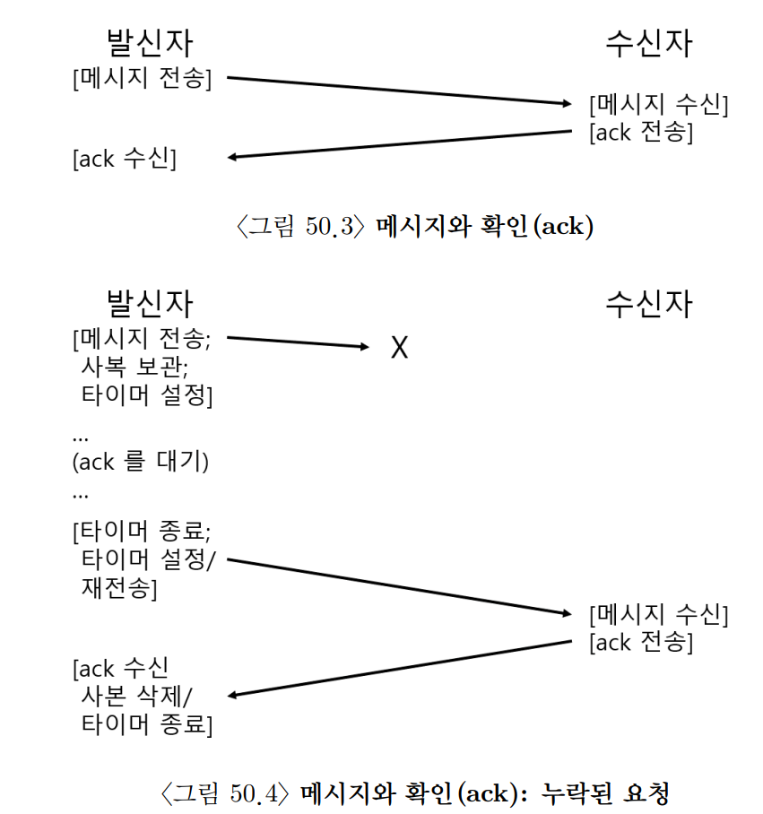
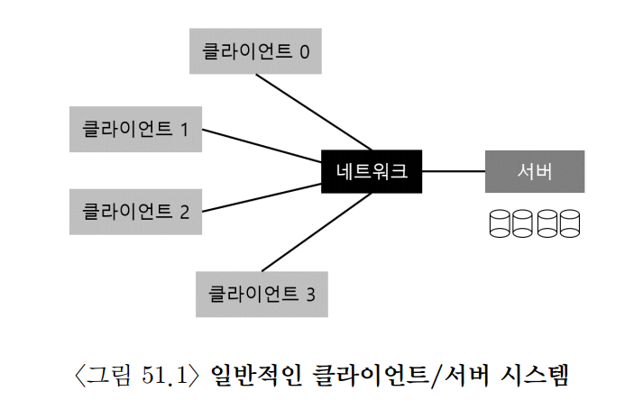
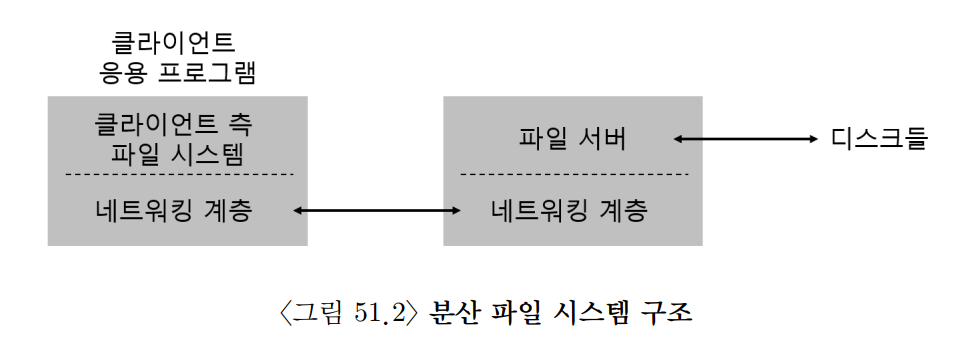

## 50. 분산 시스템
- 분산 시스템은 네트워크로 연결된 여러 컴퓨터가 하나의 서비스를 제공하도록 구성한 시스템이다.
- 웹 브라우저가 웹 서버에 접속하는 것도 가장 기본적인 클라이언트·서버 분산 시스템의 예이다.

```text
Client                         Server
  |                               |
  |---------- Request ----------->|
  |<--------- Response -----------|
```

- 분산 시스템은 단일 컴퓨터 시스템과 다른 문제를 가진다.
  - 네트워크 메시지가 손실되거나 손상될 수 있다.
  - 일부 컴퓨터만 고장 날 수 있다.
  - 메시지가 늦게 도착하거나 순서가 바뀔 수 있다.
  - 요청이 중복 실행될 수 있다.
  - 통신 비용이 로컬 함수 호출보다 훨씬 크다.
  - 제삼자가 통신 내용을 도청하거나 변경할 수 있다.
- 따라서 분산 시스템을 설계할 때는 다음 요소를 함께 고려해야 한다.
  - `신뢰성`: 일부 구성 요소가 실패해도 서비스를 계속할 수 있는가?
  - `성능`: 메시지 수와 네트워크 왕복 횟수를 줄일 수 있는가?
  - `확장성`: 컴퓨터와 사용자가 늘어도 성능을 유지할 수 있는가?
  - `보안`: 통신 상대를 인증하고 데이터를 보호할 수 있는가?
- 이 장에서는 분산 시스템의 가장 기본적인 요소인 메시지 통신과 RPC를 살펴본다.

### 1. 통신의 기본
- 서로 다른 컴퓨터의 프로세스는 메모리를 직접 공유할 수 없다.
- 일반적으로 네트워크를 통해 메시지를 주고받아 통신한다.

```text
Process A -> Operating System -> Network -> Operating System -> Process B
```

- 네트워크 통신은 기본적으로 신뢰할 수 없다고 가정해야 한다.
- 패킷에는 다음 문제가 발생할 수 있다.
  - 손실
  - 손상
  - 중복
  - 순서 변경
  - 긴 지연

#### 패킷이 손실되는 이유
- 네트워크 스위치, 라우터, 수신 호스트의 버퍼 크기는 한정되어 있다.
- 짧은 시간에 많은 패킷이 도착하면 버퍼가 가득 차고 일부 패킷이 버려질 수 있다.

```text
도착하는 패킷 수 > 처리 가능한 패킷 수
              ↓
          버퍼 포화
              ↓
          패킷 폐기
```

- 수신 컴퓨터의 CPU나 메모리 같은 자원이 부족해도 메시지를 제때 처리하지 못할 수 있다.
- 따라서 통신 계층이나 응용 프로그램은 패킷 손실에 어떻게 대응할지 결정해야 한다.

### 2. 신뢰할 수 없는 통신 계층
- 가장 단순한 대응은 통신 계층에서 신뢰성을 보장하지 않는 것이다.
- 대표적인 예가 `UDP(User Datagram Protocol)`이다.
- UDP는 데이터를 독립적인 데이터그램 단위로 전송한다.

#### UDP의 특징
- 연결 설정 과정이 없다.
- 패킷 도착을 보장하지 않는다.
- 패킷 순서를 보장하지 않는다.
- 같은 패킷이 중복 도착할 수 있다.
- 흐름 제어나 혼잡 제어를 제공하지 않는다.
- 체크섬을 통해 일부 전송 오류를 검출할 수 있다.
- 헤더와 처리 과정이 단순해 지연과 오버헤드가 작다.

#### UDP가 적합한 경우
- 일부 패킷 손실보다 낮은 지연 시간이 더 중요한 경우
- 응용 프로그램이 자체적으로 재전송이나 중복 제거를 구현하는 경우
- 요청 하나와 응답 하나로 끝나는 단순한 통신
- 실시간 음성·영상, 게임, DNS 같은 서비스

- UDP는 소켓 API를 통해 사용한다.

```text
socket 생성
    ↓
목적지 주소와 포트 지정
    ↓
데이터그램 전송
```

- UDP가 신뢰성을 제공하지 않는다는 것은 항상 나쁘다는 뜻이 아니다.
- 응용 프로그램의 요구에 맞게 필요한 기능만 구현할 수 있다는 장점이 있다.

### 3. 신뢰할 수 있는 통신 계층
- 많은 응용 프로그램은 패킷 손실과 순서 변경을 직접 처리하고 싶어 하지 않는다.
- 신뢰할 수 있는 통신을 만들려면 손실 감지와 재전송 기법이 필요하다.

#### ACK
- 수신자는 메시지를 정상적으로 받으면 발신자에게 `ACK(acknowledgement)`를 보낸다.

```text
Sender                         Receiver
  |------ Message N ----------->|
  |<--------- ACK N ------------|
```

- ACK를 받으면 발신자는 메시지가 전달되었다고 판단한다.

#### 타임아웃과 재전송
- 메시지나 ACK가 손실되면 발신자는 응답을 무한히 기다릴 수 없다.
- 일정 시간 안에 ACK가 도착하지 않으면 타임아웃을 발생시키고 메시지를 재전송한다.

```text
메시지 전송
    ↓
ACK 대기
    ├─ ACK 도착 -> 성공
    `─ 타임아웃 -> 같은 메시지 재전송
```

- 이를 `타임아웃/재전송(timeout/retry)` 방식이라고 한다.

#### 중복 메시지 문제
- 메시지가 아니라 ACK만 손실될 수도 있다.

```text
Sender                         Receiver
  |------ Message N ----------->| 처리 완료
  |<------ ACK N 손실 ----------X
  |          timeout             |
  |------ Message N ----------->| 중복 도착
```

- 수신자가 중복 요청을 구분하지 못하면 같은 작업을 두 번 실행할 수 있다.
- 특히 송금, 주문 생성 같은 작업에서는 심각한 문제가 된다.

#### 순서 번호
- 발신자는 각 메시지에 `순서 번호(sequence number)`를 붙인다.
- 수신자는 최근에 처리한 번호를 기억해 중복 요청을 검출한다.

```text
Message = <Sequence Number, Payload>
```

- 동작 예시는 다음과 같다.
  - 발신자가 메시지 1을 보낸다.
  - 수신자가 메시지 1을 처리하고 ACK 1을 보낸다.
  - ACK 1이 손실되어 발신자가 메시지 1을 다시 보낸다.
  - 수신자는 메시지 1을 이미 처리했음을 확인한다.
  - 요청을 다시 실행하지 않고 ACK 1 또는 이전 결과를 반환한다.
- 메시지가 정상적으로 완료된 뒤에만 발신자는 다음 순서 번호를 사용한다.

#### 실행 보장의 의미
- 타임아웃과 재전송만 사용하면 요청이 `최소 한 번(at-least-once)` 실행될 수 있다.
  - 응답을 받을 때까지 재시도하므로 중복 실행 가능성이 있다.
- 중복 요청을 검출해 다시 실행하지 않으면 `최대 한 번(at-most-once)` 실행을 구현할 수 있다.
  - 다만 실패 상황에서는 한 번도 실행되지 않을 수 있다.
- 네트워크 단절과 서버 크래시가 존재하는 환경에서 `정확히 한 번(exactly-once)` 실행을 완벽하게 보장하는 것은 단순한 ACK와 재전송만으로 해결할 수 없다.
- 보통 요청 ID, 결과 저장, 멱등성, 트랜잭션 등을 결합해 정확히 한 번처럼 보이는 효과를 만든다.



#### TCP
- 가장 널리 사용되는 신뢰성 있는 통신 프로토콜은 `TCP(Transmission Control Protocol)`이다.
- TCP는 다음 기능을 제공한다.
  - 연결 지향 통신
  - 손실된 데이터 재전송
  - 중복 데이터 제거
  - 순서에 맞는 바이트 스트림 제공
  - 수신자의 처리 능력에 맞춘 흐름 제어
  - 네트워크 상태에 맞춘 혼잡 제어
- TCP는 응용 프로그램에 신뢰할 수 있는 바이트 스트림을 제공하지만 메시지 경계를 보존하지 않는다.
- 따라서 응용 프로그램은 길이 필드나 구분자 등을 사용해 메시지 단위를 직접 정의해야 한다.

### 4. 통신 추상화
- 메시지를 직접 주고받는 방식은 명확하지만 프로그램 작성이 복잡하다.
- 분산 통신을 기존 프로그래밍 모델처럼 보이게 만들기 위한 여러 추상화가 개발되었다.

#### 분산 공유 메모리
- `분산 공유 메모리(Distributed Shared Memory, DSM)`는 서로 다른 컴퓨터의 프로세스가 하나의 공유 주소 공간을 사용하는 것처럼 보이게 한다.
- 개발자는 원격 메시지 대신 일반 메모리 읽기와 쓰기를 사용한다.

```text
Machine A                         Machine B
Virtual Page P  <--- Network ---> Physical Page P
```

- DSM은 주로 운영체제의 가상 메모리 기능을 이용한다.
- 프로세스가 페이지에 접근하면 다음 두 경우가 발생한다.
  - 페이지가 로컬 메모리에 있으면 즉시 접근한다.
  - 페이지가 다른 컴퓨터에 있으면 페이지 폴트가 발생한다.
- 원격 페이지 폴트 처리 과정은 다음과 같다.

```text
1. 원격 페이지 접근
2. 페이지 폴트 발생
3. 페이지 폴트 핸들러가 원격 컴퓨터에 페이지 요청
4. 네트워크로 페이지 수신
5. 페이지 테이블 갱신
6. 중단된 명령어 재실행
```

#### DSM의 한계
- 메모리 접근 비용을 코드만 보고 예측하기 어렵다.
  - 로컬 접근은 빠르다.
  - 원격 페이지 폴트는 매우 느리다.
- 여러 컴퓨터가 같은 페이지를 수정할 때 일관성 유지가 복잡하다.
- 페이지 단위 공유로 인해 관련 없는 데이터가 함께 이동하는 거짓 공유가 발생할 수 있다.
- 원격 컴퓨터가 고장 나면 그 컴퓨터가 보유한 페이지를 잃을 수 있다.
- 공유 주소 공간 전체에 자료 구조가 분산되어 있으면 부분 실패를 처리하기 어렵다.
- 이런 이유로 DSM은 범용 분산 시스템의 주된 프로그래밍 모델이 되지 못했다.

### 5. Remote Procedure Call(RPC)
- 메시지 전달을 더 사용하기 쉽게 만들기 위해 프로그래밍 언어의 함수 호출 개념을 확장한 것이 `RPC(Remote Procedure Call)`이다.
- RPC의 목표는 원격 컴퓨터의 함수를 로컬 함수처럼 호출할 수 있게 만드는 것이다.

```text
result = remoteAdd(10, 20);
```

- 코드상으로는 일반 함수 호출처럼 보이지만 내부에서는 다음 과정이 일어난다.

```text
Client
  ↓ 함수 호출
Client Stub
  ↓ 직렬화 및 메시지 전송
RPC Runtime / Network
  ↓
Server Stub
  ↓ 역직렬화 및 실제 함수 호출
Server Procedure
  ↓ 결과 반환
```

- RPC 시스템은 크게 다음 두 부분으로 구성된다.
  - 스텁 생성기
  - 런타임 라이브러리

#### 1. 스텁 생성기
- `스텁(stub)`은 원격 호출에 필요한 메시지 처리 코드를 대신 수행한다.
- 스텁 생성기는 서버가 제공할 함수 인터페이스를 입력받아 클라이언트와 서버용 코드를 자동 생성한다.

#### 인터페이스 정의
- 먼저 원격에서 호출할 함수의 이름, 인자, 반환형을 정의한다.

```text
interface Calculator {
    int add(int a, int b);
}
```

- 실제 RPC 시스템에서는 IDL(Interface Definition Language)을 사용할 수 있다.

#### 클라이언트 스텁의 역할

```text
1. 메시지 버퍼 생성
2. 호출할 함수 식별자 기록
3. 함수 인자를 직렬화
4. RPC 런타임에 메시지 전송 요청
5. 서버 응답 대기
6. 응답을 역직렬화
7. 결과를 호출자에게 반환
```

- 함수 인자와 메타데이터를 전송 가능한 바이트 형식으로 바꾸는 작업을 `직렬화(serialization)` 또는 `마샬링(marshalling)`이라고 한다.

#### 서버 스텁의 역할

```text
1. 요청 메시지 수신
2. 함수 식별자와 인자 역직렬화
3. 해당 서버 함수 호출
4. 반환값 직렬화
5. 클라이언트에 응답 전송
```

- 수신한 바이트를 원래 자료형으로 복원하는 작업을 `역직렬화(deserialization)` 또는 `언마샬링(unmarshalling)`이라고 한다.

#### 스텁 생성의 장점
- 반복적인 메시지 처리 코드를 자동화한다.
- 수작업 직렬화에서 발생할 수 있는 오류를 줄인다.
- 클라이언트와 서버가 동일한 인터페이스 정의를 사용하게 한다.
- 코드 생성기가 직렬화 형식과 네트워크 코드를 최적화할 수 있다.

#### 복잡한 인자의 처리
- 포인터를 그대로 원격 컴퓨터에 보낼 수는 없다.
- 포인터 값은 클라이언트의 주소 공간에서만 의미가 있기 때문이다.
- 배열, 문자열, 중첩 구조체 등은 실제 내용과 길이를 직렬화해야 한다.
- 그래프처럼 순환 참조가 있는 자료 구조는 별도의 객체 ID나 특수한 직렬화 규칙이 필요하다.

#### 서버의 병행성
- 서버는 여러 클라이언트 요청을 동시에 받아야 할 수 있다.
- 일반적인 처리 방법은 다음과 같다.
  - 요청마다 새 스레드 생성
  - 고정 크기 스레드 풀 사용
  - 이벤트 기반 서버 사용
- 여러 요청이 공유 상태에 접근한다면 락이나 다른 동기화 기법이 필요하다.

#### 2. 런타임 라이브러리
- RPC 런타임은 스텁 아래에서 네트워크 통신과 실패 처리를 담당한다.

#### 서비스 위치 찾기
- 클라이언트는 서버의 네트워크 위치를 알아야 한다.
- 가장 단순한 방법은 호스트 주소와 포트 번호를 직접 설정하는 것이다.

```text
Server Address = <Host Name or IP, Port Number>
```

- 더 큰 시스템은 이름 서비스나 서비스 디스커버리를 사용할 수 있다.
- 서비스 이름을 실제 서버 주소로 변환하고, 여러 서버 중 하나를 선택할 수도 있다.

#### 전송 프로토콜 선택
- RPC는 TCP나 UDP 위에 구현할 수 있다.
- TCP 사용
  - 신뢰성, 순서 보장, 흐름 제어를 제공한다.
  - 연결 설정과 프로토콜 처리 비용이 있다.
- UDP 사용
  - 오버헤드가 작고 요청·응답 형태에 적합할 수 있다.
  - RPC 런타임이 타임아웃, 재전송, 중복 제거를 직접 구현해야 한다.
- 단순한 요청·응답 RPC를 TCP 위에 구현하면 TCP의 ACK와 RPC 응답 등 여러 메시지가 발생할 수 있다.
- 하지만 실제 선택은 메시지 크기, 연결 재사용, 실패 처리 요구사항에 따라 달라진다.

#### 실패와 호출 의미
- 로컬 함수 호출은 프로세스가 정상 실행되는 동안 성공 또는 명확한 오류로 끝나는 경우가 많다.
- 원격 호출에서는 타임아웃이 발생해도 서버가 요청을 실행했는지 알 수 없을 수 있다.

```text
요청 손실       -> 서버가 실행하지 않음
응답 손실       -> 서버는 실행했지만 클라이언트가 결과를 모름
서버 크래시     -> 실행 전인지 실행 중인지 실행 후인지 불명확
```

- RPC 런타임은 재시도 정책과 실행 의미를 정의해야 한다.
  - 최소 한 번 실행
  - 최대 한 번 실행
  - 재시도하지 않음
- 중요한 요청은 고유 요청 ID와 결과 캐시를 사용해 중복 실행을 방지할 수 있다.
- 가능하면 서버 연산을 `멱등성(idempotent)` 있게 설계하는 것이 좋다.
  - 같은 요청을 여러 번 실행해도 결과가 한 번 실행한 것과 같도록 만든다.

#### 3. 그 밖의 문제

#### 오래 걸리는 요청
- RPC가 오래 걸리면 클라이언트는 서버 장애와 느린 처리를 구분하기 어렵다.
- 서버는 먼저 요청 접수 ACK를 보내고 작업 상태를 별도로 제공할 수 있다.
- 장시간 작업은 작업 ID를 반환하고 클라이언트가 상태를 조회하도록 설계할 수도 있다.

```text
요청 -> 작업 ID 반환 -> 상태 조회 -> 결과 획득
```

#### 큰 메시지
- RPC 인자나 반환값이 네트워크 패킷 하나보다 클 수 있다.
- 런타임 또는 하위 전송 계층은 데이터를 여러 조각으로 나누고 수신 측에서 다시 조립해야 한다.
- 이를 `분할(fragmentation)`과 `재조립(reassembly)`이라고 한다.

#### 바이트 순서
- 컴퓨터 구조에 따라 여러 바이트 정수의 저장 순서가 다를 수 있다.
  - `빅 엔디안`: 가장 중요한 바이트를 낮은 주소에 저장한다.
  - `리틀 엔디안`: 가장 덜 중요한 바이트를 낮은 주소에 저장한다.
- 서로 다른 구조의 컴퓨터가 통신하려면 공통 네트워크 표현을 사용해야 한다.
- Sun RPC의 `XDR(External Data Representation)`은 자료형과 바이트 순서를 표준 형식으로 변환한다.

#### 동기 RPC와 비동기 RPC
- `동기 RPC`
  - 클라이언트는 응답이 올 때까지 호출 지점에서 기다린다.
  - 사용하기 쉽지만 기다리는 동안 다른 작업을 하기 어렵다.
- `비동기 RPC`
  - 요청을 보낸 뒤 즉시 제어권을 돌려받는다.
  - 나중에 콜백, Future, Promise 등을 통해 결과를 받는다.
  - 여러 원격 요청을 동시에 수행할 수 있지만 상태 관리가 복잡해진다.

#### RPC는 로컬 함수 호출과 다르다
- RPC는 로컬 함수 호출처럼 보이지만 의미와 비용은 크게 다르다.

| 로컬 함수 호출 | RPC |
| --- | --- |
| 메모리 안에서 실행 | 네트워크를 거쳐 원격 실행 |
| 일반적으로 매우 빠름 | 지연 시간이 크고 변동 가능 |
| 프로세스 실패 중심 | 네트워크와 부분 실패도 고려 |
| 포인터 전달 가능 | 데이터를 직렬화해야 함 |
| 호출 결과가 비교적 명확 | 타임아웃 시 실행 여부가 불명확할 수 있음 |

- 원격 호출의 실패 가능성과 높은 비용을 숨기기만 하면 잘못된 설계를 만들 수 있다.
- RPC를 사용할 때는 네트워크 왕복 횟수, 타임아웃, 재시도, 멱등성을 명시적으로 고려해야 한다.

### 6. 요약
- 분산 시스템은 여러 컴퓨터가 네트워크를 통해 협력하는 시스템이다.
- 네트워크에서는 메시지 손실, 손상, 중복, 순서 변경, 지연이 발생할 수 있다.
- UDP는 단순하고 빠르지만 신뢰성과 순서를 보장하지 않는다.
- 신뢰할 수 있는 통신에는 ACK, 타임아웃, 재전송, 순서 번호, 중복 제거가 필요하다.
- TCP는 이러한 기능을 포함한 신뢰성 있는 바이트 스트림을 제공한다.
- DSM은 원격 메모리를 공유 메모리처럼 보이게 하지만 성능 예측과 부분 실패 처리가 어렵다.
- RPC는 원격 함수를 로컬 함수처럼 호출할 수 있도록 스텁과 런타임을 제공한다.
- RPC 시스템은 다음 문제를 처리해야 한다.
  - 직렬화와 역직렬화
  - 서버 위치 탐색
  - 전송 프로토콜 선택
  - 타임아웃과 재시도
  - 중복 요청
  - 바이트 순서
  - 큰 메시지
  - 동기·비동기 실행
- 분산 시스템에서는 실패가 드문 예외가 아니라 항상 발생할 수 있는 정상적인 조건이다.
- 따라서 통신 실패와 부분 실패를 전제로 인터페이스와 복구 방식을 설계해야 한다.

## 51. Sun 사의 네트워크 파일 시스템(NFS)
- 분산 파일 시스템은 클라이언트·서버 방식이 초기에 널리 활용된 대표적인 분야이다.
- 파일 서버는 디스크와 파일 시스템을 관리하고, 여러 클라이언트는 네트워크 메시지로 파일과 디렉터리에 접근한다.

```text
Client A ─┐
Client B ─┼── Network ── File Server ── Disk
Client C ─┘
```

- 중앙 서버에 데이터를 보관하면 다음 장점이 있다.
  - 여러 클라이언트가 같은 파일을 쉽게 공유할 수 있다.
  - 사용자 데이터를 중앙에서 백업하고 관리할 수 있다.
  - 클라이언트마다 별도의 대용량 디스크를 둘 필요가 없다.
  - 서버를 물리적으로 보호된 장소에 두어 보안을 강화할 수 있다.
- 반면 네트워크 지연, 서버 장애, 캐시 일관성, 보안 같은 새로운 문제가 생긴다.



### 1. 기본적인 분산 파일 시스템
- 응용 프로그램은 원격 파일도 로컬 파일과 같은 시스템 콜로 접근한다.

```c
int fd = open("/remote/foo.txt", O_RDONLY);
read(fd, buffer, size);
close(fd);
```

- 운영체제는 경로가 원격 파일 시스템에 속한다는 것을 확인하고 요청을 클라이언트 측 파일 시스템으로 전달한다.
- 분산 파일 시스템은 크게 두 구성 요소로 이루어진다.
  - `클라이언트 측 파일 시스템`: 시스템 콜을 네트워크 요청으로 변환하고 캐시를 관리한다.
  - `파일 서버`: 요청을 받아 서버의 파일 시스템과 디스크를 조작한 뒤 결과를 반환한다.

#### 원격 읽기의 기본 흐름

```text
1. 응용 프로그램이 read() 호출
2. 클라이언트 파일 시스템이 로컬 캐시 확인
3. 캐시 미스라면 서버에 READ 요청 전송
4. 서버가 디스크 또는 서버 캐시에서 데이터 읽기
5. 서버가 데이터를 클라이언트에 반환
6. 클라이언트가 데이터를 캐시하고 응용 프로그램에 전달
```

- 같은 블록을 다시 읽을 때 유효한 캐시가 남아 있다면 네트워크 요청 없이 처리할 수 있다.
- 따라서 클라이언트와 서버의 프로토콜뿐 아니라 캐싱 정책도 전체 성능과 동작 의미를 결정한다.



### 2. NFS에 대하여
- `NFS(Network File System)`는 Sun Microsystems가 개발한 분산 파일 시스템 프로토콜이다.
- Sun은 특정 구현만 제공하는 대신 클라이언트와 서버 사이의 메시지 형식과 동작 규칙을 공개했다.
- 따라서 서로 다른 운영체제와 제조사의 시스템도 같은 NFS 프로토콜을 구현하면 통신할 수 있었다.

```text
서로 다른 구현
      +
공개된 공통 프로토콜
      =
상호 운용 가능한 NFS
```

- 개방형 프로토콜 전략은 NFS가 널리 사용되는 데 중요한 역할을 했다.
- 이 장에서는 단순한 크래시 복구를 주요 목표로 설계된 `NFSv2`를 중심으로 살펴본다.

### 3. 핵심: 단순하고 빠른 서버 크래시 복구
- 분산 파일 시스템에서는 서버가 언제든 크래시할 수 있다.
- 서버가 재시작된 뒤 다음 작업이 필요하다면 복구가 복잡하고 느려진다.
  - 어떤 클라이언트가 어떤 파일을 열었는지 복구
  - 각 클라이언트의 현재 파일 오프셋 복구
  - 보유 중인 락과 세션 복구
  - 처리 중이던 요청의 완료 여부 판단
- NFSv2는 서버가 이런 클라이언트별 상태를 가능한 한 보관하지 않도록 설계했다.
- 서버가 재시작되면 클라이언트는 이전과 같은 형태의 요청을 다시 보내면 된다.
- 별도의 긴 복구 절차 없이 요청 처리를 재개하는 것이 핵심 목표이다.

### 4. 빠른 크래시 복구의 열쇠: 상태를 유지하지 않음
- NFSv2 서버는 클라이언트별 세션 상태를 유지하지 않는 `무상태(stateless)` 프로토콜로 설계되었다.
- 각 요청에는 서버가 해당 요청을 처리하는 데 필요한 정보가 모두 들어 있다.

```text
READ 요청
= 파일 핸들 + 오프셋 + 읽을 길이
```

- 서버는 이전 요청을 기억하지 않아도 현재 요청만 보고 처리할 수 있다.
- 클라이언트에서 호출한 `open()` 상태도 서버가 직접 유지하지 않는다.
  - 클라이언트 운영체제가 열린 파일과 현재 오프셋을 관리한다.
  - 서버에는 파일 핸들과 명시적인 오프셋을 포함한 `READ`, `WRITE` 요청을 보낸다.

#### 상태 유지형 서버와의 차이

| 상태 유지형 서버 | NFSv2 무상태 서버 |
| --- | --- |
| 열린 파일과 세션 정보를 서버가 관리 | 클라이언트별 열린 파일 상태를 관리하지 않음 |
| 크래시 후 상태 복구가 필요 | 재시작 후 요청을 바로 다시 처리 가능 |
| 짧은 핸들이나 암묵적 상태 사용 가능 | 각 요청에 필요한 정보를 모두 포함해야 함 |
| 클라이언트 크래시 후 상태 정리가 필요 | 클라이언트별 상태 정리 부담이 적음 |

- 무상태 설계는 복구를 단순하게 하지만 락, 캐시 일관성, 중복 요청 처리 같은 기능을 구현하기 어렵게 만든다.

### 5. NFSv2 프로토콜
- NFS 프로토콜의 핵심 식별자는 `파일 핸들(file handle)`이다.
- 파일 핸들은 서버에 있는 특정 파일이나 디렉터리를 고유하게 나타낸다.

```text
File Handle
= <Volume Identifier, Inode Number, Generation Number>
```

- `볼륨 식별자`
  - 서버의 어느 파일 시스템 또는 볼륨에 있는 객체인지 나타낸다.
- `아이노드 번호`
  - 해당 볼륨 안에서 파일이나 디렉터리를 식별한다.
- `생성 번호`
  - 아이노드 번호가 삭제 후 재사용되었는지 구분한다.
  - 아이노드를 새 객체에 재사용할 때 생성 번호를 증가시킨다.
- 생성 번호가 없다면 오래된 파일 핸들이 같은 아이노드 번호를 사용하는 새 파일을 잘못 가리킬 수 있다.
- 유효하지 않게 된 오래된 핸들을 사용하면 서버는 `stale file handle` 오류를 반환할 수 있다.

#### 주요 NFSv2 요청

| 요청 | 역할 |
| --- | --- |
| `LOOKUP` | 디렉터리 핸들과 이름으로 대상 파일 핸들을 찾음 |
| `GETATTR` | 파일 크기, 수정 시간 등 속성을 조회 |
| `READ` | 파일 핸들, 오프셋, 길이를 이용해 데이터 읽기 |
| `WRITE` | 파일 핸들, 오프셋, 길이, 데이터를 이용해 쓰기 |
| `CREATE` | 디렉터리에 새 파일 생성 |
| `REMOVE` | 디렉터리에서 파일 이름 제거 |
| `READDIR` | 디렉터리 항목 읽기 |

#### LOOKUP
- 클라이언트는 부모 디렉터리의 파일 핸들과 찾을 이름을 서버에 전달한다.

```text
LOOKUP(<directory handle>, "foo")
             ↓
<foo의 file handle, foo의 attributes>
```

- 반환된 파일 핸들은 이후 `READ`, `WRITE`, `GETATTR` 요청에 사용한다.

#### 마운트
- 원격 파일 시스템을 처음 연결할 때 클라이언트는 NFS 마운트 프로토콜을 통해 내보낸 디렉터리의 초기 파일 핸들을 얻는다.
- 이후에는 이 루트 핸들에서 시작해 `LOOKUP` 요청으로 경로를 따라간다.

```text
원격 루트 핸들
    ↓ LOOKUP("home")
home 핸들
    ↓ LOOKUP("user")
user 핸들
    ↓ LOOKUP("file.txt")
file.txt 핸들
```

### 6. 프로토콜에서 분산 파일 시스템으로
- 클라이언트 측 파일 시스템은 응용 프로그램의 시스템 콜을 NFS 요청으로 변환한다.
- 열린 파일 디스크립터와 현재 오프셋은 클라이언트가 관리한다.

#### `open("/remote/foo")`

```text
1. 마운트 지점의 루트 파일 핸들 확인
2. 경로 구성 요소마다 LOOKUP 요청
3. 최종 파일 핸들과 속성 획득
4. 클라이언트의 열린 파일 테이블에 상태 저장
5. 응용 프로그램에 파일 디스크립터 반환
```

#### `read(fd, buffer, size)`

```text
1. fd에서 파일 핸들과 현재 오프셋 확인
2. READ<file handle, offset, size> 전송
3. 서버가 데이터와 속성 반환
4. 클라이언트가 현재 오프셋 갱신
5. 데이터를 응용 프로그램에 반환
```

- 서버는 열린 파일 디스크립터나 현재 오프셋을 기억할 필요가 없다.
- 각 요청에 파일 핸들, 오프셋, 길이가 포함되기 때문이다.

### 7. 서버 고장을 멱등 연산으로 처리하기
- 클라이언트가 요청을 보낸 뒤 응답을 받지 못했다고 가정하자.
- 다음 원인 중 무엇이 발생했는지 클라이언트는 구분하기 어렵다.

```text
요청이 손실됨
서버가 요청 처리 전에 크래시함
서버가 처리했지만 응답이 손실됨
서버가 처리한 뒤 크래시함
네트워크가 매우 느림
```

- NFSv2 클라이언트는 타이머를 설정하고 응답이 없으면 요청을 재전송한다.
- 이 방식이 안전하려면 같은 요청을 여러 번 실행해도 결과가 달라지지 않아야 한다.
- 이러한 성질을 `멱등성(idempotency)`이라고 한다.

```text
operation(operation(state)) = operation(state)
```

#### 멱등적인 WRITE
- NFS의 `WRITE` 요청에는 파일 핸들, 정확한 오프셋, 길이, 데이터가 모두 포함된다.

```text
WRITE<file handle, offset=4096, length=4KB, data=D>
```

- 같은 요청을 여러 번 실행해도 동일한 위치에 동일한 데이터를 쓰므로 최종 결과가 같다.
- 현재 위치에 덧붙이는 암묵적인 append 방식이었다면 재시도할 때 파일 크기가 다시 증가할 수 있으므로 멱등적이지 않다.

#### 멱등 연산과 주의점
- `READ`, `GETATTR`, 명시적 오프셋의 `WRITE`는 자연스럽게 재시도하기 쉽다.
- 모든 파일 시스템 연산이 완벽히 멱등적인 것은 아니다.
  - 예를 들어 이미 완료된 `REMOVE`를 다시 실행하면 파일이 없다는 오류가 날 수 있다.
- NFS 클라이언트와 서버는 재시도 결과를 해석해 첫 실행이 이미 성공했을 가능성을 고려해야 한다.
- 무상태 요청과 멱등적 연산을 결합하면 서버 재시작 후에도 클라이언트가 요청을 다시 보내 복구할 수 있다.

### 8. 성능 개선하기: 클라이언트 측 캐싱
- 모든 `READ`와 `WRITE`를 서버에 직접 보내면 네트워크 왕복과 서버 부하 때문에 성능이 낮아진다.
- NFS 클라이언트는 데이터를 로컬 메모리에 캐시해 원격 요청을 줄인다.

#### 읽기 캐시
- 처음 읽은 파일 블록을 클라이언트 메모리에 보관한다.
- 같은 블록을 다시 읽을 때 캐시가 유효하다면 서버에 요청하지 않는다.

```text
첫 번째 읽기: Client -> Server -> Data
두 번째 읽기: Client Cache -> Data
```

#### 쓰기 버퍼
- 변경 내용을 클라이언트 메모리에 잠시 모았다가 서버에 한꺼번에 보낼 수 있다.
- 여러 작은 쓰기를 병합할 수 있어 네트워크 메시지와 서버 쓰기 횟수를 줄인다.
- 하지만 서버로 보내기 전에 클라이언트가 크래시하면 변경 내용이 손실될 수 있다.
- 다른 클라이언트가 최신 변경을 언제 볼 수 있는지도 문제가 된다.

### 9. 캐시 일관성 문제
- 여러 클라이언트가 같은 파일을 캐시하면 서로 다른 버전을 가지고 있을 수 있다.
- 핵심 문제는 두 가지이다.

#### 갱신 가시성
- 클라이언트 A가 파일을 변경했을 때 클라이언트 B는 언제 그 변경을 볼 수 있는가?

```text
Client A Cache: new version
Server:         old version
Client B Cache: old version
```

- NFS는 일반적으로 `close-to-open consistency`에 가까운 동작을 제공한다.
- 파일을 수정한 클라이언트는 파일을 닫을 때 변경 내용을 서버로 내보낸다.
- 다른 클라이언트는 파일을 열 때 서버 속성을 확인해 변경 여부를 검사한다.

```text
Client A: write -> close -> 서버에 변경 반영
Client B: open -> 속성 확인 -> 최신 데이터 가져오기
```

- 두 클라이언트가 파일을 동시에 열어 수정하는 동안에는 일반적인 로컬 유닉스 파일 시스템과 같은 강한 일관성을 기대하기 어렵다.

#### 오래된 캐시
- 클라이언트 B가 서버에서 파일을 캐시한 뒤 A가 파일을 변경하면 B의 캐시는 오래된 상태가 된다.
- B는 서버의 파일 속성과 캐시된 속성을 비교해 변경 여부를 판단할 수 있다.
- 주로 수정 시간과 파일 크기 같은 속성이 사용된다.

```text
서버 수정 시간 == 캐시 수정 시간 -> 캐시 사용
서버 수정 시간 != 캐시 수정 시간 -> 캐시 무효화 후 다시 읽기
```

#### 속성 캐시
- 매번 데이터 캐시를 사용할 때마다 `GETATTR` 요청을 보내면 네트워크 트래픽이 크게 증가한다.
- NFS 클라이언트는 파일 속성도 일정 시간 캐시한다.
- 속성 캐시의 유효 기간 동안에는 서버에 확인하지 않고 데이터 캐시를 사용할 수 있다.
- 성능은 좋아지지만 해당 시간 동안 오래된 데이터를 읽을 가능성이 생긴다.

### 10. NFS의 캐시 일관성 기법에 대한 평가
- NFS의 캐시 일관성은 성능과 최신성 사이의 절충이다.

#### 장점
- 반복 읽기를 로컬 캐시에서 처리해 네트워크 지연을 줄인다.
- 서버의 읽기 부하를 낮춘다.
- 파일을 닫고 다시 여는 일반적인 사용 패턴에서는 다른 클라이언트의 변경을 확인할 수 있다.

#### 한계
- 속성 캐시가 만료되기 전까지 오래된 데이터를 읽을 수 있다.
- 동시에 파일을 열어 사용하는 클라이언트 사이에는 변경이 즉시 보이지 않을 수 있다.
- 여러 클라이언트가 같은 파일에 동시에 쓰면 마지막에 반영된 쓰기가 다른 변경을 덮어쓸 수 있다.
- 사용자는 특정 시점에 어떤 버전을 읽는지 정확하게 예측하기 어렵다.

| 짧은 캐시 유효 시간 | 긴 캐시 유효 시간 |
| --- | --- |
| 최신성 향상 | 성능 향상 |
| 서버 요청 증가 | 오래된 데이터 가능성 증가 |

- 강한 동기화가 필요한 응용 프로그램은 파일 락이나 별도의 조정 프로토콜을 사용해야 한다.

### 11. 서버 측 쓰기 버퍼링의 의미
- 서버도 메모리 캐시를 사용해 디스크 I/O 성능을 높일 수 있다.
- 읽기 캐시는 서버 크래시가 발생해도 원본 데이터가 디스크에 남아 있으므로 비교적 단순하다.
- 쓰기 버퍼링은 더 까다롭다.

#### 안정적 쓰기
- NFSv2 서버는 일반적으로 클라이언트에 성공을 반환하기 전에 쓰기 내용을 `안정적인 저장 장치(stable storage)`에 반영해야 한다.

```text
Client WRITE
      ↓
Server Memory
      ↓
Stable Storage
      ↓
WRITE Reply
```

- 서버가 메모리에만 저장한 뒤 성공을 반환하면 다음 문제가 생긴다.

```text
1. 서버가 성공 응답
2. 클라이언트는 쓰기가 완료되었다고 판단
3. 디스크 반영 전에 서버 크래시
4. 서버 메모리의 변경 내용 손실
5. 재시도할 요청도 없어 데이터가 사라짐
```

- 따라서 성공 응답 전에 데이터와 필요한 메타데이터를 비휘발성 저장 장치에 기록해야 한다.

#### 성능 문제
- 작은 `WRITE`마다 디스크 완료를 기다리면 탐색과 회전 지연이 반복되어 성능이 크게 저하된다.
- 이를 개선하기 위한 방법은 다음과 같다.
  - 배터리 백업 또는 비휘발성 메모리를 쓰기 캐시로 사용한다.
  - 여러 쓰기를 안전하게 모아 한 번에 디스크에 기록한다.
  - 로그 기반 파일 시스템처럼 쓰기에 최적화된 저장 구조를 사용한다.
- 배터리 백업 캐시는 정전이 발생해도 메모리 내용을 보존할 수 있으므로 빠르게 안정적 쓰기 응답을 반환할 수 있다.
- 이후 NFS 버전에서는 불안정한 쓰기와 `COMMIT` 연산을 구분해 여러 쓰기를 모으는 방식도 지원한다.

### 12. 요약
- NFS는 여러 클라이언트가 원격 서버의 파일을 로컬 파일처럼 사용할 수 있게 하는 분산 파일 시스템 프로토콜이다.
- NFSv2의 핵심 목표는 서버 크래시 이후 빠르고 단순하게 서비스를 재개하는 것이다.
- 이를 위해 서버는 클라이언트별 열린 파일 상태를 유지하지 않는 무상태 설계를 사용한다.
- 각 요청에는 파일 핸들, 오프셋, 길이 등 처리에 필요한 정보가 모두 포함된다.
- 파일 핸들은 볼륨 식별자, 아이노드 번호, 생성 번호를 통해 원격 객체를 식별한다.
- 요청 재전송을 안전하게 만들기 위해 주요 연산은 가능하면 멱등적으로 설계된다.
- 클라이언트 캐시는 성능을 크게 높이지만 갱신 가시성과 오래된 캐시 문제를 만든다.
- NFS는 파일을 닫을 때 변경을 내보내고 다시 열 때 속성을 검사하는 close-to-open 일관성을 사용한다.
- 속성 캐시는 네트워크 요청을 줄이지만 일정 시간 오래된 데이터를 허용한다.
- NFSv2 서버는 성공 응답 전에 쓰기를 안정적인 저장 장치에 반영해야 하므로 쓰기 성능과 안정성 사이의 절충이 필요하다.
- 초기 NFS의 기본 인증 방식에는 한계가 있었으며, 이후 Kerberos 같은 인증 체계와 결합해 보안을 강화할 수 있었다.

## 52. Andrew 파일 시스템(AFS)
- `AFS(Andrew File System)`는 많은 클라이언트를 지원할 수 있는 확장성 높은 분산 파일 시스템을 목표로 개발되었다.
- 분산 파일 시스템의 확장성은 클라이언트와 서버가 얼마나 자주 통신하는지에 크게 좌우된다.
- NFS는 캐시된 데이터의 유효성을 확인하기 위해 클라이언트가 서버에 주기적으로 속성을 조회한다.
- 클라이언트 수가 증가하면 이러한 확인 요청만으로도 서버 부하가 커질 수 있다.
- AFS는 서버와의 통신을 줄이기 위해 다음 방식을 사용한다.
  - 파일 전체를 클라이언트의 로컬 디스크에 캐싱한다.
  - 캐시가 무효화되기 전까지 서버에 반복해서 확인하지 않는다.
  - 서버가 파일 변경 사실을 클라이언트에 알리는 콜백을 사용한다.
- AFS는 파일을 열 때 최신 버전을 제공하고, 파일을 닫을 때 변경 내용을 서버에 반영하는 이해하기 쉬운 세션 단위 일관성을 제공한다.

### 1. AFS 버전 1
- AFS의 기본 원칙은 `전체 파일 캐싱(whole-file caching)`이다.
- 클라이언트가 파일을 처음 열면 서버에서 파일 전체를 가져와 로컬 디스크에 저장한다.

```text
open()
  ↓
서버에서 파일 전체 다운로드
  ↓
클라이언트 로컬 디스크에 캐싱
  ↓
read()/write()는 로컬 파일에서 처리
  ↓
close() 시 변경 파일을 서버에 업로드
```

- 파일을 연 뒤의 `read()`와 `write()`는 대부분 로컬 파일 시스템에서 처리된다.
- 네트워크 왕복이 발생하지 않으므로 로컬 디스크 속도에 가깝게 동작한다.
- 파일이 수정되었다면 `close()` 시점에 파일 전체를 서버로 다시 보낸다.

#### NFS와의 차이

| NFS | AFS |
| --- | --- |
| 주로 블록 단위 캐싱 | 파일 전체를 캐싱 |
| 주로 메모리 캐시 사용 | 로컬 디스크 캐시 사용 |
| 파일 사용 중에도 원격 블록 요청 가능 | 열린 뒤에는 대부분 로컬에서 처리 |
| 속성을 주기적으로 확인 | AFSv1은 열 때 유효성 확인 |

- 같은 파일을 다시 열 때는 로컬 캐시가 남아 있을 수 있다.
- AFSv1 클라이언트는 `TestAuth` 요청으로 서버에 파일이 변경되었는지 확인한다.
- 변경되지 않았다면 파일 전체를 다시 전송하지 않고 로컬 사본을 사용한다.
- 이 방식은 데이터 전송량을 줄이지만 파일을 열 때마다 유효성 검사 요청이 필요하다.

### 2. 버전 1의 문제점
- AFSv1은 전체 파일 캐싱으로 데이터 접근 횟수를 줄였지만 서버 확장성을 제한하는 문제가 남아 있었다.

#### 비싼 경로명 탐색
- 서버는 요청받은 전체 경로명을 루트부터 따라가며 파일을 찾아야 했다.

```text
/home/user/project/file.txt
  ↓
root -> home -> user -> project -> file.txt
```

- 많은 클라이언트가 동시에 파일을 열면 서버 CPU가 반복적인 디렉터리 탐색에 많은 시간을 사용했다.

#### 잦은 TestAuth 요청
- 클라이언트는 캐시된 파일을 다시 열 때마다 서버에 유효성을 확인했다.
- 파일 데이터 전송은 줄었지만 작은 검증 요청이 계속 서버로 전달되었다.
- 클라이언트 수가 늘수록 유효성 검사 트래픽과 서버 부하도 함께 증가했다.

#### 클라이언트별 서버 프로세스
- 초기 서버는 클라이언트마다 별도 프로세스를 사용하는 구조였다.
- 클라이언트가 많아지면 프로세스 수와 문맥 교환 비용이 증가했다.
- AFSv2는 다중 스레드 서버를 사용해 이 비용을 줄였다.

#### 서버 간 부하 불균형
- 파일과 사용자가 특정 서버에 집중되면 일부 서버만 과부하될 수 있었다.
- AFS는 이동 가능한 `볼륨(volume)` 단위를 도입했다.
- 관리자는 볼륨을 다른 서버로 옮겨 저장 공간과 요청 부하를 재분배할 수 있었다.

### 3. 프로토콜의 개선
- AFSv1의 핵심 병목은 서버 CPU와 불필요한 클라이언트·서버 통신이었다.
- 초기 구현에서는 서버 한 대가 약 20개의 클라이언트만 원활하게 지원할 정도로 확장성이 제한되었다.
- AFSv2는 다음 목표로 프로토콜을 다시 설계했다.
  - 클라이언트의 유효성 확인 요청을 줄인다.
  - 서버의 반복적인 전체 경로 탐색을 줄인다.
  - 서버 프로세스와 문맥 교환 비용을 줄인다.
  - 파일 배치를 서버 사이에서 쉽게 조정한다.
- 핵심 해결책은 `콜백(callback)`과 `파일 식별자(FID)`이다.

### 4. AFS 버전 2

#### 콜백
- 콜백은 서버가 클라이언트에게 캐시된 객체가 변경되면 알려주겠다고 약속하는 방식이다.
- 클라이언트는 콜백이 유지되는 동안 캐시된 파일이 유효하다고 판단한다.
- 파일을 열 때마다 서버에 `TestAuth` 요청을 보낼 필요가 없다.

```text
1. Client A가 파일을 가져옴
2. Server가 Client A에 callback 등록
3. Client A는 callback이 유지되는 동안 캐시 사용
4. 다른 클라이언트가 파일을 변경
5. Server가 Client A의 callback을 취소
6. Client A는 다음 접근 때 최신 파일을 다시 가져옴
```

- NFS의 주기적인 속성 확인은 `폴링`과 비슷하다.
- AFS의 콜백은 변경이 발생했을 때 서버가 알려주는 `인터럽트`와 비슷하다.

| 폴링 방식 | 콜백 방식 |
| --- | --- |
| 클라이언트가 반복해서 변경 여부 확인 | 서버가 변경 발생 시 통지 |
| 변경이 없어도 요청 발생 | 변경이 없으면 추가 통신 없음 |
| 서버가 클라이언트 상태를 적게 유지 | 서버가 콜백 상태를 유지 |

#### 파일 식별자
- AFSv2는 파일과 디렉터리를 `FID(File Identifier)`로 식별한다.
- FID는 일반적으로 다음 정보를 포함한다.

```text
FID = <Volume Number, Vnode Number, Unique Identifier>
```

- `볼륨 번호`: 객체가 속한 볼륨을 식별한다.
- `vnode 번호`: 볼륨 안의 파일이나 디렉터리를 식별한다.
- `고유 번호`: vnode가 재사용되었을 때 오래된 FID와 새 객체를 구분한다.

#### 경로명 탐색 캐싱
- 클라이언트는 경로 구성 요소를 한 단계씩 해석하고 결과 FID를 캐시한다.

```text
/home/user/file
   ↓
home FID -> user FID -> file FID
```

- 같은 디렉터리나 파일에 다시 접근하면 전체 경로를 서버가 반복해서 탐색하지 않아도 된다.
- 각 디렉터리와 파일을 가져올 때 콜백도 함께 설정하므로 캐시된 경로 정보의 유효성도 관리할 수 있다.

### 5. 캐시 일관성
- AFS는 전체 파일 캐싱과 콜백을 이용한 `세션 시맨틱(session semantics)`을 제공한다.
- 파일 변경은 파일을 닫아 서버에 새 버전이 전달될 때 다른 클라이언트에 공개된다.

#### 서로 다른 클라이언트 사이

```text
Client A: open -> write -> close
                         ↓
                    Server 갱신
                         ↓
             다른 클라이언트의 callback 취소
                         ↓
Client B: 다음 open에서 최신 파일 다운로드
```

- 클라이언트 B가 이미 파일을 열어 사용 중이라면 즉시 내용이 바뀌는 것은 아니다.
- B가 파일을 닫고 다시 열 때 새 버전을 확인한다.
- 즉, 열린 세션 동안에는 로컬 사본을 사용하고 다음 세션에서 서버의 최신 버전을 본다.

#### 같은 클라이언트의 프로세스 사이
- 같은 컴퓨터의 프로세스들은 공통 로컬 캐시와 운영체제 상태를 통해 변경 내용을 더 빠르게 공유할 수 있다.
- 일반적으로 같은 클라이언트 안에서는 로컬 유닉스 파일 시스템과 유사한 일관성을 제공할 수 있다.

#### 동시에 쓰는 경우
- 여러 클라이언트가 같은 파일을 동시에 열어 수정하면 각자 별도의 로컬 사본을 변경한다.
- 닫을 때 파일 전체를 서버에 전송하므로 마지막으로 닫아 서버에 반영한 클라이언트의 버전이 남는다.
- 이를 `마지막 기록자 승리(last writer wins)`라고 한다.
- 한 클라이언트의 변경이 다른 클라이언트의 변경을 덮어쓸 수 있으므로 동시 편집에는 별도의 조정이나 락이 필요하다.

### 6. 크래시 복구
- 서버는 콜백 정보를 주로 메모리에 보관한다.
- 서버가 크래시하면 어떤 클라이언트가 어떤 파일에 대한 콜백을 갖고 있었는지 잃어버린다.
- 재시작한 서버는 이전 콜백을 취소할 클라이언트 목록을 알 수 없다.

#### 서버 재시작 후 처리

```text
1. 서버 크래시 및 재시작
2. 기존 callback 상태 손실
3. 클라이언트가 서버 재시작을 감지
4. 기존 callback 약속을 모두 무효로 간주
5. 캐시 파일을 사용하기 전에 서버에 유효성 재확인
6. 필요하면 최신 파일을 다시 가져오고 callback 재설정
```

- 콜백은 성능을 높이지만 서버와 클라이언트 사이에 상태를 만든다.
- 따라서 NFSv2의 무상태 서버보다 크래시 복구 과정이 복잡하다.
- 클라이언트가 크래시하면 서버에는 불필요한 콜백 상태가 남을 수 있지만, 시간이 지나거나 연결 상태를 확인하면서 정리할 수 있다.

### 7. AFSv2의 확장성과 성능
- AFSv2는 콜백과 FID를 통해 서버 요청 수와 CPU 사용량을 줄였다.
- 초기 평가에서는 서버 한 대가 지원할 수 있는 클라이언트 수가 약 20대에서 약 50대로 증가했다.
- 특히 다음과 같은 워크로드에서 효과적이다.
  - 파일을 여러 번 읽는 경우
  - 파일 크기가 비교적 작은 경우
  - 여러 사용자가 파일을 주로 읽고 가끔 수정하는 경우
  - 클라이언트 로컬 디스크 캐시의 적중률이 높은 경우

#### 불리한 워크로드
- 전체 파일 캐싱에는 다음 한계가 있다.
  - 매우 큰 파일을 열면 전체 파일 전송 비용이 크다.
  - 파일 일부만 읽어도 전체 파일을 가져와야 할 수 있다.
  - 쓰기 공유가 빈번한 파일은 콜백 취소와 재전송이 반복된다.
  - 동시 수정이 많은 데이터베이스형 워크로드에는 적합하지 않다.
- AFS는 일반 사용자 파일과 소프트웨어 개발 환경처럼 읽기 중심의 워크로드를 목표로 한 설계이다.

### 8. AFS: 그 외의 개선점들
- AFS는 캐싱 외에도 사용성과 관리 편의를 위한 기능을 제공했다.

#### 전역 이름 공간
- 모든 클라이언트가 같은 파일을 같은 경로로 볼 수 있도록 일관된 전역 이름 공간을 제공한다.
- NFS는 클라이언트마다 원격 파일 시스템을 서로 다른 위치에 마운트할 수 있다.
- 따라서 관리자가 마운트 구성을 통일하지 않으면 같은 파일의 경로가 컴퓨터마다 달라질 수 있다.

```text
AFS: 모든 클라이언트에서 /afs/example/user/file
NFS: 클라이언트별 마운트 설정에 따라 경로가 달라질 수 있음
```

#### 볼륨 관리
- 관련 파일들을 볼륨 단위로 묶는다.
- 관리자는 이름 공간을 크게 변경하지 않고 볼륨을 서버 사이에서 이동할 수 있다.
- 이를 통해 저장 공간과 서버 부하를 분산하고 관리 작업을 단순화한다.

#### 보안
- AFS는 분산 환경의 사용자 인증과 접근 통제를 중요하게 다뤘다.
- 인증된 사용자만 자신의 권한에 맞는 파일에 접근하도록 설계했다.
- Kerberos 기반 인증을 사용해 네트워크에서 사용자의 신원을 확인할 수 있다.

#### 접근 제어 목록
- 디렉터리별 `ACL(Access Control List)`을 이용해 사용자나 그룹의 권한을 세밀하게 지정할 수 있다.
- 단순한 소유자·그룹·기타 권한보다 유연하게 여러 사용자에게 서로 다른 접근 권한을 부여할 수 있다.

#### 관리 도구
- 볼륨 이동, 복제, 백업, 사용자 관리 등을 위한 도구를 제공했다.
- 이는 많은 서버와 클라이언트를 운영해야 하는 대규모 환경에서 중요하다.

### 9. 요약
- AFS는 서버 확장성을 높이기 위해 NFS와 다른 캐싱 및 일관성 전략을 선택했다.
- 핵심 설계는 다음과 같다.
  - 파일 전체를 클라이언트 로컬 디스크에 캐싱한다.
  - 파일을 연 뒤의 읽기와 쓰기는 로컬에서 처리한다.
  - 변경된 파일은 닫을 때 서버로 전송한다.
  - 콜백을 사용해 반복적인 유효성 확인 요청을 줄인다.
  - FID와 경로 캐시를 사용해 서버의 경로명 탐색 비용을 줄인다.
  - 전역 이름 공간과 이동 가능한 볼륨으로 관리를 단순화한다.
- 콜백은 확장성을 높이지만 서버가 상태를 유지하게 하므로 크래시 후 콜백 복구가 필요하다.
- AFS의 세션 일관성에서는 다른 클라이언트의 변경이 일반적으로 다음 `open()`에서 보인다.
- 동시 쓰기에서는 마지막 기록자 승리 방식으로 인해 변경 내용이 손실될 수 있다.
- AFS 자체의 사용 범위는 줄었지만 다음 개념들은 이후 분산 파일 시스템에 큰 영향을 주었다.
  - 콜백 기반 캐시 무효화
  - 로컬 디스크 캐싱
  - 전역 이름 공간
  - 볼륨 기반 관리
  - 분산 인증과 ACL
- NFSv4도 상태 유지, 콜백, 파일 락 같은 기능을 도입하며 초기 NFS보다 AFS와 유사한 방향으로 발전했다.
