# 가상화 2

## 18. 주소 변환의 원리

- 메모리 가상화는 CPU 가상화의 LDE 기법과 비슷한 전략을 추구한다.

    - 가상화 제공과 동시에 추구하는 가치
    
        - `효율성(efficiency)`
        
            - 효율성을 높이려면 하드웨어 지원을 활용해야 한다.

            - 레지스터 -> TLB -> 페이지 테이블 등 점차 복잡한 하드웨어를 활용

        - `제어(control)`

            - 응용 프로그램이 자기자신의 메모리 이외에 다른 메모리에 접근하지 못한다는 것을 운영체제가 보장하는 것.

            - 프로그램이나 운영체제를 다른 프로그램으로부터 보호하기 위해서는 하드웨어의 도움이 필요하다.

        - `유연성(flexibility)`

            - VM 시스템에선 프로그래머가 원하는 대로 주소 공간을 사용하고, 프로그래밍하기 쉬운 시스템을 만들기 원한다.

> **핵심 질문**  
> 어떻게 효율적이고 유연하게 메모리를 가상화하는가?

- `하드웨어-기반 주소 변환(Hardware-based Address Translation)`, `주소 변환(Address Translation)`

    - 주소 변환을 통해 하드웨어는 명령어 반인, 탑재, 저장 등의 **가상 주소** 를 정보가 실제 존재하는 **물리 주소** 로 변환한다.

    - **하드웨어** : 
    
        - 주소 변환을 가속화하는데 도움을 준다.
        
        - 하드웨어만으론 가상화를 구현할 수 없다.

    - **운영체제** : 
    
        - 변환이 일어나도록 관여한다.
        
        - 메모리의 빈 공간과 사용 중인 공간을 항상 알고, 메모리 사용을 제어하고 관리한다.

    - **목표**

        - 프로그램이 자신의 전용 메모리를 소유하고 그 안에 자신의 코드와 데이터가 있다는 **환상** 을 만드는 것

### 18-1. 가정

1. 사용자 주소 공간은 물리 메모리에 연속적으로 배치되어야 한다.

2. 주소 공간은 물리 메모리 크기보다 작다.

3. 각 주소 공간의 크기는 같다.

### 18-2. 사례

```cpp
void func() {
    int x = 3000;
    x = x + 3;  // 관심있는 코드
```


<br>

- 명령어 실행 시 프로세스 관점에서의 메모리 접근

    - 주소 128의 명령어를 반입

    - 명령어 실행(주소 15KB에서 탑재)

    - 주소 132의 명령어를 반입

    - 명령어 실행(메모리 참조 없음)

    - 주소 135의 명령어를 반입

    - 명령어 실행(15KB에 저장)

- 프로그램 관점에서 **주소 공간** 은 주소 0부터 최대 16KB까지다.

- 프로그램이 생성하는 모든 메모리 참조는 이 범위 내에 있어야 한다.

- 메모리 가상화를 위해서 운영체제는 프로세스가 모르게 물리 주소 0이 아닌 다른 곳에 위치시키고 싶다.

<br>
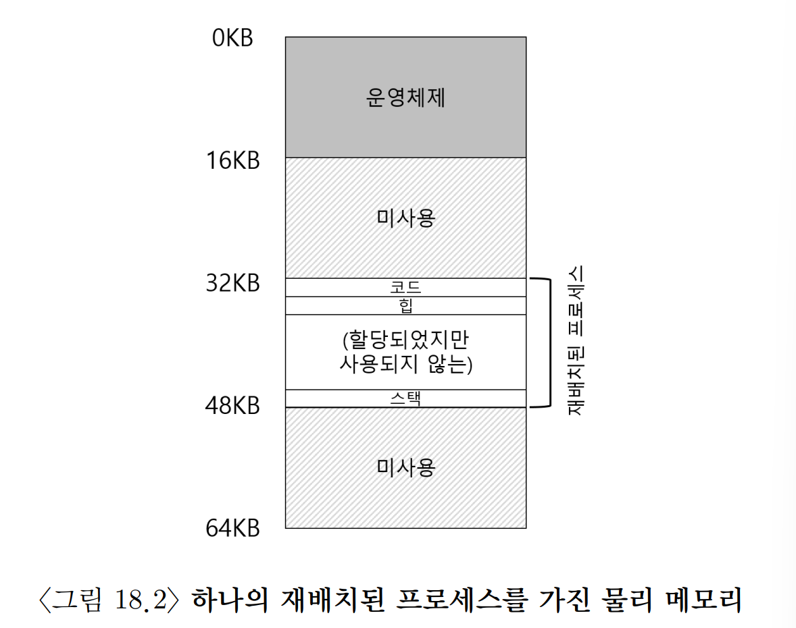
<br>

### 18-3. 동적(하드웨어-기반) 재배치

- `베이스와 바운드(base and bound)`, `동적 재배치(dynamic relocation)`

    - **베이스(base)** 레지스터, **바운드(boound)(=한계(limit))** 레지스터 쌍은 원하는 위치에 주소 공간을 배치할 수 있게 한다.

        - `베이스(base)`
        
            - 프로그램이 탑재될 물리 메모리 위치를 저장

        - `바운드(bound)`

            - 보호를 지원하기 위해 존재

            - 프로세스가 바운드보다 큰 가상 주소 또는 음수인 가상 주소를 참조하면 CPU는 예외를 발생시키고 프로세스를 종료한다.

    - 배치와 동시에 프로세스가 자신의 주소 공간에만 접근한다는 것을 보장한다.

    - 프로세서 변환식 : **physical address = virtal address + base**

    - `주소 변환` : 가상 주소에서 물리 주소로의 변환

        - 주소의 재배치는 실행 시와 실행을 시작한 이후에도 주소 공간을 이동할 수 있다. (= **동적 재배치**)

    - `메모리 관리 장치(Memory Management Unit, MMU)` : 주소 변환에 도움을 주는 프로세서의 일부

    - **바운드 레지스터의 방식**

        - **주소 공간의 크기를 저장하는 방식** : 하드웨어는 가상 주소를 베이스 레지스터에 더하기 전에 바운드 레지스터와 비교한다.

        - **주소 공간의 마지막 물리 주소를 저장하는 방식** : 하드웨어는 먼저 베이스 레지스터를 더하고 그 결과가 바운드 안에 있는지 검사한다.

- **예제**

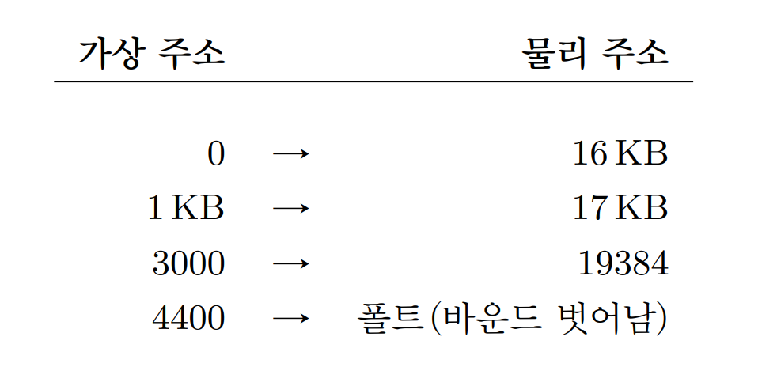

    - 가상 주소가 너무 크거나 음수일 경우 폴트를 일으키고 예외를 발생시킨다.

### 18-4. 하드웨어 지원: 요약

- `프로세서 상태 워드(processor status word)레지스터`의 한 비트가 CPU의 현재 실행 모드를 나타낸다.

- 하드웨어는 베이스와 바운드 레지스터 값을 변경하는 명령어를 제공

    - 다른 프로세스를 실행시킬때 운영체제가 명령어를 사용해 베이스와 바운드 레지스터 값을 변경할 수 있다.

    - 특권 명령어, 커널 모드에서만 실행가능하다.

- CPU는 사용자 프로그램이 바운드를 벗어난 주소로 불법적인 메모리 접근을 시도하려는 상황에서 예외를 발생시킬 수 있다.

    - 이 경우 CPU는 사용자 프로그램의 실행을 중지, 운영체제의 `"바운드 벗어남" 예외 핸들러`가 실행되도록 조치

- 사용자 프로그램이 특권이 필요한 베이스와 바운드 레지스터 값의 변경을 시도하면 CPU는 예외를 발생시키고 핸들러를 실행한다.

### 18-5. 운영체제 이슈

- 베이스, 바운드 가상 메모리 구현을 위해서 운영체제가 반드시 개입되어야 하는 3개의 시점

    1. 프로세스가 생성될 때 주소 공간이 저장될 메모리 공간을 찾아 조치한다.

        - 운영체제는 물리 메모리를 슬롯의 배열로 보고 각 슬롯의 사용여부를 관리한다.

        - 새로운 프로세스가 생성되면 운영체제는 새로운 주소 공간 할당에 필요한 영역을 찾기 위해 자료 구조(free list)를 검색한다.

        - 선택된 공간을 사용 중으로 표시한다.

    2. 프로세스가 종료할 때, 프로세스가 사용하던 메모리를 회수하여 다른 프로세스나 운영체제가 사용할 수 있게 한다.

        - 프로세스가 종료하면 운영체제는 종료한 프로세스의 메모리를 다시 빈 공간 리스트에 넣고 연관된 자료 구조를 모두 정리한다.

    3. 문맥 교환이 일어날 때에도 몇 가지 추가 조치한다.

        - 각 프로그램마다 다른 물리 주소가 탑재되어야 하기에 운영체제는 프로세스 전환 시 베이스 바운드 쌍을 저장하고 복원해야 한다.

        - 실행 중인 프로세스를 중단시키기로 결정하면 운영체제는 메모리에 존재하는 프로세스 별 자료 구조 안에 베이스 바운드 레지스터 값을 저장한다.

            - 이 때 자료구조를 `프로세스 구조체(process structure)`, `프로세스 제어 블록(process control block, PCB)`라고 한다.

        - 프로세스가 중단되면 운영체제가 메모리의 현 위치에서 다른 위치로 주소 공간을 비교적 쉽게 옮길 수 있다.

            - 이를 통해 프로세스 실행을 중지한 후 현재 위치에서 새 위치로 주소 공간을 복사하고, 프로세스 구조체에 저장된 베이스 값을 갱신하여 새 위치를 가리키게 한다.

    4. 운영체제는 예외 핸들러 또는 호출될 함수를 제공해야 한다.

        - 프로세스가 바운드 밖에 메모리에 접근해 예외가 발생하면, 운영체제가 조치를 취할 준비가 되어 있어야 한다.

    
    <br>

- **하드웨어/OS의 상호작용 타임라인**

    <br>
    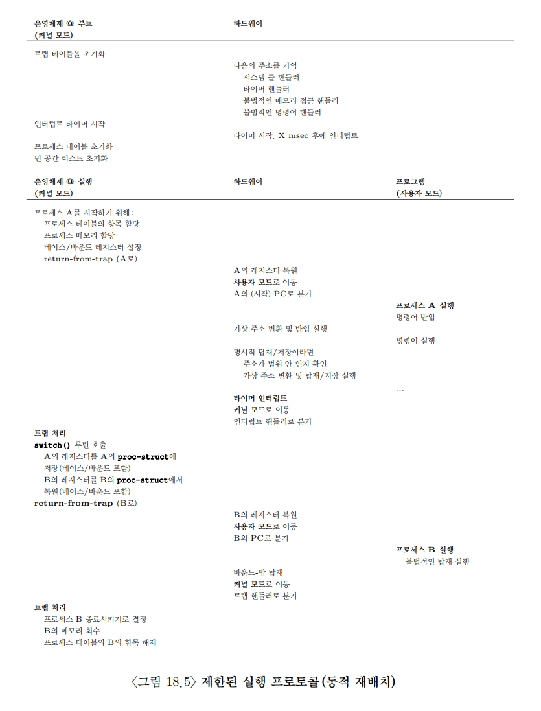
    <br>

    - 프로세스가 잘못된 행동을 했을 때만 운영체제가 개입한다.

### 18-6. 요약

- 보호는 운영체제의 가장 중요한 목표 중의 하나이다.

- 동적 재배치는 비효율적이다.

    - `내부 단편화(internal fragmentation)`

        - 스택과 힙 사이에 프로세스를 재배치하고 사용되지 않은 내부 공간

    - 물리 메모리의 이용률을 높이고 내부 단편화를 방지하기 위해 `세그멘테이션(segmentation)`이 등장한다.
    
## 19. 세그멘테이션

- 베이스 바운드 레지스터를 사용하면 스택과 힙 사이에 사용되지 않는 공간이 존재하며 물리 메모리를 차지한다.

    - 주소 공간이 물리 메모리보다 큰 경우 실행이 어렵다.

    - 이런 측면에서 베이스 바운드 방식은 유연성이 없다.

> **핵심 질문**  
> 대용량 주소 공간을 어떻게 지원하는가

### 19-1. 세그멘테이션: 베이스/바운드(base/bound)의 일반화

- `세그멘테이션(segmentation)`

    - MMU 안에 하나의 베이스/바운드 쌍이 아닌 주소 공간의 논리적인 세그멘트(segment) 마다 베이스/바운드 쌍을 관리하는 것

        - `세그멘트(segment)` : 특정 길이를 가지는 연속적인 주소 공간(코드, 스택, 힙)

        - 운영체제는 각 세그멘트를 물리 메모리의 각기 다른 위치에 배치할 수 있다.

        - 사용되지 않는 가상 주소 공간이 물리 메모리를 차지하는 것을 방지할 수 있다.

    - **예시**
        <br>
        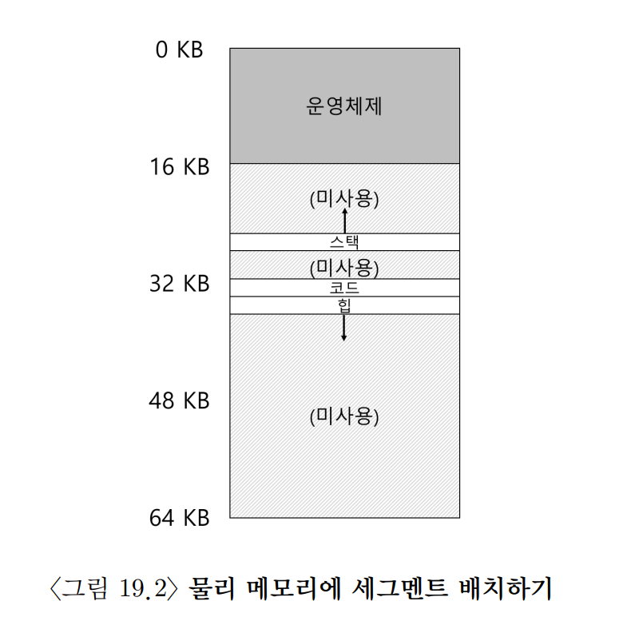
        <br>
        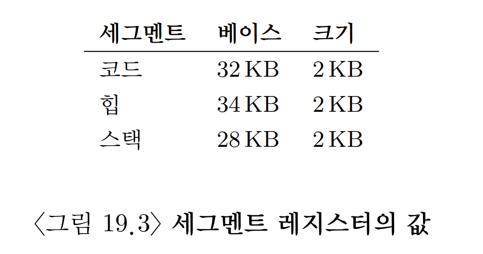
        <br>

        - `드문드문 사용되는 주소 공간(sparse address space)` : 사용되지 않는 영역이 많은 대형 주소 공간

        - 참조가 일어나면 하드웨어는 베이스 값에서 세그멘트의 **오프셋** 을 더해 물리 주소를 구한다.

            - **오프셋** : 주소가 참조하는 바이트가 세그먼트의 시작으로부터 몇 번째 바이트인지 나타내는 값

                - **변환식** : 가상 주소 - 베이스

    > **여담**: 세그멘트 폴트(segment fault)  
    > 세그멘트 사용 시스템에서 불법적인 주소 접근 시 발생한다.

### 19-2. 세그멘트 종류의 파악

- 하드웨어는 가상 주소가 어느 세그멘트를 참조하는지 그 세그멘트 안에서 오프셋은 얼마인지 어떻게 알 수 있는가?

    - 일반적인 접근법 : 가상 주소의 최상위 몇 비트를 기준으로 주소 공간을 여러 세그멘트로 나누는 것.


        
        <br>

        - 주소 공간을 세그멘트로 나누기 위해서는 2비트가 필요해 가상 주소 14비트 중 최상위 2비트를 사용해서 나타낸다.

        - 최상위 비트가 `00` -> 코드 세그멘트를 가리키며, 세그멘트의 베이스/바운드 쌍을 사용해 주소를 정확한 물리 메모리에 재배치

        - 최상위 비트가 `01` -> 힙 세그멘트를 가리키며, 세그멘트의 베이스/바운드 쌍을 사용해 주소를 정확한 물리 메모리에 재배치

        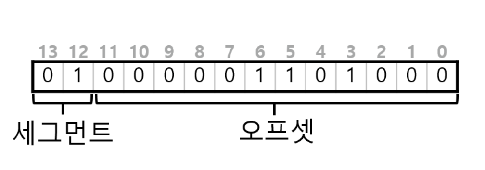
        <br>

    - 일부 시스템은 세그멘트를 구분할때 낭비를 줄이기 위해 코드와 힙을 하나의 세그멘트에 저장해 2비트가 아닌 1비트를 사용한다.

    - `묵시적(implicit) 접근 방식` : 주소가 어떻게 형성되었나를 관찰하여 세그멘트를 결정.

### 19-3. 스택

- 스택은 다른 세그멘트들과 다르게 반대 방향으로 확장된다. 때문에 다른 방식의 변환이 필요하다.

- 이를 위해 베이스 / 바운드 값뿐 아니라 세그멘트가 어느 방향으로 확장하는지 하드웨어가 알아야 한다.

- 스택 주소를 변환하려면 올바른 음수 오프셋을 얻어야 한다.

    - `음수 오프셋 식` : 가상 주소의 오프셋 - 세그멘트 최대 크기(4KB)

- 바운드 검사는 음수 오프셋의 절댓값이 세그멘트 크기보다 작다는 것을 통해 확인할 수 있다.

### 19-4. 공유 지원

- 메모리를 절약하기 위해 때로는 주소 공간들 간에 특정 메모리 세그멘트를 공유하는 것이 유용하다.

    - 일반적으로 코드 공유

- 공유를 지원하기 위해, 하드웨어에 `protection bit`의 추가가 필요하다.

    - 세그멘트를 읽거나 쓸 수 있는지 혹은 세그멘트의 코드를 실행시킬 수 있는지 판별한다.

    - 코드 세그멘트를 읽기 전용으로 설정하면 주소 공간의 독립성을 유지하면서, 여러 프로세스가 주소 공간의 일부를 공유할 수 있다.

    - 이때 각 프로세스는 자신의 전용 메모리를 사용하고 있다는 환상을 유지하게 된다.

        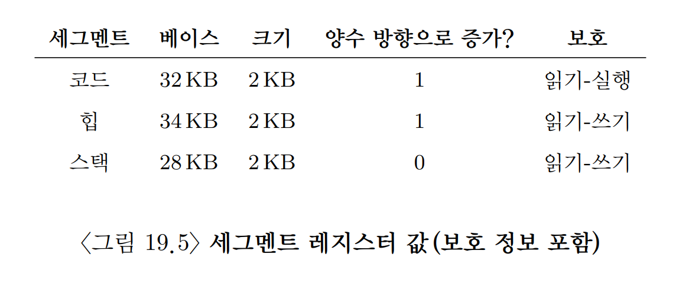
        <br>

    - protection bit을 사용하면 하드웨어 알고리즘이 수정되어야 한다.

        - 가상 주소가 범위 내에 있는지 확인하는 것 외에 특정 액세스가 허용되는지 확인해야 한다.
        
        - 사용자 프로세스가 읽기 전용 페이지에 쓰기를 시도하는 경우 또는 실행 불가 페이지에서 실행하려고 하면 하드웨어는 예외를 발생시켜 운영체제가 위반 프로세스를 처리할 수 있게 해야 한다.

### 19-5. 소단위 대 대단위 세그멘테이션

- `대단위(coarse-grained)` : 주소 공간을 비교적 큰 단위의 공간으로 분할하는 세그멘테이션

- `소단위(fine-grained)` : 주소 공간을 작은 크기의 공간으로 잘게 나누는 것을 허용하는 세그멘테이션

- `세그멘트 테이블`을 이용하면 매우 많은 세그멘트를 손쉽게 생성하고 융통성 있게 사용할 수 있다.

### 19-6. 운영체제의 지원

- 세그멘테이션의 문제

    1. 문맥 교환 시 운영체제는 어떤 일을 해야 하는가?

        - 세그멘트 레지스터의 저장과 복원

            - 운영체제는 프로세스가 다시 실행하기 전에 레지스터들을 올바르게 설정해야 한다.

    2. 물리 메모리 관리
        
        - 프로세스가 많은 세그멘트를 가질 수 있게 되면서 각각의 크기가 다를 수 있다.

        - `외부 단편화(external fragmentation)`

            - 물리 메모리가 빠르게 작은 크기의 빈 공간들로 채워지면 세그멘트를 할당하기 힘들며 기존 세그멘트를 확장하는 데도 어려워 관리하기 어렵다.

        - 해결책 : 기존의 세그멘트를 정리하여 물리 메모리를 **압축(compact)**
            
            
            <br>

            - 실행 중인 프로세스를 중단해야 압축을 할 수 있다.

            - 세그멘트 복사는 메모리에 부하가 큰 연산이고 일반적으로 상당량의 시간을 사용해 압축은 비용이 많이 든다.

            - 비용을 줄이기 위해 빈 공간 리스트를 관리하는 알고리즘 사용한다.

                - 최적 적합(best-fit)

                    - 빈 공간 리스트에서 요청된 크기와 가장 비슷한 크기의 공간을 할당

                - 최악 적합(worst-fit)

                - 최초 적합(first-fit)

                - 버디 알고리즘(buddy algorithm)

### 19-7. 요약

- **세그멘테이션의 장점**

    - 주소 공간 상의 논리 세그멘트 사이의 큰 공간에 대한 낭비를 피함으로 드문드문 사용되는 주소 공간을 지원할 수 있다.

    - 산술 연산이 쉽고 하드웨어 구현에 적합해 속도가 빠르며, 변환 오버헤드도 최소로 든다.

    - 코드 공유의 장점도 부가적으로 발생한다.

- **세그멘테이션의 문제점**

    - 외부 단편화 문제로 가변 길이 할당의 태생적인 문제는 회피하기 어렵다.

    - 아직 일반적인 드문드문 사용되는 주소 공간을 지원할 만큼 유연하지 못하다.
    
## 20. 빈 공간 관리

- 빈 공간 관리가 어려운 경우는 관리하는 공간이 가변 크기 빈 공간들의 집합으로 구성되어 있는 경우다.

> **핵심 질문**  
> 빈 공간을 어떻게 관리하는가?

### 20-1. 가정

- 합의 빈 공간을 관리하는 데는 일반적인 링크드리스트가 사용된다.

    - 영역 내의 모든 빈 청크에 대한 주소를 갖고 있다.

- 클라이언트에게 할당딘 메모리는 다른 위치로 재배치될 수 없다고 가정한다.

- 단편화 해결에 유용하게 사용되는 빈 공간의 압축은 이 경우 사용이 불가능하다.

### 20-2. 저수준 기법

- 할당기에서 사용되는 일반적인 기법

    - **분할(splitting)과 병합(coalescing)**

        
        <br>

        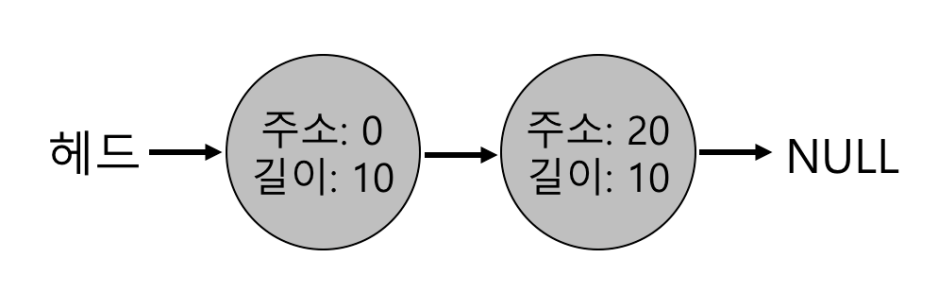
        <br>

        - 10바이트를 초과하는 모든 요청은 실패하여 NULL을 반환할 것이다.

        - 10바이트에 대한 요청은 둘 중 빈 청크를 사용하여 쉽게 충족된다.

        - 10바이트보다 적은 요청일 경우 할당기는 **분할(splitting)** 로 알려진 작업을 수행한다.

            - 요청을 만족할 수 있는 빈 청크를 찾아 이를 둘로 분할

            - 첫 번째 청크는 호출자에게 반환

            - 두 번째 청크는 리스트에 남긴다.

        - 분할에 동반되는 기법은 빈 공간의 **병합(coalescing)** 이다.

            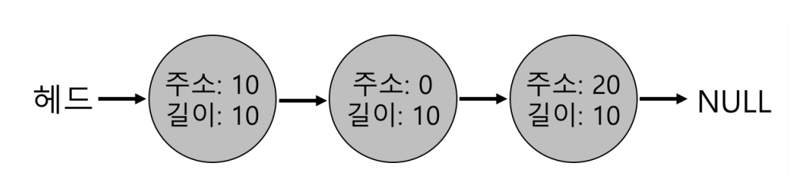
            <br>

            - 위의 예시에서처럼 사용 중인 공간을 반환해도 청크로 나눠져있다.

            - 메모리 청크를 반환할 때 해제되는 청크의 주소와 바로 인접한 빈 청크의 주소를 살펴본다.

            - 새로 해제된 빈 공간이 왼쪽의 빈 청크와 인접해 있다면 하나의 더 큰 빈 청크로 병합한다.

            - 병합 기법을 통해 할당기가 커다란 빈 공간을 응용 프로그램에게 제공할 수 있다는 것을 보장할 수 있다.

    - **할당된 공간의 크기 파악**

        - 할당기는 추가 정보를 **헤더(Header)** 블럭에 저장한다.

        - 헤더 블럭은 메모리에 유지되며 보통 헤제된 청크 바로 직전에 위치한다.

        
        <br>

        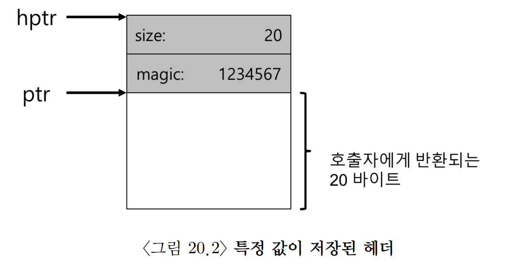
        <br>

        - 헤더에 보통 저장하는 정보

            - 할당된 공간의 크기

            - 해제 속도를 향상시키기 위한 추가의 포인터

            - 부가적인 무결성 검사를 제공하기 위한 매직 넘버

        - 빈 영역의 크기는 헤더 크기 + 사용자에게 할당된 영역의 크기이다.

    - **빈 공간 리스트 내장**

        - 리스트 노드

            ```cpp
            typedef struct __node_t {
                int size;
                struct __node_t *next;
            } node_t;
            ```
        
        - 메모리 청크가 요청되면 충분한 크기의 메모리에서 분할이 일어난다.

        - 만약 이 중 일부 메모리를 반환하면 단편화가 발생하게 된다.

        - 이때 리스트를 순회하면서 인접한 청크를 병합하면 힙은 하나의 큰 청크가 된다.

    - **힙의 확장**

        - 힙이 부족하면 할당기가 운영체제에게 더 많은 메모리를 요청한다.

        - 시스템 콜(ex: **sbrk**)을 호출한 후 확장된 영역에서 새로운 청크를 할당한다.

            - 시스템 콜을 수행하기 위해 운영체제는 빈 물리 페이지를 찾아 요청 프로세스의 주소 공간에 매핑한 후, 새로운 힙의 마지막 주소를 반환한다.

### 20-3. 기본 전략

- **최적 적합(Best Fit)**

    - 빈 공간 리스트를 검색하여 요청한 크기와 같거나 더 큰 빈 메모리 청크를 찾는다.

    - 그 중 가장 작은 크기의 청크를 반환한다.(= 최적 청크)

    - 정교하지 않은 구현은 해당 빈 블럭을 찾기 위해 항상 전체를 검색해야 하기에 성능 저하가 초래된다.

- **최악 적합(Worst Fit)**

    - 최적 적합의 반대 방식. 가장 큰 빈 청크를 찾아 요청된 크기 만큼만 반환하고 남는 부분은 빈 공간 리스트에 계속 유지한다.

    - 이 역시도 항상 빈 공간 전체를 탐색해야 하기에 높은 비용이 발생한다.

    - 엄청난 단편화가 발생해서 오버헤도도 큰 것으로 보인다.

- **최초 적합(First Fit)**

    - 요청보다 큰 첫 번째 블럭을 찾아서 요청만큼 반환한다.

    - 빈 공간 리스트 전체를 탐색할 필요가 없어서 빠르다.

    - 리스트 시작에 크기가 작은 객체가 많이 생길 수 있어 **주소-기반 정렬** 과 같은 추가적인 작업을 해야 하는 단점이 있다.

- **다음 적합(Next Fit)**

    - 마지막으로 찾았던 원소를 가리키는 추가의 포인터를 유지해 탐색을 진행하는 방식.

    - 리스트 첫 부분에만 단편이 집중적으로 발생하는 것을 방지한다.

    - 최초 적합과 성능이 비슷하다.

### 20-4. 다른 접근법

- **개별 리스트(Segregated Lists)**

    - 특정 응용 프로그램이 한두 개 자주 요청하는 크기가 있다면, 그 크기의 객체를 관리하기 위한 별도의 리스트를 유지하는 것.

    - **장점**

        - 특정 크기의 요청을 위한 메모리 청크를 유지함으로써 단편화 가능성을 줄일 수 있다.

        - 요청된 크기의 청크만이 존재하기 때문에 복잡한 리스트 검색 없이 할당과 해제 요청을 처리할 수 있다.

    - **문제점**

        - 지정된 크기의 메모리 풀과 일반적인 풀에 얼마만큼의 메모리를 할당해야 하는가?

        - 해결방법 : `슬랩 할당기(slab allocator)`

            - 커널이 부팅될 때 커널 객체를 위한 여러 `객체 캐시(object cache)`를 할당한다.

            - 기존에 할당한 캐시 공간이 부족하면 상위 메모리 할당기에게 추가 **슬랩** 을 요청한다.

                - 요청의 전체 크기는 페이지 크기의 정수배

            - 슬랩 내 객체들에 대한 참조가 0이 되면 상위 할당기가 슬랩을 회수한다. 

            - 반납된 객체들을 초기화된 상태로 리스트에 유지시켜 객체 당 잦은 초기화와 반납 작업을 피할 수 있어서 오버헤드가 감소된다.

- **버디 할당**

    - `이진 버디 할당기(binary buddy allocator)` : 합병을 간단히 하는 방법 중 하나

        
        <br>

        - 2의 거듭제곱 크기 만큼의 블럭만 할당할 수 있기 때문에 내부 단편화로 어려움을 겪을 수 있다.

        - 블럭이 해제될 때 예를 들어 8KB 블럭을 반환한다면, 할당기는 버디 8KB 블럭이 비어있는지 확인한다.

        - 블럭이 비어있다면 16KB로 병합하고, 16KB 블럭이 비어있다면 32KB로 병합하는 식으로 계속 재귀해 나간다.

- **기타 아이디어**

    - 앞서 말한 접근 방식들은 공통적으로 **확장성** 이 문제다.

    - 빈 공간의 개수가 늘어남에 따라 리스트 검색이 매우 느려질 수 있다.

    - 해당 비용을 줄이기 위한 할당기들

        - 균형 이진 트리(balanced binary tree)

        - 스플레이 트리(splay tree)

        - 부분 정렬 트리(partially ordered tree)

    - 멀티프로세서를 위한 할당기

        - Berger

        - Evans

        - glibc

## 21. 페이징: 개요

- `페이징(Paging)` : 가상 메모리 공간을 동일 크기의 조각으로 분할하는 것

    - 프로세스의 주소 공간을 가변 크기의 논리 세그멘트(ex: 코드, 힙, 스택)로 나누는 것이 아니라 고정 크기의 단위(=페이지)로 나눈다.

    - **페이지 프레임** : 물리 메모리를 고정 크기의 슬롯 배열로 나눈 것.

        - 각 프레임은 하나의 가상 메모리 페이지를 저장할 수 있다.

> **핵심 질문**  
> 페이지를 사용하여 어떻게 메모리를 가상화할 수 있을까?

### 21-1. 간단한 예제 및 개요


<br>

- 물리 메모리는 고정 크기 슬롯들로 구성된다.

- 가상 주소 공간의 페이지들은 물리 메모리 전체에 분산 배치된다.

- **페이징의 장점**

    - `유연성`

        - 페이징을 사용하면 프로세스의 주소 공간 사용 방식과는 상관없이 효율적으로 주소 공간 개념을 지원할 수 있다.

    -  `빈 공간 관리의 단순함`

        - 운영체제는 비어있는 아무 페이지에나 프로세스의 페이지를 할당할 수 있다.

- `페이지 테이블(page table)`

    - 주소 공간의 각 가상 페이지에 대한 물리 메모리 위치 기록을 위해 프로세스마다 유지하는 자료 구조

    - 주소 공간의 가상 페이지 주소 변환 정보를 저장

    - 각 페이지에 저장된 물리 메모리의 위치가 어딘지 알려준다.

    - 프로세스가 생성한 가상 주소의 변환을 위해 먼저 가상 주소를 가상 페이지 번호와 페이지 내의 오프셋 2개의 구성 요소로 분할한다.
    
    <br>
    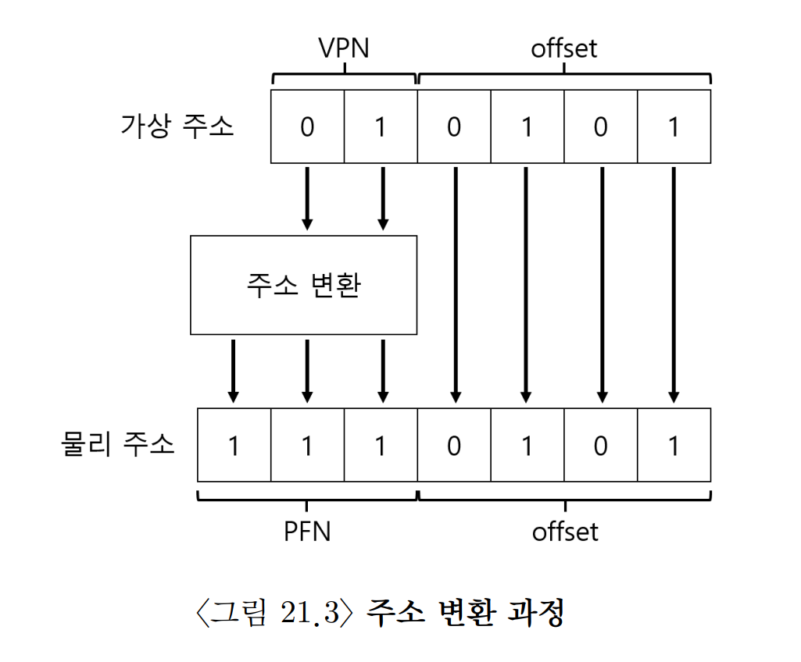
    <br>

    - 가상 주소의 구성 : 가상 페이지 번호(virtual page number, VPN), 오프셋(offset)

    - 물리 주소는 VPN을 물리 프레임 번호(physical page number, PPN)로 변환, 오프셋은 그대로 유지하면 얻을 수 있다.
    
### 21-2. 페이지 테이블은 어디에 저장되는가

- 페이지 테이블은 세그멘트 테이블이나 베이스/바운드 쌍에 비해 매우 커질 수 있다.

    - 때문에 현재 프로세스가 사용하고 있는 페이지 테이블 MMU 안에 저장하지 않고, 각 프로세스의 페이지 테이블을 **메모리에 저장** 한다.

### 21-3. 페이지 테이블에는 실제 무엇이 있는가

- 페이지 테이블은 가상 주소를 물리 주소로 매핑하는 데 사용되는 자료구조이며, 임의의 자료 구조도 사용 가능하다.

    - `선형 페이지 테이블(linear page table)`
    
        - 가장 간단한 형태로 단순한 배열


    - PTE의 비트

        - Valid bit : 특정 변환의 유효 여부를 나타내기 위해 포함된다.

            - 할당되지 않은 주소 공간을 표현하기 위해 필수

            - 주소 공간의 미사용 페이지를 표시함으로써 물리 프레임을 할당할 필요를 없애 대량의 메모리를 절약한다.

        - protection bit : 허용하지 않는 방식으로 페이지에 접근하려고 하면 운영체제에 트랩을 생성한다.

        - Present bit : 페에지가 물리 메모리에 있는지 혹은 디스크에 있는지 가리킨다. (스와핑 여부 확인)

        - dirty bit : 메모리에 반입된 후 페이지가 변경되었는지 여부

        - reference bit(accessed bit)
            
            - 페이지가 접근되었는지를 추적하기 위해 사용

            - 어떤 페이지가 인기가 있는지 결정하여 메모리에 유지되어야 하는 페이지를 결정하는 데 유용
        
        <br>       
        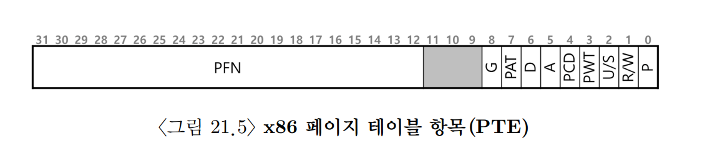
        <br>
        
        - `P` : Present bit

        - `R/W` : 페이지에 쓰기가 허용되는지 결정하는 읽기/쓰기 비트

        - `U/S` : 사용자 모드 프로세스가 페이지에 액세스 할 수 있는지를 결정하는 사용자/슈퍼바이저 비트

        - `PWT, PCD, PAT 및 G` : 페이지에 대한 하드웨어 캐시의 동작을 결정하는 몇몇 비트

        - `A` : reference bit

        - `D` : dirty bit

### 21-4. 페이징: 너무 느림

- 페이지 테이블의 크기가 매우 증가하면 처리 속도가 저하될 수 있다.

- `페이지 테이블 베이스 레지스터(page table base register)` : 페이지 테이블의 시작 주소(물리 주소)를 저장하는 레지스터

```cpp
// 원하는 PTE 위치를 찾기 위한 하드웨어 연산
VPN = (VirtualAddress & VPN_MASK) >> SHIFT
PTEAddr = PageTableBaseRegister + (VPN * sizeof(PTE))
```
- 물리 주소가 알려지면 하드웨어는 메모리에서 PTE를 반입할 수 있고, PFN을 추출하고, 가상 주소의 오프셋과 연결하여 원하는 물리 주소를 만든다.

```cpp
offset = VirtualAddress & OFFSET_MASK
PhysAddr = (PFN << SHIFT) | offset
```

- 하드웨어는 메모리에서 원하는 데이터를 가져와서 레지스터에 넣을 수 있다.

- 문제점 : 하드웨어와 소프트웨어의 신중한 설계 없이는 페이지 테이블로 인해 시스템이 매우 느려질 수 있으며 너무 많은 메모리를 차지한다.

### 21.5 메모리 트레이스

- 프로그램 실행되면, 각 명령어 반입 시 메모리가 2번 참조한다.


<br>

- 5번의 루프 반복에 대해 전체 과정을 담은 그래프이다.

- 1번째 그래프 : 페이지 테이블 메모리 접근 그래프

- 2번쨰 그래프 : 배열의 접근 그래프

- 3번째 그래프 : 명령어 메모리 참조 그래프

    - x축에서 루프 당 10번의 메모리 접근이 존재한다.

    - 4번의 명령어 반입, 1번의 메모리 갱신이 발생한다.

### 21-6. 요약

- **페이징의 장점**

    1. 메모리의 고정 크기의 단위로 나눈다.

    2. 가상 주소 공간의 드문 사용을 허용한다.

## 22. 페이징: 더 빠른 변환 (TLB)

- 페이지 테이블 접근을 위한 메모리 읽기 작업은 엄청난 성능 저하를 유발한다.

> **핵심 질문**  
> 주소 변환 속도를 어떻게 향상할까

- `변환-색인 버퍼(translation-lookaside buffer, TLB)` 
    
    - 주소 변환을 빠르게 하기 위한 버퍼

    - MMU의 일부

    - 자주 참조되는 가상 주소-실주소 변환 정보를 저장하는 하드웨어 캐시(`주소-변환 캐시(address-translation cache)`)

    - **방법**

        - 가상 메모리 참조 시, 하드웨어는 TLB에 원하는 변환 정보가 있는지 확인한다.

        - 있다면 페이지 테이블을 통하지 않고 변환을 수행한다.

### 22-1. TLB의 기본 알고리즘

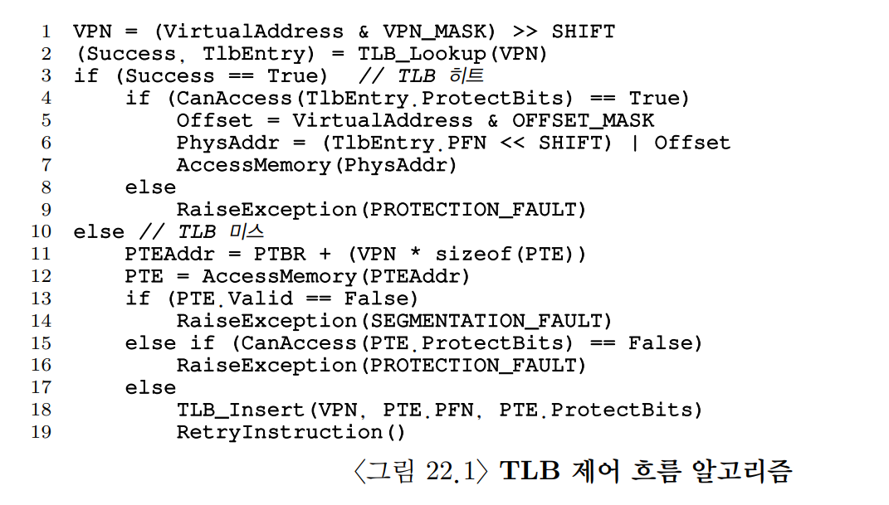
<br>

- TLB에 변환 정보가 존재함으로, 메모리 참조가 빠르게 처리된다.

- TLB 전제조건 : 주소 변환 정보가 대부분 캐시에 있다.

- TLB 미스가 많이 발생할수록 메모리 접근 횟수가 많아져 성능이 저하되기 때문에 TLB 미스율을 낮추는 것이 중요하다.

### 22-2. 예제: 배열 접근


<br>

- TLB는 `공간 지역성`으로 인해서 성능을 개선할 수 있다.

    - 배열의 항목들이 페이지 내에서 서로 인접해 있기 때문에, 페이지에서 첫 번째 항목을 접근할 때만 TLB 미스가 발생한다.

- TLB에서 페이지 크기는 중요한 역할을 하며, 정수 배열을 연속적으로 접근하는 프로그램의 경우 TLB 사용이 큰 개선 효과를 낸다.

- 루프 종료 후에도 배열을 사용한다면, 시간 지역성으로 인해 TLB의 성공률이 높아진다.

> **팁 : 가능하면 캐싱을 사용하자**  
> - 하드웨어 캐시 사용의 취지는 명령과 데이터 참조에 있어서 **지역성** 을 활용하는 것이다.
> - 목적은 필요한 메모리 내용을 매우 빠른 cpu 칩 내의 메모리에 위치시키고, 접근 지역성을 최대한 활용하는 것이다.
> - 속도가 빠를려면 크기가 작아야하기 때문에 캐시 역할을 하기 위해선 작아야만 한다.

### 22-3. TLB 미스는 누가 처리할까

- TLB 미스를 처리하는 방법은 하드웨어, 소프트웨어 두 가지가 있다. 

    - **하드웨어**

        1. 페이지 테이블에서 원하는 페이지 테이블 엔트리를 찾기

        2. 필요한 변환 정보를 추출

        3. TLB 갱신

        4. TLB 미스가 발생한 명령어를 재실행

    - 대표적인 예 : 인텔 x86 CPU, `멀티 레벨 페이지 테이블`을 사용

    - **소프트웨어**

        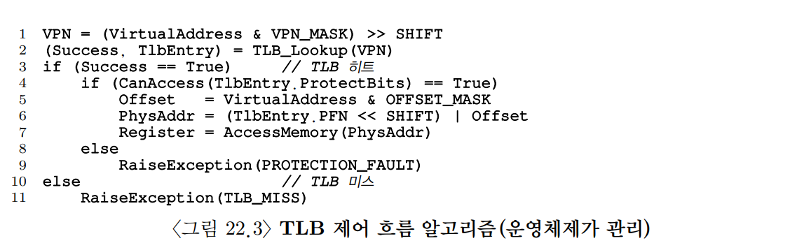
        <br>

        1. 하드웨어가 예외를 발생

        2. 운영체제가 예외 처리 루틴을 실행
        
        3. 트랩 핸들러 실행 - TLB 미스 해결을 위한 코드 실행

            - 기존 트랩 핸들러와 다르게 해당 핸들러는 명령어를 처음부터 다시 실행한다.

            - 핸들러 실행 시, 무한 반복되지 않도록 주의해야 한다.

        4. TLB 갱신 후 리턴

        5. 명령어 재실행


