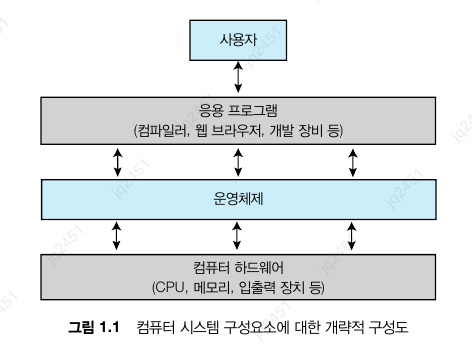
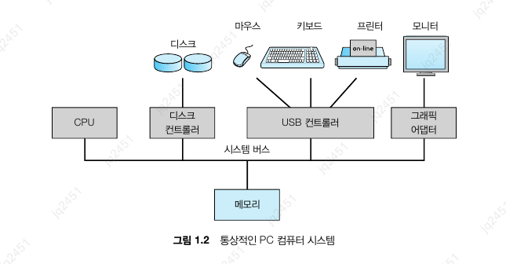
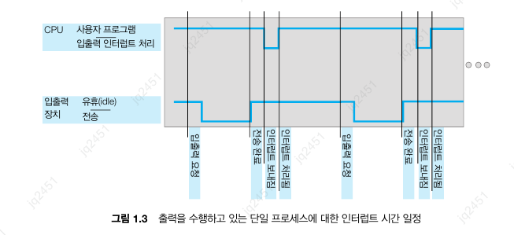
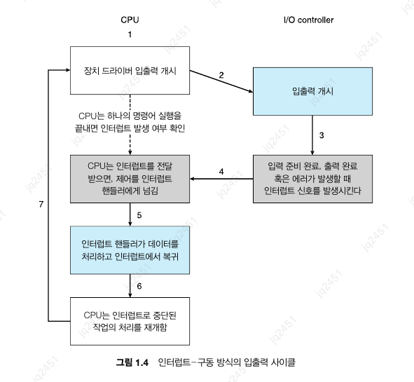
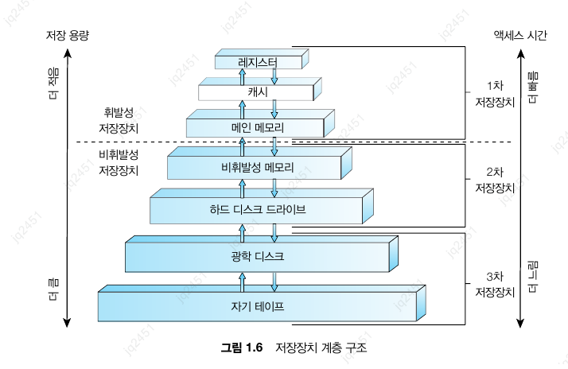
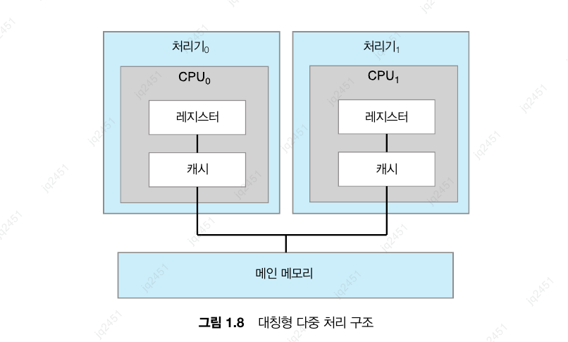
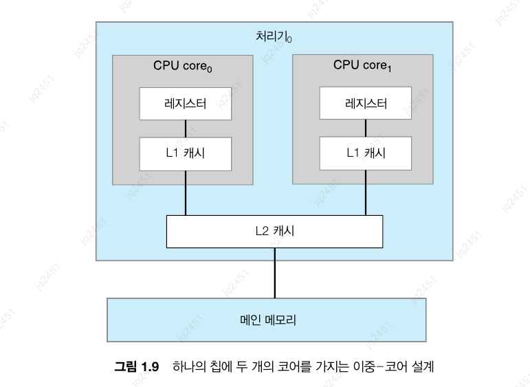
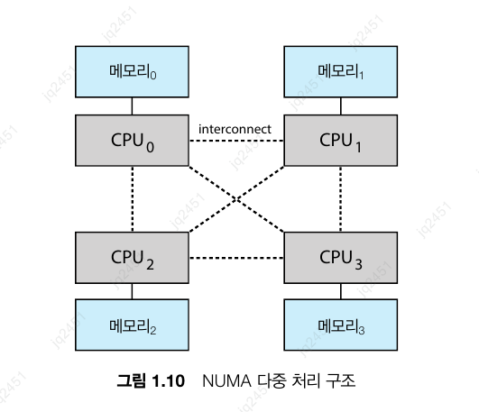

# chapter 1. 서론

`운영체제` : 컴퓨터 하드웨어를 관리하는 소프트웨어. 응용 프로그램을 위한 기반을 제공하며, 사용자와 하드웨어 사이의 중재자 역할을 수행한다.

## 1-1. 운영체제가 할 일

운영체제는 사용자를 위해 다양한 응용 프로그램 간의 하드웨어 사용을 제어하고 조정한다.

### 1-1-1. 사용자 관점

사용자 관점에선 사용하는 인터페이스에 따라 운영체제의 역할이 달라진다.

> ex) 랩톱, 혹은 PC의 경우
> - 한 사용자가 자원을 독점하도록 설계.
>
> - 사용의 용이성에 중점을 두고 설계되어 자원이 효율적으로 공유되는지에 크게 신경쓰지 않는다.

### 1-1-2. 시스템 관점

시스템 관점에서 운영체제는 `자원 할당자`로 볼 수 있다.

즉, 운영체제는 시스템을 효율적이고 공정하게 운영할 수 있도록 어느 요청에 자원을 할당할지 결정해야한다.

### 1-1-3. 운영체제의 정의

- `운영체제` : 컴퓨터에서 항상 실행되는 프로그램 (일반적으로 `커널`을 의미)
  - 커널 외에도 다음과 같은 두 가지 유형의 프로그램이 존재합니다.
    - `시스템 프로그램` : 운영체제와 관련되어 있지만, 커널의 일부는 아닌 프로그램
    - `응용 프로그램` : 시스템의 기본 작동과 직접적인 관련이 없는 모든 프로그램

> 💡 **요약**
> 
> 운영체제에는 항상 실행 중인 `커널`, 응용 프로그램 개발을 돕고 기능을 제공하는 `미들웨어 프레임워크`, 그리고 시스템 실행 중에 관리를 돕는 `시스템 프로그램`이 모두 포함된다.

## 1-2. 컴퓨터 시스템의 구성

컴퓨터 시스템은 하나 이상의 CPU와 구성요소와 공유 메모리 사이의 액세스를 제공하는 공통 **버스**를 통해 연결된 여러 장치 컨트롤러(예: 디스크 드라이브, 오디오 장치 또는 그래픽 디스플레이)로 구성되어있다.

### 1-2-1. 인터럽트

장치 드라이버에게 컨트롤러가 작업을 완료했다는 사실을 알리는데 사용하는 방식.

#### 1-2-1-1. 개요

인터럽트는 운영체제와 하드웨어의 상호 작용 방식의 핵심 부분.

인터럽트가 발생했을 때 CPU의 동작 과정은 다음과 같다.

1. `작업 중단 및 상태 저장`: CPU는 현재 실행 중이던 명령어를 멈추고, 나중에 되돌아올 수 있도록 현재 상태(레지스터 값, 프로그램 카운터 등)를 안전하게 저장한다.

2. `인터럽트 서비스 루틴(ISR) 실행`: 인터럽트의 종류를 파악한 뒤, 이를 처리하기 위해 운영체제 내에 미리 정의된  **인터럽트 서비스 루틴(ISR, Interrupt Service Routine)** 으로 제어권을 넘겨 필요한 작업을 수행한다.

3. `원래 작업 재개`: ISR의 처리가 완료되면, 처음에 저장해 두었던 상태를 복구하여 중단되었던 지점부터 다시 연산을 이어서 진행한다.

인터럽트는 `인터럽트 핸들러`에 의해 관리된다.

#### 1-2-1-2. 구현

그림과 같이 대부분의 인터럽트는 `인터럽트 핸들러`에 의해 처리되며, 비동기 이벤트에 CPU가 대응할 수 있게 한다.

최신 운영체제에서는 더욱 정교한 처리 기능이 요구된다.

1. 중요한 처리 중 인터럽트 처리를 연기할 수 있어야 한다. -> `마스킹 / 논마스킹 인터럽트`

2. 장치의 적절한 인터럽트 핸들러로 효율적으로 디스패치 할 방법이 필요하다. -> `인터럽트 체인`

3. 운영체제가 우선순위가 높은 인터럽트와 낮은 인터럽트를 구분하고 적절한 긴급도로 대응할 수 있도록 다단계 인터럽트가 필요하다. -> `인터럽트 우선순위 레벨`

### 1-2-2. 저장장치 구조

- CPU는 메모리에서만 명령을 적재할 수 있어 프로그램은 먼저 메모리에 적재해야 한다.

- 프로그램 대부분은 메인 메모리(`RAM`)라 불리는 재기록 가능한 메모리에서 가져온다.

- `부트스트랩` : 컴퓨터 전원 실행 시 가장 먼저 실행되는 프로그램, 운영체제를 적재한다.

- `EEPROM` : 속도가 느려 변경을 할 순 있지만 자주 변경할 수 없어, 주로 사용되지 않는 정적 프로그램과 데이터를 저장한다.(ex: iPhone의 장치 일련 번호)

- 모든 형태의 메모리는 바이트 배열로 저장되며, 상호 작용은 적재, 저장 명령을 통해 이루어진다.

  - `적재` : 메인 메모리로부터 CPU 내부의 레지스터로 데이터(1바이트 단위)를 옮기는 작업
  - `저장` : CPU 내부의 레지스터로부터 메인 메모리로 데이터(1바이트 단위)를 옮기는 작업

- `폰 노이만 구조 시스템의 명령-실행 사이클`

  1. 메모리로 명령을 인출
  2. 명령을 명령 레지스터(instruction register)에 저장
  3. 명령을 해독
  4. 해독된 명령을 실행
  5. 결과를 메모리에 다시 저장

- 프로그램과 데이터가 메인 메모리에 영구히 존재못하는 이유

  1. 메인 메모리는 모든 필요한 프로그램과 데이터를 영구히 저장하기에는 너무 작다.

  2. 메인 메모리는 전원을 공급하지 않으면 그 내용을 잃어버리는 휘발성 저장장치이다.

  - 상기 이유로 대부분의 시스템은 **보조저장장치** 를 제공한다.
    - 주요 요건 : 대량의 데이터를 영구히 보존할 수 있어야 한다.

    - 대표 예시 : HDD, NVM 등

- 저장장치는 저장 용량 및 액세스 시간에 따라 이미지와 같이 구성된다.

- 휘발성 저장장치는 `메모리`, 비휘발성 저장장치는 `NVS`라고 표현된다.

  - 기계적 NVS : HDD, 광 디스크, 홀로그램 저장 장치 및 자기 테이프

  - 전기적 NVS : FRAM, NRAM, SSD

### 1-2-3. 입출력 구조

- `DMA` : 장치에 대한 버퍼 및 포인터, 입출력 카운트를 세팅한 후 장치 제어기가 CPU의 개입없이 메모리로부터 자신의 버퍼 장치로 또는 버퍼로부터 메모리로 데이터 블록 전체를 전송한다.

  - 한 바이트가 아닌 블록 전송이 완료될 때마다 인터럽트가 발생해, 장치 컨트롤러가 전송 작업을 수행하고 있는 동안 CPU는 다른 작업을 수행할 수 있다.

## 1-3. 컴퓨터 시스템 구조

### 1-3-1. 단일 처리기 시스템

- `코어` : 명령을 실행하고 로컬로 데이터를 저장하기 위한 레지스터를 포함하는 구성 요소.

- 단일 처리 코어를 가진 범용 CPU가 하나만 있는 경우를 단일 처리기 시스템이라고 한다.

### 1-3-2. 다중 처리기 시스템

- 단일 코어 CPU가 있는 2 개 이상의 프로세서가 하나의 시스템에 연결된 경우를 다중 처리기 시스템이라고 한다.

- 여러 프로세서가 하나의 작업에 협력할 때 모든 프로세서가 올바르게 작동되게 유지하기 위해선 일정 양의 오버헤드가 발생한다.

- `SMP` : 가장 일반적인 다중 처리기 시스템

  - 모든 프로세서가 동일한 작업을 수행할 수 있으며, 모든 프로세서는 시스템 버스를 통해 물리 메모리에 접근한다.

- `다중 코어` : 하나의 칩에 여러 개의 코어가 포함된 SMP 시스템

  - 칩 내 통신이 칩 간 통신보다 빠르므로 단일 코어를 가지는 여러 칩보다 효율적이다.

  - 각 코어 별로 자체 레지스터 세트와 로컬 캐시를 가지며, 이를 통해 더 빠른 처리가 가능하다.

- `NUMA` : 다중 처리기 시스템의 한 종류로, 각 프로세서가 자신만의 로컬 메모리를 가지며, 로컬 메모리 간의 통신은 시스템 버스를 통해 이루어진다.

  - CPU가 로컬 메모리에 액세스할 때 빠르며, 시스템 상호 연결에 대한 경합도 없다.

  - CPU가 시스템 상호 연결을 통해 원격 메모리에 액세스해야 할 때 지연 시간이 증가하여 성능 저하가 발생할 수 있다.

- `블레이드 서버` : 다수의 처리기 보드 및 입출력 보드, 네트워킹 보드들이 하나의 새시(chassis) 안에 장착되는 형태