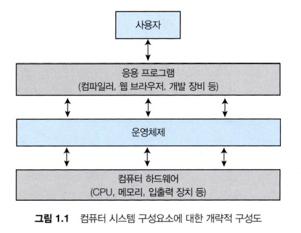
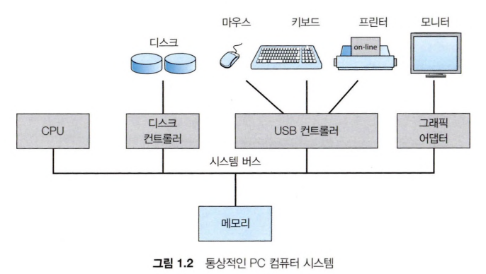
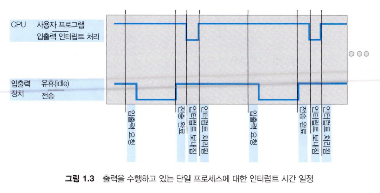
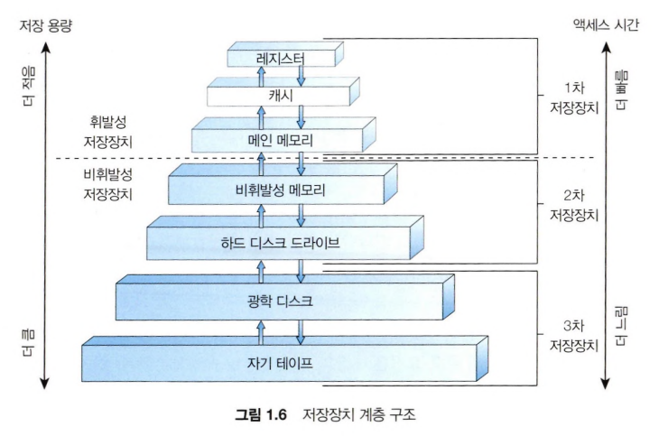
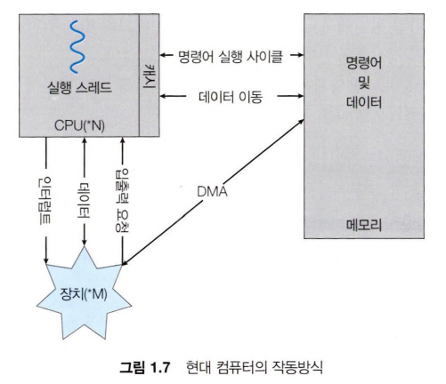

## 개요


## 1. 운영체제가 할 일
- 컴퓨터 시스템은 하드웨어, 운영체제, 운영 프로그램, 사용자로 구분할 수 있다
- 하드웨어: 중앙 처리 장치(CPU), 메모리 및 입출력(I/O) 장치로 구성되어, 기본 계산용 자원을 제공한다
- 응용 프로그램: 컴파일러, 웹 브라우저 등으로 사용자의 문제를 해결하기 위해 자원이 어떻게 사용될 지를 정의한다
- 운영체제: 응용 프로그램 <-> 하드웨어를 조정하거나 자원을 적절하게 사용할 수 있는 환경을 제공한다

### 1. 사용자 관점
- 사용자가 수행하는 작업의 편의성을 극대화하도록 설계되었으며, 자원 사용의 효율성은 크게 고려하지 않는다

### 2. 시스템 관점
- 운영체제는 하드웨어 가장 밀접하게 연관된 프로그램으로 **자원 할당자**의 역할도 있다
- 일종의 제어 프로그램으로 자원을 효율적으로 공정하게 운영할 수 있도록 결정한다

### 3. 운영체제의 정의
- 운영체제는 컴퓨터의 하드웨어 자원을 관리하고, 사용자와 하드웨어 사이에서 중재자 역할을 하는 소프트웨어이다.

## 2. 컴퓨터 시스템의 구성
- CPU와 구성요소와 공유 메모리 사이의 액세스를 제공하는 공통 버스를 통해 연결된 여러 장치 컨트롤러로 구성된다
  - 디스크 드라이브, 오디오 장치 등을 의미한다
  - 장치 컨트롤러에는 둘 이상 장치(USB 허브 등)가 연결될 수 있고 일부 로컬 버퍼 저장소와 특수 목적 레지스터 집합을 유지 관리한다
- 각 장치 컨트롤러마다 **장치 드라이버**가 있고 인터페이스를 제공한다
- CPU와 장치 컨트롤러는 병렬로 실행되어 메모리 사이클을 놓고 경쟁한다

| 단계 | 구성 요소 | 설명 |
|------|----------|------|
| 1 | 사용자 프로그램 | 사용자가 실행한 프로그램 |
| 2 | 운영체제(OS) | 자원 관리 및 중재 |
| 3 | 장치 드라이버 | OS ↔ 장치 연결 |
| 4 | 장치 컨트롤러 | 하드웨어 제어 |
| 5 | 실제 장치 | SSD, 키보드 등 |

### 1. 인터럽트
디스크 기준
1. 입출력 작업을 시작하기 위해 장치 드라이버는 장치 컨트롤러의 레지스터에 값을 설정한다
2. 장치 컨트롤러는 레지스터의 값을 읽어 수행할 작업을 결정한다
3. 장치에서 컨트롤러의 로컬 버퍼로 데이터 전송을 수행한다
4. 작업이 완료되면 장치 컨트롤러는 인터럽트를 발생시켜 CPU(운영체제)에 알린다
5. 운영체제는 인터럽트를 처리하고, 해당 장치 드라이버를 실행한다
6. 장치 드라이버는 읽기 요청인 경우 데이터를 전달하고 제어를 반환한다



#### 1). 개요
1. 장치가 인터럽트 발생
2. CPU가 현재 작업 멈춤
3. 인터럽트 처리 루틴(ISR)으로 점프
4. ISR 실행
5. 원래 하던 작업으로 복귀



#### 2). 구현
### 2-1. 인터럽트 요청 라인 (IRQ: Interrupt Request Line)

- CPU에는 **인터럽트 요청 라인(IRQ)**이 존재한다.
- CPU는 **하나의 명령어(instruction) 실행을 완료할 때마다** 이 라인을 감지(polling)한다.
- 장치 컨트롤러가 인터럽트 신호를 IRQ 라인에 전송하면 CPU가 이를 포착한다.

### 2-2. 인터럽트 처리 흐름

```
장치 컨트롤러
    │
    │ ① 인터럽트 신호 전송 (IRQ)
    ▼
  CPU
    │
    │ ② 인터럽트 번호 읽기
    │ ③ 인터럽트 벡터 테이블에서 핸들러 주소 조회
    │ ④ 현재 레지스터 상태/PC 저장 (컨텍스트 저장)
    │ ⑤ 인터럽트 핸들러(ISR)로 점프
    ▼
인터럽트 핸들러 (ISR)
    │
    │ ⑥ 장치 서비스 처리
    │ ⑦ 인터럽트 클리어 (ACK)
    ▼
  CPU
    │
    ⑧ 저장된 컨텍스트 복원 → 원래 실행 흐름 재개
```

### 2-3. 인터럽트 벡터 (Interrupt Vector)

- 인터럽트 번호를 **인덱스**로 사용하는 배열 구조이다.
- 각 엔트리에는 해당 인터럽트를 처리할 **인터럽트 핸들러 루틴의 주소**가 저장된다.
- 예: x86 아키텍처의 IDT(Interrupt Descriptor Table)

```
인터럽트 벡터 테이블
┌────┬────────────────────────┐
│  0 │ Divide Error Handler   │
│  1 │ Debug Handler          │
│  2 │ NMI Handler            │
│  ...                        │
│ 32 │ Timer ISR              │
│ 33 │ Keyboard ISR           │
│ ...│ ...                    │
└────┴────────────────────────┘
```

---

## 3. 최신 운영체제의 정교한 인터럽트 처리

단순한 기본 메커니즘 외에, 최신 OS는 다음 세 가지 요구사항을 충족해야 한다.

| # | 요구사항 | 설명 |
|---|----------|------|
| 1 | **인터럽트 지연(Deferral)** | 중요한 처리 중에는 인터럽트 처리를 연기할 수 있어야 한다 |
| 2 | **효율적 디스패치** | 장치에 적절한 핸들러를 빠르게 연결하는 방법이 필요하다 |
| 3 | **다단계 인터럽트(Multi-level Interrupt)** | 우선순위 기반으로 긴급도에 맞는 대응을 할 수 있어야 한다 |

---

## 4. 인터럽트 요청 라인의 종류

대부분의 CPU에는 **두 가지 인터럽트 요청 라인**이 있다.

### 4-1. 마스크 불가능 인터럽트 (NMI: Non-Maskable Interrupt)

- CPU가 절대로 무시하거나 연기할 수 없는 인터럽트이다.
- **복구 불가능한 하드웨어 오류**를 위해 예약된다.
    - 예: 복구할 수 없는 메모리 오류(ECC uncorrectable error), 하드웨어 워치독 타임아웃
- 시스템 안정성과 무결성을 위해 반드시 즉시 처리되어야 한다.

### 4-2. 마스킹 가능 인터럽트 (Maskable Interrupt)

- CPU의 **인터럽트 플래그(IF: Interrupt Flag)**를 통해 활성화/비활성화할 수 있다.
- 인터럽트되어서는 안 되는 **중요한 명령 시퀀스(Critical Section)** 실행 전에 CPU에 의해 꺼진다.
- x86 기준: `CLI` 명령어로 끄고, `STI` 명령어로 켠다.

```asm
CLI          ; 마스킹 가능 인터럽트 비활성화 (Clear Interrupt Flag)
; ─── Critical Section ───
; 인터럽트되면 안 되는 중요한 코드 실행
; ────────────────────────
STI          ; 마스킹 가능 인터럽트 재활성화 (Set Interrupt Flag)
```

---

## 5. 인터럽트 체인 (Interrupt Chaining)

### 5-1. 배경

- 인터럽트 벡터 테이블의 엔트리 수는 제한적이다.
- 그러나 시스템에 연결된 장치(핸들러)의 수는 벡터 테이블 크기를 초과할 수 있다.
- 이 문제를 해결하기 위한 기법이 **인터럽트 체인**이다.

### 5-2. 동작 방식

- 인터럽트 벡터의 각 엔트리가 단일 핸들러 주소가 아닌, **핸들러들의 연결 리스트(Linked List)**를 가리킨다.
- 인터럽트 발생 시 해당 체인의 핸들러를 **순차적으로 호출**하며, 자신이 처리 가능한 핸들러가 인터럽트를 처리하고 체인을 중단시킨다.

```
인터럽트 벡터[N]
    │
    ▼
핸들러 A → 핸들러 B → 핸들러 C → NULL
   │            │            │
(처리 불가)  (처리 불가)  (처리 완료 → 체인 중단)
```

### 5-3. 활용 예

- Linux 커널의 `request_irq()` 등록 시, 동일한 IRQ 번호를 여러 드라이버가 공유하는 경우(IRQF_SHARED 플래그)에 인터럽트 체인 방식으로 관리된다.

---

## 6. 인터럽트 우선순위 (Interrupt Priority Levels, IPL)

### 6-1. 개념

- 모든 인터럽트가 동등하게 중요하지 않다.
- **다단계 인터럽트 우선순위**를 통해 OS는 긴급도에 따라 인터럽트를 선택적으로 처리한다.

### 6-2. 동작 방식

- CPU는 현재 처리 중인 인터럽트의 우선순위 레벨(IPL)을 기록한다.
- 새로 도착한 인터럽트의 우선순위가 현재 IPL보다 **높으면** → 즉시 처리(선점)
- 새로 도착한 인터럽트의 우선순위가 현재 IPL보다 **낮거나 같으면** → 대기(Pending)

```
우선순위 (높음)
    │  NMI (최고 우선순위, 마스크 불가)
    │  하드웨어 오류
    │  타이머 인터럽트
    │  디스크 I/O 완료
    │  네트워크 패킷 수신
    │  키보드/마우스 입력
우선순위 (낮음)
```

### 6-3. 하드웨어 지원

- **APIC(Advanced Programmable Interrupt Controller)**: x86 시스템에서 다수의 인터럽트 소스를 관리하고 우선순위를 조정한다.
- **GIC(Generic Interrupt Controller)**: ARM 계열 프로세서에서 사용되는 인터럽트 컨트롤러.

---

## 7. 인터럽트 처리의 두 단계 (Top Half / Bottom Half)

최신 OS(특히 Linux)에서는 인터럽트 핸들러를 두 단계로 분리하여 응답성을 높인다.

| 단계 | 명칭 | 특징 |
|------|------|------|
| 1단계 | **Top Half (ISR)** | 인터럽트 비활성화 상태로 실행. 최소한의 긴급 처리만 수행하고 빠르게 반환. |
| 2단계 | **Bottom Half** | 인터럽트 활성화 상태로 실행. 무거운 처리(메모리 할당, 프로토콜 처리 등)를 지연 수행. |

Bottom Half 구현 방식:
- **Softirq**: 커널이 사전 정의한 고정된 소프트웨어 인터럽트 타입
- **Tasklet**: Softirq 기반의 동적 등록 가능한 경량 작업 단위
- **Work Queue**: 커널 스레드 컨텍스트에서 실행되는 지연 작업

```angular2html
인터럽트 요청 (IRQ)
        │
        ▼
  마스킹 가능?
  ┌─────┴─────┐
 아니오      예
  │           │
 NMI      IF(인터럽트 플래그) 활성화 상태?
  │         ┌──────┴──────┐
  │        아니오          예
  │         │              │
  │      무시(Pending)    인터럽트 벡터 조회
  │                        │
  └──────────────────────▶ 우선순위 비교
                            │
                  현재 IPL보다 높음?
                  ┌──────┴──────┐
                 아니오          예
                  │              │
               Pending    컨텍스트 저장 → ISR 실행
                                  │
                           Top Half (긴급 처리)
                                  │
                           Bottom Half (지연 처리)
                                  │
                           컨텍스트 복원 → 재개
```

### 2. 저장장치 구조
- CPU는 메모리에서만 명령을 적재할 수 있어서 실행하려면 먼저 프로그램을 메모리에 적재해야 한다
- 대부분은 메인 메모리를 사용하지만 다른 형태의 메모리도 사용한다
  - 가장 먼저 실행되는 프로그램은 부트스트랩 프로그램이며 운영체제를 적재하지만 RAM은 휘발성이므로 읽기 가능 전용 메모리(EEPROM) 및 기타 형태의 펌웨어를 사용한다
- 모든 메모리는 바이트의 배열을 제공하고, 데이터들은 자신의 주소를 가지며 특정 메모리 주소들에 대한 적재, 저장 명령을 통해 이뤄진다
- 적재 명령은 메인 메모리 -> CPU 레지스터로 한 바이트 또는 한 워드를 옮기는 것이다
  - 저장 명령은 레지스터의 내용을 메인 메모리로 옮긴다
- 전형적인 명령-실행 사이클은 먼저 메모리로부터 명령을 인출해, 명령 레지스터에 저장한다
- 보조저장장치로 데이터는 영구히 저장하고 이를 NVS라고 한다
  - 기계적 보조 저장 장치: HDD, 광 디스크, 자기 테이프 등
  - 전기적 보조 저장 장치: 플래시 메모리, FRAM, NARM, SDD이다. NVM이라고도 한다



### 3. 입출력 구조
- NVS I/O 대량 데이터 이동은 높은 오버헤드를 유발할 수 있어 직접 메모리 액세스(DMA)를 사용한다
- 장치에 대한 버퍼 및 포인터, 입출력 카운트를 세팅한 후 장치 제어기는 CPU의 개입 없이 메모리로부터 자신의 버퍼 장치로 또는 버퍼로부터 메모리로 데이터 블록 전체를 전송한다
  - 즉 블록 전송이 완료될 때마다 인터럽트가 발생한다
- 몇몇의 고가의 시스템은 버스 대신 스위치 구조를 사용하여 사이클을 경쟁하지 않고 동시에 통신하는 것이 가능하여, DMA의 사용이 더욱 효과적이다



## 3. 컴퓨터 시스템 구조
- 컴퓨터 시스템은 범용 처리기의 수에 따라 다양한 방식으로 구성될 수 있다

### 1. 단일 처리기 시스템
- 단일 코어를 가진 CPU